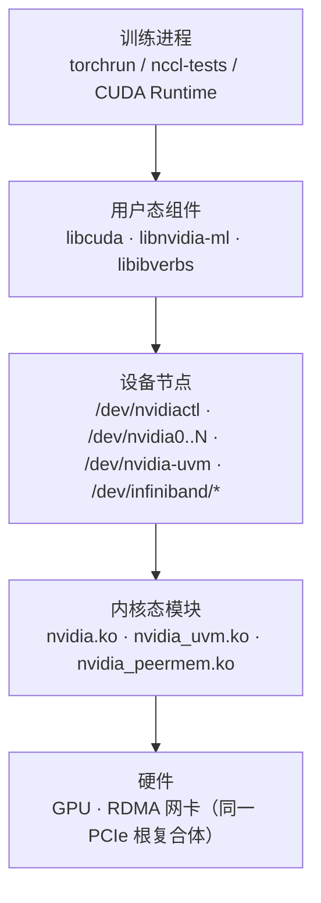
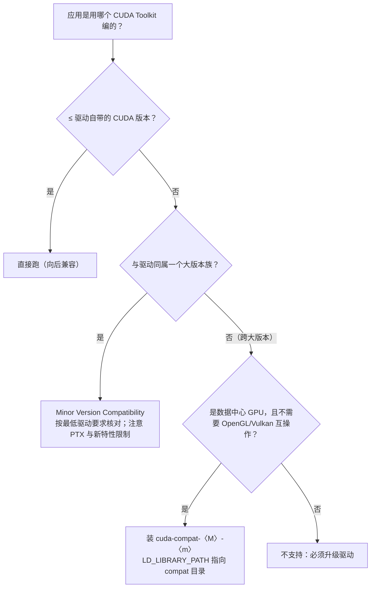
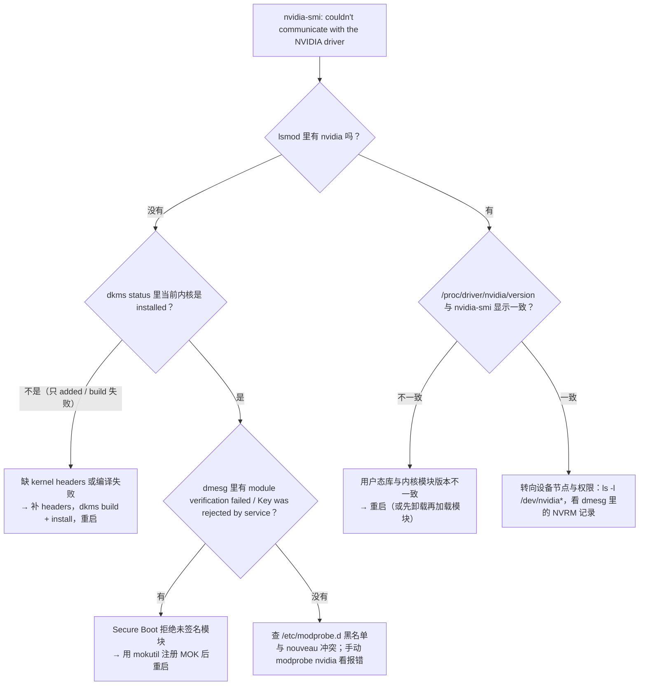

---
tags:
  - AI-Infra
  - GPU
created: 2026-09-15
---

# 驱动与内核模块

> 本笔记对应 [[AI-Infra/00_简介|AI-Infra 大纲]] 的「阶段 1」。目标：讲清驱动 ↔ CUDA ↔ NCCL ↔ OFED 的兼容关系，并能安全地升级与回滚。
>
> **状态**：已展开（2026-09-17）。
>
> 关联复习：[[AI-Infra/00_简介|00_简介]]、[[02_GPU拓扑与PCIe_NUMA]]、[[05_容器内GPU与RDMA]]、[[04_perftest与性能基线]]
>
> 说明：本文命令与结论以 NVIDIA 官方文档为准（CUDA Compatibility、Driver Installation Guide、GPUDirect RDMA、Container Toolkit、Driver Persistence、NCCL User Guide）。**凡涉及版本数字的地方，落地前必须对照官方文档与手上机器的实际输出**；文中示例输出的卡型号与版本号只是示意，你的机器一定不同。

## 0. 30 秒速览

> [!abstract] 这一页只要记住 6 句话
> - **驱动是「三件套」，不是一个包**：内核态模块（`nvidia.ko` 等）+ 用户态库（`libcuda.so` / `libnvidia-ml.so`）+ 设备节点（`/dev/nvidia*`）。缺哪一件，报错都不一样——先定位层次，再敲命令。
> - **`nvidia-smi` 通 ≠ CUDA 能用**：`nvidia-smi` 只依赖 NVML 与 `/dev/nvidiactl` + `/dev/nvidiaN`；CUDA 还要 `/dev/nvidia-uvm`。容器里最常见的翻车就是「`nvidia-smi` 正常、CUDA 报 999」。
> - **版本按四元组记录**：驱动 / CUDA / NCCL / OFED（RDMA 场景再加密卡固件）。官方兼容表给了底线数字：**CUDA 13.x 最低驱动 580、12.x 最低 525、11.x 最低 450**。
> - **GPUDirect RDMA 的开关是 `nvidia_peermem`**：没加载时数据要「先落到 CPU 内存再上网卡」（NCCL 文档原话），带宽与延迟同时退化；而它**不会自动加载**，需要手动 `modprobe`。
> - **内核升级是 GPU 失联的头号原因**：DKMS 重编失败（通常是缺 kernel headers）→ 新内核下没有 `nvidia.ko` → `nvidia-smi` 报 couldn't communicate with the NVIDIA driver。
> - **生产默认值**：用发行版 / NVIDIA 仓库包（不用 `.run`）+ 按节点池锁版本（APT pinning / `dnf versionlock`）+ 常开 persistence（优先 `nvidia-persistenced`）。

## 1. 概念

### 1.1 先分清三层：报错落在哪一层

一块 GPU 要被用起来，必须同时具备三层东西。**排障的第一动作不是敲命令，而是判断报错落在哪一层**——`nvidia-bug-report.sh` 收集的、`dmesg` 里刷屏的，绝大多数是第 3 层的信息。



| 层 | 代表组件 | 谁提供 | 这一层坏了的现象 |
| --- | --- | --- | --- |
| 用户态 | `libcuda.so`、`libnvidia-ml.so`（NVML）、`libcudart.so` | 驱动包 / CUDA Toolkit | `Driver/library version mismatch`；容器里版本与宿主机不一致 |
| 设备节点 | `/dev/nvidiactl`、`/dev/nvidia0..N`、`/dev/nvidia-uvm` | udev（兜底 `nvidia-modprobe`）/ 容器运行时 | `nvidia-smi` 报 couldn't communicate；容器里 CUDA 报 999 |
| 内核态 | `nvidia.ko`、`nvidia_uvm.ko`、`nvidia_peermem.ko`… | 驱动包（DKMS 编译或预编译） | `lsmod` 里看不到模块；`dmesg` 里有 `NVRM` 报错；XID 也在这层上报 |

> [!important] 记住这条分界线：`nvidia-smi` 走 NVML，CUDA 走 UVM
> `nvidia-smi` 只需要 `/dev/nvidiactl` 与 `/dev/nvidiaN`；**CUDA 还必须能打开 `/dev/nvidia-uvm`**（统一内存 / UVM 子系统）。所以「`nvidia-smi` 正常」只能证明内核模块与 NVML 这条链路通了，**证明不了 CUDA 能用**。现场被问「容器里 smi 正常、CUDA 起不来」，第一反应就该是比对两边的 `/dev/nvidia*` 清单。

### 1.2 内核模块：五个 `.ko` 各管一摊

官方 Driver Installation Guide 明确列出 NVIDIA Linux 驱动包含这五个内核模块（**注意文件名用短横线，加载后在 `lsmod` 里显示为下划线**，两种写法 `modprobe` 都能识别）：

| 模块文件 | `lsmod` 里的名字 | 干什么 | 少了会怎样 |
| --- | --- | --- | --- |
| `nvidia.ko` | `nvidia` | 核心：GPU 初始化、显存管理、CUDA 驱动接口 | 什么都不用谈了，`nvidia-smi` 直接失联 |
| `nvidia-uvm.ko` | `nvidia_uvm` | Unified Memory / 统一地址空间，CUDA 上下文依赖它 | `nvidia-smi` 仍正常，CUDA 程序初始化失败 |
| `nvidia-modeset.ko` | `nvidia_modeset` | 显示模式设置（DRM/KMS 相关） | 无显示器节点时无影响；图形环境 / X 起不来 |
| `nvidia-drm.ko` | `nvidia_drm` | DRM 接口，给 Wayland / 合成器用 | 同上，计算节点可忽略 |
| `nvidia-peermem.ko` | `nvidia_peermem` | 把 GPU 注册给 IB 子系统，实现 **GPUDirect RDMA** | 网卡只能读写主机内存，GDR 退化（见 1.4 与 3.4） |

> [!note] 开源模块与专有模块（515 起的两套 flavor）
> 从 515 系列起，这些模块有两种 flavor：**专有**（历史默认）与**开源**（双许可 MIT/GPLv2，源码在 NVIDIA/open-gpu-kernel-modules）。**从 560 系列起开源 flavor 成为默认安装**，要求 GPU 为 Turing 或更新。包名上体现为 `nvidia-open` / `nvidia-dkms-open` / `kmod-nvidia-open-dkms` 等。对运维的意义：内核升级时容易编译失败的往往是开源模块 + DKMS 这条组合，出问题时先看 `dkms status`。

> [!note] `nvidia_peermem` 取代了旧的 `nv_peer_mem`
> 官方 GPUDirect RDMA 文档写明：旧的 off-tree `nv_peer_mem` 模块（来自 Mellanox 的 nv_peer_memory 项目）**在 R470 及更新的驱动上已被弃用**，由驱动自带的 `nvidia-peermem` 取代。**两者只能加载一个**——这也是为什么接手老机器时常会撞见「两个都装了、结果谁都没生效」的状态（清理步骤见 3.4）。

### 1.3 设备节点：用户态与内核态的约定接口

```text
$ ls -l /dev/nvidia*
crw-rw-rw- 1 root root 195,   0 Sep 17 10:00 /dev/nvidia0
crw-rw-rw- 1 root root 195, 255 Sep 17 10:00 /dev/nvidiactl
crw-rw-rw- 1 root root 240,   0 Sep 17 10:00 /dev/nvidia-uvm
```

| 节点 | 用途 | 谁创建 | 权限特征 |
| --- | --- | --- | --- |
| `/dev/nvidia0 .. N` | 每张 GPU 一个 | udev；兜底 `nvidia-modprobe` | `0666` |
| `/dev/nvidiactl` | 控制设备（枚举卡、发控制命令） | 同上 | 主设备号 195、次设备号 255 |
| `/dev/nvidia-uvm` | UVM 子系统，**CUDA 必需** | 同上 | 主设备号**动态分配**，别写死 |
| `/dev/nvidia-caps/*` | MIG 等能力设备 | `nvidia-modprobe -f <capability>` | 按能力拆分 |
| `/dev/nvidia-uvm-tools` | UVM 调试工具（部分发行版/驱动才创建） | 同上 | 排障时顺手看一眼即可 |

> [!important] 谁负责创建节点：udev 为主，`nvidia-modprobe` 兜底
> `nvidia-modprobe` 的手册页原话是：它被 NVIDIA 用户态组件用来「确保内核模块已加载、字符设备文件已存在」，这些事**通常由发行版的 udev 提供**；这个工具只是「以发行版无关的方式开箱即用」的 fallback，安装后是 **setuid root**，用户一般不需要手动运行。
> 这解释了两件事：**①** 主设备号 195 是约定的，但 `nvidia-uvm` 的号是动态的（官方脚本用 `grep nvidia-uvm /proc/devices` 取）；**②** 容器里必须由运行时把**宿主机已有的节点**注入进来——容器里既没有 udev 的完整能力，也不该让进程去 mknod。

**容器侧的工具链是一条链**（细节见 [[05_容器内GPU与RDMA]]）：`nvidia-container-runtime`（自 2019 起只是原生 runC 的薄封装）→ prestart hook（`nvidia-container-toolkit`）→ `nvidia-container-cli`（`libnvidia-container`）→ 把设备节点、驱动库、能力集注入容器。`nvidia-ctk` 是你操作这条链的配置入口。

```text
# 配置运行时（docker / containerd / crio）
$ sudo nvidia-ctk runtime configure --runtime=docker
# 显式指定卡与能力集：--gpus 是语法糖，能力集会替换而不是叠加
$ docker run --rm --gpus 'all,"capabilities=compute,utility"' nvidia/cuda nvidia-smi
# 等价的环境变量写法（默认能力集是 utility,compute）
$ docker run --rm -e NVIDIA_VISIBLE_DEVICES=all -e NVIDIA_DRIVER_CAPABILITIES=compute,utility nvidia/cuda nvidia-smi
```

`NVIDIA_DRIVER_CAPABILITIES` 的语义要记死：**它是「设置」不是「追加」**，写少了就等于把默认能力集删掉。所以一旦你写了 `capabilities=utility`，CUDA（`compute`）就没了。

### 1.4 版本四元组：驱动 ↔ CUDA ↔ NCCL ↔ OFED

> [!important] 说一个版本号是没有意义的
> 现场讲兼容性，正确姿势是**先说「这是一个四元组，要一起记录」**，再给底线数字。因为升任意一个都可能让原组合破功，而它们的约束方向并不一致：
>
> - **CUDA ↔ 驱动**：由 NVIDIA 定义，方向是「新 CUDA 需要够新的驱动」；
> - **NCCL ↔ CUDA**：NCCL 是按 CUDA 大版本编译发布的（包名带 `+cudaX.Y` 后缀）；
> - **OFED ↔ 驱动**：有**安装顺序依赖**，顺序错了要重装驱动。

#### CUDA ↔ 驱动：两条兼容路径

官方 CUDA Compatibility 文档给出两张牌：

| CUDA Toolkit | 最低驱动版本 | minor version compatibility 区间 |
| --- | --- | --- |
| CUDA 13.x | ≥ 580 | 向上由向后兼容覆盖 |
| CUDA 12.x | ≥ 525 | < 580 |
| CUDA 11.x | ≥ 450 | < 525 |

**① Minor Version Compatibility（CUDA 11 起的默认行为）**：同一个大版本族内，用较新 toolkit 编的应用可以跑在较老的驱动上。官方示例就是：驱动 580.65.06（CUDA 13.0 配套）上跑 CUDA 13.4 编译的 `deviceQuery`，`Result = PASS`。但有三个硬限制：

- 用 **PTX** 的应用（要 JIT）在老驱动上跑不起来，必须升驱动；
- 用到了新版 toolkit+驱动才有的特性，会报 **`cudaErrorCallRequiresNewerDriver`**；
- 编译时要显式给 `nvcc -arch=sm_xx`。

**② Forward Compatibility（跨大版本）**：驱动停在旧大版本、应用要用新大版本 toolkit 时，装 **`cuda-compat-<major>-<minor>`** 包（例如 `cuda-compat-12-5`），库会落到 `/usr/local/cuda-<M>.<m>/compat/`，再用 `LD_LIBRARY_PATH` 指过去。**它的边界必须背下来**：

| 边界 | 说明 |
| --- | --- |
| 仅数据中心 GPU | 只适用于 NVIDIA Data Center GPU（及少数 NGC Server Ready 的 RTX、Jetson） |
| 不覆盖图形互操作 | **CUDA–OpenGL/Vulkan 互操作不支持**（`cuMemMap*` 系列可用，需查设备属性） |
| 只对 CUDA 生效 | 系统里其他组件（如 OpenCL）仍停在旧版本 |
| 认两个错误码 | `803 CUDA_ERROR_SYSTEM_DRIVER_MISMATCH`、`804 CUDA_ERROR_COMPAT_NOT_SUPPORTED_ON_DEVICE` |
| 升级后要清理 | 做了完整的系统升级（驱动也升）后，应删掉 forward compat 包 |
| 命名规则 | 包名对应**它能支持的最高 toolkit 版本**（在 535 驱动上跑 12.5 应用 → 装 `cuda-compat-12-5`） |



> [!tip] `nvidia-smi` 头部的 `CUDA Version` 不是你的 toolkit 版本
> 它表示**当前驱动支持的最高 CUDA 运行时版本**。机器上可能根本没装 CUDA Toolkit（只装了驱动），也可能装了三个版本的 toolkit。判断「这套组合能不能跑」，要看 `nvcc --version`（编译用的）与 `/proc/driver/nvidia/version`（内核模块）两边。

#### NCCL ↔ CUDA

NCCL 的包名直接体现绑定关系，例如 `libnccl2=2.4.8-1+cuda10.0`——**`+cudaX.Y` 就是它编译所依赖的 CUDA 版本**。NCCL 的软件前置是 `glibc ≥ 2.17`、`CUDA ≥ 10.0`。所以「升级 CUDA Toolkit 但 NCCL 还停在旧包」是典型的半升级状态：能编过、跑起来却找不到符号或性能异常。

#### 驱动 ↔ OFED（RDMA 栈）

`nvidia-peermem` **要用 OFED 提供的 RDMA peer-memory API 来编译**，于是有了官方那句关键的话：

> [!important] 安装顺序是有规定的
> 「如果 NVIDIA GPU 驱动是在 MLNX_OFED 之前装的，就必须把 GPU 驱动**卸载后重装**，以保证 `nvidia-peermem` 是针对 MLNX_OFED 提供的 RDMA API 编译的。」
> 另外，**内核必须已经具备 RDMA peer-memory 支持**（内核补丁或 MLNX_OFED）才能加载 `nvidia-peermem`。

> [!note] 2026 年的 RDMA 栈现状
> NVIDIA 网络侧的软件交付已经转到 **DOCA-Host**，其中 **DOCA-OFED profile** 承接了历史上的 MLNX_OFED；同时 NVIDIA 的策略是「upstream first」——新特性先进上游 RDMA 子系统，再回到自家打包。运维上你会同时遇到三种 `ibv_devinfo` 的来源：发行版 in-box 的 rdma-core、DOCA-OFED、以及旧机器上的 MLNX_OFED。**具体取舍放在 [[03_RDMA与RoCE无损网络]] 展开**，本篇只需要记住：它和 GPU 驱动同属「四元组」，要一起记录。

### 1.5 三条安装路径，与两种模块构建方式

| 路径 | 典型命令 | 适合 | 代价 |
| --- | --- | --- | --- |
| 发行版仓库自带 | `apt install nvidia-driver-580` / `dnf install nvidia-driver`（Canonical/SUSE 还提供签名过的 `-server` / `kmp` 包） | 通用场景、希望跟随发行版节奏 | 版本通常滞后；包名与分支策略各家不同 |
| NVIDIA 官方仓库 | `apt install -y cuda-drivers`（CUDA 仓库的元包）、`nvidia-open`；`dnf module enable nvidia-driver:open-dkms` | 数据中心 GPU 节点、要与 CUDA 版本对齐 | 需要 `cuda-keyring` + 配仓库；**要自己锁版本** |
| `.run` 安装包 | `sh NVIDIA-Linux-x86_64-<ver>.run` | 免联网 / 发行版不在支持列表 / 自定义内核 | 不走包管理、升级回滚要自己写脚本、会覆盖系统库 |

> [!important] 为什么生产上基本不用 `.run`
> 官方原话：发行版无关的安装包「优势是能跨更多发行版，但**不会更新发行版的包管理系统**」，并明确「建议尽可能使用发行版相关的包」。落到运维上是三条硬伤：**①** 版本无法被包管理器统一治理（节点池里逐台漂移）；**②** 与 RPM/Deb 包**互斥**——官方兼容矩阵规定，装了 `.run` 再装 RPM/Deb 必须先卸载 `.run`，反之亦然；**③** 卸载路径变成 `/usr/bin/nvidia-uninstall` + `/usr/local/cuda-X.Y/bin/cuda-uninstaller` 两套手工脚本。

#### DKMS 与预编译模块：内核升级时的分水岭

| 维度 | DKMS（`nvidia-dkms-open` / `kmod-nvidia-open-dkms`） | 预编译（`kmod-nvidia-*` / `nvidia-kernel-*`） |
| --- | --- | --- |
| 模块从哪来 | 装包时用**本机 kernel headers 现场编译**，并注册到 DKMS 框架 | 由发行版 / NVIDIA 预先编好，按内核包版本发布 |
| 内核升级后 | 触发重编；**失败 → 新内核下没有 `nvidia.ko`** | 要等对应新内核的模块包 |
| 前置条件 | 必须装 `linux-headers-$(uname -r)` 与编译器 | 无（但内核版本必须匹配） |
| 排障入口 | `dkms status` | 发行版包版本 |
| 一眼识别 | `modinfo -F filename nvidia` 指向 `updates/dkms/` | 指向内核自带路径 |

> [!tip] 用一条命令判断这台机器是哪种
>
> ```text
> $ modinfo -F filename nvidia
> /lib/modules/6.8.0-45-generic/updates/dkms/nvidia.ko          # DKMS 编译出来的
> /lib/modules/6.8.0-45-generic/kernel/drivers/video/nvidia.ko  # 发行版预编译
> ```
>
> 这个信息在别的机器上复现故障时非常关键：**同一句「内核升级后 GPU 失联」，在 DKMS 机器与预编译机器上的处置动作完全不同。**

### 1.6 内核与固件侧的四个坑

**① Secure Boot 与模块签名**：启用 Secure Boot 后，内核只加载被信任密钥签名的模块，未签名的 `nvidia.ko` 会被拒绝。DKMS 构建时会用 `/var/lib/dkms/mok.key` 对模块签名（官方 DKMS FAQ 的构建输出里能看到 `Signing key: /var/lib/dkms/mok.key`），但对应的公钥 `/var/lib/dkms/mok.pub` **必须注册进固件的 MOK 列表**才生效。报错长这样：

```text
$ modprobe nvidia
modprobe: ERROR: could not insert 'nvidia': Key was rejected by service
$ dmesg | tail
[...] nvidia: module verification failed: signature and/or required key missing - tainting kernel
```

**② `nouveau` 黑名单**：开源 `nouveau` 驱动会占住 GPU，NVIDIA 驱动装不上 / 装不完全。官方给的写法（各发行版路径略有差异）：

```text
# /etc/modprobe.d/blacklist-nouveau.conf
blacklist nouveau
options nouveau modeset=0
$ lsmod | grep nouveau            # 应当无输出；有输出说明还没生效，需要重建 initramfs 后重启
$ sudo update-initramfs -u
```

**③ persistence：mode 与 daemon 的区别**。GPU 驱动会在没有客户端时把 GPU **反初始化**，代价有两个：官方明说应用启动可能付出 **1~3 秒/卡**的 ECC 擦洗开销；更隐蔽的是**非持久状态被清零**——官方 Data Persistence 文档把状态分成三类生命周期：

| 生命周期 | 包含什么（节选） | 什么时候清零 |
| --- | --- | --- |
| GPU 初始化 → 反初始化 | **Volatile ECC errors**、Pending Retired Pages、Compute/Accounting/Persistence Mode、应用时钟、软件功耗封顶 | 最后一个客户端退出、GPU reset |
| 驱动加载 → 卸载 | Accounting process data | `rmmod`、GPU reset、驱动安装 |
| 板卡终身 | **Aggregate ECC errors**、Retired Pages、ECC Mode | 基本只在手动清除时 |

这直接解释了两件运维常识：**volatile ECC 计数会在没有 persistence 的机器上「自己归零」**（监控里看起来一切正常）；以及为什么 GPU 节点要常开 persistence。两种手段的差别：

| 手段 | 设置方式 | 官方定位 |
| --- | --- | --- |
| Persistence Mode（legacy） | `nvidia-smi -i <gpu> -pm ENABLED` | 「接近生命周期终点，最终会被 daemon 取代」；**不跨重启** |
| Persistence Daemon | `systemctl restart nvidia-persistenced`（默认由包安装自动启用）；`nvidia-persistenced --user foo --verbose` | 「更优雅、更健壮」，后台持有设备文件句柄模拟一个客户端 |

`nvidia-smi` 会优先通过 daemon 的 RPC 设置 persistence，daemon 没跑才回落到内核态的 legacy 实现——所以**你敲的命令不变，背后是谁在兜底会变**。

**④ udev 与设备节点的创建时机**：节点由 udev 规则创建（`nvidia-modprobe` 兜底）。这意味着在容器、精简镜像、被裁剪过的系统里，节点可能不存在或权限不对——`ls -l /dev/nvidia*` 永远值得作为第一步。

## 2. 生产实践

### 2.1 版本与配置基线：交付时必须记录的东西

| 项 | 命令 | 为什么记它 |
| --- | --- | --- |
| 发行版与内核 | `cat /etc/os-release`、`uname -r` | 决定模块能不能编出来 |
| 内核模块版本 | `cat /proc/driver/nvidia/version` | **内核态**驱动的真实版本 |
| 用户态驱动版本 | `nvidia-smi`、`dpkg -l \| grep -E 'nvidia\|libnvidia'` | 与上面不一致就是 mismatch |
| 模块构建方式 | `modinfo -F filename nvidia`、`dkms status` | 决定内核升级后怎么恢复 |
| CUDA Toolkit | `nvcc --version` | 编译环境，不等于 `nvidia-smi` 头部那个 |
| NCCL | `python -c "import torch; print(torch.cuda.nccl.version())"` | 训练框架实际链接的版本 |
| RDMA 栈 | `ofed_info -s` / `rdma link` / `ibv_devinfo` | 四元组第四项，见 [[03_RDMA与RoCE无损网络]] |
| 网卡固件 | `mlxfwmanager --query`、`ethtool -i` | 与驱动有匹配关系 |
| GPU 型号与 VBIOS | `nvidia-smi --query-gpu=name,vbios_version,driver_version --format=csv` | 卡批次、固件漂移 |
| 拓扑 | `nvidia-smi topo -m` | 见 [[02_GPU拓扑与PCIe_NUMA]] |

> [!tip] 一张表的成本，一次事故的收益
> 这套记录放进节点交付文档后，判断「这台上线时正常吗」「和别的节点比漂移了没有」只需要 10 秒。没有它，所有性能对比都无从谈起。

### 2.2 升级、锁版本与回滚

**节奏**：实验机验证 → 灰度一个节点池 → 全量。**内核升级与驱动升级必须一起规划**——内核动了，DKMS 模块要跟着重编，这一步失败就是整机 GPU 不可用（详见 3.1）。

**锁版本**（官方 Version Locking 章节给的三种做法）：

```text
# Ubuntu / Debian：装 pinning 包（可锁分支或锁到具体版本），官方建议先装 pinning 再装驱动
$ sudo apt install nvidia-driver-pinning-580
$ sudo apt install nvidia-driver-pinning-580.103          # 锁到具体版本

# RHEL / Rocky / Alma（DNF4）
$ sudo dnf versionlock \*nvidia\*580\*
# Fedora（DNF5）
$ sudo dnf versionlock add \*nvidia\*580\*

# SUSE / openSUSE：注意它的语义是「排除 >= 某分支」
$ sudo zypper addlock "*nvidia* >= 590"
```

**回滚**：走包管理，别手删 `/usr/lib` 下的 `.so`。

```text
# 降级：把 pinning 换到旧分支/版本后做一次 dist-upgrade（官方示例把 580.103 降到 570.199）
$ sudo apt install nvidia-driver-pinning-570.199
$ sudo apt-get -V dist-upgrade --autoremove

# 彻底卸载（Ubuntu 示例，官方给的是通配清单，别手敲单包）
$ sudo apt remove --autoremove --purge -V nvidia-open\* nvidia-dkms-open\* libnvidia-compute\* nvidia-fabricmanager\* ...

# .run 装的机器（如果非要用）
$ sudo /usr/bin/nvidia-uninstall
$ sudo /usr/local/cuda-<X.Y>/bin/cuda-uninstaller
```

> [!warning] 动驱动 / 固件之前的三件套
> **①** 记录版本四元组；**②** 抓一份 `nvidia-bug-report.sh`；**③** 隔离节点（cordon + taint，防止调度器继续派活）。改完立刻复测基线（perftest + nccl-tests，见 [[04_perftest与性能基线]]）。驱动是内核态代码，**崩的是整台机器，不只是某个进程**。

### 2.3 常见坑

| 常见做法或说法 | 后果或事实 |
| --- | --- |
| 「`nvidia-smi` 能跑就说明驱动装好了」 | CUDA 还依赖 `nvidia_uvm` 与 `/dev/nvidia-uvm`；容器里这是最常见的漏项（见 3.3） |
| 用 `.run` 装生产机 | 不走包管理、与 RPM/Deb 互斥、回滚要手工脚本；官方建议优先用发行版包 |
| 内核与驱动分开升级 | 新内核下 DKMS 没重编 → `nvidia-smi` 失联（见 3.1） |
| 把 forward compatibility 包当成「驱动免升级」 | 只对 CUDA 生效、只支持数据中心 GPU、**不支持 OpenGL/Vulkan 互操作**；803/804 报错要认得 |
| 装了 `nvidia_peermem` 就以为 GDR 生效 | 它**不会自动加载**（官方 known issue），要 `modprobe`；且与 `nv_peer_mem` **互斥**，只能有一个 |
| 容器里 `--gpus all` 就以为 RDMA 也能用 | 设备节点、`IPC_LOCK`/`memlock`、GID 索引三样都要单独给（见 [[05_容器内GPU与RDMA]]） |
| 用 `nvidia-smi -pm 1` 当永久设置 | **不跨重启**，重启后回到 Disabled；正解是 `nvidia-persistenced` |
| 只记 `nvidia-smi` 顶部的版本 | 内核模块与用户态库是两个版本，只看一个发现不了漂移；`cat /proc/driver/nvidia/version` 才是内核态 |
| 在多台机器上「顺手」升级其中一台驱动 | 节点池内版本漂移，NCCL / 内核模块行为不一致，故障无法复现 |

### 2.4 取证与留档

```text
$ sudo nvidia-bug-report.sh                  # 官方取证脚本，输出 nvidia-bug-report.log.gz
$ dmesg -T | grep -i -E 'NVRM|nvidia' | tail -n 50
$ sudo journalctl -k -b | grep -i nvidia
$ lsmod | grep -E '^nvidia|nv_peer'          # 模块与冲突模块
$ ls -l /dev/nvidia*                         # 设备节点
$ cat /proc/driver/nvidia/version            # 内核模块版本
```

> [!important] 训练作业的 NCCL 日志要留存
> 它是事后判断「当时到底走没走 RDMA」的唯一证据（见 [[06_NCCL排障]]）。驱动出问题时，`NVRM` 前缀的 dmesg 记录 + bug-report + 当时的 NCCL 日志，三者凑齐才叫「现场」。

## 3. 排障速查

### 3.1 现象：`nvidia-smi` 报 couldn't communicate with the NVIDIA driver

```text
$ nvidia-smi
NVIDIA-SMI has failed because it couldn't communicate with the NVIDIA driver.
Make sure that the latest NVIDIA driver is installed and running.
```

> [!tip] 第一反应不要是「重装驱动」
> 这句话的含义是「用户态找不到可用的内核模块」，**最常见的原因是内核升级后模块没编出来**（而不是驱动包坏了）。先看 `lsmod` 与 `dkms status`，重装是最后手段。



按顺序执行的命令：

```text
$ uname -r && lsmod | grep -E '^nvidia'     # 当前内核 + 模块是否加载
$ dkms status                                # DKMS 对这个内核编到哪一步了
$ ls /lib/modules/$(uname -r)/updates/dkms/  # 新内核目录下到底有没有 nvidia.ko
$ dmesg -T | grep -i nvrm | tail             # 内核模块加载时的报错
$ mokutil --sb-state                         # Secure Boot 是否启用（决定要不要管签名）
$ modprobe nvidia && echo OK                 # 手动加载，报错信息通常最直接
```

**恢复动作**（官方 DKMS FAQ 给的路径）：

```text
# dkms status
nvidia/580.65.06, 5.15.0-119-generic, x86_64: installed
nvidia/580.65.06, 6.8.0-45-generic,  x86_64: added        <-- 只 added，说明没编
# apt install linux-headers-6.8.0-45-generic              # 先把 headers 装上
# dkms -m nvidia/580.65.06 -k 6.8.0-45-generic build
# dkms -m nvidia/580.65.06 -k 6.8.0-45-generic install
# reboot
```

### 3.2 现象：Failed to initialize NVML: Driver/library version mismatch

```text
$ nvidia-smi
Failed to initialize NVML: Driver/library version mismatch
```

含义很明确：**用户态库与已加载的内核模块不是同一版本**。成因几乎都是「包升级了、内核模块还是老的」——典型场景是 `apt upgrade` 升了驱动包但没重启，或者只在容器里换了库。

处置顺序：**①** `cat /proc/driver/nvidia/version` 与 `nvidia-smi` 期望的版本对比；**②** 能重启就重启（最干净）；**③** 不能重启且没有进程占用时，卸载再加载模块（`rmmod nvidia_uvm nvidia_drm nvidia_modeset nvidia` 后 `modprobe nvidia`），**有训练任务在跑时不要做**；**④** 确认版本漂移是否来自节点池内有人单独升级（见 2.3 最后一行）。

### 3.3 现象：容器里 `nvidia-smi` 正常，CUDA 程序起不来

> [!tip] 第一反应：比对两边的 `/dev/nvidia*`
> 这是「缺 `nvidia_uvm` 链路」的经典指纹。`nvidia-smi` 走 NVML（`/dev/nvidiactl` + `/dev/nvidiaN`），CUDA 还要 `/dev/nvidia-uvm`；两者用的是不同节点，所以能出现「一个好用、一个不好用」。

```text
$ ls -l /dev/nvidia*                                        # 宿主机
$ docker run --rm --gpus all nvidia/cuda:12.6.0-base-ubuntu22.04 bash -c 'ls -l /dev/nvidia*'
# 两边清单必须一致；容器里少了 nvidia-uvm / nvidiactl 就是问题所在
```

典型报错是 CUDA 初始化阶段直接失败，常见形式为 `CUDA error: unknown error`（错误码 **999 / `CUDA_ERROR_UNKNOWN`**），部分版本会报「all CUDA-capable devices are busy or unavailable」。**不要在这个报错上猜**，先做上面的清单比对。

同一层还有两个容器专属坑：

| 现象 | 根因 | 处置 |
| --- | --- | --- |
| 容器跑着跑着报 `Failed to initialize NVML: Unknown Error` | 容器更新（含 `systemctl daemon-reload`）把手动 hook 注入的 cgroup 权限冲掉了 | 官方建议：Docker 用 `cgroupfs`、显式 `--device` 请求节点，或改用 **CDI** 注入；**已经丢权限的容器只能重建** |
| `groups: cannot find name for group ID 993` | 运行时把宿主机设备节点的属组 ID 带进容器，容器里没有对应组名 | 纯提示，不影响访问；可用 `no-additional-gids-for-device-nodes` 关掉 |

### 3.4 现象：RDMA 能通，但性能明显不如预期（GDR 没生效）

> [!tip] 第一反应：问「`nvidia_peermem` 加载了吗」
> 官方 GPUDirect RDMA 文档明确写了它是 known issue：**「目前没有服务会自动加载 `nvidia-peermem`，需要用户手动加载」**（原文出自该文档的 change log，至今仍是运维上最容易漏的一步）。

```text
$ lsmod | grep -E 'nvidia_peermem|nv_peer_mem'    # 只应出现 nvidia_peermem
# 如果出现 nv_peer_mem，两者互斥，必须先停服务再卸载（官方步骤）：
# service nv_peer_mem stop
# lsmod | grep nv_peer_mem                              # 还有残留就 rmmod nv_peer_mem
# dpkg -P nvidia-peer-memory nvidia-peer-memory-dkms    # RPM 系用 rpm -e nvidia_peer_memory
$ sudo modprobe nvidia-peermem
$ lsmod | grep nvidia_peermem
```

**没加载时退化成什么路径？** NCCL 官方文档说得很直白：GDR read 关闭时，「发送数据时数据先被存到 CPU 内存，再到 InfiniBand 卡」（`NCCL_NET_GDR_READ`）。也就是**多一次 GPU→主机内存的拷贝**，占 CPU / 内存带宽、拉高延迟，并让 GDR 本应省下的那部分 PCIe 压力回到主机侧。

相对地，GDR 的生效范围由 `NCCL_NET_GDR_LEVEL`（旧名 `NCCL_IB_GDR_LEVEL`）控制。它定义的是 **NIC 与 GPU 之间允许的最大距离**：`LOC` 从不启用、`PIX` 同一 PCIe 交换机、`PXB` 多级交换机、`PHB` 同一 NUMA 节点（流量会过 CPU）、`SYS` 跨 socket 也启用。官方提示**用字符串而不是数字**（旧数字值 `LOC=0 / PIX=1 / PXB=2 / PHB=3 / SYS=4` 会随路径类型变化）；不设置时 NCCL 会按架构与环境自动选择。这条阈值与 [[02_GPU拓扑与PCIe_NUMA]] 的拓扑判断是同一件事：**GPU 和网卡挂在哪、隔了几跳，决定了 GDR 到底值不值得开。**

## 4. 动手验证

> [!example]- 实验 1：给一台机器做「驱动栈体检」
> **验证什么**：这台机器的驱动三层是否齐全、用的是哪种安装与构建方式——这是所有后续排障的起点。
>
> ```text
> $ uname -r                                   # 当前内核
> $ nvidia-smi --query-gpu=index,name,driver_version,vbios_version --format=csv
> index, name, driver_version, vbios_version
> 0, NVIDIA A100-SXM4-80GB, 580.65.06, 92.00.36.00.02      # 示例：你的卡与版本一定不同
> $ cat /proc/driver/nvidia/version
> NVRM version: NVIDIA UNIX x86_64 Kernel Module  580.65.06  ...
> GCC version:  gcc version 11.4.0 ...
> $ modinfo -F filename nvidia                 # 模块来自 DKMS 还是发行版预编译
> $ dkms status                                # 这台机器的 DKMS 覆盖了哪些内核
> $ ls -l /dev/nvidia*                         # 节点是否齐全、权限是否 0666
> $ lsmod | grep -E '^nvidia'                  # 五个模块里加载了哪几个
> ```
>
> **看什么（不是看数字是多少）**：① `nvidia-smi` 与 `/proc/driver/nvidia/version` 的版本是否一致；② `lsmod` 里有没有 `nvidia_uvm`（CUDA 必需）；③ `nvidia` 模块的 Used by 里是否包含 `nvidia_uvm`；④ `dkms status` 对**当前内核**是否 `installed`。
>
> 环境：任意 Linux + NVIDIA GPU 节点；示例数字仅示意。

> [!example]- 实验 2：`nvidia_uvm` 与设备节点——宿主机 vs 容器
> **验证什么**：证明「`nvidia-smi` 通 ≠ CUDA 能用」，并看清楚容器里到底被注入了哪些节点。
>
> ```text
> $ ls -l /dev/nvidia*                                        # 宿主机清单
> $ docker run --rm --gpus all nvidia/cuda:12.6.0-base-ubuntu22.04 \
>     bash -c 'ls -l /dev/nvidia*; nvidia-smi -L'
> $ docker run --rm --gpus 'all,"capabilities=utility"' nvidia/cuda:12.6.0-base-ubuntu22.04 \
>     nvidia-smi                                              # 能跑：只用了 utility
> # 再用同一镜像跑一个真实 CUDA 程序（deviceQuery / python -c "import torch"）
> #   → 因为没给 compute 能力，会失败
> ```
>
> **预期**：① 两边 `/dev/nvidia*` 清单一致；② `capabilities=utility` 的容器里 `nvidia-smi` 正常、CUDA 失败——**这就复现了「能力集写少了」这一类故障**；③ 若人为不注入 `/dev/nvidia-uvm`，会看到 CUDA 初始化报 999 / unknown error。
>
> 风险提示：**不要在生产节点上做「不注入 uvm」的实验**，用实验机或临时容器。

> [!example]- 实验 3（需双机 + RDMA 网卡）：`nvidia_peermem` 的加载与退化对照
> **验证什么**：GDR 生效与失效时的性能差，以及「模块加载」这一步确实需要手动做。
>
> ```text
> $ lsmod | grep -E 'nvidia_peermem|nv_peer_mem'    # 先确认现状
> $ sudo modprobe nvidia-peermem
> $ ibv_devinfo -v | head -n 20                     # 确认设备存在、端口状态
> # 用 nccl-tests 跑一次双机 all_reduce_perf，开 NCCL_DEBUG=INFO 留日志
> $ NCCL_DEBUG=INFO ./build/all_reduce_perf -b 8 -e 8G -f 2 -g 8 2>&1 | tee gdr-on.log
> # 对照：sudo rmmod nvidia_peermem 后再跑一次，日志与带宽一起比
> ```
>
> **看什么**：NCCL 日志里是否出现 GPU Direct RDMA 已启用的记录（判读细节见 [[06_NCCL排障]]），以及 `busbw` 的差距。**注意**：结论必须在同一机型、同参数、同 NUMA 亲和下比较，否则数字没有意义——这正是 [[04_perftest与性能基线]] 要建立的基线。
>
> 环境：两台同型号机器 + ConnectX 系列网卡；只有单机时可用 soft-RoCE 熟悉命令，**但不能用它的成绩代表硬件性能**。

> [!example]- 实验 4（实验机）：DKMS 重编演练
> **验证什么**：把「内核升级导致 GPU 失联」的恢复路径练一遍，并确认自己知道每步在验证什么。
>
> ```text
> $ dkms status                                        # 记下当前的 installed 状态
> $ sudo apt install --reinstall linux-image-generic   # 拉一个新内核进 GRUB（不立刻重启）
> $ sudo reboot
> $ uname -r && dkms status                            # 新内核下模块是否 installed？
> $ nvidia-smi                                          # 预期正常；若失败，走 3.1 的恢复流程
> $ sudo dkms -m nvidia/<ver> -k $(uname -r) build
> $ sudo dkms -m nvidia/<ver> -k $(uname -r) install
> ```
>
> **预期**：正常环境里新内核也会 `installed`（依赖 kernel headers + 编译器）。**只有失败的那次演练才有价值**——例如临时卸掉 headers 包，观察 DKMS 失败后 `nvidia-smi` 的报错文案。
>
> 环境：可重启的实验机。**不要在生产节点上卸 headers。**

> [!example]- 实验 5（实验机）：用 pinning 做一次升级与回滚
> **验证什么**：把「锁分支 → 升级 → 回滚」走通，确认回滚路径是包管理而不是手工删文件。
>
> ```text
> $ sudo apt install nvidia-driver-pinning-580     # 锁定分支（官方建议先锁再装驱动）
> $ sudo apt install nvidia-open && sudo reboot
> $ nvidia-smi | head -n 5                         # 记录升级后的版本
> $ sudo apt install nvidia-driver-pinning-570     # 换 pinning → 触发降级
> $ sudo apt-get -V dist-upgrade --autoremove      # 官方示例：580.103 => 570.199
> $ sudo reboot && nvidia-smi | head -n 5
> ```
>
> **预期**：`dist-upgrade` 的输出里能看到一整串 `libnvidia-*` / `nvidia-*` 被 DOWNGRADED；重启后版本回到旧分支。**看什么**：回滚是靠「换 pinning + 一次 dist-upgrade」完成的，全程没有手工删过 `/usr/lib` 下的库。

## 5. 要点自测

> [!question]- 驱动为什么说是「三件套」？`nvidia-smi` 正常能证明什么、不能证明什么？
> - **三层分别是**：内核态模块（`nvidia.ko`、`nvidia_uvm.ko`、`nvidia_peermem.ko`…）、用户态库（`libcuda.so`、`libnvidia-ml.so`）、设备节点（`/dev/nvidiactl`、`/dev/nvidia0..N`、`/dev/nvidia-uvm`）。
> - **能证明**：内核模块已加载且与用户态库版本一致，`/dev/nvidiactl` 与至少一个 `/dev/nvidiaN` 可访问——也就是 NVML 这条链路是通的。
> - **不能证明**：CUDA 能用（还依赖 `/dev/nvidia-uvm`）、容器里的 GPU 还能用（cgroup 权限可能已被冲掉）、RDMA 的 GDR 生效（依赖 `nvidia_peermem`）。
> - **落点**：排障先定位层次（用户态 / 设备节点 / 内核态），再敲命令。

> [!question]- `/dev/nvidia-uvm` 没挂进容器，会看到什么现象？
> - **现象**：`nvidia-smi` 正常，任何 CUDA 程序在初始化阶段失败，典型是 `CUDA error: unknown error`（999 / `CUDA_ERROR_UNKNOWN`），也可能是「all CUDA-capable devices are busy or unavailable」。
> - **为什么**：`nvidia-smi` 走 NVML，只需要 `/dev/nvidiactl` + `/dev/nvidiaN`；CUDA 还要打开 `/dev/nvidia-uvm`（UVM 子系统）。
> - **怎么确认**：容器内 `ls -l /dev/nvidia*` 与宿主机清单逐项比对，而不是在报错文案上猜。
> - **落点**：容器内 GPU 的验收要固化成「`nvidia-smi` + 一个真实 CUDA 程序」两步，只跑前者会漏。

> [!question]- `nvidia_peermem` 是干什么的？没加载时 GPUDirect RDMA 会退化成什么路径？
> - **干什么**：把 NVIDIA GPU 通过 P2P API 注册给 IB 子系统，让 ConnectX 系列网卡直接读写 **GPU 显存**（IB 与 RoCE 都支持），省掉落到主机内存的那一次拷贝。
> - **前置条件**：内核要有 RDMA peer-memory 支持（内核补丁或 MLNX_OFED/DOCA-OFED）；**GPU 驱动若装早于 OFED，必须重装驱动**，否则模块不是对着这套 RDMA API 编译的。
> - **退化路径**：数据先落到 **CPU 内存**再上网卡（NCCL `NCCL_NET_GDR_READ` 的官方描述），多一次 GPU↔主机内存拷贝，带宽 / 延迟同时变差。
> - **两个坑**：它**不会自动加载**（官方 known issue，要手动 `modprobe`）；与旧模块 `nv_peer_mem` **互斥**，同时存在时必须先停服务、`rmmod`，再卸载旧包。

> [!question]- 内核升级后 `nvidia-smi` 报错，你怎么排查和恢复？
> - **先判断层次**：报「couldn't communicate with the NVIDIA driver」基本是内核模块没起来，而不是驱动包坏了。
> - **顺序**：`lsmod | grep -E '^nvidia'`（模块在不在）→ `dkms status`（对当前内核编到哪一步）→ `ls /lib/modules/$(uname -r)/updates/dkms/`（`.ko` 存在吗）→ `dmesg | grep -i nvrm`（加载报错）→ `mokutil --sb-state`（Secure Boot 是否在拦签名）。
> - **典型根因**：没装 `linux-headers-$(uname -r)`，DKMS 重编失败 → 新内核下没有 `nvidia.ko`。
> - **恢复**：装 headers → `dkms -m nvidia/<ver> -k <kernel> build` + `install` → 重启；Secure Boot 场景还要注册 MOK。
> - **反模式**：直接重装驱动、或者再 `apt upgrade` 一次——可能把可恢复的问题变成不可恢复。

> [!question]- 为什么讲兼容性要同时说驱动、CUDA、NCCL、OFED 四个版本？两条兼容路径的边界在哪？
> - **为什么**：四个组件各自与上下游有绑定关系（CUDA 要求最低驱动；NCCL 按 CUDA 大版本发布，包名带 `+cudaX.Y`；`nvidia-peermem` 要用 OFED 的 RDMA API 编译，且有安装顺序依赖）。只看一个版本号，无法判断这套组合能不能跑。
> - **底线数字**：CUDA 13.x ≥ 580 驱动、12.x ≥ 525、11.x ≥ 450。
> - **Minor version compatibility**：同大版本族内新 toolkit 跑在老驱动上；限制是 PTX 不可用、新特性会报 `cudaErrorCallRequiresNewerDriver`。
> - **Forward compatibility**：跨大版本用 `cuda-compat-<M>-<m>`；仅数据中心 GPU、**不支持 OpenGL/Vulkan 互操作**、装完要把 `LD_LIBRARY_PATH` 指到 `compat/` 目录，升级驱动后记得删掉这个包。

> [!question]- 为什么生产上基本不用 `.run`？它的回滚长什么样？
> - **官方立场**：发行版无关的安装包「不会更新包管理系统」，建议尽可能使用发行版相关的包。
> - **三条硬伤**：版本无法被包管理器统一治理（节点池漂移）；与 RPM/Deb **互斥**（官方兼容矩阵要求先卸载对方）；卸载变成 `/usr/bin/nvidia-uninstall` + `/usr/local/cuda-X.Y/bin/cuda-uninstaller` 两套手工脚本。
> - **回滚对照**：包管理是「换 pinning + 一次 `dist-upgrade`」，一条命令完成且可审计；`.run` 是「跑卸载脚本、可能还要手工清残留」。

> [!question]- DKMS 与预编译模块的区别？怎么一眼看出这台机器用的是哪种？
> - **区别**：DKMS 在装包 / 内核升级时用本机 headers 现场编译并注册到 DKMS 框架；预编译模块由发行版按内核包版本提供。**内核升级后前者会重编（失败即失联），后者要等新内核的模块包。**
> - **一眼识别**：`modinfo -F filename nvidia` 指向 `updates/dkms/` 就是 DKMS；`dkms status` 能直接看到每个内核的状态（`installed` / `added` / 构建失败）。
> - **落点**：这两个组合的处置动作不同，所以它必须出现在节点基线与交付文档里。

> [!question]- persistence mode 与 `nvidia-persistenced` 的区别？为什么 GPU 节点要常开？
> - **共同目的**：让 GPU 保持初始化（不被反初始化），避免应用启动时 1~3 秒/卡的 ECC 擦洗开销，并保住非持久状态。
> - **Legacy Persistence Mode**：`nvidia-smi -pm ENABLED`，内核态实现，**不跨重启**（重启后回到 Disabled），官方定位是「接近生命周期终点」。
> - **Persistence Daemon**：`nvidia-persistenced`，用户态后台持有设备文件句柄，官方推荐；包安装后通常由 systemd 自动启用（`systemctl restart nvidia-persistenced`）。
> - **为什么重要（监控视角）**：`Volatile ECC errors`、Pending Retired Pages 属于「GPU 初始化生命周期」状态，最后一个客户端退出就会清零——没有 persistence 的机器上 ECC 计数会「自己归零」，把硬件劣化掩盖掉（详见 [[08_可观测性与监控告警]]）。

## 6. 回到路线图

完成本笔记后，回到 [[AI-Infra/00_简介|00_简介]]：

- [ ] 能讲清三种安装路径的取舍，说明白为什么生产上不用 `.run`
- [ ] 能区分 DKMS 与预编译模块，并在机器上一条命令判断出是哪种
- [ ] 能说清五个内核模块各自的作用，以及 `nvidia_peermem` 缺失时 GDR 退化成什么路径
- [ ] 能按「用户态 / 设备节点 / 内核态」三层定位 GPU 报错，并说出每层的第一个命令
- [ ] 能独立完成一次「内核升级后 GPU 失联」的排查与恢复
- [ ] 能把版本四元组（驱动 / CUDA / NCCL / OFED）与拓扑基线一起归档，并说清 minor 与 forward compatibility 的边界
- [ ] 能设计一次安全的驱动升级与回滚（隔离节点 → 锁版本 → 灰度 → 复测基线）

> 推荐扩展阅读（官方文档）：
>
> - **CUDA Compatibility**：Minor Version Compatibility / Forward Compatibility / Feature Exceptions / 应用兼容性支持矩阵
> - **NVIDIA Driver Installation Guide**（datacenter/tesla）：Choose an Installation Method、Kernel Modules、Version Locking、Post-installation Actions、Removing the Driver、FAQ（DKMS 恢复步骤）
> - **CUDA Installation Guide for Linux**：Pre-installation Actions、Handle Conflicting Installation Methods（安装方式互斥矩阵）、Disabling Nouveau、Device Node Verification
> - **Developing a Linux Kernel Module using GPUDirect RDMA**：1.3 GPUDirect RDMA Transfers、3.4 Supported Systems（IOMMU / 根复合体限制）、4.7 Using nvidia-peermem
> - **Driver Persistence**：Overview、Data Persistence（三类生命周期）、Persistence Mode (Legacy)、Persistence Daemon
> - **NVIDIA Container Toolkit**：Specialized Configurations with Docker（`NVIDIA_VISIBLE_DEVICES` / `NVIDIA_DRIVER_CAPABILITIES`）、Architecture Overview、Troubleshooting
> - **NCCL User Guide**：`NCCL_NET_GDR_LEVEL` / `NCCL_NET_GDR_READ` 的语义与默认值
> - **nvidia-modprobe(1)** man page：设备节点与 setuid 兜底机制

> 下一步：[[02_GPU拓扑与PCIe_NUMA]]——读完本篇，你已经有了「这台机器的驱动层长什么样」的底图，接下来看它在 PCIe / NUMA 上的位置。
