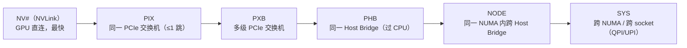
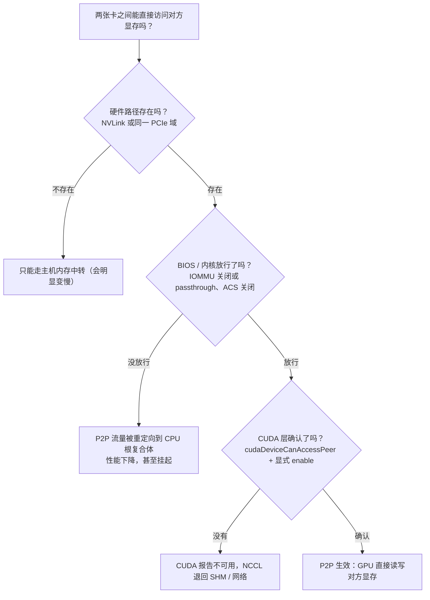
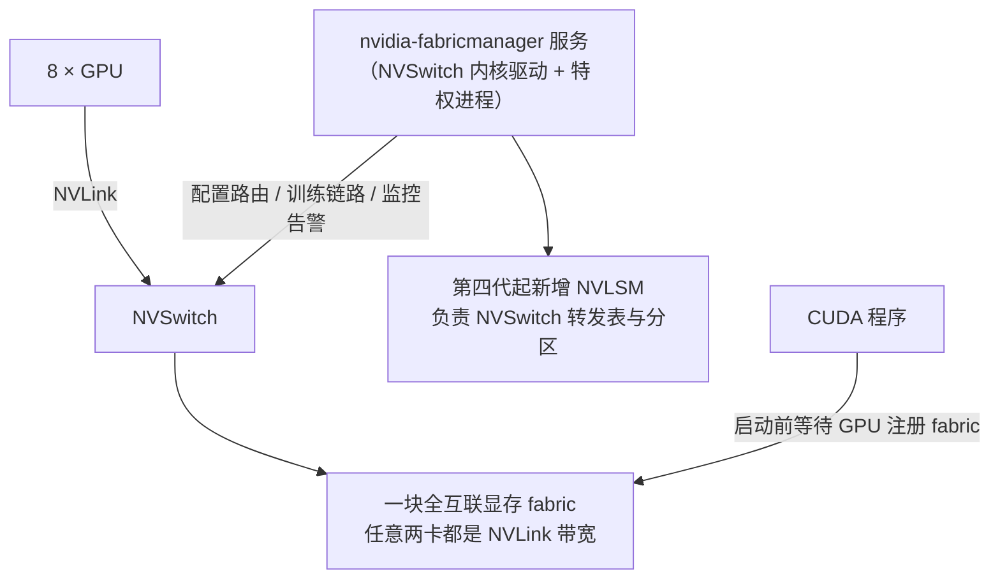
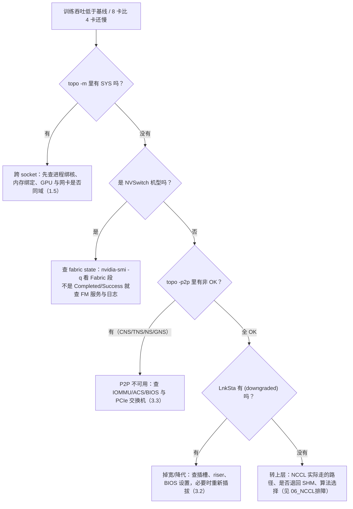

---
tags:
  - AI-Infra
  - GPU
created: 2026-09-15
---

# GPU 拓扑与 PCIe / NUMA

> 本笔记对应 [[AI-Infra/00_简介|AI-Infra 大纲]] 的「阶段 2」。目标：读得懂 `nvidia-smi topo -m`，并能在生产上判断「卡放错了」。
>
> **状态**：已展开（2026-09-17）。
>
> 关联复习：[[AI-Infra/00_简介|00_简介]]、[[01_驱动与内核模块]]、[[03_RDMA与RoCE无损网络]]、[[06_NCCL排障]]
>
> 说明：本文的图例、字段与行为均以官方文档为准（`nvidia-smi` 手册、NVIDIA Fabric Manager 用户指南、CUDA 编程指南、CUDA Compatibility、NCCL 用户指南的 GPU troubleshooting / CPU and memory affinity、Linux 内核 ABI 与 pciutils 源码）；涉及具体机型时只给「典型形态」，**你机器上的亲和性数字、卡号、插槽位置一定不同**。标了「示意」的输出是按官方格式构造的例子，不是某台机器的实测；标了「实测」的输出是本文写作时真实采集的。

## 0. 30 秒速览

> [!abstract] 这一页只要记住 6 句话
> - **拓扑问题的本质是「隔了几跳」**：`NV#` → `PIX` → `PXB` → `PHB` → `NODE` → `SYS` 是一条由近到远的阶梯，`topo -m` 里每一格就是这个距离。判据是**出现 `SYS` 就说明跨了 socket**。
> - **量级差 7~10 倍，所以「卡放错了」不是小事**：A100 的 NVLink 总带宽 600 GB/s 对 PCIe Gen4 x16 的 64 GB/s；H100 是 900 GB/s 对 Gen5 x16 的 128 GB/s（均为双向口径）。
> - **P2P 有三道门，缺一道就退回「绕 CPU」**：硬件（NVLink/PCIe 交换机）、BIOS+内核（**IOMMU 在 bare metal 上必须关、ACS 必须关**）、CUDA 层（`cudaDeviceCanAccessPeer`，非 NVSwitch 系统每卡最多 8 条 peer 连接）。
> - **降速必须主动查**：`nvidia-smi -q` 的 GPU Link Info（Current vs Max、Device Max vs Host Max）与 `lspci -vv` 的 LnkCap vs LnkSta（差一档会打印 `(downgraded)`）。**但 Current 在空闲时会掉档，别把省电当故障**。
> - **8 卡 NVSwitch 机型多一个依赖：Fabric Manager**。HGX 上 FM 要手动安装并启动；FM 没跑起来，老机型 CUDA 直接 `cudaErrorSystemNotReady`，H100 及以后是 GPU 注册不上 fabric、**静默丢掉 NVLink P2P 能力**。
> - **生产默认值**：GPU / 网卡 / 训练进程落在同一 NUMA 域；`topo -m` + `lspci -tv` + NUMA 分布进交付文档；监控里补上「跨 NUMA 任务占比」与链路降速、NVLink 状态、Fabric state。

## 1. 概念

### 1.1 先建立「距离」的直觉

阶段 1 讲的是「这台机器有没有驱动」，阶段 2 讲的是「这些设备之间隔了多远」。整个阶段 2 的图例，本质上就是一条从近到远的阶梯——**看到某一个代号，就该知道数据的路径上多了什么**。



官方图例原文（`nvidia-smi` 手册，直译）：

| 代号 | 官方定义 | 数据实际经过什么 | 什么时候出现 |
| --- | --- | --- | --- |
| `NV#` | Connection traversing a bonded set of # NVLinks | 一组绑定的 NVLink | 有 NVLink 的机型（SXM 形态 / HGX / DGX） |
| `PIX` | Connection traversing at most a single PCIe bridge | 至多一个 PCIe 桥 | 同一张 PCIe switch 卡下的两个设备 |
| `PXB` | Connection traversing multiple PCIe bridges (without traversing the PCIe Host Bridge) | 多级 PCIe 桥，但不经过 Host Bridge | 两块 PCIe switch 卡之间 |
| `PHB` | Connection traversing PCIe as well as a PCIe Host Bridge (typically the CPU) | 经过 Host Bridge（通常是 CPU） | 挂在同一 CPU 下、但不同 switch 的设备 |
| `NODE` | Connection traversing PCIe as well as the interconnect between PCIe Host Bridges within a NUMA node | 经过同一 NUMA 内的 Host Bridge 间互联 | 一个 NUMA 节点里有多个 Host Bridge 时 |
| `SYS` | Connection traversing PCIe as well as the SMP interconnect between NUMA nodes (e.g., QPI/UPI) | 跨 NUMA、走 QPI/UPI | **CPU 之间**的通信，最贵 |

> [!note] `NODE` 是较新的图例，比大纲里列的五个多一个
> 大纲阶段 2 列的是 `NV#/PIX/PXB/PHB/SYS` 五个；现在 `nvidia-smi` 的图例里还有 `NODE`（同一 NUMA 内、跨 PCIe Host Bridge）。看到 `NODE` 说明**还在同一个 NUMA 节点内**，比 `SYS` 便宜得多——这个区分在双 socket 机型上判断「到底跨没跨 socket」时很有用。

#### 量级：为什么这几跳值得较真

下表是**官方数据手册口径的总带宽（双向）**，用来建立量级感——精确值随 SKU 与链路配置变化，落地时以机型手册为准：

| 互联 | 总带宽（双向） | 说明 |
| --- | --- | --- |
| NVLink 2.0（V100 SXM2，6 条链路） | 约 300 GB/s | HGX-2 形态，配 6 颗第一代 NVSwitch |
| NVLink 3.0（A100 SXM4，12 条链路） | 600 GB/s | HGX A100 形态，配 6 颗第二代 NVSwitch |
| NVLink 4.0（H100 SXM5，18 条链路） | 900 GB/s | HGX H100 形态，配 4 颗第三代 NVSwitch |
| NVLink 5.0（B200，18 条链路） | 1.8 TB/s | HGX B200 形态，配第四代 NVSwitch |
| PCIe 3.0 x16 | 约 32 GB/s | 一条链路的单向约 16 GB/s |
| PCIe 4.0 x16 | 约 64 GB/s | 单向约 32 GB/s |
| PCIe 5.0 x16 | 约 128 GB/s | 单向约 64 GB/s |

> [!important] 这张表最该记住的一句话
> **H100 上「跨了 socket」的代价，大致等于把 NVLink 换成 PCIe Gen5 再打个折**（900 → 128 GB/s），而如果只是「同一张 PCIe switch 卡下」，还有 64 GB/s 以上。所以 8 卡训练任务里出现 `SYS`，不是"慢一点"，而是**通信路径换了技术代**。
> 反过来说：**PCIe-only 机型（`topo -m` 里没有 `NV#`）本来就没有 NVLink**。不要按型号猜——A100/H100 有 SXM 与 PCIe 两种形态，看 `topo -m` 里有没有 `NV#` 才算数。

### 1.2 读 `nvidia-smi topo -m`

先看列结构。下面是本文写作时在一台单卡机器上**实测**的输出（Windows + 驱动 616.56；Linux 上列名相同，另外会多出 NIC 行）：

```text
$ nvidia-smi topo -m
        GPU0    CPU Affinity    NUMA Affinity   GPU NUMA ID
GPU0     X                                      N/A

Legend:

  X    = Self
  SYS  = Connection traversing PCIe as well as the SMP interconnect between NUMA nodes (e.g., QPI/UPI)
  NODE = Connection traversing PCIe as well as the interconnect between PCIe Host Bridges within a NUMA node
  PHB  = Connection traversing PCIe as well as a PCIe Host Bridge (typically the CPU)
  PXB  = Connection traversing multiple PCIe bridges (without traversing the PCIe Host Bridge)
  PIX  = Connection traversing at most a single PCIe bridge
  NV#  = Connection traversing a bonded set of # NVLinks
```

三个要点：

1. **行与列都是 GPU 与 NIC**；对角线是 `X`（自己对自己）。
2. 后面三列是**亲和性**，不是互联关系：`CPU Affinity`（这张卡推荐绑哪些 CPU 核）、`NUMA Affinity`（内存该绑哪个 NUMA 节点）、`GPU NUMA ID`（这张卡自己作为 NUMA 节点时的编号，不适用就是 `N/A`）。
3. NIC 行不是凭空来的：官方说明 `topo -m` 显示的是「**有 RDMA 能力的合格网卡**」，而且**当某块网卡被用作 NVLink 交换机的 PCI 桥时，`nvidia-smi` 会把它从矩阵里过滤掉**（这类口没有网络意义）。所以「矩阵里没看到我的网卡」可能有两个原因：它不是 RDMA 网卡，或者它是那块"当桥用"的网卡。

#### 一台 8 卡 NVSwitch 机型长什么样（示意）

下面是 HGX A100 8×SXM4 的**典型形态示意**（不是某台机器的实测，数字与亲和性会因机型/固件不同）：

```text
        GPU0    GPU1    GPU2    GPU3    GPU4    GPU5    GPU6    GPU7    NIC0    NIC1    CPU Affinity    NUMA Affinity
GPU0     X      NV12    NV12    NV12    NV12    NV12    NV12    NV12    PIX     PHB     0-23,48-71      0
GPU1    NV12     X      NV12    NV12    NV12    NV12    NV12    NV12    PIX     PHB     0-23,48-71      0
GPU2    NV12    NV12     X      NV12    NV12    NV12    NV12    NV12    PIX     PHB     0-23,48-71      0
GPU3    NV12    NV12    NV12     X      NV12    NV12    NV12    NV12    PIX     PHB     0-23,48-71      0
GPU4    NV12    NV12    NV12    NV12     X      NV12    NV12    NV12    PXB     SYS     24-47,72-95     1
GPU5    NV12    NV12    NV12    NV12    NV12     X      NV12    NV12    PXB     SYS     24-47,72-95     1
GPU6    NV12    NV12    NV12    NV12    NV12    NV12     X      NV12    PXB     SYS     24-47,72-95     1
GPU7    NV12    NV12    NV12    NV12    NV12    NV12    NV12     X      PXB     SYS     24-47,72-95     1
NIC0    PIX     PIX     PIX     PIX     PXB     PXB     PXB     PXB      X      SYS
NIC1    PHB     PHB     PHB     PHB     SYS     SYS     SYS     SYS     SYS      X
```

**怎么读这张表（三步）**：

1. **先看矩阵里有没有 `NV#`**：8×8 全是 `NV12`，说明任意两卡之间都有 12 条 NVLink——这是 NVSwitch 全互联的形态，节点内通信走 NVLink，不占 PCIe。
2. **再看 GPU 与网卡那一块**：`NIC0` 只对 GPU0~3 是 `PIX`，对 GPU4~7 是 `PXB`；`NIC1` 对 GPU0~3 是 `PHB`，对 GPU4~7 是 `SYS`。这说明**同一台机器里，不同 GPU 到同一块网卡的距离是不一样的**——这就是「GPU 与网卡必须在同一 NUMA 域」这条生产纪律的由来（见 1.5）。
3. **最后看亲和性列**：GPU0~3 属于 NUMA 0、GPU4~7 属于 NUMA 1。做多卡任务时，**rank 与卡、CPU 核、内存、网卡四处要落在同一侧**。

对比一下 **PCIe-only 机型（无 NVSwitch，示意）**：矩阵里完全没有 `NV#`，GPU 之间不是 `PIX` 就是 `PXB`/`SYS`，而且 `SYS` 一出现就意味着这条 GPU↔GPU 路径要经过 CPU 互联——**这种机器上「把 8 卡任务放在一个 NUMA 域内」几乎是唯一正确的做法**。

#### 几个值得记住的变体

| 命令 | 回答什么问题 |
| --- | --- |
| `nvidia-smi topo -mp` | 「**只看 PCIe**」：排除 NVLink 后的连接矩阵（含 CPU/内存亲和性） |
| `nvidia-smi topo -p2p r` / `w` / `n` / `a` / `p` | GPU 两两之间的 **P2P 能力**：读 / 写 / NVLink / 原子 / PCIe（见 1.3） |
| `nvidia-smi topo -C -i <gpu>` | 这张卡**最近的 CPU** 的 NUMA ID |
| `nvidia-smi topo -M -i <gpu>` | 这张卡**最近的内存**的 NUMA ID |
| `nvidia-smi topo -gnid -i <gpu>` | 这张卡**自己**作为 NUMA 节点时的 ID（不适用返回 `N/A`） |
| `nvidia-smi topo -nvme` | GPU ↔ NVMe 的连接矩阵（判断本地盘挂在谁下面） |
| `nvidia-smi topo -c <cpu>` / `-p -i a,b` / `-n <path> -i <gpu>` | 指定 CPU 交集的卡 / 两卡之间的最直接路径 / 按"路径类型"筛选设备 |
| `nvidia-smi topo -cpu`、`-gpu`、`-nic`、`-all` | 新版拆分的专用视图（`-all` 把 GPU/NIC/NVMe 与 CPU/NUMA 亲和性合成一张表，字段定宽，适合脚本解析） |

> [!tip] `-n` 的路径类型编号与图例是同一套
> `nvidia-smi topo -n <traversal_path> -i <gpu>` 里的取值是：`0` 双 GPU 板卡上的单个 PCIe switch、`1` 单个 PCIe switch、`2` 多个 PCIe switch、`3` PCIe Host Bridge、`4` Host Bridge 之间的片上互联、`5` NUMA 之间的 SMP 互联。**它就是 `PIX/PXB/PHB/NODE/SYS` 的数字版**，用来自动化筛选"所有通过 PCIe switch 连到我的 GPU"。

### 1.3 P2P：从「能力矩阵」到「三道门」

#### 先会读 P2P 矩阵

`nvidia-smi topo -p2p <capability>` 打印的是**能力**而不是距离。下面是实测的输出格式（单卡，所以只有自己）：

```text
$ nvidia-smi topo -p2p r
        GPU0
GPU0    X

Legend:

  X    = Self
  OK   = Status Ok
  CNS  = Chipset not supported
  GNS  = GPU not supported
  TNS  = Topology not supported
  NS   = Not supported
  DR   = Disabled by regkey
  U    = Unknown
```

> [!important] 这张表的图例比 `-m` 的图例更值得背
> 因为它区分了「**是谁不支持**」：`CNS` 是芯片组不支持（主板/PCIe switch/BIOS 侧的问题），`GNS` 是 GPU 本身不支持，`TNS` 是拓扑不支持（比如两块卡之间的路径不允许 P2P），`NS` 是不支持（没细分）。**排障时这四个词的指向完全不同**——`CNS`/`TNS` 要去查 BIOS、IOMMU/ACS 与 PCIe 拓扑，`GNS` 则说明这张卡/这个 SKU 就没有这个能力。

NCCL 官方文档给了一张「健康的 8 卡 PCIe 系统、P2P 全通」的示例矩阵（`nvidia-smi topo -p2p p`，`p` 表示 PCIe），全矩阵都是 `OK`，只有对角线是 `X`。

#### P2P 的三道门



三道门的官方依据：

| 门 | 官方说法 | 怎么检查 |
| --- | --- | --- |
| 硬件 | GPUDirect RDMA 必须**共享同一个上游 PCIe 根复合体**；路径上只有 PCIe switch 时最优，经过 CPU 会明显变差，跨 QPI/UPI 可能"extremely performance-limited or even not work" | `nvidia-smi topo -m` / `lspci -tv` |
| BIOS + 内核 | CUDA 编程指南：**Linux bare metal 上 CUDA 与驱动不支持「开启 IOMMU 的 PCIe P2P 内存传输」，IOMMU 必须关闭，否则会静默损坏显存内容**；PCI ACS 会把所有 P2P 流量重定向到 CPU 根复合体，造成显著性能损失 | `/proc/cmdline`、`dmesg \| grep -i iommu`、`lspci -vvv \| grep ACSCtl`（见 3.3） |
| CUDA 层 | P2P 内存访问是否可用由 `cudaDeviceCanAccessPeer()` 决定，且**必须显式调用 `cudaDeviceEnablePeerAccess()` 打开**；**非 NVSwitch 系统上每张卡最多 8 条 peer 连接** | `nvidia-smi topo -p2p r/w/n`、CUDA sample `simpleP2P`、`nvbandwidth` |

> [!warning] 「IOMMU 开着但 P2P 看起来能用」是更危险的情况
> 官方措辞是 **silent device memory corruption**（静默显存损坏），不是"报错退出"。所以这项检查不能靠"训练跑完了"来验收，必须显式确认 IOMMU 的模式。

**做对照实验的两个开关**（NCCL 官方把它列为标准的 P2P 排查手段）：

```text
# 关掉 P2P，看问题是否消失：能定位"问题在 P2P 这条路径上"
NCCL_P2P_DISABLE=1
# 限制 P2P 生效的最大距离（LOC/NVL/PIX/PXB/PHB/SYS）
NCCL_P2P_LEVEL=PHB
```

官方同时提醒：**这些调试变量只适合实验**，长期设置会阻止 NCCL 自动选择最优配置，甚至破坏功能。生产上不要把它们写进镜像或启动脚本。

### 1.4 降速：怎么看出链路"降了档"

「降速」在生产里指两件事：**掉宽**（x16 → x8）和**降代**（Gen4 → Gen3）。它不会报错，只会让带宽打折——所以必须主动查。有两个互相印证的数据源。

#### 数据源一：`nvidia-smi -q` 的 GPU Link Info

官方字段说明：

| 字段 | 含义 | 陷阱 |
| --- | --- | --- |
| `Current`（PCIe Generation / Link Width） | 当前链路代际与宽度 | **官方明确写 "These may be reduced when the GPU is not in use"**——空闲降档是正常的 |
| `Max` | 当前 GPU + 系统配置下**可能达到的最大值** | 官方举例：GPU 支持更高代际但系统不支持时，这里报的是**系统**的那一档 |
| `Device Current` / `Device Max` / `Host Max` | 新驱动把上限拆开显示：GPU 侧当前/上限、以及对应**根端口**的上限 | `Device Max` < `Host Max` 时，瓶颈在卡或插槽；`Host Max` 偏低则是主板/插槽/riser 的问题 |
| `Replays Since Reset` / `Replay Number Rollovers` | PCIe 重传次数与"连续 4 次重传导致链路重训练"的次数 | 增长说明链路质量差（接触不良、riser、信号完整性） |

实测样例（同一台单卡机器，注意 `Current` 是 1、`Max` 是 4，而且 `Host Max` 是 5）：

```text
$ nvidia-smi -q -i 0 | grep -A 10 "GPU Link Info"
    GPU Link Info
        PCIe Generation
            Max                                    : 4
            Current                                : 1
            Device Current                         : 1
            Device Max                             : 4
            Host Max                               : 5
        Link Width
            Max                                    : 8x
            Current                                : 8x
    Replays Since Reset                            : 0
    Replay Number Rollovers                        : 0
```

**这张图的正确读法**：`Host Max = 5`、`Device Max = 4`，所以 `Max = 4`（取两者较小值）——说明这台机器的上限是**卡本身只支持 Gen4**，而不是主板拖了后腿。`Current = 1` 则是**空闲降档**，不能作为故障证据。要判断是否真的降速，要么在负载下再看一次，要么直接看第二个数据源。

> [!tip] 判断降速的正确姿势：先看 Max，再看负载下的 Current
> `Max` 才反映"这台机器的配置是否合理"（例如 A100 应该报 4、H100 应该报 5）；
> `Current` 必须在**有负载时**才有意义。想要一个稳定的观察窗口，可以起一个持续占用 PCIe 的任务（例如 `cudaMemcpy` 循环或 `nvbandwidth`）再看。

#### 数据源二：`lspci -vv` 的 LnkCap / LnkSta

```text
$ lspci -vv -s <BDF> | grep -E "LnkCap|LnkSta"
LnkCap: Port #0, Speed 16GT/s, Width x16, ASPM not supported
LnkSta: Speed 8GT/s (downgraded), Width x8 (downgraded)
```

`(downgraded)` 是 **pciutils 主动标注**的（源码里的注释就写着「当 PCIe 链路速率低于设备支持的最大速率时，显式标记为 downgraded」），速度与宽度**各自独立判断**。两个必须知道的例外：

- **桥设备（Root Port / Downstream Port / PCIe-to-PCI Bridge）不会打印 `(downgraded)`**——所以要看**GPU 这个 endpoint 自己的那一行**，不要看它上游的桥。
- 与 `nvidia-smi` 一样，`LnkSta` 反映的是**当前状态**，空闲时可能显示低速率。

#### 数据源三：sysfs（适合做巡检脚本）

内核为每个 PCI 设备导出四个只读属性（源码 `drivers/pci/pci-sysfs.c`，分别读 PCIe 的 LNKCAP 与 LNKSTA）：

```text
$ BDF=0000:01:00.0
$ cat /sys/bus/pci/devices/$BDF/max_link_speed      # 期望值：16.0 GT/s PCIe
$ cat /sys/bus/pci/devices/$BDF/max_link_width      # 期望值：16
$ cat /sys/bus/pci/devices/$BDF/current_link_speed  # 负载下看
$ cat /sys/bus/pci/devices/$BDF/current_link_width
```

**这才是"看哪个文件的哪个字段"的标准答案**：交付与巡检时对比 `max_link_*`（配置是否合理）与 `current_link_*`（运行状态），并带上采集时的负载条件。

### 1.5 NUMA：把"距离"平移到 CPU 与内存

上面的"距离"是设备之间的；NUMA 说的是**CPU 与内存之间的**距离。二者在 `topo -m` 里合到了一张表（`CPU Affinity` / `NUMA Affinity` 两列），这也是为什么阶段 2 把 PCIe 和 NUMA 放在同一个阶段。

#### 三个视图

```text
# ① 拓扑与 CPU 号 → NUMA 的映射（官方文档推荐用它配合 topo -m 看亲和性）
$ lscpu --extended=CPU,NODE,SOCKET,CORE
# ② 每个 NUMA 节点有哪些 CPU、多少内存、节点间距离
$ numactl --hardware
# ③ 某个设备（GPU / 网卡 / NVMe）挂在哪号 NUMA：最权威、最好脚本化的一个
$ cat /sys/bus/pci/devices/0000:01:00.0/numa_node
0
```

第 ③ 项的官方语义（Linux 内核 ABI 文档，`sysfs-bus-pci`）：

> 这个文件包含该 PCI 设备所属的 NUMA 节点，**值来自 firmware（ACPI `_PXM` 方法或类似机制）**；如果缺失或错误，值可能是 `-1`（未知），**可以写这个文件来覆盖**，但写入会让内核带上 `TAINT_FIRMWARE_WORKAROUND` 污染标记，**并且应该向整机厂商报固件缺陷**。

**这句话在生产上的含义**：`numa_node` 读到 `-1` 或明显不对，不是一个"配一下就好"的问题——它是**整机固件（BIOS/BMC）的问题**，正确的动作是记录证据、联系厂商，而不是长期用脚本覆盖。

批量采集（交付基线里最有用的三条）：

```text
# 每张 GPU 挂在哪号 NUMA（拿 BDF 去查，避免依赖显卡序号）
$ for b in $(nvidia-smi --query-gpu=pci.bus_id --format=csv,noheader); do
    bdf=$(echo $b | sed 's/^00000000://' | tr 'A-F' 'a-f'); echo "$b -> $(cat /sys/bus/pci/devices/0000:$bdf/numa_node)"; done
# 每块 RDMA 网卡挂在哪号 NUMA
$ for d in /sys/class/infiniband/*; do echo "$(basename $d) -> $(cat $d/device/numa_node)"; done
# NVMe 也一样
$ for d in /sys/block/nvme*; do echo "$d -> $(cat $d/device/numa_node 2>/dev/null)"; done
```

#### 为什么 GPU ↔ 网卡跨 NUMA 会影响吞吐

三条官方证据串起来就是完整答案：

1. **路径层面**：GPUDirect RDMA 要求 GPU 与对端设备共享同一个上游 PCIe 根复合体。官方把路径分成三种情况——**只有 PCIe switch（最优）→ 单个 CPU/IOH（能用但更差，某些平台上 P2P 读带宽被严重限制）→ CPU↔QPI/HT↔CPU（极其受限甚至不可靠）**。
2. **NCCL 的 GDR 阈值**：`NCCL_NET_GDR_LEVEL` 定义的就是「NIC 与 GPU 之间允许的最大距离」，`PIX` 最优、`PHB` 表示**流量会经过 CPU**、`SYS` 表示跨 socket 也允许（见 [[03_RDMA与RoCE无损网络]]）。
3. **NCCL 的亲和性建议**：官方原话是「在 NUMA 系统上，**每个 rank 通常应该使用靠近它的 GPU（多机任务还包括靠近它的 NIC）的 CPU 核与主机内存**」。

> [!important] 影响的是"带宽"还是"延迟"？两个都影响，但机理不同
> **带宽**：跨 socket 的路径会把 PCIe 流量搬上 QPI/UPI，或被 ACS 重定向到根复合体，**可用带宽直接掉一档甚至更多**（这就是 `NCCL_NET_GDR_LEVEL` 要设阈值的理由）。
> **延迟**：每一跳都加延迟，而集合通信是"**由最慢的那个 rank 决定每一步的完成时间**"，所以哪怕只有一半 rank 跨了 socket，整次 AllReduce 的等待时间也会被拉长。
> 另一个容易被忽略的成本是**主机内存带宽**：退化路径下数据要在主机内存里中转一次（见 [[01_驱动与内核模块]] 的 GDR 退化路径），抢占的是本来就紧张的 NUMA 本地内存带宽。

#### 绑核与绑内存

`numactl` 的官方语义（手册页原文要点）：

| 选项 | 官方说明 |
| --- | --- |
| `--hardware`（`-H`） | 列出系统上可用的 NUMA 节点清单 |
| `--show`（`-s`） | 显示当前进程的 NUMA 策略设置 |
| `--cpunodebind=nodes`（`-N`） | **只在指定节点的 CPU 上执行**（注意节点可能包含多个 CPU） |
| `--membind=nodes`（`-m`） | **只从指定节点分配内存**；这些节点内存不够时**分配失败**（不是悄悄换节点） |
| `--preferred=node`（`-p`） | 优先在该节点分配，不够时回退到其他节点（只能指定一个节点） |
| `--localalloc`（`-l`） | 尽量在当前节点分配，不够时回退 |
| `--interleave=nodes`（`-i`） | 在多个节点间轮转分配内存 |

```text
# 让进程只用 NUMA 0 的 CPU、只从 NUMA 0 分配内存（GPU0/NIC0 也在 NUMA 0 时）
$ numactl --cpunodebind=0 --membind=0 ./train.sh

# 验证生效：看进程自己的策略
$ numactl --show
```

> [!warning] 绑内存前先想清楚：`--membind` 不够时是"直接失败"
> 手册页写得很清楚：`--membind` 在指定节点内存不足时**分配会失败**。所以它是"严格绑"，不是"尽量绑"。训练进程动辄几百 GB，绑之前先确认该节点内存容量；需要弹性时用 `--preferred` 或 `--localalloc`。

> [!important] NCCL 自己也在绑核，而且默认是"取交集"
> 官方说明：NCCL 默认使用「**父进程/Linux launcher 继承下来的 CPU 亲和性**」与「**GPU 关联的 CPU 亲和性**」的**交集**；如果交集为空，就保持继承的亲和性不变。设 `NCCL_IGNORE_CPU_AFFINITY=1` 才会忽略继承值、只用 GPU 亲和性。
> 所以两类问题都真实存在：**①** 调度器/Slurm/MPI 把 rank 绑到了离 GPU 很远的核心上，NCCL 只能在交集里"凑合"；**②** 容器里 cpuset 把 GPU 本地的核排除了，交集为空——注意 NCCL **仍然无法使用被 cpuset/cgroup/容器排除的 CPU**。
> 另外官方强调：**CPU、GPU、内存的放置要在创建 NCCL communicator 之前完成**。

检查 NCCL 实际用了哪些核（比自己猜靠谱）：

```text
$ NCCL_DEBUG=INFO NCCL_DEBUG_SUBSYS=INIT,GRAPH,ENV ./my_nccl_app
# 日志里找：ncclTopoGetCpuAffinity: Affinity for GPU ...
```

launcher 侧对应的开关：Slurm 用 `--cpu-bind` / `--mem-bind`（GPU 用 `--gpu-bind` 或 `--tres-bind=gres/gpu:...`）；Open MPI 用 `--map-by` / `--bind-to`，并可用 `--report-bindings` 直接打印绑定结果——官方给的示例是 `--map-by ppr:1:numa:PE=<cores_per_rank> --bind-to core`。

### 1.6 NVLink / NVSwitch：从"两条链路"到"一块全互联"

#### 两种形态

| 形态 | 结构 | `topo -m` 里长什么样 | 典型机型 |
| --- | --- | --- | --- |
| **NVLink 直连**（无 NVSwitch） | GPU 两两之间按固定拓扑连若干条 NVLink，常见的是混合立方体网格 | 不同 GPU 对之间**代号不一样**（例如 NV2/NV4/NV6 混排），不会全矩阵一致 | 4 卡 SXM 机型、部分 8 卡直连机型 |
| **NVSwitch 全互联** | 每张 GPU 通过若干 NVLink 连到多颗 NVSwitch，由 NVSwitch 提供任意两卡之间的全带宽通道 | 8×8 全是同一个 `NV#`（如 HGX A100 的 `NV12`、HGX H100 的 `NV18`） | HGX/DGX A100/H100/B200 |

官方对 NVSwitch 的定位原话是：NVSwitch「连接多条 NVLink，**以总 NVLink 速度提供 all-to-all 的 GPU 通信**」——这正是 8 卡训练任务期望的形态。

#### 各代 8 卡基板形态（官方 Fabric Manager 用户指南）

| GPU | NVSwitch 代际与数量 | 每 GPU 的 NVLink 数 | 结构要点 |
| --- | --- | --- | --- |
| V100（HGX-2） | 第一代 × 6 | 6 条（到每颗 NVSwitch 各 1 条） | 两块基板可通过 NVSwitch 互联成 16 卡 |
| A100（HGX A100） | 第二代 × 6 | 12 条（到每颗 NVSwitch 各 2 条） | 支持两块基板互联（16 卡） |
| H100（HGX H100） | 第三代 × 4 | 18 条（对两颗各 4 条、另两颗各 5 条） | **不再支持**两基板 NVLink 互联 |
| B200/B300/B100（HGX B200 等） | 第四代 × 2 | 18 条（每颗 NVSwitch 9 条） | 两基板互联同样不支持 |

#### Fabric Manager：NVSwitch 机型的"第 0 号依赖"



FM 的职责（官方原文归纳）：配置 NVSwitch 端口路由、设置 GPU 路由与端口映射、**与 GPU 驱动协同初始化 GPU**、监控 NVLink/NVSwitch 错误；在第一/二代 NVSwitch 机型上还要**负责 NVLink 链路的初始化与训练**。第四代起新增 **NVLSM**（NVLink Subnet Manager，源自 IB 交换机）负责 NVSwitch 路由表，FM 负责 GPU 侧与分区管理。

| 关键事实 | 原文要点 | 运维含义 |
| --- | --- | --- |
| HGX 上 FM 要手动装/起 | 「在 NVSwitch 的 NVIDIA HGX 系统上，FM 服务需要**手动安装**……系统管理员必须**手动 enable 并启动** FM 服务」；DGX OS 则预装并随系统启动 | 自己装驱动的 HGX 整机，**FM 是最常见的漏项** |
| FM 与驱动版本必须匹配 | 各机型要求的最低驱动：HGX-2/A100 → 450.xx、HGX H100 → 525.xx、HGX B200/B300/B100 → 570.xx；FM 启动时会检查驱动栈版本，不兼容就中止 | 升级驱动时 **FM 要同步升级**（`nvidia-fabricmanager` 包版本与驱动同号） |
| 老机型：FM 没起来 CUDA 就起不来 | 不支持 ALI 的机型（DGX-2/HGX-2/A100）如果**在 FM 初始化完成前启动应用、或 FM 初始化失败**，CUDA 初始化会以 **`cudaErrorSystemNotReady`** 失败 | 看到这个错误码，先查 FM，不要查 NCCL |
| H100 及以后：硬件自动训练，但仍需注册 | NVLink 由 GPU/NVSwitch 硬件用 **ALI**（自主链路初始化）训练，不需要 FM 参与；但 GPU 必须**向 NVLink fabric 注册**，注册失败的 GPU **会失去 NVLink P2P 能力**（仍可用于非 P2P 场景） | 这种"丢 P2P 但不报错"的形态，只能靠 fabric state 发现 |
| 怎么查 fabric 状态 | `nvidia-smi -q -i 0 \| grep -i -A 2 Fabric`：注册中为 `State: In Progress`，成功后为 `State: Completed` / `Status: Success` | **纳入日常巡检**；状态不是 Completed 就去看 FM 日志 |
| MIG 与 NVLink | DGX A100/HGX A100 上启用 MIG 会**关闭 NVLink**，禁用 MIG 后需 FM 在运行才能重新训练；DGX H100/HGX H100 及以后 MIG 期间 NVLink 保持活跃 | A100 机型做 MIG 切分后要验证 NVLink 是否恢复 |
| FM 重启有顺序 | H100 及以后：停掉 CUDA 应用与 GPU 相关服务（例如 DCGM，`nvidia-persistenced` 可保留）→ 停 FM → `nvidia-smi -r` 重置 GPU → 启动 FM → 恢复服务与作业 | 重启 FM 不是"随手 systemctl restart" |

> [!tip] `nvidia-smi nvlink -s` 是 NVLink 层的"逐链路体检"
> 官方手册里它是「查询 NVLink 状态」；配合 `nvidia-smi nvlink -e`（错误计数）可以在 FM 报错之前发现链路劣化。NVLink 的错误处理与 XID 的关系见 [[09_XID与硬件故障处理]]。

### 1.7 与调度层的衔接

主机侧做完上面这些，只是把"事实"准备好了；能不能让任务落到正确的位置，还要看编排层。两者的关系是**单向供给**：Device Plugin 通过 TopologyInfo 的 `NUMANode` 字段把"这张卡挂在哪个 NUMA"告诉 kubelet，kubelet 的 Topology Manager 才有依据做对齐——**而它报出的那个 NUMANode，源头就是本文 1.5 里读的那个 `numa_node`**。

调度侧的策略、`topologyManagerScope`、CPU Manager `static`、Memory Manager、以及 Kueue/Volcano 的拓扑感知调度，见 [[Kubernetes/08_GPU_AI场景|08_GPU_AI场景]]；本文不重复。这里只强调一句：

> [!important] 主机侧拓扑信息不准，调度层再"拓扑感知"也是错的
> 如果 BIOS/BMC 报的 `_PXM` 有误（见 1.5 里对 `numa_node` 的说明），Topology Manager 拿到的 hint 就是错的，最终表现是「策略配置看起来完全正确，但 Pod 就是被放到了跨 NUMA 的位置」。**排查顺序永远是先从主机侧取证，再怀疑调度器。**

## 2. 生产实践

### 2.1 交付基线：新机型要先出这份原始证据

大纲里那条「交付新机型时先出一份拓扑基线」，落地就是下面这张清单——**每一行都要存进交付文档，并附上采集时间、机型、固件与驱动版本**：

| 项 | 命令 | 记什么 |
| --- | --- | --- |
| 卡间与卡网互联 | `nvidia-smi topo -m` | 有没有 `NV#`、矩阵里有多少 `SYS`、NIC 与 GPU 的距离 |
| P2P 能力 | `nvidia-smi topo -p2p r`（必要时 `w/n`） | 是否全 `OK`；出现 `CNS/TNS/NS` 的卡对编号 |
| PCIe 树 | `lspci -tv` | GPU / 网卡 / NVMe / PCIe switch 各挂在哪一层 |
| PCIe 链路 | `lspci -vv -s <BDF> \| grep -E "LnkCap\|LnkSta"` 或 `max_link_*`/`current_link_*` | **期望值**（每张卡应该是什么代际与宽度）+ 实测值 |
| NUMA 视图 | `lscpu --extended=CPU,NODE,SOCKET,CORE`、`numactl --hardware` | CPU/内存分段 |
| 设备归属 | 批量读 `numa_node`（见 1.5） | 每张 GPU / 每块网卡 / 每块 NVMe 的 NUMA 号，以及**是否存在 `-1`** |
| 固件与 BIOS | BMC/BIOS 版本、`nvidia-smi -q`、网卡固件 | 记录 BIOS 里的 IOMMU/ACS/Above 4G 相关设置 |
| NVSwitch 机型附加项 | `nvidia-smi -q -i 0 \| grep -A2 Fabric`、`nvidia-fabricmanager` 版本与状态 | fabric state、FM 版本与驱动是否同号 |

> [!tip] 一张 `topo -m` 截图能省掉半小时电话
> 跨团队（网络/机房/业务）排障时，**把 `topo -m` 与 `numa_node` 的采集结果直接贴给对方**，比在电话里描述"第 4 张卡和第 5 张卡之间"高效得多。

### 2.2 拓扑错位的四种典型形态

大纲的原话是「**拓扑放错不报错，只会变慢**」。具体到现象，常见是这四种：

| 形态 | 现象 | 判据 |
| --- | --- | --- |
| 进程绑到了"远"的 CPU/内存 | GPU 利用率正常但吞吐低于基线，`numactl --show` 或 NCCL 日志显示亲和性不对 | 交集为空、或绑到了另一侧 NUMA |
| 数据加载 / 网卡与 GPU 跨 NUMA | 集合通信慢，`topo -m` 里 GPU↔NIC 是 `SYS`/`PXB` | 与同域机器对比基线 |
| PCIe 链路降速 | 单卡间或 GPU↔NIC 带宽只有预期的一半 | `LnkSta` 出现 `(downgraded)`、`current_link_width` 掉到 8 |
| P2P 实际没生效（IOMMU/ACS 拦了） | `-p2p` 显示 OK 但实测带宽很低，或直接退回 SHM | `dmesg` 里 IOMMU 模式、`lspci -vvv` 里 `ACSCtl` |

### 2.3 BIOS / 内核参数检查清单

| 项 | 期望 | 检查方式 | 不符合的后果 |
| --- | --- | --- | --- |
| IOMMU（bare metal） | **关闭**，或至少对 GPU 路径为 passthrough | `cat /proc/cmdline`、`dmesg \| grep -i -E "iommu\|dmar\|default domain"` | 官方明确：bare metal 上开启 IOMMU 的 PCIe P2P **不支持**，可能是静默显存损坏 |
| IOMMU（虚拟机场景） | **开启** + VFIO passthrough | 同上 | 这是与 bare metal 相反的期望，别搞混 |
| ACS | PCI switch 上**关闭** | `sudo lspci -vvv \| grep ACSCtl`，出现 `SrcValid+` 就要留意 | 所有 P2P 流量被重定向到 CPU 根复合体，带宽显著下降 |
| Above 4G Decoding / Large BAR / Resizable BAR | 打开（让 GPU 的 BAR 能映射到 4GB 以上地址空间） | 先看 `nvidia-smi -q \| grep -A3 BAR1` 的 Total 是否与该卡显存规模相符 | BAR1 过小会限制 P2P 映射能力；GPUDirect RDMA 官方也提到过大 BAR 在旧主板上可能导致启动问题 |
| NUMA（BIOS） | 保持开启，不要为了"看起来干净"关掉 | `numactl --hardware` 应该有 2 个节点 | 关掉 NUMA 后距离信息消失，`topo -m` 的亲和性列失去意义 |

> [!warning] 这几项的名称与默认值随主板/机型而异
> 「Above 4G Decoding」「Resizable BAR」「Large BAR」这类名字来自主板与整机厂商，NVIDIA 文档里也不统一；**以机型手册为准**，并且改完必须重新采一遍 2.1 的基线——BIOS 改动是"静默改变拓扑"的典型来源。

### 2.4 常见坑

| 常见做法或说法 | 后果或事实 |
| --- | --- |
| 用 `nvidia-smi` 的显卡序号当"物理位置" | 枚举顺序不保证跨重启稳定（官方对 `-i` 的说明就强调建议用 UUID 或 BDF）；**跨重启跑基线要用 BDF/UUID** |
| 看到 `Current` 是 Gen1 就判定掉速 | 官方写明未使用时链路可能降档；要在负载下看，并用 `Max`/`LnkCap` 做对照 |
| 只看 `topo -m` 不看 `-p2p` | 距离近 ≠ P2P 可用（IOMMU/ACS/Chipset 都可能拦掉，`CNS/TNS`） |
| 认为"P2P 能用"就等于"性能没问题" | 官方特别提醒：`topo -p2p` 显示 OK **不是完整体检**，bare metal 还要确认 IOMMU 模式 |
| 为了"省事"长期设置 `NCCL_P2P_DISABLE` / `NCCL_P2P_LEVEL` | 官方明确这些是调试变量，长期设置会阻止 NCCL 自动选优、甚至破坏功能 |
| 用 `--membind` 绑内存但没算容量 | 内存不足时**分配直接失败**（不是回退） |
| 在容器里期望 NCCL 用到 GPU 本地的核 | 被 cpuset/cgroup 排除的 CPU，NCCL 用不了；交集为空时行为会退化 |
| 自己装驱动的 HGX 整机不装 FM | NVLink 全互联配不起来：老机型 `cudaErrorSystemNotReady`，H100+ 静默丢 P2P |
| 只看 GPU，不看 NVMe 挂在哪 | 本地盘跨 NUMA 时，数据加载会变成第三条"变慢路径"（见 [[07_存储与IO数据面]]） |

### 2.5 监控与巡检

| 指标 | 来源 | 为什么按"趋势"看 |
| --- | --- | --- |
| 跨 NUMA 训练任务占比 | 作业侧的 rank→节点/NUMA 映射 | 拓扑错位是隐性问题，只有把它变成指标才会被看见 |
| PCIe 链路降速 | `max_link_*` / `current_link_*`（负载下采集）、`LnkSta` | 掉宽/降代不会告警，只会让基线数字慢慢变差 |
| PCIe 重传 | `nvidia-smi -q` 的 `Replays Since Reset` / `Replay Number Rollovers` | 增长说明接触/信号问题，是"可预防"的硬件劣化 |
| NVLink 状态与错误计数 | `nvidia-smi nvlink -s` / `-e` | 链路劣化早于报错 |
| Fabric state | `nvidia-smi -q` 的 Fabric 段 | 必须常驻 `Completed/Success`，其余状态都要有人看 |
| `numa_node` 异常 | 交付时采集 + 定期复核 | `-1` 或错位属于固件问题，会污染调度层的判断 |

告警规则与看板组织见 [[08_可观测性与监控告警]]。

## 3. 排障速查

### 3.1 现象：8 卡任务比 4 卡还慢 / 吞吐只有基线的一半

> [!tip] 第一反应不要是「NCCL 版本不行」
> 「能跑通、只是慢」在拓扑这一层有明确指纹：**先看 `topo -m` 里有没有 `SYS`，再看 GPU 与网卡的距离**。这两眼通常比翻 NCCL 日志快。



```text
$ nvidia-smi topo -m | head -n 12            # 一眼看有没有 SYS、有没有 NV#
$ nvidia-smi topo -p2p r                     # P2P 能力矩阵
$ nvidia-smi -q -i 0 | grep -i -A2 Fabric    # NVSwitch 机型必查
$ numactl --show                             # 当前进程的 NUMA 策略
```

### 3.2 现象：某张卡 PCIe 掉到 x8 或降代

> [!tip] 先区分「空闲降档」与「配置降级」
> 空闲降档在负载下会自己恢复；配置降级（插槽/riser/交换机限制）在负载下也不变。**判定依据是 `Max` 或 `LnkCap`，不是 `Current`。**

```text
# ① 上限对不对（不带负载也能判）
$ nvidia-smi -q -i <ID> | grep -A 10 "GPU Link Info"     # Device Max / Host Max / Link Width Max
$ lspci -vv -s <BDF> | grep -E "LnkCap|LnkSta"           # 看 GPU 这一行，不要看上游桥
# ② 负载下再看一次（排除空闲降档）
$ lspci -vv -s <BDF> | grep LnkSta
```

处置顺序：**①** 与同机型同槽位的正常卡对比，确认是个案还是机型共性；**②** 检查 `Host Max`（根端口上限）——偏低说明是插槽/主板/riser 侧的问题，不是卡；**③** 有重传增长（`Replays Since Reset`）时优先怀疑接触与 riser，**重新插拔并复测**；**④** 全部正常但带宽仍不达标，再往上查 P2P 与 IOMMU/ACS。

### 3.3 现象：P2P 矩阵里有 CNS/TNS/NS，或 NCCL 退回 SHM

> [!tip] 第一反应：查 IOMMU 与 ACS，而不是换卡
> 官方给的最短路径就是这两条命令；`topo -p2p` 显示 OK 也可能被它们拦住。

```text
# IOMMU 模式（bare metal 期望：没有 translated 模式）
$ cat /proc/cmdline
$ dmesg | grep -i -E "iommu|dmar|default domain"
#   iommu: Default domain type: Translated    <-- 这两行出现就要警惕
#   DMAR: IOMMU enabled

# ACS（期望：PCI switch 上没有开启 ACS）
$ sudo lspci -vvv | grep ACSCtl
#   ACSCtl: SrcValid+  ...   <-- 出现 SrcValid+ 要留意
```

处置方向：

- **BIOS 里关掉 IO virtualization / VT-d**（部分机型同时解决 ACS）；
- Broadcom PLX 这类 PCIe switch 可以在 OS 里用 `setpci` 关 ACS，但**每次重启后要重新执行**（官方给的做法，脚本示意见 NCCL GPU troubleshooting）；
- **虚拟机场景相反**：ACS 是虚拟机必需的，不能关；官方建议的做法是在网卡上启用 ATS。
- 容器/虚拟机里还要确认 **`/sys` 挂载正常**：NCCL 依赖 `/sys` 发现 PCI 拓扑，**被虚拟化的 PCI 拓扑会导致次优性能**（官方原文）。

### 3.4 现象：NVSwitch 机型 NVLink 全互联"消失"

```text
$ nvidia-smi -q -i 0 | grep -i -A 2 Fabric    # 期望 State: Completed / Status: Success
$ systemctl status nvidia-fabricmanager       # HGX 上要确认服务已 enable 且 active
$ nvidia-smi nvlink -s                        # 逐链路状态（是否有链路 inactive）
```

判据与动作：**①** fabric state 不是 `Completed` → 查 FM 服务是否启动、FM 版本是否与驱动同号、FM 日志；**②** CUDA 报 `cudaErrorSystemNotReady`（老机型）→ 基本可以认定 FM 没起来或没初始化完；**③** H100 及以后即使 FM 正常，也要确认每张卡都完成了注册——**注册失败的卡会静默失去 NVLink P2P 能力**，此时应把该卡从拓扑敏感的任务里排除（打标签/隔离），而不是继续整机重试；**④** MIG 做过切分/还原的 A100 机型，确认 NVLink 已重新训练。

## 4. 动手验证

> [!example]- 实验 1：读自己的机器，并把原始输出贴进本笔记
> **验证什么**：把 1.2 的三步读法用在自己机器上；顺便完成交付基线的第一项。**这是本阶段最重要的一个动作**——抽象记忆远不如自己机器那张表。
>
> ```text
> $ nvidia-smi topo -m                                  # 卡间 + 卡网 + 亲和性
> $ nvidia-smi topo -mp                                 # 只看 PCIe（有 NVLink 的机器对比看）
> $ nvidia-smi topo -cpu                                # CPU/内存亲和性与 NUMA ID
> $ lspci -tv                                           # PCIe 树：谁挂在谁下面
> ```
>
> **看什么**：① 矩阵里有没有 `NV#`，是统一数字还是混排（直连都会混排）；② GPU↔NIC 那一块里，你的网卡对每张卡是 `PIX` 还是 `SYS`；③ 亲和性列把 8 张卡分成了几组，与物理 CPU 对应关系是否合理。
>
> 做完把输出贴进本笔记的「我的机器」小节（建议同时记录机型、BIOS、固件、驱动版本）。

> [!example]- 实验 2：P2P 能力三连 + 带宽实测
> **验证什么**：距离近不等于 P2P 可用；可用的 P2P 到底能跑多少带宽。
>
> ```text
> $ nvidia-smi topo -p2p r          # 读能力
> $ nvidia-smi topo -p2p w          # 写能力
> $ nvidia-smi topo -p2p n          # NVLink 能力（NVSwitch 机型）
> # 带宽：官方推荐的 GPU-GPU 带宽测试工具（CUDA sample 只验证正确性）
> $ nvbandwidth                     # 见 github.com/NVIDIA/nvbandwidth
> ```
>
> **预期**：NVSwitch 机型 `-p2p n` 全 `OK`；PCIe-only 机型 `-p2p r/w` 常见成对出现 `OK`，但**跨 NUMA 的卡对可能是 `NS`/`TNS`**。若出现 `CNS`，优先怀疑芯片组/BIOS 配置（见 3.3）。
> 环境：多卡机器；单卡机器只能看格式。

> [!example]- 实验 3：降速体检（含空闲 vs 负载对照）
> **验证什么**：分清"空闲降档"与"真的降级"，并学会用 `Max` 做判据。
>
> ```text
> # ① 空闲时
> $ nvidia-smi -q -i 0 | grep -A 10 "GPU Link Info"
> $ lspci -vv -s <BDF> | grep -E "LnkCap|LnkSta"
> # ② 制造持续 PCIe 流量（显存 ↔ 主机内存来回拷，512MB × 20 轮）
> $ python3 -c "import torch; x=torch.empty(512*1024*1024//4, dtype=torch.float32, device='cuda'); [x.cpu().cuda() for _ in range(20)]"
> # ③ 负载下再采一次
> $ lspci -vv -s <BDF> | grep LnkSta
> ```
>
> **预期**：空闲时 `Current` 可能明显低于 `Max`（这是设计行为）；有负载时 `LnkSta` 里应该**看不到 `(downgraded)`**。如果负载下仍有 `(downgraded)`，就是真实故障，按 3.2 处理。
> 环境：任意 NVIDIA 卡；注意别在生产节点上跑重负载。

> [!example]- 实验 4：IOMMU / ACS 体检
> **验证什么**：确认 P2P 的"第二道门"是否放行——**这项不能靠"训练能跑"来验收**。
>
> ```text
> $ cat /proc/cmdline
> $ dmesg | grep -i -E "iommu|dmar|default domain"
> $ sudo lspci -vvv | grep ACSCtl
> $ nvidia-smi topo -p2p p
> ```
>
> **预期（bare metal）**：没有 `Default domain type: Translated`；`ACSCtl` 里没有 `SrcValid+`（或已按官方做法处理）；`-p2p p` 全 `OK`。三项里任何一项不符合，都要按 3.3 处理后再谈性能结论。
> 环境：能改 BIOS 的实验机（生产环境先取证、后变更）。

> [!example]- 实验 5（推荐）：NUMA 亲和对照实验
> **验证什么**：把「亲和性影响吞吐」变成自己机器上的两个数字。做法是**只改绑核/绑内存，不改任何模型与参数**。
>
> ```text
> # A：绑到 GPU 所在 NUMA（假设是 0）
> $ numactl --cpunodebind=0 --membind=0 ./build/all_reduce_perf -b 8 -e 8G -f 2 -g 8
> # B：故意绑到另一侧
> $ numactl --cpunodebind=1 --membind=1 ./build/all_reduce_perf -b 8 -e 8G -f 2 -g 8
> # C：检查 NCCL 实际采用的亲和性
> $ NCCL_DEBUG=INFO NCCL_DEBUG_SUBSYS=INIT,GRAPH,ENV ./build/all_reduce_perf -b 8 -e 8G -f 2 -g 8 2>&1 | grep -i affinity
> ```
>
> **看什么**：两次的 `busbw` 差距，以及 NCCL 日志里 `ncclTopoGetCpuAffinity: Affinity for GPU ...` 的实际核号。
> **注意**：`numactl --membind` 内存不足会直接失败（见 1.5），先用小规模跑通。
> 环境：双 socket 多卡机器；基线口径与参数记录方法见 [[04_perftest与性能基线]]。

## 5. 要点自测

> [!question]- `nvidia-smi topo -m` 输出里 `NV4`、`PIX`、`SYS` 分别意味着什么？
> - **`NV4`**：这两张 GPU 之间有**一组绑定的 4 条 NVLink**（官方图例：a bonded set of # NVLinks）——带宽是 4 条链路的总和，属于节点内最快路径。
> - **`PIX`**：两张卡之间**至多经过一个 PCIe 桥**（同一张 PCIe switch 卡下），走 PCIe，不占 CPU。
> - **`SYS`**：连接要经过 PCIe **以及 NUMA 节点之间的 SMP 互联（QPI/UPI）**——也就是**跨了 socket**，是这张表里最贵的路径。
> - **落点**：看到 `SYS` 就要检查"是不是任务被放偏了"；看到 `NV#` 数字不一致（混排），说明是 NVLink 直连而不是 NVSwitch 全互联。

> [!question]- 怎么判断一张卡有没有「降速」？看哪个文件的哪个字段？
> - **sysfs（回答"哪个文件的哪个字段"）**：`/sys/bus/pci/devices/<BDF>/max_link_speed`、`max_link_width`、`current_link_speed`、`current_link_width`——前两个是能力上限（LNKCAP），后两个是当前状态（LNKSTA）。
> - **`nvidia-smi -q` 的 GPU Link Info**：`Current` vs `Max`，新驱动还会拆出 `Device Current / Device Max / Host Max`；`Host Max` 偏低说明瓶颈在主板/插槽侧。
> - **`lspci -vv` 的 LnkCap / LnkSta**：当链路速率或宽度低于设备能力时，pciutils 会标注 **`(downgraded)`**；注意**桥设备不会标注**，要看 GPU 这个 endpoint 自己那一行。
> - **两个坑**：① `Current`/`LnkSta` 在**空闲时会降档**，官方明确说明过；② 判据应该是 `Max`（配置是否合理）与**负载下的 `Current`**（运行是否正常）。
> - **补充信号**：`Replays Since Reset` 与 `Replay Number Rollovers` 增长，说明链路质量在恶化（连续 4 次重传会触发链路重训练）。

> [!question]- 为什么 GPU 与网卡的 NUMA 亲和会影响训练吞吐？影响的是带宽还是延迟？
> - **带宽**：跨 socket 的路径要把流量搬上 QPI/UPI；GPUDirect RDMA 官方把路径分为「只有 PCIe switch（最优）→ 单个 CPU/IOH（更差）→ 跨 CPU 互联（严重受限甚至不可靠）」三种。NCCL 的 `NCCL_NET_GDR_LEVEL` 本质上就是用一个"距离阈值"来决定 GDR 要不要开、以及流量是否会过 CPU。
> - **延迟**：每多一跳都加延迟，而集合通信的每一步完成时间由**最慢的参与者**决定，所以只有部分 rank 跨 socket，整次 AllReduce 也会被拖慢。
> - **额外成本**：GDR 不生效时数据要在主机内存中转一次（见 [[01_驱动与内核模块]]），抢的是 NUMA 本地内存带宽。
> - **官方建议**：NCCL 明确说「在 NUMA 系统上每个 rank 通常应该使用靠近其 GPU（多机任务还包括靠近其 NIC）的 CPU 核和主机内存」，并且**这些放置要在创建 communicator 之前完成**。
> - **落点**：`numactl --cpunodebind --membind`（注意 `--membind` 内存不足会失败）、Slurm 的 `--cpu-bind/--mem-bind`、MPI 的 `--map-by/--bind-to`；容器里则受 cpuset 限制。

> [!question]- 拓扑错位的典型现象是什么？为什么监控上很难发现？
> - **典型现象**：任务**能跑完、不报错**，但吞吐显著低于同规格机器的基线；8 卡任务不如 4 卡；GPU 利用率有周期性空洞；跨 NUMA 的 rank 拖慢整体集合通信。扩容/换机型后"莫名其妙变慢"是它最常见的出场方式。
> - **为什么难发现**：① 没有任何告警或错误码，链路也没"坏"（`NV#`、`PIX`、`SYS` 都是合法状态，区别只是"贵不贵"）；② 机器级指标（GPU 利用率、温度、功耗）看起来完全正常；③ 节点指标里**没有"这台机器上的任务落在哪个 NUMA 域"这个维度**；④ 只有和基线对比、或看 `topo -m` 里的 `SYS` 才会暴露。
> - **对策**：把它变成指标——**跨 NUMA 训练任务占比**，加上交付基线（2.1）与定期巡检。

> [!question]- P2P 有哪三道门？为什么 `topo -p2p` 显示 OK 还不能算体检通过？
> - **三道门**：① 硬件路径（NVLink 或共享同一个上游 PCIe 根复合体）；② BIOS 与内核（bare metal 上 **IOMMU 必须关闭**，`ACS` 要把 P2P 流量放行）；③ CUDA 层（`cudaDeviceCanAccessPeer()` + 显式 `cudaDeviceEnablePeerAccess()`，非 NVSwitch 系统每卡最多 8 条 peer 连接）。
> - **为什么 OK 不等于通过**：NCCL 官方明确写「`nvidia-smi topo -p2p` 显示 OK 是有用的，但**不是完整的系统体检**」——在 Linux bare metal PCIe 系统上还必须检查 IOMMU 的**实际模式**（`/proc/cmdline`、`dmesg`），因为「开启 IOMMU 的 PCIe P2P 不被支持」且后果是**静默显存损坏**。
> - **图例要会读**：`CNS`（芯片组不支持）、`GNS`（GPU 不支持）、`TNS`（拓扑不支持）、`NS`（不支持）、`DR`（被 regkey 禁用）、`U`（未知）——`CNS/TNS` 指向主板/BIOS/拓扑，`GNS` 才是卡本身。

> [!question]- 8 卡 HGX/DGX 机型为什么"多一个依赖"？Fabric Manager 起不来会怎样？
> - **为什么需要**：NVSwitch 机型的 all-to-all NVLink 通道要由 **NVSwitch 内核驱动 + Fabric Manager（FM）** 配置出来（第四代起还有 NVLSM 管 NVSwitch 转发表）；FM 负责路由、与 GPU 驱动协同初始化 GPU、监控 NVLink/NVSwitch 错误，第一/二代还负责链路训练。
> - **最容易漏的一步**：在 HGX 系统上 FM 需要**手动安装并手动 enable/start**（DGX OS 才预装且随系统启动）；FM 版本还必须与驱动匹配（各机型要求的最低驱动：HGX-2/A100 → 450.xx、HGX H100 → 525.xx、HGX B200/B300/B100 → 570.xx）。
> - **起不来的后果**：不支持 ALI 的老机型（DGX-2/HGX-2/A100）CUDA 直接以 **`cudaErrorSystemNotReady`** 失败；H100 及以后 NVLink 由硬件用 ALI 训练，但 GPU 必须**向 fabric 注册**，注册失败会**静默失去 NVLink P2P 能力**（仍可跑非 P2P 场景）。
> - **怎么查**：`nvidia-smi -q -i 0 | grep -i -A 2 Fabric`，期望 `State: Completed` / `Status: Success`；配 `nvidia-smi nvlink -s` 看逐链路状态。
> - **附加坑**：重启 FM 对 H100 及以后有固定顺序（停 CUDA 应用与 DCGM 等服务 → 停 FM → `nvidia-smi -r` → 启动 FM → 恢复服务）；A100 机型启用 MIG 会关闭 NVLink，禁用后需要 FM 在跑才能重新训练。

> [!question]- `numa_node` 读到 `-1` 要紧吗？该怎么处理？
> - **语义**：这个值来自固件的 ACPI `_PXM`（或类似机制），`-1` 表示**未知**；内核 ABI 文档明确说**可以写入覆盖，但写入会让内核带上 `TAINT_FIRMWARE_WORKAROUND`，并且应该向厂商报固件缺陷**。
> - **要紧**：它不只是"这一个文件不好看"——调度层（Device Plugin 上报的 `NUMANode`）拿到的就是这类信息，**错误的拓扑会让 Topology Manager 的对齐决策一起错**。
> - **处理**：记录机型/BIOS/BMC 版本与 `lspci -tv`，向整机厂商报障；在故障修复前，临时覆盖要在变更记录里写清楚，并纳入巡检（维护后会被重置）。

> [!question]- `topo -m` 里的 NIC 行是怎么来的？看不到自己的网卡可能是哪两种原因？
> - **来源**：`topo -m` 展示的是「**有 RDMA 能力的合格网卡**」（含其 data-direct 设备），并附带 GPU 的 CPU/内存亲和性。
> - **原因一**：这块网卡不在它的"合格网卡"范围内（例如没有 RDMA 能力；官方也提示矩阵里可能包含并非 RDMA 能力的 bonded 网卡，反之普通以太网卡未必出现）。
> - **原因二**：**该网卡被用作 NVLink 交换机的 PCI 桥**——官方明确说 `nvidia-smi` 会通过 sysfs 检查并把这些端口/PCIe 子功能**从拓扑矩阵里过滤掉**（某些内核版本上读取这些 sysfs 需要 root 权限）。这正是"机器上明明有网卡，矩阵里却没有"的常见解释。

## 6. 回到路线图

完成本笔记后，回到 [[AI-Infra/00_简介|00_简介]]：

- [ ] 能读全 `nvidia-smi topo -m` 的图例（含 `NODE`），并说清每一格"数据实际经过什么"
- [ ] 能用 `-p2p r/w/n` 判断两卡之间能不能 P2P，并解释 `CNS/GNS/TNS/NS` 的区别
- [ ] 能用 `max_link_*` / `current_link_*` 与 `LnkCap` / `LnkSta` 判断一张卡有没有降速，并说明"空闲降档"为什么不是故障
- [ ] 能画出自己机器的 NUMA 视图，说清每张 GPU / 网卡 / NVMe 挂在哪号 NUMA
- [ ] 能用 `numactl` 把进程与内存绑到正确的 NUMA，并说明 `--membind` 与 `--preferred` 的差别
- [ ] 能说清 IOMMU / ACS 在 bare metal 与虚拟机两种场景下的相反期望，以及不符合时的后果
- [ ] 能解释 NVLink 直连与 NVSwitch 全互联在 `topo -m` 上的区别，以及 Fabric Manager 起不来的两种后果
- [ ] 能把拓扑基线（`topo -m` + `lspci -tv` + NUMA 分布 + 链路能力）写进交付文档，并设计"跨 NUMA 任务占比"这类指标

> 推荐扩展阅读（官方文档）：
>
> - **nvidia-smi 手册**：Topology 一节（`-m` / `-mp` / `-p2p` / `-C` / `-M` / `-gnid` / `-nvme` / 新版 `-cpu`、`-gpu`、`-nic`、`-all`）、GPU Attributes 中的 GPU Link Information / BAR1 Memory Usage / Replays
> - **NVIDIA Fabric Manager 用户指南**：NVSwitch-Based Systems（各代基板拓扑）、What is Fabric Manager、What is NVLink Subnet Manager、GPU Baseboard Topologies、Initializing NVSwitch and NVLink（`cudaErrorSystemNotReady` 与 fabric state）
> - **CUDA 编程指南**：3.4.2 Multi-Device Peer-to-Peer Transfers and Memory Access（`cudaDeviceCanAccessPeer`、每卡 8 条 peer 连接）、3.4.2.5 Host IOMMU Hardware, PCI Access Control Services, and VMs
> - **NCCL 用户指南 · GPU troubleshooting**：GPU Direct、GPU-to-GPU（`-p2p` 示例与 `simpleP2P`/`nvbandwidth`）、Linux bare-metal IOMMU（检查命令与期望输出）、PCI ACS（`lspci -vvv | grep ACSCtl`、PLX 的 `setpci` 做法、虚拟机为何不能关 ACS）、Topology detection（`/sys` 与虚拟化拓扑）
> - **NCCL 用户指南 · Performance and tuning**：CPU and memory affinity（交集规则、`NCCL_IGNORE_CPU_AFFINITY`、Slurm/MPI 绑定、`ncclTopoGetCpuAffinity` 日志）
> - **Linux 内核 ABI（sysfs-bus-pci）**：`numa_node` 的语义与写入后果；`drivers/pci/pci-sysfs.c` 中的 `max_link_speed` / `max_link_width` / `current_link_speed` / `current_link_width`
> - **pciutils**：`lspci -vv` 的 LnkCap / LnkSta 与 `(downgraded)` 标注逻辑（源码 `ls-caps.c`）
> - **[[00_学习大纲|Linux 大纲]]**：通用主机侧内容（IRQ 亲和、软中断、PCIe 基础）见对应笔记

> 下一步：[[03_RDMA与RoCE无损网络]]（本篇讲的是"GPU 与设备在机器内部隔了多远"，下一篇讲"跨机器的那一跳"——RoCE/IB 的无损网络与 GID/优先级映射）。
