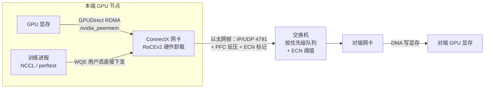
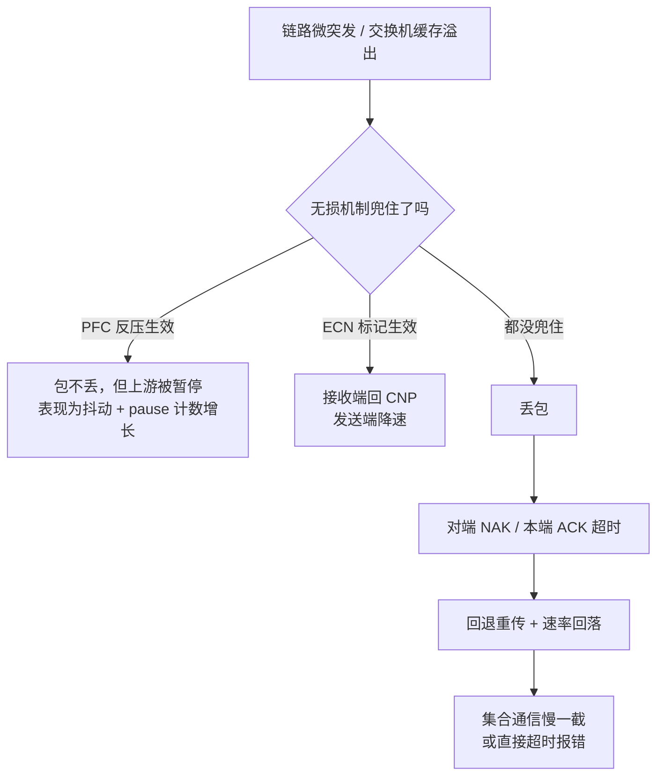

---
tags:
  - AI-Infra
  - RDMA
  - RoCE
  - 无损网络
created: 2026-09-15
---

# RDMA 与 RoCE 无损网络

> 本笔记对应 [[AI-Infra/00_简介|AI-Infra 大纲]] 的「阶段 3」。目标：能查、能配、能讲 RoCEv2 与 PFC/ECN，并说清丢包为什么对 RDMA 致命。
>
> **状态**：已展开（2026-09-17）。本阶段标 ★，是大纲里的两个重点之一。
>
> 关联复习：[[AI-Infra/00_简介|00_简介]]、[[01_驱动与内核模块]]、[[02_GPU拓扑与PCIe_NUMA]]、[[04_perftest与性能基线]]、[[05_容器内GPU与RDMA]]、[[06_NCCL排障]]、[[08_可观测性与监控告警]]；通用主机调优（IRQ 亲和、软中断、环形缓冲、MTU）见 [[05_网络协议栈与排障]]。
>
> 说明：本文命令与结论以官方文档为准——NVIDIA DOCA 文档（RDMA over Converged Ethernet、Flow Control、Explicit Congestion Notification、Congestion Control Infrastructure、Adaptive Retransmission、InfiniBand QoS）、NCCL User Guide 环境变量页、Linux 内核 `Documentation/ABI/stable/sysfs-class-infiniband` 与 mlx5 驱动源码、mlnx-tools 源码（`show_gids` / `cma_roce_mode` / `cma_roce_tos` / `mlnx_qos`）、infiniband-diags 手册页（`perfquery` / `ibstat` / `ibdiagnet`）。**计数器名字与默认值会随驱动版本变化**：落地前用文中的「清点命令」取本机实际输出，不要凭记忆抄名字。

## 0. 30 秒速览

> [!abstract] 这一页只要记住 7 句话
> - **RoCEv2 = 把 IB 的传输层塞进 UDP/IP**：目的端口 UDP **4791**，因此可路由（RoCEv1 是以太网 EtherType `0x8915`，只能在同一个二层广播域里）。判据：`ibv_devinfo` 的 `link_layer: Ethernet` + `show_gids` 的 `VER` 列。
> - **无损不是协议自带的，是配出来的**：PFC 必须在**端点与路径上每一台交换机**都打开，且「DSCP/PCP → 优先级 → PFC 队列」三段映射两侧对齐。判据：主机 `mlnx_qos -i ethX` 的 PFC 行 + 交换机侧 PFC 配置（要跟网络团队对账）。
> - **丢包对 RDMA 是放大器**：RC 传输靠 ACK/NAK + 重传，响应超时按 `4.096 µs × 2^timeout` 增长（NCCL 默认 `timeout=20` ≈ 4.3 s，× retry 7 ≈ 30 s 才报错）。判据：`hw_counters/local_ack_timeout_err`、`packet_seq_err` 的**增量**。
> - **「能 ping 通」证明不了 RDMA 可用**：RoCE 报文完全由网卡硬件卸载，不走内核协议栈，也不进 `ifconfig` / `ip -s link` 的软件计数。判据：`ib_write_bw` 跑通 + `/sys/class/infiniband/<dev>/ports/1/counters/` 有增长。
> - **GID 索引是本领域最容易错的一个参数**：一块网卡的 GID 表里，RoCEv1/v2 与 IPv4/IPv6/VLAN 各占一对索引（默认 0/1 是 link-local 的 v1/v2，2/3 是 IPv4 的 v1/v2）。判据：`show_gids` 的 `INDEX` + `VER` 两列对齐。
> - **计数器分三处找**：MAC/以太网侧 `ethtool -S`（PFC pause、符号错、链路 flap）、RDMA 标准端口计数 `.../ports/1/counters/`、厂商扩展 `.../ports/1/hw_counters/`（CNP、重传、乱序）。判据：三处各自能说出一个「涨了就是坏消息」的名字。
> - **生产默认值**：两端 MTU 一致（网卡 MTU ≥ 4096 → RDMA `active_mtu=4096`）、`--trust dscp` 且 DSCP→优先级与交换机一致、PFC 只对**一个**无损优先级开启、ECN+DCQCN 当常规调速手段而不是拿 PFC 硬扛。

## 1. 概念

### 1.1 一图看全：RoCEv2 把 IB 传到了 IP 网上

RDMA 本身是一种**内存语义**的传输方式：应用把「从哪搬到哪、搬多少」写成工作请求（WQE）扔给网卡，网卡自己去 DMA 读写已注册的内存。IB 是它的原生网络，RoCE 是它在以太网上的承载方式。

三种承载方式的区别，是理解后面所有排障动作的起点：

| 维度 | InfiniBand（IB） | RoCEv1 | RoCEv2 |
| --- | --- | --- | --- |
| 封装 | IB 链路层/网络层（LRH/GRH） | 以太网 EtherType `0x8915` | **UDP/IP，目的端口 4791** |
| 能否跨三层路由 | fabric 内可路由（LID / GRH） | 不能，限同一广播域 | 能（普通 IP 路由 / ECMP） |
| 寻址 | LID + GID | GID（由 MAC 派生） | GID（IPv4-mapped 或 IPv6） |
| 怎么会丢包 | 链路层信用流控，协议上不丢 | 拥塞/缓存溢出就会丢 | 同 RoCEv1 |
| 无损靠谁 | 交换机与网卡的 credit + VL | 主机 + 交换机两侧配 PFC/ECN | 同 RoCEv1 |
| 配置权威在哪 | SM（子网管理器）集中下发 | 分散：每台主机、每台交换机 | 同 RoCEv1 |
| 计数器在哪 | `perfquery` / 端口 `counters` | RDMA 端口 `counters` | RDMA `counters` + `hw_counters` + `ethtool -S` |

一条 RoCEv2 报文的完整路径是这样的——注意**数据面完全不经过内核网络栈**（官方 RoCE 文档原话：RoCE 流量不走 `mlx5_core`，它「completely offloaded by the hardware」）：



这句话推出三个很实用的结论：

- **建连与内存注册才经过内核**：`rdma_cm`（做 GID/IP 解析）、`ib_uverbs`（`/dev/infiniband/uverbs*`）、内存注册要锁页。数据面是零拷贝、零内核参与的，这才是 RDMA 延迟低的原因。
- **用内核网络工具看不到 RDMA 流量**：`ifconfig` / `ip -s link` 的软件 RX/TX 计数不会因为 RoCE 流量增长，`tcpdump` 也抓不到这些包。想看 RoCE 的流量与错误，只能看网卡硬件计数器（见 3.3）。
- **内核态的网络配置与 RoCE 是两套东西**：防火墙、`net.core.*` 调优、路由表对 RoCE 数据面的影响远小于对 TCP 的影响——**RoCE 能不能通，取决于 GID、优先级与 fabric 配置**。这正是「能 ping 通、能用 Service，但 nccl-tests 起不来」的根因。

> [!important] RoCE 与 TCP 共存于同一块网卡，但不是同一条路
> 一块 ConnectX 可以同时跑业务 TCP 和 RoCEv2：TCP 走内核网络栈，RoCEv2 走网卡的硬件队列。所以「网卡链路 up + ping 通 + 业务带宽跑满过」这三件事，**没有一件能证明 RoCE 可用**。这是 [[06_NCCL排障]] 里「能跑通但没走 RDMA」那类问题的起点。

### 1.2 延迟为什么低：QP / CQ / MR / memlock 四个词

不需要会写 verbs 代码，但这四个词要能解释「为什么 RDMA 快，以及运维上要付什么代价」：

| 概念 | 一句话解释 | 运维含义 |
| --- | --- | --- |
| **QP**（Queue Pair） | 一对发送/接收队列。应用把 WQE 写进队列，网卡自己执行 | 连接数即 QP 数；压测时 `-q` 多 QP 是变量（[[04_perftest与性能基线]]） |
| **CQ**（Completion Queue） | 完成事件队列，应用轮询取完成 | 轮询要占满一个 CPU 核 → 绑核与 IRQ 亲和才有意义（[[02_GPU拓扑与PCIe_NUMA]]） |
| **MR**（Memory Region） | 把一段内存「注册」给网卡，网卡才能 DMA 读写它 | 注册要锁物理页，所以有 memlock 限制 |
| **memlock**（`ulimit -l`） | 锁住物理页，防止被换出导致网卡 DMA 到错误的页 | 生产必须 `unlimited`；容器里对应 `IPC_LOCK` 与 `limits`（[[05_容器内GPU与RDMA]]） |
| **GDR**（GPUDirect RDMA） | MR 直接注册**显存**，网卡直接读写显存 | 依赖 `nvidia_peermem`，且 GPU 与网卡要在同一 NUMA（[[01_驱动与内核模块]]、[[02_GPU拓扑与PCIe_NUMA]]） |

> [!note] 记这一句就够了
> **裸 verbs 程序不需要你在代码里设优先级，但它会继承网卡与 `rdma_cm` 的默认值**——这就是「NCCL 流量跑在默认队列、PFC 却开在优先级 3」这类问题的来源。凡是走无损队列的流量，都要能回答「它的 DSCP/优先级是谁设的」。

### 1.3 丢包为什么对 RDMA 致命

这是本阶段的**核心结论**，面试里被追问最多的也是这一条。

IB/RoCE 的 RC（可靠连接）语义，建立在「链路几乎不丢包」这个前提上：

- 每个包带 PSN 序号，接收端按序校验；
- 丢包或乱序 → 接收端回 NAK，或发送端等 ACK 超时 → 发送端**回退重传**（go-back-N：一个包丢了，后面的都要重来）；
- 响应超时不是固定的，而是按 `4.096 µs × 2^timeout` 指数增长。官方换算很直观：`timeout=17` → 536.9 ms，`timeout=20` → 4.3 s。**perftest 默认 14（≈65 ms，源码里 `DEF_QP_TIME=14`），NCCL 默认 20（≈4.3 s，自 2.23 起）**——同一个 fabric，两边一次超时的代价差了 64 倍；
- 超时的同时，拥塞控制（DCQCN / 自适应重传 ADP）还会把这条流的速率**砍下来**，恢复只能靠 RAI 慢慢加。



> [!important] 面试里这句话要说死
> 以太网的可靠性语义是「尽力而为 + 端到端重传」，RDMA 的 RC 语义是「链路不能丢」。**同一块网卡、同一个 fabric，跑 TCP 丢 0.1% 只是慢一点，跑 RoCE 就是训练每隔几分钟卡一下**——因为 RDMA 的重传代价按毫秒到秒计，而且连带触发降速。这就是「RoCE 必须无损」的全部理由。

### 1.4 无损三件套：PFC / ECN / DCQCN

三种机制不是三选一，而是**分工**：PFC 是最后一道闸，ECN+DCQCN 是常规调速，ADP 只负责兜底重传。

| 机制 | 在哪生效 | 做什么 | 代价 / 风险 |
| --- | --- | --- | --- |
| **PFC**（802.1Qbb） | 每一跳（网卡↔交换机↔交换机） | 按优先级发 PAUSE 帧，让上游停发该队列 | 反压逐跳传播 → PFC storm / 头阻塞，极端情况死锁 |
| **ECN** | 端到端（交换机标记，网卡响应） | 缓存将满时在 IP 头打标记，用标记代替丢包 | 需要交换机配 ECN 阈值，需要 CNP 回路回传 |
| **DCQCN** | 两端网卡（NP + RP） | NP 收标记后回 CNP；RP 收 CNP 后按参数降速/恢复 | 参数需调优；新一代有 ZTR-RTT CC 可免交换机配置 |
| **ADP**（自适应重传） | 发送端网卡 | 按 profile 调整重传超时与重试次数 | 只改重传行为，不解决根因 |

主机侧的操作入口（**注意 ECN 不在 `mlnx_qos` 里**，这是很多人的第一直觉错误）：

```text
# ① ECN / DCQCN：按「协议 + 优先级」开关，协议只有两个
$ ls /sys/class/net/eth2/ecn/
roce_np  roce_rp
$ cat  /sys/class/net/eth2/ecn/roce_rp/enable/3       # RP：反应点（发送端降速）
0
$ echo 1 > /sys/class/net/eth2/ecn/roce_rp/enable/3
$ echo 1 > /sys/class/net/eth2/ecn/roce_np/enable/3   # NP：通知点（回 CNP）
$ ls /sys/class/net/eth2/ecn/roce_rp/params/          # 参数名以本机为准，逐个 cat 看含义

# ② PFC storm 防护：默认 8 秒，auto 模式 100 ms
$ cat /sys/class/net/eth2/settings/pfc_stall_prevention
default

# ③ inbox 驱动下 CC 参数走 debugfs（名字与内核源码 cc_params 对应）
$ ls /sys/kernel/debug/mlx5/0000:81:00.0/cc_params/
rp_ai_rate  rp_dce_tcp_g  rp_dce_tcp_rtt  rp_hai_rate  rp_initial_alpha_value
rp_max_rate rp_min_dec_fac rp_min_rate rp_threshold rp_time_reset
np_cnp_dscp np_cnp_prio  np_min_time_between_cnps ...
```

`rp_*` 就是 DCQCN 反应点的参数（`rp_ai_rate` 是加性增速 RAI、`rp_threshold` 是触发降速的门限、`rp_min_dec_fac` 是降速因子），`np_*` 是通知点参数。**这些名字能对上，说明你理解的是算法而不是背命令**；具体该调多少，取决于 fabric 的 RTT 与交换机阈值，属于要和网络团队一起调的部分。

> [!important] 为什么「只开 PFC」不够
> PFC 是硬闸门：一旦反压，上游被停住，链路出现空转，而且反压会顺着队列往上传播，把无关流量一起堵住（头阻塞）。ECN+DCQCN 的思路是**在缓存装满之前就标记**，让发送端自己先降速。生产上健康的水位是「ECN 标记经常有、PFC pause 计数几乎不涨」；反过来（pause 涨、CNP 不涨）就说明你在拿 PFC 硬扛拥塞。

> [!note] 新版本的选择：ZTR-RTT CC
> NVIDIA 当前的实现把拥塞控制分成两条互斥路径：**DCQCN（legacy 互操作）**与 **ZTR-RTT CC（GA，基于硬件时间戳的 RTT 测量）**。ZTR 的意义是「Zero Touch RoCE」——不依赖交换机的 ECN 配置也能工作。判断一台机器走哪条路，看固件的 `USER_PROGRAMMABLE_CC` 设置；运维上要记住的是：**别假设每种网卡都靠 PFC+ECN 这一套**，先问清楚这批卡与固件默认用哪个算法。

### 1.5 优先级映射：ToS → sk_prio → UP → TC → 队列

PFC 是按**优先级**生效的，所以「我的流量到底落在哪个优先级」是配置无损的第一性问题。这条链有 5 段，每段的责任人不同：


| 段 | 谁决定 | 怎么查 / 怎么改 |
| --- | --- | --- |
| 应用侧 ToS/DSCP | 应用或框架（NCCL 用 `NCCL_IB_TC`，perftest 用 `-T` 且只在 `-R` 下有效，rdma_cm 应用可用 `cma_roce_tos`） | `NCCL_IB_TC`、`-T <tos>`、`cma_roce_tos` |
| ToS → sk_prio | 内核固定表（**只有 4 档**） | 见下表，不可配 |
| sk_prio → UP | VLAN 接口的 egress map 或 `tc mqprio` | `vconfig set_egress_map` / `tc_wrap.py` |
| UP → TC | 网卡（`mlnx_qos --prio_tc` 或 DCBX） | `mlnx_qos -i ethX --prio_tc 0,0,0,0,1,1,1,1` |
| 发送队列 → PFC | 网卡（`mlnx_qos --pfc`） | `mlnx_qos -i ethX --pfc 0,0,0,1,0,0,0,0` |

官方给的 ToS → sk_prio 固定表（**只有 4 个值**，这就是「RoCE 的 QoS 最多 4 档」的由来）：

| ToS | sk_prio | 语义 |
| --- | --- | --- |
| 0x0–0x6 | 0 | Best Effort |
| 0x8–0xE | 2 | Bulk Data |
| 0x10–0x16 | 6 | Interactive |
| 0x18–0x1E | 4 | Interactive Bulk |

DSCP 与 ToS 的换算是**左移 2 位**：`ToS = DSCP × 4`。所以「DSCP 26 → ToS 104」。

主机侧一套最小可用配置（示例值，**必须与交换机侧一致才有意义**）：

```text
# 1) 让网卡按 DSCP 判优先级（默认 trust 是 PCP，不改这一步下面全白配）
$ sudo mlnx_qos -i eth2 --trust dscp
# 2) 把 RoCEv2 常用的 DSCP 26 映射到优先级 3
$ sudo mlnx_qos -i eth2 --dscp2prio set,26,3
# 3) 优先级 3 开 PFC（只开一个队列，不要全开）
$ sudo mlnx_qos -i eth2 --pfc 0,0,0,1,0,0,0,0
# 4) 查：确认 DCBX 模式、trust、映射、PFC 三处都对
$ sudo mlnx_qos -i eth2 | head -n 20
```

`mlnx_qos -i ethX` 的输出长这样（字段名固定，值是你自己的）：

```text
DCBX mode: OS controlled         # 若是 Firmware controlled，软件改 QoS 会被拒
Priority trust state: dscp
dscp2prio mapping:
	prio:3 dscp:26,
Cable len: 7
PFC configuration:
	priority    0   1   2   3   4   5   6   7
	enabled     0   0   0   1   0   0   0   0
	buffer      0   0   0   1   0   0   0   0
```

> [!warning] 三个真会踩的坑
> 1. **trust 默认是 PCP**。你按 DSCP 打标却不改 trust，流量就落在默认队列，PFC 永远不生效——而 ping 与 `ib_write_bw` 通常还都能跑通，所以极其隐蔽。
> 2. **DCBX 模式**：显示 `Firmware controlled` 时软件改 QoS 无效，要先 `mlnx_qos -i ethX -d os`（或反过来交给固件/交换机统一下发；两种方式必须选定一种，不要混用）。
> 3. **trust 要在开 SR-IOV 之前设**：官方明确要求，VF 会继承 PF 的 trust 状态，之后再改不会传播到 VF。

### 1.6 GID 索引：RoCE 排障里最容易错的一个参数

GID 是 RoCE 的「地址」：它由网卡端口上的 IP 地址派生，一块端口一张 GID 表，**每一行是一个 (地址, RoCE 版本) 组合**。三种查法，从上到下越来越底层：

```text
$ show_gids mlx5_0                  # mlnx-tools 脚本，最直观
DEV     PORT    INDEX   GID                                     IPv4            VER     DEV
---     ----    ---     ---                                     ---             ---     ---
mlx5_0  1       0       fe80:0000:0000:0000:ba59:9fff:fe1a:e3ea                 v1      eth2
mlx5_0  1       1       fe80:0000:0000:0000:ba59:9fff:fe1a:e3ea                 v2      eth2
mlx5_0  1       2       0000:0000:0000:0000:0000:ffff:0a0a:0a01 10.10.10.1      v1      eth2
mlx5_0  1       3       0000:0000:0000:0000:0000:ffff:0a0a:0a01 10.10.10.1      v2      eth2
n_gids_found=4
$ cat /sys/class/infiniband/mlx5_0/ports/1/gids/3                 # GID 值
$ cat /sys/class/infiniband/mlx5_0/ports/1/gid_attrs/types/3      # RoCE v2
$ cat /sys/class/infiniband/mlx5_0/ports/1/gid_attrs/ndevs/3      # eth2
```

| 索引位置 | 内容 | 能不能跨三层用 |
| --- | --- | --- |
| 0 / 1 | link-local IPv6（`fe80::`）的 RoCEv1 / RoCEv2 | 只能同二层，跨三层不可用 |
| 2 / 3 | **IPv4 映射**的 RoCEv1 / RoCEv2 | RoCEv2（索引 3）可路由，最常用 |
| 4 / 5 | 配置了 VLAN 的 IP 对应的 v1 / v2 | 报文带 VLAN 标签 |
| 6 / 7 | IPv6 原生 GID 的 v1 / v2 | 可路由 |

> [!important] 为什么 `-x <gid_index>` 是「最容易错的一个参数」
> 因为它错了**不一定报错**：选了索引 0（link-local + RoCEv1），如果两台机器不在同一广播域，表现是建连超时/找不到路由；如果恰好都在同一个二层域，它能通，但走的是 RoCEv1，绕过了你为 RoCEv2 配的策略。更麻烦的是**索引会漂移**：给网卡加一个 VLAN IP、换一张多口卡，整张表就会多出几行，原来写死的 `-x 3` 可能指向别的地址或别的版本。所以规范做法是：
>
> - 每次交付都跑一遍 `show_gids`，把「IPv4 + v2」那一行的 INDEX 记进交付文档；
> - 换机器、换固件、改 VLAN 之后重新确认；
> - NCCL ≥ 2.21 的默认行为是 `NCCL_IB_GID_INDEX=-1`（**自动选择**，按 `NCCL_IB_ADDR_FAMILY`（默认 `AF_INET`）与 `NCCL_IB_ROCE_VERSION_NUM`（默认 2）挑 GID），所以**不要盲目抄「设 NCCL_IB_GID_INDEX=3」**，只有自动选择选错时才手工指定。

### 1.7 RoCE 与 IB：三处本质差异（运维视角）

| 维度 | RoCEv2 | InfiniBand |
| --- | --- | --- |
| fabric 是谁的 | 复用现有以太网，与业务共享链路 | 专用 fabric，独立交换机与线缆 |
| 配置权威在哪 | **分散**：每台主机 + 每台交换机，靠人保证一致 | **集中**：SM（`opensm` / UFM）发现拓扑并下发 LID/路由/SL-VL/PKey |
| 无损靠什么 | PFC/ECN 的配置正确性（配错才会丢） | 链路层信用流控，协议上就丢不了 |
| 地址 | GID（IPv4/IPv6）+ MAC | LID + GID（LID 由 SM 分配；RoCE 端口的 LID 恒为 0） |
| 多租户隔离 | VLAN / VRF 等以太网手段 | PKey（≈ VLAN），成员关系由 SM 决定 |
| 排障第一站 | 本机网卡计数器 → 逐跳查交换机 | **先问 SM 看到了什么**（`sminfo` / UFM），再 `ibdiagnet` 扫整张网 |
| 性能基线工具 | perftest + `ethtool -S` / `hw_counters` | perftest + `perfquery`（perftest 是同一套） |

这张表的结论：**IB 不是「更快的以太网」，而是另一套运维模型**。在 IB 上，「配 PFC」这个问题根本不存在，你要管的是 SM 主备、PKey 成员关系、链路劣化；在 RoCE 上，「SM 状态」这个问题不存在，你要管的是两侧优先级映射与计数器。

## 2. 生产实践

### 2.1 版本与配置基线（交付时必须记录）

- 版本四元组 + 固件（[[01_驱动与内核模块]]）：驱动 / CUDA / NCCL / OFED，**再加网卡固件**——RoCE 的行为与固件强相关（ECN、DCQCN、PFC storm 防护都由固件实现）
- 硬件与拓扑：网卡型号与速率、`ibdev2netdev` 给出的 **RDMA 设备 ↔ netdev 对应关系**、GPU 与网卡是否同 NUMA（[[02_GPU拓扑与PCIe_NUMA]]）
- fabric 侧：交换机型号/固件版本、PFC 与 ECN 的配置文件版本、DSCP→队列映射表（这份表必须和主机侧的 `--dscp2prio` 逐行对齐）

```text
$ ofed_info -s                              # OFED / DOCA-OFED 版本
$ ibstat -l ; ibstat                        # 设备名、固件版本、速率、链路层
$ ibdev2netdev                              # mlx5_0 port 1 <===> eth2
$ ethtool eth2 | grep -E 'Speed|Duplex|MTU|Link detected'
$ ethtool -i eth2                           # driver / firmware 版本
$ mlxfwmanager --query                      # 固件版本（MFT 工具）
$ ip -br link show eth2 ; ip -br addr show eth2
$ show_gids mlx5_0                          # GID 表（IPv4 + v2 的索引要记下来）
$ nvidia-smi --query-gpu=index,name,pci.bus_id --format=csv   # 与网卡 NUMA 对照
```

### 2.2 主机侧无损配置清单（照着做，逐项验收）

| # | 项目 | 命令 | 验收判据 |
| --- | --- | --- | --- |
| 1 | MTU 两端一致 | `ip link set dev eth2 mtu 4200` | `ibv_devinfo -d mlx5_0` 里 `active_mtu: 4096` |
| 2 | RoCE 模式 | `cma_roce_mode -d mlx5_0 -p 1 -m 2` | 输出 `RoCE v2`（只影响 rdma_cm 类应用） |
| 3 | GID 索引 | `show_gids mlx5_0` | 找到 IPv4 + v2 那一行的 INDEX，写进交付文档 |
| 4 | DCBX 模式 | `mlnx_qos -i eth2` | 第一行是 `DCBX mode: OS controlled`（要自己配就必须是 OS） |
| 5 | trust | `mlnx_qos -i eth2 --trust dscp` | 输出 `Priority trust state: dscp` |
| 6 | DSCP→优先级 | `mlnx_qos -i eth2 --dscp2prio set,26,3` | 输出里有 `dscp2prio mapping` 一行 |
| 7 | PFC | `mlnx_qos -i eth2 --pfc 0,0,0,1,0,0,0,0` | `PFC configuration` 的 `enabled` 行只有一列为 1 |
| 8 | ECN/DCQCN | `echo 1 > /sys/class/net/eth2/ecn/roce_rp/enable/3`（NP 同理） | `cat` 回 1；之后 `np_cnp_sent` / `rp_cnp_handled` 有增长 |
| 9 | ToS（rdma_cm） | `cma_roce_tos -d mlx5_0 -p 1 -t 104` | 打印 104（= DSCP 26 × 4） |
| 10 | memlock | `/etc/security/limits.d/` 里写 `memlock unlimited` | `ulimit -l` 为 `unlimited` |
| 11 | GDR | `lsmod \| grep nvidia_peermem` | 已加载（[[01_驱动与内核模块]]） |
| 12 | IRQ 亲和 | `set_irq_affinity.sh eth2` / `show_irq_affinity.sh eth2` | 队列中断落在与网卡同 NUMA 的核上 |
| 13 | 监控接入 | 采集 pause / CNP / 错误计数器 | 指标进时序库并有告警（[[08_可观测性与监控告警]]） |

> [!note] `active_mtu` 才是真的，`max_mtu` 只是能力上限
> 官方 `ibv_devinfo` 示例里同时出现 `max_mtu: 4096 (5)` 与 `active_mtu: 1024 (3)`——因为那张网卡的 IP 侧 MTU 还是默认的 1500。**RDMA 的 MTU 取「不超过 netdev MTU 的最大 2 的幂」**（1500 → 1024，4200 → 4096）。所以「交换机配了巨帧」不等于 RoCE 在用巨帧，必须看 `active_mtu`。
>
> 这也解释了一个常见现象：一端 1500、一端 9000 时，小消息测试完全正常，大消息（`-s 1M` 以上）才异常——所以交付验收必须扫全尺寸（`-a`），不能只跑一个默认的 64 KB。

### 2.3 交换机侧要对账的清单（和网络团队一起过）

主机侧配完只是做了一半，下面每一项都要**两侧取值一致**：

- **PFC 使能的队列**：主机把 RoCE 放在优先级 3，交换机就必须在对应队列（DSCP→TC 之后）使能 PFC；
- **DSCP→TC/队列映射**：主机 `--dscp2prio set,26,3`，交换机就要把 DSCP 26 映射到同一个优先级；
- **ECN 使能与阈值**：ECN 标记是交换机做的，阈值决定「多早开始标记」——阈值太高等于没开，太低会频繁降速；
- **MTU**：端到端一致；
- **buffer / headroom**：PFC 要在「上游还在发、下游已经满了」的窗口里来得及反压。headroom 不够就会出现「配了 PFC 照样丢包」——这是「无损网络其实没有无损」的经典根因；
- **ECMP 哈希熵**：RoCEv2 的源 UDP 端口为 ECMP 提供熵；如果取值固定，长流会被挤到同一条路径上（NCCL 侧可用多 QP、`NCCL_IB_QPS_PER_CONNECTION` 增加流数）。

### 2.4 常见坑

| 常见做法或说法 | 后果或事实 |
| --- | --- |
| 只配主机 PFC，不配交换机 | 「平时正常、一上压力就抖」，比彻底不通更难查 |
| 用全局流控（global pause）代替 PFC | 一次反压掐死整条链路的所有流量；官方明确说出于性能原因不推荐 |
| 按 DSCP 打标但没改 trust（默认 PCP） | 流量落在默认队列，PFC 形同没开，而且测试还能跑通 |
| 主机 DSCP 26 / 交换机看 24 | 优先级错位，RoCE 落在尽力而为队列 |
| `mlnx_qos` 显示 `Firmware controlled` 还继续折腾 | DCBX 由固件控制时软件改不了，先决定谁管（`-d os` 或交给固件） |
| 两端 MTU 不一致 | `active_mtu` 掉到 1024，大消息异常、小消息正常 |
| `-x 0`（link-local + RoCEv1）跨三层用 | 建连失败，或误走 RoCEv1 |
| 抄一个固定的 `NCCL_IB_GID_INDEX=3` | 表漂移后指向别的地址；NCCL ≥ 2.21 默认自动选择更稳 |
| 只看 pause 计数的绝对值 | 该看**增长率**与「谁在涨、谁不涨」（[[08_可观测性与监控告警]]） |
| 拿 soft-RoCE（`rdma_rxe`）的成绩代表硬件 | 只能用来熟悉命令，性能与 GDR 的结论都不成立（[[04_perftest与性能基线]]） |
| 容器里沿用宿主机的设备名 / GID 索引 | 容器内 `mlx5_*` 名与 GID 表可能不同（[[05_容器内GPU与RDMA]]） |

## 3. 排障速查

### 3.1 现象：能 ping 通、能用 Service，但 `ib_write_bw` / nccl-tests 起不来

> [!tip] 第一反应不要是「网络不通」
> ping 与 RoCE 走的是两条完全不同的路径。ping 通只能证明「IP 层到对端通」，而 RoCE 还额外依赖 **GID 表里有一行能用的地址**、**两端 QP 参数与超时匹配**、**无损队列配置正确**。按下面顺序查，每一步都要求一条可复现的证据，不要凭感觉跳步。

1. **RDMA 栈起来了吗**：`ibv_devinfo -d mlx5_0`（端口 `state: PORT_ACTIVE`、`link_layer: Ethernet`）；`rdma link show`（`state ACTIVE physical_state LINK_UP`）。
2. **设备 ↔ 网卡对应关系对吗**：`ibdev2netdev`。跑在 `mlx5_1` 上、IP 却配在 `mlx5_0` 对应的 `eth2` 上，是很常见的一步走错。
3. **GID 索引是否可用**：`show_gids mlx5_0`，确认用的是 IPv4 + v2 那一行；再用 1.6 的判据检查 `-x` / `NCCL_IB_GID_INDEX`。
4. **RDMA 数据面真的通吗**：`ping` 只证明 IP 层，要再跑一次 `ibv_rc_pingpong -d mlx5_0 -g <index>`（或 `ucmatose`）才算证明。
5. **MTU / 速率**：`ibv_devinfo` 的 `active_mtu`、`ibstat` 的 `Rate`（设计 400G 的机器是否掉到了 200 或 100）。
6. **无损与优先级**：`mlnx_qos -i eth2`，核对 DCBX / trust / dscp2prio / PFC 四处；再确认交换机侧配置。
7. **容器与权限**：容器内 `ibv_devinfo`、`ls /dev/infiniband/`、`ulimit -l`（[[05_容器内GPU与RDMA]]）。
8. **UDP 4791 有没有被挡**：RoCEv2 是 IP 流量，跨三层时防火墙与 ACL 会生效。

```text
$ rdma link show                                  # 设备状态 + netdev 映射
$ ibv_devinfo -d mlx5_0                           # state / link_layer / active_mtu
$ show_gids mlx5_0                                # 找 IPv4 + v2 的 INDEX
$ ibv_rc_pingpong -d mlx5_0 -g 3 -i 1             # 用 RDMA 数据面（不是 ping）验证连通
$ ib_write_bw -d mlx5_0 -i 1 -x 3 20.4.3.219      # 先跑默认尺寸，再用 -a 扫全尺寸
```

### 3.2 现象：带宽只有线速的一半 / 训练比以前慢

按「**硬件速率 → MTU → NUMA/PCIe → 拥塞与错误 → 交换机**」的顺序缩小范围，避免一上来就翻 NCCL 日志（[[06_NCCL排障]]、[[04_perftest与性能基线]]）：

1. **链路速率与宽度**：`ibstat` 的 `Rate`、`ethtool eth2` 的 `Speed`。**降速是最常见也最容易忽略的一类故障**（换线、光模块劣化、协商失败）。
2. **MTU 是否生效**：`active_mtu` 是不是 4096（见 2.2 的说明）。
3. **NUMA / 拓扑是否错位**：GPU 与网卡跨 socket 会让 GDR 的代价明显上升（[[02_GPU拓扑与PCIe_NUMA]]）。
4. **QP / 流数是否够**：perftest `-q`、NCCL 的 `NCCL_IB_QPS_PER_CONNECTION`。单流跑不满 400G 很常见，不能直接判故障。
5. **计数器里有没有「坏消息」**（见 3.3）：重传、乱序、pause、丢包、CNP。
6. **交换机侧是否拥塞**：主机计数器正常但训练慢，要请网络团队看队列水位与 ECN 标记数。

perftest 自带计数器差值功能，不用手工前后对比：

```text
$ ib_write_bw -d mlx5_0 -i 1 -x 3 -a -q 4 \
    -W "counters/port_xmit_data,hw_counters/out_of_buffer,hw_counters/local_ack_timeout_err" 20.4.3.219
```

### 3.3 现象：pause / 错误计数在涨——三类计数器对号入座

三处计数器（名字随驱动版本变化，**用 grep 而不是背**）：

```text
# ① MAC / 以太网侧：PFC、符号错、链路 flap
$ ethtool -S eth2 | grep -E 'pause|prio|symbol|link_down|discard'

# ② RDMA 标准端口计数（IB 规范语义，IB 与 RoCE 通用）
$ for f in /sys/class/infiniband/mlx5_0/ports/1/counters/*; do \
    printf '%-32s %s\n' "$(basename $f)" "$(cat $f)"; done

# ③ 厂商扩展：CNP、重传、乱序、QP 错误
$ for f in /sys/class/infiniband/mlx5_0/ports/1/hw_counters/*; do \
    printf '%-32s %s\n' "$(basename $f)" "$(cat $f)"; done \
    | grep -E 'cnp|ecn|retrans|seq|ack_timeout|out_of_buffer'
```

| 类别 | 典型计数器（名字随版本变化） | 含义 | 下一步 |
| --- | --- | --- | --- |
| PFC 反压 | `rx_prio3_pause` / `prio3_rx_pause`、`tx_prio3_pause_duration`、`rx_prio3_pause_transition` | 该优先级在被反压 / 在反压别人 | 查是谁在压：上游交换机还是对端网卡；看交换机队列水位 |
| PFC 风暴 | `tx_pause_storm_warning_events`、`tx_pause_storm_error_events` | 网卡被反压太久，进入 stall 防护 | 立刻查拥塞根因；看 `/sys/class/net/ethX/settings/pfc_stall_prevention` |
| ECN / DCQCN | `np_ecn_marked_roce_packets`、`np_cnp_sent`、`rp_cnp_handled`、`rp_cnp_ignored` | 标记了多少包、发了多少 CNP、对方处理了多少 | `ignored` 在涨 → 参数或版本不匹配 |
| 重传 / 超时 | `local_ack_timeout_err`、`packet_seq_err`、`rnr_nak_retry_err`、`duplicate_request`、`roce_adp_retrans` | 丢包/超时真的发生了 | 结合 pause 与 CNP 判断是「没兜住」还是「兜住了但代价大」 |
| 乱序 | `out_of_sequence` | 网络路径不一致（ECMP 乱序） | 查 ECMP 哈希与路径一致性 |
| IB 端口错误 | `port_rcv_errors`、`port_xmit_discards`、`symbol_error`、`link_downed`、`local_link_integrity_errors` | 链路质量与丢弃 | `symbol_error` **缓慢增长 = 链路劣化**，先换线/换模块（[[09_XID与硬件故障处理]]） |
| 链路 flap | `link_down_events_phy` | 端口反复 down/up | 比错误计数更值得告警，通常伴随训练中断 |
| 丢包 | `rx_discards_phy`、`out_of_buffer` | 真的丢了 | `out_of_buffer` 通常是反压没来得及 |

> [!important] 三个计数器的因果链要能背下来
> **PFC pause 增长**（链路被反压）→ 反压传导不及 → **`out_of_buffer` / `rx_discards_phy` 增长**（丢包）→ **`local_ack_timeout_err` / `packet_seq_err` 增长**（重传）→ **`roce_adp_retrans` 增长 + 速率回落**（降速）→ 训练吞吐掉。反过来，如果 **`np_cnp_sent` 在涨而 pause 几乎不涨**，说明 ECN+DCQCN 正在正常工作，这是**健康**信号。**判据不是绝对值，而是增长率与「谁在涨、谁不涨」的组合。**

### 3.4 IB 侧：fabric 级体检（`ibdiagnet` 能回答单机 `ibstat` 回答不了的问题）

单机 `ibstat` 只能回答「这台机器自己的端口怎么样」；而 IB 的问题常常在**链路、路由、SM、分区**上，必须扫整张网：

```text
$ ibhosts ; ibswitches                     # 资产盘点：fabric 里有哪些主机与交换机
$ ibnetdiscover -f > /tmp/fabric.topo      # 拓扑发现（含端口速率/宽度、VL Cap）
$ ibdiagnet -r -pm -o /var/tmp/ibdiagnet   # 全量体检 + 导出 PM 计数器（参数以 --help 为准）
$ perfquery 0x1 1                          # 单端口标准计数器
$ perfquery -x 0x1 1                       # 扩展计数器（含拥塞与错误细节）
```

`ibdiagnet` 会产出这些文件（官方手册页列出）：`ibdiagnet.log`（全部报告）、`ibdiagnet.lst`（节点/端口/链路清单）、`ibdiagnet.fdbs` 与 `ibdiagnet.mcfdbs`（单播/组播转发表）、`ibdiagnet.sm`（SM 状态与优先级）、`ibdiagnet.pm`（PM 计数器）、`ibdiagnet.pkey`（分区与成员端口）、`ibdiagnet.mcgs`（组播组）。它回答的问题是：

- **有没有重复/冲突的 GUID、LID**（单机视角永远看不到）；
- **哪些链路在掉包、哪些端口速率/宽度不达标**（它会主动发定向路由包扫链路）；
- **SM 有几个、谁是 master**（fabric 级事件的第一现场）；
- **分区（PKey）成员关系对不对**——现象是「设备在、链路 up，就是不通」。

> [!warning] `ibdiagnet` 的 `-pc` 会复位 PM 计数器
> 老版本手册页里 `-pc` 的语义是「reset all the fabric links pmCounters」。**在别人排障的现场跑它等于毁掉证据**，只能在自己做实验时用。另外不同版本的参数差异很大，正式使用前先 `ibdiagnet --help`，并在方案里写明版本。

**PKey 与 VLAN 的类比与差异**：PKey 是 IB 的分区键（`0xffff` 是默认分区），成员关系由 SM 下发；作用上类比以太网 VLAN，但差异在于——**它是 SM 集中管理的，不是本地配置的**。而且有个反直觉的运维点：内核 ABI 明确写着 RoCE 端口的 PKey 表是**只读**的（"Writable except for RoCE pkeys"），也就是说 RoCE 的隔离能力属于 IP/VLAN 那一套，PKey 不是 RoCE 的运维面。

> [!note] SHARP：把 AllReduce 卸载到交换机
> SHARP 让支持它的交换机（Quantum 系列）直接做 AllReduce 的归约，主机侧通过 CollNet 插件接入（NCCL 侧 `NCCL_COLLNET_ENABLE=1`，且节点数需超过 `NCCL_COLLNET_NODE_THRESHOLD`，默认 2）。运维要能回答三件事：**开了没、在哪一层交换机生效、开了之后 nccl-tests 的数字怎么变**。注意收益通常出现在中等以上消息与较大规模时，小消息可能因为延迟反而没有收益——所以要用同一套 perftest/nccl-tests 参数做前后对照，而不是只看一个数字。

## 4. 动手验证

> [!example]- 实验 1（单机即可）：把设备、GID 表、优先级一次看清
> **验证什么**：证明「ping 通」与「RDMA 通」是两件事，并建立本机的 GID 与优先级基线。
>
> ```text
> $ rdma link show                            # 设备状态 + netdev 映射
> $ ibv_devinfo -d mlx5_0 | head -n 30        # state / link_layer / max_mtu / active_mtu
> $ ibdev2netdev                              # mlx5_0 port 1 <===> eth2
> $ show_gids mlx5_0                          # 找到 IPv4 + v2 的 INDEX
> $ ip -br addr show eth2 ; ping -c1 <对端IP>  # 证明 IP 层通
> $ ibv_rc_pingpong -d mlx5_0 -g <index> -i 1  # 证明 RDMA 数据面通
> $ mlnx_qos -i eth2 | head -n 20             # DCBX / trust / dscp2prio / PFC
> ```
>
> **看什么**：① `active_mtu` 是否等于你要的 4096；② `show_gids` 里 IPv4 + v2 的索引；③ `mlnx_qos` 的 `DCBX mode`、`trust`、PFC 三处。**没装 mlnx-tools 也没关系**：`show_gids` 只是把三个 sysfs 文件打印出来，手工 `cat` 即可（见 1.6）。
>
> 环境：任意带 ConnectX 网卡的机器；只有单机时用 soft-RoCE（`rdma_rxe`）也能把命令跑通，但**不要看它的性能数字**。

> [!example]- 实验 2（双机）：perftest 基线与 GID 索引对照
> **验证什么**：把「线速、延迟、GID 索引」变成数字，并顺手亲眼看到「索引选错会怎样」。
>
> ```text
> # 服务端
> $ ib_write_bw -d mlx5_0 -i 1 -x <index> -a -q 4 -F
> # 客户端
> $ ib_write_bw -d mlx5_0 -i 1 -x <index> -a -q 4 -F <服务端IP>
> $ ib_write_lat -d mlx5_0 -i 1 -x <index> -a           # 小消息看延迟
> # 对照实验：把 -x 换成 0（link-local + RoCEv1）再跑一次
> ```
>
> **看什么**：① 大消息是否接近线速（400G 单口 ≈ 400 Gb/s ≈ 50 GB/s），小消息延迟是否在个位数微秒量级；② 换 `-x 0` 后是否直接失败（跨三层环境）——这就是「索引选错」的真实现象。
>
> 环境：两台同型号机器 + 同型号网卡；参数与 NUMA 亲和必须一致，否则数字不可比（[[04_perftest与性能基线]]）。

> [!example]- 实验 3（双机 + 交换机）：PFC 开与关的对照
> **验证什么**：证明「无损是配出来的」，并看清 pause 计数长什么样。
>
> ```text
> $ sudo mlnx_qos -i eth2 > /tmp/qos-before.txt   # 先存档，改坏了能对着恢复
> $ ethtool -S eth2 | grep -E 'pause'              # 记录基线
> # 打流：多流、跑久一点、把链路逼近线速
> $ ib_write_bw -d mlx5_0 -i 1 -x <index> -q 8 -D 60 -F <对端IP>
> # 打流结束后再看计数
> $ ethtool -S eth2 | grep -E 'pause|discard'
> # 对照：关掉 PFC（或把流量打到没开 PFC 的优先级）再打一次
> $ sudo mlnx_qos -i eth2 --pfc 0,0,0,0,0,0,0,0
> ```
>
> **看什么**：① 开 PFC 时 `rx_prioX_pause` / `tx_prioX_pause_duration` 增长、带宽仍接近线速；② 关 PFC 后是否出现 `out_of_buffer` / `rx_discards_phy` 与更大的抖动。关键判据是——**开 PFC 时「不丢但被压」，关 PFC 时「丢且重传」，两条路的现象完全不同**。
>
> 风险：改 QoS 会在实验窗口内影响该网卡的**所有**流量，只能在实验机或隔离的节点上做；做完恢复 `/tmp/qos-before.txt` 里的配置并复测基线。

> [!example]- 实验 4（双机）：ECN / DCQCN 与 CNP 计数
> **验证什么**：看清「拥塞控制正常工作时，是 CNP 在涨而不是 pause 在涨」。
>
> ```text
> $ ls /sys/class/net/eth2/ecn/
> $ cat /sys/class/net/eth2/ecn/roce_rp/enable/3
> $ echo 1 > /sys/class/net/eth2/ecn/roce_rp/enable/3
> $ echo 1 > /sys/class/net/eth2/ecn/roce_np/enable/3
> # 打流后对比 CNP 类计数器
> $ for f in np_cnp_sent np_ecn_marked_roce_packets rp_cnp_handled rp_cnp_ignored ; do \
>     printf '%-28s %s\n' "$f" "$(cat /sys/class/infiniband/mlx5_0/ports/1/hw_counters/$f)"; done
> ```
>
> **看什么**：① `np_cnp_sent` / `np_ecn_marked_roce_packets` 增长 → 交换机在打标、本端在回 CNP；② `rp_cnp_handled` 增长 → 本端在响应 CNP 降速；③ `rp_cnp_ignored` 增长 → 参数或版本不匹配，要查两侧 CC 配置。**ECN 的开关是按优先级的**，必须和 PFC 用同一个优先级。
>
> 环境：需要交换机侧也开启 ECN 才有完整的标记→CNP 回路；只在主机侧开，能验证的是「接口可用」而不是「回路工作」。

> [!example]- 实验 5（有 IB fabric 时）：`ibdiagnet` 与 `perfquery`
> **验证什么**：把「单机视角」换成「fabric 视角」，并学会读 SM 与链路报告。
>
> ```text
> $ ibstat -l ; ibswitches ; ibhosts
> $ ibnetdiscover -f > /tmp/fabric-$(date +%F).topo   # 归档拓扑，便于日后对比
> $ ibdiagnet --help | head -n 40                     # 先看本机版本支持哪些参数
> $ ibdiagnet -r -pm -o /var/tmp/ibdiagnet            # 体检 + 导出 PM 计数器
> $ grep -iE 'error|down|degrad|duplicat' /var/tmp/ibdiagnet/ibdiagnet.log | head -n 40
> $ cat /var/tmp/ibdiagnet/ibdiagnet.sm               # SM 主备状态
> ```
>
> **看什么**：① 报告里的错误、降级与重复项；② `ibdiagnet.sm` 里谁是 master（SM 切换是 fabric 级事件，会影响所有训练任务）；③ 链路速率/宽度是否有不达标的端口。**一定要归档拓扑文件**：链路劣化是慢变化，只有和历史拓扑对比才能发现。

> [!example]- 实验 6（实验机）：故障注入——MTU 不一致
> **验证什么**：把 2.2 里 `active_mtu` 的知识变成一个亲眼看到的故障。
>
> ```text
> $ ibv_devinfo -d mlx5_0 | grep -E 'max_mtu|active_mtu'    # 先记录：应为 4096
> $ sudo ip link set dev eth2 mtu 1500                      # 只改一端
> $ ibv_devinfo -d mlx5_0 | grep -E 'max_mtu|active_mtu'    # active_mtu 掉到 1024
> $ ib_write_bw -d mlx5_0 -i 1 -x <index> -s 64  -n 1000 <对端IP>   # 小消息：正常
> $ ib_write_bw -d mlx5_0 -i 1 -x <index> -s 2M  -n 100  <对端IP>   # 大消息：异常/失败
> $ sudo ip link set dev eth2 mtu 4200                      # 恢复并复测
> ```
>
> **看什么**：**同一对机器、同一套命令，只有消息大小不同，结论完全不同**——这就是「小消息全绿、大消息才暴露」这类现象的机制。恢复后立刻复测一次基线。
>
> 环境：实验机。生产节点上不要现场改 MTU（会打断正在跑的训练）。

## 5. 要点自测

> [!question]- RoCEv2 和 IB 的本质区别是什么？为什么 RoCE 必须做到无损？
> - **本质区别**：RoCEv2 把 IB 的传输层封装进 **UDP/IP（目的端口 4791）** 跑在以太网上，因此可路由；IB 是**专用 fabric**，由 SM 集中发现并配置，链路层有信用流控。两者共用同一套 verbs 语义与计数器体系，但运维模型完全不同（见 1.7 的对照表）。
> - **为什么必须无损**：RC 的可靠传输建立在「链路几乎不丢」的前提上——丢一个包会触发 ACK 超时或 NAK，重传是回退式的，超时按 `4.096 µs × 2^timeout` 指数增长（NCCL 默认 timeout=20 ≈ 4.3 s），同时拥塞控制还会把速率砍下来。**代价从毫秒到秒，并且连带降速**，所以以太网里「丢一点无所谓」的直觉在这里不成立。
> - **落点**：RoCE 的「无损」是配出来的（PFC + ECN），验收标准是「两侧配置对齐 + 计数器干净」，而不是「链路 up」。

> [!question]- 为什么「能 ping 通、能用 Service 访问」完全不能证明 RDMA 可用？
> - **路径不同**：ping/ICMP 与 Service 走内核网络栈，RoCE 数据面**完全硬件卸载**（官方原话：RoCE 流量不走 `mlx5_core`），两者只共享物理链路。
> - **依赖不同**：RoCE 还依赖 GID 表里有一行可用地址（IPv4 + v2）、两端 QP 参数与超时匹配、无损队列配置正确、UDP 4791 没被策略挡住——这些 ping 一个都不验证。
> - **判据**：必须用 RDMA 语义的工具跑通（`ibv_rc_pingpong` / `ib_write_bw` / nccl-tests），并看到 `/sys/class/infiniband/<dev>/ports/1/counters/` 有增长。

> [!question]- 时延抖动、重传、PFC pause 计数增长，三者之间的因果关系是什么？
> - **正常路径**：拥塞时交换机做 **ECN 标记** → 接收端回 **CNP** → 发送端（RP）**降速**。此时 `np_cnp_sent` / `rp_cnp_handled` 增长、`pause` 基本不涨——**这是健康信号**。
> - **兜底路径**：标记来不及（缓存将满）触发 **PFC 反压**：`rx_prioX_pause` / `tx_prioX_pause_duration` 增长，链路被停住 → 时延抖动上升，但**不丢包**。
> - **失控路径**：反压传导不及（headroom 不足）或配置错位 → **丢包**：`out_of_buffer` / `rx_discards_phy` 增长 → `local_ack_timeout_err` / `packet_seq_err` / `roce_adp_retrans` 增长 → 重传 + 降速 → 训练掉点数或超时。
> - **落点**：看到「卡顿」时，先判断是 CNP 涨（正常调速）、pause 涨（在硬扛）、还是超时/重传涨（已经丢了）。三者处置方向完全不同。

> [!question]- `-x <gid_index>` 选错会出现什么现象？
> - **跨三层却选了 link-local / RoCEv1（索引 0）**：连接建不起来（或解析到不可达地址），现象是 `ib_write_bw` 卡住/超时，而 ping 正常。
> - **选中别的网卡 IP 对应的 GID**：多口机器上流量从错误的端口出去，可能出现「能通但很慢」，或者与策略不符。
> - **表漂移**：加了 VLAN IP、换了卡之后索引整体后移，写死的 `-x 3` 在部分节点上指向别的地址 → **只有一部分节点失败，看起来像随机故障**。
> - **规范做法**：交付时用 `show_gids` 记录 IPv4 + v2 的 INDEX；NCCL ≥ 2.21 默认 `NCCL_IB_GID_INDEX=-1`（自动选择），不要盲抄固定值。

> [!question]- PFC 风暴是怎么形成的？为什么它比丢包更危险？
> - **形成**：PFC 是逐跳反压。某一跳缓存将满时向上游发 PAUSE；上游为了不丢包（也是无损队列）继续向更上游发 PAUSE，反压沿队列传播，最终可能把与拥塞源头无关的流量一起停掉（头阻塞），在环路依赖下甚至形成死锁。
> - **为什么更危险**：丢包是「局部、可重传」的；PFC 风暴是「全局、无差别停摆」，而且**监控上表现为吞吐暴跌却看不到丢包**，很容易被误判成应用问题。网卡侧只能靠 stall 防护兜底（`pfc_stall_prevention`，默认 8 s、auto 100 ms；计数器 `tx_pause_storm_warning_events` / `tx_pause_storm_error_events`）。
> - **落点**：真正的解法是让 ECN/DCQCN 在 PFC 之前接管，并让无损优先级只覆盖 RoCE 流量。

> [!question]- IB 与 RoCE 在运维面上的三个本质差异是什么？排障的第一站分别在哪？
> - **① 配置权威**：RoCE 分散在每台主机与每台交换机（靠人保证一致）；IB 由 SM（`opensm` / UFM）集中发现并下发。**② 无损机制**：RoCE 靠 PFC/ECN 的配置正确性；IB 靠链路层信用流控，协议上不丢包。**③ 隔离方式**：RoCE 用 IP/VLAN；IB 用 PKey（且 RoCE 端口的 PKey 表在内核里是只读的）。
> - **第一站**：RoCE → 先在本机（`ibv_devinfo` / `show_gids` / `mlnx_qos` / 三处计数器），再逐跳查交换机；IB → **先看 SM 与 fabric**（`sminfo` / UFM、`ibdiagnet`），因为很多现象是整张网的问题，单机视角看不到。

> [!question]- `ibdiagnet` 能回答什么问题是单机 `ibstat` 回答不了的？
> - **重复/冲突的 GUID 与 LID**（两台机器用了同一个 GUID，单机完全看不出来）；
> - **链路质量**：它用定向路由包扫链路，报告可疑坏链路与不达标的速率/宽度；
> - **SM 状态**：有几个 SM、谁是 master、优先级多少（SM 切换是 fabric 级事件）；
> - **分区（PKey）与成员关系**：`ibdiagnet.pkey` 直接列出分区与成员端口，「设备在、链路 up、就是不通」多半在这里；
> - **转发表与组播组**：`ibdiagnet.fdbs` / `ibdiagnet.mcgs`，用于核查路由与组播一致性。
> - **落点**：把 `ibdiagnet.lst` 之类的产物按日期归档，链路劣化这类慢变化只能靠趋势对比发现。

> [!question]- PKey 解决什么问题？和以太网 VLAN 的类比在哪、差异在哪？
> - **解决**：在同一张 IB fabric 上做多租户隔离——只有同 PKey 的端口才能互通（成员关系由 SM 下发），`0xffff` 是默认分区。
> - **类比**：作用上很像 VLAN，都是「同一物理网络里的逻辑分区」。
> - **差异**：VLAN 由交换机/主机本地配置，PKey 由 **SM 集中管理**；而且 RoCE 端口的 PKey 表是只读的，所以 RoCE 的隔离方案回到 IP/VLAN 那一套。现象上，PKey 配不对的表现是「设备在、链路 up、就是不通」。

> [!question]- 为什么 `mlnx_qos` 里找不到 ECN 的开关？
> - **因为两者不是同一层的东西**：`mlnx_qos` 管的是**优先级与队列**（trust / dscp2prio / prio_tc / PFC / ETS / 限速 / 接收缓冲），也就是「报文进哪个队列」；ECN/DCQCN 属于**拥塞控制**，入口在 `/sys/class/net/<if>/ecn/roce_np` 与 `roce_rp`（按协议 + 优先级），inbox 驱动下 DCQCN 参数在 `/sys/kernel/debug/mlx5/<bdf>/cc_params/`。
> - **但两者必须联动**：ECN 的开关也是「按优先级」的，必须和 PFC 用同一个优先级，否则会出现「PFC 在这个队列上压、ECN 在另一个队列上标记」的错位。

> [!question]- 怎么用一条命令判断这台机器的 RoCE MTU 真的生效了？
> - `ibv_devinfo -d mlx5_0 | grep -E 'max_mtu|active_mtu'`，**看 `active_mtu`**。
> - 它不等于网卡 MTU：RDMA MTU 取「不超过 netdev MTU 的最大 2 的幂」（1500 → 1024，4200 → 4096）。官方示例里 `max_mtu: 4096` 而 `active_mtu: 1024`，就是因为那台机器 IP 侧 MTU 还是 1500。
> - **落点**：把 `active_mtu` 写进节点交付标准；改 MTU 或换机型后必须重新确认。

## 6. 回到路线图

完成本笔记后，回到 [[AI-Infra/00_简介|00_简介]]：

- [ ] 能讲清 RoCEv1 / RoCEv2 / IB 三种承载的封装差异，以及为什么 RoCE 必须无损
- [ ] 能说出 PFC / ECN / DCQCN / ADP 的分工，以及「只开 PFC」为什么不够
- [ ] 能画出 ToS → sk_prio → UP → TC → PFC 队列的映射链，并说明每一段由谁决定
- [ ] 能用 `show_gids` 读出 IPv4 + RoCEv2 的 GID 索引，并解释 `-x` 选错会怎样
- [ ] 能分清三处计数器（`ethtool -S` / `counters` / `hw_counters`），并把 pause、CNP、重传串成因果链
- [ ] 能在双机上完成一次「perftest 基线 + PFC 开关对照 + CNP 计数观察」的实验
- [ ] 能说清 IB 与 RoCE 在配置权威、无损机制、隔离方式上的三处差异，以及各自的排障第一站
- [ ] 能设计一份节点交付验收（配置清单 + 计数器基线 + 监控接入）

> 推荐扩展阅读（官方文档）：
>
> - **NVIDIA DOCA 文档 - RDMA over Converged Ethernet**：封装与 RoCE 模式、GID 表结构与 sysfs、`cma_roce_mode`、`cma_roce_tos`、RoCE LAG、Force DSCP（`/sys/class/infiniband/<dev>/tc/<port>/traffic_class`）、RoCE 计数器位置
> - **DOCA 文档 - Flow Control**：PFC 配置（`mlnx_qos --pfc`）、LLDP/DCBX 自动配置、按优先级计数器、PFC storm 防护与 `pfc_stall_prevention`
> - **DOCA 文档 - Explicit Congestion Notification / Congestion Control Infrastructure**：`/sys/class/net/<if>/ecn/<roce_np|roce_rp>/enable/<prio>`、DCQCN 与 ZTR-RTT CC 两条路径、`USER_PROGRAMMABLE_CC`
> - **DOCA 文档 - Adaptive Retransmission: Parameters Control**：ADP profile 与超时范围（含 base timeout 的寄存器语义）
> - **DOCA 文档 - Ethernet QoS / InfiniBand QoS**：ToS → sk_prio → UP → TC 映射、ETS / 严格优先级 / 限速、IB 的 SL→VL 与 SM/SA QoS 策略
> - **NCCL User Guide（Environment Variables）**：`NCCL_IB_GID_INDEX`（默认 -1 自动）、`NCCL_IB_ADDR_FAMILY`、`NCCL_IB_ROCE_VERSION_NUM`、`NCCL_IB_TIMEOUT`（默认 20 及换算表）、`NCCL_IB_RETRY_CNT`、`NCCL_IB_HCA`、`NCCL_IB_TC`、`NCCL_IB_PKEY` / `NCCL_IB_PKEY_VALUE`、`NCCL_COLLNET_ENABLE`
> - **Linux 内核文档与源码**：`Documentation/ABI/stable/sysfs-class-infiniband`（`counters` / `hw_counters` / `gid_attrs` / `pkeys` 的语义与 `lifespan`）、`drivers/infiniband/hw/mlx5/counters.c`（`np_cnp_sent`、`rp_cnp_handled`、`local_ack_timeout_err` 等名字的来源）、`drivers/infiniband/hw/mlx5/cong.c`（`cc_params` 参数名）
> - **mlnx-tools 源码**（`Mellanox/mlnx-tools`）：`sbin/show_gids`、`sbin/cma_roce_mode`、`sbin/cma_roce_tos`、`python/mlnx_qos`——**想知道某个参数到底改了哪个 sysfs，读源码最快**
> - **infiniband-diags**：`perfquery(8)`（标准/扩展计数器与 `-x`）、`ibstat(8)`、`ibdiagnet(1)`（输出文件与 `-r` / `-pm` / `-skip`）
> - **SHARP / CollNet**：NVIDIA SHARP 与 UFM 文档、`nccl-rdma-sharp-plugins`——SHARP 把 AllReduce 归约卸载到交换机，运维要能回答「开了没、在哪层交换机生效、nccl-tests 数字怎么变」

> 下一步：[[04_perftest与性能基线]]——本篇解决的是「能查、能配、能讲因果链」，下一篇把这些变成可对比的数字基线。
