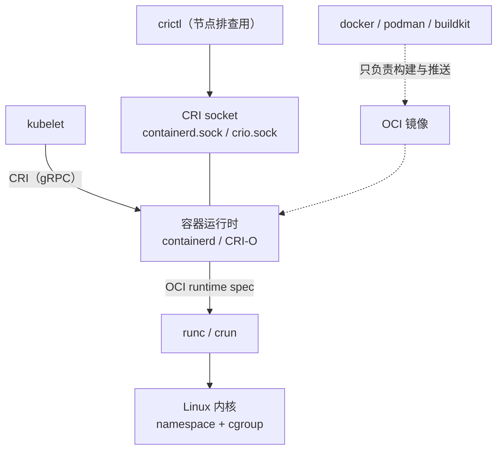
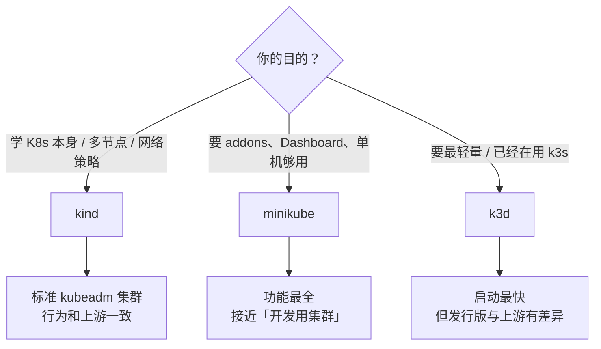

---
tags:
  - Kubernetes
  - 实验环境
  - kubectl
  - 容器运行时
created: 2026-09-13
---

# 前置与实验环境

> 本笔记对应 [[Kubernetes/00_简介]] 的「阶段 0」。目标：把一套**能随手重建、随手删掉**的本地集群跑起来，讲清容器运行时与 kubelet 的关系（CRI），把 `kubectl` 用成肌肉记忆，并从一开始就建立「先确认 context、再动手」的操作纪律。
>
> 关联复习：[[01_核心架构与对象模型]]（kubelet 与容器运行时在数据面的位置）、[[04_网络]]（本地的 LoadBalancer / Ingress 与云上的差别）、[[05_存储]]（本地默认 StorageClass 的语义）、[[06_安全]]（不要用集群管理员证书连生产）、[[09_复习与自测]]
>
> 说明：Kubernetes 侧对照 1.37 时期的官方文档；`kind` / `minikube` / `k3d` 属独立项目、迭代快，文中结论对照三者 2026 年 9 月的文档与源码，**落地前请对照你安装的版本核对**。

## 0. 30 秒速览

> [!abstract] 这一页只要记住六句话
> - **Docker ≠ 容器运行时**：kubelet 只通过 **CRI** 与运行时对话；`dockershim` 自 **1.24** 起被移除，节点上的运行时是 `containerd` / `CRI-O`，Docker 现在的角色是「构建和推送镜像的工具」。
> - **本地集群三选一，默认选 `kind`**：`kind` 用 Docker 容器当节点、跑的是标准 kubeadm 集群，多节点和网络策略演练最方便；`minikube` 功能最全（addons / dashboard / tunnel）；`k3d` 最轻量（k3s in Docker，自带 Traefik 与 `local-path`）。
> - **本地集群和云上不是一回事**：`LoadBalancer` 类型 Service 默认会一直 `Pending`（kind 要装 Cloud Provider KIND、minikube 要 `minikube tunnel`、k3d 靠 k3s 的 ServiceLB）；本地也没有 etcd 高可用、多可用区、真实块存储和节点故障。
> - **`kubectl` 只是一个 HTTP 客户端**：所有命令最终都是发往 apiserver 的 REST 请求，身份与集群由 **context** 决定；`get / describe / logs / exec / apply / delete / scale / rollout` 是骨架，`explain` 与 `api-resources` 是自带的、永远和集群版本一致的 API 文档。
> - **两个纪律动作**：动手前先看 `kubectl config current-context`，危险命令先加 `--dry-run=server`。生产误操作绝大多数起于「context 或 namespace 不对」。
> - **本地集群是一次性的**：`kind delete cluster` / `minikube delete` / `k3d cluster delete` 随手清理；每个节点都是容器，多节点很吃内存（Docker Desktop 建议至少给到 8GB）。

> [!tip] 怎么用这篇笔记
> 1. 先按 2.1 建一个三节点集群，把 2.2 和 2.3 的命令全部敲一遍——**这一篇的价值在手上，不在眼里**。
> 2. 每学完一个阶段，回到这个集群复现那一阶段的实验；实验完就删掉重建，保持环境干净。
> 3. 阶段 0 不需要记住所有 `kubectl` 子命令，但 `get / describe / logs / exec / apply / rollout / config` 这七个必须能不看帮助敲出来。

## 1. 概念

### 1.1 容器运行时：kubelet 只说 CRI

Kubernetes 不直接管理容器进程，它定义了一套 gRPC 接口 **CRI（Container Runtime Interface）**，由运行时实现它。kubelet 只跟 CRI 说话，因此换运行时不需要改 kubelet。



**为什么把 Docker 换掉**：Kubernetes 早期直接集成 Docker Engine，中间有一层叫 `dockershim` 的适配代码——因为 Docker Engine 本身并不是 CRI 实现。这条链多一跳、维护成本高，还要跟着 Docker 的发版节奏走。**`dockershim` 在 v1.24 被移除**之后，节点上就不再需要 Docker 守护进程了；而镜像格式没有变（都是 OCI 镜像），所以「用 Docker 构建、在 containerd 上运行」是完全正常的组合。

三个层次要分清，面试很爱问：

| 层次            | 是什么                    | 例子                              |
| ------------- | ---------------------- | ------------------------------- |
| 镜像（OCI image） | 分层的文件系统 + 配置，只是一个静态文件  | `nginx:1.27`、`docker build` 的产物 |
| 容器运行时         | 实现 CRI，负责拉镜像、建容器、管生命周期 | `containerd`、`CRI-O`            |
| OCI runtime   | 真正调用内核创建进程的低层工具        | `runc`、`crun`                   |

节点上的关键路径与命令对照：

| 项目 | 值 | 说明 |
| --- | --- | --- |
| containerd 的 CRI socket | `/run/containerd/containerd.sock`（Windows 为 `npipe://./pipe/containerd-containerd`） | kubelet 用 `--container-runtime-endpoint` 指定 |
| CRI-O 的 CRI socket | `/var/run/crio/crio.sock` | 发行版可能调整，以实际配置为准 |
| 查镜像 / 容器 | `crictl images` / `crictl ps` | 节点上排查运行时，**不要再用 `docker ps`** |
| 看容器日志 | `crictl logs <id>` | 对应 K8s 侧的 `kubectl logs` |
| 平时用的 docker 命令 | `docker build` / `docker push` / `docker buildx` | 只用于构建与推送，和节点数据面无关 |

> [!warning] cgroup driver 必须一致
> kubelet 与容器运行时必须使用**同一个 cgroup driver**（绝大多数发行版是 `systemd`）。不一致会表现为节点频繁 `NotReady`、`kubelet` 反复重启。较新的 kubelet 可以从 CRI 侧查询该信息，但显式配置成一致仍是最稳妥的做法。

### 1.2 三种本地集群怎么选

三个工具解决的是同一个问题：**在你自己的机器上得到一套可丢弃的 Kubernetes**。差别在「谁在当节点」和「自带多少东西」。

| 维度 | `kind`（推荐） | `minikube` | `k3d` |
| --- | --- | --- | --- |
| 本质 | Docker 容器当节点，集群用**标准 kubeadm** 引导 | 单机集群，支持容器或虚拟机 driver | 在 Docker 里跑 **k3s**（轻量发行版） |
| 依赖 | Docker（或 Podman）；Docker Desktop 建议给 VM 8GB 内存 | 2 CPU + 2GB 空闲内存起，外加容器或虚拟机管理器 | Docker（v5.x 要求 ≥ 20.10.5） |
| 多节点 | 支持，配置文件里声明 `control-plane` / `worker` | 支持，`--nodes N`；`--ha` 起 3 个控制面 | 支持，`--servers` / `--agents` |
| 默认 CNI | `kindnetd`（可用 `disableDefaultCNI` 换成 Calico/Cilium） | `--cni` 默认 `auto`，可选 `bridge`/`calico`/`cilium`/`flannel`/`kindnet` | 继承 k3s：Flannel + NetworkPolicy 控制器 |
| 默认 StorageClass | 自带默认类 `standard`（`rancher.io/local-path`，`WaitForFirstConsumer` + `Delete`） | 自带 hostPath 型动态供给（`storage-provisioner` addon，非 CSI） | 自带 `local-path`（Rancher Local Path Provisioner） |
| `LoadBalancer` 类型 | 默认一直 `Pending`，需要装 Cloud Provider KIND | `minikube tunnel` 提供 | k3s 自带 ServiceLB，开箱可用 |
| 入口控制器 | 自行安装 Ingress / Gateway 实现 | `minikube addons enable ingress` | 自带 Traefik（占用 80/443） |
| 常见用途 | **学 Kubernetes 本身**、多节点与 NetworkPolicy 演练、CI | 想要「开箱功能全」的单机体验、addons、Dashboard | 最轻最快、贴近 k3s 生态与边缘场景 |



> [!important] 三个项目都「不是生产」
> 它们都用于本地实验和 CI。生产环境用 `kubeadm` 自建或托管服务（EKS / GKE / ACK 等）；想练集群运维本身，用 `kubeadm` 在几台虚拟机上搭，而不是拿 `kind` 当练手对象。

### 1.3 kubectl 的心智模型与 kubeconfig

`kubectl` 没有任何本地状态：它读取 kubeconfig，解析出**集群地址 + 身份 + 命名空间**，然后向 `kube-apiserver` 发 REST 请求。想亲眼确认这一点，用 `kubectl get pods -v=8` 就能看到它实际发出的请求。

一个 kubeconfig 文件由四部分组成：

| 部分 | 内容 | 说明 |
| --- | --- | --- |
| `clusters` | apiserver 地址 + CA | 「连哪里」 |
| `users` | 客户端证书 / token / exec 插件 | 「我是谁」 |
| `contexts` | cluster + user + 默认 namespace | 「连哪里、以谁的身份」 |
| `current-context` | 当前选中的 context | 不加 `--context` 时就用它 |

`KUBECONFIG` 环境变量可以指向**多个**文件（Linux/macOS 用 `:` 分隔，Windows 用 `;`），按顺序合并。`kind` 与 `k3d` 默认会把新集群的 context 合并进 `$HOME/.kube/config`，所以多套本地集群会在同一个文件里共存——这正是「切错环境」的高发场景。

最小必要的配置类命令：

```text
kubectl config get-contexts                      # 有哪些集群可用，* 是当前
kubectl config current-context                   # 我此刻在哪个集群
kubectl config use-context kind-lab              # 切集群
kubectl config set-context --current --namespace=default   # 给当前 context 设默认 namespace
kubectl config view --minify                     # 只看当前 context 展开后的配置
```

> [!danger] 不要用本地集群的管理员 kubeconfig 的习惯去连生产
> `kind` / `minikube` / `k3d` 默认给你的是**集群管理员的客户端证书**。生产集群应当用 OIDC 之类的身份 + 短期凭据，并把 kubeconfig 放在受控位置、明确区分环境（详见 [[06_安全]]）。习惯一旦养成，误操作只是时间问题。

### 1.4 四类「查看」命令的分工

排障速度的差距，主要来自知不知道该用哪个命令。

| 命令 | 回答的问题 | 典型用法 |
| --- | --- | --- |
| `kubectl get` | 「有哪些对象、状态如何」 | `get pods -A -o wide`、`get pods -l app=web --watch` |
| `kubectl describe` | 「这个对象为什么是这样」 | 末尾的 **Events** 是排障第一现场 |
| `kubectl explain` | 「这个字段是什么」 | `explain pod.spec.containers --recursive`（自带 API 文档） |
| `kubectl api-resources` | 「集群里有哪些资源类型」 | `--namespaced=false`、`--api-group=apps`、看短名 |

再补三个高频动作：

- `kubectl api-versions`：列出集群支持的 `group/version`，判断某个资源是否可用（配合升级前的弃用 API 检查）。
- `kubectl get -o json/yaml`：拿原始对象。字段太多时用 `-o jsonpath='{...}'`（简单取值）或 `| jq`（复杂过滤）；表格化输出用 `-o custom-columns=...`。
- `--dry-run=client` 与 `--dry-run=server`：**两者不是一回事**。client 端只做本地语法与结构检查；server 端会把对象送到 apiserver，过一遍准入控制并补全默认值，然后**不写入** `etcd`。要验证一个 manifest 在生产能不能被接受，只有 server 端 dry-run 有意义。

```text
# 只想知道「字段名对不对」
kubectl apply -f pod.yaml --dry-run=client

# 想确认「准入策略放不放行、默认值长什么样」
kubectl apply -f pod.yaml --dry-run=server -o yaml
```

> [!tip] `explain` 比搜索引擎可靠
> 官方文档可能对应的是别的版本，而 `kubectl explain` 读的是**你当前集群的 OpenAPI**，字段、类型、是否必填永远与集群一致。拿不准字段名时先用它，再去查文档里的语义说明。

## 2. 动手：把本地集群跑起来

### 2.1 用 kind 起一个三节点集群

> [!example]- 动手验证：1 控制面 + 2 工作节点
> 把下面内容存成 `kind-lab.yaml`（这是 **kind 自己的配置文件**，不是 Kubernetes 资源，不能用 `kubectl apply`）：
> ```yaml
> kind: Cluster
> apiVersion: kind.x-k8s.io/v1alpha4
> name: lab
> nodes:
>   - role: control-plane
>   - role: worker
>   - role: worker
> ```
> 创建与验证：
> ```text
> kind create cluster --config kind-lab.yaml
> kubectl cluster-info --context kind-lab
> kubectl get nodes -o wide
> kubectl get storageclass
> kubectl get pods -A
> ```
> 预期结果：
> - `get nodes` 有 3 个节点且都是 `Ready`（版本由 kind 默认节点镜像决定，形如 `v1.3x.x`；要对齐版本就用 `--image` 指定节点镜像）。
> - `get storageclass` 能看到默认类 `standard`，`PROVISIONER` 为 `rancher.io/local-path`——注意它用的是 `WaitForFirstConsumer`，这正是 [[05_存储]] 讲的「有拓扑约束的存储不要用 `Immediate`」的实例。
> - `get pods -A` 里能看到 `local-path-provisioner` 与 CNI 相关 Pod。
>
> 用完清理（本地集群应当随手删）：
> ```text
> kind delete cluster --name lab
> ```

### 2.2 观察节点与运行时

节点「是什么」，决定了很多现象的解读方式。至少做一次下面两组对照：

```text
# 从 Kubernetes 视角看节点
kubectl get nodes -o wide
kubectl describe node lab-worker | head -40      # Capacity / Allocatable / Conditions / Taints

# 从运行时视角看「节点容器」
docker ps --filter name=lab-worker               # 每个 kind 节点就是一个 Docker 容器
docker exec -it lab-worker crictl ps             # 节点上用 crictl，不是 docker ps
docker exec -it lab-worker crictl images
```

做完这组对照，你就能解释：为什么「Pod 的 IP 在宿主机上 ping 不通」很正常（Pod 网络在节点容器/网络命名空间里），以及为什么节点上的排查工具有时是 `crictl` 而不是 `docker`。更完整的容器视角排障见 [[07_生产运维与可观测性]]。

### 2.3 kubectl 基本功五连

> [!example]- 动手验证：部署 → 观察 → 扩缩容 → 进容器 → 清理
> ```text
> kubectl create deployment web --image=nginx:1.27 --replicas=2
> kubectl rollout status deployment/web
> kubectl get pods -l app=web -o wide
>
> kubectl scale deployment/web --replicas=4
> kubectl get pods -l app=web
>
> kubectl logs -l app=web --tail=20
> kubectl exec -it deploy/web -- nginx -v
>
> kubectl port-forward deploy/web 8080:80     # 另开一个终端 curl http://localhost:8080
>
> kubectl delete deployment web
> ```
> 观察重点：
> - `rollout status` 会**阻塞到更新完成**，是发布时的标准动作；`scale` 只改 `replicas`，不触发新版本。
> - `-l app=web` 是标签选择器；`-o wide` 会多出节点与 Pod IP 两列——这两列是网络排障的起点。
> - `port-forward` 只在你自己的机器和 Pod 之间做一条隧道，**不经过 Service**，不要用它判断 Service 是否正常。

### 2.4 本地镜像怎么进集群

本地构建的镜像不在集群的镜像仓库里，节点自然拉不到。三个工具各有对应的导入方式：

| 工具 | 导入命令 | 注意 |
| --- | --- | --- |
| `kind` | `kind load docker-image my-app:latest --name lab` | 镜像要先在本机存在；节点多时逐个加载，注意耗时 |
| `k3d` | `k3d image import my-app:latest -c mycluster` | 会导入到全部节点 |
| `minikube` | `minikube image load my-app:latest` | 也可用 `minikube image build` 直接构建进集群 |

配合 `imagePullPolicy` 一起理解：标签是 `latest` 或未写标签时默认 `Always`，其它标签默认 `IfNotPresent`；用 digest 固定镜像时不会被覆盖成 `Always`。想在本地跑通「导入的镜像」，用固定标签（如 `my-app:dev`）最省事（详见 [[06_安全]] 的镜像与供应链部分）。

## 3. 生产实践

### 3.1 从本地环境走向生产

- **环境和工具选对**：真实环境用 `kubeadm` 自建或托管服务；不要用脚本拼的集群上生产，也不要把 `kind` 当生产环境。
- **版本意识从第一天开始**：本地集群版本尽量接近目标生产版本；`kubectl` 与 apiserver 之间建议只差 ±1 个小版本，`kubelet` 最多比 apiserver 老 3 个小版本；`kubeadm` 不支持跳小版本升级（见 [[07_生产运维与可观测性]] 的升级章节）。
- **明确「本地验证不了什么」**：etcd 高可用与恢复、跨可用区调度、真实块存储与快照、云负载均衡、节点故障与驱逐、NetworkPolicy 在真实 CNI 上的行为——这些必须在测试环境的真实集群里验证。
- **环境要能一键重建**：把建集群的命令（`kind` 配置文件、`k3d` 参数）和实验用的 manifest 一起放进仓库，实验失败时直接删掉重建，而不是手工修集群。

### 3.2 多集群 / 多 namespace 的操作纪律

| 纪律 | 做法 |
| --- | --- |
| 名字里带环境 | context 命名带前缀（`prod-` / `staging-` / `lab-`），一眼能看出这是哪套环境 |
| 每次动手前确认 | 危险命令前先 `kubectl config current-context`，或把 context 显示在 shell 提示符里 |
| 用工具降摩擦 | `kubectx` / `kubens` 是社区工具，切换 context 与 namespace 比敲 `kubectl config` 快得多；但如果团队里不是人人都装，脚本里仍要写完整的 `kubectl config` 形式 |
| 危险命令先演练 | `--dry-run=server`、`kubectl diff`、先 `get` 再 `delete`；批量操作先 `--dry-run` 或在小范围验证 |
| 凭据分级 | 本地集群管理员证书只用于本地；生产用 OIDC / 短期凭据，不给共享账号（见 [[06_安全]]） |

### 3.3 常见坑

| 常见说法或做法 | 事实 / 后果 |
| --- | --- |
| 「K8s 用 Docker 跑容器，所以节点上要装 Docker」 | `dockershim` 自 1.24 起已移除；节点运行时应是 `containerd` / `CRI-O`，Docker 只用于构建镜像 |
| 「`kind` 只是玩具，装不了 PVC / Ingress」 | `kind` 自带默认 StorageClass（`standard`，local-path 型），也能部署任意 Ingress / Gateway 实现；它只是**不预装**这些东西 |
| 「`LoadBalancer` 类型的 Service 声明了就会有外网 IP」 | 本地集群没有云 LB：kind 需要 Cloud Provider KIND，minikube 需要 `minikube tunnel`，k3d 靠 k3s ServiceLB，否则一直 `Pending` |
| 「`--dry-run` 就能验证 manifest」 | 只有 `--dry-run=server` 会过准入并补全默认值；client 端只是本地语法检查 |
| 「本地集群跑通，生产就能跑」 | 本地没有 etcd HA、多可用区、真实存储与负载均衡，也没有节点故障和驱逐的规模效应 |
| 「用 `docker logs` / `docker ps` 排查 Pod」 | 节点上用 `crictl ps` / `crictl logs`；Kubernetes 视角用 `kubectl logs` / `describe` |
| 「`ping` 不通 ClusterIP，所以 Service 坏了」 | `ClusterIP` 是转发规则而非绑在网卡上的地址，`ping` 不通是常态（见 [[04_网络]]） |
| 「删掉集群再建一个，环境就一样了」 | 本地集群是一次性的，集群内的 PVC 数据、导入的镜像、修改过的配置都会一起消失——需要可复现的配置文件 |

### 3.4 资源占用与清理

- **内存**：`kind` 的每个节点是一个 Docker 容器，三节点集群 + 控制面组件通常要 4~6GB；Docker Desktop 官方建议给到 8GB。笔记本上别同时跑多套集群。
- **磁盘**：镜像、节点容器和本地 PV 数据都在 Docker 的数据目录里；长期不清理会吃掉几十 GB。
- **清理顺序**：先删集群（`kind delete cluster --name lab`），再考虑 `docker system prune`（会删掉未被使用的镜像缓存，谨慎执行）。
- **端口冲突**：多套集群同时运行会争抢 6443 / 80 / 443 / 30000-32767 这些端口，这是「集群起不来」的常见原因之一。

## 4. 排障速查

### 4.1 `kind create cluster` 失败或集群起不来

> [!tip] 第一反应不要是「Kubernetes 有问题」
> 九成问题是**宿主机的 Docker 或资源**：Docker 没启动、内存不够、端口被占用、镜像拉不下来。

按顺序排查：

1. **Docker 是否可用**：`docker info`；Docker Desktop 是否给足了内存。报错里出现 `Cannot connect to the Docker daemon` 就是这一类。
2. **资源与端口**：`docker ps` 看是否有残留的旧集群容器占着 6443；`kind get clusters` 看是否已有同名集群。
3. **节点内部问题**：`kubectl get nodes`、`kubectl -n kube-system get pods`，再看具体 Pod 的 Events；节点容器里的 `journalctl -u kubelet` 是第一现场。
4. **收集现场**：`kind export logs ./kind-logs --name lab` 会把各节点日志导出到目录，是提 issue 或深入分析的标准动作。
5. **重建**：本地集群不值得抢救，确认没有要保留的数据后直接 `kind delete cluster` 重建。

### 4.2 `kubectl` 连不上，或者操作了「错误的对象」

按顺序排查：

1. **我在哪**：`kubectl config current-context`，以及 `kubectl config get-contexts`——最常见的是 context 停在别的集群。
2. **配置文件对不对**：`KUBECONFIG` 指向了哪些文件？`kubectl config view --minify` 展开后的 apiserver 地址和证书路径是否存在、是否过期。
3. **网络与证书**：`kubectl cluster-info`、`kubectl get --raw='/readyz?verbose'`；报 `x509` 往往是证书过期或系统时间不对，报连接超时往往是 apiserver 地址不可达。
4. **权限与身份**：报 `forbidden` 说明连上了但没权限，用 `kubectl auth can-i --list` 看自己有什么权限（见 [[06_安全]]）。
5. **namespace 对不对**：`kubectl config view --minify -o jsonpath='{..namespace}'`；「对象不见了」经常只是默认 namespace 变了。

## 5. 要点自测

复述时先盖住答案自己讲一遍，再展开对照。

> [!question]- 容器运行时为什么从 Docker 迁移到 containerd？
> - **Docker Engine 不是 CRI 实现**：Kubernetes 早期靠 `dockershim` 做适配，多一层维护负担和调用链。
> - **`dockershim` 在 v1.24 被移除**：节点上不再需要 Docker 守护进程，`kubelet` 直接通过 CRI 与 `containerd` / `CRI-O` 对话。
> - **镜像不受影响**：Docker 构建出的仍是 OCI 镜像，`docker build` + `containerd` 运行是正常组合。
> - **排障命令随之换血**：节点上用 `crictl`，不是 `docker ps` / `docker logs`。
> - **被问「那 Docker 还有什么用」**：本地构建、镜像打包与推送；它在数据面前的位置，1.24 之后就没有了。

> [!question]- CRI 是什么？它规定了什么、没规定什么？
> - 它是 kubelet 与容器运行时之间的 gRPC 接口，规定了「拉镜像、建/删容器、执行命令、查状态」这些运行时操作。
> - 它**不规定** Kubernetes 的资源模型（Pod、Deployment 这些都在 kubelet 以上），也不规定镜像格式（那是 OCI 的事）。
> - 好处是可替换：换成任何实现了 CRI 的运行时，kubelet 不用改；这也是 `dockershim` 能被移除的前提。

> [!question]- `kind` / `minikube` / `k3d` 怎么选？
> - **学 Kubernetes 本身、要多节点或 NetworkPolicy 演练 → `kind`**：节点是 Docker 容器，集群由标准 kubeadm 引导，行为和上游一致。
> - **要「开箱功能全」的单机体验 → `minikube`**：addons、Dashboard、`minikube tunnel` 提供 LoadBalancer，代价是相对重。
> - **要最轻最快、或本来就关注 k3s/边缘 → `k3d`**：k3s in Docker，自带 Traefik 与 `local-path`，但发行版与上游有差异，学到的一些细节不能直接套到上游集群。
> - **共同点**：三者都**不是生产**，都应当能随手删除重建。

> [!question]- 一次 `kubectl` 请求包含哪些要素？kubeconfig 里有什么？
> - 要素是：**连哪个集群、以什么身份、操作哪个 namespace 里的哪类资源**。前三者由 context 决定，最后一项由命令与参数决定。
> - kubeconfig 由 `clusters`（地址 + CA）、`users`（凭据）、`contexts`（cluster + user + namespace）和 `current-context` 组成；`KUBECONFIG` 可以指向多个文件并按顺序合并。
> - 实践含义：多套本地集群会写进同一份 kubeconfig，**切错 context 是最常见的低级事故**，所以危险操作前先确认 context。

> [!question]- `kubectl explain` 和 `kubectl api-resources` 分别解决什么问题？
> - `explain` 是「字段字典」：读的是当前集群的 OpenAPI，字段名、类型、是否必填永远与集群版本一致；`--recursive` 可以递归展开整棵字段树。
> - `api-resources` 是「资源清单」：有哪些资源类型、属于哪个 API 组、是否 namespaced、短名是什么，判断「这个资源在当前集群能不能用」。
> - 两者配合使用，可以少背很多 API 细节；升级前查弃用 API 时也要靠它们。

> [!question]- `--dry-run=client` 和 `--dry-run=server` 有什么区别？
> - `client`：只在本地做语法和结构检查，不联系集群，**不会**经过准入，也**不会**补默认值。
> - `server`：把对象发给 apiserver，走完认证 / 授权 / 准入与默认值填充，但不写入 `etcd`。
> - 所以「这个 manifest 在生产能不能提交」只有 `--dry-run=server` 能回答——这也是变更前演练的标准动作。

> [!question]- 本地集群验证不了哪些东西？
> - 控制面与 etcd 的高可用、etcd 备份恢复的真实流程与 RTO/RPO。
> - 多可用区 / 跨机架的拓扑约束与调度、真实块存储的扩容与快照。
> - 云负载均衡、真实入口流量、节点故障与批量驱逐的规模效应。
> - 只学概念用本地集群足够；**涉及可靠性与恢复的结论必须去真实测试集群验证**。

> [!question]- 本地构建的镜像为什么在集群里拉不到？怎么解决？
> - 集群节点用的是自己的镜像存储（containerd 的镜像仓库缓存），看不到你本机的 Docker 镜像。
> - 三种导入方式：`kind load docker-image`、`k3d image import`、`minikube image load`。
> - 配合固定标签（避免 `latest` 的默认 `Always`）使用，本地实验会顺畅得多。

## 6. 回到路线图

完成本笔记后，回到 [[Kubernetes/00_简介]]：

- [ ] 能讲清 Docker、containerd / CRI-O、runc / crun 三者的关系，以及 `dockershim` 为什么在 1.24 被移除
- [ ] 能用 `kind` 起一个三节点集群，并说清它和 `minikube` / `k3d` 的取舍
- [ ] 能解释本地集群的默认 StorageClass 与 `LoadBalancer` 行为，并说清「本地验证不了什么」
- [ ] 能不看帮助敲出 `get / describe / logs / exec / apply / rollout / config` 的常用形式
- [ ] 会用 `explain`、`api-resources`、`-o jsonpath/custom-columns`、`| jq` 取到想要的字段
- [ ] 能说清 `--dry-run=client` 与 `--dry-run=server` 的区别，并在变更前习惯性演练
- [ ] 已建立 context/namespace 纪律：危险命令前先确认 `current-context`

> 推荐扩展阅读：[kind Quick Start](https://kind.sigs.k8s.io/docs/user/quick-start/)、[minikube Start](https://minikube.sigs.k8s.io/docs/start/)、[k3d 文档](https://k3d.io/)、官方文档中的 [Container Runtimes](https://kubernetes.io/docs/setup/production-environment/container-runtimes/)、[kubectl 参考](https://kubernetes.io/docs/reference/kubectl/) 与 [Version Skew Policy](https://kubernetes.io/docs/setup/release/version-skew-policy/)。
