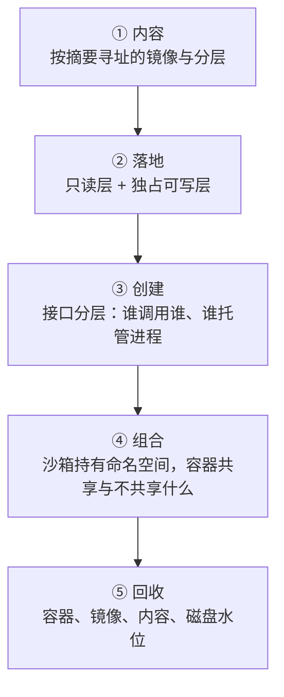

---
tags:
  - Kubernetes
  - 容器
  - 镜像
  - 运行时
  - 学习地图
created: 2026-09-23
---

# 容器技术

## 知识地图

### 一个容器在节点上的一生

时间主线跟着**一个容器**走：从「它的内容在仓库里」开始，到「它在某个节点上变成一组进程」，再到「它消失之后字节被回收」。

| # | 站点 | 这一站在解决什么 | 到这里要能说清 |
| --- | --- | --- | --- |
| 1 | 内容 | 用名字引用制品会同时出哪四件事 | 摘要解决了什么、标签解决不了什么；一份镜像由哪几个对象组成 |
| 2 | 落地 | 共享与独占怎么分开 | copy-up 的触发与代价；节点上的三本账分别归谁 |
| 3 | 创建 | 接口、实现与进程托管为什么要分三层 | CRI 规定了什么、没规定什么；shim 为什么存在 |
| 4 | 组合 | 一组容器凭什么共享上下文 | Pod 内共享哪几项、不共享哪几项；两级重启粒度 |
| 5 | 回收 | 引用关系决定了什么能释放 | 删除为什么不等于释放；水位越线时节点会做什么 |

### 四条横切线

| 横切线 | 贯穿内容 | 收口于 |
| --- | --- | --- |
| 账目线 | 压缩体积 → 解压落盘 → 共享去重 → 可写层 → 日志 → 文件系统水位 | 「占了多少」必须先说清是哪一本账 |
| 身份线 | 标签 → 清单摘要 → 配置摘要 → 本地镜像标识 → 沙箱与容器标识 | 每一段都可能「看起来一样」，核对时必须说明比的是哪一段 |
| 权限线 | 拉取凭证 → 运行身份 → 能力与系统调用过滤 → 卷属主与挂载标志 | 权限是叠加的，缺一层不会报同一种错误 |
| 回收线 | 容器引用 → 沙箱引用 → 镜像引用 → 内容块 → 磁盘空间 | 引用不消失，空间就不回来 |

## 术语速查

| 名词 | 一句话解释 | 在哪一篇展开 |
| --- | --- | --- |
| 镜像 / 层 / 摘要 | 一份由内容寻址串起来的树 / 差分归档 / 由内容算出的唯一标识 | 原理：镜像与内容寻址 |
| 镜像索引 / 清单 / 配置 | 按平台分支的清单集合 / 指向配置与层 / 运行参数与层顺序 | 原理：镜像与内容寻址 |
| 标签（tag） | 仓库侧的**可变**映射，指向某个摘要；`latest` 没有「最新」的语义 | 原理：镜像与内容寻址 |
| 白障 / 不透明目录 | 层格式里表示「删除」与「此目录下层内容全部不可见」的两个约定名 | 原理：镜像与内容寻址 · 从镜像到根文件系统 |
| 分发单位 | 拉取以 blob 为单位，缺哪层补哪层；拉取由节点发起，不是集群一次 | 原理：镜像与内容寻址 |
| 联合挂载 / copy-up | 多个只读层加一个可写层拼成一个视图 / 写只读层文件时整份复制到可写层 | 原理：从镜像到根文件系统 |
| 快照器（snapshotter） | 把「若干只读层 + 一个可写层」组织成目录的可替换组件，**节点级选择** | 原理：从镜像到根文件系统 |
| 节点上的三本账 | 只读层（共享）/ 可写层（独占）/ 日志与卷（各自策略） | 原理：从镜像到根文件系统 · 体系 |
| CRI | `kubelet` 与运行时之间的 gRPC 接口，分运行时服务与镜像服务两个 | 原理：运行时分层与 CRI |
| 高层运行时 / OCI runtime | 实现 CRI 的常驻服务（镜像与生命周期）/ 真正创建进程的短命令 | 原理：运行时分层与 CRI |
| shim | 托管容器进程的轻量进程；要注意「守护进程重启不带走容器」还依赖服务单元的两项配置 | 原理：运行时分层与 CRI |
| 差分 ID / 链 ID | 未压缩层的摘要 / 「这一层叠加到前一层之后」算出的标识，快照就按它命名 | 原理：镜像与内容寻址 · 从镜像到根文件系统 |
| 文件系统用量接口 | 量的是快照目录的未压缩占用，**不含内容存储**；三块账口径不同 | 原理：从镜像到根文件系统 · 实操 |
| 沙箱 / pause 容器 | 建好并持有 Pod 那组命名空间的容器；Pod 的 IP 属于它 | 原理：运行时分层与 CRI · 一个 Pod 在节点上的形态 |
| `RuntimeClass` / 运行时档位 | 在 Pod 上选择节点侧运行时配置的字段；名字对不上时失败发生在节点侧 | 原理：运行时分层与 CRI |
| Pod 内共享项 | 网络、IPC、主机名总是共享；PID 与用户命名空间可开关；挂载与 cgroup 各自独立 | 原理：一个 Pod 在节点上的形态 |
| 卷的落地方式 | 由 `kubelet` 准备好宿主侧位置，再分别绑定挂载进各容器；挂载是覆盖式的 | 原理：一个 Pod 在节点上的形态 |
| 两级重启 | 容器级重启保留沙箱、IP 与卷；沙箱重建会让整个 Pod 的容器重来 | 原理：一个 Pod 在节点上的形态 · 体系 |
| 初始化容器 / 边车容器 | 边车在实现上是「带容器级总是重启策略的初始化容器」；Pod 终止时按声明顺序的相反顺序关闭 | 原理：一个 Pod 在节点上的形态 |
| 边车的非 0 退出码 | Pod 终止时属**正常**：宽限期用尽会先发终止信号再强杀，外部工具一般应忽略它 | 原理：一个 Pod 在节点上的形态 |
| `imagePullPolicy` | 节点侧是否重新解析并拉取；摘要引用与标签引用的默认行为不同 | 体系 · 实操 |
| 镜像回收阈值 / 最小回收年龄 | 高阈值触发、低阈值停止 / 保护刚拉下来的镜像不被立刻回收 | 体系 · 治理 |
| 节点压力驱逐 | 水位越线后按「用量是否超过 requests」与优先级排序淘汰；不使用服务质量档位决定顺序 | 体系 · 治理 |
| 日志轮转上限 | 单文件上限与文件份数，两者相乘约等于节点侧保留窗口 | 体系 · 实操 · 治理 |
| 容器盘账本的落点 | 运行时存储路径与承载容器、日志的文件系统，决定哪些账本互相挤占 | 实操 · 治理 |
| `nodefs` / `imagefs` / `containerfs` | 节点主文件系统、镜像文件系统、容器可写层文件系统三个标识；后两个**可选**，由 `kubelet` 从运行时自动发现，也可能三者同源 | 体系 · 实操 · 治理 |
| 默认硬驱逐阈值 | 内存 100Mi、节点文件系统可用 10%、镜像文件系统可用 15%、inode 可用 5%；**改了任意一个，其余会变成 0** | 体系 · 治理 |

## 故障现场定位表

排障的第一问不是「怎么修」，而是「**卡在哪一站、是哪一本账**」。用这张表把现象定位到类别，再进对应篇目。

| 你看到的现象 | 属于哪一类 | 现场在哪 | 第一反应不要做 |
| --- | --- | --- | --- |
| Pod 长时间停在容器创建阶段 | 绑定后还有三站 | 事件里的原因短语、沙箱与容器的详细状态 | 不要在调度与资源上继续排查 |
| 节点上找不到那个镜像 | 视角或工具不对 | `kubelet` 配置指向的运行时端点、该运行时的镜像列表与服务日志 | 不要用另一个客户端的列表下结论 |
| 节点上跑的还是旧代码 | 身份与拉取策略 | 镜像引用是不是摘要、Pod 上的拉取策略、本地已有层 | 不要只重新部署一次 |
| 容器反复重启 | 退出原因 | 上一次运行的日志、退出原因与退出码、cgroup 的终止事件计数 | 不要只看退出码 |
| 容器被终止且退出原因指向内存 | 额度与视图分属两个机制 | 该容器的 cgroup 上限与用量、事件计数、节点水位 | 不要在容器内用整机视图判断额度 |
| 删掉 Pod 或镜像后磁盘不降 | 引用关系 | 只读层与可写层各自用量、镜像是共享的还是独占的 | 不要断言泄漏 |
| 节点磁盘告警并开始驱逐 | 哪一本账在涨 | 三个文件系统标识各自的水位、两次同口径读数的差值 | 不要先清日志 |
| 发布时拉取变得很慢 | 下载、解压、落盘三段 | 拉取期间节点的网络吞吐与磁盘写入、本地已有层占比 | 不要一律归给网络带宽 |
| 日志「缺了一段」 | 轮转与采集的分工 | 单文件上限与份数、采集端是否已取走 | 不要先怀疑采集丢数据 |
| 担心运行时升级会中断业务 | 影响面的口径 | 容器进程的托管方式、变更窗口内依赖同一组件的操作 | 不要把影响面写成业务中断 |
| 同池节点行为不一致，配置文件看起来一样 | 节点侧配置的版本断层 | 运行时的大版本、该版本下的配置键位与实际生效值 | 不要只做配置文件的文本比对 |
| 边车容器在 Pod 终止时以非 0 退出码结束 | 终止顺序的正常现象 | 终止顺序、退出原因与退出码 | 不要当成故障去修 |
| 改了硬驱逐阈值之后节点迟迟不动作 | 阈值不再继承默认值 | 该配置项是否被单独改动过、其余阈值现在是多少 | 不要以为是「没重启所以没生效」 |

两个容易被忽略的边界：

- **集群侧看到的是结论，节点侧看到的才是事实。** 两者用的不是同一套标识，任何「机器上还剩什么、占用多少、谁在写」的问题都必须落到节点侧；先把对象对应关系建立起来，再谈异常。
- **「找不到了」与「多出来了」是两类问题。** 前者沿创建链往前查，后者先做对象对应再判异常——沙箱容器与已退出保留的容器都是设计的一部分。

## 篇目

| # | 篇目 | 一句话 |
| --- | --- | --- |
| 01 | [[Kubernetes/00_容器技术/01_原理_镜像与内容寻址\|原理：镜像与内容寻址]] | 名字会漂、内容不会；摘要一次解决校验、去重、增量与固定版本 |
| 02 | [[Kubernetes/00_容器技术/02_原理_从镜像到根文件系统\|原理：从镜像到根文件系统]] | 只读层共享、可写层独占；copy-up 的代价与节点上的三本账 |
| 03 | [[Kubernetes/00_容器技术/03_原理_运行时分层与CRI\|原理：运行时分层与 CRI]] | 接口、实现与进程托管分三层；沙箱持有命名空间 |
| 04 | [[Kubernetes/00_容器技术/04_原理_一个Pod在节点上的形态\|原理：一个 Pod 在节点上的形态]] | 共享的是命名空间不是文件；两级重启粒度决定影响面 |
| 05 | [[Kubernetes/00_容器技术/05_体系_一个容器在节点上的一生\|体系：一个容器在节点上的一生]] | 八站串成一条链，再收拢账目、身份、权限、回收四条横切线 |
| 06 | [[Kubernetes/00_容器技术/06_实操_节点侧的容器观测\|实操：节点侧的容器观测]] | 一个问题一把工具，字段的五件事读法与基线卡 |
| 07 | [[Kubernetes/00_容器技术/07_判例_高频误判\|判例：高频误判]] | 现象 → 误判 → 判据 → 出处 |
| 08 | [[Kubernetes/00_容器技术/08_治理_镜像与运行时治理\|治理：镜像与运行时治理]] | 参数怎么反推、交付哪些产物、与其它章的接口在哪 |

## 参考文档

- OCI Image Spec（`manifest`、`image-index`、`config`、`layer`、`descriptor`、`media-types`）与 OCI Distribution Spec：镜像的四个对象、摘要的定义、层的差分语义、按内容存取的分发模型。
- Kubernetes 官方文档：容器运行时（CRI 的定位与受支持的运行时、`dockershim` 移除）、镜像与 `imagePullPolicy`、Pod 生命周期与容器状态、节点压力驱逐与镜像回收、容器日志、运行时类。
- 上游 CRI 接口定义：运行时服务与镜像服务的方法集合、版本协商入口、沙箱与容器相关消息。
- OCI Runtime Spec 与 `runc`：运行配置的结构与运行时命令的语义。
- 具体运行时（containerd、CRI-O）的官方文档：CRI 配置的位置与默认值、命令空间与命令行客户端、内容存储与快照器、进程托管模型。
- 内核文档 `Documentation/admin-guide/cgroup-v2.rst`、`Documentation/filesystems/overlayfs.rst`：容器额度与联合挂载的宿主侧判据。
- 上述文档与默认值按**与集群同一主版本**取；本篇章的版本口径是**当前稳定版 1.37 的官方文档**（2026-08 发布）与同一时期的 OCI 规范、运行时文档。版本门控（适配层的移除版本、`kubelet` 对 CRI 接口版本的要求、配置键在运行时大版本之间的搬迁）必须在正文里写明依据的版本，节点上的实际值以现场配置为准。

入口：[[Kubernetes/00_简介|00 学习大纲]]
