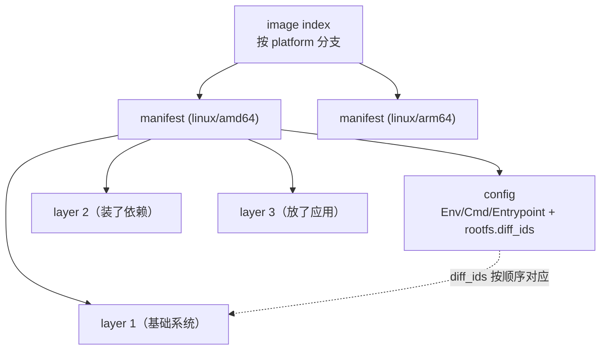

---
tags:
  - Kubernetes
  - 容器
  - 镜像
  - OCI
  - 原理
created: 2026-09-23
---

# 镜像与内容寻址

## 1. 用名字引用一个制品，会同时出四件事

假设镜像只有「名字 + 标签」一种标识方式（`nginx:1.27`），那么分发一套软件会立刻撞上四件互相独立的事：

| 出的事 | 具体表现 | 后果 |
| --- | --- | --- |
| 同名不同内容 | 同一个标签被重新推送过，两台机器在不同时间拉到不同的东西 | 环境不可复现，「我这里是好的」无法证伪 |
| 无法校验 | 传输链路或存储被改动过，接收方无从判断 | 完整性只能靠信任，不能靠验证 |
| 无法去重 | 十个镜像共用同一个基础系统，各存一份、各传一份 | 仓库与节点磁盘、跨机房带宽成倍浪费 |
| 无法增量 | 每次都要搬整份制品 | 拉取时间与实际变更量脱钩 |

文件系统与版本控制领域早就有现成答案：**不按名字索引，按内容索引**。名字（标签）退化成「一个指向某份内容的、可变的指针」，内容本身由自己的哈希值命名。镜像规范选了同一条路，于是上面四件事同时被解决：内容寻址天然可校验（重算哈希即可）、天然可去重（同一份内容只有一个地址）、天然可增量（按地址分发，只搬缺的）。

## 2. 一份镜像其实是三个 JSON 加一串 blob

镜像不是一个文件，而是**一棵由内容地址串起来的树**。四类对象：

| 对象 | 作用 | 媒体类型 |
| --- | --- | --- |
| 镜像索引（image index） | 列出同一个逻辑镜像在不同平台上的清单，供拉取方按平台挑选 | `application/vnd.oci.image.index.v1+json` |
| 镜像清单（manifest） | 指向「一份配置 + 若干层」 | `application/vnd.oci.image.manifest.v1+json` |
| 镜像配置（config） | 运行参数与层顺序：`architecture`/`os`、`config`（`Env`/`Cmd`/`Entrypoint`/`User`/`WorkingDir`/`Labels`/`StopSignal` 等）、`rootfs.diff_ids`、`history` | `application/vnd.oci.image.config.v1+json` |
| 层（layer） | 一个差分归档（tar，可压缩） | `application/vnd.oci.image.layer.v1.tar`、`...tar+gzip`、`...tar+zstd` |

清单里指向别的对象的每一项都是一个**描述符（descriptor）**，固定带三个字段：`mediaType`、`digest`、`size`；可选的还有 `platform`（给索引里的条目用）、`urls`、`annotations`。**这棵树里没有一处写「名字」**——名字只存在于「registry 的某个标签指向哪个 digest」这一处映射里。

老的 Docker 媒体类型（`application/vnd.docker.distribution.manifest.v2+json`、`application/vnd.docker.image.rootfs.diff.tar.gzip`）与 OCI 的这几种在结构上兼容，仓库与运行时同时认两套；所以「用 Docker 构建、在 containerd 上运行」不需要任何转换，这不是兼容性妥协，而是两者本来就描述同一件事。

## 3. digest 同时解决校验、去重、增量与固定版本

digest 的写法是 `算法:十六进制`，例如 `sha256:0f1e…`。计算对象是**内容自身的字节**，对清单与配置这类 JSON 来说就是它在仓库里的那份规范序列化结果。读法上有三点必须分清：

| 项 | 事实 | 判据 |
| --- | --- | --- |
| 谁有 digest | 每一个 blob 都有：每一层、config、manifest 各有一个 | `crictl images` 的 `IMAGE ID` 是 config 的 digest；`crictl inspecti` 能看到 manifest 与各层 |
| 为什么按 digest 引用就是固定版本 | 内容变一个字节，digest 就变 | 想排除「标签被重推过」的干扰，就把 `image:` 写成 `仓库@sha256:…` |
| 标签是什么 | 仓库里的一条可变映射：`标签 → digest` | 同一个标签在不同时间可以指向不同 digest；`latest` 只是恰好叫这个名字，**没有「最新」的语义** |
| 层复用不等于镜像可复现 | 改一个环境变量会生成新的 config，进而生成新的 manifest，尽管层一个没变 | 判断「两个镜像是不是同一份内容」要比 manifest 的 digest，不是比层的 digest |

最后一行是现场最容易搞混的一处：**镜像的身份在 manifest 这一层，不在层这一层。** 两台机器上同一个标签拉到的层全都一样、只有 `Env` 差一个值，它们仍然是两个不同的镜像，manifest digest 不同，按 digest 固定版本的行为也不同。

写法和口径上有两条硬规定：**算法必须支持 `sha256`**（另有 `sha512`、`blake3`），且它的编码必须是**小写十六进制**，大写不允许；校验时应先比长度再算哈希，以减少碰撞面。

而「摘要」其实是四个不同的东西，混用是排障时最常见的口径错误：

| 名字 | 算的是哪份字节 | 出现在哪 | 判据 |
| --- | --- | --- | --- |
| 层摘要（layer digest） | 层**按存储形态**（通常已压缩）的字节 | 清单的 `layers[]` 描述符 | 仓库里那份 blob 的名字 |
| 差分 ID（DiffID） | **未压缩**的层归档的字节 | 配置的 `rootfs.diff_ids`，按层顺序 | 规范明确警告不要与层摘要混为一谈：两者是同一层的两种字节形态 |
| 镜像 ID（ImageID） | 配置 JSON 的字节 | 节点上运行时的镜像列表 | 运行时的列表里显示的就是它 |
| 链 ID（ChainID） | 由前一层的结果与当前层的差分 ID 拼起来再算 | 运行时内部给快照命名 | 既不是层摘要也不是差分 ID，而是「这一层叠上去之后」的标识 |

配置里的 `rootfs.type` 固定为 `layers`，`diff_ids` 是**未压缩**归档的摘要数组；`history` 里还有 `empty_layer` 标记，用来区分「这条历史记录没有产生文件系统差异」。

## 4. 层是差分，不是快照

每一层是一个 tar 归档，按 `diff_ids` 的顺序依次应用到一个空目录上，最终得到容器的根文件系统。它是**相对于下一层的差分**，所以「删除」必须在格式里有表示，否则套用上层时会留下不该在的文件。层格式用两个约定名表达：

| 归档中的条目 | 含义 |
| --- | --- |
| `.wh.<名字>` | 白障（whiteout）：在这一层删除下层同名条目。它是一个**普通空文件**，名字就是 `.wh.` 加上被删条目的名字 |
| `.wh..wh..opq` | 不透明目录（opaque）：这个目录在更下层的内容全部不可见 |

它们有几条容易记反的语义：

- **白障只作用于更下层。** 应用一条删除记录时，它遮的是下层里的同名条目，不会删掉本层自己新加的东西。
- **不透明目录先于本层同级条目生效**，与它在归档里的位置无关；所以「先清空目录、再往里放新文件」和「先放新文件、再声明目录不透明」是同一个结果。
- **`.wh.` 后面必须跟名字**，没有名字是非法归档；因此一个真实文件**不可能**以 `.wh.` 开头。
- 实现**应当**生成显式的白障，但**必须**能接受两种写法：一串逐条删除，和一个不透明目录声明，语义等价。

这两个是**归档格式里的表示**，与运行时磁盘上实际采用的表示不是同一套（文件系统上的白障是字符设备或扩展属性），但它们表达同一件事。因此「镜像里删掉一个文件会不会变小」这个问题有两层答案：层本身会因为这个白障条目而略微变大，被删的内容仍然留在更下层的 blob 里——**镜像的历史只增不减**。真正的存储节省要靠重新构建一条更短的层链，而不是靠删除。

另外两件在格式里就有、但容易被当成实现细节的事：

- **元数据变更不产生文件系统差异，但仍会在历史里留一条记录。** 只改 `Env`、`Cmd`、`Label` 这类内容时，配置的 `history` 里会出现一条标记为「无层」的记录；有的构建工具还会在清单里补一个空层条目，让层数与历史条目对齐。**层数因此不等于「改过几次文件」。**
- **平台选择发生在索引这一层。** 多平台镜像是一个索引，节点按自己的 `os`/`architecture`（必要时还有 `variant`）挑条目；同时有多个条目满足条件时，规范要求用**第一个匹配**的那一个。没有匹配条目时，失败发生在**节点拉取时**，运行时的报错形如「清单里没有匹配的平台」并附上镜像摘要——**本机拉取成功不代表集群节点上一定成功**。

## 5. 分发：仓库只负责按地址存取

镜像分发协议（OCI Distribution Spec）规定的是「怎么按地址存取」，不是「怎么组织镜像」。核心端点：

| 端点 | 用途 |
| --- | --- |
| `GET /v2/` | 探活与协议版本确认 |
| `GET`/`HEAD /v2/<name>/manifests/<reference>` | 取清单，`reference` 可以是标签也可以是 digest |
| `GET`/`HEAD /v2/<name>/blobs/<digest>` | 取任意 blob（层、config、清单） |
| `POST /v2/<name>/blobs/uploads/` 与后续 `PUT …?digest=` | 分块上传，最后按 digest 提交 |
| `POST /v2/<name>/blobs/uploads/?mount=<digest>&from=<仓库>` | 跨仓库挂载：内容已存在时直接建立引用，不重传 |

由此得到两条对生产有直接影响的结论：

- **拉取的单位是 blob，不是镜像。** 缺哪一层补哪一层；同一个基础系统被多个镜像共用时，节点上只有一份。这是「同一个节点上跑十个镜像，磁盘占用远小于十个镜像体积之和」的原因。
- **拉取由节点发起，不是控制面发起。** 每个运行该 Pod 的节点各自去仓库取一次，凭证也按节点解析；节点之间**互不知情**，即使配置成串行拉取，两台节点也可以同时拉同一个镜像。集群层面没有任何「镜像缓存」这回事——镜像预热、跨节点共享缓存是另外的产品能力，不是 Kubernetes 自带的语义。

凭证的来源不止一处，而它们之间有顺序：Pod 自己声明的拉取密钥、挂在服务账号上的密钥、节点上配置的凭证插件，以及运行时自己的仓库配置。规范与运行时的口径是**接口传进来的凭证优先于节点配置文件里的静态凭证**，所以「节点上配过这个仓库的账号」不必然覆盖某个 Pod 自己声明的那一份；排查鉴权失败时，先确认是哪一个来源在起作用，而不是只看节点配置。

## 6. 抽象在哪里漏水

1. **标签是可变状态，`latest` 只是名字。** 它的语义不是「最新」；用它是「用一个随时会变的指针换可读性」，不是「用最新版本」。要固定就用 digest，要可读又要固定就在 CI 里把标签与 digest 的对应关系记录下来。
2. **「是否重新解析」这个决定在对象诞生时就定死了。** 省略拉取策略时，集群会按引用形式替它选一个默认值：写了摘要则默认「本地有就不拉」，标签是 `latest` 或干脆没写标签则默认「总是去解析」，其余标签默认「本地有就不拉」。关键在于——**这个值只在对象第一次创建时被设置，之后再改标签或摘要都不会更新它**。所以「我明明推了新内容」与「节点会不会重新取」之间没有必然联系；要强制重新解析只有两条路：手动改策略，或者把引用换成摘要。此外，「总是去解析」也不是「每次重新下载」：`kubelet` 自己不查本地缓存，它每次都请运行时去仓库解析，由运行时按摘要判断哪些层本地已有、只取缺的那些。
3. **拉取失败会退避重试。** 失败后进入按指数增长的退避重试，延迟逐步增大到一个编译进二进制的上限（5 分钟量级），期间表现为等待状态而非立即失败。这意味着「刚推完就报拉取失败」可能只是上一轮退避还没走完。
4. **删标签不等于删数据。** blob 只要还被别的清单引用就仍然存在；「仓库里没有这个镜像了」与「存储里没有这些字节了」是两件事。
5. **「镜像多大」有三个口径。** 仓库里 manifest 各层 `size` 之和是**压缩后**的体积；节点上解压落盘后是**未压缩**的体积（通常数倍）；同一节点上多个镜像共享层之后，实际多出来的增量又是另一个数。做容量规划时说的必须是最需要担心的那个：**节点上是未压缩、去重后的增量**。还要记住：**规范里根本没有「镜像总大小」这个字段**，所有的大小都是工具按各自口径求和的结果——不同工具给出不同的数是正常的，不是 bug。
6. **digest 固定的是内容，不是来源的可信。** 它只保证「和你要的是同一份」，不保证「这一份里没有后门」。签名与证明（把签名作为 OCI 制品，用 `subject` 字段挂到被签对象上）解决的是另一个问题，而且镜像格式本身不做任何强制——是否校验，取决于集群里有没有准入环节去校验。
7. **层的历史不可撤销。** 秘密一旦被写进某一层，重建镜像不会让它从已经推送的 blob 里消失；「删掉重建」只对新的拉取者有效。这条直接决定了密钥绝不该进镜像。
8. **平台不匹配在节点才炸。** 索引里没有对应条目时，构建与推送都能成功，错误直到某个节点真正去拉才出现。

## 常见误解

| 常见说法 | 事实 |
| --- | --- |
| 「`latest` 就是最新版本」 | 它是一个普通标签，是否指向最新取决于谁最后一次推了它；不写标签时默认补 `latest`，这才是它出现得多的原因 |
| 「镜像 ID 就是镜像的唯一身份」 | `crictl images` 里的 `IMAGE ID` 是配置（config）的 digest；镜像的身份在 manifest 的 digest 上，按 digest 固定版本固定的是后者 |
| 「层一样，镜像就一样」 | 元数据（`Env`/`Cmd`/`Labels`）不同会产生不同的 config 与 manifest，是两个不同的镜像 |
| 「在 Dockerfile 里删掉文件，镜像就变小了」 | 删除在同一层里是白障条目，被删内容留在更下层；只有重建整条层链才真的变小 |
| 「标签固定了，各节点跑的就是同一份」 | 标签可在仓库端被重推；节点是否重新拉取还取决于 `imagePullPolicy` 与本地缓存，两者要一起看 |
| 「我推了新镜像，节点自然就会重新拉」 | 拉取策略在对象**首次创建时**确定，之后改标签或摘要都不会更新它；要强制重新解析必须手动改策略，或把引用换成摘要 |
| 「`Always` 就是每次都重新下载整个镜像」 | 它只是每次都请运行时去仓库解析引用；运行时按摘要判断哪些层本地已有，只取缺的那些 |
| 「每个节点都要把整个镜像从仓库完整下一遍」 | 分发单位是 blob，节点上已有的层不重传；跨仓库时还有挂载机制避免重复复制 |
| 「用了 digest 就安全了」 | digest 只解决完整性；来源可信要靠签名与证明，且要有准入环节去强制 |
| 「多平台镜像构建成功就万事大吉」 | 平台选择在拉取时发生，索引里没有对应条目会在节点上报错 |

## 要点自测

**问：为什么镜像用内容寻址，而不是用名字加版本号？**

答：因为内容寻址把这四件事一次解决：重算哈希即可校验完整性；相同内容只有一个地址，天然去重；分发按地址进行，只搬缺失的部分；引用一个 digest 就是引用一份固定内容，不受标签被重推的影响。名字与标签退化成「一个可变的指针」，只用来给人看。

**问：一份镜像里有哪些对象，它们之间怎么指？**

答：镜像索引按平台分支到若干镜像清单；镜像清单指向一份配置和若干层；配置里的 `rootfs.diff_ids` 按顺序对应这些层。每一处指向都是一个描述符，固定带 `mediaType`、`digest`、`size` 三个字段。

**问：`crictl images` 里的 `IMAGE ID` 和「按 digest 固定镜像」用的是同一个值吗？**

答：不是。`IMAGE ID` 是配置（config）的 digest，而 `docker pull repo@sha256:…` 与 `image: repo@sha256:…` 里写的是清单（manifest）的 digest。要核对「我拿到的到底是不是那一份」，应当取清单的 digest 来比。

**问：为什么 `latest` 这个标签会把可复现性破坏掉，它的默认出现又是从哪来的？**

答：标签是仓库里的一条可变映射，同一个标签在不同时间可以指向不同 digest，所以按标签拉取的结果取决于拉取时刻仓库的状态。`latest` 出现得多，是因为不写标签时规范会补上它——也就是说，它经常是「忘了写标签」的产物，而不是一个有意选择的版本策略。

**问：镜像里删掉一个大文件，镜像会变小吗？**

答：镜像本身不会变小。层是差分归档，删除表现为一个白障条目，而被删的内容仍然留在更下层的 blob 里。层链只增不减，只有重新构建出一条更短的层链才会真的减少体积。

**问：容量规划时说的「镜像大小」是哪个数？**

答：必须指明口径。仓库里清单各层 `size` 之和是压缩后体积；节点上解压落盘后是未压缩体积，通常是压缩体积的数倍；而同一节点上多个镜像共享层之后，真正新增的占用是去重后的增量。做节点磁盘与水位的规划，用的是最后一个。

**第一反应不要做什么**：不要用标签判断「各节点跑的是不是同一份东西」——要比 manifest 的 digest；不要把「仓库里删掉了」当成「字节没了」；不要看到层完全一致就断定是同一个镜像；也不要用 digest 固定了内容就当成供应链已经安全，完整性、可信来源与准入强制是三件事。

## 参考文档

- OCI Image Spec 的 `manifest.md`、`image-index.md`、`config.md`、`layer.md`、`descriptor.md`、`media-types.md`：四类对象的结构、媒体类型字符串、`diff_ids` 与层的对应关系、白障与不透明目录在归档里的表示、描述符的固定字段。
- OCI Distribution Spec：`/v2/` 端点族、按 digest 存取 blob、分块上传与跨仓库挂载的语义。
- Kubernetes 官方文档的镜像一节（`Images`、`imagePullPolicy` 的默认规则、`imagePullSecrets`）与 `kubelet` 的镜像回收配置：集群侧如何使用这些 digest 与凭证。
- 上述规范以**当前稳定版**为准；仓库与运行时可同时接受 OCI 与 Docker 两套媒体类型，具体支持范围以现场所用的 registry 与运行时版本文档为准。

上一篇：无 ｜ 下一篇：从镜像到根文件系统
