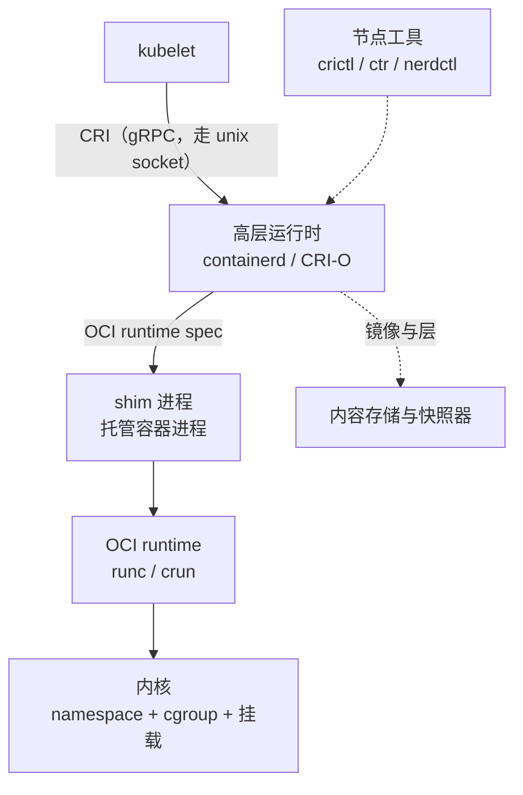

---
tags:
  - Kubernetes
  - 容器
  - CRI
  - containerd
  - OCI
  - 原理
created: 2026-09-23
---

# 运行时分层与 CRI

## 1. 让 kubelet 直接创建容器，会同时出三件事

容器最终是内核里一个被切分过的进程。假设 `kubelet` 自己完成这一切：自己拼运行参数、自己调用底层运行时、自己当容器进程的父进程。三件事会同时发生：

| 出的事 | 具体表现 |
| --- | --- |
| 每来一种新容器技术就要改 kubelet | 想把某个负载换成强隔离运行时（安全沙箱、VM 型运行时）、或支持另一种操作系统，都要改核心组件 |
| kubelet 变成大单体 | 镜像管理、层落地、命名空间准备、进程创建全部长在它身上，任何一块换实现都要动它 |
| 容器进程的寿命与 kubelet 绑死 | `kubelet` 升级或重启会波及正在运行的业务；`kubelet` 崩溃等于节点上的容器一起死 |

正确的切法是把这三件事分成三个不同的问题：**定义接口**、**实现接口**、**托管进程**。Kubernetes 的做法是前两者靠一个标准接口分开，第三者交给一个每容器一个的轻量进程。

## 2. 四层分工

| 层 | 是什么 | 负责什么 | 出问题时现象落在哪 |
| --- | --- | --- | --- |
| `kubelet` | 节点代理，Pod 生命周期的驱动者 | 决定「该有哪些容器」、挂卷、执行探针、上报状态、回收镜像 | `kubectl describe pod` 的 Events、`kubelet` 日志 |
| CRI | 一套 gRPC 接口定义 | 规定「拉镜像、建/删沙箱、建/删容器、执行命令、查状态」这些动作怎么表达 | 接口调用失败、运行时不可达（节点 `NotReady`） |
| 高层运行时 | 实现 CRI 的常驻服务 | 管理与分发镜像、准备根文件系统、组织沙箱、调用底层运行时 | 运行时的日志与它自己的命令行工具 |
| OCI runtime | 真正创建进程的短命令 | 按 OCI 运行规范设置命名空间、cgroup、根文件系统，`fork`/`exec` 出容器进程，然后退出 | 容器起不来、退出码异常 |
| 内核 | namespace、cgroup、挂载、能力与访问控制 | 提供全部隔离与限制机制 | 内核日志、cgroup 接口文件 |

这张图里最容易被忽略的是 **shim** 与 **OCI runtime 是两个不同角色的进程**：OCI runtime 只是「配置好并启动进程」的一次性命令，启动完就退出；真正留在那里托管容器进程的是 shim。

## 3. CRI 规定了什么

CRI 是一组 gRPC 服务定义，分成两个：

| 服务 | 管什么 | 典型动作 |
| --- | --- | --- |
| `RuntimeService` | 沙箱与容器的生命周期、执行、状态 | 创建/停止/删除沙箱，创建/启动/停止/删除容器，`ExecSync`/`Exec`，端口转发，列举与查询状态，报告运行时版本 |
| `ImageService` | 镜像 | 拉取、列举、查询、删除，以及报告镜像文件系统的用量 |

它还留了一个版本协商入口：kubelet 启动时会向运行时要一份版本信息（运行时名称、运行时版本、它实现的 CRI 版本），据此决定怎么调用。**这是「换运行时不用改 kubelet」的全部依据**——只要新实现说同一套话，`kubelet` 不需要知道背后是谁。

版本门控上有两条会直接决定「节点能不能起来」，值得单独记住（口径取自当前稳定版 1.37 的文档）：

| 门槛 | 事实 | 现场表现 |
| --- | --- | --- |
| CRI 接口稳定 | 该接口自 v1.23 起稳定 | 不再需要额外的特性开关 |
| 运行时必须支持第一版接口 | **v1.26 起，`kubelet` 要求运行时支持 v1 版的 CRI 接口**，不支持就不注册这个节点 | 节点升完 `kubelet` 之后一直不 Ready；若运行时也升过级而需要重新建连接，同样要求这一点 |

第二条的实践含义是：**升级节点时要先确认运行时的版本，而不是先升 `kubelet`**。「接口稳定」不等于「旧运行时一定能配上新 `kubelet`」。

它**不规定**的东西同样重要，因为现场很多问题根本不在这一层：

- 不规定镜像格式。那是 OCI 镜像规范的事，与 CRI 无关。
- 不规定 Pod、Deployment、控制器这些东西。它们全在 kubelet 以上，运行时看不见。
- 不规定网络与存储。容器网络接口（CNI）与容器存储接口（CSI）是另外两套独立接口，分别由网络插件与存储驱动实现。
- 不规定隔离强度。同一个 CRI 背后可以是普通容器，也可以是强隔离沙箱。

历史上一段弯路值得记住：早期 `kubelet` 直接集成容器引擎，中间靠一层适配代码（`dockershim`）把对方的能力翻译成 CRI，因为那个引擎本身并不是 CRI 实现。这条链多一跳、维护成本高、还要跟着对方的发版节奏走，于是官方在 v1.20 发布时宣布移除，**`dockershim` 在 v1.24 正式被移除**。移除的是适配层，不是镜像格式：容器引擎构建出来的仍是标准的镜像，所以「用它构建镜像、在 CRI 运行时上运行」是完全正常的组合。如果确实要把容器引擎本身当运行时用，需要装一个**外部的适配器**（开源实现叫 `cri-dockerd`，它有自己的 CRI socket 路径），这属于额外引入的组件，不在 Kubernetes 自带范围内。

## 4. 沙箱：一个 Pod 为什么要先起一个什么都不干的进程

Kubernetes 的最小调度单位是 Pod，语义是「一组总是共享网络、IPC 与主机名命名空间（PID 命名空间可选）的容器」。但命名空间在内核里是**靠引用存活**的：它们没有名字，也没有独立的生命周期开关，最后一个引用它的进程退出，它就被回收。

于是出现一个必须先解决的问题：**谁来持有这组命名空间？** 让第一个业务容器持有，它一退出整个 Pod 的网络就没了；让每个容器各自持有，就得不到共享。答案是先起一个几乎不做任何事的进程，由它建好并持有这组命名空间，其余容器再依次加入。

这个角色就是**沙箱容器**（通常称为 `pause` 容器）。它的镜像**不是 Pod 能声明的字段**：早期由 `kubelet` 的一个参数指定，该参数已被弃用并在后续版本移除，现在由**运行时的 CRI 配置**负责，默认值随运行时的大版本走（官方文档给出的示例值形如 `registry.k8s.io/pause:3.10`）。镜像回收也会**从运行时问到这个镜像并把它排除在外**，所以它不会被当成「未使用镜像」清掉。它解释了一串现场现象：

| 现象 | 原因 |
| --- | --- |
| `crictl ps` 里每个 Pod 都多出一个几乎不耗资源的容器 | 那是沙箱容器，不是业务容器 |
| 业务容器反复重启，Pod 的 IP 不变 | 沙箱还在，命名空间与网络没有被重建 |
| 沙箱被重建时，Pod 里所有容器一起重建 | 命名空间是沙箱持有的，沙箱没了整个 Pod 的网络与共享上下文都没了 |
| 沙箱镜像拉不下来，Pod 里没有一个容器能起来 | 所有容器都依赖沙箱先建好；这类失败发生在「建沙箱」阶段 |

**沙箱是 Pod 级别的，不是容器级别的。** 因此「Pod 里所有容器」的边界，在节点侧对应的其实是「同一个沙箱下的若干容器」。

## 5. shim：容器进程为什么不挂在守护进程下面

如果容器进程是常驻运行时服务的子进程，那么运行时的重启、升级、崩溃都会带走节点上所有业务容器——一个基础设施组件的维护动作直接变成一次全节点故障。为了让这两者的寿命解耦，容器进程被交给一个专门托管它的轻量进程：

- **容器进程由一个独立的 shim 进程托管**，shim 是它的父进程，负责收尸、把退出状态与时间戳回报给运行时服务，并在需要时支持重连。它在同一个 PID 命名空间里还兼任「子收割者」：容器进程的孤儿会被重新挂到它下面由它回收。**但跨命名空间不会重挂**——容器用自己的 PID 命名空间时，孤儿要由容器内的一号进程自己清理，这也正是「执行一次命令留下的孤儿进程」经常没人收的原因。
- **运行时的常驻服务（daemon）重启不影响运行中的容器**：容器与它的 shim 继续跑，daemon 回来之后通过 shim 恢复对它们的认知。重启期间新的请求会失败。
- 反面同样成立：**绕过接口直接对运行时下手**（用运行时自带的命令行工具删掉一个容器），会让节点上的实际状态与集群 API 里的状态不一致，而 `kubelet` 并不知道发生了什么。

上面第二条有一个**极易被忽略的前提**：常驻服务通常由服务管理器拉起，而「重启服务」在服务管理器看来是「清理这个服务所辖的全部进程」。要让「重启 daemon 不影响容器」成立，**服务单元本身必须配置成把 cgroup 管理权下放、并且只杀 daemon 这一个进程**。少了这两项配置，重启就不是「重启守护进程」，而是「拆掉整个进程组」——所有容器跟着一起死。所以这条性质属于**节点上的服务单元配置**，不属于运行时本身；把它当成运行时的固有属性，会在一次本该无感的升级里炸掉整台节点上的业务。

**shim 与容器不是一对一。** 一个 shim 能托管几个容器，取决于运行时的实现：以 runc 系为例，shim 会按沙箱标识把同一个 Pod 的容器归到**同一个** shim 下（这个标识由 CRI 插件打上），所以「一个 Pod 一个 shim」是常见形态；而运行时的沙箱接口文档里又写着「为每个容器启动一个 shim」。**两份官方文档在这一点上口径不同**，引用时必须指明是哪一篇。现场判据不在文档里，在节点上：看容器进程的实际父进程，以及 shim 进程数与 Pod 数的对应关系。两种情况下都不改变上面那条结论——**容器进程不由常驻守护进程直接托管**，所以守护进程的寿命与业务容器的寿命是两件事。

代价也是真实的：**隔离与寿命解耦不是免费的**，节点上会多出一批常驻的轻量进程。

## 6. RuntimeClass：同一个集群里并存多种运行时

同一套 CRI 之下可以挂多种运行时实现，用 `RuntimeClass` 在 Pod 上选择：对象里声明一个 `handler`，节点上的运行时配置里要有同名的一段，`kubelet` 把这个名字透传给运行时。

| 用途 | 说明 |
| --- | --- |
| 不同隔离强度 | 普通隔离用默认实现；不可信负载换成基于用户态内核或轻量虚拟机的强隔离实现 |
| 不同配置 | 同一实现下的不同参数档：不同的根文件系统组织方式、不同的资源开销取舍 |
| 成本归属 | 它决定的是**节点侧的行为**，不改变 API 语义：Pod 的字段、探针、调度含义都不变 |

它属于节点相关的 API 组、是集群级对象；`handler` 是**顶层字段，不写在 `spec` 下面**——这是最常见的一处照抄错误。它的值就是 CRI 接口里的运行时档位名，`kubelet` 只负责透传，**档位在节点上能不能跑完全由该节点运行时的配置决定**。不写这个字段时用的是默认档位，等同于没有这个特性时的行为。还有一处版本落差要留意：官方文档里给出的节点侧配置路径**至今仍是旧的大版本写法**，照抄到新版本节点上会静默失效（与下面第 7 节是同一类问题）。

使用它的前提是节点上真的配了那个 handler，而**失败是终态而不是排队**：官方口径是「指定的运行时类不存在，或者 CRI 无法运行对应的档位时，Pod 会进入 `Failed` 终态」，错误消息要到事件里找。这与「名字拼错会一直卡着等」的直觉不同——**它不会自愈**，得改对象或改节点配置。

## 7. 节点侧配置的版本断层

CRI 的接口是稳定的，**承载它的配置不是**。运行时的大版本之间搬过一次家：1.x 把 CRI 相关选项集中在一棵以 `io.containerd.grpc.v1.cri` 为名的插件树下，快照器、沙箱镜像与各 runtime handler 的选项都挂在那里；2.x 把它拆成两个插件 ID——**镜像相关**（快照器、沙箱镜像）与**运行时相关**（各 handler 的选项）各归一处，沙箱镜像也从 CRI 的顶层键挪进了镜像插件下面的 `pinned_images` 一类的键位。

这条断层的后果不是报错，而是**配置看起来写对了却没生效**：把 1.x 的键原样搬到 2.x 的节点上，行为会悄悄回到默认值，而现场只看到「和别的节点不一样」。所以判断「这个选项归谁管」必须以**节点上运行时的大版本**文档为准，不能跨大版本套用记忆里的路径。

同一类问题还有一个更隐蔽的形态：**关键选项的默认值与你的 `kubelet` 不一致，而配置文件里根本看不到这个键**。以 cgroup 驱动为例，这件事要**分成两个问题**回答，混在一起就会得出错误结论：

| 问题 | 答案 |
| --- | --- |
| 不写它的时候，默认用哪个驱动？ | 关闭（也就是用非 systemd 的那一种）。而绝大多数节点的 `kubelet` 侧用的是 systemd 驱动——**默认状态本身就是不一致的** |
| 生成的默认配置里能看到这一行吗？ | 旧的大版本里能看到，值写着「关闭」；**新的大版本里这个键根本不出现**——键受支持，只是不再被打印出来 |

第二个问题才是坑：「搜不到这一行」既不等于「它是关闭的」，更不等于「它已经和 `kubelet` 对齐了」。**绝对不能拿默认配置的输出反推默认值**，也不能靠「在生成配置里搜到这个键、改一下」来配新版本节点——必须**手工新增整段**。发行版的打包还会再插一手（常常已经在生成的配置里把它打开），于是上游默认、发行版打包、运维手改这三种来源可能互不相同。结论只有一条：**这类开关的生效值要按运行时实际生效的配置与它自己的报告来判断，不能按「配置文件里有没有这一行」判断。**

两边不一致的代价比「换错一个开关」大得多。官方把「改一个已经加入集群的节点的 cgroup 驱动」称为敏感操作，并写明：**如果 `kubelet` 已经用某一种驱动的语义创建过 Pod，把运行时换成另一种驱动，会让这些既有 Pod 在重建沙箱时报错，而重启 `kubelet` 可能解决不了**；如果自动化条件允许，官方给的出路是**换掉这台节点**或**用自动化重装**。这解释了为什么它属于节点基线变更，而不是一次配置热改。

新版本在这条线上做了一件减法：当运行时支持相应的查询接口时，`kubelet` 可以**自己从运行时探测出该用哪种驱动，并忽略配置文件里的设置**（该能力自 v1.28 起引入、v1.34 起稳定）。要留意的是**旧运行时的兜底将在 v1.38 被移除**——包含 1.x 这类不支持该查询的运行时，配上新 `kubelet` 会直接失败。所以升级名单要**先动运行时、后动 `kubelet`**。

沙箱镜像属于同一类：它由节点侧配置指定，其默认值随运行时的大版本走（不同版本可能钉在不同的 pause 标签上，官方文档给的示例值形如 `registry.k8s.io/pause:3.10`）。把它当成一个固定的镜像名，会带来「升级节点之后沙箱拉不下来、整个 Pod 起不来」这种看起来毫无关联的故障。

## 8. 抽象在哪里漏水

1. **CRI 统一的是接口，不是行为。** 日志文件的格式与位置、执行命令的会话语义、镜像与容器的落盘路径、cgroup 的布局，都可以因实现而异。节点上的排障命令与路径必须按**这台节点实际用的运行时**来，不能按记忆里的默认值来。
2. **接口之外还有接口。** 网络、存储、设备各有自己的插件接口。容器起来了但网络不通、卷挂不上、设备看不见，都不在这条链上——先把问题归到哪一套接口，再去找那一套的证据。
3. **kubelet 与运行时的配置必须互相兼容。** 最典型的是 cgroup 驱动必须两边一致；不一致的表现是节点反复 `NotReady`、`kubelet` 反复重启，而不是某条清晰的报错。
4. **状态有两份，且允许短暂不一致。** 集群 API 里的 Pod 状态是 `kubelet` 上报的结论，节点上运行时的实际状态才是事实。两者的差值就是排障的开始：`kubectl` 给出的入口是对象与事件，节点上的工具给出的入口是运行时的实际列表。
5. **沙箱层级会让「重启粒度」与直觉不同。** 重启发生在**容器**级别，Pod 本身不被重启；但沙箱重建会让整个 Pod 的容器一起重建。分清「哪个对象重启了」，才知道影响面。
6. **移除适配层不等于移除依赖。** 不再需要那个中间适配器之后，镜像格式、构建工具与运行时的关系并没有变化；「节点上没有它，所以它跟容器无关」是错的。

## 常见误解

| 常见说法 | 事实 |
| --- | --- |
| 「节点上跑容器的就是那个容器引擎」 | `kubelet` 通过 CRI 与运行时对话；常见节点上根本不需要那个引擎的守护进程，它只留下构建镜像的功能 |
| 「CRI 规定了容器的一切」 | 它只规定运行时操作的接口；镜像格式属于 OCI 镜像规范，网络与存储分别是 CNI 与 CSI |
| 「Pod 里每个容器各自有一份网络命名空间」 | 同一个 Pod 的容器共享沙箱持有的那组命名空间，这也是它们能用 `localhost` 互相访问的原因 |
| 「沙箱容器是垃圾，可以删」 | 它持有 Pod 的命名空间；删掉它等于拆掉整个 Pod 的网络与共享上下文 |
| 「重启运行时守护进程会重启所有容器」 | 容器由各自的 shim 托管，daemon 重启不影响运行中的容器，只影响这期间新的请求 |
| 「`RuntimeClass` 只是给节点打个标签」 | 它要求节点上真的配置了对应的运行时档位；档位不存在时 Pod 直接进 `Failed` 终态，不会自愈 |
| 「容器起不来一定是镜像问题」 | 可能卡在沙箱创建、根文件系统准备、运行时调用等多个环节，要按阶段分清 |
| 「配置写在文件里就等于生效」 | 关键选项的默认值可能被发行版打包改过，而某些版本还不把它打印进生成的默认配置；生效值要按运行时实际报告的值判断 |
| 「运行时升个大版本只是换个包」 | CRI 配置的键位在大版本之间搬过家，旧键在新版本上会静默失效、行为回落到默认值，而配置文件看上去仍然是对的 |

## 要点自测

**问：为什么 `kubelet` 不直接调用底层运行时命令创建容器？**

答：因为那会把「接口」与「实现」以及「进程托管」三件事绑在一起：每加一种容器技术都要改 `kubelet`，`kubelet` 会膨胀成管理镜像、存储、网络与进程的大单体，容器进程的寿命还会与 `kubelet` 绑死。分成接口（CRI）、实现（运行时服务）、托管（shim）三层之后，三者可以各自演进。

**问：CRI 规定了什么、没有规定什么？**

答：规定了沙箱与容器的生命周期、执行、状态查询与镜像管理这些动作如何用 gRPC 表达，并留了版本协商入口。没有规定镜像格式（属于 OCI 镜像规范），没有规定 Pod 与控制器（都在 kubelet 以上），也没有规定网络与存储（分别是 CNI 与 CSI），更没有规定隔离强度。

**问：一个 Pod 为什么要有一个几乎不做事的沙箱容器？**

答：因为 Pod 的语义是「共享一组命名空间的若干容器」，而命名空间靠引用存活、不会自己存在。必须有一个先建立并持有这组命名空间的进程，其它容器才能加入；这个进程本身不需要做别的事，于是表现为一个几乎不消耗资源的容器。它同时也是「沙箱重建会导致 Pod 内容器全部重建」的原因。

**问：为什么容器进程不直接挂在运行时守护进程下面？**

答：那样守护进程的重启、升级与崩溃都会带走节点上所有业务容器，把一次基础设施维护放大成全节点故障。改成由独立的 shim 托管之后，两者寿命解耦：daemon 可以重启，运行中的容器继续跑，daemon 回来再通过 shim 恢复管理关系。一个 shim 托管几个容器由运行时的实现与版本决定，但那条结论不因此改变。

**问：绕过 CRI 直接用运行时工具操作容器，会有什么后果？**

答：节点上的实际状态会与集群 API 中的状态脱节。`kubelet` 依据它自己那一份认知做决定，而实际对象已经不在或已被替换，于是出现「API 说在运行、节点上找不到」或「节点上多出一个没人管的容器」这类不一致；这类不一致只能用节点侧工具去核对与清理。

**问：`RuntimeClass` 的 `handler` 名字在节点上不存在，会怎样？**

答：Pod 会进入 `Failed` 终态——这是官方口径：指定的运行时类不存在、或 CRI 无法运行对应的档位时，Pod 进入 `Failed`，错误消息在事件里。注意它**不是**「排队等节点准备好」，不会自愈；要么改对象、要么在节点上补上那个档位。

**问：为什么运行时升了一个大版本之后，某些节点的行为变了，而配置文件检查又看不出问题？**

答：CRI 的配置键在大版本之间搬过家——原来集中在一棵插件树下，后来拆成「镜像相关」与「运行时相关」两处，沙箱镜像这类键位也跟着挪了位置。旧键在新版本上不生效，行为悄悄回落到默认值，而配置文件本身仍然「看起来是对的」。判断方式是按节点上运行时的大版本文档核对键位，并核对实际生效值，尤其是必须与 `kubelet` 保持一致的那几个开关。

**第一反应不要做什么**：不要在节点上凭记忆敲容器命令——先确认这台机器用的是哪个运行时、命令行工具看的是哪一套状态；不要把「容器起不来」直接归因到镜像，先分清卡在沙箱、根文件系统、还是容器创建；不要跨运行时的大版本套用配置键位，旧键会静默失效；也不要为了「清干净」去用运行时自带工具删容器，那会让集群状态与节点事实分家。

## 参考文档

- Kubernetes 官方文档中关于容器运行时的章节：CRI 的定位、`kubelet` 与运行时的关系、受支持的运行时列表、`dockershim` 移除的版本与影响、`RuntimeClass` 的用法与前提。
- Kubernetes 官方文档中关于节点与 Pod 生命周期的章节：Pod 沙箱的语义、沙箱与 Pod 内多容器共享命名空间的关系、容器级重启与 Pod 级重建的区别。
- 上游 CRI 接口定义（`kubernetes/cri-api` 中的 `api.proto`）：`RuntimeService` 与 `ImageService` 的方法集合、版本协商接口、沙箱与容器相关消息的字段含义。
- OCI Runtime Spec：`config.json` 的结构与运行时命令的语义（`create`/`start`/`state`/`kill`/`delete`）。
- 具体运行时（containerd、CRI-O）的官方文档：各自的 CRI 配置位置、handler 的声明方式、命令行工具与状态目录。**配置键位在大版本之间搬过家**（1.x 与 2.x 的插件 ID 与沙箱镜像键位不同），因此键位与默认值一律按**节点上运行时的大版本**文档取，不跨版本套用。
- 上述版本门控（如 `dockershim` 的移除版本）以**当前稳定版官方文档**为准；具体节点上的运行时版本、socket 路径与配置项以现场为准。

上一篇：从镜像到根文件系统 ｜ 下一篇：一个 Pod 在节点上的形态
