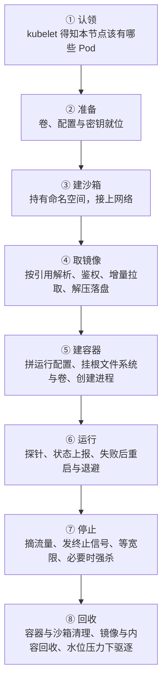
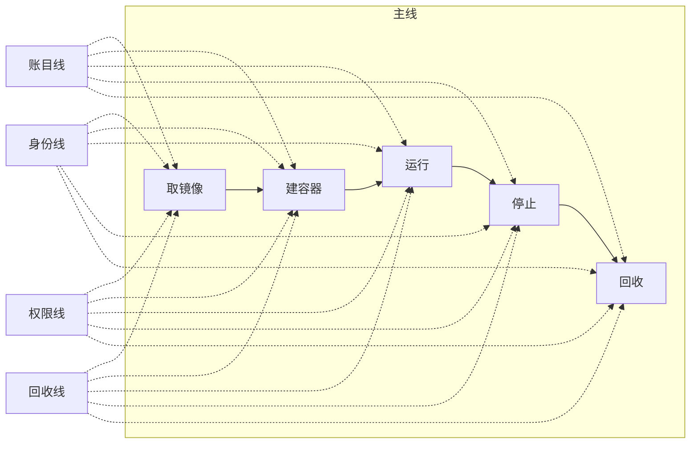

---
tags:
  - Kubernetes
  - 容器
  - 生命周期
  - 体系
created: 2026-09-23
---

# 一个容器在节点上的一生

## 1. 主线：从「这个 Pod 归我」到「字节被回收」

一个容器在节点上经历八个站点。前四个发生在容器存在之前，最后两个发生在容器消失之后——**排障时最容易漏掉的恰恰是这两头**。

| # | 站点 | 这一站在做什么 | 到这里要能说清 |
| --- | --- | --- | --- |
| 1 | 认领 | `kubelet` 从集群侧得知「本节点应当有哪些 Pod」，包括它们的完整声明与引用的卷、配置、密钥 | 集群侧状态与节点侧状态是两份；对象被删掉之后节点上仍可能有残留 |
| 2 | 准备 | 卷挂载、密钥与配置投影到节点上的临时位置；这一步失败会停在这里，容器还没开始建 | 挂不上的卷与拉不下的镜像，报错位置完全不同 |
| 3 | 建沙箱 | 沙箱容器建立并持有命名空间，网络插件给沙箱接上网络 | Pod 的 IP 属于沙箱；沙箱没建好，后面所有容器都起不来 |
| 4 | 取镜像 | 按引用解析成具体内容、按凭证鉴权、按层增量拉取、解压并组织成只读层 | 拉取的单位是层不是镜像；拉取发生在每个节点上，不是集群一次 |
| 5 | 建容器 | 生成运行配置、把根文件系统与卷接进来、建立日志文件、创建并启动进程 | 根文件系统是「只读层 + 该容器独占的可写层」的合成视图 |
| 6 | 运行 | 探针驱动状态变化、状态上报给集群侧、失败按策略重启并逐步退避 | 探针的判定发生在节点侧，重启是容器级的 |
| 7 | 停止 | 先把流量摘掉，再发终止信号，等宽限期，超时强杀 | 摘流量与发信号是并行的两件事；宽限期用尽才会强杀 |
| 8 | 回收 | 容器与沙箱被清理，镜像与内容按引用回收；节点磁盘水位越线时触发驱逐 | 删除不等于释放；回收有自己的策略与水线 |

## 2. 四条横切线

| 横切线 | 贯穿内容 | 收口于 |
| --- | --- | --- |
| 账目线 | 只读层（共享）→ 可写层（独占）→ 日志（节点管理）→ 节点磁盘水位 → 驱逐 | 这三本账会互相挤占，前提是它们落在同一个文件系统上 |
| 身份线 | 标签 → 清单摘要 → 配置摘要 → 本地镜像标识 → 容器标识 → 沙箱标识 | 每一段都可能「看起来一样」，核对时必须说明比的是哪一段 |
| 权限线 | 拉取凭证 → 运行身份 → 能力与系统调用过滤 → 卷的属主与挂载标志 | 权限是叠加的，缺一层不会报同一种错误 |
| 回收线 | 容器引用 → 沙箱引用 → 镜像引用 → 内容块 → 磁盘空间 | 引用不消失，空间就不回来 |

## 3. 关键字段怎么读

每个字段给五件事：是什么、单位、判据、与谁同看、看到它转向哪一步。

| 字段 | 是什么 | 单位 / 取值 | 判据 | 与谁同看 | 看到它转向哪一步 |
| --- | --- | --- | --- | --- | --- |
| `imagePullPolicy` | 节点侧是否重新解析并拉取镜像 | 三选一；省略时按引用形式自动定 | 写了摘要 → 默认「本地有就不拉」；标签是 `latest` 或**干脆没写标签** → 默认「总是去解析」；其余标签 → 默认「本地有就不拉」。**这个值在对象第一次创建时就定死了**，之后再改标签也不会跟着变 | 仓库端的标签是否被重推过、节点上的本地镜像列表 | 拉到的是不是你要的那一份：转向「身份线」 |
| 镜像回收高低阈值 | 镜像占用达到高水位就开始回收，回收目标是降到低水位 | 百分比 | 文档默认 85 / 80（集群版本 1.37 口径）。两个阈值成对看：高阈值触发、低阈值停止；把高阈值设为 100 等于关掉镜像回收 | 镜像存储所在文件系统的水位 | 节点磁盘吃紧：转向「回收线」 |
| 镜像最小回收年龄 | 比这个年龄更「年轻」的镜像，在一轮回收里不动 | 时长 | 文档默认 2m。它限制的是回收的**速度**，不是回收的**范围** | 同一文件系统的水位、发布频率 | 拉取与回收互相追尾时看它 |
| 镜像最大回收年龄 | 一个镜像多久没被用过就该被回收 | 时长 | 文档默认 0s，即**关闭**；而且它**不跨 `kubelet` 重启累计**，重启后计时从头开始 | 发布节奏、镜像存储水位 | 想用「按年龄清理」代替「按水位清理」时看它 |
| 日志单文件大小与文件数上限 | 标准输出的日志文件大小上限与保留份数 | 大小 / 个数 | 文档默认 10Mi 与 5（份数最少为 2）。两者相乘约等于该容器日志可占的空间上限 | 节点磁盘水位、采集端是否已经取走 | 日志「莫名缺失」：转向「账目线」 |
| 驱逐阈值 | 节点侧在什么水位开始驱逐 Pod | 绝对值或百分比，分软硬两档 | 硬阈值**没有宽限期**，越线立即驱逐；软阈值必须配一个宽限期，不配 `kubelet` 起不来。文档给出的默认硬阈值是内存 100Mi、节点文件系统可用 10%、镜像文件系统可用 15%、两者 inode 可用 5% | 对应的资源或文件系统信号、每个 Pod 的用量是否超过它自己的 requests | Pod 被驱逐：先分清是节点水位还是容器自身超限 |
| `restartPolicy` | 容器退出后是否重建、在什么条件下重建 | 三选一 | 它决定的是容器级行为，不是 Pod 级 | 容器的退出码与原因、退避间隔 | 「Pod 在运行」但应用反复重启 |
| 终止宽限期 | 从发出终止信号到强杀之间允许的时间 | 秒 | 超时才强杀；它不负责摘流量，摘流量是另一条并行的动作 | 应用处理终止信号的实际耗时 | 停止变慢或出现被强杀：转向「停止」站点 |

**这些字段的共同点：它们都在节点侧生效，且都能单独把一次部署从「正常」变成「诡异」。** 读它们时的顺序是固定的——先确认自己在看哪一本账、哪一段身份，再去比数值。上表的默认值都是文档口径，**你的集群可能已经改过**，落笔前按现场的 `kubelet` 配置核对一遍。

## 4. 常见坑

| 常见做法或说法 | 后果或事实 |
| --- | --- |
| 用「重新拉一次镜像」来解决「节点上跑的还是旧代码」 | 标签可能没变，本地已有缓存时按策略可能根本不重新解析；要么改用摘要，要么把拉取策略改成总是重新解析 |
| 只看集群侧的对象状态判断节点上还有什么 | 集群状态是 `kubelet` 上报的结论，节点上可能有已退出未清理的容器、已删除对象留下的沙箱残留 |
| 认为「容器删了磁盘就该降」 | 只读层跨容器共享，白障条目遮住的下层内容也不释放；要看是哪一本账在涨 |
| 把日志文件上限调大来「保住历史」 | 上限是磁盘占用的直接来源；历史应当由采集端保存，节点侧只保留最近一段 |
| 把宽限期调长来解决「停止总是超时」 | 根因往往是应用没有正确处理终止信号或仍在收新请求；调长只是把影响面推后 |
| 把镜像回收阈值调得很激进来省空间 | 回收与拉取会互相追尾：反复拉同一批层，节点带宽与仓库压力上升，启动变慢 |
| 认为驱逐只与内存有关 | 磁盘与 inode 同样是驱逐信号；文件系统标识有**三个**（节点主文件系统、镜像文件系统、容器可写层文件系统），后两个是**可选**的，由 `kubelet` 从运行时自动发现，三者可能指向同一份底层文件系统 |
| 认为驱逐顺序按资源保障档位排 | `kubelet` **不**用服务质量档位决定驱逐顺序；实际依据是「用量是否超过 requests」→ Pod 优先级 → 用量相对 requests 的比例。档位只能用来**估计**最可能的顺序，而且在磁盘压力下这套估计会失效 |
| 只改动其中一个硬驱逐阈值 | 默认阈值**只在所有参数都未被改动时**才生效；只要动了任意一个，其余阈值不再继承默认值而变成 0。要么把所有阈值完整写出来，要么显式打开「与默认值合并」的开关 |
| 用外部工具清理镜像与容器 | 官方明确不建议：会破坏 `kubelet` 自身的回收逻辑，并可能删掉本应存在的容器 |
| 把日志目录换到别的文件系统 | 换到与主文件系统不同的位置后，`kubelet` **不再跟踪**该文件系统的用量，它可能被写满而没有任何水位告警 |

## 5. 要点自测

**问：一个容器真正「诞生」之前，节点上先发生了什么？**

答：`kubelet` 先认领该 Pod 并准备卷、配置与密钥；然后建立沙箱（持有命名空间并接上网络）；再按引用拉取镜像、把层解压并组织成只读层；最后才生成运行配置、接上根文件系统与卷、创建并启动容器进程。前四站里的任何一步失败，容器都不会出现，而报错位置各不相同。

**问：为什么「删除容器」不等于「磁盘空间回来了」？**

答：可写层会随容器删除释放，但只读层是跨容器共享的，只要还有镜像或容器引用就仍然占着；被白障遮住的下层内容也仍在下层里；被进程打开的文件会延后释放。回收是以引用为准的，不是以文件是否存在为准。

**问：镜像回收为什么要有「高水位」和「低水位」两个阈值？**

答：高水位决定什么时候开始回收，低水位决定回收到哪里停。只给一个阈值会导致每次回收都刚好擦着边结束，于是很快又触发一次，回收动作会持续发生——两个阈值拉开距离，回收才是成批的。若再配合最小回收年龄，就能避免刚拉下来的镜像立刻被回收掉。

**问：节点内存或磁盘水位越线时，`kubelet` 按什么顺序挑 Pod 驱逐？**

答：它**不**用服务质量档位决定顺序。实际依据是三条：① 这个 Pod 的用量是否超过它自己的 requests；② Pod 的优先级；③ 用量相对 requests 的比例。结果是「用超了 requests 的」先被淘汰（先按优先级、再按超出程度排序），有保障的以及用量仍在 requests 以内的最后被淘汰。服务质量档位只适合用来**估计**最可能的顺序，而且这个估计在磁盘压力下会失效——档位不适用于临时存储的 requests。

**问：为什么摘流量与发终止信号要当成两件并行的事？**

答：容器开始终止的同时，集群侧要把这个实例从可服务列表里移除；如果只发信号不摘流量，信号到达前的这段时间里仍然会有新请求进来，落在一个已经在收尾的进程上。反过来只摘流量不限制时间，收尾会无限期拖长。两件事都要做，且终止宽限期是给它们的共同上限。

**第一反应不要做什么**：不要在容器起不来时直接怀疑镜像——先确认卡在哪一站（卷、沙箱、镜像、容器创建），报错位置会告诉你；不要在磁盘告警时先删日志，先确认是哪一本账在涨；也不要用「重启一次看看」代替对回收与引用关系的确认。

## 参考文档

- Kubernetes 官方文档中关于节点与 Pod 生命周期的章节：Pod 的创建顺序、卷的准备、沙箱与容器的关系、容器状态与重启策略、终止流程与宽限期。
- Kubernetes 官方文档中关于镜像回收与节点压力的章节：镜像回收的两个阈值与最小/最大回收年龄、三个文件系统标识（其中镜像与容器可写层两个是可选且自动发现的）、软硬驱逐阈值及默认值、阈值完整性规则、驱逐排序依据。
- Kubernetes 官方文档中关于容器日志的章节：标准输出的落点与轮转配置项。
- Kubernetes 官方文档中关于 `imagePullPolicy` 的章节：默认规则与摘要的行为差异。
- 上述默认值（阈值、日志上限、宽限期）一律以**现场配置**为准：`kubelet` 的配置项会随集群配置而变，文档给出的是默认值而不是你的集群的值。

上一篇：一个 Pod 在节点上的形态 ｜ 下一篇：节点侧的容器观测
