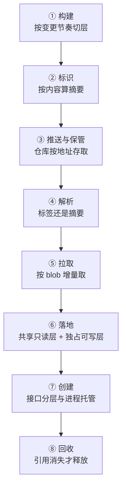

---
tags:
  - Kubernetes
  - 容器
  - 镜像
  - 运行时
  - 学习地图
created: 2026-09-24
---

# 容器技术

## 知识地图

### 一条收敛链：从一份制品到一个运行中的进程

这条主线跟随着**一份制品**：从"它如何被构建、如何被标识"开始，到"它在某个节点上变成一组进程"，再到"它消失之后字节如何被回收"。

| #   | 环节    | 该环节解决的问题          | 到这里要能说清                     |
| --- | ----- | ----------------- | --------------------------- |
| 1   | 构建    | 层的边界划在哪里，代价就落在哪一段 | 层按变更节奏切分；构建期进入层的材料为什么无法撤回   |
| 2   | 标识    | 用名字引用制品会同时引出哪四类问题 | 摘要一次解决了校验、去重、增量与版本固定这四件事；标签由于可变，这四件事一件也解决不了 |
| 3   | 推送与保管 | 仓库凭什么能够去重、能够增量    | 分发的单位是 blob，而不是镜像；"删标签"与"删字节"是两件事   |
| 4   | 解析    | 这一次运行究竟该使用哪一份内容   | 引用形态决定可复现性；平台选择发生在解析清单这一步       |
| 5   | 拉取    | 谁发起、凭证从哪里来、失败如何表现 | 拉取由节点发起，集群层面没有镜像缓存；凭证按优先级确定生效来源        |
| 6   | 落地    | 共享与独占如何分开         | copy-up 的触发条件与代价；节点上的三类存储占用各有量法 |
| 7   | 创建    | 接口、实现与进程托管为什么要分三层 | CRI 规定了动作如何表达，没有规定隔离强度与数据面；shim 的存在是为了让容器进程的寿命与守护进程解耦 |
| 8   | 回收    | 引用关系决定了什么能够被释放    | 删除不等于释放；文件系统的已用容量越过阈值时由节点代理决定谁先被清理       |

### 五条横向关系

| 横向关系 | 贯穿内容 | 结论 |
| --- | --- | --- |
| 存储占用 | 压缩体积 → 未压缩落地 → 共享去重 → 可写层 → 日志与卷 → 文件系统的已用容量 | 说"占了多少"之前，必须先说清是哪一类占用 |
| 身份标识 | 标签 → 清单摘要 → 配置摘要（镜像 ID）→ 层摘要与差分 ID → 本地快照标识 | 每一段都可能"看起来一样"，核对时必须说明比较的是哪一段 |
| 权限 | 拉取凭证 → 运行身份 → 能力集与系统调用过滤 → 挂载标志与卷属主 | 权限逐项叠加，缺少一层不会报出同一种错误 |
| 信任 | 完整性（摘要）→ 来源（签名与证明）→ 强制（准入） | 三层缺一，供应链就没有形成闭环 |
| 回收 | 容器引用 → 沙箱引用 → 镜像引用 → 内容 blob → 磁盘空间 | 引用不消失，空间就不会回来 |

## 术语速查

只收本章新引入的词。

| 名词 | 一句话解释 | 展开于 |
| --- | --- | --- |
| 命名空间 / cgroup | 内核中两套互不替代的机制：前者决定进程看得见什么，后者决定它能用多少 | 原理：容器是什么、隔离从哪来 |
| 沙箱容器（pause） | 建立并持有"一组容器共享的那组命名空间"的进程，镜像来自运行时配置而不是对象字段 | 原理：运行时分层与 CRI |
| 镜像索引（image index） / 清单（manifest） / 配置（config） / 层（layer） | 按平台分支的清单集合 / 指向配置与层 / 运行参数与层顺序 / 差分归档 | 原理：镜像与内容寻址 |
| 描述符（descriptor） | 树里每一次指向固定携带的三项：媒体类型、摘要、大小 | 原理：镜像与内容寻址 |
| 摘要（digest） | 由内容字节算出的标识；层摘要、差分 ID、配置摘要、链 ID 是四个不同的值 | 原理：镜像与内容寻址 |
| 标签（tag） | 仓库侧的**可变**映射，指向某个摘要；`latest` 没有"最新"的语义 | 原理：镜像与内容寻址 |
| 白障（whiteout）/ 不透明目录 | 层格式中表示"删除"与"此目录下层内容全部不可见"的两个约定名；归档里的表示与磁盘上的表示不是同一套 | 原理：镜像与内容寻址 · 从层到根文件系统 |
| 联合挂载 / copy-up | 多个只读层加一个可写层拼成一个视图 / 写只读层文件时整份复制到可写层 | 原理：从层到根文件系统 |
| 快照器（snapshotter） | 把"若干只读层 + 一个可写层"组织成目录的可替换组件，**节点级选择** | 原理：从层到根文件系统 |
| 节点上的三类存储占用 | 只读层（共享）/ 可写层（独占）/ 日志与卷（各自策略） | 原理：从层到根文件系统 |
| OCI | 制定镜像、分发、运行时三份规范的开放组织（Open Container Initiative）；本库说的"OCI 镜像""OCI 运行时"都指这三份规范定义的对象 | 全章 |
| CRI | 节点代理与运行时之间的 gRPC 接口（Container Runtime Interface），分运行时服务与镜像服务两个 | 原理：运行时分层与 CRI |
| 高层运行时 / OCI runtime | 实现 CRI 的常驻服务（镜像与生命周期）/ 真正创建进程的短命令 | 原理：运行时分层与 CRI |
| shim | 托管容器进程的轻量进程；"守护进程重启不带走容器"还依赖服务单元的两项配置 | 原理：运行时分层与 CRI |
| 运行时档位（`RuntimeClass`） | 在负载上选择节点侧运行时配置的字段；档位不存在时 Pod 进入 `Failed` 终态，不会自愈 | 原理：运行时分层与 CRI |
| 内容存储 / 快照目录 | 按摘要命名的 blob（压缩形态）/ 每层解压出的目录树；去重主要发生在前者 | 原理：从层到根文件系统 |
| 差分 ID（DiffID） / 链 ID（ChainID） | 未压缩层的摘要 / "这一层叠加到前一层之后"算出的标识 | 原理：镜像与内容寻址 |
| 跨仓库挂载（cross-repository blob mount） | 内容已存在时直接建立引用、不重传的分发动作 | 原理：分发与供应链 |
| 签名与来源证明 | 作为独立制品、通过指向被签对象的字段挂上去的信任材料 | 原理：分发与供应链 |
| 构建上下文（build context） | 构建时步骤可以读取的那一组文件；它的大小与内容直接决定哪些字节会进入层 | 原理：构建——层是怎么被切出来的 |
| 构建期挂载（build-time mount） | 只在某一步构建期间可见、不写入层的挂载；用于凭据与转发代理 | 原理：构建——层是怎么被切出来的 |
| 可复现构建（reproducible build） | 同一份输入两次构建得到同一个清单摘要 | 原理：构建——层是怎么被切出来的 |
| 缓存失效半径 | 一处改动会让后续多少步骤重新计算 | 原理：构建——层是怎么被切出来的 |
| 捆绑目录（bundle） | 运行一个容器所需的配置与根目录的组合 | 实操：手工构造容器与镜像落地 |

### 关键字段的读法

| 看什么 | 是什么 | 单位 | 判据 | 与谁同看 | 看到它转向哪一步 |
| --- | --- | --- | --- | --- | --- |
| 引用形态 | 标签，还是 `仓库@sha256:…` | — | 只有写清单摘要才算固定版本 | 本地清单的摘要 | 只有标签 → 任何"两边是否同一份"的排查都失去确定性 |
| 运行时列表里的镜像 ID | 配置的摘要 | 摘要字符串 | **不等于**按摘要固定时写的那个值 | 清单摘要与各层摘要 | 想确认"拿到的是不是那一份" → 改比清单摘要 |
| 镜像列表的体积 | 各层压缩体积之和 | 字节 | 判断"从仓库拉了多少"用它；判断"节点占了多少"不能用它 | 快照目录的实际占用 | 两者相差数倍属于正常 |
| 运行时的文件系统用量接口 | 快照目录的未压缩占用与 inode 数 | 字节 / 个 | **不含内容存储** | 运行时根目录的实际磁盘统计 | 接口数值小、磁盘很满 → 缺少的部分在内容存储 |
| 容器内 `df` | 承载可写层的文件系统的可用空间 | 字节 | 不是这个容器的额度 | 可写层占用与宿主文件系统的已用容量 | 可用空间少 → 先确认是哪一类占用在增长 |
| 运行时端点 | 节点代理与运行时之间的 socket 路径 | 路径 | 与运行时自带客户端的默认端点不一致，就说明查错了对象 | 客户端的默认端点 | 不一致 → 先确认该用哪个客户端 |
| 运行时的 CRI 版本报告 | 运行时名称、版本、实现的接口版本 | 版本字符串 | 低于第一版接口时节点不会被注册 | 节点代理日志里的注册失败原因 | 版本不够 → 先升运行时，再升节点代理 |
| 沙箱容器 | 持有那组命名空间的进程对应的容器 | 容器 | 不耗资源、不承载业务；它消失意味着整组重建 | 该组容器的重启次数与 Pod 的 IP | IP 变了 → 沙箱被重建过 |
| 生效的拉取凭证来源 | 负载 / 服务账号 / 节点侧配置三选一 | — | 先按优先级确定生效来源，再判命中 | 仓库的鉴权错误 | 401/403 → 先定来源，再查权限 |
| 签名与其签发主体 | 指向该镜像的签名制品及主体 | — | 存在不等于通过；可信与否由策略决定 | 准入环节的校验结果 | 有签名但无校验 → 供应链未形成闭环 |

## 篇目索引

| # | 篇目 | 一句话 |
| --- | --- | --- |
| 01 | [[Kubernetes/01_容器技术/01_原理_容器是什么、隔离从哪来\|原理：容器是什么、隔离从哪来]] | 内核里没有"容器"这个对象，它是三套机制与一次根切换的组合结果；隔离与限制互不替代 |
| 02 | [[Kubernetes/01_容器技术/02_原理_镜像与内容寻址\|原理：镜像与内容寻址]] | 名字会漂移、内容不会；摘要一次解决校验、去重、增量与版本固定，但四个"摘要"不是一回事 |
| 03 | [[Kubernetes/01_容器技术/03_原理_从层到根文件系统\|原理：从层到根文件系统]] | 只读层共享、可写层独占；copy-up 的代价与节点上的三类存储占用 |
| 04 | [[Kubernetes/01_容器技术/04_原理_运行时分层与CRI\|原理：运行时分层与 CRI]] | 接口、实现与进程托管分为三层；沙箱为什么存在、档位不存在为什么不能自愈 |
| 05 | [[Kubernetes/01_容器技术/05_原理_分发与供应链\|原理：分发与供应链]] | 仓库按地址存取、按 blob 增量；完整性、来源与强制是三层，缺一不成闭环 |
| 06 | [[Kubernetes/01_容器技术/06_原理_构建_层是怎么被切出来的\|原理：构建——层是怎么被切出来的]] | 层边界按变更节奏划分；缓存判定分"看内容"与"看命令文本"两类；构建期进入层的内容无法撤回 |
| 07 | [[Kubernetes/01_容器技术/07_体系_一份制品到一个运行中的进程\|体系：一份制品到一个运行中的进程]] | 八个环节串成一条链，再收拢为存储占用、身份标识、权限、信任、回收五条横向关系 |
| 08 | [[Kubernetes/01_容器技术/08_实操_手工构造容器与镜像落地\|实操：手工构造容器与镜像落地]] | 手工拼装容器、观察白障与 copy-up、以同口径取样三类存储占用，再制造四类失败各取一次证据 |
| 09 | [[Kubernetes/01_容器技术/09_实操_容器与运行时的节点侧观测\|实操：容器与运行时的节点侧观测]] | 每类问题对应的工具、字段的五件事读法、基线卡与四类现场 |
| 10 | [[Kubernetes/01_容器技术/10_判例_高频误判\|判例：高频误判]] | 十二条四段式判例：视角错、混淆、对应关系、只比文本 |
| 11 | [[Kubernetes/01_容器技术/11_治理_镜像与运行时治理\|治理：镜像与运行时治理]] | 上限配在哪一层、四份交付产物、变更影响面如何评估 |

## 参考文档

- OCI Image Spec（`manifest`、`image-index`、`config`、`layer`、`descriptor`、`media-types`）与 OCI Distribution Spec：制品与分发的完整语义。
- OCI Runtime Spec：运行时配置结构与命令语义。
- 内核文档 `Documentation/admin-guide/namespaces/`、`Documentation/admin-guide/cgroup-v2.rst`、`Documentation/filesystems/overlayfs.rst`：隔离、限制与联合挂载的宿主侧判据。
- Kubernetes 官方文档中关于容器运行时、镜像、`RuntimeClass`、Pod 生命周期的章节：CRI 的定位、适配层移除、镜像引用与拉取、沙箱语义。
- 上游 CRI 接口定义与受支持运行时（containerd、CRI-O）的官方文档：接口方法集合、配置位置与键位、命令行工具。**配置键位随运行时大版本迁移**，一律按节点上的大版本文档取值。
- 现场所用构建工具与包管理器的官方文档：缓存判定规则、构建期挂载、可复现构建机制、多架构构建与推送行为、依赖锁定的范围。
- 上述规范与版本门控按**当前稳定版**取值：本章与其他各章共用同一份版本口径，节点上的实际值以现场配置为准。
