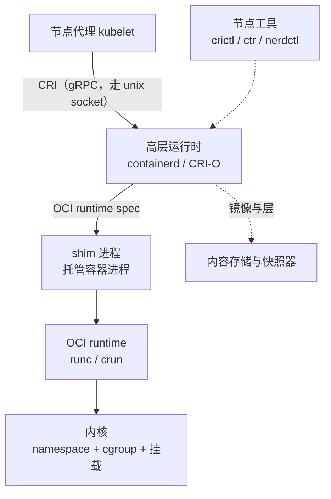

---
tags:
  - Kubernetes
  - 容器
  - CRI
  - containerd
  - OCI
  - 原理
created: 2026-09-24
---

# 运行时分层与 CRI

## 1. 问题背景：让节点代理直接创建容器

容器最终是内核中一个被切分过的进程。假设由节点代理（`kubelet`）自己完成全部工作：它自己拼接运行参数、自己调用底层工具，并且自己充当容器进程的父进程。此时会同时出现三类问题：

| 问题 | 具体表现 |
| --- | --- |
| 每出现一种新的容器技术，就要修改核心组件 | 若要把某个负载换成强隔离运行时，或要支持另一种操作系统，都必须修改节点代理 |
| 节点代理膨胀为一个大型单体 | 镜像管理、层落地、命名空间准备与进程创建全部集中在其身上，因此更换其中任何一块实现都要修改它 |
| 容器进程的寿命与它绑定 | 节点代理升级或重启会波及正在运行的业务；它崩溃即意味着节点上的容器同时终止 |

正确的划分方式是把这三件事拆分为三个独立的问题：**定义接口**、**实现接口**、**托管进程**。前两者由一个标准接口分开，第三者则交给一个每容器（或每沙箱）各一个的轻量进程。

## 2. 四层分工

| 层 | 是什么 | 负责什么 | 出问题时现象落在哪 |
| --- | --- | --- | --- |
| 节点代理 | Pod 生命周期的驱动组件 | 决定"该有哪些容器"，并负责准备卷、执行探针、上报状态与触发镜像回收 | 对象的事件、代理自身日志 |
| CRI | 一套 gRPC 接口定义 | 规定"拉镜像、建/删沙箱、建/删容器、执行命令、查状态"这些动作如何表达 | 接口调用失败、运行时不可达（节点不 Ready） |
| 高层运行时 | 实现 CRI 的常驻服务 | 管理与分发镜像、准备根文件系统、组织沙箱，并调用底层运行时 | 运行时的日志与它自带的命令行工具 |
| OCI runtime | 真正创建进程的短命令 | 按运行时规范设置命名空间、cgroup 与根文件系统，启动容器进程，随后退出 | 容器起不来、退出码异常 |
| 内核 | 命名空间、cgroup、挂载、能力与访问控制 | 提供全部隔离与限制机制 | 内核日志、cgroup 接口文件 |

在这张图中，最容易被忽略的一点是：**shim 与 OCI runtime 是两个承担不同角色的进程**。OCI runtime 只是一条"完成配置并启动进程"的一次性命令，它启动完毕即退出；真正留在节点上托管容器进程的是 shim。

## 3. CRI 规定了什么、没规定什么

CRI 是一组 gRPC 服务定义，它分为两个服务：

| 服务 | 管什么 | 典型动作 |
| --- | --- | --- |
| `RuntimeService` | 沙箱与容器的生命周期、执行、状态 | 创建/停止/删除沙箱，创建/启动/停止/删除容器，同步与流式执行命令，端口转发，列举与查询状态，报告运行时版本 |
| `ImageService` | 镜像 | 拉取、列举、查询、删除，以及报告镜像文件系统的用量 |

它保留了一个**版本协商入口**：节点代理启动时向运行时索取一份版本信息（运行时名称、运行时版本以及所实现的 CRI 版本），并据此决定调用方式。**这就是"更换运行时不需要修改节点代理"的全部依据**：只要新的实现使用同一套接口，节点代理就无需知道背后是谁。该入口同时是排查"节点为什么没有注册"的第一个入口，因为注册失败的原因就记录在这份报告里。

版本门控中有两条会直接决定"节点能不能启动"：

| 门槛 | 事实 | 现场表现 |
| --- | --- | --- |
| CRI 接口稳定 | 接口自 v1.23 起稳定 | 不再需要额外的特性开关 |
| 运行时必须支持第一版接口 | **v1.26 起，节点代理要求运行时支持 v1 版的 CRI 接口**，不支持就不注册这个节点 | 节点升完之后一直不 Ready |

第二条的实践含义是：**升级节点时应先确认运行时的版本，而不是先升级节点代理**。由于"接口稳定"并不等于"旧运行时一定能配上新的节点代理"，两者的升级顺序需要单独安排。

它**不规定**的内容同样重要，因为现场许多问题根本不在这一层：

- 它不规定镜像格式，因为那属于镜像规范，与 CRI 无关；
- 它不规定 Pod 与控制器这些概念，因为它们位于节点代理以上，运行时看不见；
- 它不规定网络与存储，因为那是另外两套独立接口，分别由网络插件与存储驱动实现；
- 它不规定隔离强度，因为同一个 CRI 背后既可以是普通容器，也可以是强隔离沙箱。

历史上一段弯路值得记住：早期节点代理直接集成了某个容器引擎，中间靠一层适配代码把对方的能力翻译成 CRI，原因是那个引擎本身不是 CRI 实现。由于这条链多出一跳、维护成本高，并且还要跟随对方的发版节奏，官方在 v1.20 发布时宣布移除该适配层，**适配层在 v1.24 正式被移除**。被移除的是适配层，而不是镜像格式：那个引擎构建出来的仍是标准镜像，因此"用它构建镜像、在 CRI 运行时上运行"是完全正常的组合。若确实要把那个引擎本身当作运行时使用，则需要安装一个**外部适配器**（开源实现有自己的 socket 路径），这属于额外引入的组件。

## 4. 同一个 Pod 里为什么要先启动一个不承载业务的进程

一组容器共享同一套网络与主机名，这一要求对进程提出了一个前提：命名空间依靠引用存活，它既没有独立的名字，也没有独立的生命周期开关，因此最后一个引用它的进程退出之后，它就被回收。反过来说，这组命名空间**必须由一个进程先建立并一直持有**。

| 方案 | 结果 |
| --- | --- |
| 让第一个业务容器持有 | 它一退出，整组的网络就消失 |
| 让每个容器各自持有 | 得不到共享，于是 `localhost` 互访与统一 IP 都不成立 |
| 先启动一个几乎不做事的进程持有 | 其余容器依次加入；只有它退出，才意味着这组上下文消失 |

这个角色就是**沙箱容器**（通常称为 pause 容器）。它的镜像**不是应用能够声明的字段**：早期由节点代理的一个参数指定，该参数已弃用并在后续版本移除，现在由**运行时的 CRI 配置**负责，其默认值随运行时的大版本变化（官方文档给出的示例值形如 `registry.k8s.io/pause:3.10`）。镜像回收也会**从运行时问到这个镜像并把它排除在外**，因此它不会被当作"未使用镜像"清理掉。

它解释了一串现场现象：

| 现象 | 原因 |
| --- | --- |
| 节点上每个 Pod 都多出一个几乎不消耗资源的容器 | 那是沙箱容器，而不是业务容器 |
| 业务容器反复重启而 Pod 的 IP 不变 | 沙箱仍然存在，命名空间与网络没有被重建 |
| 沙箱被重建时，同组容器一起重建 | 那组命名空间由沙箱持有；它消失之后，整个共享上下文也随之消失 |
| 沙箱镜像拉不下来，Pod 里没有一个容器能起来 | 所有容器都依赖沙箱先建好；这类失败发生在"建沙箱"阶段 |

**沙箱的粒度由编排层定义**（一组容器共享哪几类命名空间、哪些可选），**但"必须有一个进程持有它"是由内核性质决定的**。两者的分工不应混淆：前者是声明，后者是这个声明能够成立的前提。

## 5. shim：容器进程为什么不作为守护进程的子进程

如果容器进程是常驻运行时服务的子进程，那么运行时的重启、升级与崩溃都会带走节点上所有业务容器，于是一次基础设施组件的维护动作就变成一次全节点故障。为了让两者的寿命解耦，容器进程被交给一个专门托管它的轻量进程：

- **容器进程由独立的 shim 进程托管**：shim 是它的父进程，负责收取退出状态、把退出状态与时间戳回报给运行时服务，并在需要时支持重连。shim 在同一个 PID 命名空间里还兼任子收割者（subreaper），因此容器进程留下的孤儿会被重新挂到它下面回收。**但跨命名空间不会重挂**：容器使用自己的 PID 命名空间时，孤儿要由容器内的一号进程自己清理，这正是"执行一次命令所留下的孤儿进程"经常无人回收的原因。
- **运行时的常驻服务重启不影响运行中的容器**：容器与它的 shim 继续运行，服务恢复之后通过 shim 恢复对它们的认知；重启期间新的请求会失败。
- 反面同样成立：**绕过接口直接对运行时进行操作**（用它自带的命令行工具删掉一个容器），会使节点上的实际状态与集群中的状态不一致，而节点代理并不知道发生了什么。

**"重启守护进程不影响容器"有一个极易被忽略的前提**：常驻服务通常由服务管理器拉起，而"重启服务"在服务管理器看来是"清理这个服务所辖的全部进程"。要让这条性质成立，**服务单元本身必须配置成把 cgroup 管理权下放，并且只终止服务这一个进程**。缺少这两项配置时，重启就不是"重启守护进程"，而是"拆掉整个进程组"，于是所有容器一起终止。因此这条性质属于**节点上的服务单元配置**，并不属于运行时本身；若把它当成运行时的固有属性，就会在一次本应无感的升级中使整台节点上的业务全部终止。

**shim 与容器不是一对一的关系。** 一个 shim 托管几个容器取决于运行时的实现：以 runc 系为例，shim 会按沙箱标识把同一个 Pod 的容器归到同一个 shim 下，因此"一个 Pod 一个 shim"是常见形态；而另一些文档又写着"为每个容器启动一个 shim"。**两份官方文档在这一点上口径不同，引用时必须指明是哪一篇。** 现场判据不在文档里，而在节点上：看容器进程的实际父进程，以及 shim 进程数与 Pod 数的对应关系。两种情况下结论都不变：**容器进程不由常驻守护进程直接托管**，因此守护进程的寿命与业务容器的寿命是两件事。

代价也是真实的：隔离与寿命解耦并非没有成本，节点上会多出一批常驻的轻量进程。

### 一号进程那份责任，不随托管角色转移

托管关系解决的是"守护进程重启会不会带走容器"。**命名空间内部还有一份责任，它落在这个命名空间的一号进程身上**，与由谁托管无关。

内核对该命名空间的一号进程有两条特殊规定：

| 规定 | 现场表现 |
| --- | --- |
| 其它成员发给它的信号，只有它装了处理函数才送得到；**来自祖先命名空间的信号同样如此**；强杀与暂停这两个信号是例外，强制投递且无法被捕获 | 应用没装处理函数时，容器收到的终止信号不生效、容器不退出，一直等到宽限期结束被强杀 |
| 它终止时，内核会结束这个命名空间里的**全部**进程 | 一号进程退出不是"它自己没了"，而是整组进程一起结束 |
| 它同时是孤儿的收养者 | 它自己不回收，退出后的子进程就一直停在已退出状态，占着进程号 |

因此"由谁充当一号进程"决定了信号转发与孤儿回收由谁负责：

| 谁当一号进程 | 信号 | 孤儿 | 判据 |
| --- | --- | --- | --- |
| 业务进程自己 | 它必须自己安装处理函数，否则收不到 | 它必须自己回收 | 停止容器时它是否在宽限期内退出；进程树里有没有长期处于已退出状态的进程 |
| 一个专门的小型进程 | 它接收并转发给业务进程 | 由它回收 | 业务进程是它的子进程，而不是一号进程 |

四条现场口径：

- **由谁充当一号进程是制品侧的决定**（也就是镜像里放哪个进程），而不是节点配置；宽限期与强杀属于最后手段，不能替代前者。
- **"是不是一号进程的问题"有判据**：同一个程序在节点上直接运行能够优雅退出、在容器里却不能，而它的进程树里一号进程就是它自己，那么问题就在这里，不必先怀疑运行时。
- **一号进程的父进程在宿主上**（容器内 `getppid` 得到 0）。这条性质既能解释"容器里的进程树为什么看起来没有父进程"，也是把节点侧进程与容器内进程对上号时的入口。

## 6. 运行时档位：同一个集群里并存多种运行时

同一套 CRI 之下可以挂载多种运行时实现，并通过 `RuntimeClass` 对象在 Pod 上选择：对象里声明一个 `handler`，节点上的运行时配置里要有同名的一段，节点代理把这个名字透传给运行时。

| 用途 | 说明 |
| --- | --- |
| 不同隔离强度 | 普通隔离使用默认实现；不可信负载换成基于用户态内核或轻量虚拟机的强隔离实现 |
| 不同配置档 | 同一实现下的不同参数档：不同的根文件系统组织方式、不同的资源开销取舍 |
| 成本归属 | 它决定的是**节点侧的行为**，不改变 API 语义：Pod 的字段、探针、调度含义都不变 |

三条现场口径：

- `handler` 是**顶层字段，不写在 `spec` 下面**，这是最常见的一处照抄错误；
- 它的值就是 CRI 接口里的运行时档位名，节点代理只负责透传，因此**档位在节点上能不能运行完全由该节点的运行时配置决定**；不写这个字段时使用默认档位；
- **失败是终态而不是排队**：指定的运行时类不存在，或运行时无法运行对应的档位时，**Pod 进入 `Failed` 终态**，错误消息要到事件里查找。这与"名字拼错会一直阻塞等待"的直觉不同：**它不会自愈**，必须修改对象或修改节点配置。

### 三类实现的判据：什么时候必须更换隔离形态

档位背后通常是三类实现，它们的差别不在于"限制配得多严"，而在于**边界画在哪里**：

| 实现类别 | 边界落在哪 | 兼容性代价 | 启动与密度代价 | 现场判据 |
| --- | --- | --- | --- | --- |
| 共享宿主内核（默认档） | 宿主内核提供的机制：命名空间、cgroup、运行身份、能力集、系统调用过滤 | 无 | 最低 | 沿用共享宿主内核时的判据（命名空间、cgroup、权限逐项叠加） |
| 用户态内核 | 系统调用这一层被重新实现 | 系统调用的覆盖范围：没有实现的调用直接失败 | 每次系统调用多一层翻译 | 同一个程序在这个档位上启动即失败，换回默认档就正常 |
| 轻量虚拟机 | 虚拟化层；客户机有自己的内核 | 需要自带内核与镜像，宿主内核的能力不直接可用 | 要引导客户机内核，启动与密度都低于默认档 | 该类负载在默认档上根本跑不起来 |

**结论**：选型只看一个问题，即**这个负载允不允许与别人共用内核**。允许就使用默认档，它的启动与密度最优；不允许就必须换到后两类实现，**而不是在默认档上继续追加限制**，因为运行身份、能力集与系统调用过滤这三项都是在共享内核的前提下收紧，它们改变不了"内核是同一个"这一事实。

三条代价口径：

1. **兼容性代价先于性能代价出现**：用户态内核那一类最常见的问题不是慢，而是某个系统调用没有被实现，程序直接起不来，因此选型前要用真实负载验证。
2. **密度与启动不是同一个量**：轻量虚拟机多出的是每个实例一份内核与固件的常驻开销，**密度下降往往比启动变慢更早触及容量规划的上限**。
3. **档位是节点侧配置**：负载只能选择，不能声明；更换档位不影响对象的字段语义，但会改变可承载的密度。

## 7. 节点侧配置的版本断层

**接口是稳定的，承载它的配置不是。** 这是这一层最容易踩的坑，它有三种形态：

| 形态 | 表现 | 判据 |
| --- | --- | --- |
| 键位在大版本之间迁移 | 运行时的大版本把 CRI 相关选项从一棵插件树下拆成"镜像相关"与"运行时相关"两处，沙箱镜像也从顶层挪进了下级键位 | 若把旧键原样搬到新版本节点上，行为会**悄悄回到默认值**，现场只看到"和别的节点不一样"；必须按**节点上运行时的大版本**文档核对键位 |
| 默认值不打印进生成的配置 | 关键开关（例如 cgroup 驱动）在旧大版本的生成配置里能看到，新大版本里**这个键根本不出现**：键受支持，只是不再被打印 | "搜不到这一行"既不等于它是关闭的，更不等于它已与另一侧对齐；**不能拿默认配置的输出反推默认值**，配新版本节点要手工新增整段 |
| 三方来源不一致 | 上游默认、发行版打包、运维手改三种来源可能互不相同（打包常常已经替你把某个开关打开了） | 生效值要按**运行时实际生效的配置与它自己的报告**判断，不能按"配置文件里有没有这一行"判断 |

这类开关里最要紧的是**节点代理与运行时必须一致的那一个**（典型是 cgroup 驱动）。不一致的代价远大于"换错一个开关"：官方把"修改一个已经加入集群的节点的该开关"称为敏感操作，并写明**如果节点代理已经用某一种语义创建过 Pod，把运行时换成另一种，就会让这些既有 Pod 在重建沙箱时报错，而重启节点代理可能解决不了**；条件允许时官方给出的出路是**换掉这台节点或重装**。这解释了为什么它属于节点基线变更，而不是一次配置热改。

新版本在这条线上取消了一层依赖：当运行时支持相应查询接口时，**节点代理可以自己从运行时探测出该使用哪种驱动，并忽略配置文件里的设置**。这条路线是阶段式的：**v1.28 引入（alpha，特性门 `KubeletCgroupDriverFromCRI`）→ v1.34 稳定（GA）→ 不支持该查询接口的运行时，回退路径的移除已推迟到 v1.38**（KEP-4033；推迟决定见 `kubernetes/enhancements` PR 6087 与 `kubernetes/kubernetes` PR 139121）。不支持该查询的运行时配上新节点代理会直接失败，因此要按上面的阶段安排升级窗口，而不是只盯终点版本；升级名单要**先动运行时、后动节点代理**。

沙箱镜像属于同一类：它由节点侧配置指定，默认值随运行时大版本变化。若把它当成一个固定的镜像名，就会带来"升级节点之后沙箱拉不下来、整个 Pod 起不来"这种看起来毫无关联的故障。

## 8. 运行时状态的读法

| 看什么 | 是什么 | 单位 | 判据 | 与谁同看 | 看到它转向哪一步 |
| --- | --- | --- | --- | --- | --- |
| 节点代理配置里的运行时端点 | 节点代理与运行时之间的 unix socket 路径 | 路径 | 它决定"这台节点上到底是谁在跑容器"；与另一个运行时的路径不同就说明查错了对象 | 运行时自带客户端的默认端点 | 两边不一致 → 停止操作，先确认该使用哪个客户端 |
| 运行时的版本报告 | 运行时名称、版本以及所实现的 CRI 版本 | 版本字符串 | 接口版本低于第一版时节点不会被注册；运行时大版本决定配置键位 | 节点代理日志里的注册失败原因 | 接口版本不够 → 先升级运行时 |
| 运行时的实际生效配置 | 运行时自己报告的配置（含被发行版修改过的值） | 键与值 | 只认它报告的值，不认配置文件的文本 | 节点代理侧对应的那个必须一致的开关 | 两侧不一致 → 按敏感操作处理，不要热改 |
| `handler` 名 | 应用侧选择的运行时档位名 | 字符串 | 节点侧配置里必须存在同名的一段；不存在时 Pod 进 `Failed` 终态 | 事件的错误消息 | 进终态 → 修改对象或补全节点配置，等不到自愈 |
| 沙箱容器 | 持有该组命名空间的那个进程所对应的容器 | 容器 | 它不消耗资源、不承载业务；它消失意味着整组容器要重建 | 该组容器的重启计数与 Pod 的 IP 是否变化 | IP 变了 → 说明沙箱被重建过 |

## 9. 抽象模型的适用边界

1. **CRI 统一的是接口，而不是行为。** 日志文件的格式与位置、执行命令的会话语义、镜像与容器的落盘路径、cgroup 布局都可以因实现而异。因此节点上的排障命令与路径必须按**这台节点实际使用的运行时**来确定。
2. **接口之外还有接口。** 容器启动成功但网络不通、卷挂不上、设备看不见，这些现象都不在这条链上：应先归到哪一套接口，再去查找那一套的证据。
3. **状态有两份，并且允许短暂不一致。** 集群里看到的 Pod 状态是节点代理上报的结论，而节点上运行时的实际状态才是事实。两者的差值就是排障的起点。
4. **配置的"生效"与"写没写"是两件事。** 键位迁移、默认值不打印、发行版修改过，在三种情况下配置文件都"看起来是对的"。
5. **移除适配层不等于移除依赖。** 不再需要那个中间适配器之后，镜像格式、构建工具与运行时的关系并没有变化。
6. **重启粒度与直觉不同。** 重启发生在容器级别，但沙箱重建会让整组容器一起重建；因此只有分清"哪个对象重启了"，才能判断影响面。

## 常见误解

| 常见说法 | 事实 |
| --- | --- |
| 「节点上跑容器的就是那个容器引擎」 | 节点代理通过 CRI 与运行时对话；常见节点上根本不需要那个引擎的守护进程，它只留下构建镜像的功能 |
| 「CRI 规定了容器的一切」 | 它只规定运行时操作的接口；镜像格式属于镜像规范，网络与存储是另外两套接口 |
| 「沙箱容器是垃圾，可以删」 | 它持有那组命名空间；删掉它等于拆掉整组的网络与共享上下文 |
| 「重启运行时守护进程会重启所有容器」 | 容器由各自的 shim 托管；但这条性质依赖节点上服务单元的配置，配置不对时重启就是拆掉整个进程组 |
| 「`RuntimeClass` 只是给节点打个标签」 | 它要求节点上真的配了对应档位；档位不存在时 Pod 进 `Failed` 终态，不会自愈 |
| 「容器起不来一定是镜像问题」 | 可能停在沙箱创建、根文件系统准备、运行时调用等多个环节，要按阶段分清 |
| 「配置写在文件里就等于生效」 | 键位会在大版本之间迁移，有些键不再被打印进默认配置，发行版还可能替你改过；生效值要按运行时报告的值判断 |
| 「运行时升个大版本只是换个包」 | CRI 配置的键位在版本间迁移过，旧键会静默失效、行为回落到默认值，而配置文件看上去仍然是对的 |
| 「容器里的进程和节点上一样，都能正常收到终止信号」 | 一号进程没装处理函数时信号送不到它；只有强杀与暂停是强制投递的 |
| 「孤儿进程会被运行时清理掉」 | 收养与回收落在同一个命名空间的一号进程身上；跨命名空间不会重挂 |
| 「强隔离运行时就是把限制配得更严的默认档」 | 运行身份、能力集、系统调用过滤这三项都是在共享内核的前提下收紧；更换隔离形态更换的是边界的位置 |
| 「换强隔离运行时只多花一点性能」 | 代价先落在兼容性上：系统调用覆盖不全时程序直接起不来；再落在密度上，因为每个实例要多一份内核与固件 |

## 要点自测

**问：为什么节点代理不直接调用底层工具创建容器？**

答：那会把"接口""实现""进程托管"三件事绑在一起：每增加一种容器技术都要修改节点代理，它会膨胀成管理镜像、存储、网络与进程的大型单体，容器进程的寿命还会与它绑定。分成接口、实现、托管三层之后，三者可以各自演进。

**问：CRI 规定了什么、没有规定什么？**

答：它规定了沙箱与容器的生命周期、执行、状态查询与镜像管理这些动作如何用 gRPC 表达，并保留了版本协商入口。它没有规定镜像格式（属于镜像规范），没有规定 Pod 与控制器（都在它以上），没有规定网络与存储（各自有独立接口），也没有规定隔离强度。

**问：为什么一组共享网络的容器里要先启动一个几乎不做事的进程？**

答：命名空间依靠引用存活，不会自行存在。要让一组容器共享同一套网络，必须有一个进程先把这组命名空间建立起来并持有它，其余容器才能加入。这个进程不需要做别的事，因此表现为一个几乎不消耗资源的容器；它消失就意味着整组的共享上下文消失。

**问：为什么容器进程不直接作为运行时守护进程的子进程？**

答：那样守护进程的重启、升级与崩溃都会带走节点上所有业务容器，把一次基础设施维护放大成全节点故障。改成由独立的 shim 托管之后，两者的寿命得以解耦。但要记住：**"重启守护进程不影响容器"还依赖节点上服务单元的配置**，否则重启会清掉整个进程组。

**问：绕过 CRI 直接用运行时工具操作容器，会有什么后果？**

答：节点上的实际状态会与集群里的状态脱节。节点代理依据它自己那一份认知做决定，而实际对象已经不在或已被替换，于是出现"有人说在运行、节点上找不到"或"节点上多出一个没人管的容器"这类不一致；这类不一致只能用节点侧工具核对与清理。

**问：运行时档位的名字在节点上不存在，会怎样？**

答：Pod 进入 `Failed` 终态。这是官方口径：指定的运行时类不存在，或运行时无法运行对应档位时，Pod 进入 `Failed`，错误消息在事件里。它不是"排队等节点准备好"，不会自愈。

**问：为什么运行时升了一个大版本之后某些节点行为变了，而配置文件检查又看不出问题？**

答：配置键在大版本之间迁移过（原来集中在一棵树下，后来拆成两处，沙箱镜像这类键位也跟着挪了位置），旧键在新版本上不生效、行为悄悄回落到默认值，而配置文件本身仍然"看起来是对的"。判断方式是按节点上运行时的大版本文档核对键位，并核对实际生效值，尤其是那个必须与节点代理保持一致的开关。

**问：容器收到终止信号后一直不退出，最后被强杀，先看哪一处？**

答：看容器里的一号进程是谁、有没有为那个信号装过处理函数。内核只把信号送给装过处理函数的一号进程，强杀与暂停是唯一的例外；宽限期走完之后的强杀属于最后手段，不能说明信号送达过。

**问：什么时候必须更换隔离形态，而不是继续追加限制？**

答：当这个负载不允许与别人共用内核时。运行身份、能力集与系统调用过滤这三项都是在共享宿主内核的前提下收紧，它们改变不了"内核是同一个"这一事实；要更换的是边界的位置，即把它放到用户态内核或轻量虚拟机上，而代价先落在系统调用的覆盖范围上。

**第一反应不要做什么**：不要在节点上凭记忆敲容器命令，应先确认这台机器使用的是哪个运行时、客户端看的是哪一套状态；不要看到"容器起不来"就直接归因到镜像，应先分清它停在沙箱、根文件系统还是容器创建这三步中的哪一步；不要跨运行时的大版本套用配置键位；不要为了"清干净"而用运行时自带工具删除容器；也不要把"重启守护进程不影响业务"当成不需要确认的前提。

## 参考文档

- Kubernetes 官方文档中关于容器运行时的章节：CRI 的定位、节点代理与运行时的关系、受支持的运行时、适配层移除的版本与影响、`RuntimeClass` 的用法与前提。
- Kubernetes 官方文档中关于节点与 Pod 生命周期的章节：沙箱的语义、容器级重启与整组重建的区别。
- 上游 CRI 接口定义（`kubernetes/cri-api` 仓库里的接口定义文件）：`RuntimeService` 与 `ImageService` 的方法集合、版本协商接口、沙箱与容器相关消息的字段含义。往下读一层是运行时侧的 CRI 实现（containerd 的 CRI 插件、CRI-O 的 CRI 服务），再往下是 OCI 运行时的命令语义与内核接口。
- OCI Runtime Spec：`config.json` 的结构与运行时命令的语义（创建 / 启动 / 查询状态 / 终止 / 删除）。
- 内核文档中的 PID 命名空间一节：一号进程的特殊规定——只有它装过处理函数的信号才送得到（强杀与暂停例外）、它终止时整组进程一起结束、孤儿由它收养。
- 具体运行时（containerd、CRI-O）的官方文档：CRI 配置位置、handler 的声明方式、命令行工具与状态目录。**配置键位在大版本之间迁移过**，因此键位与默认值一律按**节点上运行时的大版本**文档取，不跨版本套用。
- 强隔离实现（用户态内核与轻量虚拟机两类）的官方文档：各自对系统调用的覆盖范围、能力与限制、与 CRI 的对接方式。**覆盖范围随版本变化**，按现场部署的版本文档取。
- 上述版本门控（适配层移除、接口版本要求、运行时探测的引入与稳定版本、回退路径的移除版本）以**当前稳定版官方文档**为准；节点上的运行时版本、socket 路径与配置项以现场为准。

