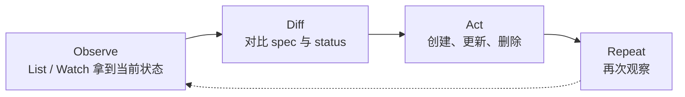
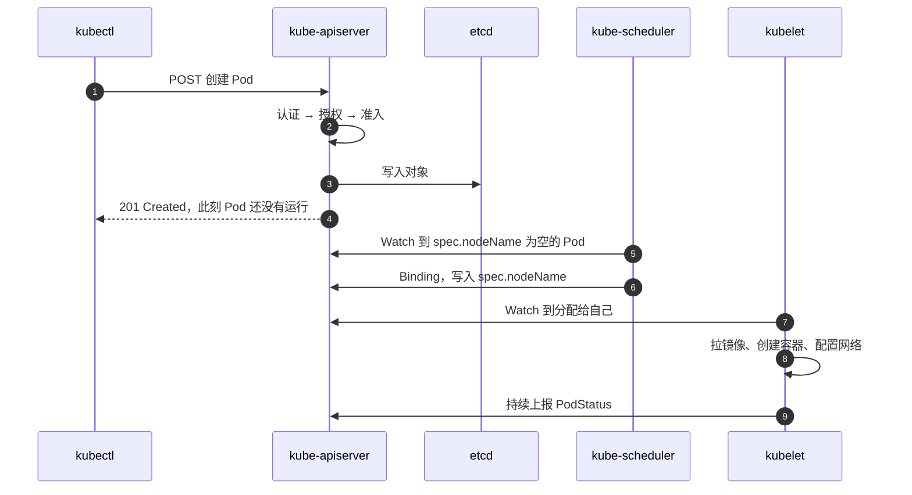
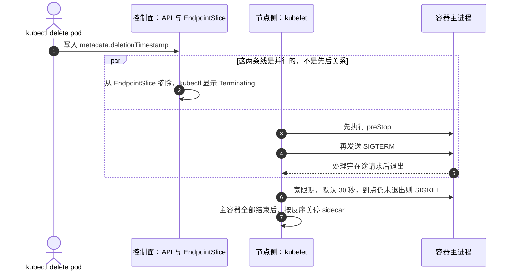

---
tags:
  - Kubernetes
  - 架构
  - 对象模型
created: 2026-09-08
---

# 核心架构与对象模型

> 本笔记对应 [[Kubernetes/00_简介]] 的「阶段 1」。学完这一阶段，你应该能独立讲清：控制面与数据面各组件的职责、`etcd` 的一致性模型、控制器模式，以及 Pod/Namespace/Label/ConfigMap/Secret/探针/生命周期等核心对象，并能讲透一次 `kubectl create` 的完整链路。

## 0. 30 秒速览

> [!abstract] 这一页只要记住六句话
> - **分工**：控制面只做「决策与存储」，真正把容器拉起来的是节点上的 `kubelet`；`kube-scheduler` 只负责写入 `spec.nodeName`。
> - **唯一入口**：`kube-apiserver` 是集群唯一的写入口，也是唯一直接访问 `etcd` 的组件；请求要依次过认证 → 授权 → 准入（Mutating → Validating）。
> - **创建的真相**：`kubectl create` 返回成功只代表对象写进了 `etcd`，**不代表 Pod 在运行**，后续由调度器、控制器和 `kubelet` 异步完成。
> - **控制器模式**：Observe → Diff → Act 的 level-triggered 循环，靠幂等实现最终一致，所以单次事件丢失或重复通常不会出错。
> - **探针分工**：`readiness` 决定「接不接流量」，`liveness` 决定「重不重启」，`startup` 决定「什么时候开始检查」；混用是生产事故的高频来源。
> - **重启的粒度**：重启发生在**容器**级别，Pod 本身不会被「重启」；优雅下线时「摘流量」和 `SIGTERM` 是**并行**发生的。

> [!tip] 怎么用这篇笔记
> 首学按顺序读；复习时只看第 0 节和第 5~6 节，其余按需回查。
> 标着「动手验证」的折叠块可以直接跑，建议至少亲手做一遍「探针三件套」和「ConfigMap 更新语义」两个实验。

## 1. 控制面与数据面

Kubernetes 从角色上分成两部分：

| 平面            | 组件                         | 一句话职责                                   |
| ------------- | -------------------------- | --------------------------------------- |
| Control Plane | `kube-apiserver`           | 唯一入口，校验对象并写入 `etcd`，对外提供 REST API       |
| Control Plane | `etcd`                     | 强一致 KV 存储，保存集群全部对象数据（`spec` 与 `status`） |
| Control Plane | `kube-scheduler`           | 为未调度的 Pod 选择合适节点                        |
| Control Plane | `kube-controller-manager`  | 运行节点、副本、端点等内置控制器                        |
| Control Plane | `cloud-controller-manager` | 对接云厂商的节点、路由、负载均衡等能力                     |
| Data Plane    | `kubelet`                  | 节点代理，保证声明的容器在该节点上运行                     |
| Data Plane    | `kube-proxy`               | 维护节点上的 Service 网络规则                     |
| Data Plane    | Container Runtime          | 通过 CRI 真正创建、启动、停止容器                     |

### 1.1 核心组件职责

- `kube-apiserver`：集群的唯一写入口，也是唯一直接访问 `etcd` 的组件。它无状态、可水平扩展；调度器、控制器、`kubelet` 等其他组件都通过它读写集群状态。审计能力内嵌在 `kube-apiserver` 里；聚合层（aggregation layer）也在它内部，但被聚合的扩展 apiserver（如 `metrics-server`）是独立进程、有各自的存储，并不跑在 `kube-apiserver` 里面。
- `etcd`：只被 `kube-apiserver` 直接访问，存储 Pod、Service、ConfigMap、RBAC 等全部对象。它的一致性由 Raft 协议保证。
- `kube-scheduler`：只负责“决策”，不负责“启动”。它监听未绑定节点的 Pod，执行过滤（Filter）和打分（Score），最终通过 Binding 子资源把 Pod 绑定到选中节点（即写入 `spec.nodeName`），实际拉起的动作由目标节点的 `kubelet` 完成。
- `kube-controller-manager`：一个进程内运行多个控制器，常见的有 Node Controller、ReplicaSet Controller、EndpointSlice Controller、ServiceAccount Token Controller 等。它是控制器模式的集中体现。
- `cloud-controller-manager`：只有在云环境才需要。它把云厂商相关逻辑从核心控制面剥离出来，例如节点生命周期、云路由、云负载均衡器。
- `kubelet`：节点上的“现场执行者”。它向 `kube-apiserver` 注册 Node 并持续上报节点与 Pod 状态，获取分配给本节点的 PodSpec，负责挂载卷（CSI）、调用容器运行时创建容器、执行探针和生命周期钩子，并在节点压力升高时驱逐 Pod、回收镜像与已退出的容器。静态 Pod 也由它直接从节点上的 manifest 目录加载，再以 mirror Pod 的形式出现在 API 里（kubeadm 部署的控制面组件就是这么跑的）。
- `kube-proxy`：在节点上维护 Service 到 Pod 的转发规则，Linux 上可用 `iptables`（当前默认）、`nftables`（官方推荐的演进方向）和 `ipvs`（自 1.35 起弃用，1.43 将移除），Windows 上只有 `kernelspace`；它本身不是流量的必经代理，更多是“规则编程器”。如果所用 CNI 自己实现了 Service 转发（如 Cilium），集群可以完全不跑 `kube-proxy`。Service 的详细流量路径放到网络阶段学习（见 [[04_网络]]）。
- 容器运行时：`kubelet` 通过 Container Runtime Interface（CRI）与 `containerd`、`cri-o` 等交互。Kubernetes 1.24 起移除了 dockershim，`Docker` 不再作为 `kubelet` 的默认 CRI 实现。
- 节点状态与心跳：`kubelet` 通过更新 Node 的 `status` 和 `kube-node-lease` 命名空间下的 Lease 对象两条途径上报存活（默认每 10s 一次）；`kube-controller-manager` 中的 Node Controller 在心跳超时（`--node-monitor-grace-period` 默认 50s）后把节点置为 `NotReady`，云环境下还会向云厂商确认该节点是否已被删除。

### 1.2 为什么分层

控制面负责全局决策和状态存储，数据面负责把声明变成实际运行状态。这样设计带来的好处是：

- 职责单一：`kube-scheduler` 不碰容器，`kubelet` 不做全局调度。
- 可替换：CNI、CSI、容器运行时、云控制器都可以按标准接口替换。
- 易扩展：新增对象时不需要改核心组件，控制器和 Operator 通过监听 API 对象即可工作。

## 2. etcd 与一致性

### 2.1 Raft 与 quorum

`etcd` 使用 Raft 共识算法保证强一致性。集群中同一时刻只有一个 leader 处理写请求，其余节点作为 follower 复制日志。

核心结论：

| 节点数 | 容忍故障数 | 是否推荐 |
| --- | --- | --- |
| 1 | 0 | 仅测试环境 |
| 3 | 1 | 生产最小高可用配置 |
| 5 | 2 | 较大集群或高可用要求更高时 |

- quorum 需要 `N/2 + 1` 个节点存活并同意，才能选举 leader、提交写入。
- 容错数为 `floor((N - 1) / 2)`，因此 3 节点和 4 节点都只能容忍 1 个节点故障，4 节点并不会提高可用性，还增加了一个故障面，所以生产通常用奇数节点。
- 读请求如果使用 linearizable read，也需要和 leader 确认当前状态，避免读到过期数据。

### 2.2 WAL、快照与备份

- WAL：写操作先落到 write-ahead log，保证崩溃后可以恢复。
- Snapshot：定期压缩历史数据，防止存储无限增长。
- 备份：生产必须配置定时快照（`etcdctl snapshot save`，也可用卷快照），并把快照放到 `etcd` 集群之外。
- 恢复：用 `etcdutl snapshot restore` 恢复（旧版 `etcdctl snapshot restore` 已弃用），恢复前可用 `etcdutl snapshot status` 校验快照；必须做一次真实恢复演练，而不是只在文档里写步骤。

> [!warning] 「多副本」不等于「备份」
> `etcd` 的三副本解决的是**节点故障**，解决不了**误删和逻辑损坏**——这类问题会通过 Raft 原样同步到所有副本，你删一个键，三个副本一起消失。
> 所以快照必须落到 `etcd` 集群之外；而快照里包含 Secret 等全部敏感数据，必须加密存放。

### 2.3 生产要点

- 使用 SSD 并给 `etcd` 预留足够 IOPS，`etcd` 对磁盘延迟非常敏感。
- 与业务 Pod 隔离，避免资源竞争和网络抖动影响共识。
- 监控 leader 变更、Raft 提交延迟、fsync 耗时、存储增长和告警。
- 定期 compaction/defrag，避免因历史版本过多导致存储膨胀和查询变慢。
- 关注后端存储配额：超过配额会触发 NOSPACE 告警，集群进入只接受读和删除的维护模式，需要清理 keyspace、defrag 并清除告警后才能恢复写入。
- 开启 peer/client 证书认证，限制谁能访问 `etcd`。

## 3. 声明式 API 与控制器模式

### 3.1 声明式 vs 命令式

命令式关注“怎么一步步做”，例如手动 `docker run`、逐个执行运维命令；声明式只描述“最终状态应该是什么”，由系统负责把实际状态调整到期望状态。

Kubernetes 中每个对象通常都有：

- `spec`：用户声明的期望状态。
- `status`：系统观测到的实际状态。

控制器的核心就是让 `status` 不断逼近 `spec`。

### 3.2 Reconcile Loop

控制器的基本工作模式：

1. Observe：通过 List/Watch 获取对象及其相关状态。
2. Diff：比较期望状态和实际状态。
3. Act：执行创建、更新、删除等动作。
4. Repeat：再次观察，直到差异消除。



这个循环是 level-triggered 的：控制器处理的是“当前状态是否匹配”，而不是只依赖某一次变更事件。因此单次事件丢失或重复执行，通常不会破坏最终一致性，控制器实现需要保证幂等。

### 3.3 一次写请求的全链路

以 `kubectl create -f pod.yaml` 为例：

1. `kubectl` 向 `kube-apiserver` 发送 POST 请求。
2. `kube-apiserver` 依次执行认证（Authentication）、授权（Authorization）、准入控制（Admission Control）。
3. 准入阶段先跑 Mutating Admission Webhook，再跑 Validating Admission Webhook；通过后才允许写入。
4. `kube-apiserver` 将对象写入 `etcd`，并返回创建成功。
5. `kube-scheduler` 通过 Watch 看到未绑定节点的 Pod，经过过滤和打分选择一个节点，通过 Binding 绑定到该节点（更新 `spec.nodeName`）。
6. 目标节点上的 `kubelet` 看到分配给自己的 Pod，调用容器运行时和网络插件创建容器、配置网络。
7. `kubelet` 持续上报 Pod 状态和容器状态，控制器根据这些状态继续调谐。



> [!important] 这里有个最常见的误解
> `kubectl` 只是客户端，**创建成功只代表对象被写入 `etcd`，不代表 Pod 已经运行**。后续的运行状态由调度器、控制器和 `kubelet` 异步完成——所以「资源创建了但还没就绪」是常态，不是异常。

### 3.4 对象模型：通用字段与扩展机制

所有 API 对象都由同一套骨架构成：

| 字段 | 含义 |
| --- | --- |
| `apiVersion` + `kind` | 对象的类型标识（Group/Version/Kind，即 GVK），例如 `apps/v1` + `Deployment` |
| `metadata` | 标识与元数据：`name`、`namespace`、`uid`、`labels`、`annotations`、`resourceVersion`、`ownerReferences`、`finalizers` |
| `spec` | 期望状态；少数对象没有 `spec`，例如 ConfigMap 直接用 `data` / `binaryData` |
| `status` | 观测状态，由控制器和系统组件写入，用户提交的值会被忽略 |

几个贯穿全局的机制：

- 作用域：对象分 namespaced（Pod、Service、ConfigMap…）与 cluster-scoped（Node、Namespace、PV、StorageClass、ClusterRole…）；集群级对象不属于任何 Namespace，不能用 `-n` 限定。
- 乐观并发：`metadata.resourceVersion` 对应对象在 `etcd` 中的版本，更新时要带上读到的版本，版本不匹配会返回 `409 Conflict`。这是多个控制器并行写入却不会互相覆盖的基础。
- ownerReferences 与级联删除：控制器创建从属对象时会写入 `ownerReferences` 指向属主，删除属主时由垃圾回收器按 `--cascade=background|foreground|orphan` 处理从属对象。它和 finalizer 是一对：ownerReferences 决定“谁跟着谁死”，finalizer 决定“删除前必须做完什么”。

Kubernetes 的扩展机制分三层：

| 扩展方式 | 解决什么 | 典型例子 |
| --- | --- | --- |
| CRD | 注册新的 API 类型，直接复用 `kube-apiserver` 的存储、鉴权、准入能力 | `Certificate`、`ServiceMonitor` |
| Controller / Operator | 为自定义对象编写调谐逻辑，把领域知识编码成控制循环 | Prometheus Operator |
| 聚合层 | 需要自定义 API 语义或独立存储时，注册独立的扩展 apiserver | `metrics-server`（`metrics.k8s.io`） |

> 一句话：CRD 让 API 认识新对象，Controller 让新对象“活”起来，两者合起来就是 Operator 模式。

声明式落到命令行工具上还有区别：

- `kubectl create`：一次性创建，对象已存在就报错，不做合并。
- `kubectl apply`（客户端）：把上次提交的内容记在 `kubectl.kubernetes.io/last-applied-configuration` 注解里做三方合并，所以“只改一个字段”不会抹掉别人加的字段，但从 manifest 里删字段时要格外小心。
- 服务端 apply（`kubectl apply --server-side`，1.22 起 Stable）：由 `kube-apiserver` 把字段所有权记在 `metadata.managedFields`，多个 applier（人、控制器、HPA）各自持有不同字段；改别人持有的字段会冲突，需要显式 `--force-conflicts` 接管。

## 4. 核心对象模型

### 4.1 Pod 与容器

Pod 是最小的可调度单元，一个 Pod 可以包含一个或多个容器。这些容器：

- 共享同一个网络命名空间：共享 IP、端口空间，容器之间可以通过 `localhost` 通信。
- 默认共享 IPC 命名空间，可通过 `shareProcessNamespace: true` 共享 PID 命名空间。
- 不共享文件系统；需要共享数据时必须显式挂载同一个 Volume。
- 生命周期：Pod 是部署与调度的基本单位，但重启发生在容器级别——`kubelet` 按 `restartPolicy` 重启失败的容器，Pod 本身不会被“重启”，要等被删除才消失。

运行时通常会创建一个 sandbox/基础设施容器来持有这些共享命名空间，Pod 内业务容器加入其中。

常见容器模式：

| 模式 | 说明 |
| --- | --- |
| Sidecar | 主容器旁挂一个辅助容器，如日志采集、配置刷新、网络代理（原生 sidecar 见 4.6） |
| Init Container | 主容器启动前按顺序执行，常用于初始化依赖或执行迁移 |
| Ambassador | 代理外部服务，让主容器只访问 `localhost` |

### 4.2 Namespace、Label、Annotation、Finalizer

- Namespace：对对象做逻辑分组和资源隔离，是资源配额、RBAC、网络策略的重要边界；但 Namespace 本身不是安全隔离边界，还需要 RBAC 和 NetworkPolicy 配合。
- Label：用于组织和选择对象的键值对，`Selector` 通过 Label 选择对象，是 Service、Deployment 等对象关联 Pod 的基础。
- Annotation：保存非标识性元数据，例如构建信息、运维说明、Ingress 配置提示、第三方工具状态。
- Finalizer：删除对象时，如果存在 finalizer，API 不会立刻移除对象，而是写入 `metadata.deletionTimestamp` 并返回 `202 Accepted`，等控制器完成清理、移除 finalizer 后才真正删除（`kubectl` 把这种状态显示为 `Terminating`，注意它是客户端显示值，不是 Pod 的 phase）。它用于保证清理逻辑不丢失，但也可能因控制器异常导致对象一直卡在删除状态；自定义 finalizer 必须使用域名限定名（如 `example.com/cleanup`），且删除请求发出后不能再新增 finalizer。

### 4.3 ConfigMap 与 Secret

- ConfigMap：保存普通配置，如环境变量、配置文件、命令行参数，用 `data` / `binaryData` 承载。它只适合非敏感数据。
- Secret：保存敏感数据，如密码、Token、TLS 证书。Secret 的 `data` 字段是 base64 编码，base64 不是加密；写 manifest 时可以用 `stringData` 直接传明文，由 API 合并进 `data`。内置类型决定了必须携带哪些 key：`Opaque`（默认）、`kubernetes.io/service-account-token`、`kubernetes.io/dockerconfigjson`、`kubernetes.io/tls`、`kubernetes.io/basic-auth` 等。
- 挂载方式：环境变量或 Volume。生产更推荐以 Volume 方式挂载并让应用支持热加载，避免把所有配置塞进环境变量；但两种方式的更新语义不同，详见 4.6。
- 不可变：设置 `immutable: true` 可以锁定 ConfigMap/Secret，防止误改，并显著降低 `kubelet` 的 watch 压力（1.21 起 Stable）。
- 加密：Kubernetes 支持对 `etcd` 中的 Secret 做 Encryption at Rest，可用 provider 包括 KMS（v2，1.29 起 Stable）、`secretbox`、`aesgcm`（要求自动密钥轮换）、`aescbc`（官方已标注不推荐）等，其中 KMS 是生产环境更推荐的方向。此外还有 SealedSecrets、External Secrets 等外部管理方案。
- 大小限制：单个 Secret 和单个 ConfigMap 都是 **1 MiB 硬上限**（超限直接拒绝），二进制内容要走 `binaryData`；反过来，大量小 Secret 同样会占用 `kube-apiserver` 内存，需要用 ResourceQuota 限制数量。
- 安全底线：Secret 默认在 `etcd` 中是明文存储（Encryption at Rest 需要显式开启），并且任何能在该 Namespace 创建 Pod 的人，都能通过挂载间接读到 Namespace 里的 Secret。

### 4.4 探针

| 探针               | 作用             | 失败后果                                                         | 典型场景             |
| ---------------- | -------------- | ------------------------------------------------------------ | ---------------- |
| `readinessProbe` | 判断容器是否准备好接收流量  | EndpointSlice Controller 把 Pod IP 从匹配的 EndpointSlice 中摘除，不重启 | 依赖未就绪、预热中、暂时无法服务 |
| `livenessProbe`  | 判断容器是否还“活着”    | 触发容器重启                                                       | 进程假死、死锁、不可自愈的状态  |
| `startupProbe`   | 判断慢启动容器是否已启动完成 | 失败则重启；成功前禁用其他探针                                              | 启动时间很长的应用        |

探针由 `kubelet` 周期性执行，共四种机制：

| 机制          | 说明                                    |
| ----------- | ------------------------------------- |
| `exec`      | 在容器内执行命令，退出码为 0 视为成功                  |
| `httpGet`   | 对容器端口发起 HTTP GET，2xx / 3xx 视为成功       |
| `tcpSocket` | 能建立 TCP 连接即视为成功                       |
| `grpc`      | 调用 gRPC 健康检查协议，要求应用实现 Health Checking |

> [!important] 三个探针一句话分清
> `readiness` 管「接不接流量」、`liveness` 管「重不重启」、`startup` 管「什么时候开始检查」。把「依赖暂时不可用」写成 `liveness`，是最常见的自伤式配置——它会把一次本可自愈的抖动放大成重启风暴。

核心原则：

- `readiness` 决定“是否接流量”，`liveness` 决定“是否重启”（实际是否重启还取决于 Pod 的 `restartPolicy`，默认 `Always` 才会重启）。
- 如果设置了 `startupProbe`，在它成功之前，`liveness` 和 `readiness` 都不会执行，避免慢启动应用被 `liveness` 误杀。
- 常用参数：`initialDelaySeconds`（首次探测前等待）、`periodSeconds`（间隔）、`timeoutSeconds`（单次超时）、`failureThreshold`（连续失败多少次判定失败）、`successThreshold`（连续成功多少次判定恢复，`liveness` 只能是 1）；具体取值要结合应用真实行为，不能照抄模板。

> [!example]- 动手验证：探针三件套怎么分工
> ```yaml
> apiVersion: v1
> kind: Pod
> metadata:
>   name: probes-demo
> spec:
>   containers:
>     - name: web
>       image: nginx:1.27
>       ports:
>         - containerPort: 80
>       startupProbe:
>         httpGet:
>           path: /
>           port: 80
>         failureThreshold: 30
>         periodSeconds: 2
>       readinessProbe:
>         httpGet:
>           path: /
>           port: 80
>         periodSeconds: 5
>       livenessProbe:
>         httpGet:
>           path: /
>           port: 80
>         periodSeconds: 10
> ```
> 验证就绪与重启的分工：
> ```text
> kubectl get pod probes-demo -o jsonpath='{.status.conditions[?(@.type=="Ready")].status}{"\n"}'
> # 预期输出 True
> kubectl exec probes-demo -- rm /usr/share/nginx/html/index.html
> kubectl get pod probes-demo -w
> # 预期：/ 开始返回非 2xx/3xx，liveness 连续失败后容器被重启，RESTARTS 从 0 变成 1
> ```
> 观察点：就绪探针失败只会让 Pod 从 EndpointSlice 摘掉，`RESTARTS` 不变；这次之所以重启，是因为失败的是 `liveness`。

### 4.5 生命周期钩子与优雅下线

两个容器生命周期钩子：

- `postStart`：容器创建后立即触发，与主进程（ENTRYPOINT）**并发**执行，可能在主进程启动前、中、后运行，因此不能依赖它控制启动顺序，也不适合用 HTTP 钩子。它会拖慢容器进入 `Running` 的时间，执行失败会杀掉容器。
- `preStop`：容器被终止前触发，可用于通知应用停止接收请求、执行清理或调用内部接口。它会阻塞 TERM 信号，必须执行完才发信号，所以钩子本身要够短；执行失败同样会杀掉容器。

两个钩子的投递语义都是“至少一次”，实现要能容忍重复执行。Pod 被删除或需要终止时，实际发生的事情是（注意第 1、2 步是**并行**的，不是严格先后）：

1. API 给 Pod 写入 `metadata.deletionTimestamp`（`kubectl` 显示为 `Terminating`），不再接收新连接；与此同时控制面评估是否把它从 EndpointSlice 摘除。
2. 节点上的 `kubelet` 开始优雅关停：先执行 `preStop`（`terminationGracePeriodSeconds` 为 0 时跳过），再向容器主进程发送 `SIGTERM`。
3. 在 `terminationGracePeriodSeconds`（默认 30 秒，从 `preStop` 执行前就开始计时）内仍未退出，则发送 `SIGKILL` 强制终止；如果 `preStop` 到宽限期结束还没跑完，`kubelet` 会额外申请 2 秒。
4. 如果 Pod 里有 sidecar 容器，`kubelet` 会等主容器全部结束后，再按定义的反序关停 sidecar。



“摘流量”这一步要理解得更精确：terminating 端点不会立刻从 EndpointSlice 消失，它的 `ready` 恒为 `false`（为兼容 1.26 之前的行为），想知道它是否仍在提供服务要看 `serving` condition；而 `kube-proxy` 和负载均衡器的规则更新也有延迟。这正是“摘流量”与“收到 `SIGTERM`”之间存在竞态、生产上要给 `preStop` 留一点缓冲（例如 `sleep` 几秒）的原因。

> 生产实践：`preStop` 要短、要可重试；主进程要能正确处理 `SIGTERM`（注意镜像的 `STOPSIGNAL` 可能覆盖默认的 TERM）；优雅退出时间要大于应用真实需要的时间，并小于 `terminationGracePeriodSeconds`。

### 4.6 Pod 状态、重启、sidecar 与配置更新

Pod 的状态有三个层次，排障时不要混用：

- `status.phase`：`Pending` / `Running` / `Succeeded` / `Failed` / `Unknown`，只是高层概括，不是完整状态机。
- 容器状态：`Waiting` / `Running` / `Terminated`（`kubectl describe pod` 里的 State 与 Reason）。
- `status.conditions`：`PodScheduled`、`PodReadyToStartContainers`、`Initialized`、`ContainersReady`、`Ready`，以及驱逐、抢占场景下的 `DisruptionTarget`。

> [!warning] 分清「显示态」和「真实字段」
> `kubectl get pod` 里的 `Terminating`、`CrashLoopBackOff`、`Completed` 都是客户端显示值，不是 `status.phase`。写告警规则、做自动化判断时要读 API 字段，不要去匹配 `kubectl` 的输出。

失败与重启：

- `restartPolicy` 作用于 Pod 内所有容器：`Always`（默认）、`OnFailure`、`Never`；Job 只允许后两种。
- 容器退出后 `kubelet` 会立即重启一次，之后按 10s → 20s → 40s … 指数退避，上限 5 分钟；连续失败期间 `kubectl` 显示 `CrashLoopBackOff`。容器稳定运行 10 分钟后，退避计时器会重置。
- 重启的永远是容器：`livenessProbe` 失败只是杀掉容器，是否重启仍由 `restartPolicy` 决定，Pod 本身不会被“重启”。

sidecar 容器有两种形态，别混为一谈：

- 传统写法：把辅助容器直接放在 `spec.containers` 里，与主容器地位相同、一起被创建和终止。
- 原生 sidecar（1.28 Alpha → 1.29 Beta → 1.33 Stable）：把辅助容器放进 `initContainers` 并设置 `restartPolicy: Always`。它随 init 容器序列启动，然后一直运行到 Pod 结束。
  - 有独立生命周期：改镜像只重启该容器，不会重建 Pod；支持探针，配了 `readinessProbe` 时其结果会参与 Pod 的 Ready 判定。
  - 对 Job 友好：带这种 sidecar 的 Job 不会因为 sidecar 不退出而卡住，主容器结束后 sidecar 会被自动终止。
  - 终止顺序由 `kubelet` 保证：主容器全部结束后，sidecar 按定义的反序关停，不需要再用 `preStop` 手工编排“代理最后退”。

ConfigMap / Secret 的更新语义（生产高频坑）：

| 消费方式 | 会不会自动更新 |
| --- | --- |
| 环境变量（`env` / `envFrom`） | 不会，必须重建 Pod |
| Volume 挂载 | 会更新，但有延迟（最长约 `kubelet` 同步周期 + 缓存传播延迟） |
| `subPath` 挂载 | 不会，等同于只取了一次快照 |

所以依赖热更新的应用要自己监听文件变化并 reload；用 `immutable: true` 则彻底放弃更新能力，换取可预测性。

> [!example]- 动手验证：三种消费方式，三种更新行为
> 先建 ConfigMap：
> ```yaml
> apiVersion: v1
> kind: ConfigMap
> metadata:
>   name: demo-config
> data:
>   APP_MODE: "v1"
> ```
> 再建一个同时用环境变量和卷挂载它的 Pod：
> ```yaml
> apiVersion: v1
> kind: Pod
> metadata:
>   name: config-demo
> spec:
>   containers:
>     - name: app
>       image: busybox:1.36
>       command: ["sh", "-c", "while true; do sleep 3600; done"]
>       envFrom:
>         - configMapRef:
>             name: demo-config
>       volumeMounts:
>         - name: cfg
>           mountPath: /etc/cfg
>   volumes:
>     - name: cfg
>       configMap:
>         name: demo-config
> ```
> 改一次配置，对比两种消费方式：
> ```text
> kubectl exec config-demo -- printenv APP_MODE        # 预期输出 v1
> kubectl exec config-demo -- cat /etc/cfg/APP_MODE    # 预期输出 v1
> kubectl patch configmap demo-config --type merge -p '{"data":{"APP_MODE":"v2"}}'
> kubectl exec config-demo -- printenv APP_MODE        # 仍然是 v1，环境变量不会更新
> kubectl exec config-demo -- cat /etc/cfg/APP_MODE    # 等待数十秒后变成 v2，卷挂载有延迟
> ```
> 把 `mountPath` 换成 `subPath` 指到具体文件再试一次，就会看到第三种行为：虽然挂的是卷，但内容永远停在创建时的快照。

### 4.7 最容易搞混的三件事

| 常见说法 | 事实 |
| --- | --- |
| 「Pod 重启了」 | 被重启的是**容器**，Pod 本身只会被删除重建；`CrashLoopBackOff` 是 `kubectl` 的显示态，不是 phase |
| 「删 Pod 是先摘流量再发 SIGTERM」 | 两件事**并行**发生，而且规则传播有延迟，所以要给 `preStop` 留缓冲 |
| 「改了 ConfigMap，应用立刻生效」 | env 不更新、卷挂载有延迟、`subPath` 不更新，三种消费方式行为完全不同 |

## 5. 生产实践

### 5.1 控制面高可用

- 生产环境至少 3 个控制面节点，`kube-apiserver` 前放负载均衡，避免所有请求打到单点。
- `etcd` 独立部署、3 或 5 个奇数节点，使用 SSD，开启 TLS，定时备份并把备份复制到集群外。
- 控制面节点与业务节点做好资源隔离，避免业务流量影响控制面决策。
- 定期演练 `etcd` 恢复和集群升级，不在生产环境第一次做这些操作。

### 5.2 请求链路防护

- 使用 ServiceAccount 粒度做 RBAC，不给业务应用集群管理员权限。
- 准入控制是“最后一关”，重要策略可以用 Validating Admission Webhook、OPA/Gatekeeper、Kyverno 统一管理。
- 开启审计日志，尤其记录对 Secret、RBAC 和删除类操作的访问。
- 对用户侧入口做限流、认证和命名空间隔离，避免误操作影响整个集群。

### 5.3 Pod 生命周期落地

- 为应用配置 `readinessProbe`，保证只有真正能处理请求时才进入流量。
- 为容易假死、死锁的应用配置 `livenessProbe`，但不要把依赖暂时不可用误判为“应该重启”。
- 启动慢的应用配置 `startupProbe`，避免 `liveness` 在启动阶段反复杀容器。
- 使用 `preStop` + `terminationGracePeriodSeconds` 做优雅下线，保证滚动更新和节点 drain 时请求不中断。
- 给所有生产 Pod 设置合理的 `requests` 和 `limits`，这是后续 QoS 和稳定性讨论的基础。

### 5.4 配置与密钥管理

- 敏感信息只放 Secret，不放 ConfigMap，不硬编码进镜像。
- 开启 Secret 静态加密，生产优先使用 KMS。
- 用不可变 Secret 和 ConfigMap 减少配置热更新带来的意外行为，或在设计阶段就明确热更新语义。
- 明确配置更新语义：环境变量不随 ConfigMap/Secret 变化，卷挂载更新有延迟，`subPath` 挂载不更新（见 4.6），不要假设“改了配置应用立刻生效”。
- 对 Secret 做访问审计，限制谁能 `get`、`list`、`watch`。

## 6. 要点自测

复述时先盖住答案自己讲一遍，再展开对照。每张卡能在 3~5 分钟内脱稿讲完就算过关；也可以直接拿去做间隔重复的卡片。

### 6.1 `kubectl create` 从发出到 Pod 运行的全链路

> [!question]- 讲一遍 `kubectl create` 从发出到 Pod 运行的完整链路
> 1. `kubectl` 发送请求到 `kube-apiserver`。
> 2. 认证：你是谁。
> 3. 授权：你有没有权限做这件事。
> 4. 准入控制：对象是否被修改或拒绝。
> 5. `kube-apiserver` 写入 `etcd`。
> 6. `kube-scheduler` 监听未绑定 Pod，过滤、打分、选择节点，并通过 Binding 绑定 Pod（更新 `spec.nodeName`）。
> 7. 目标节点 `kubelet` 拉起容器、配置网络和存储，并持续上报状态。
>
> **答完要补这一句**：关键是区分「声明被写入存储」和「控制器异步调谐」，而不是简单说一句「创建了 Pod」。

### 6.2 为什么 `etcd` 用奇数节点

> [!question]- `etcd` 为什么用奇数节点？坏一个节点集群还能用吗？
> - Raft 需要多数派 `N/2 + 1` 才能完成选举和提交写入。
> - 3 节点和 4 节点都只能容忍 1 个节点故障，但 4 节点多一个故障点且不能提高可用性。
> - 所以生产选择 3 或 5 节点，牺牲少量资源换取清晰的多数派语义和更稳定的可用性。

### 6.3 控制器模式和声明式系统

> [!question]- 控制器模式是什么？为什么说 Kubernetes 是「声明式」系统？
> - 控制器通过 Observe → Diff → Act 的循环让实际状态逼近期望状态。
> - `spec` 是用户声明，`status` 是系统观测，控制器不断调谐。
> - 这种方式是 level-triggered 的，控制器实现需要幂等，系统因此具备自愈能力。

### 6.4 `liveness`、`readiness`、`startup` 的区别

> [!question]- `liveness`、`readiness`、`startup` 分别管什么？
> - `readiness` 失败：摘流量，不重启。
> - `liveness` 失败：重启容器。
> - `startup` 成功前：其他探针暂停，避免慢启动被误杀。
> - 追问准备：应用启动慢却只配了 `liveness` 会发生什么？依赖短暂不可用应该用哪个探针？

### 6.5 如何做优雅下线

> [!question]- 删除一个 Pod 时，集群里到底发生了什么？
> - 删除 Pod 后，“摘除流量”（更新 EndpointSlice）与节点上的优雅关停是**并行**发生的，且规则更新有延迟，所以生产才会在 `preStop` 里留一点缓冲。
> - 节点侧的顺序是：执行 `preStop`（跳过条件：`terminationGracePeriodSeconds: 0`）→ 发送 `SIGTERM` → 宽限期（默认 30 秒）后 `SIGKILL`。
> - 应用要处理 `SIGTERM`，完成正在处理的请求、关闭连接和资源。
> - `terminationGracePeriodSeconds` 是硬上限，超时后 `SIGKILL` 强杀。
> - terminating 端点的 `ready` 恒为 `false`，判断它是否仍在服务要看 `serving` condition。
> - 滚动更新、节点 drain 都依赖这条链路保证零停机或最小中断。

### 6.6 Secret 为什么不能只靠 base64

> [!question]- Secret 用 base64 存，为什么不能算加密？
> - base64 只是编码，不是加密，任何能读取 `etcd` 或拿到 manifest 的人都能还原。
> - 必须配合 Encryption at Rest、KMS、最小权限 RBAC、审计和外部密钥管理。
> - 更高要求下可引入 SealedSecrets 或 External Secrets，避免 Secret 明文出现在 Git 仓库。

### 6.7 回到路线图

完成本笔记后，回到 [[Kubernetes/00_简介]]：

- [ ] 能脱稿讲清控制面与数据面各组件职责
- [ ] 能讲清 `etcd` quorum 计算和备份恢复思路
- [ ] 能讲清控制器模式与声明式 API
- [ ] 能讲清 `kubectl create` 的完整链路
- [ ] 能区分 `liveness` / `readiness` / `startup` 并给出正确用法
- [ ] 能讲清 Pod 共享命名空间、ConfigMap/Secret、finalizer 和优雅下线
- [ ] 能讲清 Pod 的 phase / 容器状态 / conditions，以及重启退避与 CrashLoopBackOff
- [ ] 能讲清原生 sidecar 与 ConfigMap/Secret 的更新语义
- [ ] 能讲清对象通用字段（GVK、作用域、resourceVersion、ownerReferences）与 CRD/Operator 扩展方式

> 推荐扩展阅读：Kubernetes 官方文档中的 [Concepts](https://kubernetes.io/docs/concepts/)、[Cluster Architecture](https://kubernetes.io/docs/concepts/architecture/) 和 [Pod Lifecycle](https://kubernetes.io/docs/concepts/workloads/pods/pod-lifecycle/)。
