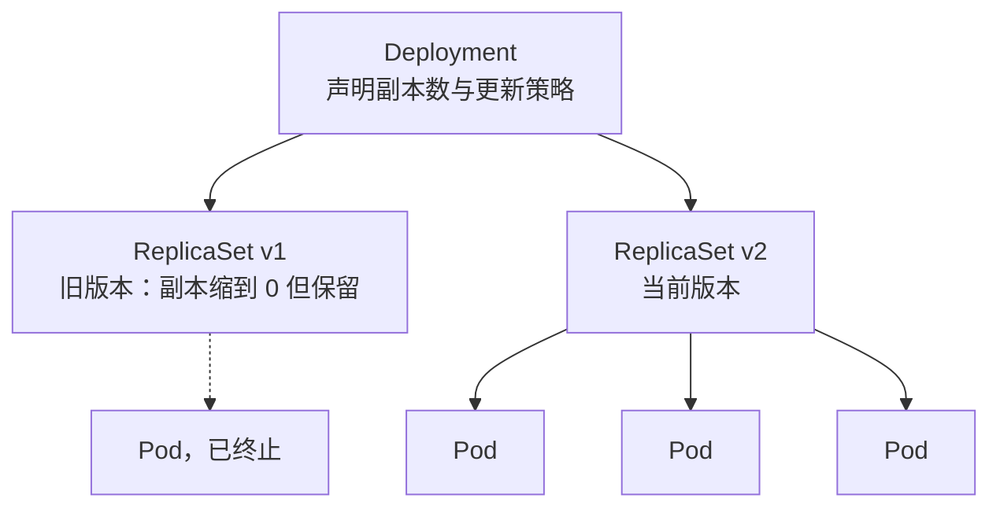
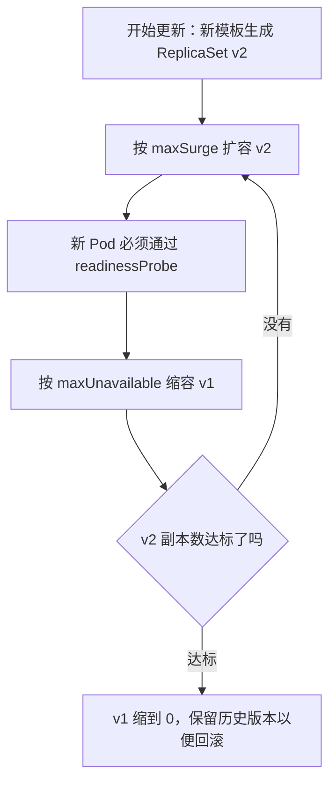

---
tags:
  - Kubernetes
  - 工作负载
  - 控制器
created: 2026-09-08
---

# 工作负载与控制器

> 本笔记对应 [[Kubernetes/00_简介]] 的「阶段 2」。目标：能根据应用特征选对工作负载，讲清 Deployment/ReplicaSet、StatefulSet、DaemonSet、Job/CronJob 的关系，并掌握滚动更新、回滚、蓝绿和金丝雀发布的生产用法。
>
> 关联复习：[[01_核心架构与对象模型]]

## 0. 30 秒速览

> [!abstract] 这一页只要记住六句话
> - **选型主线**：无状态用 Deployment、有状态用 StatefulSet、每节点一个用 DaemonSet、跑完就停用 Job/CronJob。
> - **Deployment 不直接管 Pod**：中间隔着 ReplicaSet。改 Pod 模板 = 生成新的 ReplicaSet = 触发一次滚动更新。
> - **滚动更新的两个旋钮**：`maxSurge`（能超额多少）和 `maxUnavailable`（能少几个可用），默认都是 25%，**两者不能同时为 0**。
> - **更新的闸门是就绪探针**：新 Pod 没过 `readinessProbe` 就不会继续推进；没有就绪探针的滚动更新等于盲发。
> - **回滚靠历史 ReplicaSet**：保留数量由 `revisionHistoryLimit` 控制（默认 10），删掉历史版本就等于放弃回滚能力。
> - **StatefulSet 的三个「稳定」**：稳定网络标识、稳定存储、有序扩缩容；配套 Headless Service 与 `volumeClaimTemplates`，Pod 删除后 PVC 默认保留。

> [!tip] 怎么用这篇笔记
> 首学按顺序读；复习时只看第 0 节和第 8~10 节，其余按需回查。
> 标着「动手验证」的折叠块可以直接跑，建议亲手做一次「滚动更新 + 回滚」，亲眼看到两个 ReplicaSet 并存。
> 五种工作负载（Deployment / StatefulSet / DaemonSet / Job / CronJob）各自配了一个能直接 apply 的折叠示例；记不住语义时先跑一遍，再回来看描述会快很多。

## 1. 控制器与工作负载的关系

工作负载（Workload）描述“要运行什么样的 Pod、跑多少副本、如何更新”，控制器（Controller）负责把这份声明变成实际状态并持续调谐。

最常见的关系链是：



- Deployment 负责声明式更新、回滚和副本管理。
- ReplicaSet 负责保证指定数量的 Pod 副本存在。
- Pod 是真正承载容器的运行单元。

> [!important] 记住这层间接
> 改 Deployment 的 Pod 模板时，Kubernetes 不会去改已有 Pod，而是**新建一个 ReplicaSet**，再把旧的按策略缩容。滚动更新、回滚、`revisionHistoryLimit` 全都建立在这层间接之上。

直接创建 ReplicaSet 通常没有必要，生产环境应通过 Deployment 管理无状态应用。

## 2. 常用工作负载对象

| 对象 | 适用场景 | 关键能力 | 是否提供稳定身份 |
| --- | --- | --- | --- |
| Deployment | 无状态应用 | 滚动更新、回滚、扩缩容 | 否 |
| StatefulSet | 有状态应用 | 稳定网络标识、稳定存储、有序扩缩容 | 是 |
| DaemonSet | 每节点一个 Pod | 节点级 agent、采集、网络插件 | 部分稳定 |
| Job | 一次性任务 | 运行到完成、并行度、重试 | 否 |
| CronJob | 定时任务 | 按 Cron 表达式创建 Job | 否 |

## 3. Deployment 与 ReplicaSet

### 3.1 基本模型

Deployment 是生产环境使用最多的无状态工作负载。它通过 ReplicaSet 管理 Pod，并提供：

- 声明副本数：`replicas`。
- 滚动更新：逐步用新版本替换旧版本。
- 回滚：`kubectl rollout undo`。
- 暂停/恢复发布：`kubectl rollout pause/resume`。
- 历史版本管理：`revisionHistoryLimit`。

ReplicaSet 的核心字段是 `selector`、`replicas` 和 Pod 模板。Deployment 的 selector 在创建后不可修改，修改 Pod 模板会触发一次新的 ReplicaSet 和滚动更新。

> [!example]- 动手验证：一个最小 Deployment，从名字里看清三级关系
> ```yaml
> apiVersion: apps/v1
> kind: Deployment
> metadata:
>   name: web
>   labels:
>     app: web
> spec:
>   replicas: 3
>   selector:
>     matchLabels:
>       app: web
>   template:
>     metadata:
>       labels:
>         app: web
>     spec:
>       containers:
>         - name: web
>           image: nginx:1.27
>           ports:
>             - containerPort: 80
> ```
> 验证三级对象的名字关系：
> ```text
> kubectl apply -f deployment-web.yaml
> kubectl get deploy,rs,pod -l app=web
> # 预期：1 个 Deployment（web）、1 个 ReplicaSet（形如 web-7d9c8f6b5）、3 个 Pod（形如 web-7d9c8f6b5-x2k9p）
> # Pod 名的中间一段就是 ReplicaSet 名，ReplicaSet 名又是 Deployment 名加一段哈希——这层间接在名字里就看得见
> kubectl get pods -l app=web -o custom-columns=POD:.metadata.name,OWNER:.metadata.ownerReferences[0].name
> # 预期：OWNER 一列全是 ReplicaSet 的名字，而不是 Deployment 的名字——Pod 的直接上级只有 ReplicaSet
> ```
> 两个容易踩的点：`selector.matchLabels` 必须能匹配到 `template.metadata.labels`，否则创建出来的 Pod 永远不会被这个 Deployment 接管；`selector` 创建后不可改，想换选择器只能重建 Deployment。

### 3.2 滚动更新

滚动更新的关键参数是 `maxSurge` 和 `maxUnavailable`：

| 参数 | 含义 | 影响 |
| --- | --- | --- |
| `maxSurge` | 更新期间允许超出目标副本数的 Pod 数 | 决定更新速度和资源峰值 |
| `maxUnavailable` | 更新期间允许不可用的 Pod 数 | 决定更新期间的可用性下限 |

默认值通常是 `maxSurge: 25%`、`maxUnavailable: 25%`。它们可以用整数，也可以用百分比。

更新过程大致为：

1. Deployment 创建新 ReplicaSet。
2. 新 ReplicaSet 按 `maxSurge` 逐步扩容新 Pod。
3. 旧 ReplicaSet 按 `maxUnavailable` 逐步缩容旧 Pod。
4. 新 Pod 通过 `readinessProbe` 后才算可用，才会继续推进。
5. 旧 ReplicaSet 最终缩到 0，但会保留历史版本以便回滚。



`maxSurge` 越大，更新越快但峰值资源越高；`maxUnavailable` 越大，更新越快但可用性下降越明显。两者不能同时为 0。

> [!warning] `maxUnavailable` 和 `maxSurge` 都设成 0 是无效配置
> 那样会一步都推进不了，Deployment 直接被拒绝。想做到「更新期间可用副本数不下降」，正确写法是 `maxUnavailable: 0` 配一个大于 0 的 `maxSurge`，代价是峰值资源会多出最多 `maxSurge` 份。

### 3.3 回滚

常用命令：

```text
kubectl rollout status deployment/<name>
kubectl rollout history deployment/<name>
kubectl rollout undo deployment/<name>
kubectl rollout undo deployment/<name> --to-revision=2
```

回滚本质上是指向之前的 ReplicaSet。历史 ReplicaSet 保留数量由 `revisionHistoryLimit` 控制，默认通常为 10。

### 3.4 更新策略

- `RollingUpdate`：默认策略，逐步替换，适合大多数服务。
- `Recreate`：先删除全部旧 Pod，再创建新 Pod。会有停机窗口，适合“不能同时存在两个版本”的场景，例如数据库迁移、独占资源场景。

> [!example]- 动手验证：换成 `Recreate`，把「停机窗口」看出来
> ```text
> kubectl patch deployment/web -p '{"spec":{"strategy":{"type":"Recreate","rollingUpdate":null}}}'
> # rollingUpdate 要一起清掉：type 为 Recreate 时再带 rollingUpdate 字段，会被 API 直接拒绝
> kubectl set image deployment/web web=nginx:1.28
> kubectl get pods -l app=web --watch
> # 预期：旧 Pod 先被全部删除（READY 掉到 0），随后新 Pod 才开始创建——中间有一段明显的不可用窗口
> kubectl rollout status deployment/web
> kubectl patch deployment/web -p '{"spec":{"strategy":{"type":"RollingUpdate"}}}'
> # 改回滚动更新；不写 rollingUpdate 就回到默认的 maxSurge / maxUnavailable = 25%
> ```
> 判据很简单：**更新过程中 `kubectl get pods` 有没有出现过全部不可用**。出现过就是硬停机，`Recreate` 只该用在「两个版本不能同时存在」的场景；能容忍版本并存就该用滚动更新。

> [!example]- 动手验证：滚动更新与回滚，看两个 ReplicaSet 并存
> ```yaml
> apiVersion: apps/v1
> kind: Deployment
> metadata:
>   name: web
> spec:
>   replicas: 4
>   revisionHistoryLimit: 10
>   strategy:
>     type: RollingUpdate
>     rollingUpdate:
>       maxSurge: 1
>       maxUnavailable: 0
>   selector:
>     matchLabels:
>       app: web
>   template:
>     metadata:
>       labels:
>         app: web
>     spec:
>       containers:
>         - name: web
>           image: nginx:1.27
>           ports:
>             - containerPort: 80
>           readinessProbe:
>             httpGet:
>               path: /
>               port: 80
>             periodSeconds: 2
> ```
> 先看初始状态，再发一次更新并回滚：
> ```text
> kubectl get rs -l app=web
> # 预期：只有 1 个 ReplicaSet，DESIRED / CURRENT / READY 都是 4
> kubectl set image deployment/web web=nginx:1.28
> kubectl rollout status deployment/web
> # 预期：新 Pod 逐个就绪、旧 Pod 逐个退出，全程 READY 不低于 4（因为 maxUnavailable=0）
> kubectl get rs -l app=web
> # 预期：出现第 2 个 ReplicaSet，新的是 4/4，旧的变成 0/0 但对象仍然保留
> kubectl rollout history deployment/web
> kubectl rollout undo deployment/web
> kubectl get rs -l app=web
> # 预期：回滚的本质就是给旧 ReplicaSet 重新扩容，它从来没有被删除
> ```
> 想亲手体会「没有就绪探针会怎样」，把 `readinessProbe` 整段删掉再发一次更新：由于新 Pod 一创建就被算作可用，你会在日志或流量上先看到报错，而不是在 `rollout status` 上被拦住。

## 4. StatefulSet

### 4.1 三个“稳定”

StatefulSet 与 Deployment 的本质区别在于它提供有状态应用需要的稳定性：

1. 稳定网络标识：Pod 名称固定为 `<statefulset>-<ordinal>`，例如 `mysql-0`、`mysql-1`。
2. 稳定存储：通过 `volumeClaimTemplates` 为每个 Pod 创建独立 PVC。
3. 有序部署和扩缩容：按序号 0、1、2... 依次创建，缩容时反向删除。

StatefulSet 通常需要配合 Headless Service 使用，`serviceName` 字段是必填的。每个 Pod 拥有稳定的 DNS 名称：

```text
<pod-name>.<headless-service>.<namespace>.svc.cluster.local
```

> [!important] 为什么必须要这三个「稳定」
> 有状态应用的每个副本身份不同：`mysql-0` 不能顶替 `mysql-1`。Deployment 的 Pod 是可互换的，重建后会拿到新名字、新 IP、新卷；StatefulSet 保证这三样在重建后保持不变，应用才可能靠固定身份做选主和复制。

### 4.2 使用要点

- 数据库、消息队列、分布式存储等有状态组件优先考虑 StatefulSet。
- Pod 删除后 PVC 默认不会随 Pod 一起删除，避免数据被误删。
- 更新策略：
  - `RollingUpdate`：按逆序逐个更新。
  - `OnDelete`：删除 Pod 后才会用新模板重建，适合需要人工控制更新时机。
- 可通过 `podManagementPolicy` 控制是否要求前一个 Pod 就绪后再创建下一个。

> [!example]- 动手验证：StatefulSet + Headless Service，把三个「稳定」跑出来
> ```yaml
> apiVersion: v1
> kind: Service
> metadata:
>   name: nginx
> spec:
>   clusterIP: None          # Headless：不分配 ClusterIP，DNS 直接返回 Pod 的地址
>   selector:
>     app: nginx
>   ports:
>     - port: 80
>       name: web
> ---
> apiVersion: apps/v1
> kind: StatefulSet
> metadata:
>   name: web
> spec:
>   serviceName: nginx       # 必须指向上面这个 Headless Service
>   replicas: 2
>   podManagementPolicy: OrderedReady
>   persistentVolumeClaimRetentionPolicy:
>     whenDeleted: Retain    # 删 StatefulSet 时保留 PVC（默认行为）
>     whenScaled: Retain     # 缩容时也保留，避免手一抖删掉数据
>   selector:
>     matchLabels:
>       app: nginx
>   template:
>     metadata:
>       labels:
>         app: nginx
>     spec:
>       containers:
>         - name: nginx
>           image: nginx:1.27
>           ports:
>             - containerPort: 80
>               name: web
>           volumeMounts:
>             - name: www
>               mountPath: /usr/share/nginx/html
>   volumeClaimTemplates:
>     - metadata:
>         name: www
>       spec:
>         accessModes:
>           - ReadWriteOnce
>         storageClassName: standard   # kind 的默认类；换成你集群里的类名
>         resources:
>           requests:
>             storage: 1Gi
> ```
> 按顺序验证三个「稳定」：
> ```text
> kubectl apply -f statefulset-web.yaml
> kubectl get pods -l app=nginx --watch
> # 预期：web-0 先到 Running / READY 1/1，之后才出现 web-1（OrderedReady 是串行创建）
> kubectl get pvc
> # 预期：www-web-0、www-web-1 两个 PVC，各自绑定一个 PV——每个副本一份独立存储
> kubectl get pod web-0 -o wide
> # 记下 web-0 自己的 Pod IP，下面这一步应该解析到同一个地址
> kubectl run dns-test --rm -it --image=busybox:1.36 --restart=Never -- nslookup web-0.nginx
> # 预期：web-0.nginx 解析成功，指向 web-0 的 Pod IP
> # 对比：普通 Service 的 DNS 名 nginx 解析到 ClusterIP；Headless 下 <pod>.<service> 直接解析到 Pod
> kubectl delete pod web-0
> kubectl get pods -l app=nginx --watch
> # 预期：重建出来的 Pod 还叫 web-0，挂的还是 www-web-0 那个 PVC——名字和存储这两重身份在重建后保持不变
> # 注意 Pod IP 会变：StatefulSet 稳定的是「名字」和「存储」，不是 IP
> kubectl scale statefulset web --replicas=1
> kubectl get pvc
> # 预期：web-1 的 Pod 消失，但 www-web-1 的 PVC 还在（默认 Retain）——删 Pod 不等于删数据
> ```
> 这一步的反面同样要记住：PVC 不随 Pod 删除，意味着**副本数缩了、存储账单没缩**，回收策略必须提前规划（见 [[05_存储]]）。

### 4.3 典型误区

| 常见做法 | 事实 |
| --- | --- |
| 为了「固定 IP」用 StatefulSet | Pod IP 本身不是稳定契约，Service 提供的才是稳定入口 |
| 无状态 Web 服务硬套 StatefulSet | 只有确实需要稳定身份和有序性时才值得，否则只是徒增约束 |
| 以为套上 StatefulSet 就自动安全 | 有状态应用还必须配套 StorageClass、持久化策略和备份，缺一不可 |

## 5. DaemonSet

DaemonSet 保证每个符合条件的节点上运行一个 Pod 副本。

典型用途：

- 日志采集：每个节点部署采集 agent。
- 监控 agent：node-exporter、采集器。
- 网络插件：CNI 插件常以 DaemonSet 部署。
- 节点维护或安全 agent。

可以通过 `nodeSelector`、Node Affinity 和 Tolerations 控制它只运行在部分节点上，例如只部署到 GPU 节点或专用节点池。

DaemonSet 的更新也支持滚动更新。节点新增时，DaemonSet 会自动补齐 Pod；节点下线后，对应 Pod 会随节点一起消失。

> [!example]- 动手验证：DaemonSet 只覆盖被打了标签和污点的节点
> ```yaml
> apiVersion: apps/v1
> kind: DaemonSet
> metadata:
>   name: node-agent
>   namespace: kube-system
> spec:
>   selector:
>     matchLabels:
>       app: node-agent
>   template:
>     metadata:
>       labels:
>         app: node-agent
>     spec:
>       nodeSelector:
>         hardware: gpu            # 只落在打了这个标签的节点上
>       tolerations:
>         - key: hardware
>           operator: Equal
>           value: gpu
>           effect: NoSchedule     # 少了这条容忍，Pod 会被节点污点挡在门外
>       containers:
>         - name: agent
>           image: busybox:1.36
>           command: ["sh", "-c", "sleep 3600"]
>           resources:
>             requests:
>               cpu: 50m
>               memory: 64Mi
> ```
> ```text
> kubectl label node gpu-01 hardware=gpu
> kubectl taint node gpu-01 hardware=gpu:NoSchedule
> kubectl apply -f daemonset-node-agent.yaml
> kubectl get pods -n kube-system -l app=node-agent -o wide
> # 预期：只有 gpu-01 上跑着 1 个 Pod，其他节点一个都没有
> kubectl get ds -n kube-system node-agent
> # 预期：DESIRED 等于「符合条件的节点数」，不是一个写死的 replicas
> kubectl label node gpu-02 hardware=gpu
> kubectl taint node gpu-02 hardware=gpu:NoSchedule
> kubectl get pods -n kube-system -l app=node-agent -o wide
> # 预期：gpu-02 上自动出现一个 Pod，DaemonSet 的对象本身一个字都没改
> kubectl label node gpu-01 hardware-
> kubectl taint node gpu-01 hardware:NoSchedule-
> # 收尾：标签去掉后，gpu-01 上的 Pod 会被自动清理
> ```
> 注意两点：DaemonSet 的副本数由节点决定，**改不出 `replicas` 这个字段**；另外 DaemonSet 的 Pod 会自动带上 `node.kubernetes.io/not-ready` 等一批系统污点的容忍（见官方文档的容忍表），但**你自己打的业务污点必须自己加容忍**，这也是「agent 上不了专用节点」最常见的原因。

## 6. Job 与 CronJob

### 6.1 Job

Job 用于运行一次性任务，目标是把任务跑到成功完成，而不是长期保持运行。

关键字段：

- `completions`：需要成功完成的 Pod 数量。
- `parallelism`：同时运行的 Pod 数量。
- `backoffLimit`：失败重试次数上限。
- `activeDeadlineSeconds`：任务总超时时间。
- `ttlSecondsAfterFinished`：任务完成后自动清理的时间。

Job 的 Pod `restartPolicy` 只能是 `Never` 或 `OnFailure`，不能使用 `Always`。

> [!example]- 动手验证：Job 的 completions / parallelism / ttl 各管什么
> ```yaml
> apiVersion: batch/v1
> kind: Job
> metadata:
>   name: batch-demo
> spec:
>   completions: 5              # 一共要成功 5 次
>   parallelism: 2              # 同时最多跑 2 个 Pod
>   backoffLimit: 2             # 失败重试上限（默认 6）
>   activeDeadlineSeconds: 120  # 整个 Job 的总时限，到点全部终止
>   ttlSecondsAfterFinished: 100  # 结束后 100 秒自动清理 Job 和 Pod
>   template:
>     spec:
>       restartPolicy: Never
>       containers:
>         - name: task
>           image: busybox:1.36
>           command: ["sh", "-c", "echo task $(date +%s); sleep 5"]
> ```
> ```text
> kubectl apply -f job-batch-demo.yaml
> kubectl get job batch-demo --watch
> # 预期：COMPLETIONS 从 0/5 一路走到 5/5；过程中最多同时有 2 个 Pod（parallelism: 2）
> kubectl get pods -l batch.kubernetes.io/job-name=batch-demo
> # 预期：5 个 Pod，全部 Completed；每个 Pod 只跑一次，成功一个才计一次完成
> kubectl get job batch-demo
> # 预期：100 秒后这条命令返回 NotFound——ttlSecondsAfterFinished 把 Job 和它的 Pod 一起清掉了
> ```
> 想亲眼看重试行为，把 `command` 改成 `exit 1`：Pod 会以 `backoffLimit` 为上限反复重建，超过上限后 Job 变成 `Failed`；若加的是 `activeDeadlineSeconds` 超时，则表现为 Job 带 `DeadlineExceeded` 条件。**两者的区别是：前者是「重试用完」，后者是「时间用完」，排查方向完全不同。**

### 6.2 CronJob

CronJob 按 Cron 表达式定时创建 Job。

关键字段：

- `schedule`：Cron 表达式。
- `concurrencyPolicy`：`Allow` / `Forbid` / `Replace`，控制上一次任务未结束时如何处理下一次调度。
- `startingDeadlineSeconds`：允许延迟启动的最长时间。
- `successfulJobsHistoryLimit` / `failedJobsHistoryLimit`：历史 Job 保留数量。
- `suspend`：暂停定时任务。

生产环境要关注任务幂等性，因为定时任务可能延迟执行、重复执行或与上次任务重叠。

> [!example]- 动手验证：CronJob 每分钟创建一个 Job
> ```yaml
> apiVersion: batch/v1
> kind: CronJob
> metadata:
>   name: hello
> spec:
>   schedule: "*/1 * * * *"      # 每分钟一次；示例用，生产别这么密
>   timeZone: "Asia/Shanghai"    # 不写则按 kube-controller-manager 所在时区解释
>   concurrencyPolicy: Forbid    # 上一次没跑完就跳过这一次，不允许重叠
>   startingDeadlineSeconds: 30  # 晚于计划时间 30 秒以上就跳过；小于 10 秒可能永远调度不上
>   successfulJobsHistoryLimit: 3
>   failedJobsHistoryLimit: 1
>   jobTemplate:
>     spec:
>       backoffLimit: 1
>       template:
>         spec:
>           restartPolicy: OnFailure
>           containers:
>             - name: hello
>               image: busybox:1.36
>               command: ["sh", "-c", "date; echo hello from cronjob"]
> ```
> ```text
> kubectl apply -f cronjob-hello.yaml
> kubectl get cronjob hello
> # 预期：SCHEDULE 是 */1 * * * *，SUSPEND 为 False，LAST SCHEDULE 大约每分钟更新一次
> kubectl get jobs
> # 预期：每分钟多出一个 Job，名字形如 hello-29341617（CronJob 名 + 计划时间编码）
> kubectl describe job hello-29341617
> # 预期：Annotations 里有 batch.kubernetes.io/cronjob-scheduled-timestamp，记录这次「本该创建」的计划时间
> # 它是计划时间而不是实际创建时间，延迟了多少一眼能看出来
> kubectl patch cronjob hello -p '{"spec":{"suspend":true}}'    # 暂停：不再创建新 Job
> kubectl patch cronjob hello -p '{"spec":{"suspend":false}}'
> # 这里设了 startingDeadlineSeconds: 30，暂停期间错过的任务会被直接跳过；
> # 如果不设这个字段，恢复瞬间会把错过的任务一次性补上——两种行为都要提前想清楚
> kubectl delete cronjob hello
> ```
> 这段示例把三个高频坑都摆出来了：`Forbid` 让任务不重叠但可能整轮被跳过、`suspend` 恢复时可能补跑、历史 Job 要设上限否则一直堆。**定时任务必须设计成可重复执行**，因为它可能被延迟、跳过或补跑。

## 7. 发布策略

### 7.1 滚动更新

Kubernetes Deployment 原生支持。优点是平滑、无停机，缺点是发布过程存在新旧版本混合窗口。

### 7.2 蓝绿发布

准备两套环境：

- 蓝：当前线上版本。
- 绿：新版本。

新版本在绿环境完成验证后，通过 Service 一次性把流量切到绿环境。优点是回滚快、切换瞬间清晰；缺点是峰值资源约翻倍。

> [!example]- 动手验证：蓝绿发布——流量开关就是 Service 的 selector
> ```yaml
> apiVersion: apps/v1
> kind: Deployment
> metadata:
>   name: bg-blue
> spec:
>   replicas: 3
>   selector:
>     matchLabels:
>       app: bg-demo
>       version: blue
>   template:
>     metadata:
>       labels:
>         app: bg-demo
>         version: blue
>     spec:
>       containers:
>         - name: app
>           image: nginx:1.27
> ---
> apiVersion: apps/v1
> kind: Deployment
> metadata:
>   name: bg-green
> spec:
>   replicas: 3            # 和蓝环境一样的副本数，验证通过后再切流量
>   selector:
>     matchLabels:
>       app: bg-demo
>       version: green
>   template:
>     metadata:
>       labels:
>         app: bg-demo
>         version: green
>     spec:
>       containers:
>         - name: app
>           image: nginx:1.28
> ---
> apiVersion: v1
> kind: Service
> metadata:
>   name: bg-demo
> spec:
>   selector:
>     app: bg-demo
>     version: blue        # 这一行就是流量开关
>   ports:
>     - port: 80
>       targetPort: 80
> ```
> ```text
> kubectl apply -f blue-green.yaml
> kubectl get pods -l app=bg-demo -o wide
> # 预期：6 个 Pod，3 个 version=blue、3 个 version=green——绿环境在跑但不接流量，资源约翻倍
> kubectl get endpoints bg-demo
> # 预期：只有 3 个地址，对应 blue 的 3 个 Pod IP（用上一条的 -o wide 对照 IP 就能确认）
> kubectl patch svc bg-demo -p '{"spec":{"selector":{"app":"bg-demo","version":"green"}}}'
> kubectl get endpoints bg-demo
> # 预期：地址在这一次 patch 后整体变成 green 的 3 个 Pod——不存在新旧混跑的中间态
> kubectl patch svc bg-demo -p '{"spec":{"selector":{"app":"bg-demo","version":"blue"}}}'
> # 回滚就是再切回 blue：Pod 一直在跑，所以几乎瞬时生效
> ```
> 两个细节：patch 是**按键合并**的，这里两个版本都有 `app` 和 `version` 两个键，所以只改 `version` 就能整体切换；切换是「一次性」的，如果新版本有数据库结构变更之类不可逆的改动，切之前要先把兼容性设计好。

### 7.3 金丝雀发布

先让少量流量进入新版本，观察错误率、延迟等指标，再逐步扩大流量。比滚动更新更精细，通常借助 Istio、Argo Rollouts、Flagger 等服务网格或发布工具实现。

> [!example]- 动手验证：用副本数比例做一次「手动金丝雀」
> ```yaml
> apiVersion: apps/v1
> kind: Deployment
> metadata:
>   name: demo-stable
> spec:
>   replicas: 9
>   selector:
>     matchLabels:
>       app: canary-demo
>       track: stable
>   template:
>     metadata:
>       labels:
>         app: canary-demo
>         track: stable
>     spec:
>       containers:
>         - name: app
>           image: nginx:1.27
> ---
> apiVersion: apps/v1
> kind: Deployment
> metadata:
>   name: demo-canary
> spec:
>   replicas: 1
>   selector:
>     matchLabels:
>       app: canary-demo
>       track: canary
>   template:
>     metadata:
>       labels:
>         app: canary-demo
>         track: canary
>     spec:
>       containers:
>         - name: app
>           image: nginx:1.28
> ---
> apiVersion: v1
> kind: Service
> metadata:
>   name: canary-demo
> spec:
>   selector:
>     app: canary-demo     # 故意不写 track：两种 Pod 都会被这个 Service 选中
>   ports:
>     - port: 80
>       targetPort: 80
> ```
> ```text
> kubectl apply -f canary.yaml
> kubectl get endpoints canary-demo
> # 预期：10 个地址，其中 1 个是 canary、9 个是 stable——按副本数粗略分流，约 10%
> kubectl get pods -l app=canary-demo -o wide
> # 用 IP 对照上一步的地址，确认两个版本各自占几个
> kubectl scale deployment/demo-canary --replicas=3
> # 观察错误率与延迟没问题，就把比例放到 3/12 = 25%，再决定继续放量还是回退
> kubectl scale deployment/demo-canary --replicas=0
> # 回退：金丝雀副本清零，流量全部回到稳定版，两边镜像都不动
> ```
> 这种做法的边界要清楚：比例由**副本数**决定，副本少时误差很大；长连接、会话粘性会让实际流量比例偏离副本比例；没有「看指标自动决策」的能力，全靠人盯。生产上更常用 Argo Rollouts、Flagger 或服务网格来做金丝雀分析。
>
> 更轻的手动方式是 Deployment 自带的暂停：`kubectl rollout pause deployment/demo-stable` 之后控制器停止推进，你可以停在第一批新 Pod 上观察，确认无误再 `kubectl rollout resume deployment/demo-stable`；想彻底回退仍然是 `kubectl rollout undo`。

### 7.4 对比

| 策略 | 切换方式 | 回滚速度 | 资源成本 | 适用场景 |
| --- | --- | --- | --- | --- |
| 滚动更新 | 逐步替换 | 中 | 低 | 普通无状态服务 |
| 蓝绿 | 一次性切流量 | 快 | 高 | 需要瞬时回滚、验证完整环境 |
| 金丝雀 | 逐步放量 | 快 | 中 | 高风险变更、需要灰度验证 |

## 8. 生产实践

- 无状态服务默认使用 Deployment，明确设置 `replicas`、`strategy`、`revisionHistoryLimit`。
- 发布前保存当前 manifest，并确认 `rollout undo` 可用。
- 新版本必须配置 `readinessProbe`，否则滚动更新可能把未就绪 Pod 接入流量。
- 有状态组件使用 StatefulSet + 独立 StorageClass，配套备份和恢复演练。
- 不要在生产环境直接删除 ReplicaSet 或手动清理历史版本，避免破坏回滚能力。
- Job 要设计成幂等，设置合理的 `backoffLimit`、`activeDeadlineSeconds` 和 `ttlSecondsAfterFinished`，避免失败任务和完成记录无限堆积。
- DaemonSet 使用 Tolerations 和 NodeSelector 精确控制部署范围，避免误部署到不合适的节点。
- 高可用场景结合 PodDisruptionBudget，防止更新或节点维护时副本数跌破可用下限。

## 9. 发布排障速查

### 9.1 滚动更新卡住不结束

> [!tip] 第一反应不要是「再发一次」
> `kubectl rollout status` 一直不返回，含义是**新 Pod 始终没能变成 Ready**，而不是「Deployment 本身坏了」。超过 `progressDeadlineSeconds`（默认 600 秒）后会报 `ProgressDeadlineExceeded`，但根因几乎都在新 Pod 身上。

按这个顺序往下查：

1. **镜像拉不下来**：`ImagePullBackOff` / `ErrImagePull`，核对镜像名、tag 与私有仓库凭据。
2. **容器起不来**：`CrashLoopBackOff`，看 `kubectl logs`，必要时加 `--previous` 看上一个实例。
3. **起来了但没过就绪探针**：核对探针的路径、端口、超时与 `initialDelaySeconds`。
4. **Pod 调度不上去**：`Pending`，排查方法见 [[03_调度_资源_QoS]] 的排障速查。
5. **被配额或准入拦住**：ResourceQuota 超限、LimitRange 冲突或 Validating Webhook 拒绝，Events 里会写明原因。

```text
kubectl rollout status deployment/<name>
kubectl get pods -l <selector> --watch
kubectl describe deployment/<name>       # 看 Conditions 里的 Progressing
kubectl rollout undo deployment/<name>   # 先恢复服务，再慢慢定位原因
```

### 9.2 回滚之后又自己更新回去了

- `kubectl rollout undo` 只是把 Deployment 指回上一个 ReplicaSet，**它不会修改你的 manifest**。
- 如果发布新版本后没有同步更新 Git 里的 manifest，下一次 CI 或 GitOps 同步会再把新版本推上来，表现为「回滚完又变回去了」。
- 所以回滚之后要立刻把正确版本写回 manifest 仓库，让集群状态和声明源头重新一致。

## 10. 要点自测

复述时先盖住答案自己讲一遍，再展开对照。每张卡能在 3~5 分钟内脱稿讲完就算过关；也可以直接拿去做间隔重复的卡片。

### 10.1 StatefulSet 和 Deployment 的本质区别

> [!question]- StatefulSet 和 Deployment 的本质区别是什么？
> - Deployment 面向无状态应用，Pod 可互换，没有稳定身份。
> - StatefulSet 提供稳定网络标识、稳定存储和有序扩缩容。
> - StatefulSet 依赖 Headless Service 和 `volumeClaimTemplates`，Pod 删除后 PVC 默认保留。

### 10.2 滚动更新如何实现

> [!question]- 滚动更新是怎么实现的？`maxSurge` 和 `maxUnavailable` 各影响什么？
> - Deployment 创建新 ReplicaSet，逐步扩容新 Pod、缩容旧 Pod。
> - `maxSurge` 控制可超额创建的 Pod 数，`maxUnavailable` 控制允许不可用的 Pod 数。
> - 新 Pod 通过就绪探针后才继续推进，保证更新过程中服务可用。
> - 回滚通过保留历史 ReplicaSet 实现。

### 10.3 DaemonSet 和 Deployment 的区别

> [!question]- DaemonSet 和 Deployment 有什么区别？
> - DaemonSet 保证每个符合条件的节点一个 Pod，常用于节点级 agent。
> - Deployment 按副本数运行，Pod 可以在任意节点调度。
> - DaemonSet 更关心「覆盖节点」，Deployment 更关心「服务副本数」。

### 10.4 Job 和 CronJob 的区别

> [!question]- Job 和 CronJob 有什么区别？
> - Job 是一次性任务，运行到成功完成。
> - CronJob 是定时策略，按时间表创建 Job。
> - 追问准备：并发策略、失败重试、任务幂等性、历史记录清理。

### 10.5 蓝绿发布和金丝雀发布的区别

> [!question]- 蓝绿、金丝雀、滚动更新三种发布方式怎么选？
> - 蓝绿：两套环境一次性切流量，回滚快，资源成本高。
> - 金丝雀：按比例逐步放量，观察指标后继续推进，适合高风险变更。
> - 滚动更新：逐步替换副本，成本低但新旧混合窗口更明显。

### 10.6 回到路线图

完成本笔记后，回到 [[Kubernetes/00_简介]]：

- [ ] 能讲清 Deployment、ReplicaSet、Pod 的层级关系
- [ ] 能解释 `maxSurge` 和 `maxUnavailable` 对更新的影响
- [ ] 能讲清 StatefulSet 的三个“稳定”及其适用场景
- [ ] 能说明 DaemonSet 的典型用途
- [ ] 能解释 Job 和 CronJob 的关键字段
- [ ] 能对比滚动更新、蓝绿发布和金丝雀发布

> 推荐扩展阅读：Kubernetes 官方文档中的 [Workloads](https://kubernetes.io/docs/concepts/workloads/) 和 [Deployments](https://kubernetes.io/docs/concepts/workloads/controllers/deployment/)。
