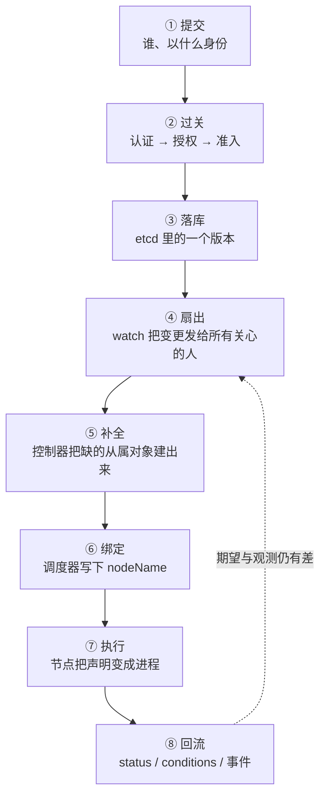

---
tags:
  - Kubernetes
  - 架构
  - 对象模型
  - 学习地图
created: 2026-09-24
---

# 核心架构与对象模型

## 知识地图

### 一条收敛链：一次声明从写入到收敛

这条主线跟随着**一条声明**：从"客户端把它提交上去"开始，到"系统把它变成事实、并把事实回报回来"，直到"它被修改、被删除、被替换"。

| #   | 环节  | 该环节解决的问题              | 到这里要能说清                               |
| --- | --- | --------------------- | ------------------------------------- |
| 1   | 提交  | 谁在提交、以什么身份            | 用户与服务账号的区别；`kubectl` 只是客户端            |
| 2   | 过关  | 一个写请求要经过几道关卡、各自失败是什么样 | 401 / 403 分别出现在哪一关，`403` 的两种来源（授权与准入）如何区分 |
| 3   | 落库  | 对象版本、乐观并发与冲突          | `resourceVersion` 的语义；`409` 从哪里来      |
| 4   | 扇出  | 变更如何到达所有关心它的组件        | watch 与缓存的代价；为什么不依赖"事件必达"             |
| 5   | 补全  | 谁把声明补成完整的对象集合         | 控制器的 level-triggered 循环；幂等的前提         |
| 6   | 绑定  | 一个决策为什么只写一个字段         | 调度器只写 `nodeName`；决策与执行的分工             |
| 7   | 执行  | 声明如何变成节点上的事实          | 与容器运行时那一层如何衔接                         |
| 8   | 回流  | 事实如何回到集群的观测态          | `status` / `conditions` / 事件三者的分工与保质期 |

### 五条横向关系

| 横向关系 | 贯穿内容 | 结论 |
| --- | --- | --- |
| 身份标识 | 请求身份 → 权限判定 → 字段归属 → 所有者与从属 → 审计记录 | "谁做的"与"谁拥有的"是两件事，两者都要能查证 |
| 版本 | 提交时携带的对象版本 → 并发控制用的对象版本 → 期望与观测的版本标记 | 任何"改不动、改丢了"的问题都从这条线起手 |
| 权限 | 认证 → 授权 → 准入 → 字段级所有权 | 各关卡逐层叠加，缺少一层不会报出同一种错误 |
| 观测 | `status` → `conditions` → 事件 → 审计 → 组件指标 | 几类证据的保质期与粒度都不同，不能互相替代 |
| 回收 | 级联删除 → finalizer → 命名空间终止 → 垃圾回收 | 删除不掉的对象，问题几乎总在 `metadata.finalizers[]` 与命名空间的终止等待上 |

## 术语速查

只收本章新引入的词。

| 名词 | 一句话解释 | 展开于 |
| --- | --- | --- |
| 声明式 API | 提交的是"最终应该是什么"，而不是"分几步做"；系统负责把实际状态调整到期望状态 | 原理：声明式 API 与对象模型 |
| 期望态 / 观测态 | 对象里 `spec`（要什么）与 `status`（现在是什么）两个分开的字段区 | 原理：声明式 API 与对象模型 |
| GVK | 组 / 版本 / 类别（Group / Version / Kind）三项，对象的类型标识 | 原理：声明式 API 与对象模型 |
| 作用域 | 对象属于某个命名空间，还是属于整个集群 | 原理：声明式 API 与对象模型 |
| 对象版本（`resourceVersion`） | 对象在存储里的版本号，用于乐观并发与增量同步 | 原理：声明式 API 与对象模型 |
| 字段归属（服务端应用） | 由服务端记录"每个字段由谁负责"，多个写入者可以共存 | 原理：元数据与所有权 |
| 所有者引用与级联删除 | 从属对象指向属主，删除属主时按策略处理从属对象 | 原理：元数据与所有权 |
| finalizer | 删除前的待办清单；清单没有清空，对象就不会真正消失 | 原理：元数据与所有权 |
| 关卡（认证 / 授权 / 准入） | 写请求依次通过的处理环节，各自有明确的失败语义 | 原理：一次写请求要过几关 |
| 准入钩子 | 在对象写入存储前后改写或拒绝它的外部组件 | 原理：一次写请求要过几关 |
| 期望与观测的版本标记 | `generation` 与 `status.observedGeneration` 这对字段 | 体系：一次声明从写入到收敛 |
| 条件（`conditions`） | 用一组带时间戳的布尔判断描述对象当前处于什么状态 | 体系：一次声明从写入到收敛 |
| 原因短语 | 事件中描述"阻塞在哪一步"的短句，是排障的分流依据 | 实操：对象、事件与控制面观测 |

### 关键字段的读法

| 看什么 | 是什么 | 单位 | 判据 | 与谁同看 | 看到它转向哪一步 |
| --- | --- | --- | --- | --- | --- |
| `resourceVersion` | 对象在存储中的版本 | 不透明字符串 | **只能比较"相同或不同"**，不能比较大小；更新时带上它，落后就返回 `409` | 冲突报错里的当前版本 | 出现 `409` → 说明有人先改过，重读之后再改 |
| `generation` | 期望态被改动的代数 | 整数 | 只有 `spec` 变化才会递增；`metadata` 与 `status` 的变化不影响它 | `status.observedGeneration` | 两者不等 → 控制器尚未处理到最新期望，不应先怀疑业务 |
| `status.observedGeneration` | 控制器实际处理到第几代 | 整数 | 等于 `generation` 才说明"控制器看过最新期望" | `conditions` 的 `lastTransitionTime` | 长期落后 → 去查控制器本身，而不是查对象 |
| `conditions[]` | 一组带时间戳的布尔判断 | 结构数组 | 看 `type` / `status` / `reason` / `lastTransitionTime` 四项；**时间戳只在状态翻转时更新** | 容器状态与事件时间线 | 时间戳很旧 → 状态确实稳定；刚变化 → 找同一时刻的事件 |
| `deletionTimestamp` | 删除请求的时间戳 | 时间 | 非空表示"已请求删除但尚未删掉" | finalizer 列表 | 非空且长时间不动 → 看还剩哪一个 finalizer |
| `finalizers[]` | 删除前必须完成的清理项 | 字符串数组 | 删除受阻时，问题就在这串条目里；**请求删除后不能再添加** | 负责它的控制器是否在运行 | 列表不变 → 控制器没有动作，不是 API 的问题 |
| `managedFields` | 每个写入者负责哪些字段 | 结构数组 | 冲突时看"这个字段归谁"；与最后一个写者是谁是两件事 | 报错里的冲突字段路径 | 冲突 → 要么让原主修改，要么显式接管 |
| `ownerReferences` | 从属对象指向属主 | 结构数组 | 决定"谁跟着谁销毁"；与 finalizer 是两件不同的事 | 级联删除策略 | 删除属主而从属仍在 → 看策略与属主身份 |
| 事件（Event） | 组件记录的、带时间戳的短消息 | 结构体，**默认保留期约 1 小时** | 它解释"为什么阻塞"，但不构成长期证据 | `conditions` 与容器状态 | 事件已过期而问题仍在 → 改用指标与日志，不要断言"没有发生过" |
| HTTP 状态码 | 请求被拒时返回的类别 | 整数 | `401` = 未通过认证；`403` = 通过认证但未被允许（含被策略拒绝）；`409` = 版本冲突；`422` = 对象不合法；`500` = 准入钩子调用失败（超时、连不上），不是策略判定 | 响应体里的原因文本 | 401 与 403 要分开处理；403 与 500 同样要分开，前者是策略判定，后者是钩子自身不可用 |

## 篇目索引

| # | 篇目 | 一句话 |
| --- | --- | --- |
| 01 | [[Kubernetes/02_核心架构与对象模型/01_原理_声明式API与对象模型\|原理：声明式 API 与对象模型]] | 期望态与观测态为什么必须分开；对象骨架里每个字段各管什么 |
| 02 | [[Kubernetes/02_核心架构与对象模型/02_原理_控制面各组件凭什么只做一件事\|原理：控制面各组件凭什么只做一件事]] | 唯一入口、唯一存储、只写一个字段的决策者、节点上的执行者与它的自治 |
| 03 | [[Kubernetes/02_核心架构与对象模型/03_原理_一次写请求要过几关\|原理：一次写请求要过几关]] | 关卡的顺序与失败语义；机制在这一侧，策略不在这一侧 |
| 04 | [[Kubernetes/02_核心架构与对象模型/04_原理_元数据与所有权\|原理：元数据与所有权]] | 标签与选择器、属主与从属的生死关系、finalizer 的待办、字段归属 |
| 05 | [[Kubernetes/02_核心架构与对象模型/05_体系_一次声明从写入到收敛\|体系：一次声明从写入到收敛]] | 八个环节走完，再收拢为身份标识、版本、权限、观测、回收五条横向关系 |
| 06 | [[Kubernetes/02_核心架构与对象模型/06_实操_对象、事件与控制面观测\|实操：对象、事件与控制面观测]] | 三类证据的分工、字段的五件事读法、集群基线卡与四类现场 |
| 07 | [[Kubernetes/02_核心架构与对象模型/07_判例_高频误判\|判例：高频误判]] | 十条四段式判例：把"创建成功""Ready""没有事件"这些信号读对 |
| — | 治理层（本章不写） | 本层负责上限配在哪一层、交付产物与领域接口；本章不设治理篇。 |
