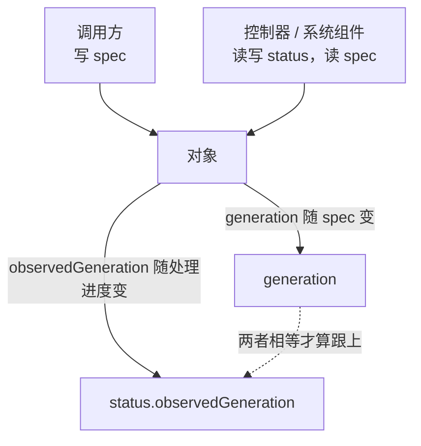

---
tags:
  - Kubernetes
  - API
  - 对象模型
  - 声明式
  - 原理
created: 2026-09-24
---

# 声明式 API 与对象模型

## 1. 命令式指令留下的三类问题

如果运维动作只有"调用方发送一串指令"这一种表达方式，而且每一步都必须成功、顺序必须正确，三类问题会同时出现：

| 问题 | 具体表现 |
| --- | --- |
| 状态漂移无人纠正 | 有人手工修改了一处、某个实例重启了、某台机器更换了磁盘。指令不会重放，实际状态与意图逐渐产生偏差 |
| 重试不安全 | 网络超时之后无法确认对方究竟执行与否，重试可能把同一件事做两遍（多建一个对象、多加一份配额） |
| 无法支持多人并发 | 两个人都依据"自己看到的当前状态"去修改，最后一个写入者的修改会在无意中覆盖前一个写入者的修改 |

声明式 API 把这三类问题一起替换掉：调用方提交的是**期望状态**，系统持续把实际状态向期望状态调整；同一份期望重复提交不产生额外效果；并发的正确性由"对象版本"这套机制保证，而不是依靠调用方互相协调。

代价也随之而来：**提交成功不等于已经生效**。这一点是后续所有排障工作的关键区分点——"创建成功"与"就绪"之间隔着一整条收敛链。

## 2. 期望态与观测态为什么必须分开

每个对象里有两个字段区，它们的所有者不同：

| 字段区 | 谁写 | 含义 | 判据 |
| --- | --- | --- | --- |
| `spec`（少数对象是 `data` 等） | 调用方 / 控制器 | 期望状态：要什么 | 修改它会使 `metadata.generation` 递增 |
| `status` | 系统组件 / 控制器 | 观测状态：现在是什么 | 用户提交的 `status` 会被忽略 |

分开带来的直接后果有两条：

1. **"我提交的值被忽略了"通常不是缺陷。** `status` 不归调用方写；`metadata.uid`、`metadata.resourceVersion`、`creationTimestamp` 这类字段同样由系统填写。要修改期望，就修改 `spec`。
2. **判定"控制器跟上没有"有现成的字段对**：`metadata.generation` 与 `status.observedGeneration`。两者相等说明控制器已经处理过最新期望；长期不等则问题在控制器这一侧，而不是在对象本身。

## 3. 所有对象是同一套骨架

| 字段                               | 含义                | 现场要点                                              |
| -------------------------------- | ----------------- | ------------------------------------------------- |
| `apiVersion` + `kind`            | 类型标识（组 / 版本 / 类别） | 同一个类别的不同版本可以同时存在，写哪个版本决定提交时按哪一套规则校验               |
| `metadata.name` / `generateName` | 名字，或名字前缀          | 名字在命名空间内唯一（集群级对象在全集群唯一）；`generateName` 由服务端补上随机后缀 |
| `metadata.namespace`             | 所属命名空间            | **作用域**由此决定：命名空间级对象不属于任何别的命名空间；集群级对象不属于任何命名空间     |
| `metadata.uid`                   | 系统分配的唯一标识         | 重建同名对象会得到新的 `uid`——判断"是不是同一个对象"要看它，而不是看名字         |
| `metadata.labels`                | 用于选择对象的键值对        | 是**选择器**的依据；修改它会改变对象与服务的关联关系                      |
| `metadata.annotations`           | 非标识性元数据           | 不参与选择；工具与控制器常把状态、来源与说明放在这里                        |
| `metadata.resourceVersion`       | 存储中的版本            | 不透明：不能比较大小，只能比较"相同或不同"；更新时带上它以实现乐观并发              |
| `metadata.generation`            | 期望态的代数            | 只在期望态变化时递增                                        |
| `metadata.ownerReferences`       | 属主引用              | 决定级联关系                                            |
| `metadata.finalizers`            | 删除前的待办事项          | 决定删除是否会被阻塞                                        |
| `metadata.deletionTimestamp`     | 删除请求时间            | 非空即表示"删除请求中"                                      |
| `spec`                           | 期望状态              | 少数对象没有它                                           |
| `status`                         | 观测状态              | 由系统写入                                             |

**作用域的三条判据**：命名空间级对象（工作负载、Service、配置、PVC 等）在命名空间内唯一，并受配额与策略约束；集群级对象（节点、命名空间本身、存储类、集群角色、持久卷等）不受命名空间限定；把集群级对象归入"某个命名空间"的任何说法都是错误的，它属于整个集群。

## 4. 并发写入靠对象版本解决

多个写入者同时修改同一个对象是常态：人在修改期望、控制器在写观测、自动伸缩在修改副本数、别的控制器在补注解。这套系统不依靠加锁，而依靠两项机制：

| 机制 | 作用 | 判据 |
| --- | --- | --- |
| 乐观并发 | 更新请求带上读到的版本；版本已变化则拒绝 | 返回 `409`（冲突），而不是静默覆盖 |
| 字段归属 | 服务端记录每个字段由谁负责，多个写入者各管一片 | 冲突只报"你修改的字段归别人"，而不是整个对象 |

`409` 的正确处理是**重读、重算、重提**，而不是重试同一个请求体。这也是"用脚本批量修改对象"经常失败的原因：脚本拿到的是旧版本，改到一半时别人已经修改过。

需要提前记住的一条边界是：`resourceVersion` 是**不透明**的。它当前使用一个单调递增的数字，但这一性质并不属于它的契约；任何"用版本号排序或判断新旧"的做法都不可靠。在并发控制中，它的正确用法只有等值比较：更新时带上读到的版本，版本不一致就返回 `409`。与此同时，`get` 与 `list` / `watch` 上的 `resourceVersion` 另有两类语义——"不早于"与"精确匹配"，由请求参数 `resourceVersionMatch` 的取值（`NotOlderThan` / `Exact`）决定，这与并发控制使用的等值比较不是同一件事。

## 5. 抽象模型的适用边界

1. **提交成功不代表生效。** 写入存储成功只是收敛链的起点。判断"生效"要看观测态，而不是看提交的返回码。
2. **期望态与观测态不是同一份数据。** 把 `status` 当作配置来读，或试图直接修改 `status`，都会得到"看起来没有生效"的困惑。
3. **同名不等于同一个对象。** 删除重建之后 `uid` 已经改变，引用了旧 `uid` 的东西全部失效。
4. **版本号不是新旧标尺。** 它是并发控制使用的令牌，在并发控制中只做等值比较，不用来比较大小。
5. **对象模型给的是骨架，不保证语义。** 自定义资源同样可以有 `spec` 与 `status`，但"这两个字段区应当如何使用"要靠编写它的人遵守约定；约定没有被遵守时，控制器就可能与调用方争抢同一个字段。
6. **声明式不消灭顺序。** 它消灭的是"调用方必须记住顺序"；对象之间仍然存在依赖，只是这些依赖由控制器而不是由人来保证。

## 常见误解

| 常见说法                     | 事实                                                  |
| ------------------------ | --------------------------------------------------- |
| 「命令返回成功，服务就该起来了」         | 写入存储成功只说明声明被接受；运行状态由后续组件异步收敛                        |
| 「对象是同名的，就是同一个」           | 删除再建会更换 `uid`；判断是否为同一对象要看 `uid`                     |
| 「`resourceVersion` 越大越新」 | 它是不透明令牌，只做等值比较                                      |
| 「`status` 里不对，我去改一下」     | `status` 由系统写入，用户提交会被忽略；要修改的是期望态                    |
| 「控制器没跟上是因为对象写错了」         | 先比较 `generation` 与 `observedGeneration`；不相等就是控制器侧的事 |
| 「集群级对象也能用命名空间隔离」         | 集群级对象不属于命名空间，配额与命名空间策略约束不到它                         |
| 「声明式就一定会自愈」              | 自愈（控制器持续把实际状态调整到期望状态）的前提是有控制器在管理这个对象；没有控制器的对象只能靠人   |

## 要点自测

**问：声明式 API 一次解决了命令式的哪三类问题？**

答：状态漂移、重试不安全与无法支持并发。期望状态可以被反复提交而不产生额外效果；系统持续纠正漂移；并发写入依靠对象版本而不是依靠调用方协调。

**问：`spec` 与 `status` 分开，给排障带来的直接好处是什么？**

答：它把"我要什么"与"现在是什么"分成两份数据，因此可以判定"控制器跟上没有"，判据是比较 `metadata.generation` 与 `status.observedGeneration`。它同时也解释了一类常见困惑：用户写 `status` 不会生效，因为那一片区域不归调用方。

**问：收到 `409 Conflict` 时，正确动作是什么？**

答：重读对象、在当前版本上重算要修改的字段、再提交。直接重试原请求会一直冲突；而为了绕过冲突去"覆盖整个对象"，则会连带覆盖别人的修改。

**问：集群级对象与命名空间级对象的判据是什么，为什么这个区分重要？**

答：判据是看它是否属于某个命名空间。命名空间级对象受配额、命名空间策略与权限边界约束；集群级对象不受这些约束，因此给业务方"在某个命名空间里的管理员"权限时，要确认他能否触及集群级对象。

**问：为什么"删掉再重建同名对象"会引发一批难以解释的故障？**

答：因为 `uid` 发生了改变。任何按 `uid` 记录的引用（所有者引用、外部系统的映射、审计中的标识）都指向旧对象；当 `ownerReferences` 指向不存在的 `uid` 时，从属对象会被垃圾回收处理掉。

**第一反应不要做什么**：不要把"提交成功"当成"已经生效"；不要去修改 `status`；不要用 `resourceVersion` 比较大小；不要在收到 `409` 时重试原请求体；也不要把"同名"当成"同一个对象"。

## 参考文档

- Kubernetes 官方文档的 API 概念章节：对象、字段约定、`spec` 与 `status` 的分工、对象元数据的含义。
- 官方文档与上游 API 约定文档中关于 `resourceVersion` 语义的说明：并发控制、增量同步、`resourceVersionMatch` 的取值。
- 官方文档中关于对象命名与作用域的说明：命名空间级与集群级对象的清单与命名唯一性规则。
- 上游 API 机器可读接口（OpenAPI）与各版本的 API 参考：字段的确切类型与版本门控。
- 本库的版本口径见 `Kubernetes/写作规约.md`；具体的默认值与字段取值以**现场生效配置与对象的实际返回**为准。
