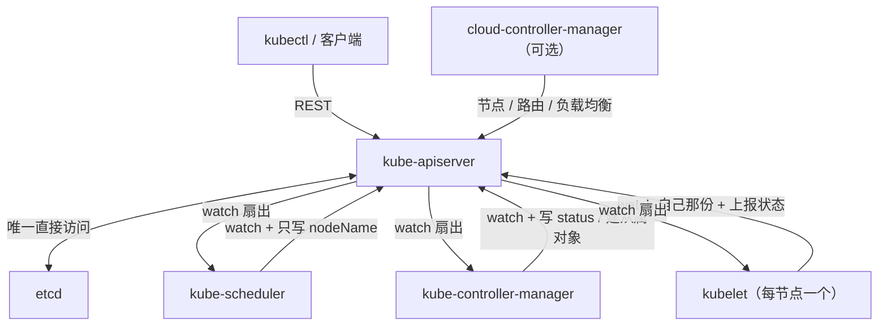

---
tags:
  - Kubernetes
  - 控制面
  - 组件
  - etcd
  - watch
  - 原理
created: 2026-09-24
---

# 控制面各组件凭什么只做一件事

## 1. 一个程序同时承担存储、决策与执行，会撞上什么

把存储状态、做出决策与在节点上启动容器这三项职责交给同一个常驻程序，三类问题会同时出现：

| 问题 | 具体表现 |
| --- | --- |
| 无法做无状态伸缩 | 客户端连接的是"那一个"程序；该程序一旦故障，整个集群的读写会一起停止 |
| 决策被节点故障阻塞 | 一个节点失联会使负责决策的那个循环阻塞，其他操作随之排队 |
| 无法替换任何一层 | 更换网络实现、更换存储实现或更换隔离运行时，都必须修改这个程序 |

这套系统的做法是把职责拆成四类，每一类只做一件事，各类之间只通过 API 通信：

| 角色 | 只做 | 绝不做 |
| --- | --- | --- |
| `kube-apiserver` | 接收请求、执行关卡检查、读写存储、把变更广播出去 | 不做决策，也不接触容器 |
| `etcd` | 一致地保存对象 | 不理解对象的语义，并且只被一个组件直接访问 |
| `kube-scheduler` | 为一个尚未绑定节点的 Pod 选择节点，并**只写一个字段** | 不启动容器，也不关心节点上发生了什么 |
| `kube-controller-manager` | 运行一批调谐循环，把实际状态推向期望状态 | 不做准入，也不直接操作节点 |
| `kubelet` | 在**本节点**上把分配来的声明变成事实，并把结果回报 | 不做全局决策，也不关心其他节点 |
| `kube-proxy` 与容器网络接口（Container Network Interface，CNI）、容器存储接口（Container Storage Interface，CSI）等插件 | 各自实现一类数据面能力 | 不修改期望状态 |

## 2. 唯一入口与唯一存储

**`kube-apiserver` 是唯一的读写入口，也是唯一直接访问存储的组件。** 这两项性质各自带来一系列后果：

| 性质 | 后果 | 现场判据 |
| --- | --- | --- |
| 无状态、可水平扩展 | 其前方需要负载均衡，而多个副本之间不需要互相协调 | 客户端应当指向负载均衡地址，而不是指向某一个实例 |
| 所有组件都通过它通信 | 任何组件之间的不一致，都可以从"该组件所看到的对象"开始查起 | 各组件的日志中都记录了它自己那一份视角 |
| 它是唯一能直接读存储的 | 绕过它去修改存储，等于绕过全部关卡，会直接损坏集群 | 除了运维的备份与恢复操作，不应存在任何直接操作存储的动作 |
| 它承担全部请求压力 | 需要并发限流与优先级机制，否则单个客户端就可能耗尽入口组件的处理能力 | 请求排队与超时的指标，以及 `FlowSchema` 与 `PriorityLevelConfiguration` 这两类资源对象的配置 |
| 审计在它内部 | 审计记录回答的是"谁通过入口做了什么" | 审计日志中可以看到对象与动作，但看不到组件内部的细节 |

**并发限流**值得单独记住：入口侧有一套**优先级与公平性**机制，它由 `FlowSchema` 与 `PriorityLevelConfiguration` 两类资源对象表达，把请求划分到不同优先级并限制并发，以避免少数客户端占用全部处理能力。这套机制解释了两种现象：一是集群整体并未故障，但某些请求会超时，原因是低优先级请求被限流；二是某些内置组件（例如控制器与节点）在压力下仍能工作，原因是它们使用受保护的高优先级。判据位于入口组件的请求排队与限流指标中，而不在业务对象的字段里。

**`etcd` 是唯一被直接访问的存储**，它的一致性由共识算法保证：

| 概念 | 事实 | 判据 |
| --- | --- | --- |
| 多数派 | 提交写入与选出主节点都需要超过半数的节点同意 | 3 个节点可以容忍 1 个故障；4 个节点与 3 个节点一样只容忍 1 个故障，却多出一个故障面，因此生产环境使用奇数个节点 |
| 日志先行 | 写入先落日志、再修改状态，因此崩溃后可以恢复到一致点 | 关注提交延迟与落盘耗时 |
| 快照与压缩 | 历史版本会不断增长，因此需要压缩与碎片整理 | 存储体积以及压缩的执行情况 |
| 存储配额 | 超过配额会触发空间告警，并进入**只读**状态，此时写入会被拒绝 | 告警出现之后，必须清理键空间并整理碎片，才能恢复写入 |

**一条必须明确的边界：多副本不等于备份。** 副本解决的是节点故障；误删与逻辑损坏会通过共识被原样复制到所有副本，因此删除一个键之后，所有副本会同时失去这个键。所以快照必须存放在存储集群之外；同时，由于快照中包含全部敏感数据，它必须加密存放。恢复演练应当在非生产环境中真正执行过一次。

## 3. 决策者只写一个字段

调度器的工作可以用一句话概括：**为一个尚未绑定节点的 Pod 选择一个节点，然后只写 `spec.nodeName`。** 它不做的那些事同样重要：它不启动容器，不准备网络，也不通知节点，因为节点自己在观察。

这一性质解释了三类高频现象：

| 现象 | 原因 |
| --- | --- |
| Pod 已绑定但长时间不运行 | 绑定完成的那一刻，调度器的工作就已经结束，后面属于节点侧的工作 |
| 节点资源充足却调度不上去 | 调度依据的是它自己那份缓存中的对象与资源账目，这与节点上"此刻真正空闲多少"不是同一份数据 |
| 抢占之后仍起不来 | 抢占只是把被抢占者标记出来，真正让出资源还需要时间 |

**调度器持有的是一份缓存，而不是实时的机器状态。** 它通过 watch 维护本地副本，并依据这份副本打分，因此缓存滞后会使决策建立在稍旧的事实之上。这不是缺陷，而是"决策与观测分离"的必然代价；补偿这一代价的方式是让决策可重入：条件变化之后，尚未被满足的 Pod 会回到待调度队列，重新经历一遍调度流程。

## 4. 调谐循环与"只关心现在"

控制器管理组件在一个进程中运行着一批控制器（副本、端点、节点、服务账号令牌等）。这些控制器共享同一种工作方式：

1. **观察**：列出对象并持续接收对象变更，同时维护本地缓存；
2. **比较**：把期望状态与实际状态进行对比，算出还缺少什么；
3. **动作**：创建、更新或删除从属对象；
4. **重复**：回到第 1 步。

这种方式叫**电平触发（level-triggered）**：控制器关心的是"当前状态是否符合期望"，而不是"我收到了哪一个变更事件"。因此：

| 推论 | 说明 |
| --- | --- |
| 事件丢失不会导致永久错误 | 下一轮的观察会重新发现差异 |
| 事件重复不会导致错误 | 前提是动作是幂等的，也就是"确保存在"而不是"创建一次" |
| 控制器必须是可重入的 | 同一个对象被处理两遍时，不能产生两倍的效果 |
| 处理的粒度是对象 | 缓存中保存的是对象快照，而不是操作日志 |

**代价**：控制器必须维护缓存，因此缓存与存储之间必然存在延迟；同时控制器重启之后需要重新列出全部对象，而在大集群中，这一步本身就是压力来源。

## 5. 节点侧的执行者与它的自治

`kubelet` 是每台节点上唯一的执行者，它的行为有三条性质值得记住：

| 性质 | 含义 | 现场表现 |
| --- | --- | --- |
| 只认自己那一份 | 它只关心分配给本节点的对象 | 集群中"这个 Pod 为什么在这台机器上"的答案位于绑定字段里，而不在节点上 |
| 心跳有两条路径 | 它既更新节点对象的观测态（节点对象的 `.status`），也更新 `kube-node-lease` 命名空间下与本节点同名的租约对象（`coordination.k8s.io/v1` 的 `Lease`） | 租约对象的 `spec.renewTime` 是否在按周期推进，是判断"节点是否还活着"的主路径；节点观测态滞后并不意味着节点已经故障 |
| 不完全依赖入口组件 | 入口组件短时间不可用时，节点上既有的容器会继续运行，它按本地已有的声明继续工作 | 控制面维护期间业务不会中断，但新的创建与变更请求会失败 |

节点长期不可用时应当如何处理，这不是本篇负责的内容；这里只需要记住**节点侧的判断与集群侧的判断是两份**：当集群侧认为节点"不可达"时，节点上可能只是网络出现问题，而容器仍在提供服务。

## 6. 变更怎么到达所有关心它的人

**入口组件不推送，而由接收方自己订阅。** 每个组件都做同一件事：先完整列出一次，然后订阅后续变更（list + watch）。这样即使错过若干事件，组件也能通过全量结果重新对齐。

| 环节 | 作用 | 代价 |
| --- | --- | --- |
| watch 缓存 | 入口组件内部保留近期变更，使订阅者不必每次都回源查询 | 占用内存；缓存失效时需要回源重新列出 |
| 本地缓存 | 接收方维护属于自己的那一份对象副本 | 与存储之间存在时间差；大集群的首次同步负担很重 |
| 周期性重同步 | 即使没有发生变更，也定期重放一遍，以纠正缓存的漂移 | 额外的处理开销 |
| 断线重连 | 连接断开之后，从上次的位置继续订阅；位置一旦过期，则回退到全量 | 回退到全量会造成一次尖峰 |

由此得到三条现场判据：

- **"组件看到的"与"存储里的"可以不一致，而且这种不一致是允许的。** 对于任何"为什么它没有反应"的问题，都应当先确认它是否已经同步到最新版本（很多对象都会记录自己看到的是第几代）。
- **大规模变更会产生扇出压力。** 一次批量改动会让所有订阅者同时处理；因此入口组件与各组件的缓存规模是集群容量的组成部分。
- **不能把事件当作日志。** 事件是短消息并且有保留期，长期证据必须依靠指标与日志。

## 7. 抽象模型的适用边界

1. **"集群状态"没有单一的真相来源。** 存储中的内容是权威，但每个组件都持有自己的缓存，因此一致性是"最终"的。
2. **控制面不可用不等于业务中断。** 节点上已有的容器会继续运行；受到影响的是新的操作与状态回流。
3. **各组件的作用域不同。** 入口与存储是全局的；调度与调谐虽然做出全局决策，但通过对象表达；节点执行则是本地的。若把三者混在一起讨论，就会出现"为什么节点不自己做出决定"这类问题。
4. **决策的输入是缓存，而不是实时量。** 调度与伸缩都建立在这份缓存之上，滞后是设计的一部分。
5. **多副本与备份解决的不是同一个问题。** 副本保证可用性，备份保证可恢复性。
6. **入口组件是所有能力的必经通道。** 它的限流、超时与优先级配置直接决定了压力下的行为。

## 常见误解

| 常见说法 | 事实 |
| --- | --- |
| 「调度器把容器启动了」 | 它只写一个绑定字段；启动容器是节点侧的工作 |
| 「节点资源空着就该调度上去」 | 调度基于自己那份缓存中的账目，可能与节点此刻的真实占用不同 |
| 「组件没反应就是坏了」 | 应当先看它同步到哪个版本；缓存滞后是常态 |
| 「控制面挂了业务就挂了」 | 已有的容器会继续运行；受影响的是创建、变更与状态回流 |
| 「多副本存了就不会丢」 | 误删与损坏会同步到所有副本；只有集群之外的快照才能恢复 |
| 「入口组件重启会丢状态」 | 它是无状态的；权威状态位于存储中，重连之后重新同步 |
| 「谁都能直接读存储来查快一点」 | 只有入口组件直接访问存储；绕过它等于绕过全部关卡 |

## 要点自测

**问：为什么调度器只写一个字段，这件事有什么实际意义？**

答：它把"决策"与"执行"彻底分开。绑定完成的那一刻，调度器的工作就已经结束，后面是节点侧的准备与启动。因此"已绑定但不运行"属于调度之后的问题，排查方向应当转到节点侧；反之，"一直没绑定"才属于调度的范畴。

**问：为什么组件看到的状态可能与存储不一致，而系统仍然正确？**

答：因为组件都通过"先全量、再订阅"的方式维护自己的缓存，并且控制器是电平触发的：它依据当前状态是否符合期望来决定动作，而不是依据收到了哪一个事件。因此滞后会带来延迟，但不会带来越积越多的错误。

**问：`etcd` 用 3 个节点和 4 个节点，容错能力一样吗？**

答：一样，两者都只能容忍 1 个节点故障，因为提交写入需要超过半数的节点同意。4 个节点还多出一个故障面，却不提高可用性，所以生产环境使用奇数个节点。若需要更高的容错能力，则使用 5 个节点。

**问：为什么"多副本"不能代替"备份"？**

答：副本抵御的是节点级故障；误删与逻辑损坏会被共识原样复制到所有副本。若要求能够恢复，就必须有存放在存储集群之外并且加密的快照，并且确实演练过一次恢复。

**问：入口组件的限流与优先级，能解释哪两类现象？**

答：一是集群整体并未故障，但某些请求超时或被拒绝，原因是低优先级请求被限流；二是压力之下内置组件仍能工作，原因是它们使用受保护的高优先级。排查时应当查看入口组件的排队与限流指标，而不是先怀疑业务对象。

**第一反应不要做什么**：不要绕过入口组件去直接操作存储；不要把"已绑定"当成"马上会运行"；不要依据"组件没有反应"直接判定故障，而应先确认它同步到哪个版本；不要把控制面短时间不可用当成业务中断事故；也不要把"有多副本"当成"有备份"。

## 参考文档

- Kubernetes 官方文档的集群架构章节：控制面与节点组件的职责、组件之间的通信方式、节点心跳与租约。
- 官方文档的 API 优先级与公平性、请求限流章节：优先级类别、并发限制与受保护的组件。
- 上游共识存储的官方文档：多数派与容错计算、日志与快照、压缩与碎片整理、存储配额与空间告警的处置。
- `kube-scheduler` 与 `kube-controller-manager` 的命令行与配置参考：调度流程的阶段划分、控制器清单、各自可调的参数。
- `kubelet` 的配置参考：心跳与状态上报相关的参数；**默认值随版本变化**，一律按现场生效配置取。
- 本库的版本口径见 `Kubernetes/写作规约.md`。
