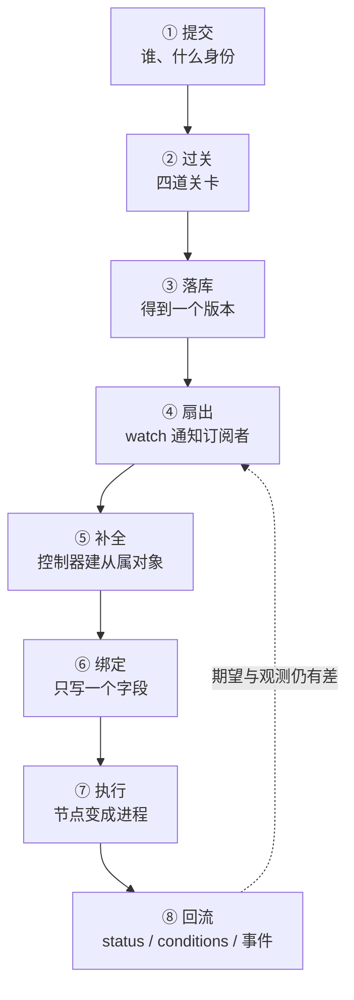

---
tags:
  - Kubernetes
  - 收敛
  - 对象模型
  - 体系
created: 2026-09-24
---

# 一次声明从写入到收敛

## 1. 一条声明经过的八个环节

把"我提交了一份 YAML"到"声明在集群中真正运行起来"之间发生的事拆开，会看到八个环节。每个环节的负责人不同，失败时留下的现场也不同：

| # | 环节 | 谁执行动作 | 留下的痕迹 | 失败的现场 |
| --- | --- | --- | --- | --- |
| 1 | 提交 | 客户端 | 请求日志、审计记录 | 问题出在客户端侧，涉及凭证、地址与格式 |
| 2 | 过关 | 入口组件 | 状态码与响应体中的原因 | `401` / `403` / `422` 分别指向不同的关卡 |
| 3 | 落库 | 入口组件与存储 | 对象与它的版本号 | 返回 `409`，说明发生了版本冲突 |
| 4 | 扇出 | 入口组件 | 各组件的缓存被更新 | 组件没有同步到最新版本 |
| 5 | 补全 | 控制器 | 从属对象被建出来，并被加上所有者引用 | 从属对象缺失，或者已经建出却报错 |
| 6 | 绑定 | 调度器 | 对象上多了一个节点字段 | 该字段一直为空，属于调度范畴 |
| 7 | 执行 | 节点 | 节点侧出现真实的容器与网络 | 已经绑定却不运行，属于节点范畴 |
| 8 | 回流 | 节点与控制器 | 观测态、条件、事件 | 观测态长期不更新，问题在回报链路或执行侧 |

**这条链的关键性质**在于它是**闭环**的。第 8 个环节的产出会成为第 4 个环节扇出的输入，因此控制器能够持续纠正漂移，这就是"自愈"的全部机制来源。同一条性质也说明：**任何一个环节中断，后面的环节都不会自行恢复**；停在某个环节的现场，就是排查的入口。

## 2. 八个环节各自的现场口径

**① 提交**：客户端只是客户端。它能带上的身份、它指向的地址以及它提交的格式，共同决定这个环节会不会失败。集群里的一切都以入口组件收到的请求为准，因此"我本地文件没错"不构成证据。

**② 过关**：四道关卡依次是认证、授权、变更准入、校验与校验准入。**这个环节最容易被误判**：`403` 既可能是权限不够，也可能是被策略拒绝；判据在响应体的原因文本里，不在状态码里。

**③ 落库**：成功的标志是对象有了一个版本号，而不是对象已经运行。写入可能出现的失败是版本冲突，其含义是在本次读取之后，有人先修改了同一字段。

**④ 扇出**：入口组件不推送，由订阅者自己"先全量、再订阅"。这个环节的失败是**静默的**：它没有报错，只是某个组件看到的还是旧版本。判断"组件跟上没有"的通用手段，是看对象上"处理到第几代"这类标记。

**⑤ 补全**：控制器按需创建从属对象，并给它们写上所有者引用。这个环节的典型故障是从属对象建不出来（配额、策略、命名冲突），或者建了出来但被别的机制删掉，表现为"对象一直在，但它需要的那些对象时有时无"。

**⑥ 绑定**：这个环节的产物只有一个字段。绑定之后，调度器的职责就结束了；因此后续任何问题都不该再回到调度视角。

**⑦ 执行**：节点把声明变成事实。这个环节的下钻属于容器与运行时那一层（制品怎么落地、沙箱怎么建立、容器怎么创建）；这里只需要记住**它与集群侧的观察是两份数据**。

**⑧ 回流**：节点与控制器把观测写入对象，并产生条件与事件。三类痕迹的分工与保质期不同：

| 痕迹 | 内容 | 保质期 | 用途 |
| --- | --- | --- | --- |
| 观测态字段 | 系统看到的状态（阶段、容器状态） | 随对象一起 | 判断当前处于什么状态 |
| 条件 | 一组带时间戳的布尔判断 | 随对象一起 | 判断"某一方面是否就绪"以及它何时翻转 |
| 事件 | 组件记录的短消息 | **默认约 1 小时** | 解释"为什么阻塞"；不能作为长期证据 |

## 3. 五条横向关系

### 身份标识

| 环节 | 谁的身份 |
| --- | --- |
| ① | 请求身份：用户或服务账号 |
| ③ | 对象身份：名字与唯一标识（删除重建会更换标识） |
| ⑤ | 所有关系：所有者引用把从属对象挂到属主上 |
| ⑥⑦ | 节点身份与节点上的实际对象 |
| 记录 | 审计里记录的"谁做的"与对象上的"谁拥有的"是两件事 |

**结论**：任何"这是同一个吗"的问题，都要先说明比较的是哪一种身份。

### 版本

| 环节 | 版本的含义 |
| --- | --- |
| ① | 提交时选择 API 版本，决定按哪一套约定校验 |
| ③ | 对象版本：并发控制使用的令牌 |
| ⑤⑧ | 期望代数与"控制器处理到第几代"这一对标记 |
| 长期 | API 版本的生命周期：引入 → 转正 → 弃用 → 默认关闭 → 移除 |

**结论**："升级后行为变了"从这条关系起手：先看 API 版本处于哪一段，再看对象版本与期望代数。

### 权限

| 环节 | 权限在哪一层 |
| --- | --- |
| ① | 凭证从哪来（用户凭证或服务账号令牌） |
| ② | 授权判定（允许做什么动作、作用在什么范围） |
| ② | 准入判定（对象允许长什么样） |
| ⑤ | 字段归属（这个字段归谁写） |

**结论**：四层是叠加的，缺少一层不会报出同一种错误；排查"为什么不让做"要逐层确认，而不是笼统地"加权限"。

### 观测

| 环节 | 证据 |
| --- | --- |
| ② | 响应码与原因 |
| ⑤⑥⑦⑧ | 事件的原因短语 |
| ⑧ | 观测态与条件 |
| 全局 | 组件指标与审计 |

**结论**：四种证据的粒度与保质期不同，不能互相替代；尤其是事件会过期，长期判断要靠指标与对象自身的字段。

### 回收

| 环节 | 什么在阻止对象消失 |
| --- | --- |
| ⑤ | 所有者引用决定从属对象跟着谁销毁 |
| 删除 | finalizer 决定"还有什么没有做完" |
| 命名空间 | 它的终止是在等待里面的对象全部清完 |
| 集群级 | 集群级对象不属于命名空间，删除时不受命名空间的等待影响 |

**结论**：对象删不掉的答案，几乎总在于"还有谁没有放手"。

## 4. 关键字段的完整读法

| 看什么 | 是什么 | 单位 | 判据 | 与谁同看 | 看到它转向哪一步 |
| --- | --- | --- | --- | --- | --- |
| `metadata.uid` | 对象的唯一身份 | 字符串 | 同名而标识不同，即为不同对象 | 引用它的所有者引用 | 标识变了 → 旧的引用全部失效 |
| `metadata.resourceVersion` | 并发控制令牌 | 不透明字符串 | 只能比较相同或不同；落后即冲突 | 报错里的当前版本 | 出现冲突 → 重读、重算、重提 |
| `metadata.generation` | 期望态代数 | 整数 | 只有期望态变化才递增 | `status.observedGeneration` | 两者不等 → 控制器还没有跟上 |
| `status.observedGeneration` | 控制器处理到的代数 | 整数 | 等于期望代数才叫跟上 | 条件的时间戳 | 长期落后 → 查控制器，不查业务 |
| `conditions[]` | 带时间戳的布尔判断 | 结构数组 | 看类型、状态、原因、翻转时间四项 | 事件时间线 | 翻转时间很旧 → 状态稳定；刚刚变化 → 找同一时刻的事件 |
| `status.phase` 类字段 | 高层概括 | 枚举 | 它只是概括，并非完整状态机 | 容器状态与条件 | 与条件矛盾 → 以更细的字段与事件为准 |
| 容器状态 | 单个容器的等待/运行/终止 | 结构体 | 带原因与退出信息 | 上一次运行的日志、事件 | 反复重启 → 先取原因 |
| `metadata.deletionTimestamp` | 删除请求时间 | 时间 | 非空表示已请求删除但未完成 | finalizer 列表 | 长时间不动 → 看还剩哪个 finalizer |
| `metadata.finalizers[]` | 删除前的待办 | 字符串数组 | 列表非空就删不掉 | 负责它的控制器是否在运行 | 列表不变 → 控制器没有执行动作 |
| `metadata.ownerReferences[]` | 属主引用 | 结构数组 | 决定级联；不能跨命名空间 | 级联策略 | 属主没了而从属还在 → 看策略与引用是否失效 |
| `managedFields` | 字段归属 | 结构数组 | 冲突时报出的是"这个字段归谁" | 审计记录 | 值在两边跳动 → 职责边界要重划 |
| 事件 | 短消息 | 结构体，**默认约 1 小时** | 解释"为什么阻塞"，不作为长期证据 | 条件与观测态 | 事件过期而问题还在 → 换用指标与日志 |
| 节点字段 | 绑定结果 | 字符串 | 为空表示尚未绑定（调度范畴） | 节点侧的实际状态 | 非空而不运行 → 转节点侧 |

## 5. 任务卡：八个环节在现场的应用

现场最常见的问法是"我改了一份声明，为什么没有生效"。可以把它整理成一张任务卡：

| 要回答的 | 在哪个环节取数 | 取什么 |
| --- | --- | --- |
| 我的声明是否已经写入 | ②③ | 状态码与响应体；对象是否存在、版本是否更新 |
| 系统看到我的最新期望了吗 | ④⑤ | 期望代数与"处理到第几代"是否相等 |
| 它需要的其它对象完整了吗 | ⑤ | 从属对象是否存在、所有者引用是否正常 |
| 该放到哪台机器、是否已经放上 | ⑥ | 节点字段是否为空 |
| 机器上是否真的运行起来了 | ⑦ | 节点侧的实际对象（这一步要换视角取证） |
| 系统认为它现在是什么状态 | ⑧ | 观测态、条件与最近的事件 |
| 出事时谁修改过它 | 全局 | 审计记录与字段归属 |

七个问题都落在具体字段上；其中任何一个答不出数，就说明还没有取到证据。

## 6. 常见坑

| 常见做法或说法 | 后果或事实 |
| --- | --- |
| 用提交成功的返回码判断"已生效" | 那只是第 3 个环节；后面五个环节都可能失败 |
| 用客户端的显示值写告警规则 | 显示值是为了方便阅读而拼出来的，不是字段；自动化要读字段 |
| 把事件当作长期证据 | 事件默认只保留约 1 小时；过期之后"没有看到事件"不等于"没有发生过" |
| 只看状态码，不看原因文本 | `403` 的原因可能是权限，也可能是策略，方向完全不同 |
| 无法修改对象时整体覆盖 | 会覆盖其他写入者的字段；冲突本身是一种保护机制 |
| 为解除阻塞手工删 finalizer | 跳过了清理逻辑，外部资源残留 |
| 在集群侧判断"机器上还剩什么" | 集群侧给出的是结论，节点侧才是事实 |

## 7. 要点自测

**问：这条链为什么是闭环，闭环带来什么？**

答：第 8 个环节写回的观测态会成为第 4 个环节扇出的新输入，因此控制器能够不断把实际状态推向期望状态。自愈能力就来自这个环；反之，任何一个环节断开，后面的环节都不会自行恢复。

**问："改了声明但没生效"，最短的定位路径是什么？**

答：先确认对象是否已经更新（第 3 个环节），再比较期望代数与处理代数（第 4、5 个环节），然后看从属对象是否完整（第 5 个环节），再看绑定字段（第 6 个环节），最后换到节点视角查看实际状态（第 7 个环节）。每一步的判据都是一个具体字段，不需要猜测。

**问：条件与事件的分工是什么？**

答：条件描述"某一方面现在是否就绪"以及它何时翻转，并随对象长期存在；事件解释"为什么阻塞"，但默认只保留约 1 小时。前者用于判断状态，后者用于定位原因，两者都不能互相替代彼此的用途。

**问：为什么"节点字段非空但不运行"必须换视角？**

答：因为绑定之后调度器的职责已经结束，剩下的事情发生在节点上。集群侧只能看到节点上报的结论；要回答"机器上到底发生了什么"，必须到节点侧取证，这与集群侧的对象观测是两份数据。

**问：五条横向关系里，哪一条专门回答"升级后为什么行为变了"？**

答：版本这一条横向关系。它把 API 版本的生命周期、对象版本与期望代数串联在一起：先看使用的 API 版本处于哪一段，再看控制器是否已经处理到最新期望。

**第一反应不要做什么**：不要用返回码代替观测态；不要用显示值写自动化；不要把事件当作长期证据；不要在收到冲突时整体覆盖；不要为了解除阻塞而跳过清理；也不要在集群侧回答节点侧的问题。

## 参考文档

- Kubernetes 官方文档中关于对象、控制器、调度与节点生命周期、Pod 生命周期的章节：各环节的语义与职责划分。
- 官方文档的准入控制、认证授权与审计章节：第 2 个环节的关卡与记录。
- 官方文档关于条件与事件、字段管理、垃圾回收的说明：第 8 个环节三类痕迹的语义与保留策略。
- 上游 API 约定与版本政策文档：API 版本生命周期的阶段划分。
- 本库的版本口径见 `Kubernetes/写作规约.md`；事件保留期、默认策略与阈值以**现场生效配置**为准。

