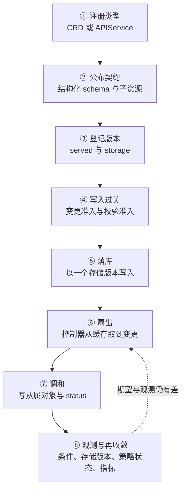

---
tags:
  - Kubernetes
  - 扩展
  - API治理
  - 学习地图
created: 2026-09-25
---

# 扩展机制与 API 治理

## 知识地图

### 一条收敛链：一个外部类型从注册到被约束

这条主线跟着**一个外部类型**：先把它注册进集群，再把它的字段契约公布出去，然后是写入被约束、被存下来、被控制器调和，直到它被观测、被升级、被弃用、被移除。扩展机制回答"这个类型能长成什么样"，治理回答"它能在集群里活多久"。

| #   | 环节      | 该环节解决的问题             | 到这里要能说清                                |
| --- | ------- | -------------------- | -------------------------------------- |
| 1   | 注册类型    | 入口组件如何认识一个新类型        | 自定义资源与聚合 API 的差别；注册的是一份类型，不是一段行为       |
| 2   | 公布契约    | 客户端与校验方拿到什么          | 结构化 schema 决定剪枝与校验；子资源把期望态与观测态拆成两个请求    |
| 3   | 登记版本    | 一个类型怎样同时存在多个版本       | 服务版本与存储版本的分工；转换发生在哪一步                  |
| 4   | 写入过关    | 一次写入在什么条件下被允许        | 变更准入与校验准入的分工；声明式策略与钩子两种实现的差别           |
| 5   | 落库      | 声明以哪一个版本留在存储里        | 存储版本、`status.storedVersions` 与迁移顺序      |
| 6   | 扇出      | 变更怎样到达关心它的控制器        | 本地缓存与 watch；缓存读与直读的代价                  |
| 7   | 调和      | 谁把新类型的声明变成事实         | 调和输入只有一个名字；幂等与重排队的判据                   |
| 8   | 观测与再收敛  | 事实怎样回报并进入下一轮         | CRD 条件、策略状态与组件指标三者的分工                  |

### 五条横向关系

| 横向关系    | 贯穿内容                                 | 结论                                    |
| ------- | ------------------------------------ | ------------------------------------- |
| 版本与存储   | 公布的版本 → 服务版本 → 存储版本 → 转换 → 弃用与移除     | 扩展上"读不出来、写不进去"的问题，先从版本三段是否错位起手        |
| 契约与约束   | 结构化 schema → CEL 校验规则 → 声明式策略 → 准入钩子  | 约束写在哪一层，决定了它能否预演、失败时留下什么证据            |
| 行为与责任   | 注册类型 → 部署控制器 → 领导者选举 → finalizer 与 status | 谁注册并不等于谁维护；没有控制器的类型不会自己动起来            |
| 权限与豁免   | 改类型与改策略的权限 → 参数对象的读取权 → 被豁免的准入对象     | 类型与策略的写权限按管理员级对待；豁免清单是防止集群锁死自己的设计     |
| 成本与降级   | 对象与监听数量 → 转换与钩子的延迟 → 表达式成本 → 失败策略与降级预案 | 扩展的代价落在控制面资源与写路径的可用性上，不在扩展对象本身        |

## 术语速查

只收本章新引入的词。

| 名词 | 一句话解释 | 展开于 |
| --- | --- | --- |
| 自定义资源（Custom Resource，CR）与它的定义（CustomResourceDefinition，CRD） | 把一个新类型注册进 API 的对象；`apiextensions.k8s.io/v1` 的 CRD 描述它的组、版本、名字与 schema | 原理：可扩展面有哪几处 |
| 聚合 API 与 `APIService` | 把某一段 API 路径的请求交给一个独立服务处理，`APIService` 对象"认领"这段路径 | 原理：可扩展面有哪几处 |
| 结构化 schema（structural schema） | 为所有值都声明类型的 OpenAPI v3 schema；剪枝、默认值、OpenAPI 发布与钩子转换都以它为前提 | 原理：自定义资源的版本与约束 |
| 字段剪枝（pruning） | 写入时把 schema 中未声明的字段去掉；要保留未声明字段，必须在该处显式声明 | 原理：自定义资源的版本与约束 |
| 校验棘轮（validation ratcheting） | 允许更新后的对象继续保留"未改动部分"的既有校验失败，但不允许把合法对象改成非法 | 原理：自定义资源的版本与约束 |
| 转换（conversion） | 服务版本与存储版本不一致时把对象换成另一个版本表示；有"只改 `apiVersion`"与"调用钩子"两种策略 | 原理：自定义资源的版本与约束 |
| 存储版本与服务版本 | 对象实际以哪个版本留在存储里，与请求以哪个版本被服务，是两件事 | 原理：自定义资源的版本与约束 |
| 声明式准入策略（ValidatingAdmissionPolicy、MutatingAdmissionPolicy） | 用 CEL 写在 API 里的准入判定与变更，不依赖集群外进程 | 原理：准入策略的判定机制 |
| CEL（Common Expression Language） | 判定与变更使用的表达式语言；它只能看到本次请求与参数对象，计算量有预算上限 | 原理：准入策略的判定机制 |
| 参数对象（`paramKind` 与 `paramRef`） | 把策略定义与策略配置分开：策略声明参数是什么类型，绑定指向具体的参数对象 | 原理：准入策略的判定机制 |
| 校验动作（`validationActions`） | 绑定上声明判定失败时做什么：拒绝、只告警，还是只记入审计 | 原理：准入策略的判定机制 |
| 审计注解（audit annotation） | 判定过程中写进审计事件的自定义键值，用于事后回溯 | 原理：准入策略的判定机制 |
| 控制器运行时（controller runtime） | 控制器使用的库与它的运行契约：缓存、队列、调和接口、领导者选举 | 原理：控制器的运行时契约 |
| informer 缓存 | 控制器在本地维护的对象副本，由列表与监听共同维持 | 原理：控制器的运行时契约 |
| 工作队列（work queue） | 调和任务的排队结构；同一个对象在队列里只保留一份 | 原理：控制器的运行时契约 |
| 调和（reconcile） | 控制器处理一个对象的动作；输入只有这个对象的名称与命名空间 | 原理：控制器的运行时契约 |
| 领导者选举（leader election） | 多副本控制器中只让一个副本执行调和，其余副本待命 | 原理：控制器的运行时契约 |
| 字段选择器（`selectableFields`） | 声明自定义资源上哪些字段可以被 `fieldSelector` 过滤 | 原理：自定义资源的版本与约束 |
| 等价匹配（`Equivalent`） | 准入钩子按"同一个资源"匹配请求，即使请求走的是另一个 API 版本 | 原理：准入策略的判定机制 |
| 成本预算（cost budget） | CEL 表达式在编译期与运行期的计算量上限；超出预算的表达式不允许上线 | 原理：准入策略的判定机制 |

### 关键字段的读法

| 看什么 | 是什么 | 单位 | 判据 | 与谁同看 | 看到它转向哪一步 |
| --- | --- | --- | --- | --- | --- |
| `spec.versions[].served` | 这个版本是否对外服务 | 布尔 | `false` 表示该版本从发现里消失，仍在使用它的客户端会直接报错 | `status.storedVersions` | 关掉服务之前，必须先确认存量对象已经迁出该版本 |
| `spec.versions[].storage` | 这个版本是否作为写入存储的版本 | 布尔 | 有且只有一个版本为 `true` | `status.storedVersions` | 推进存储版本之后，旧版本仍会留在 `storedVersions` 里，直到迁移完成 |
| `status.storedVersions` | 曾经以哪些版本写入过存储 | 版本字符串数组 | 迁移完成的判据是该数组只剩目标版本；它不会因为改了 `storage` 就自动收缩 | 转换钩子的可用性 | 数组里仍有旧版本 → 先跑迁移，再从 `spec.versions` 里删版本 |
| `spec.conversion.strategy` | 版本之间的转换方式 | 枚举 `None` / `Webhook` | `None` 只改 `apiVersion`，其余字段原样传递；字段语义发生变化时必须用 `Webhook` | `spec.conversion.webhook.clientConfig.caBundle` | 转换钩子不可用时，服务版本与存储版本不一致的读写会失败 |
| CRD 的 `status.conditions[]` | CRD 自己的状态 | 结构数组 | 看 `type` 与 `status`：`Established`、`NamesAccepted`、`NonStructuralSchema`、`Terminating`、`StorageMigrating` | 事件与入口组件日志 | `NonStructuralSchema` 为真 → 先改 schema，剪枝与转换都不会按预期工作 |
| `x-kubernetes-validations` | 写在 schema 里的 CEL 校验规则 | 规则数组 | 规则在 CRD 创建或更新时编译；编译失败会直接拒绝这次 CRD 写入 | CRD 的更新事件 | CRD 本身写不进去 → 先看规则编译报错，而不是去看对象 |
| `spec.versions[].subresources.status` | 是否把观测态拆成独立子资源 | 空结构体，存在即开放 | 开放之后，主资源的写入不再改 `status`，要改必须走 `/status` 子资源 | 客户端实际使用的子命令 | 写 `status` 没有生效 → 先确认请求走的是不是子资源 |
| 策略的 `spec.validations[].expression` | 判定表达式 | CEL 表达式 | 表达式为 `false` 时，按绑定上的校验动作处理 | 绑定上的 `validationActions` | 判定没有生效 → 先确认策略与绑定是否成对存在 |
| 绑定的 `validationActions` | 判定失败时做什么 | 枚举数组 `Deny` / `Warn` / `Audit` | `Deny` 与 `Warn` 不能同时使用；观察期用 `Warn` 与 `Audit` | 判定表达式与策略指标 | 只配了 `Audit` → 不会有拒绝，只在审计里留下痕迹 |
| `paramRef.parameterNotFoundAction` | 参数对象找不到时怎么办 | 枚举 `Allow` / `Deny` | 必填；`Deny` 时按策略自己的失败策略处理 | 参数对象的命名空间与选择器 | 参数缺失而写入被拒 → 先确认参数对象是否真的存在 |
| `webhooks[].matchPolicy` | 钩子按什么规则匹配请求 | 枚举 `Equivalent`（默认）/ `Exact` | `Equivalent` 会在版本之间做等价匹配，并把对象转成钩子注册的版本 | 钩子的 `rules` | 钩子没有被调用 → 先确认是不是只有 API 版本不同导致匹配失败 |
| `webhooks[].sideEffects` | 钩子声明自己有没有副作用 | 枚举 `None` / `NoneOnDryRun` | 声明有副作用却不处理试运行请求时，试运行请求会被拒绝、钩子不会被调用 | 试运行请求的结果 | 试运行被拒 → 先看钩子的副作用声明，而不是先看策略内容 |
| `APIService` 的 `status.conditions[].type` | 聚合服务是否可用 | 条件类型 `Available` | `Available` 为真表示该服务存在且可达 | `spec.service` 与 `spec.caBundle` | 为假 → 该组 API 的发现与请求都会失败 |

## 篇目索引

| # | 篇目 | 一句话 |
| --- | --- | --- |
| 01 | [[Kubernetes/03_扩展机制与API治理/01_原理_可扩展面有哪几处\|原理：可扩展面有哪几处]] | 三处扩展点各插在链路的哪一段，各自能做什么、代价是什么 |
| 02 | [[Kubernetes/03_扩展机制与API治理/02_原理_自定义资源的版本与约束\|原理：自定义资源的版本与约束]] | 结构化 schema、剪枝、校验规则与棘轮、多版本与转换、存储版本 |
| 03 | [[Kubernetes/03_扩展机制与API治理/03_原理_准入策略的判定机制\|原理：准入策略的判定机制]] | 钩子的配置面与 CEL 策略的判定面；变更怎么被合成，成本花在哪里 |
| 04 | [[Kubernetes/03_扩展机制与API治理/04_原理_控制器的运行时契约\|原理：控制器的运行时契约]] | 缓存、队列、调和输入、领导者选举；控制器与准入的分工 |
| 05 | [[Kubernetes/03_扩展机制与API治理/05_体系_一个外部类型从注册到被约束\|体系：一个外部类型从注册到被约束]] | 八个环节走完，再收拢为版本、契约、责任、权限、成本五条横向关系 |
| 06 | [[Kubernetes/03_扩展机制与API治理/06_实操_扩展面与策略的现场观测\|实操：扩展面与策略的现场观测]] | 工具与字段的对应、四类现场的排查方向、扩展面基线卡，以及 CRD、多版本、策略三件套与钩子四份能提交的清单 |
| 07 | [[Kubernetes/03_扩展机制与API治理/07_判例_高频误判\|判例：高频误判]] | 十条四段式判例：把"注册成功""策略上线""钩子挂了"这些信号读对 |
| 08 | [[Kubernetes/03_扩展机制与API治理/08_治理_扩展面与API生命周期的治理\|治理：扩展面与 API 生命周期的治理]] | 上限配在哪一层、交什么产物、与其它领域怎么接；一次类型移除的处置 |
