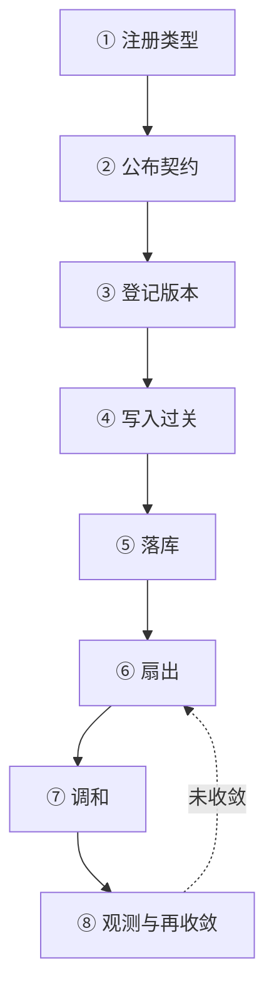

---
tags:
  - Kubernetes
  - 扩展
  - 体系
created: 2026-09-25
---

# 一个外部类型从注册到被约束

## 1. 一个外部类型经过的八个环节

把一个外部类型放进集群，并不是"建一个 CRD 就完事"。它要走完八个环节，每个环节都有自己的失败形态；环节之间的顺序不能颠倒，因为它们的信息是单向传递的：注册决定名字与路径，名字与路径决定谁能找到它，契约决定写入时被允许成什么样，存储版本决定读出来时是什么样，控制器决定它最终变成什么。

| # | 环节 | 谁在做 | 产物 | 第一个判据 |
| --- | --- | --- | --- | --- |
| 1 | 注册类型 | 平台方或提供方 | 一个 `CustomResourceDefinition` 或一组 `APIService` | 类型是否出现在 API 发现里 |
| 2 | 公布契约 | 提供方 | 结构化 schema、子资源声明、打印列与可选字段 | CRD 的状态条件里有没有 `NonStructuralSchema` |
| 3 | 登记版本 | 提供方 | 服务版本与唯一存储版本、转换策略 | `spec.versions[]` 的 `served` 与 `storage` |
| 4 | 写入过关 | 平台方与策略负责人 | 准入策略、绑定与钩子配置 | 请求返回码与响应体中的原因文本 |
| 5 | 落库 | 入口组件 | 存储里的一个对象版本 | 对象的 `metadata.resourceVersion` 是否变化 |
| 6 | 扇出 | 入口组件与控制器 | 控制器缓存里的变更 | 控制器指标中的队列增长与调和次数 |
| 7 | 调和 | 控制器的提供方 | 从属对象、外部资源与观测态字段 | 期望代数与已处理代数是否相等 |
| 8 | 观测与再收敛 | 平台方与提供方 | 状态条件、存储版本、策略检查结果与指标 | 条件、审计与指标三者是否指向同一结论 |

## 2. 八个环节各自的现场口径

| 环节 | 正常表现 | 失败表现 | 第一个动作 |
| --- | --- | --- | --- |
| 注册类型 | 类型出现在发现里，名字与清单一致 | 客户端报"不认识这个类型"，或角色绑定对不上 | 核对资源名、种类与作用域三者的书写是否一致 |
| 公布契约 | 写入时字段被校验、被剪枝、缺省值被补齐 | 字段静默消失、默认值不生效、钩子转换不工作 | 看 CRD 的状态条件里有没有 `NonStructuralSchema` |
| 登记版本 | 服务版本与存储版本各自明确，转换可靠 | 旧版本读不出来、新版本写不进去、迁移卡住 | 比较 `served`、`storage` 与 `storedVersions` 三者 |
| 写入过关 | 不合规的写入在入口处被拒绝，原因可读 | 写入被拒但原因不明，或者绕过检查写入成功 | 先分清是判定结论还是调用事故，再看策略与钩子配置 |
| 落库 | 写入后对象版本推进，返回的对象就是最终形态 | 返回成功但读到的是旧内容，或反复冲突 | 看对象版本与写入返回，而不是看本地缓存 |
| 扇出 | 控制器及时看到变更，队列不持续堆积 | 控制器看不到变更，或队列持续增长 | 看控制器是否在运行、队列深度与调和次数 |
| 调和 | 从属对象与观测态按期望收敛 | 对象停在中间状态，反复重试 | 看期望代数与已处理代数，再看调和错误指标 |
| 观测与再收敛 | 条件、审计与指标指向同一结论 | 三份证据互相矛盾，或者只有一份可用 | 先取时间最近的证据，再回到对应环节 |

## 3. 五条横向关系

八个环节纵向走一遍之后，真正在现场反复被追问的是五条横向关系：

| 横向关系 | 贯穿内容 | 结论 |
| --- | --- | --- |
| 版本与存储 | 公布的版本 → 服务版本 → 存储版本 → `storedVersions` → 弃用与移除 | "读不出来、写不进去"的问题，先从这三段版本是否错位起手 |
| 契约与约束 | schema → 校验规则 → 声明式策略 → 钩子 | 约束写在哪一层，决定了它的预演能力与失败形态 |
| 行为与责任 | 注册类型 → 部署控制器 → 领导者选举 → 清理项与观测态 | 注册的人不一定维护行为；责任必须落到一个具体进程上 |
| 权限与豁免 | 改类型与改策略的权限 → 参数对象的读取权 → 被豁免的准入对象 | 类型与策略的写权限按管理员级对待；豁免是保留自我修复路径的设计 |
| 成本与降级 | 对象与监听数量 → 转换与钩子的延迟 → 表达式成本 → 失败策略与降级预案 | 扩展的代价落在控制面资源与写路径可用性上 |

## 4. 关键字段的完整读法

| 看什么 | 是什么 | 单位 | 判据 | 与谁同看 | 看到它转向哪一步 |
| --- | --- | --- | --- | --- | --- |
| CRD 的 `spec.names.plural` 与对象名 | 资源名与类型标识 | 字符串 | 对象名必须是 `<plural>.<group>`；它同时是角色里的 `resource` | `spec.names.kind`、`spec.scope` | 客户端找不到类型 → 先核对这三处书写 |
| CRD 的 `status.conditions[]` | CRD 自身的状态 | 结构数组 | 关注 `Established`、`NamesAccepted`、`NonStructuralSchema`、`Terminating`、`StorageMigrating` | 事件与入口组件日志 | 出现 `NonStructuralSchema` 或 `Terminating` → 先处理它，其余结论都不成立 |
| `spec.versions[].served` 与 `storage` | 服务与存储的分工 | 布尔 | 只有一个版本是存储版本；停服之前必须先确认迁移完成 | `status.storedVersions` | 版本错位 → 读写路径会走到转换上 |
| `status.storedVersions` | 历史上写入过的版本 | 版本字符串数组 | 迁移完成的唯一判据是该数组只剩目标版本 | 转换服务的可用性 | 仍有旧版本 → 不能删版本 |
| `spec.conversion.strategy` 与 `clientConfig` | 转换方式与对端 | 枚举与结构体 | `Webhook` 需要可用的服务、证书与端口 | 转换失败率与告警 | 转换失败 → 该类型的读写一起受影响 |
| 策略的 `spec.matchConstraints` 与 `matchConditions` | 判定覆盖哪些请求 | 规则与条件列表 | 排除规则优先；条件必须全部为真 | 绑定的校验动作 | 判定范围不对 → 先改匹配，再改表达式 |
| 绑定的 `validationActions` | 判定失败时做什么 | 枚举数组 | 观察期用 `Warn` 与 `Audit`，确认后才切到 `Deny` | 策略指标与审计注解 | 只有审计痕迹 → 当前处于观察期 |
| `paramRef` 与 `parameterNotFoundAction` | 参数从哪里来 | 结构体与枚举 | 缺失参数按 `Allow` 或 `Deny` 处理，`Deny` 交给失败策略 | 参数对象的命名空间与选择器 | 参数相关拒绝增多 → 先确认参数对象是否存在 |
| 钩子的 `matchPolicy` 与 `sideEffects` | 钩子拦什么、能否处理试运行请求 | 枚举 | 匹配策略默认等价匹配；超时与失败策略的取值以生效配置为准 | 钩子调用与失败指标 | 钩子表现异常 → 先看这两项配置与超时设置，再看进程 |
| `APIService` 的 `status.conditions[]` | 聚合服务是否可用 | 条件类型 `Available` | 为假时该组 API 的发现与请求一起失败 | `spec.service`、`spec.caBundle` | 为假 → 先查后端服务与信任根 |
| 控制器的调和指标与队列指标 | 行为是否及时收敛 | 计数与分位数 | 队列深度持续增长说明消费不足；错误计数上升说明调和失败 | `generation` 与 `status.observedGeneration` | 只在指标上异常 → 先查调和里的直读与外部调用 |
| `leader_election_master_status` | 当前执行者是谁 | 布尔（按持有者分标签） | 同一时刻应当只有一个为真 | 切换次数与选举慢路径计数 | 出现两个为真 → 处在切换窗口，动作必须可重入 |

## 5. 任务卡：八个环节在现场的应用

把八个环节压成一张可以照着走的任务卡：

1. **接一个扩展时**：查类型是否出现在发现里、CRD 状态条件是否正常、作用域与名字是否与清单一致；产物是一段"注册信息与来源"的记录。
2. **接一个新版本的字段时**：查 schema 是否结构化、哪些字段被剪枝、缺省值作用在哪一个版本；产物是字段契约与默认值的对照。
3. **推进一次版本时**：查服务版本、存储版本与 `storedVersions` 三条线；产物是一份带顺序与回滚点的版本推进记录。
4. **上线一次策略时**：先在观察动作下运行，统计命中范围与耗时，再切换到拒绝；产物是策略上线记录与观察数据。
5. **排查一次拒绝时**：先分清判定结论与调用事故，再看策略与钩子的匹配范围；产物是一份拒绝原因的归类记录。
6. **排查一次不收敛时**：先看期望代数与已处理代数，再看队列与调和指标；产物是一份把"控制器侧问题"与"对象侧问题"分开的结论。
7. **交付一张扩展面清单**：把类型、版本、存储版本、控制器、策略与钩子的归属写成一份可核对的清单，供升级与交接使用。

## 6. 常见坑

| 常见做法 | 后果 |
| --- | --- |
| 把"CRD 装上了"当作交付完成 | 没有控制器的类型不会产生任何行为，也没有人为它的清理负责 |
| 只记录清单里的 API 版本，不记录存储版本 | 升级时无法判断存量对象需要不需要迁移 |
| 策略一上线就切到拒绝 | 存量对象不会被回查，但新写入可能被大面积拦下，直接影响发布 |
| 用扩展服务承载关键写路径，却不写降级预案 | 服务不可用时，写请求随失败策略一起失败 |
| 把控制器副本数当成吞吐配置 | 同一时刻只有一个执行者，达不到预期的处理速度 |
| 只靠一份证据下结论 | 条件、审计与指标的时间尺度不同，单一证据会给出错误判断 |
| 升级前不核对 `storedVersions` | 直到要删版本时才发现还有旧对象留在存储里 |

## 7. 要点自测

**问：为什么八个环节的顺序不能颠倒？**

答：因为这八个环节之间是单向传递的：注册决定名字与路径，契约决定写入时被允许成什么样，版本决定读出来是什么样，控制器决定最终形态。顺序颠倒时，动作会在错误的输入上执行，例如在迁移完成之前就停用旧版本、在没有控制器的情况下宣布功能可用。

**问：同一份"对象写不进去"的现场，为什么第一步是分清判定结论与调用事故？**

答：两者的处置方向完全不同：前者要改对象或改策略，后者要修钩子或扩展服务自身的可用性。判据是返回码与响应体里的原因文本，而不是"感觉钩子有问题"。

**问：为什么"期望代数"与"已处理代数"是判断控制器问题的第一个判据？**

答：它把两类原因分开：两者相等说明控制器已经看过最新期望，问题在之后的环节；两者长期不等说明控制器没有跟上，问题在控制器这一侧。这一条不需要读控制器代码，只需要读对象自身的字段。

**问：为什么扩展面清单要同时记录类型与责任方？**

答：类型说明集群里有什么，责任方说明谁能修好它。只有类型清单时，出现问题时找不到负责人；只有责任方时，又无法判断升级会影响哪些对象，因此两者必须写在同一份产物里。

**问：聚合服务与准入钩子为什么都被归入"可用性风险"？**

答：两者都在写路径或发现路径的关键位置上：钩子不可用会让相关写入失败，聚合服务不可用会让整组 API 的发现与请求失败。它们的副本数、超时、信任根与降级预案都属于集群自身的可用性设计。

**第一反应不要做什么**：不要在注册完成之后就宣布功能可用；不要在迁移完成之前停用旧版本；不要把新策略直接切成拒绝；不要把控制器副本数当成吞吐配置；也不要只凭一份证据对扩展面的状态下结论。

## 参考文档

- 官方文档中关于自定义资源、聚合层与准入控制的章节：注册、版本与转换、发现与判定的机制。
- 官方文档中关于控制器与声明式 API 的章节：调和循环、期望状态与实际状态的分离。
- 官方文档中关于准入策略与动态准入的章节：定义、绑定、参数与校验动作的语义。
- 上游 `apiextensions-apiserver`、`kube-aggregator` 与入口组件准入插件的类型定义：字段取值与插件顺序。
- 本库的版本口径见 `Kubernetes/写作规约.md`；本节引用的字段与阈值以**实际对象的取值与生效配置**为准。
