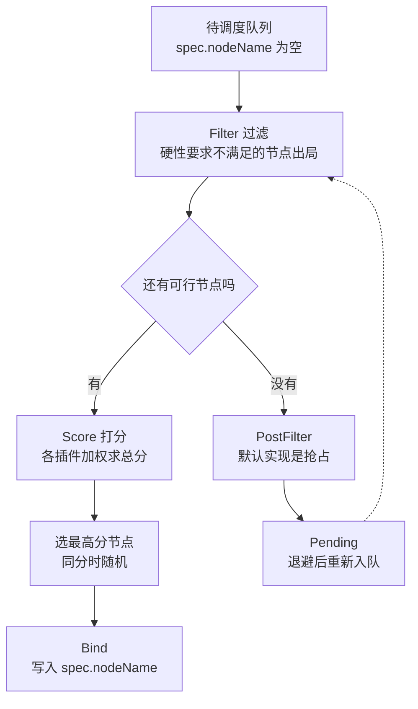
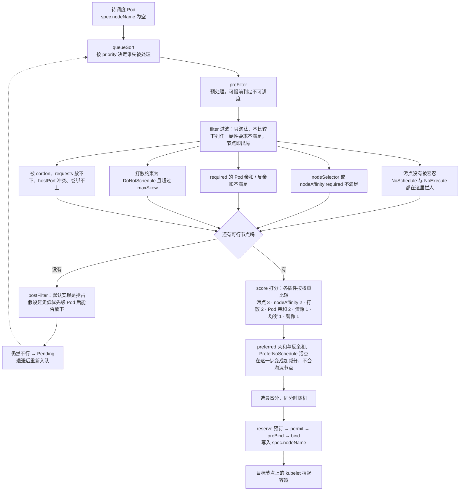
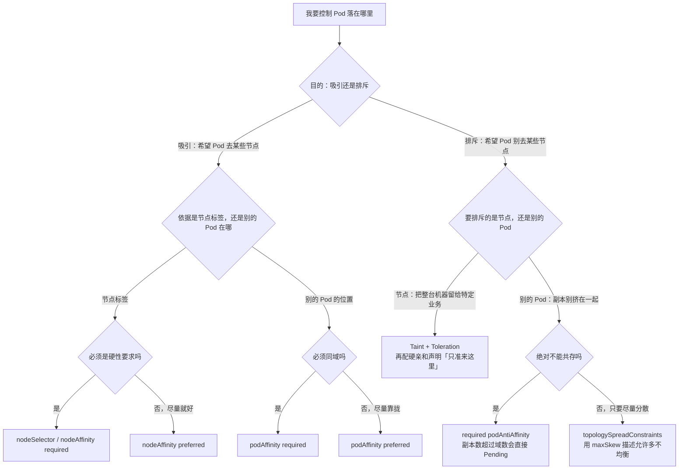
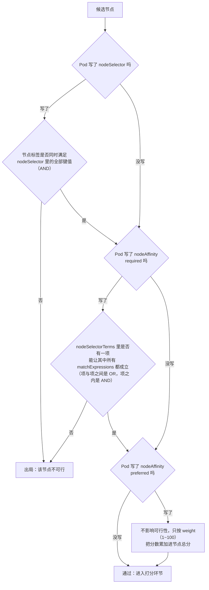
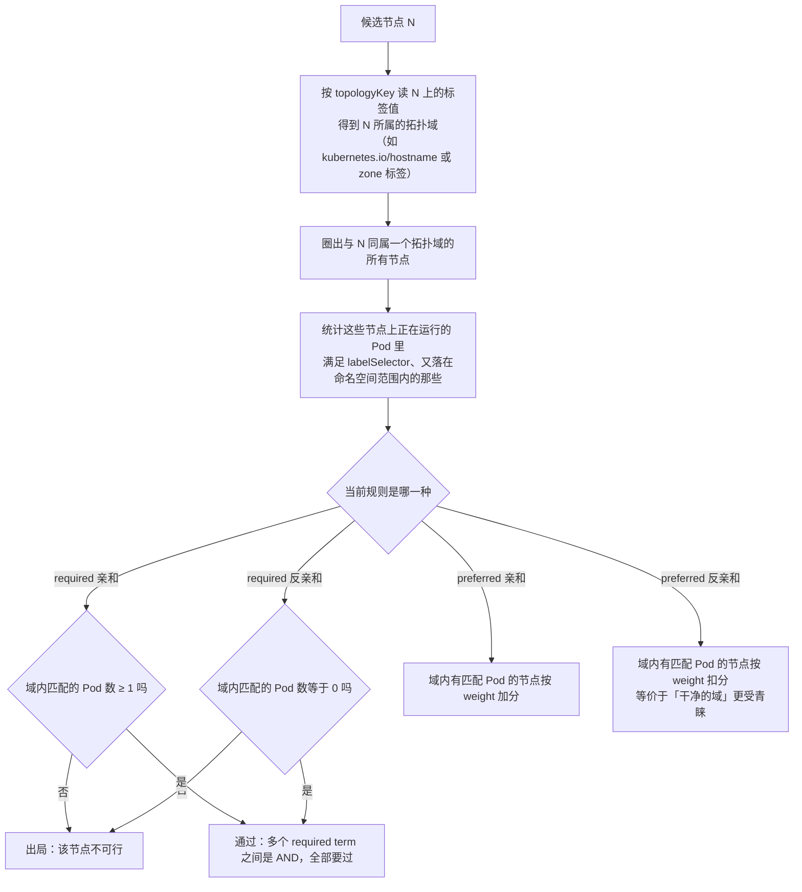
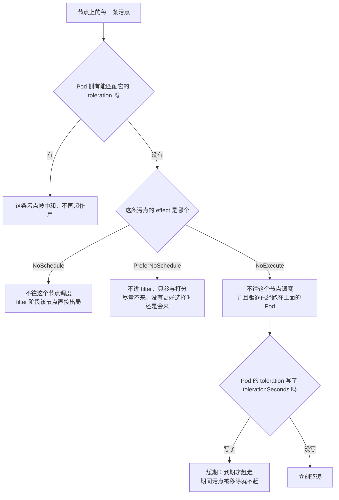
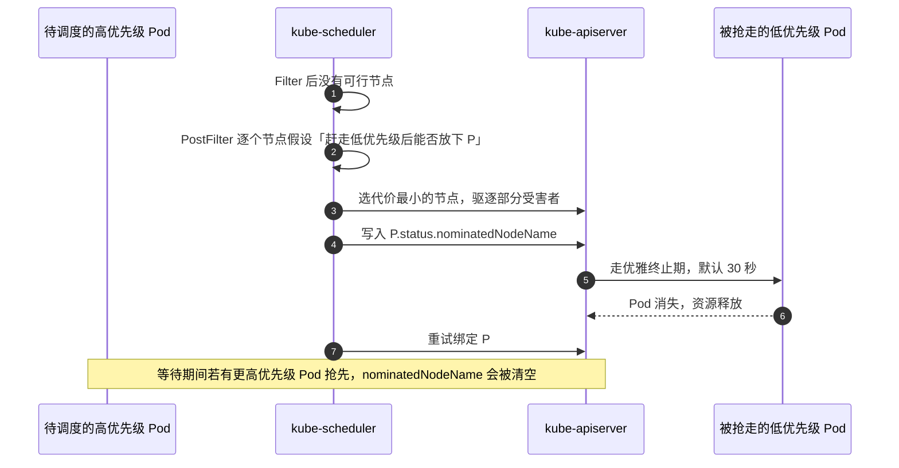
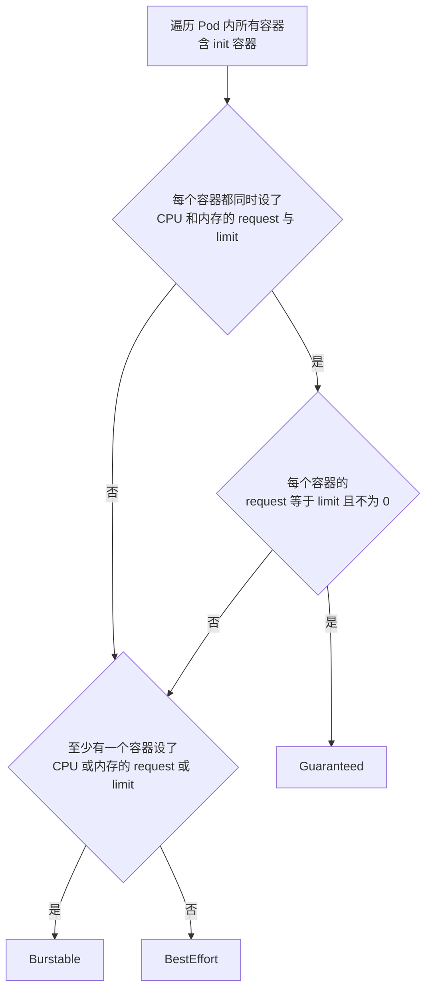
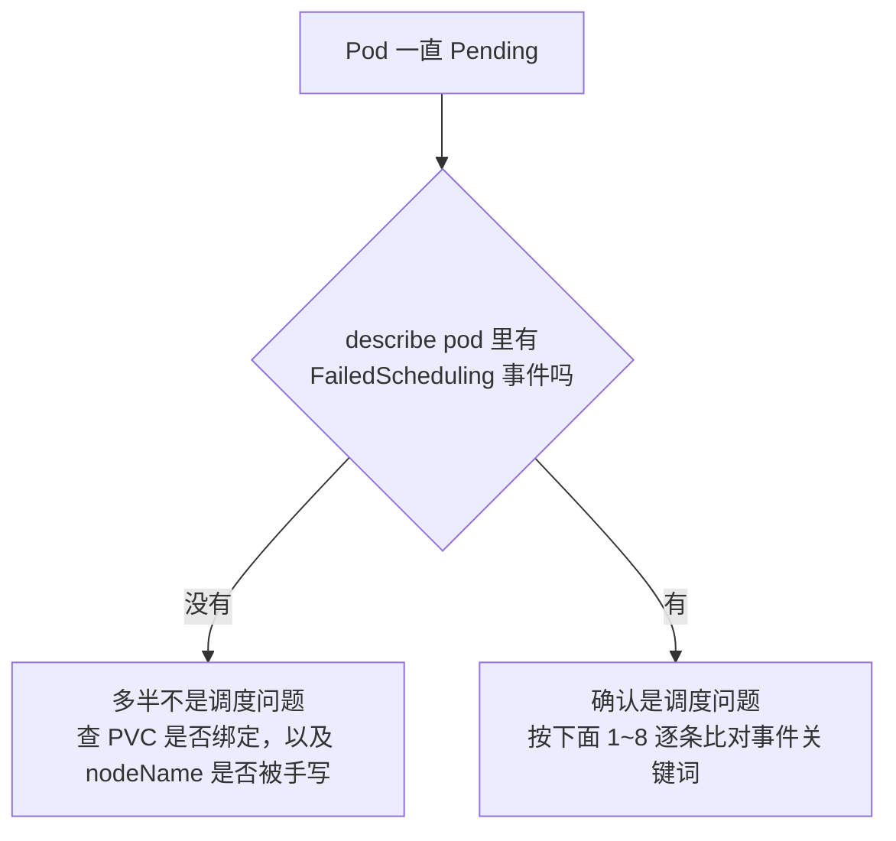

---
tags:
  - Kubernetes
  - 调度
  - 资源管理
  - QoS
created: 2026-09-12
---

# 调度、资源与 QoS

> 本笔记对应 [[Kubernetes/00_简介]] 的「阶段 3」，是整套路线图里生产价值最高的一段。目标：能讲清调度器怎么选节点、NodeAffinity / Taint / 优先级这三种「摆放手段」的边界、requests 与 limits 的真实作用面、QoS 三档的判定规则，以及节点压力下驱逐与 OOM 的实际顺序。
>
> 关联复习：[[01_核心架构与对象模型]]、[[02_工作负载与控制器]]
>
> 说明：本笔记的字段、默认值与行为均以官方文档和 Kubernetes 源码为准，凡有版本差异的地方都标注了引入版本，落地前请对照集群实际版本。

## 0. 30 秒速览

> [!abstract] 这一页只要记住六句话
> - **调度三步**：Filter（筛掉不满足硬性要求的节点）→ Score（打分）→ Bind（写入 `spec.nodeName`）。**一个可行节点都没有才会 `Pending`**，所以「加机器」不一定有用。
> - **三种摆放手段**：NodeAffinity 负责**吸引**、Taint 负责**排斥**、Priority 负责**插队**。toleration 只代表「允许调度」，不代表「保证调度」。
> - **requests vs limits**：调度只看 requests，limits 是运行时硬上限。CPU 超限是**限流**，内存超限是 **OOM kill**。
> - **QoS 三档**由 request / limit 的组合决定，Pod 创建时定死、终身不变；**只写 limits 会被自动补成 requests**，这就是最常见的「意外的 Guaranteed」。
> - **驱逐不按 QoS 排序**：真实排序是「用量是否超过 requests → 优先级 → 超出程度」，QoS 只是结果的近似；磁盘压力场景 QoS 完全不适用。
> - **抢占也完全不看 QoS**，只看优先级，而且 PDB 只是 best-effort。

> [!tip] 怎么用这篇笔记
> 首学按顺序读；复习时只看第 0 节和第 11~13 节，其余内容按需回查。
> 标着「动手验证」的折叠块是可以直接跑的 YAML 示例，建议至少亲手跑一遍「意外的 Guaranteed」和「专用节点池」两个。
> 需要快速回忆时直接看图：三种摆放手段的选型决策图与调度全景图在 1.6，节点亲和、Pod 亲和反亲和、Taint / Toleration 各有一张判定流程图，分别在 2.4 / 3.5 / 4.7。

## 1. 一次调度发生了什么

### 1.1 调度器的输入与输出

`kube-scheduler` 的职责可以压缩成一句话：**为 `.spec.nodeName` 为空的 Pod 选一个节点，并通过 Binding 子资源把结果写回 API Server**。

- 输入：调度队列里的待调度 Pod + 集群当前状态（Node、已运行 Pod、PV/PVC）。
- 输出：选中的节点（写入 `spec.nodeName`），或者继续 `Pending`。

它不创建容器、不改节点状态，真正拉起容器的是目标节点上的 `kubelet`（见 [[01_核心架构与对象模型]]）。所以看到 Pod `Pending`，第一反应应该是「没有可行节点」，而不是「节点坏了」。

### 1.2 两阶段：过滤 → 打分

| 阶段        | 历史叫法       | 做什么                  | 结果                    |
| --------- | ---------- | -------------------- | --------------------- |
| Filtering | Predicates | 逐个检查节点是否满足 Pod 的硬性要求 | 剩下的节点称为 feasible node |
| Scoring   | Priorities | 给每个可行节点打分，选最高分       | 同分时随机选一个              |



- 过滤后只要还剩节点，Pod 就会被绑定到打分最高的那个；**一个可行节点都没有才会 `Pending`**，调度器按退避策略持续重试。
- 打分是「比较」而不是「及格线」：哪怕所有节点都很紧张，也会挑一个相对最好的。
- 过滤之后还有个 `postFilter` 扩展点，默认跑的就是抢占（DefaultPreemption），见第 5 节。

### 1.3 调度框架的扩展点

现代调度器用 Scheduling Framework 组织逻辑，插件实现到一个或多个扩展点。记住下面这些就够了：

| 扩展点                             | 作用                        |
| ------------------------------- | ------------------------- |
| `queueSort`                     | 决定调度队列里谁先被处理（默认按优先级）      |
| `preFilter`                     | 过滤前的预处理与缓存，可提前判定 Pod 不可调度 |
| `filter`                        | 过滤节点，等价于历史上的 Predicates   |
| `postFilter`                    | 找不到可行节点时介入（默认实现是抢占）       |
| `preScore` / `score`            | 打分，等价于历史上的 Priorities     |
| `reserve`                       | 预订资源，后续失败时回滚（Unreserve）   |
| `permit`                        | 延迟或拒绝绑定（gang/squad 场景）    |
| `preBind` / `bind` / `postBind` | 真正写 `spec.nodeName` 及收尾   |

> 早期的 Scheduling Policy（Predicates/Priorities 配置文件）已被插件配置取代，现在通过 `KubeSchedulerConfiguration` 的 `profiles` 配置，而不是改策略文件。

### 1.4 默认启用的插件与默认权重

默认 profile 里这些插件是开着的（权重取自调度器默认配置）：

| 插件 | 扩展点 | 权重 | 负责什么 |
| --- | --- | --- | --- |
| `TaintToleration` | filter / preScore / score | 3 | 污点与容忍 |
| `NodeAffinity` | filter / score | 2 | `nodeSelector` + `nodeAffinity` |
| `PodTopologySpread` | preFilter / filter / preScore / score | 2 | 拓扑打散 |
| `InterPodAffinity` | preFilter / filter / preScore / score | 2 | Pod 亲和与反亲和 |
| `NodeResourcesFit` | preFilter / filter / score | 1 | 资源放不放得下（默认 `LeastAllocated` 策略） |
| `NodeResourcesBalancedAllocation` | score | 1 | 资源比例更均衡的节点优先 |
| `ImageLocality` | score | 1 | 已缓存镜像的节点优先 |
| `NodeUnschedulable` | filter | — | 排除 `spec.unschedulable: true` 的节点（被 cordon 的节点） |
| `NodePorts` | preFilter / filter | — | 主机端口是否冲突 |
| `VolumeBinding` / `VolumeZone` / `NodeVolumeLimits` | filter（含 reserve / preBind） | — | 卷能否绑定、卷的可用区、CSI 挂载数上限 |
| `DefaultPreemption` | postFilter | — | 抢占 |
| `PrioritySort` / `DefaultBinder` | queueSort / bind | — | 队列排序与绑定 |

两个容易被误解的点：

- `NodeResourcesFit` 的打分策略有 `LeastAllocated`（默认，越空越优先）、`MostAllocated`（越满越优先，提高装箱率）、`RequestedToCapacityRatio`。
- 即使 Pod 没写 `topologySpreadConstraints`，调度器也会对属于 Service / ReplicaSet / StatefulSet / ReplicationController 的 Pod 应用**内置默认打散约束**：`kubernetes.io/hostname` 上 `maxSkew: 3`、`topology.kubernetes.io/zone` 上 `maxSkew: 5`，且都是 `ScheduleAnyway`。这就是「没配打散但副本看起来也挺均匀」的原因。

### 1.5 三个绕过或改变调度的入口

- **手写 `spec.nodeName`**：直接绕过调度器，连 `NoSchedule` 污点都拦不住；但节点上如果有 `NoExecute` 污点且没有对应容忍，`kubelet` 仍会把 Pod 驱逐。
- **DaemonSet**：Pod 由 DaemonSet 控制器带着 `nodeAffinity` 创建，再由默认调度器放到对应节点上。
- **`spec.schedulerName`**：指定别的调度器或别的 profile，多调度器共存时这是分流手段。

### 1.6 摆放手段全景：三种机制分别落在哪一步

第 2~4 节的三种手段不是三套并列的开关，它们的差别首先是「**落在流水线的哪一步**」——把手段放回调度流程，位置是固定的：



> [!important] 一句话对应关系
> **能淘汰节点的手段（required 亲和、NoSchedule / NoExecute 污点、DoNotSchedule 打散）都在 filter；只影响比较的手段（preferred 亲和、PreferNoSchedule 污点）都在 score。**记住这一条，就不会再纠结「为什么都配了却没生效」——多半是把硬规则写成了软规则，或者反过来。

| 手段                                     | 作用方向        | 写在谁身上      | 生效阶段                   | 软 / 硬                    |
| -------------------------------------- | ----------- | ---------- | ---------------------- | ------------------------ |
| `nodeSelector`                         | 吸引          | Pod        | filter                 | 只有硬                      |
| `nodeAffinity` required                | 吸引          | Pod        | filter                 | 硬                        |
| `nodeAffinity` preferred               | 吸引          | Pod        | score                  | 软（`weight` 1~100）        |
| `podAffinity` required / preferred     | 吸引（对某些 Pod） | Pod        | filter / score         | 硬 / 软                    |
| `podAntiAffinity` required / preferred | 排斥（对某些 Pod） | Pod        | filter / score         | 硬 / 软                    |
| `topologySpreadConstraints`            | 拉平分布        | Pod        | filter / score         | 由 `whenUnsatisfiable` 决定 |
| Taint `NoSchedule` / `NoExecute`       | 排斥          | Node       | filter                 | 硬                        |
| Taint `PreferNoSchedule`               | 排斥          | Node       | score                  | 软                        |
| Toleration                             | 解除排斥（不构成吸引） | Pod        | filter / score         | —                        |
| PriorityClass + 抢占                     | 插队          | Pod / 集群对象 | queueSort / postFilter | —                        |

最后用一张决策图收口——**要控制 Pod 的落点，先问「吸引还是排斥」，再问「硬性还是软偏好」**，这两问定了，写什么字段基本就定了：



## 2. 节点亲和：nodeSelector 与 NodeAffinity

### 2.1 nodeSelector

最简单的节点选择方式：Pod 只会被调度到**同时具备所有指定标签**的节点上，是标签的 AND 关系，无法表达「或者」和「软偏好」。

### 2.2 NodeAffinity

`nodeAffinity` 比 `nodeSelector` 表达力强，分两档：

| 类型                                                | 语义                    | 不满足时                  |
| ------------------------------------------------- | --------------------- | --------------------- |
| `requiredDuringSchedulingIgnoredDuringExecution`  | 硬性要求                  | 该节点不可行；全部不可行则 Pending |
| `preferredDuringSchedulingIgnoredDuringExecution` | 软偏好，带 `weight: 1~100` | 仍可调度，只是分数低            |

规则要点：

- operator 支持 `In`、`NotIn`、`Exists`、`DoesNotExist`、`Gt`、`Lt`；`Gt`/`Lt` 只能用于整数标签值。
- 多个 `nodeSelectorTerms` 之间是 **OR**；同一个 term 内的多个 `matchExpressions` 之间是 **AND**。
- 另有 `matchFields`，可按 `metadata.name`、`metadata.namespace` 匹配节点字段，用途较窄。
- `IgnoredDuringExecution` 的含义是：**调度完成后节点标签被改，已运行的 Pod 不会被赶走**，也不会重新调度。
- 同时写了 `nodeSelector` 和 `nodeAffinity` 时，两者都要满足。
- 多个 `preferred` 规则的权重会累加进节点总分，再和别的打分插件一起比较。

> 节点级隔离如果用于安全或合规场景，标签键应使用 `node-restriction.kubernetes.io/` 前缀，并配合 Node authorizer 与 NodeRestriction 准入插件，防止被攻陷的节点自己打标签。

> [!example]- 动手验证：nodeSelector、required、preferred 三者的差别一次看清
> 先给两台 worker 打上不同的标签（节点名以 `kubectl get nodes` 为准；本仓库的 kind lab 是 `lab-control-plane` / `lab-worker` / `lab-worker2`）：
> ```text
> kubectl label node lab-worker  disktype=ssd
> kubectl label node lab-worker2 disktype=hdd
> kubectl get nodes -L disktype
> # 预期：lab-worker 一列是 ssd，lab-worker2 一列是 hdd，控制面节点那一列是 <none>
> ```
> 三个 Pod 放进同一个文件，各自用写法表达同一个诉求——**注意只有 `nodeAffinity` 能表达「ssd 或 hdd 都行」**：
> ```yaml
> # 1) nodeSelector：键值之间只能 AND，这里等于把 Pod 钉死在 lab-worker
> apiVersion: v1
> kind: Pod
> metadata:
>   name: pin-ssd
> spec:
>   nodeSelector:
>     disktype: ssd
>   containers:
>     - name: app
>       image: registry.k8s.io/pause:3.9
> ---
> # 2) required + 两个 term：term 之间是 OR，等于「两台 worker 都行」
> apiVersion: v1
> kind: Pod
> metadata:
>   name: either-worker
> spec:
>   affinity:
>     nodeAffinity:
>       requiredDuringSchedulingIgnoredDuringExecution:
>         nodeSelectorTerms:
>           - matchExpressions:
>               - key: disktype
>                 operator: In
>                 values:
>                   - ssd
>           - matchExpressions:
>               - key: disktype
>                 operator: In
>                 values:
>                   - hdd
>   containers:
>     - name: app
>       image: registry.k8s.io/pause:3.9
> ---
> # 3) preferred：条件和写法 1 相同，但只是「尽量」
> apiVersion: v1
> kind: Pod
> metadata:
>   name: prefer-ssd
> spec:
>   affinity:
>     nodeAffinity:
>       preferredDuringSchedulingIgnoredDuringExecution:
>         - weight: 100
>           preference:
>             matchExpressions:
>               - key: disktype
>                 operator: In
>                 values:
>                   - ssd
>   containers:
>     - name: app
>       image: registry.k8s.io/pause:3.9
> ```
> ```text
> kubectl apply -f node-affinity.yaml
> kubectl get pods -o custom-columns=POD:.metadata.name,NODE:.spec.nodeName
> # 预期：pin-ssd 落在 lab-worker
> #       either-worker 落在任意一台 worker——两个 term 满足一个就通过
> #       prefer-ssd 也落在 lab-worker——weight 拉满 100，其它条件相同时它必然胜出
> ```
> 真正把「硬」和「软」分开的是下面这一步——**把首选节点 cordon 掉**（cordon 的本质是打上 `node.kubernetes.io/unschedulable` 污点，见 4.6）：
> ```text
> kubectl cordon lab-worker
> kubectl delete pod pin-ssd either-worker prefer-ssd
> kubectl apply -f node-affinity.yaml
> kubectl get pods -o custom-columns=POD:.metadata.name,NODE:.spec.nodeName
> # 预期：prefer-ssd 照样 Running，只是退到了 lab-worker2——偏好没被满足不是错误
> #       either-worker 也落在 lab-worker2——OR 的第二个 term 接住了它
> #       pin-ssd 变成 Pending——硬要求指向的节点不可用了，另一台 worker 的标签又对不上
> kubectl describe pod pin-ssd
> # 预期：Events 是 FailedScheduling，按原因分组计数，其中一定出现
> #       node(s) were unschedulable（被 cordon 的那台）
> #       与 node(s) didn't match Pod's node affinity/selector（标签对不上的另一台）
> #       控制面若带 node-role.kubernetes.io/control-plane:NoSchedule 污点，还会多一组 untolerated taint 计数
> kubectl uncordon lab-worker
> kubectl get pods -o custom-columns=POD:.metadata.name,NODE:.spec.nodeName
> # 预期：等几秒，pin-ssd 不再 Pending，被调度到 lab-worker——Pending 的 Pod 一直在退避重试，条件变好就会自己上去
> kubectl delete pod pin-ssd either-worker prefer-ssd
> ```
> 两个收尾提醒：`uncordon` 是必须的，忘了它这台节点会一直不接新 Pod；标签可以留着，后面的例子还会用到 `disktype`。

### 2.3 生产用法

- **软约束用 `preferred`**：例如「尽量和缓存同 zone」「尽量上有 SSD 的机器」，调度不上也要能跑起来。
- **硬约束用 `required` + Taint**：只想让某些 Pod 落在专用节点池时，光靠 affinity 只能「吸引」，还要用 taint 把别的 Pod「排斥」出去（见第 4 节）。

### 2.4 判定流程：一个节点能不能过 NodeAffinity

把 2.1~2.3 的规则画成一张图，就是一个「**两道并列的硬关卡 + 一道只加分的软规则**」的结构：



三点提醒（依据都在 2.2）：

- **两道硬关卡是并列的**：`nodeSelector` 与 `nodeAffinity.required` 同时写了就都要满足，任一道不过节点就出局；所有节点都出局，Pod 就 `Pending`。
- **软规则永远不淘汰节点**：`preferred` 只在 score 阶段加分，因此不会有「因为偏好没满足而调度失败」这回事；反过来 `nodeSelector` 没有软版本，想要软偏好只能用 `preferred`。
- **这张图只在「调度那一刻」跑**：`IgnoredDuringExecution` 的含义是事后改节点标签不会重跑它，已运行的 Pod 既不会被赶走，也不会被重新调度。

## 3. Pod 亲和与反亲和

### 3.1 语义

Pod affinity / anti-affinity 的规则是「**这个 Pod 应该 / 不应该和满足某标签的 Pod 处于同一个拓扑域**」。它比较的是节点上已运行 Pod 的标签，而不是节点标签。

- 拓扑域由 `topologyKey` 指定，取值是**节点标签的 key**，例如 `kubernetes.io/hostname`（一个节点一个域）或 `topology.kubernetes.io/zone`（一个 zone 一个域）。
- 匹配对象由 `labelSelector` 与命名空间范围决定：`namespaces` 与 `namespaceSelector` 命中的集合取**并集**，两者都不写时才只看**自己所在的 namespace**（`namespaceSelector: {}` 则匹配所有 namespace）。
- 同样分 `requiredDuringScheduling` 与 `preferredDuringScheduling` 两档。

> [!example]- 动手验证：硬亲和把「同域」翻译成「同一台节点」
> ```yaml
> apiVersion: apps/v1
> kind: Deployment
> metadata:
>   name: cache
> spec:
>   replicas: 1                 # 只留 1 个副本，才看得出「必须跟它同域」
>   selector:
>     matchLabels:
>       app: store
>   template:
>     metadata:
>       labels:
>         app: store
>     spec:
>       containers:
>         - name: cache
>           image: nginx:1.27   # 镜像是什么不重要，关键是 Pod 上的标签
> ---
> apiVersion: apps/v1
> kind: Deployment
> metadata:
>   name: web
> spec:
>   replicas: 2
>   selector:
>     matchLabels:
>       app: web-store
>   template:
>     metadata:
>       labels:
>         app: web-store
>     spec:
>       affinity:
>         podAffinity:
>           requiredDuringSchedulingIgnoredDuringExecution:
>             - labelSelector:
>                 matchExpressions:
>                   - key: app
>                     operator: In
>                     values:
>                       - store
>               topologyKey: kubernetes.io/hostname   # 域 = 一台节点
>               namespaces:
>                 - default                           # 省略时只匹配自己所在的 namespace
>       containers:
>         - name: web
>           image: nginx:1.27
> ```
> ```text
> kubectl apply -f pod-affinity.yaml
> kubectl get pods -l app=store -o wide
> kubectl get pods -l app=web-store -o wide
> # 预期：两个 web-store 的 NODE 都等于 store 的 NODE——域内没有 store 的节点会被直接过滤掉
> kubectl delete pod <store 的 Pod 名>
> kubectl get pods -o wide
> # 预期：web-store 的 Pod 原地不动，也不会跟着缓存跑——IgnoredDuringExecution 的意思是只在调度那一刻检查
> kubectl delete pod <某个 web-store 的 Pod 名>
> kubectl get pods -l app=web-store -o wide
> # 预期：重建的这个 Pod 会重新过一遍亲和检查，落到「当时」有 store Pod 的节点上
> ```
> 把 `required` 换成 `preferred`，语义就变成「尽量靠在一起」：找不到符合条件的节点时照样能调度，只是会扣分。

### 3.2 必须记住的限制

| 限制                               | 说明                                                                                                                                                               |
| -------------------------------- | ---------------------------------------------------------------------------------------------------------------------------------------------------------------- |
| `topologyKey` 不能为空               | Pod 亲和与反亲和都禁止空 `topologyKey`                                                                                                                                     |
| required 反亲和的 `topologyKey` 可能受限 | 由 `LimitPodHardAntiAffinityTopology` 准入插件决定：启用时只允许 `kubernetes.io/hostname`；**该插件默认不启用**（可用 `kube-apiserver --help` 查看实际启用的插件列表），所以默认集群里 zone 级 required 反亲和是合法的 |
| 节点标签必须一致                         | 反亲和依赖所有节点都带 `topologyKey` 对应的标签，缺标签会得到意外结果                                                                                                                       |
| 性能开销大                            | 官方不建议在数百节点以上的集群里大量使用                                                                                                                                             |
| 已有 Pod 的软规则不参与                   | 调度新 Pod 时，忽略已有 Pod 的 `preferred` 亲和 / 反亲和规则                                                                                                                      |
| 自我亲和不会死锁                         | 若一批 Pod 互相亲和且当前 Pod 是第一个，允许先调度它                                                                                                                                  |

### 3.3 典型用法与坑

- **反亲和打散副本**：经典写法是 `required` 反亲和 + `topologyKey: kubernetes.io/hostname` + 匹配自己的 `app` 标签。**坑在于副本数超过节点数时会直接 Pending**，这种场景应改用 TopologySpreadConstraints。
- **亲和做同域就近访问**：例如让业务 Pod 与缓存 Pod 落在同一个 zone，减少跨 zone 流量。
- **反亲和只能「限制共存」**：它不会自动平衡数量；真正均匀的打散要交给 TopologySpreadConstraints。

> [!example]- 动手验证：反亲和打散副本，以及它撞上「副本数 > 节点数」时的样子
> ```yaml
> apiVersion: apps/v1
> kind: Deployment
> metadata:
>   name: ha-web
> spec:
>   replicas: 2
>   selector:
>     matchLabels:
>       app: ha-web
>   template:
>     metadata:
>       labels:
>         app: ha-web
>     spec:
>       affinity:
>         podAntiAffinity:
>           requiredDuringSchedulingIgnoredDuringExecution:
>             - labelSelector:
>                 matchExpressions:
>                   - key: app
>                     operator: In
>                     values:
>                       - ha-web
>               topologyKey: kubernetes.io/hostname   # 域 = 一台节点
>       containers:
>         - name: web
>           image: nginx:1.27
> ```
> ```text
> kubectl apply -f pod-antiaffinity.yaml
> kubectl get pods -l app=ha-web -o wide
> # 预期：2 个副本落在 2 台不同节点上（NODE 一列不重复）——这就是「打散」
> kubectl get nodes
> # 先数清楚有几个「能放业务 Pod」的节点：本仓库的 kind lab 是 1 控制面 + 2 worker
> kubectl scale deployment/ha-web --replicas=3
> kubectl get pods -l app=ha-web -o wide
> # 预期：可调度节点只有 2 台时，第 3 个副本一直 Pending——硬规则要求「不能共存」，无解就是无解
> # 控制面没打污点、能放业务 Pod 的集群，可调度节点是 3 台，把副本数调到 4 才能复现同样的 Pending
> kubectl describe pod <Pending 的 Pod 名>
> # 预期：Events 里是 FailedScheduling，原因与 pod anti-affinity 有关
> # 措辞随版本略有差异：didn't match pod anti-affinity rules / didn't satisfy existing pods anti-affinity rules
> ```
> 顺手澄清一个常见误解：§3.2 表里那条「required 反亲和只能用 `kubernetes.io/hostname`」**不是默认行为**，它只在这个准入插件被显式启用时成立——若集群开着它，改成 `topologyKey: topology.kubernetes.io/zone` 再 apply 会被直接拒绝（Forbidden，提示 `affinity.PodAntiAffinity.RequiredDuringScheduling has TopologyKey ... but only key kubernetes.io/hostname is allowed`）；默认集群里则照常生效，只是打散的单位从「节点」变成了「zone」。
>
> 换成软规则 `preferredDuringSchedulingIgnoredDuringExecution` 再发版，3 个副本就都能跑起来，只是会有 2 个挤在同一台节点上——反亲和**能限制共存，但不会替你平衡数量**。

### 3.4 TopologySpreadConstraints 速查

| 字段                  | 含义                                                                                 |
| ------------------- | ---------------------------------------------------------------------------------- |
| `maxSkew`           | 允许的最大不均衡度（必须大于 0）                                                                  |
| `topologyKey`       | 拓扑域的节点标签 key                                                                       |
| `whenUnsatisfiable` | `DoNotSchedule`（默认，硬约束）或 `ScheduleAnyway`（软约束，尽量减小偏差）                              |
| `labelSelector`     | 统计哪些 Pod 参与计算                                                                      |
| `minDomains`        | 最少合格域数量，只在 `DoNotSchedule` 下可用；域的可用性受 `nodeAffinityPolicy` / `nodeTaintsPolicy` 影响 |
| `matchLabelKeys`    | 用当前 Pod 的标签值（如 Deployment 自动打的 `pod-template-hash`）动态参与匹配，避免每次发版都改约束               |

要点：同一个 `topologyKey` 加同一个 `whenUnsatisfiable` 只能出现一条约束；多条约束之间是 AND。

> [!example]- 动手验证：同样超出节点数，TSC 把 5 个副本铺成 3/2
> 先给两台 worker 打上拓扑标签——**没有这个标签的节点不参与统计，也放不了带这条约束的 Pod**：
> ```text
> kubectl label node lab-worker  topology.kubernetes.io/zone=zone-a
> kubectl label node lab-worker2 topology.kubernetes.io/zone=zone-b
> # 节点名以 kubectl get nodes 为准；本仓库的 kind lab 是 lab-control-plane / lab-worker / lab-worker2
> kubectl get nodes -L topology.kubernetes.io/zone
> # 预期：只有两台 worker 有 zone 值，控制面节点是空的
> ```
> ```yaml
> apiVersion: apps/v1
> kind: Deployment
> metadata:
>   name: spread-demo
> spec:
>   replicas: 2
>   selector:
>     matchLabels:
>       app: spread-demo
>   template:
>     metadata:
>       labels:
>         app: spread-demo
>     spec:
>       topologySpreadConstraints:
>         - maxSkew: 1                            # 任意两个域的数量差最多 1（必须大于 0）
>           topologyKey: topology.kubernetes.io/zone
>           whenUnsatisfiable: DoNotSchedule      # 硬约束，也是默认值
>           labelSelector:
>             matchLabels:
>               app: spread-demo                  # 统计哪些 Pod 参与计算（只看同一个 namespace）
>           # matchLabelKeys:                       # 打开后只统计同一批 Pod，发版时不会被旧版本带偏
>           #   - pod-template-hash
>       containers:
>         - name: web
>           image: nginx:1.27
> ```
> ```text
> kubectl apply -f topology-spread.yaml
> kubectl get pods -l app=spread-demo -o custom-columns=POD:.metadata.name,NODE:.spec.nodeName
> # 预期：两个副本分别落在两台带 zone 标签的 worker 上
> kubectl scale deployment/spread-demo --replicas=5
> kubectl get pods -l app=spread-demo -o custom-columns=POD:.metadata.name,NODE:.spec.nodeName
> kubectl get nodes -L topology.kubernetes.io/zone
> # 预期：5 个副本全部 Running，按 NODE 归到 zone 之后是 3/2，差值刚好等于 maxSkew
> # 对比上面的 required 反亲和：同样「副本数超过域数」，TSC 只在数量失衡时拒绝，不会因为「不能共存」而死锁
> ```
> 两个延伸：改成 `whenUnsatisfiable: ScheduleAnyway`，Pod 就永远能调度，只是调度器会优先选让偏差更小的节点；再加上 `minDomains: 2`，当可用域只剩 1 个时它会宁可 Pending，也不把副本全堆到一处。

### 3.5 判定流程：一个节点能不能过 Pod 亲和 / 反亲和

判断分两步——**先把候选节点映射成「拓扑域」，再数域内有几个符合条件的 Pod**，规则只在第二步的判定方向上不同：



四个最容易记错的点：

- **比的是 Pod 标签，不是节点标签**：节点在这里只用来圈定拓扑域，真正参与匹配的是域内已运行 Pod 的标签——这也是它和 NodeAffinity 最本质的区别。
- **命名空间范围由两个字段共同决定**：`namespaces` 与 `namespaceSelector` 命中的集合取并集；两者都不写时默认只看 Pod 自己所在的 namespace，而 `namespaceSelector: {}` 会匹配所有 namespace。
- **硬规则只回答「有没有」**：required 亲和要求域内至少 1 个匹配 Pod，required 反亲和要求一个都没有；副本数超过域数时反亲和必然无解，这就是它最容易把 Deployment 卡成 Pending 的地方。
- **软规则的方向正好相反**：preferred 亲和给「域内有匹配 Pod」的节点加分，preferred 反亲和给同样的节点扣分；而**已运行 Pod 的 preferred 规则不参与计算**，只有当前这个待调度 Pod 自己的偏好在起作用。

## 4. Taint 与 Toleration

### 4.1 概念：排斥 vs 吸引

- NodeAffinity 是 Pod 的属性，把 Pod **吸引**到某些节点。
- Taint 是**节点**的属性，把不能容忍它的 Pod **排斥**出去；Toleration 写在 Pod 上。
- **容忍只代表「允许调度」，不代表「保证调度」**：资源、亲和、端口等条件仍然要满足。

```text
kubectl taint nodes node1 key1=value1:NoSchedule
kubectl taint nodes node1 key1=value1:NoSchedule-    # 去掉污点
```

### 4.2 三种 effect

| effect             | 对未容忍 Pod 的调度影响      | 对已运行 Pod 的影响                          |
| ------------------ | ------------------- | ------------------------------------- |
| `NoSchedule`       | 不会调度到该节点            | 不受影响，继续运行                             |
| `PreferNoSchedule` | 尽量不调度，但没有更好选择时仍可能调度 | 不受影响                                  |
| `NoExecute`        | 不会调度到该节点            | **会被驱逐**；带 `tolerationSeconds` 的容忍可缓期 |

`tolerationSeconds` 只对 `NoExecute` 有意义：容忍 3600 秒表示「污点加上后还能待 3600 秒再走」；如果期间污点被移除，就不会被驱逐。真正执行驱逐的是独立的 taint-eviction-controller（1.29 起从 node controller 中拆出）。

### 4.3 匹配规则

- 默认 `operator: Equal`，要求 key、value、effect 全部匹配；`operator: Exists` 只要求 key 匹配（不写 value）。
- **key 为空 + `operator: Exists`** 表示匹配所有 key（此时 effect 仍需匹配）。
- **effect 为空**表示匹配该 key 上的所有 effect。
- 多个污点与容忍的处理像过滤器：先取节点的全部污点，把有对应容忍的去掉，剩下未被容忍的污点按上表生效。
- 数字比较（`Gt` / `Lt`）在 v1.35 是 alpha，需要开启 `TaintTolerationComparisonOperators` feature gate，且两侧必须是合法整数（不允许前导零）。

### 4.4 内置污点与自动容忍

| 污点 | 含义 |
| --- | --- |
| `node.kubernetes.io/not-ready` | NodeCondition `Ready=False` |
| `node.kubernetes.io/unreachable` | 节点失联，`Ready=Unknown` |
| `node.kubernetes.io/memory-pressure` | 内存压力 |
| `node.kubernetes.io/disk-pressure` | 磁盘压力 |
| `node.kubernetes.io/pid-pressure` | PID 压力 |
| `node.kubernetes.io/network-unavailable` | 网络不可用（host network 相关） |
| `node.kubernetes.io/unschedulable` | 节点被 cordon |
| `node.cloudprovider.kubernetes.io/uninitialized` | 云节点尚未初始化 |

> [!important] 最容易被追问倒的一句话
> 调度器**只检查污点，不直接读 NodeCondition**。节点 `NotReady` 之所以能影响调度，是因为 node controller 先把节点状态翻译成了 `node.kubernetes.io/not-ready` 污点——这也解释了为什么「节点状态」和「调度决策」之间永远隔着污点这一层。

自动加上的容忍：

- 所有 Pod 默认获得 `not-ready`、`unreachable` 的 `NoExecute` 容忍，`tolerationSeconds=300`（容忍 5 分钟），除非用户自己写了这两个容忍。
- DaemonSet 的 Pod 额外获得 `not-ready`、`unreachable` 的无期限 `NoExecute` 容忍（保证不被赶走），以及 `memory-pressure`、`disk-pressure`、`pid-pressure`、`unschedulable` 的 `NoSchedule` 容忍。
- 控制面会给**非 BestEffort** 的 Pod 自动加 `memory-pressure` 容忍。

### 4.5 生产用法：专用节点池

把节点「独占」给某类业务，需要三件套一起上：

```text
kubectl label nodes gpu-01 hardware=gpu                  # 节点侧：打标签
kubectl taint nodes gpu-01 hardware=gpu:NoSchedule       # 节点侧：打污点
```

Pod 侧要同时写容忍（允许进来）与硬亲和（只允许来这里）。

| 只做了一半                     | 后果                                |
| ------------------------- | --------------------------------- |
| 只加 toleration，不加 affinity | Pod **既能去**专用节点，**也能去**普通节点，等于没绑定 |
| 只加 affinity，不加 taint      | 别的 Pod 照样会挤进专用节点，隔离形同虚设           |
| 只打 label，不打 taint         | 亲和能生效，但节点没有被「保护」，混部风险依旧           |

> [!example]- 动手验证：容忍 + 硬亲和的完整 Pod
> ```yaml
> apiVersion: v1
> kind: Pod
> metadata:
>   name: gpu-task
> spec:
>   containers:
>     - name: app
>       image: registry.k8s.io/pause:3.9
>       resources:
>         requests:
>           cpu: "1"
>           memory: 1Gi
>         limits:
>           cpu: "1"
>           memory: 1Gi
>   tolerations:
>     - key: hardware
>       operator: Equal
>       value: gpu
>       effect: NoSchedule
>   affinity:
>     nodeAffinity:
>       requiredDuringSchedulingIgnoredDuringExecution:
>         nodeSelectorTerms:
>           - matchExpressions:
>               - key: hardware
>                 operator: In
>                 values:
>                   - gpu
> ```
> 验证落点与 QoS 档位：
> ```text
> kubectl get pod gpu-task -o jsonpath='{.spec.nodeName}{"\n"}'    # 应输出 gpu-01
> kubectl get pod gpu-task -o jsonpath='{.status.qosClass}{"\n"}'  # 预期输出 Guaranteed
> ```

另外两类常见用法：

- **DaemonSet 覆盖专用节点**：给 DaemonSet 加对应容忍，保证 agent 能落到被污染的节点上。
- **GPU 等扩展资源**：把节点用扩展资源名污掉，配合 `ExtendedResourceToleration` 准入控制器，让请求该资源的 Pod 自动获得容忍。

### 4.6 节点维护

`kubectl cordon` 的本质是设置 `spec.unschedulable: true`，调度器侧由 `NodeUnschedulable` 插件排除该节点（对应 `node.kubernetes.io/unschedulable` 污点）；`kubectl drain` 在此基础上用 Eviction API 驱逐 Pod，属于 API 发起的驱逐，**会尊重 PodDisruptionBudget**。

### 4.7 判定流程：一条污点会不会拦下这个 Pod

污点的判断是「**逐条过滤**」——先取节点上的全部污点，把有容忍的那些剔掉，剩下的才按 effect 生效：



匹配与落地要点：

- **匹配规则**（见 4.3）：默认 `operator: Equal`，key、value、effect 三者都要相同；`operator: Exists` 只看 key（不写 value）；**key 为空 + `Exists`** 匹配所有 key；**effect 留空**匹配该 key 上的所有 effect。
- **filter 拦的是 `NoSchedule` 与 `NoExecute`**（调度器源码里 `DoNotScheduleTaintsFilterFunc` 只放这两类进入过滤），`PreferNoSchedule` 完全不参与过滤，只在打分时让节点吃亏。所以「容忍了就能调度」并不成立——容忍只解决污点这一关，资源、亲和、端口仍要满足。
- **只有 `NoExecute` 会驱逐**：真正动手的是独立的 taint-eviction-controller（1.29 起从 node controller 中拆出），`tolerationSeconds` 也只对它有意义。
- **自带容忍别记漏**（见 4.4）：所有 Pod 默认拿到 `not-ready` / `unreachable` 的 300 秒 `NoExecute` 容忍，DaemonSet 额外拿到无期限容忍；调度器只读污点，`Ready=False` 也是被 node controller 先翻译成 `not-ready` 污点之后才影响调度的。

## 5. 优先级与抢占

### 5.1 PriorityClass

- PriorityClass 是**集群级**对象，名字不能以 `system-` 开头；用户自定义 `value` 的上限是 **10 亿**（范围 `-2147483648 ~ 1000000000`），更大的值留给系统内置类。
- 内置两个：`system-cluster-critical`（2000000000）与 `system-node-critical`（2000001000）。
- `globalDefault: true` 表示「没写 `priorityClassName` 的 Pod 用这个值」，整个集群只能有一个；不设时未指定优先级的 Pod 优先级为 0。
- Pod 的 `priorityClassName` 会被 Priority 准入控制器解析成整数 `spec.priority`；类名不存在时 Pod 直接被拒绝。

### 5.2 抢占流程

1. Pod P 入队，过滤后没有可行节点。
2. 触发 `postFilter`：对每个节点问一个问题——「如果把该节点上所有比 P 优先级低的 Pod 都移除，P 能不能调度上来？」
3. 能，就选一个代价最小的节点，驱逐其中一部分低优先级 Pod（不一定是全部）。
4. P 的 `status.nominatedNodeName` 被设为该节点，**但 P 不一定最终调度到这里**。
5. 受害者走完自己的优雅终止期（默认 30 秒）腾出资源；调度器始终优先重试 nominated node。



### 5.3 抢占的坑

- **PDB 只是 best-effort**：调度器会尽量避开会让 PDB 被破坏的受害者，找不到就只好硬来。
- **时间差**：受害者要优雅退出，Preemptor 可能要等几十秒；给低优先级 Pod 设较小的 `terminationGracePeriodSeconds` 能缩短这个窗口。
- **抢占不等于一定会被调度**：等待期间若有更高优先级的 Pod 抢先，调度器会清空它的 `nominatedNodeName`，让它去别的节点重新抢占。
- **对低优先级 Pod 的 inter-pod 亲和会阻止抢占**：这类节点不会作为抢占目标，官方建议只对同优先级或更高优先级的 Pod 写 inter-pod affinity。
- **调度器抢占时并不看 QoS**：QoS 只影响 kubelet 侧的驱逐，不影响调度器的抢占决策。
- **滥用风险**：集群里有不可信用户时，他们可以创建最高优先级的 Pod 挤走别人的负载，应该用 ResourceQuota 限制高优先级类的使用。

### 5.4 preemptionPolicy: Never

`preemptionPolicy: Never` 的 PriorityClass 表示「优先级高但不抢占」：这类 Pod 在队列里排得更前、资源自然空出来时优先被调度，但不会踢掉任何正在运行的 Pod；它自己仍可能被更高优先级的 Pod 抢占。典型场景是「优先级高但不想破坏已有工作」的离线或数据科学任务。

## 6. requests 与 limits

### 6.1 各自的作用面

| 维度    | requests                               | limits                            |
| ----- | -------------------------------------- | --------------------------------- |
| 调度    | **唯一的调度依据**（Pod 级 = 各容器之和）             | 不参与调度                             |
| 运行时   | CPU 侧作为竞争权重；内存侧在 cgroup v2 下可作为内存保护的依据 | 硬约束，由 kubelet 交给运行时写进 cgroup      |
| 超了会怎样 | 不会「超」，但会让 Pod 成为被驱逐/被杀的第一顺位候选          | CPU：被限流（throttling）；内存：被 OOM kill |
| 缺省行为  | 不写默认按 0 处理（BestEffort 风险）              | 不写就没有上限                           |

- 节点能放多少由 `status.allocatable` 决定：`capacity` 减去 kube-reserved / system-reserved，再考虑驱逐阈值。
- **CPU 是可压缩资源**：超过 limit 只是被限流，表现为延迟抖动，不会杀死容器。
- **内存是不可压缩资源**：超过 limit 会被内核 OOM kill；而且「申请了不一定立刻被杀」，属于滞后生效。
- 没写 requests 但写了 limits 时，API Server 会**把 limits 复制成 requests**；这条规则会顺带改变 QoS 判定，很容易踩坑（见 7.1）。

### 6.2 资源类型

| 资源 | 说明 |
| --- | --- |
| `cpu` | 1 = 1 vCPU，`100m` = 0.1 核，允许小数 |
| `memory` | `Mi/Gi` 是 2 的幂，`M/G` 是 10 的幂；**`m` 表示毫字节**，写 `400m` 是 0.4 字节 |
| `ephemeral-storage` | 本地临时存储，可 request / limit，参与磁盘压力驱逐 |
| `hugepages-<size>` | 大页，**不能超卖** |
| 扩展资源（如 `nvidia.com/gpu`） | 由设备插件上报，**不能超卖、必须是整数，request 与 limit 同时存在时必须相等** |

### 6.3 生产建议

- **requests 必设**。不写等于告诉调度器「这个 Pod 不占资源」，会超卖节点；同时它永远进不了受保护的那一档，出问题第一个被牺牲。
- **内存 limit 必设**。内存不可压缩，没上限的容器可能把节点拖进 OOM，影响同节点所有 Pod。
- **CPU limit 视场景**：设了隔离性好，但会有限流导致的 P99 抖动；不设则只用 requests 作为权重，适合追求吞吐与延迟稳定的服务，但要接受「可能抢到更多 CPU」，并配合合理的 requests 与节点隔离。
- 关键业务给 `Guaranteed`（request = limit），弹性业务给 `Burstable`，不要让线上出现无意的 `BestEffort`。

## 7. QoS 三档（本节是重点）

### 7.1 判定规则

| QoS | 判定条件 |
| --- | --- |
| `Guaranteed` | Pod 中**每个容器**（含 init 容器）都同时设置了 CPU 和内存的 request 与 limit，且两者**相等且不为 0** |
| `Burstable` | 不满足 Guaranteed，且**至少有一个容器**设置了 CPU 或内存的 request 或 limit |
| `BestEffort` | 所有容器都没有设置任何 CPU / 内存的 request 与 limit |



判定细节（都来自实现）：

- **init 容器也参与判定**：只给 init 容器设了资源、主容器没设，整体不会是 Guaranteed。
- 只设了 CPU 没设内存（或反过来）→ `Burstable`。
- 一个容器是 Guaranteed、另一个完全没设 → 整体 `Burstable`。
- 只写了 limits 没写 requests 时，因为 API Server 会自动把 limits 补成 requests，**很可能直接变成 `Guaranteed`**（「意外的 Guaranteed」最常见的来源）。
- v1.34 起支持 Pod 级资源（`spec.resources`，beta 且默认开启），此时改用 Pod 级 request/limit 判定。
- **QoS 在 Pod 创建时确定，整个生命周期不变**；原位调整资源（in-place resize）如果会改变 QoS 档位，会被准入直接拒绝。

> [!example]- 动手验证：只写 limits，为什么变成了 Guaranteed
> ```yaml
> apiVersion: v1
> kind: Pod
> metadata:
>   name: limits-only
> spec:
>   containers:
>     - name: app
>       image: registry.k8s.io/pause:3.9
>       resources:
>         limits:
>           cpu: 500m
>           memory: 512Mi
> ```
> 创建后验证：
> ```text
> kubectl get pod limits-only -o jsonpath='{.status.qosClass}{"\n"}'
> # 预期输出 Guaranteed
> kubectl get pod limits-only -o jsonpath='{.spec.containers[0].resources.requests.cpu}{"\n"}'
> # 预期输出 500m —— 没写 requests，却被 API Server 自动补成了 limits
> ```
> 这就是「意外的 Guaranteed」的来源：request 被补齐后等于 limit，容器直接拿到了 `oom_score_adj: -997`；如果 CPU request 恰好是整数，还会顺带获得 CPU Manager 静态绑核的资格。只想设上限、不想被当成关键业务时，务必显式写一个更小的 request。

### 7.2 快速判断与查看

```text
所有容器都没写 CPU/内存 request & limit      → BestEffort
每个容器 CPU/内存 request == limit 且都 > 0   → Guaranteed
其余情况                                      → Burstable
```

```text
kubectl get pod <pod> -o jsonpath='{.status.qosClass}{"\n"}'
kubectl describe pod <pod>        # QoS Class 一行
```

### 7.3 QoS 影响什么

| 影响面 | 具体表现 |
| --- | --- |
| `oom_score_adj` | kubelet 按 QoS 设置：Guaranteed `-997`、BestEffort `1000`、Burstable 介于两者之间（内存 request 越大越接近 -997）；`system-node-critical` 的容器也是 `-997` |
| 节点压力驱逐 | QoS 是「估算驱逐顺序」的工具：BestEffort 最容易被赶走，Guaranteed 最后（真正的排序规则见 8.3） |
| 独占 CPU | CPU Manager 的 `static` 策略只给 **Guaranteed 且 CPU request 为整数**的容器分配独占 CPU |
| cgroup 内存保护 | 开启内存 QoS 后，Guaranteed 设 `memory.min`、Burstable 设 `memory.low`、BestEffort 不设 |

### 7.4 QoS 不影响什么（最容易被误解）

面试里最容易答错的就是这一节，用「误解 → 事实」对照来记：

| 常见说法                                         | 事实                                                                         |
| -------------------------------------------- | -------------------------------------------------------------------------- |
| 「QoS 高的 Pod 更不容易被抢占」                         | **抢占完全不看 QoS**，只看优先级；只有优先级更低的 Pod 才会成为受害者                                  |
| 「驱逐顺序就是 BestEffort → Burstable → Guaranteed」 | kubelet 按「**用量是否超过 request** → 优先级 → 超出程度」排序；上面那个顺序是算完之后**看起来像**的结果，不是规则本身 |
| 「磁盘压力也按 QoS 驱逐」                              | `ephemeral-storage` 没有 QoS 概念，**DiskPressure 场景下 QoS 不适用**                 |

## 8. 驱逐与 OOM

### 8.1 两类驱逐

| 类型        | 触发者                          | 尊重 PDB | 优雅期                                              |
| --------- | ---------------------------- | ------ | ------------------------------------------------ |
| API 发起的驱逐 | Eviction API、`kubectl drain` | 是      | 走 `terminationGracePeriodSeconds`                |
| 节点压力驱逐    | 节点上的 kubelet                 | **否**  | 软阈值受 `eviction-max-pod-grace-period` 限制；硬阈值用 0 秒 |

### 8.2 驱逐信号与阈值

kubelet 持续监控这些信号：`memory.available`、`nodefs.available`、`nodefs.inodesFree`、`imagefs.available`、`imagefs.inodesFree`、`containerfs.available`、`containerfs.inodesFree`、`pid.available`。阈值写法是 `[信号][比较符][数量]`，例如 `memory.available<10%` 或 `memory.available<1Gi`（同一条不能既用百分比又用绝对值）。

默认硬阈值（只在完全没有自定义阈值时生效）：

| 信号 | 默认硬阈值 |
| --- | --- |
| `memory.available` | `100Mi`（Linux）/ `500Mi`（Windows） |
| `nodefs.available` | `10%` |
| `imagefs.available` | `15%` |
| `nodefs.inodesFree` | `5%`（Linux） |

信号会映射成节点条件：`memory.available` → `MemoryPressure`，文件系统类 → `DiskPressure`，`pid.available` → `PIDPressure`。

### 8.3 kubelet 的真实驱逐顺序

kubelet 排序时用三个参数：**用量是否超过 requests、Pod 优先级、用量相对 requests 的超出程度**。结果是：

1. 先驱逐「用量 > requests」的 BestEffort 与 Burstable Pod：按优先级排序，同优先级按超出 request 的程度排序；
2. 最后才驱逐 Guaranteed 与「用量 < requests」的 Burstable Pod：按优先级排序。

两件容易答错的事：**QoS 不是排序依据**（只是结果近似）；**inode / PID 饥饿时没有 requests 可算，只按优先级排序**。

> [!important] 一句话记住
> **QoS 不是 kubelet 的排序依据。** 真正的排序键是「是否超过 requests → 优先级 → 超出程度」；「BestEffort 先死、Guaranteed 最后死」只是这三个键算完之后的结果长相，不是规则本身。

### 8.4 OOM 与 oom_score_adj

如果 kubelet 还没来得及回收内存，内核 OOM killer 已经动手：内核按容器实际内存占用比例算 `oom_score`，再加上 kubelet 设置的 `oom_score_adj`，**杀掉分数最高的容器**。所以「低 QoS + 大量占用内存」的容器最先死。与驱逐不同的是，被 OOM kill 的容器会按 `restartPolicy` 被 kubelet 重启。

### 8.5 调度与驱逐的联动（易错的坑）

配置驱逐阈值时必须让调度器提前刹车，否则会出现「刚调度上来就触发驱逐」的循环。官方给的算例：

- 节点内存 10GiB，想给系统守护进程留 10%，并希望在 95% 使用率时开始驱逐；
- 那么 kubelet 应同时配置 `--eviction-hard=memory.available<500Mi` 与 `--system-reserved=memory=1.5Gi`（即 10% + 驱逐阈值余量）。

本质是：**`allocatable` = `capacity` − 预留 − 驱逐阈值余量**，调度器只会用到 `allocatable`，这样才能保证调度进来的 Pod 不会立刻把节点推到驱逐线上。

## 9. 多租户：ResourceQuota 与 LimitRange

### 9.1 ResourceQuota

ResourceQuota 作用在 namespace 上，能限制两类东西：

| 类型 | 例子 |
| --- | --- |
| 计算/存储资源总量 | `requests.cpu`、`limits.cpu`、`requests.memory`、`limits.memory`、`cpu`/`memory`（等价于 requests 系列）、`hugepages-<size>`、`requests.storage`、`<storage-class>.storageclass.storage.k8s.io/requests.storage` |
| 对象数量 | `pods`、`services`、`configmaps`、`secrets`、`persistentvolumeclaims`、`count/deployments.apps` 等 |

- 配额汇总的是**非终态 Pod**；超配额时创建请求会被拒绝。
- **namespace 里一旦有 ResourceQuota，创建 Pod 就必须写 requests/limits**（否则配额无法计算），大量「忘了写 requests」的报错都来自这里。
- `scopes` 可让配额只作用于某类 Pod：`BestEffort`、`NotBestEffort`、`Terminating`（`activeDeadlineSeconds >= 0`）、`NotTerminating`、`PriorityClass`（按 `scopeSelector` 指定类名）、`CrossNamespacePodAffinity`。
- 生产建议：用 `PriorityClass` scope 限制高优先级类的用量，防止抢占被滥用。

### 9.2 LimitRange

LimitRange 是 namespace 级的「单对象约束 + 默认值注入」：

| 字段 | 作用 |
| --- | --- |
| `default` / `defaultRequest` | 未写 limit / request 时自动注入的默认值（`type: Container`） |
| `min` / `max` | 单个容器或 Pod 的上下限（`type: Container` / `Pod`） |
| `maxLimitRequestRatio` | 限制 limit 与 request 的比值，防止 request 写得很小而 limit 开得很大 |
| `type: PersistentVolumeClaim` | 约束 PVC 的存储请求上下限 |

执行顺序与注意点：

1. LimitRange 先注入默认 request / limit；
2. 再校验 min / max / ratio；
3. 最后计入 ResourceQuota。

- LimitRange 只在准入阶段生效，**不追溯已存在的 Pod**。
- 同一 namespace 有多个 LimitRange 时，默认值行为不确定。
- LimitRange **不检查自己注入的默认值与用户写的 request 是否矛盾**，可能造出「limit < request」从而永远调度不上去的 Pod。

> 生产组合拳：ResourceQuota 管「总量上限」，LimitRange 管「单 Pod 兜底与上下限」，两者都配才能形成完整的多租户隔离。

## 10. cgroup、CPU 管理与节点资源

### 10.1 cgroup v1 与 v2

- cgroup v2 在 v1.25 达到 Stable，需要内核 ≥ 5.8、容器运行时支持，且 kubelet 与运行时统一使用 systemd cgroup driver。
- v2 的优势：单一层级、更安全的子树委派、PSI 压力指标、统一的内存记账（含网络与内核内存）。
- 一些特性（如内存 QoS）**只在 cgroup v2 上可用**。

### 10.2 内存 QoS（cgroup v2）

- `memory.high`（节流）：由 kubelet 配置 `memoryThrottlingFactor` 控制，**默认值为 `nil`，即默认不做内存节流**。Burstable 容器的阈值约为 `requests + factor × (limits − requests)`；无 limit 的容器用节点 allocatable 代替 limit；Guaranteed 因为 request = limit 不设 `memory.high`。
- `memory.min` / `memory.low`（保护）：由 `memoryReservationPolicy` 控制，设为 `TieredReservation` 时 Guaranteed 设 `memory.min`、Burstable 设 `memory.low`、BestEffort 不设；祖先 cgroup 也会同步设置，否则保护无效。
- 由 `MemoryQoS` feature gate 控制（v1.37 为 beta 且默认开启，但默认配置既不节流也不保护，需要显式配置字段）。
- 注意：Guaranteed 的 `memory.min` 等于 `memory.max`，如果 page cache 用量大，内核可能来不及回收就被 OOM，内存 limit 要留出余量。

### 10.3 CPU 限流与 CPU Manager

- 默认用 CFS quota 执行 CPU limit：跨周期超限就被限流，**延迟抖动来自限流，不来自「CPU 不够」**。排查要看容器的 throttling 指标（被限流的周期数与时间），而不是只看利用率。
- CPU Manager `static` 策略（v1.26 Stable）：**只有 Guaranteed 且 CPU request 为整数的容器**能拿到独占 CPU；共享池给 BestEffort、Burstable 以及使用小数 CPU 的 Guaranteed 容器。
- 切换策略要先 drain 节点、停 kubelet、删除 `cpu_manager_state`，否则 kubelet 会因状态不一致而反复崩溃。

### 10.4 Topology Manager

- 用来把 CPU、内存、设备等资源对齐到同一个 NUMA 节点：scope 可选 `container`（默认）或 `pod`，policy 可选 `none`、`best-effort`、`restricted`、`single-numa-node`。
- 要真正生效需要 CPU Manager（必要时还有 Memory Manager）配合，这是 GPU 与高性能场景的常见组合，与 [[Kubernetes/00_简介]] 阶段 8 的拓扑感知调度是同一套底层机制。

### 10.5 节点预留

`kube-reserved` / `system-reserved` 给系统组件预留资源，`reserved-cpus` 可以显式指定保留的 CPU 列表（优先级高于前两者）。预留做得好不好，直接决定节点在压力下会不会连 kubelet 自己都抢不到资源。

## 11. 生产实践清单

- 所有生产 Pod 都要写 `requests`；内存必须写 `limit`；CPU 是否写 `limit` 按业务对延迟抖动的敏感度决定。
- 关键服务用 `Guaranteed`（request = limit），弹性服务用 `Burstable`，**不要让线上出现无意的 BestEffort**。
- 想要独占的节点池：taint + label + 硬亲和三件套，缺一不可。
- 副本打散优先用 TopologySpreadConstraints；`required` 反亲和只用于「绝对不能同处」的场景。
- 优先级类要成套设计（关键组件 > 在线业务 > 离线任务），并用 ResourceQuota 限制谁能用高优先级。
- 给低优先级 Pod 设较小的 `terminationGracePeriodSeconds`，缩短抢占的时间差。
- 驱逐阈值与 `system-reserved` / `kube-reserved` 一起设计，保证 `allocatable` 里已经扣掉这些余量。
- 节点维护走 `cordon` → `drain` → 处理 PDB、裸 Pod、本地卷 → `uncordon` 的流程，不要直接删节点。
- 用 `kubectl top`、节点指标与容器 throttling 指标区分「资源不够」和「被限流」，两者延迟表现很像，处理方式完全不同。

## 12. 排障速查

### 12.1 Pod 一直 Pending

> [!tip] 第一反应不要是「加机器」或「重启」
> `Pending` 的含义是**没有可行节点**，不是节点坏了。加机器只对「资源不足」这一类有效，对标签、污点、卷、端口这几类原因完全无效。

按下面顺序排除，每一步都能在 `kubectl describe pod` 的 Events 里看到对应原因：



1. **资源不够**：`FailedScheduling: Insufficient cpu/memory`；先看 Pod 的 requests 是否超过任何单节点的 `allocatable`（这种情况下加节点也没用）。
2. **亲和 / 选择器不匹配**：`nodeAffinity`、`nodeSelector` 标签写错，或标签被改过。
3. **污点没有容忍**：`node(s) had untolerated taint {...}`。
4. **节点被 cordon**：`node(s) were unschedulable`。
5. **卷问题**：PVC 未绑定、卷与节点不在同一个 zone、CSI 卷挂载数达到上限。
6. **端口冲突**：`hostPort` 已被占用。
7. **拓扑打散约束**：`whenUnsatisfiable: DoNotSchedule` 且当前分布已经违反 `maxSkew`。
8. **抢占失败**：PDB 拦住、没有可抢占的低优先级 Pod，或对低优先级 Pod 存在 inter-pod affinity。

常用命令：

```text
kubectl describe pod <pod>        # Events 与 Conditions
kubectl describe node <node>      # Allocated resources / Taints / Conditions
kubectl get events -A --sort-by=.lastTimestamp
```

> [!example]- 事件原文长什么样
> ```text
> Warning  FailedScheduling  12s  default-scheduler  0/3 nodes are available: 1 node(s) had untolerated taint {hardware: gpu},
>                                                      2 Insufficient cpu. preemption: 0/3 nodes are available: 3 Preemption is not helpful for scheduling.
> ```
> 读法：`0/3` 表示 3 个候选节点全都不行，后面按原因分组计数。较新的调度器还会追加 `preemption:` 一段，说明「就算抢占也救不了」，两段都要看——它能直接帮你区分「资源真的不够」和「有资源但被约束挡住」。

### 12.2 容器被 OOMKilled 还是被驱逐

- 容器级 OOM：`kubectl describe pod` 显示 `Last State: Terminated, Reason: OOMKilled, Exit Code: 137`，原因是**容器超过自己的内存 limit**；处理方式是调大 limit 或修内存泄漏。
- Pod 级驱逐：`Status: Failed`、`Reason: Evicted`，原因是**节点资源压力**；处理方式是降低节点总量、调整阈值或调整优先级。

两者处理方向完全相反：前者是「给这个容器加内存 / 修代码」，后者是「减少节点上的总量或调整阈值与优先级」。

### 12.3 CPU 限流

容器 CPU 长期贴着 limit 跑、`kubectl top pod` 接近 limit，同时 P99 延迟变差，通常是 throttling。措施：提高 CPU limit、去掉 CPU limit 只留 requests，或降低单副本并发。

## 13. 要点自测

复述时先盖住答案自己讲一遍，再展开对照。每张卡能在 3~5 分钟内脱稿讲完就算过关；也可以直接拿去做间隔重复的卡片。

### 13.1 QoS 三档与驱逐顺序

> [!question]- QoS 三档怎么判定？它影响什么、又不影响什么？
> - **判定**：每个容器（含 init）都设了 CPU 和内存的 request 与 limit，且 request 等于 limit 且不为 0 → `Guaranteed`；只要有任意一个容器设了其中一项 → `Burstable`；全都没设 → `BestEffort`。
> - **影响**：`oom_score_adj`（Guaranteed `-997`、BestEffort `1000`、Burstable 介于两者之间）、节点压力驱逐的先后、cgroup v2 的内存保护，以及 CPU Manager 静态绑核的资格（Guaranteed 且 CPU request 为整数）。
> - **不影响**：调度器抢占完全不看 QoS；kubelet 驱逐也不按 QoS 排序。
> - **落点**：关键业务给 Guaranteed，弹性业务给 Burstable，不要让线上出现无意的 BestEffort。

### 13.2 Taint 与 Toleration

> [!question]- 讲清 Taint 与 Toleration
> - **方向**：taint 是**节点**的属性、负责「排斥」；toleration 写在 **Pod** 上、负责「被允许」。它和亲和是两回事。
> - **三种 effect**：`NoSchedule` 只拦新调度；`PreferNoSchedule` 是软排斥；`NoExecute` 会**驱逐已在运行的 Pod**，`tolerationSeconds` 只对它有意义。
> - **语义边界**：容忍只代表「允许调度」，资源、亲和、主机端口这些条件仍然要满足。
> - **内置行为**：所有 Pod 默认获得 `not-ready` / `unreachable` 的 `NoExecute` 容忍 300 秒；DaemonSet 额外获得无期限容忍。调度器只检查污点，不直接读 NodeCondition。
> - **落点**：专用节点池必须 label + taint + Pod 侧硬亲和三件套一起上，缺一不可。

### 13.3 NodeAffinity 的作用边界

> [!question]- NodeAffinity 能表达什么、不能表达什么？
> - **对比 nodeSelector**：nodeSelector 只有 AND、没有「或者」也没有软偏好；nodeAffinity 支持 `In` / `NotIn` / `Exists` / `DoesNotExist` / `Gt` / `Lt`。
> - **两档语义**：`required...` 不满足则该节点不可行，全部不可行就 `Pending`；`preferred...` 带 `weight`，只影响总分。
> - **IgnoredDuringExecution**：调度完成后再改节点标签，已运行的 Pod 不会被赶走，但也不会被重新调度。
> - **表达式逻辑**：多个 `nodeSelectorTerms` 之间是 **OR**，同一个 term 内的多条 `matchExpressions` 之间是 **AND**。
> - **分工**：affinity 负责「吸引」、taint 负责「排斥」，做硬隔离时两者都要写。

### 13.4 requests 和 limits 分别在什么时候起作用

> [!question]- requests 和 limits 分别在什么时候起作用？
> - **调度期**：只有 requests 参与，Pod 级 requests 等于各容器之和；可用资源看的是 `status.allocatable`（已经扣掉 kube-reserved / system-reserved 和驱逐阈值余量），而不是 `capacity`。
> - **运行期**：limits 是硬上限。CPU 超限被 CFS quota **限流**，表现为延迟抖动；内存超限被 **OOM kill**。
> - **缺省行为**：不写 requests 默认按 0 处理；只写 limits 时会被 API Server 补成 requests，可能直接变成 Guaranteed。
> - **落点**：requests 必设，内存 limit 必设，CPU limit 按业务对延迟抖动的敏感度决定。

### 13.5 Pod 一直 Pending 怎么排查

> [!question]- Pod 一直 Pending，你怎么排查？
> 按「资源 → 亲和 / 选择器 → 污点 → cordon → 卷 → 端口 → 打散约束 → 抢占」逐层读 `kubectl describe pod` 的 Events。
> 一定要讲出这一句：当 requests 超过**任何单个节点**的 `allocatable` 时，加机器也没用——问题不在集群总量，而在「这一个 Pod 放不进其中任何一台」。

### 13.6 抢占为什么「没生效」

> [!question]- 高优先级 Pod 还是卡在 Pending，抢占为什么没生效？
> - PDB 只是 **best-effort**：调度器会尽量避开会让 PDB 被破坏的受害者，避不开时只好硬来；
> - 受害者要走完优雅终止期（默认 30 秒），中间存在**时间差**；
> - 对低优先级 Pod 写了 inter-pod affinity 的节点会被**直接排除**在抢占目标之外；
> - 等待期间被更高优先级的 Pod 抢先，它的 `nominatedNodeName` 会被清空；
> - `nominatedNodeName` 和最终的 `nodeName` **不一定一致**。

### 13.7 TopologySpreadConstraints 和 PodAntiAffinity 怎么选

> [!question]- 打散副本用 TopologySpreadConstraints 还是 PodAntiAffinity？
> - 反亲和表达的是「**不能共存**」，副本数超过拓扑域数量时会直接卡死变 Pending；
> - 打散约束表达的是「**允许多不均匀**」（`maxSkew`），还能用 `ScheduleAnyway` 做软兜底；
> - 副本数会变化、或者要尽量均匀 → 选 TopologySpreadConstraints；只有「绝对不能同处」才用 `required` 反亲和。

### 13.8 NodeAffinity、Pod 亲和反亲和、Taint 怎么选（对应 1.6 的决策图）

> [!question]- 要控制 Pod 的落点，这三种手段怎么选？
> 先问「吸引还是排斥」，再问「硬性还是软偏好」，最后才是选择器写什么：
> - **吸引 Pod 过来**：依据是节点标签 → `nodeSelector` / `nodeAffinity`（硬用 `required`、软用 `preferred`）；依据是别的 Pod 在哪 → `podAffinity`。
> - **排斥**：排斥的对象是**节点**（要把整台机器留给特定业务）→ Taint + Toleration；排斥的对象是**别的 Pod**（副本别挤在一起）→ 绝对不能共存用 `required` 反亲和，只想尽量分散用 `topologySpreadConstraints`。
> - **硬隔离必须成对写**：Taint 负责不让别人进来，硬亲和负责让自己只来这里，只写一半就形同没写（见 4.5 的三件套）。
> - **落在 filter 还是 score**：required 与 `NoSchedule` / `NoExecute` 会淘汰节点（filter），preferred 与 `PreferNoSchedule` 只影响比较（score）——全景图见 1.6。
> - **三种手段各有一张判定流程图**：节点亲和 2.4、Pod 亲和反亲和 3.5、Taint / Toleration 4.7。

## 14. 回到路线图

完成本笔记后，回到 [[Kubernetes/00_简介]]：

- [ ] 能讲清过滤 / 打分两阶段与调度框架的扩展点
- [ ] 能区分 `nodeSelector`、`nodeAffinity`、Pod 亲和反亲和、TopologySpreadConstraints 的适用场景
- [ ] 能讲清三种 taint effect 与 `tolerationSeconds`，以及内置污点与自动容忍
- [ ] 能讲清优先级与抢占流程，并说出至少三个「抢占不生效」的原因
- [ ] 能默写 QoS 三档的判定规则，并说明 QoS 影响什么、不影响什么
- [ ] 能解释 requests / limits 在调度期与运行期的不同作用
- [ ] 能讲清 kubelet 驱逐的排序依据与 OOM 的 `oom_score_adj`
- [ ] 能用 ResourceQuota + LimitRange 设计一个 namespace 级的资源隔离方案

> 推荐扩展阅读：官方文档中的 [Assigning Pods to Nodes](https://kubernetes.io/docs/concepts/scheduling-eviction/assign-pod-node/)、[Taints and Tolerations](https://kubernetes.io/docs/concepts/scheduling-eviction/taint-and-toleration/)、[Pod Quality of Service Classes](https://kubernetes.io/docs/concepts/workloads/pods/pod-qos/)、[Node-pressure Eviction](https://kubernetes.io/docs/concepts/scheduling-eviction/node-pressure-eviction/) 与 [Resource Management for Pods and Containers](https://kubernetes.io/docs/concepts/configuration/manage-resources-containers/)。
