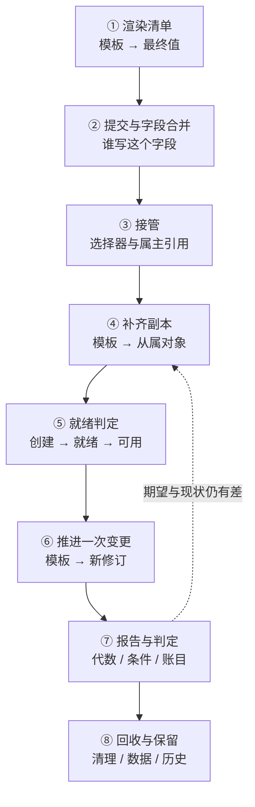

---
tags:
  - Kubernetes
  - 工作负载
  - 控制器
  - 学习地图
created: 2026-09-25
---

# 工作负载与控制器

## 知识地图

### 一条收敛链：一份清单到一组被维持的副本

这条主线跟着**一份清单**：从"它在集群之外被渲染成最终值"开始，到"集群里有一组被持续维持、并且能被判定的副本"，再到"它被改版、被回退、被清理"。

| #   | 环节        | 该环节解决的问题                  | 到这里要能说清                                             |
| --- | --------- | ------------------------- | -------------------------------------------------- |
| 1   | 渲染清单      | 同一份结构怎么在不同环境取不同的值         | 渲染为什么在集群之外完成；参数化的范围到哪里为止                 |
| 2   | 提交与字段合并   | 同一个对象的字段归谁写               | 按字段合并与整体替换的差异；冲突从哪里来、怎样才算解决            |
| 3   | 接管        | 控制器凭什么认为这些对象是它的           | 选择器与属主引用各决定什么；两个控制器互抢时长什么样              |
| 4   | 补齐副本      | 期望数量怎么变成实际对象              | 不同控制器把模板变成什么名字、什么标签的对象                     |
| 5   | 就绪判定      | 什么算"可用"，什么只是"创建出来了"       | 认领数、就绪数、可用数、终止中实例这四本账的分工                  |
| 6   | 推进一次变更    | 模板变了之后副本怎么换过去             | 修订由什么触发；上界、下界、闸门与截止各是哪一项                  |
| 7   | 报告与判定     | 系统怎么把结果说成人能判断的结论          | 期望代数与观测代数、两类条件各回答什么问题                     |
| 8   | 回收与保留     | 退出之后还剩什么                  | 结束保留期、历史上限与存储保留策略各决定什么                     |

### 五条横向关系

| 横向关系   | 贯穿内容                        | 结论                                     |
| ------ | --------------------------- | -------------------------------------- |
| 归属与漂移  | 渲染 → 提交 → 字段归属 → 另一个写入者 → 值被改回 | "改了又变回去"的问题，先看字段归谁，而不是先看谁登录过集群     |
| 身份与副本  | 命名与打标 → 选择器认领 → 属主引用 → 终止中的实例 | 名字只是名字；可互换与有身份是两种契约，重建后不变的项各不相同   |
| 修订与版本  | 模板 → 新修订 → 推进 → 回退 → 历史上限     | "回不到上一个版本"要么是修订没有产生，要么是历史被回收      |
| 就绪与可用  | 探针 → 就绪 → 最小就绪时长 → 可用 → 端点集合 | 创建、就绪、可用是三件事，发布速率由就绪判定实际控制       |
| 回收与保留  | 缩容 → 结束 → 清理 → 存储与历史保留      | 退出之后还剩什么由保留规则决定，不由"删掉了"这句话决定     |

## 术语速查

只收本章新引入的词。

| 名词 | 一句话解释 | 展开于 |
| --- | --- | --- |
| 工作负载（workload） | 声明"运行什么样的实例、要几个、怎么更新"的对象；它只声明期望，实际状态由控制器维持 | 原理：控制器家族与副本契约 |
| 清单（manifest） | 描述期望态的文本，是变更的提案与事故的比对基准 | 原理：清单与字段所有权 |
| 渲染（render） | 在集群之外把模板与参数变成最终值的过程；集群只收到渲染产物 | 原理：清单与字段所有权 |
| 模板化（templating） | 让同一份结构在不同环境取不同值的做法；参数只存在于集群之外的渲染过程里 | 原理：清单与字段所有权 |
| 漂移（drift） | 集群中对象的当前值偏离清单源所表达的值 | 原理：清单与字段所有权 |
| Pod 模板（Pod template） | 决定从属实例长什么样的字段；它的变化是产生新修订的唯一触发条件 | 原理：发布与回退的机制 |
| 边车容器（sidecar container） | 在容器组里声明为初始化容器、但带容器级"始终重启"策略的常驻容器 | 原理：Pod 与容器组合 |
| 修订（revision） | 一份模板对应的一次版本；无状态对象用带模板哈希的从属对象表示，有顺序的对象用修订哈希表示 | 原理：发布与回退的机制 |
| 修订保留上限（`revisionHistoryLimit`） | 保留多少历史修订；它决定能回退多远 | 原理：发布与回退的机制 |
| 副本集（ReplicaSet，`ReplicaSet`） | 只维持"数量等于期望"这一条不变量的对象，不管版本 | 原理：控制器家族与副本契约 |
| 发布对象（Deployment，`Deployment`） | 维持"某一份模板对应一组副本，并按策略在模板之间推进"的对象 | 原理：控制器家族与副本契约 |
| 有状态集（StatefulSet，`StatefulSet`） | 维持编号连续、名字与存储稳定的副本集合，并规定推进顺序 | 原理：有状态与一次性任务 |
| 守护进程集（DaemonSet，`DaemonSet`） | 维持"每个符合条件的节点上恰好一个实例"的对象 | 原理：控制器家族与副本契约 |
| 任务（Job，`Job`）与定时任务（CronJob，`CronJob`） | 前者维持"成功完成的实例数达到目标"，后者按时间表产生任务 | 原理：有状态与一次性任务 |
| 无头服务（Headless Service） | 不分配集群虚拟地址的服务；域名解析直接返回实例地址，因此提供稳定的实例级入口 | 原理：有状态与一次性任务 |
| 卷声明模板（`volumeClaimTemplates`） | 为每个实例生成一份独立存储声明的字段 | 原理：有状态与一次性任务 |
| 有序就绪（`OrderedReady`） | 默认的实例管理策略：前一个实例就绪之后才处理下一个 | 原理：有状态与一次性任务 |
| 序号（ordinal） | 有状态实例编号，是实例身份的一部分；起始值与范围可配置 | 原理：有状态与一次性任务 |
| 就绪判定（readiness probe） | 决定实例是否可以进入端点集合的判定；没有它时实例一创建就被视为就绪 | 原理：Pod 与容器组合 |
| 最小就绪时长（`minReadySeconds`） | 实例需要保持就绪多久才计入可用；缺省为 0 | 原理：控制器家族与副本契约 |
| 最大超额（`maxSurge`）与最大不可用（`maxUnavailable`） | 推进期间允许超出与允许低于期望副本数的数量；两者不能同时为 0 | 原理：发布与回退的机制 |
| 进度截止时间（`progressDeadlineSeconds`） | 判定推进停滞的等待时间；它只报告，不改变动作 | 原理：发布与回退的机制 |
| 暂停（`paused` / `suspend`） | 暂停推进或暂停调度；两者都不停止对象的维持与状态变化 | 原理：发布与回退的机制 |
| 分区（`partition`） | 有顺序对象的更新分界，只更新序号不小于分界的实例 | 原理：发布与回退的机制 |
| 并发策略（`concurrencyPolicy`） | 定时任务对重叠执行的处理方式：允许、禁止或替换 | 原理：有状态与一次性任务 |
| 启动截止（`startingDeadlineSeconds`） | 定时任务允许延迟启动的上限；超过即跳过本次计划 | 原理：有状态与一次性任务 |
| 完成目标与并行度（`completions` / `parallelism`） | 任务需要成功完成的实例数与同时运行的实例数上限 | 原理：有状态与一次性任务 |
| 重试上限与活跃截止时间（`backoffLimit` / `activeDeadlineSeconds`） | 任务的失败预算与总时限；后者优先 | 原理：有状态与一次性任务 |
| 结束保留期（`ttlSecondsAfterFinished`） | 任务结束之后被连级联清理的等待时间 | 原理：有状态与一次性任务 |
| 失败分类（`podFailurePolicy`）与替换时机（`podReplacementPolicy`） | 按失败原因决定重试或终止，以及何时建立替换实例 | 原理：有状态与一次性任务 |
| 完成判定策略（`successPolicy`） | 索引任务在部分序号成功时即可判定成功的条件 | 原理：有状态与一次性任务 |
| 卷声明回收策略（`persistentVolumeClaimRetentionPolicy`） | 集合被删除或缩容时对应的存储声明是保留还是删除；缺省均为保留 | 原理：有状态与一次性任务 |
| 蓝绿与金丝雀发布（blue-green / canary） | 同时存在两组副本、由入口方向决定流量的两种发布方式 | 原理：发布与回退的机制 |

### 关键字段的读法

| 看什么 | 是什么 | 单位 | 判据 | 与谁同看 | 看到它转向哪一步 |
| --- | --- | --- | --- | --- | --- |
| 字段归属记录 | 每个字段当前归谁写 | 结构数组 | 同一个字段只应有一个当前管理者 | 交付流程与上一次提交注解 | 管理者不是交付流程 → 先划清字段归属 |
| `spec.replicas` | 期望副本数 | 整数，缺省为 1 | 只有期望态变化才递增期望代数 | 状态里的认领数与就绪数 | 期望与现状长期不等 → 先看控制器是否跟上了期望 |
| `spec.template` | 决定实例长什么样的模板 | Pod 模板 | 只有它变化才产生新修订 | 模板哈希标签 | 模板已改而无新修订 → 改动没有真正写入 |
| `spec.selector` | 控制器认领对象的范围 | 标签选择器 | 无状态发布对象的这一项创建后不可改 | 模板中的标签 | 选择器与模板标签不匹配 → 实例不会被自己认领 |
| `metadata.ownerReferences[]` | 从属对象指向属主 | 结构数组 | 决定级联与认领；不能跨命名空间 | 选择器匹配结果 | 属主已不存在 → 对象成为孤儿 |
| 模板哈希标签 | 同一份模板的标识 | 字符串标签 | 不同值对应不同修订 | 各实例的标签分组 | 出现多个值 → 存在多份模板的副本 |
| 期望代数与观测代数 | 期望被改动的次数与控制器处理到的次数 | 整数 | 相等才说明控制器看过最新期望 | 条件与副本账目 | 长期不等 → 问题在控制器侧 |
| 状态里的副本账目 | 认领数、就绪数、可用数、终止中副本数 | 计数 | 认领数 ≥ 就绪数 ≥ 可用数 | 期望副本数与最小就绪时长 | 认领数正常而可用数偏低 → 回到就绪判定 |
| 状态里的两类条件 | "数量是否达标"与"推进是否在进行"的判定 | 结构数组 | 看类型、状态、原因与翻转时间 | 实例状态与副本账目 | 推进条件为假且原因是超时 → 目标实例始终没有就绪 |
| `spec.strategy.rollingUpdate` | 推进的上界与下界 | 整数或百分比，缺省均为 25% | 两者不能同时为 0 | 就绪判定与最小就绪时长 | 可用容量不足但副本数正确 → 先看这两项与就绪判定 |
| `spec.progressDeadlineSeconds` | 判定推进停滞的等待时间 | 秒，缺省 600 | 必须大于最小就绪时长；只报告不处置 | 推进条件的原因短语 | 报告超时 → 回到实例层 |
| `spec.revisionHistoryLimit` | 保留多少历史修订 | 计数，缺省 10 | 设为 0 等于放弃回退能力 | 历史修订列表 | 目标修订不在列表里 → 无法回退 |
| `spec.updateStrategy.rollingUpdate.partition` | 有顺序对象的更新分界 | 整数，缺省 0 | 只更新序号不小于分界的实例 | 各实例的修订哈希 | 分界不动 → 实例集合被有意保持在两个修订上 |
| `spec.podManagementPolicy` | 实例创建与删除是否串行 | 枚举，缺省有序就绪 | 并行只放宽顺序，不放宽身份 | 实例状态与序号 | 实例停在某个序号 → 前一个实例未就绪 |
| `spec.serviceName` 与 `spec.volumeClaimTemplates` | 稳定网络入口与稳定存储的来源 | 字符串与结构数组 | 名字与存储稳定，地址不稳定 | 域名解析结果与存储声明状态 | 实例重建后入口失效 → 说明引用的是地址而不是域名 |
| `spec.persistentVolumeClaimRetentionPolicy` | 集合删除与缩容时的存储回收规则 | 结构体，缺省均为保留 | 缩容不等于释放存储 | 存量存储声明数量与容量 | 资源未随缩容释放 → 这是缺省行为 |
| 任务的完成目标、重试上限与时间上限 | 实例数量、失败预算与总时限 | 整数与秒 | 时间上限优先于重试上限 | 成功、失败与活跃计数 | 判定失败 → 先分清重试用尽还是时间用完 |
| `spec.concurrencyPolicy` 与 `spec.startingDeadlineSeconds` | 并发处理方式与允许延迟启动的上限 | 枚举与秒 | 小于检查间隔的延迟上限可能导致永不调度 | 最近计划时间与实例创建时间 | 整轮缺失 → 先看这两项与暂停标志 |

## 篇目索引

| # | 篇目 | 一句话 |
| --- | --- | --- |
| 01 | [[Kubernetes/04_工作负载与控制器/01_原理_清单与字段所有权\|原理：清单与字段所有权]] | 渲染为什么在集群之外；字段归谁写决定了改动会不会被改回去 |
| 02 | [[Kubernetes/04_工作负载与控制器/02_原理_Pod与容器组合\|原理：Pod 与容器组合]] | 最小运行单元的四个共享条件、容器的四种类别、状态与终止流程 |
| 03 | [[Kubernetes/04_工作负载与控制器/03_原理_控制器家族与副本契约\|原理：控制器家族与副本契约]] | 认领机制、各成员维持的不变量，以及认领数、就绪数与可用数三本账 |
| 04 | [[Kubernetes/04_工作负载与控制器/04_原理_发布与回退的机制\|原理：发布与回退的机制]] | 修订由模板触发；上界、下界、闸门与截止共同决定推进；回退的边界 |
| 05 | [[Kubernetes/04_工作负载与控制器/05_原理_有状态与一次性任务\|原理：有状态与一次性任务]] | 三重稳定、存储回收关系、任务的完成与失败语义、定时任务的调度语义 |
| 06 | [[Kubernetes/04_工作负载与控制器/06_体系_一份清单到一组被维持的副本\|体系：一份清单到一组被维持的副本]] | 八个环节走完，再收拢为归属、身份、修订、可用与保留五条横向关系 |
| 07 | [[Kubernetes/04_工作负载与控制器/07_实操_发布与副本的现场观测\|实操：发布与副本的现场观测]] | 工具与问题的对应、字段读法、四类故障现场的定位表与破坏性动作边界 |
| 08 | [[Kubernetes/04_工作负载与控制器/08_判例_高频误判\|判例：高频误判]] | 十条四段式判例：把"提交成功""副本数正确""回滚过了"这些信号读对 |
| 09 | [[Kubernetes/04_工作负载与控制器/09_治理_工作负载与清单的治理\|治理：工作负载与清单的治理]] | 上限配在哪一层、交什么产物、与其它领域怎么接；一次回退不收口的处置 |
