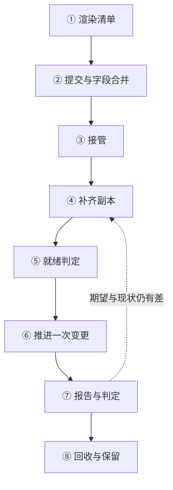

---
tags:
  - Kubernetes
  - 工作负载
  - 收敛
  - 体系
created: 2026-09-25
---

# 一份清单到一组被维持的副本

## 1. 这条链经过的八个环节

从"我改了一份清单"到"集群里有一组被维持着、并且能被判定的副本"，中间发生的事可以拆成八个环节。它们的信息是单向传递的：渲染决定提交什么，提交决定字段归谁，归属决定谁能在下一次写入中获胜，选择器决定谁认领这些对象，模板决定派生出的从属对象长什么样，就绪判定决定什么算可用，修订决定这次改动能否被回退，回收策略决定退出之后还剩什么。

| #   | 环节      | 谁在做        | 产物              | 第一个判据               |
| --- | ------- | ---------- | --------------- | ------------------- |
| 1   | 渲染清单    | 交付流程与模板    | 一份可以直接提交的期望态文本  | 渲染产物与集群对象是否逐字段一致    |
| 2   | 提交与字段合并 | 客户端与服务端    | 对象上的字段归属记录      | 每个字段当前归谁，冲突有没有出现    |
| 3   | 接管      | 工作负载对象的控制器 | 从属对象上的属主引用      | 选择器是否匹配、对象是否已有控制器属主 |
| 4   | 补齐副本    | 控制器        | 一组从属对象          | 期望副本数与认领数是否相等       |
| 5   | 就绪判定    | 节点与端点维护方   | 就绪与可用两组计数       | 就绪数、可用数与终止中的实例      |
| 6   | 推进一次变更  | 控制器        | 一份新的修订与其副本集合    | 模板是否产生新修订、推进条件报告什么  |
| 7   | 报告与判定   | 控制器        | 期望代数、处理代数与两方面条件 | 两个代数是否相等、条件的原因短语    |
| 8   | 回收与保留   | 控制器与保留策略   | 被清掉的对象与保留下来的数据  | 清理规则与保留上限           |

**这条链的性质是"维持"而不是"执行"。** 第 8 个环节的产出会重新成为第 4 个环节的输入：退出之后如果认领数低于期望，控制器会再补齐一次。因此这条链在稳态下不停地小幅修正，而不是一次性走完；判断现场时必须先分清"正在修正"与"修正不动"。

## 2. 八个环节各自的现场口径

| 环节 | 正常表现 | 失败表现 | 第一个动作 |
| --- | --- | --- | --- |
| 渲染清单 | 渲染产物与集群对象逐字段一致 | 集群里的值在清单源里找不到，或者清单源里的值没有出现在集群里 | 用产物比对对象，而不是用模板 |
| 提交与字段合并 | 每个字段只有一个当前管理者 | 同一字段出现两个管理者，值在两边来回跳动 | 看字段归属记录，确认这第二个写入者是否需要继续写 |
| 接管 | 从属对象带属主引用，归属稳定 | 对象成了孤儿，或者两个控制器互抢 | 核对选择器是否重叠 |
| 补齐副本 | 认领数等于期望副本数 | 认领数长期少于期望，且没有报错 | 看控制器是否在处理最新期望，再看被拒绝的写入 |
| 就绪判定 | 就绪数逐步上升并转为可用 | 实例创建成功但长期不就绪 | 取实例的等待原因与探针结果，不要先改副本数 |
| 推进一次变更 | 新修订建立、旧修订缩到零、条件报完成 | 推进长期停在同一比例 | 看新修订的实例状态与就绪判定，再看推进条件的原因 |
| 报告与判定 | 处理代数追上期望代数，条件与实际一致 | 代数长期不等，或者条件与实例状态矛盾 | 代数落后查控制器侧，条件矛盾查更细的实例状态 |
| 回收与保留 | 结束的对象按规则清理，需要保留的留下 | 对象一直不被清理，或者数据被意外清掉 | 先确认清理规则与保留上限，再判断这是不是缺陷 |

## 3. 五条横向关系

八个环节纵向走一遍之后，现场反复被追问的是五条横向关系：

| 横向关系 | 贯穿内容 | 结论 |
| --- | --- | --- |
| 归属与漂移 | 渲染 → 提交 → 字段归属 → 另一个写入者 → 值被改回 | "改了又被改回去"的问题，先看字段归谁，而不是先看谁登录过集群 |
| 身份与副本 | 命名与打标 → 选择器认领 → 属主引用 → 终止中的实例 | 名字只是名字；身份与归属分别由标签、属主引用与序号决定 |
| 修订与版本 | 模板 → 新修订 → 推进 → 回退 → 历史回收 | "回不到上一个版本"要么是修订没产生，要么是历史被回收 |
| 就绪与可用 | 探针 → 就绪 → 最小就绪时长 → 可用 → 端点集合 | 创建、就绪、可用是三件事，发布速率由就绪判定实际控制 |
| 回收与保留 | 缩容 → 结束 → 清理 → 存储与历史保留 | 退出之后还剩什么，由保留规则决定，不由"删掉了"这句话决定 |

## 4. 关键字段的完整读法

| 看什么 | 是什么 | 单位 | 判据 | 与谁同看 | 看到它转向哪一步 |
| --- | --- | --- | --- | --- | --- |
| 字段归属记录 | 每个字段当前归谁写 | 结构数组 | 同一个字段只应有一个当前管理者 | 对象的当前值与交付流程 | 出现交付流程之外的管理者 → 先划清这个字段归谁 |
| 对象上的上一次提交注解 | 客户端应用记录的上一次提交内容 | 注解，JSON 文本 | 注解里存在、而当前值不是它的字段，会被下一次客户端提交改回去 | 字段归属记录 | 值反复变回旧值 → 说明有人在用客户端合并覆盖 |
| `metadata.generation` 与观测代数 | 期望被改动的代数与控制器处理到的代数 | 整数 | 两者相等才说明控制器看过最新期望 | 条件与副本账目 | 长期不等 → 问题在控制器侧，不在应用侧 |
| 状态里的认领数与期望副本数 | 期望与现状的数量 | 整数 | 相等只说明数量补齐 | 就绪数与可用数 | 数量相等而业务仍异常 → 继续看就绪与可用 |
| 状态里的就绪数 | 通过就绪判定的实例数 | 计数 | 与认领数比较得到差值 | 实例的等待原因与探针配置 | 差值长期不变 → 实例卡在启动或探针环节 |
| 状态里的可用数 | 可以计入可用下限的实例数 | 计数 | 需要经过最小就绪时长的等待 | 发布耗时与可用下限 | 可用数低于期望而副本数正确 → 看最小就绪时长与终止中的实例 |
| 状态里的终止副本数字段 `status.terminatingReplicas` | 正在终止但尚未消失的实例 | 计数 | 它解释"为什么真实实例数比期望多" | 宽限期与资源占用 | 数值长期不降 → 实例收尾时间超过宽限期 |
| 模板哈希标签 | 同一份模板的标识 | 字符串标签 | 出现在修订对象与它建出的实例上 | 各实例的标签分布 | 出现多个哈希 → 当前存在多份模板的副本，推进正在进行或已停住 |
| 修订哈希标签 | 有状态或有顺序负载的修订标识 | 字符串标签 | 用于判断实例属于哪个修订 | 状态里的当前修订与目标修订 | 目标修订长期不变 → 推进没有开始或被停住 |
| 属主引用 | 从属对象指向属主 | 结构数组 | 决定级联与认领；不能跨命名空间 | 选择器匹配结果 | 属主已不存在 → 对象成为孤儿，需要显式接管或清理 |
| 两组条件 | 数量是否达标、推进是否在进行 | 结构数组 | 看类型、状态、原因与翻转时间四项 | 实例状态与副本账目 | 推进条件为假且原因是超时 → 目标实例始终没有就绪 |
| 重试与时间上限 | 任务的失败预算与总时限 | 整数与秒 | 时间上限优先于重试上限 | 状态里的失败原因与成功计数 | 判定为失败 → 先分清是重试用尽还是时间用完 |
| 结束保留期 | 任务结束后被清理的等待时间 | 秒，缺省不清理 | 清理是连级联删除 | 历史对象数量与结束时间 | 任务与实例同时消失 → 保留期生效 |
| 存储保留策略 | 集合删除与缩容时卷声明的回收规则 | 结构体，缺省均为保留 | 缩容不等于释放存储 | 存量卷声明数量与容量 | 资源没有随缩容释放 → 这是缺省行为，需要显式配置 |

## 5. 任务卡：这条链在现场的应用

1. **接一个工作负载时**：确认它属于哪一类契约（可互换、有身份、逐节点、一次完成），以及期望副本数由什么决定；产物是一段"对象、契约与责任方"的记录。
2. **改一次模板时**：确认这次改动的目的是产生新修订还是只调整数量；产物是一次变更记录，写清它会触发几份修订。
3. **发一次版本时**：确认推进的上界与下界、就绪判定是否存在、最小就绪时长与进度截止时间是否匹配；产物是一份带参数与预计发布时长的发布记录。
4. **判断发布是否完成时**：先看期望代数与处理代数，再看推进条件的类型、状态与原因，最后看新修订的实例是否已就绪并计入可用。
5. **回退时**：先确认目标修订还在不在，再确认清单源是否同步回写；产物是一份回退记录，写清恢复了什么、没有恢复什么。
6. **排查数量不齐时**：先分清认领数、就绪数、可用数与终止中实例这四本账，再决定往控制器侧、实例侧还是保留策略侧走。
7. **排查任务没成功时**：按判定原因把"重试用尽""时间用完""被判定为不可重试"分开；产物是一份失败归类记录。
8. **交付一张工作负载卡**：把对象、契约、期望来源、字段归属、修订保留上限、存储保留策略与清理规则写成一份可核对的清单，供升级与交接使用。

## 6. 常见坑

| 常见做法 | 后果 |
| --- | --- |
| 用模板比对集群，而不是用渲染产物 | 比对结果永远对不上，排查方向从一开始就错了 |
| 用"我改过了"代替字段归属记录 | 无法判断改动是否真的写入，也无法解释为什么值又变回去 |
| 用副本数判断发布完成 | 认领数、就绪数、可用数是三本账，副本数对不等于发布完成 |
| 用名字或创建时间判断归属 | 归属由选择器与属主引用决定，名字与时间都不构成判据 |
| 缺省依赖"删除即结束" | 有结束保留期与存储保留策略的对象不会立刻消失，也不会立刻释放资源 |
| 认为回退之后事情就结束了 | 清单源没有被回写时，下一次交付会把新版本重新推进 |
| 把有状态负载与无状态负载套用同一套推进参数 | 有状态对象存在顺序与角色关系，参数含义不同 |

## 7. 要点自测

**问：为什么这条链在稳态下是"维持"而不是"执行"？**

答：因为第 8 个环节的产出会重新进入第 4 个环节：只要有实例退出，控制器就再补齐一次。因此稳态下对象一直在被小幅修正，判断现场的关键是分清"正在修正"与"修正不动"。

**问：为什么"改了又被改回去"要从字段归属起手？**

答：因为值的变化只说明有人写入了新值，不说明是谁的目的更正确。字段归属记录回答"这个字段现在归谁"，把它与交付流程、自动伸缩机制和其它写入者对照，才能确定是有人覆盖还是有人越权。

**问：判断发布是否完成需要哪些判据？**

答：两类：期望代数与处理代数是否相等，说明控制器是否看过最新期望；推进条件报告的是"进行中"还是"已完成"以及原因，说明推进是否走完。副本数只说明数量补齐，不构成完成判据。

**问：为什么"删掉了"不等于"资源释放了"？**

答：因为结束保留期与存储保留策略都可能在对象退出之后继续占用资源：任务对象与它的实例会保留一段时间，有状态负载的卷声明在缩容或缺省配置下继续存在。资源的实际释放要按保留规则核对，而不是按删除动作核对。

**问：回退时要交出什么产物，为什么必须包含清单源？**

答：产物是一份回退记录，写清回退到的修订、恢复了哪些对象、以及哪些内容没有恢复（外部副作用、数据与清单源）。清单源必须一起回写，否则下一次交付会把新版本重新推进上来，形成"回退了又自己变回去"的现场。

**第一反应不要做什么**：不要用模板比对集群；不要用副本数判断发布完成；不要用名字或创建时间判断归属；不要把删除当成资源释放；也不要把回退当成一次完整的收口。

## 参考文档

- Kubernetes 官方文档中关于工作负载管理、发布对象、有状态集、守护进程集、任务与定时任务的章节：各环节的字段、默认值与判定条件。
- 官方文档中关于服务端应用与字段管理的章节：字段归属、冲突与接管。
- 官方文档中关于 Pod 生命周期、就绪判定与终止流程的章节：就绪、可用与终止三本账。
- 官方文档中关于服务与端点的章节：实例被摘除与进程退出之间的关系。
- 本库的版本口径见 `Kubernetes/写作规约.md`；一切默认值与保留上限以**现场生效配置**为准。
