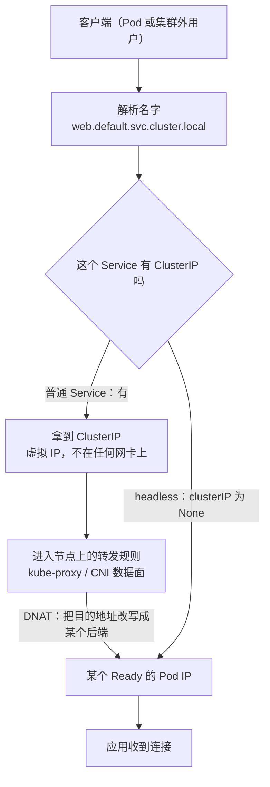
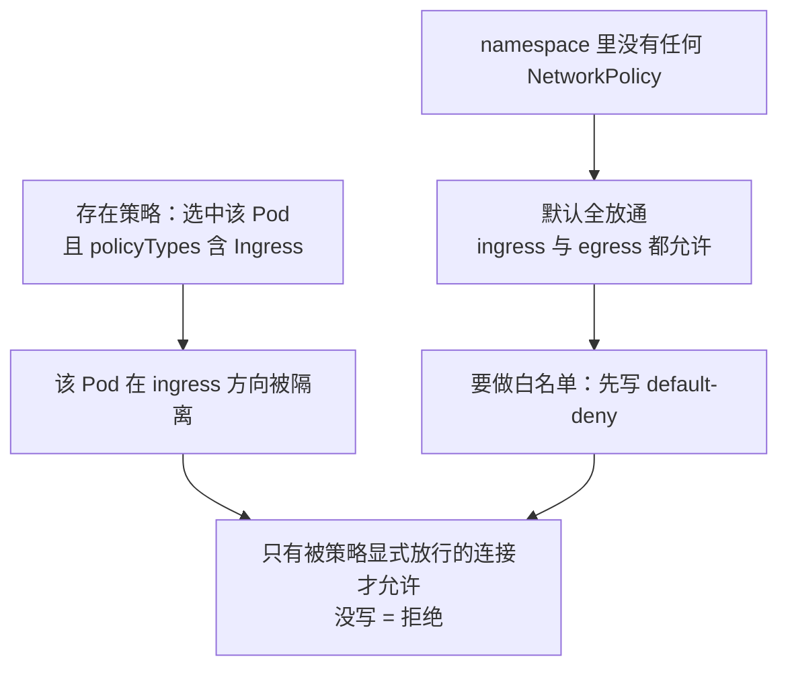

---
tags:
  - Kubernetes
  - 网络
  - Service
  - DNS
  - CNI
created: 2026-09-13
---

# 网络

> 本笔记对应 [[Kubernetes/00_简介]] 的「阶段 4」。目标：能讲清 ClusterIP 这个「虚拟 IP」到底是什么、一次「客户端 → Service → Pod」的流量在每一跳被谁改写成什么、DNS 怎么把名字变成 IP，以及 Ingress / Gateway API / CNI / NetworkPolicy 分别在南北向和东西向的哪一层做事。
>
> 关联复习：[[01_核心架构与对象模型]]、[[02_工作负载与控制器]]、[[03_调度_资源_QoS]]
>
> 说明：本笔记的字段、默认值与行为均以官方文档和 Kubernetes 源码为准，主要对照 Kubernetes 1.37 时期的文档；凡有版本差异的地方都标注引入或弃用版本，落地前请对照集群实际版本。

## 0. 30 秒速览

> [!abstract] 这一页只要记住六句话
> - **ClusterIP 是「虚拟 IP + 转发规则」，不是一个进程**：它不绑定在任何网卡上，也没有哪台主机「拥有」它。`kube-proxy`（或 CNI 的数据面）在每台节点上把发往 VIP 的包改写（DNAT）成某个后端 Pod IP，所以 `ping ClusterIP` 不通是常态，**不能**据此判断 Service 坏了。
> - **Service 只做 L4**：按 IP + 端口把连接分给后端。它看不懂 Host 和 Path；要做七层路由得靠 Ingress 或 Gateway API。
> - **访问固定是两段**：先由 DNS 把名字解析成 ClusterIP（**headless 例外**，直接返回 Ready 的 Pod IP），再由节点上的规则做 DNAT 到某一个 Pod。排障也要按这两段分别查。
> - **kube-proxy 正在换代**：iptables 是 1.37 的默认；nftables 是官方推荐的演进方向（要求内核 5.13+），也是官方给出的 ipvs 替代品；**ipvs 自 1.35 起弃用、1.40 起默认关闭、1.43 移除**。集群也可以完全不跑 kube-proxy——Cilium 这类 CNI 用 eBPF 自己接管 Service 转发。
> - **NetworkPolicy 默认全放通**：一个 namespace 里没有任何策略时，ingress 和 egress 全部允许。「默认拒绝」要自己显式写出来，而且**只有支持策略执行的 CNI 才会真的拦得住**。
> - **入口层已经换代**：Ingress API 自 1.19 GA 后**已被冻结**，官方推荐改用 Gateway API；社区用得最多的 Ingress NGINX 已于 2026 年 3 月退役，之后不再有任何安全修复。

> [!tip] 怎么用这篇笔记
> 首学按顺序读；复习时只看第 0 节和第 10~11 节，其余按需回查。
> 标着「动手验证」的折叠块可以直接跑，建议至少亲手跑一遍「Service + EndpointSlice + DNS」和「default-deny + 单独放行 DNS」。

## 1. Kubernetes 网络模型

### 1.1 四个问题，四种解法

官方把集群网络拆成四个独立问题。记住这张表，后面每一节都能对上位置：

| 通信场景 | 由谁解决 | 关键机制 |
| --- | --- | --- |
| 同一个 Pod 内的容器互访 | Pod / 容器运行时 | 共享同一个 network namespace，走 `localhost` |
| Pod ↔ Pod（东西向） | CNI 插件 | 每个 Pod 一个集群内唯一 IP，**可直连、不经 NAT、不经代理** |
| Pod → Service | kube-proxy 或 CNI 的 Service 实现 | ClusterIP 虚拟 IP + DNAT |
| 集群外 → Service（南北向） | Service（NodePort / LoadBalancer）+ Ingress / Gateway API | 端口映射与七层路由 |

模型的核心承诺是「Pod 在网络上看起来像一台主机或虚拟机」：每个 Pod 有自己的 IP，端口空间独立，因此**不需要**像早期的容器方案那样做端口映射或容器间 link。（一个例外：Windows 上这条「无 NAT 直连」的约定不适用于 `hostNetwork` 的 Pod。）

### 1.2 三段互不重叠的地址空间

集群里同时存在三类 IP，谁分配、谁使用都不一样：

| 地址类型 | 含义 | 谁来分配 | 谁能直接路由到 |
| --- | --- | --- | --- |
| Node IP | 节点真实网卡地址 | `kubelet` 或 `cloud-controller-manager` | 集群内外都可直达 |
| Pod IP | Pod 的集群内地址 | **CNI 插件**的 IPAM | 集群内部直达（外部要看具体方案） |
| Service IP（ClusterIP） | 虚拟地址 | `kube-apiserver`，取自 `--service-cluster-ip-range` | **没有任何主机直接持有**，靠转发规则实现 |

三段地址段不能重叠，且都要提前规划好：Pod 网段由 CNI 决定，Service 网段由 `kube-apiserver` 启动参数决定，改起来都很痛。

> [!note] 关于 Service 网段的扩展
> 1.27 引入、1.33 起稳定的 `IPAddress` / `ServiceCIDR` API 把 ClusterIP 的分配搬到了 API 层，好处是可以动态增删 Service 网段（不再受单个 CIDR 大小限制），并让 Gateway API 这类扩展能直接引用分配的 IP。老集群通常只有一个由 `--service-cluster-ip-range` 生成的名为 `kubernetes` 的 `ServiceCIDR`。

### 1.3 只有一小部分模型由 Kubernetes 自己实现

> [!important] K8s 定义接口，数据面由外部组件提供
> - Pod 网络命名空间的创建交给实现 CRI 的容器运行时；
> - Pod 网络本身由 CNI 插件负责（Linux 上绝大多数运行时通过 CNI 对接）；
> - Service 转发 Kubernetes 提供了默认实现 `kube-proxy`，但 CNI 可以自己实现一套更紧耦合的（Cilium 就是典型）；
> - NetworkPolicy 通常也由 CNI 实现——**简单插件可能根本不支持**，此时 API 对象还在，但写下去没有任何效果；
> - 南北向入口由 Ingress Controller / Gateway API 实现提供。

这条「接口在 K8s，实现在外部」的分工，是后面所有选型问题（换 CNI、换 kube-proxy 模式、换入口控制器）能成立的根本原因。

## 2. Service 与虚拟 IP

### 2.1 五种类型与它们的语义

| 类型 | 暴露范围 | 关键行为 |
| --- | --- | --- |
| `ClusterIP` | 仅集群内 | 默认类型，分配一个 ClusterIP |
| `NodePort` | 集群外（每个节点） | 在 ClusterIP 之上，**每台节点**都监听同一个端口 |
| `LoadBalancer` | 集群外（云 LB） | 在 NodePort 之上，由云厂商的负载均衡器接入 |
| `ExternalName` | 集群内解析 | 映射到外部 DNS 名，**没有任何代理，也不分配 IP** |
| Headless（`clusterIP: None`） | 集群内 | 不分配 VIP、不做转发，DNS 直接返回 Pod IP |

几个必须记死的细节：

- **类型是叠加关系**：`NodePort` 包含 `ClusterIP` 的能力，`LoadBalancer` 默认又包含 `NodePort`（可以用 `allocateLoadBalancerNodePorts: false` 关掉这层）。
- **NodePort 默认范围 30000–32767**，由 `--service-node-port-range` 决定；不指定 `nodePort` 就从该范围自动分配。
- **`ExternalName` 只对集群内 DNS 生效**。它返回的是 CNAME，集群外解析不到；而且对依赖 Host 头或证书的协议（HTTP/HTTPS）会出问题——客户端连的是 `my-svc.my-ns`，源站看到的却是真实域名。
- **headless Service 依然需要 `type: ClusterIP`**，只是额外把 `.spec.clusterIP` 显式设为字符串 `None`；`None` 和不写是两种含义。
- **`externalIPs` 自 1.36 起已弃用**，官方建议改用外部 LB 控制器或 Gateway API 实现，新集群不要再用它对外暴露服务。

> [!important] 什么时候该用 headless
> headless 的价值是把「一组 Pod 的地址」直接交给客户端，由客户端自己做选择：StatefulSet 的稳定标识（见 [[02_工作负载与控制器]]）、需要客户端侧负载均衡、或要对接外部服务发现机制时用它。代价是**服务端负载均衡与故障摘除的责任转移给了客户端**。

### 2.2 EndpointSlice：Service 的后端清单

Service 本身只是一份声明，真正描述「有哪些后端可以接流量」的是 EndpointSlice。

- 带 `selector` 的 Service 由控制面**自动**创建并维护 EndpointSlice，内容是当前匹配且 Ready 的 Pod IP + 端口。
- 每个 EndpointSlice 默认最多 100 个端点，由 `kube-controller-manager` 的 `--max-endpoints-per-slice` 控制，上限 1000。
- 每个 EndpointSlice 只承载一种地址类型（IPv4 一个对象、IPv6 一个对象）。
- 每个端点有三个 condition：`ready`、`serving`、`terminating`。`ready` 本质是「`serving` 且不在 `terminating`」；Pod 进入终止流程后 `ready` 变 false，但 `serving` 可能仍为 true——这正是「摘流量」与 `SIGTERM` 之间存在竞态的原因（见 [[01_核心架构与对象模型]] 的优雅下线部分）。
- **老的 `Endpoints` API 已弃用**：超过 1000 个后端时它会被截断并打上 `endpoints.kubernetes.io/over-capacity: truncated`，导致只会向最多 1000 个后端转发。新代码一律读 EndpointSlice。
- 没有 `selector` 的 Service 不会自动生成端点，需要手工维护 EndpointSlice（或临时用旧的 Endpoints）。这类 Service 常用于「把集群外的数据库、中间件接进集群内部寻址」。

> [!example]- 动手验证：Service、EndpointSlice 与 DNS 一次看全
> ```yaml
> apiVersion: apps/v1
> kind: Deployment
> metadata:
>   name: web
> spec:
>   replicas: 2
>   selector:
>     matchLabels:
>       app: web
>   template:
>     metadata:
>       labels:
>         app: web
>     spec:
>       containers:
>         - name: web
>           image: nginx:1.27
>           ports:
>             - name: http
>               containerPort: 80
>           readinessProbe:
>             httpGet:
>               path: /
>               port: 80
> ---
> apiVersion: v1
> kind: Service
> metadata:
>   name: web
> spec:
>   selector:
>     app: web
>   ports:
>     - name: http
>       port: 80
>       targetPort: http
> ```
> 验证：
> ```text
> kubectl get svc web -o wide
> # 预期：CLUSTER-IP 有值（如 10.96.x.x），PORT(S) 为 80/TCP
> kubectl get endpointslice -l kubernetes.io/service-name=web
> # 预期：出现 1 个 EndpointSlice，ENDPOINTS 为两个 Pod IP:80
> kubectl run test --rm -it --image=busybox:1.36 --restart=Never -- sh
> # 容器内：
> nslookup web                      # 解析到 ClusterIP，形如 web.default.svc.cluster.local
> wget -qO- http://web              # 返回 nginx 首页
> ```
> 再把 `readinessProbe` 改坏（例如路径写成 `/not-exist`）重新发布，观察 `kubectl get endpointslice -l kubernetes.io/service-name=web` 里的端点被摘掉——**Service 不通的第一现场就在这里**，而不是在 Service 对象上。

### 2.3 为什么不直接用 DNS 轮询

官方给 Service 设计了虚拟 IP + 代理，而不是让 DNS 返回多个 A 记录做轮询，原因有三条：

1. DNS 实现历来不严格遵守 TTL，缓存过期的结果很常见；
2. 有些应用只在启动时解析一次域名，之后永久缓存；
3. 就算应用老实重解析，低 TTL 也会把大量查询压到 DNS 上，反而成为新的瓶颈。

再加上会话保持、端口映射、后端健康摘除这些需求，DNS 轮询无法承担 Service 的职责。

### 2.4 一次访问的完整路径：DNS 解析 + DNAT



几个容易讲错的点：

- **DNAT 发生在「流量进入集群的那台节点」上**，不是发生在目标 Pod 的节点上。
- **规则只按 Service IP + 端口匹配**，命中后选一个后端并改写目的地址；iptables 模式下默认是**随机**挑选后端（不是轮询，也不是最少连接）。
- **回包路径靠 conntrack 记录还原**，不需要反向再走一遍规则，所以客户端看到的是「自己在跟 ClusterIP 说话」。
- **源 IP 是否保留分情况**：集群内部的 Pod 访问 ClusterIP 时不改写源 IP；经 NodePort / LoadBalancer 从外部进来的流量，源 IP 可能被 SNAT 成节点地址，想让后端看到真实客户端 IP 就得用 `externalTrafficPolicy: Local`（代价见 2.6）。
- **`ping ClusterIP` 通常不通**：转发规则是按端口（TCP/UDP/SCTP）匹配和改写的，ICMP 不在其中。这不能说明 Service 有问题，排查要换成 `nc -vz`、`wget` 这类按端口的探测。

### 2.5 kube-proxy 的几种模式

每台 Linux 节点默认都会跑 `kube-proxy`，它 watch Service 和 EndpointSlice，把转发规则编程进内核。它**本身不是流量的必经之路**，更像一个「规则编程器」：

| 模式 | 当前状态（1.37 文档） | 关键点 |
| --- | --- | --- |
| `iptables` | **1.37 的默认** | 按 Service / 端点生成 iptables 规则，默认随机后端；规则数随 Service 与端点数线性增长 |
| `nftables` | 官方推荐的演进方向 | 要求内核 **5.13+**；端点变更同步更快、内核中处理包更高效；被官方明确定位为 iptables 与 ipvs 两者的替代 |
| `ipvs` | **1.35 起弃用**；1.40 起默认关闭（可用 `KubeProxyIPVS` 特性门控重新启用）；1.43 移除 | 内核哈希表实现，调度算法更丰富；但内核 IPVS API 与 Service 语义并不匹配，一直没能把边缘场景做对 |
| `kernelspace` | Windows 节点唯一可用 | 在 Windows 的 VFP 中编程规则 |

还有几处细节值得记住：

- **不显式配置 mode 会跟随默认值变化**。官方明确提醒：为了避免升级时转发后端被意外切换，所有集群都应该在 kube-proxy 配置里**显式写死**用哪种模式。
- iptables 模式的性能优化在 1.28 之后已经大幅改善（不再每次全量重写规则），可通过 `minSyncPeriod`（默认 1s）和 `syncPeriod` 调同步行为；`sync_proxy_rules_duration_seconds` 明显大于 1 秒时，才考虑调大 `minSyncPeriod`。
- **nftables 模式有两处行为差异**：NodePort 默认只监听节点的主 IP（`--nodeport-addresses primary`），而不是像 iptables 那样在所有本地地址上可达；并且它不与 nftables 防火墙做兼容处理，需要自己放通 NodePort 范围。

> [!important] 关于 ipvs 的常见过时认知
> 「大规模集群就用 ipvs」是几年前的结论，现在**不能再作为新集群的选型依据**：ipvs 已进入移除流程，nftables 才是官方给的替代路径。如果内核太老跑不了 nftables，官方建议退回 iptables 模式，而不是继续用 ipvs。

### 2.6 流量策略与流量分布

两个字段控制「流量发给哪些后端」：

| 字段 | 取值 | 语义 |
| --- | --- | --- |
| `internalTrafficPolicy` | `Cluster`（默认）/ `Local` | 集群内部流量是发给所有 Ready 端点，还是只发给本节点的端点；`Local` 且本节点无端点时**直接丢弃** |
| `externalTrafficPolicy` | `Cluster`（默认）/ `Local` | 外部流量（NodePort / LoadBalancer）同上；`Local` 会**保留客户端源 IP**，但流量只落在有本节点后端的节点上 |

配套要理解的两件事：

- **`externalTrafficPolicy: Local` 的负载可能严重不均**：外部 LB 会把流量平均打到各节点，但只有「有后端 Pod 的节点」才能转发，于是 Pod 分布不均时节点间负载也不同。好在 kube-proxy 的 `/healthz`（10256 端口）会据此返回 200/503，让云 LB 的健康检查把没有后端的节点摘掉。
- **`sessionAffinity: ClientIP`** 可以让同一客户端的连接固定落到同一个 Pod，默认粘性时长 10800 秒（3 小时）。它只解决会话粘性，不能替代七层亲和。

此外 1.37 提供了 `spec.trafficDistribution` 用来表达「偏好近处」，取值 `PreferSameZone`、`PreferSameNode`（旧的 `PreferClose` 已弃用）。它和流量策略的关系是：**策略字段设成 `Local` 时优先于 `trafficDistribution`**；设成默认的 `Cluster` 时才由 `trafficDistribution` 决定就近偏好。

## 3. DNS：Service 与 Pod 的名字

### 3.1 记录类型与命名

集群 DNS（通常是 CoreDNS）watch API，为 Service 和 Pod 生成记录：

| 对象 | 记录 | 形式 |
| --- | --- | --- |
| 普通 Service | A / AAAA | `my-svc.my-ns.svc.cluster.local` → **ClusterIP** |
| headless Service | A / AAAA | 同名记录 → **每个 Ready Pod 的 IP**（多值） |
| 命名端口 | SRV | `_http._tcp.my-svc.my-ns.svc.cluster.local` |
| Pod | A / AAAA | `<Pod-IP-用横线替换点>.<ns>.pod.cluster.local` |
| 带 `hostname` + `subdomain` 的 Pod | A / AAAA | `hostname.subdomain.my-ns.svc.cluster.local`，要求同名 headless Service 存在 |

要点：

- **headless 是「名字 → Pod IP 列表」**，由客户端自己选；普通 Service 是「名字 → 一个稳定的 VIP」，客户端完全不知道后端是谁。
- Pod 记录里的 IP 是**用横线替换点的形式**（如 `10-244-1-5.default.pod.cluster.local`），且**默认不会为普通 Pod 创建基于 Pod 名字的 A 记录**（除非提供 hostname）。
- `ExternalName` 类型的 Service **没有 ClusterIP、没有代理**，只能通过集群 DNS 以 CNAME 的方式解析到外部名字。
- 跨 namespace 必须写全限定名（`data.prod`、`data.prod.svc.cluster.local`），只写 `data` 会限定在自身 namespace。

### 3.2 `/etc/resolv.conf` 与 `ndots:5`

kubelet 为每个 Pod 写出的解析配置大致是这样：

```text
nameserver 10.32.0.10
search <namespace>.svc.cluster.local svc.cluster.local cluster.local
options ndots:5
```

`ndots:5` 的含义是：**名字里的点少于 5 个时，先按相对名字逐个拼接 search 域去查**，全部失败后才按绝对名字再查一次。它带来的实际影响：

- 短名字（`web`）能被自动补全为 `web.<ns>.svc.cluster.local`，这是它存在的意义；
- 查询**集群外**的域名（比如 `api.internal.corp`，只有 2 个点）时会先被拼上三条 search 域，产生多余查询；
- 用完整 FQDN（结尾带点，如 `example.com.`）可以绕开 search 展开，避免这类额外查询与 NXDOMAIN。

### 3.3 `dnsPolicy`

| 取值 | 语义 |
| --- | --- |
| `ClusterFirst` | **未显式指定时的默认值**：非集群域名的查询转发给上游 DNS |
| `Default` | 继承所在节点的解析配置（注意：**它不是默认值**） |
| `ClusterFirstWithHostNet` | `hostNetwork: true` 的 Pod 必须显式指定，否则会退化成 `Default` |
| `None` | 忽略集群 DNS 配置，必须用 `dnsConfig` 自行提供 |

`dnsConfig` 可以追加 `nameservers`（最多 3 个）、`searches`（最多 32 条）和 `options`，用于微调 `ndots`、超时与重试。

### 3.4 生产坑

| 常见做法或说法 | 事实或后果 |
| --- | --- |
| 只管 ingress 的 default-deny，忘了 egress | default-deny 一出，**DNS 查询也会被拦**，表现为「服务全挂、报域名解析失败」。必须单独放行到集群 DNS 的 egress |
| `hostNetwork` Pod 只设 `ClusterFirst` | 会退化成节点自身的 DNS 配置，解析不到集群内的 Service 名字 |
| 把 DNS 当纯内部依赖不设冗余 | CoreDNS 副本数太少或与节点规模不匹配时，DNS 抖动会放大成全局故障；节点数多时可以用官方的 NodeLocal DNSCache 做本机缓存 |
| 用 ClusterIP 硬编码替代域名 | Service 重建后 ClusterIP 可能变化；应用要连名字而不是 IP |

## 4. 东西向：NetworkPolicy

### 4.1 隔离模型：默认全通

NetworkPolicy 是**加在 Pod 上**的 L3/L4 规则，理解它的关键是「隔离（isolation）是逐方向的」：



- Pod 默认**既不是** ingress 隔离也不是 egress 隔离。
- 只要有任何一条策略选中它、并且 `policyTypes` 里包含 `Ingress`，它在 ingress 方向就被隔离，此后**只允许策略里列出的连接**。
- 多条策略的效果是**并集**（additive），因此评估顺序不影响结果；也意味着**你无法用一条策略去「拒绝」另一条策略允许的东西**。
- 一条连接要被允许，**源侧的 egress 和目标侧的 ingress 必须同时允许**；任何一侧没放行，连接就不通。
- 来自 Pod 所在节点自身的流量**始终允许**（部署顺序上不需要为此补策略）。
- 未写 `policyTypes` 时，默认包含 `Ingress`；只有策略里存在 egress 规则时才会自动加上 `Egress`——这是个很容易看漏的默认行为。

### 4.2 选择器语义：最容易写错的地方

`from` / `to` 里支持四种选择器，其中两个写在一起时是 **AND**、分开写是 **OR**：

| 选择器 | 含义 |
| --- | --- |
| `podSelector` | 同 namespace 内的 Pod |
| `namespaceSelector` | 某个 namespace 内的所有 Pod |
| 同一 `from` 条目里同时写 `namespaceSelector` + `podSelector` | 指定 namespace 里的指定 Pod（**AND**） |
| 两个分开的 `from` 条目，各写一个 | 「本 ns 的某些 Pod」**或**「某些 ns 的所有 Pod」（**OR**） |

这是 YAML 缩进差异导致语义完全不同的经典陷阱，拿不准时用 `kubectl describe networkpolicy <name>` 看解释结果。

`ipBlock` 用来放行集群外 CIDR。要注意：**Pod IP 是临时且不可预测的，不要用 `ipBlock` 去描述 Pod**；另外集群入口/出口链路可能改写源或目的 IP，改写发生在 NetworkPolicy 处理之前还是之后并没有统一规定，取决于 CNI、云厂商和 Service 实现，因此 `ipBlock` 有时匹配到的是 LB 或节点地址。

### 4.3 默认拒绝模板

最常用的三件套（namespace 级 `podSelector: {}` 表示选中该 namespace 的所有 Pod）：

```yaml
apiVersion: networking.k8s.io/v1
kind: NetworkPolicy
metadata:
  name: default-deny-ingress
  namespace: prod
spec:
  podSelector: {}
  policyTypes:
    - Ingress
```

把 `policyTypes` 换成 `[Ingress, Egress]` 就是「双向默认拒绝」。**注意官方明确的警告：egress 全拒绝会连 DNS 一起拦掉**，必须额外放行到集群 DNS 的流量，否则表现是应用大面积解析失败。

> [!example]- 动手验证：default-deny 之后再把 DNS 单独放行
> 先只做 default-deny，再放行 DNS，观察「先挂后通」：
> ```yaml
> apiVersion: networking.k8s.io/v1
> kind: NetworkPolicy
> metadata:
>   name: default-deny-all
>   namespace: default
> spec:
>   podSelector: {}
>   policyTypes:
>     - Ingress
>     - Egress
> ---
> apiVersion: networking.k8s.io/v1
> kind: NetworkPolicy
> metadata:
>   name: allow-dns-egress
>   namespace: default
> spec:
>   podSelector: {}
>   policyTypes:
>     - Egress
>   egress:
>     - to:
>         - namespaceSelector:
>             matchLabels:
>               kubernetes.io/metadata.name: kube-system
>       ports:
>         - protocol: UDP
>           port: 53
>         - protocol: TCP
>           port: 53
> ```
> 验证（前提：CNI 支持策略执行，例如 Calico / Cilium）：
> ```text
> kubectl run test --rm -it --image=busybox:1.36 --restart=Never -- sh
> # 只应用第一条时：nslookup kubernetes.default 会超时失败
> # 应用第二条后：再次 nslookup 应能解析成功，而访问其他 Service 仍然不通
> ```

### 4.4 边界：L3/L4、CNI 依赖

- NetworkPolicy 只管 **TCP、UDP，以及需要 CNI 支持时才有的 SCTP**；对 ICMP、ARP 等其他协议的行为**未定义**——可能被允许也可能被拒绝，取决于具体实现。
- 端口范围可以用 `port` + `endPort`（1.25 起稳定）表达，`endPort` 必须 ≥ `port` 且不能脱离 `port` 单独使用。
- **不能用字段直接写 namespace 名字**，必须用 `namespaceSelector` 配合标签；好在控制面会给每个 namespace 打上不可变的 `kubernetes.io/metadata.name: <名字>`，所以「按名字选中某个 namespace」是标准写法（本文的 DNS 放行示例用的就是它）。
- **策略生效存在时间窗**：官方明确说明，新建 NetworkPolicy 时，在网络插件处理完成之前，受影响的 Pod 可能以「未受保护」的状态启动，之后才被隔离。也就是说策略不是瞬时生效的强边界。
- 规矩是：**API 是 K8s 的，执行是 CNI 的**。Flannel 这类只做连通性的插件不执行策略；此时策略对象能被创建，但没有任何效果——这是多租户集群最容易踩的空。策略写完之后，务必用真实流量验证一次。

## 5. 南北向：Ingress 与 Gateway API

### 5.1 Ingress：七层入口（已冻结）

Ingress 用 Host + Path 把 HTTP/HTTPS 请求路由到 Service：

```yaml
apiVersion: networking.k8s.io/v1
kind: Ingress
metadata:
  name: minimal-ingress
spec:
  ingressClassName: nginx
  tls:
    - hosts:
        - www.example.com
      secretName: example-tls
  rules:
    - host: www.example.com
      http:
        paths:
          - path: /
            pathType: Prefix
            backend:
              service:
                name: web
                port:
                  number: 80
```

要记住的规则：

- **必须有 Ingress Controller**，只创建 Ingress 对象没有任何效果。
- `pathType` 必填，取值 `Exact`（精确、区分大小写）、`Prefix`（按 `/` 分段的前缀匹配）、`ImplementationSpecific`（匹配逻辑交给具体实现）。
- `ingressClassName` 决定由哪个控制器接管；没写时若是集群中唯一的默认 IngressClass，会套用默认值（默认类通过 `ingressclass.kubernetes.io/is-default-class: "true"` 标注）。
- TLS 部分引用 `kubernetes.io/tls` 类型的 Secret，且必须包含 `tls.crt` / `tls.key`；Ingress 只支持 443 一个 TLS 端口，并假定 TLS 在入口处终结。默认规则（没有 host 的规则）不能配 TLS，TLS 段里的 host 必须能匹配规则里的 host。
- **Ingress 只处理 HTTP/HTTPS**。要暴露其他协议，用 NodePort / LoadBalancer。
- **Ingress API 已被冻结**：GA 于 1.19，官方明确表示「不会移除，但也不会再有任何新特性」，并推荐新平台使用 Gateway API。

### 5.2 一个高频混淆：两个「NGINX Ingress」

| 项目 | 仓库 | 现状 |
| --- | --- | --- |
| **Ingress NGINX**（早期常被叫作 `ingress-nginx`） | `kubernetes/ingress-nginx`，社区维护 | **已于 2026 年 3 月退役**：此后不再有 release、bugfix，也不会再修安全问题；已有部署不会坏，产物继续可用，但必须开始迁移 |
| **NGINX Ingress Controller**（早期常被叫作 `nginx-ingress`） | `nginx/kubernetes-ingress`，NGINX 官方（F5）维护 | 仍在积极开发并提供商业支持；NGINX 系的 Gateway API 实现是另一个独立项目 NGINX Gateway Fabric |

两者同名不同源（代码库、维护方、发布节奏都不同），是文档和工单里最常见的乌龙来源。**结论很直接：新集群不要再以 Ingress NGINX 作为入口方案**，社区最终的推荐是把入口迁到 Gateway API；即使继续用 Ingress，也要换成仍在维护的实现。

### 5.3 Gateway API

Gateway API 是 SIG Network 的一组 API（**以 CRD 形式安装，不是集群内置**），官方定位是 Ingress 的现代替代：

- **角色分离**：`GatewayClass`（基础设施提供方）→ `Gateway`（集群运维，管地址、端口、TLS 终结）→ `HTTPRoute` / `GRPCRoute`（应用开发，管路由规则）。这解决了 Ingress 时代「应用团队和平台团队抢同一份注解」的矛盾。
- **表达力更强**：按 Header 匹配、按权重拆分流量、跨 namespace 的路由（需要显式 `allowedRoutes` 授权）等，过去只能靠厂商私有注解实现的能力现在是标准字段。
- **稳定 API**：`GatewayClass`、`Gateway`、`HTTPRoute`、`GRPCRoute`、`TLSRoute`、`TCPRoute`、`UDPRoute`、`ListenerSet`、`BackendTLSPolicy`、`ReferenceGrant` 都是 `v1`。
- **默认只接受同 namespace 的 Route**，跨 namespace 需要在 Gateway 的 `allowedRoutes` 里放行，形成双向信任模型。

### 5.4 Ingress 与 Gateway API 怎么选

| 维度 | Ingress | Gateway API |
| --- | --- | --- |
| 协议 | 只支持 HTTP/HTTPS | HTTP、HTTPS、gRPC、TLS、TCP、UDP |
| 能力扩展 | 靠控制器私有注解 | 标准字段 + 可扩展的 API 分层 |
| 团队分工 | 一份对象混用，靠约定 | 基础设施 / 集群运维 / 应用开发三层分离 |
| 成熟度 | GA 已冻结，不再演进 | v1 稳定，生态仍在快速扩张 |
| 适用建议 | 存量集群维持现状，择机迁移 | 新平台首选 |

## 6. CNI：Pod 网络与数据面选型

### 6.1 CNI 负责什么

CNI 插件决定了集群的 Pod 网络如何实现，至少要解决：给 Pod 分配 IP（IPAM）、把 Pod 接入网络（同节点与跨节点连通）、以及**是否执行 NetworkPolicy**。不同插件的差异就出在这三件事的做法和附加能力上。

### 6.2 主流选择

| 插件 | 数据面 | 网络策略 | 典型场景 |
| --- | --- | --- | --- |
| Flannel | VXLAN 等 overlay（也支持 host-gw） | **不执行** NetworkPolicy | 学习环境、只要 Pod 能互通的小集群 |
| Calico | 非 overlay 的 BGP 路由，或 IP-in-IP / VXLAN；可选 iptables、eBPF、nftables、VPP、Windows 数据面 | 完整策略能力，含主机端点与 namespace/集群级范围 | 需要策略、需要与物理网络对接（BGP）的中大型集群 |
| Cilium | eBPF | L3–L7 策略，基于身份而非地址 | 追求性能、可观测性与 Service 转发一体化；可完全替代 kube-proxy |

选型的判断顺序建议是：

1. **是否必须执行 NetworkPolicy**——要的话直接排除 Flannel 这类纯连通性方案；
2. **是否要 overlay**——能用 BGP 与底层网络直接对接（裸金属、自建 IDC）时，非 overlay 路径更短、更好排障；云环境通常只能用 overlay；
3. **是否要用 eBPF 一体化数据面**——把 Service 转发、策略、可观测性都收敛到一处。

### 6.3 kube-proxy 被 CNI 取代之后，Service 还怎么走

集群完全可以不部署 `kube-proxy`，由 CNI 自己实现 Service 转发。以 Cilium 为例：

- 它用 eBPF 的 socket-level load balancing 在**连接建立时**就完成后端选择，很多场景下根本不需要给每个 Service 写逐包的 NAT 规则；
- 部署时用 `kubeProxyReplacement=true` 打开替代能力，并在 `kubeadm init` 阶段用 `--skip-phases=addon/kube-proxy` 直接不装 kube-proxy；
- 从已有集群切换时需要**删除 kube-proxy 的 DaemonSet 和 ConfigMap**（否则升级时会被重新装回来），切换过程中已有 Service 连接会中断。

常见追问「没有 kube-proxy 了，`KUBERNETES_SERVICE_HOST` 和 kubernetes.default Service 怎么办？」——答案是这个 ClusterIP 依然由 API Server 分配，只是**由 CNI 的数据面而不是 kube-proxy 来兑现转发**。控制面侧的 Service 对象没有任何变化。

## 7. 延伸：RDMA / RoCE 在 Kubernetes

这一节是「阶段 8（GPU / AI）」的网络前置，落在同一套 CNI 机制上。

### 7.1 三个组件的关系

| 组件 | 作用 |
| --- | --- |
| **Multus CNI** | 「元插件」：它去调用别的 CNI 插件，让一个 Pod 挂上多块网卡——`eth0` 仍是集群默认网络，`net0` / `net1` 等附加网卡接不同的物理网络。配置以 `NetworkAttachmentDefinition` 这类标准 CRD 描述 |
| **SR-IOV Network Device Plugin** | 发现并上报 SR-IOV 网卡的 **VF（虚拟功能）**为扩展资源，让调度器能按「有几块可用 VF」来调度 |
| **SR-IOV CNI + RDMA CNI** | 创建时把分配给 Pod 的 VF 插进 Pod 的网络命名空间；RDMA CNI 作为链式插件，进一步把对应的 RDMA 接口移进容器命名空间，实现 RDMA 流量的隔离 |

### 7.2 RDMA 容器的既有约束

按 `rdma-cni` 的官方要求，要在一个 Pod 里跑 RDMA 至少要凑齐：

- 硬件：支持 RDMA 的 SR-IOV 网卡（官方列出的支持型号从 ConnectX-4 起）；
- 内核：**5.3.0 及以上**（RDMA 设备支持网络命名空间隔离的版本），并加载 RDMA 相关模块；用厂商 OFED 驱动时要求 OFED 4.7+；
- 软件栈：`iproute2` 等工具链版本与内核匹配；
- Kubernetes 侧：SR-IOV device plugin（并配置 RDMA 相关的资源）、Multus **3.4.1+**、以及按总线类型对应的 SR-IOV CNI（以太网场景用 sriov-cni）。

### 7.3 概念对齐：RDMA 与 RoCE

- **RDMA**（Remote Direct Memory Access）的核心是让网卡直接读写对端内存：绕开内核协议栈、零拷贝、CPU 几乎不参与，所以延迟极低、吞吐极高；代价是内存注册、连接管理等一整套自己的语义。
- **RoCE**（RDMA over Converged Ethernet）就是把 RDMA 跑在以太网上，因此它可以复用现有以太网交换机和 IP 网络；与之并列的是运行在专用 InfiniBand 网络上的 RDMA。
- RoCE 有两个版本的差别在封装层次：**RoCEv1 直接跑在以太网二层、不能路由**，**RoCEv2 封装在 IP/UDP 之上、可以跨三层**（Linux 内核源码里的注释写得很直白：`RoCE v2 (as RoCE v1 isn't routable)`）。所以生产上部署的基本都是 RoCEv2，代价是拥塞控制与无损网络的配置责任转移到了网络侧。
- 在 K8s 里，附加网卡是**独立的数据面**：集群的 Service、DNS 以及 NetworkPolicy 通常只覆盖默认网络（`eth0`），RDMA 流量走的是附加网卡，附加网卡上的策略能力要按所选 CNI 的实现单独确认。也就是说，「打通 RDMA」和「让 Service 能访问这个 Pod」是两件要分别验证的事。

> [!tip] 结合你的背景怎么讲
> 面试或设计题里，把这条链路讲成一句话就够了：**Multus 负责「多张网卡」→ SR-IOV device plugin 负责「有 VF 可分配」→ sriov-cni + rdma-cni 负责「把 VF 和 RDMA 设备真正放进 Pod 的命名空间」**，然后补一句「集群网络与 RDMA 网络是两套数据面，各自需要独立验证」。这正好能衔接阶段 8 的多机通信与拓扑调度。

## 8. 生产实践清单

- **显式配置 kube-proxy 模式**，不要依赖默认值；新的大规模集群优先评估 nftables，并把内核版本（5.13+）纳入基线。
- **不要再用 ipvs 作为新集群选型**，并给存量集群排好 1.40 / 1.43 两个时间点的迁移计划。
- **多租户默认策略是白名单**：每个业务 namespace 先上 default-deny（Ingress + Egress），再显式放行 DNS 与必要的上下游。
- **`externalTrafficPolicy: Local` 用之前先想清楚**：它能保留客户端真实 IP，但会造成节点间负载不均，必须确认外部 LB 使用 kube-proxy 的 10256 健康检查。
- **入口方案按生命周期选**：不要以已退役的 Ingress NGINX 作为新集群方案；新平台直接上 Gateway API，存量集群把迁移列入计划。
- **Service 选择器与端口用命名端口**（`targetPort: http`），改名换端口时不必动 Service。
- **有状态组件用 headless Service**，让每个 Pod 有稳定 DNS 名（见 [[02_工作负载与控制器]]）。
- **不要用 `externalIPs` 暴露服务**（1.36 起弃用），改用 LB 控制器或 Gateway API。
- **DNS 不是「配好就不用管」的组件**：核对 CoreDNS 副本数与节点规模，节点很多时用 NodeLocal DNSCache；对延迟敏感的场景注意 `ndots:5` 带来的额外查询。
- **overlay 网络要确认 MTU**：隧道封装会额外占用头部，Pod 侧 MTU 与底层不一致时的典型症状是「小请求正常、大响应卡死」，这种问题在 `curl` 通则、传大文件超时的时候最容易被误判成应用问题。

## 9. 排障速查

### 9.1 Service 访问不通

> [!tip] 第一反应不要是「重启 Pod」或者「看 Service 的 YAML」
> Service 本身几乎不会「坏」，绝大多数故障在**后端端点**或者**规则/DNS**这两层。按下面顺序走，能覆盖九成情况。

1. **端点还在不在**：`kubectl get endpointslice -l kubernetes.io/service-name=<svc>` 看 `ENDPOINTS` 是否为空。
   - 空 → 检查 Service 的 `selector` 是否与 Pod 的 Label 匹配、Pod 是否 Ready（就绪探针没过就不会进端点）、Namespace 是否一致。
2. **名字解析对不对**：在客户端 Pod 里 `nslookup <svc>`。解析失败 → 看 DNS 是否被 NetworkPolicy 拦、CoreDNS 是否正常、`dnsPolicy` 是否被改成 `Default`。
3. **端口对不对**：`port` 是 Service 对外端口，`targetPort` 是容器端口，两者不是一回事；用 `kubectl get svc -o wide` 对照端点里的端口。
4. **策略拦没拦**：临时观察是否在加了 NetworkPolicy 之后才不通，必要时用 default-allow 做二分定位。
5. **转发面是否正常**：大规模集群看 kube-proxy 的 `sync_proxy_rules_duration_seconds` 与节点负载；规则同步慢会导致「Service 明明有端点，但部分节点上就是不通」。

```text
kubectl get endpointslice -l kubernetes.io/service-name=<svc> -o wide
kubectl describe svc <svc>                     # 看 Selector / Endpoints / Port
kubectl get pods --show-labels | grep <label>  # 确认 Label 真的能选中
kubectl -n kube-system logs -l k8s-app=kube-dns --tail=100
```

### 9.2 DNS 解析异常

- 全集群解析失败：先看 CoreDNS Pod 是否正常、Service `kube-dns` 的端点是否为空。
- 只有某些 Pod 失败：多数是 NetworkPolicy 的 egress 拦截（default-deny 的常见副作用），或 `hostNetwork` Pod 的 `dnsPolicy` 设错。
- 解析「慢」而不是「失败」：优先怀疑 `ndots:5` 造成的多余查询，以及上游 DNS 的超时；关注 CoreDNS 的延迟与错误指标。

### 9.3 NodePort / LoadBalancer 不通

| 现象 | 优先怀疑 |
| --- | --- |
| 从节点上访问 NodePort 不通，到 Pod 直连正常 | 防火墙/安全组未放通 NodePort 范围（nftables 模式尤其需要自己放） |
| 只有部分节点能访问 | `externalTrafficPolicy: Local` 且这些节点上没有后端 Pod（属于预期行为） |
| 后端应用拿到的客户端 IP 全是节点 IP | 用了默认的 `externalTrafficPolicy: Cluster`，源 IP 被 SNAT |
| 云 LB 有后端但一直 502/不受理 | LB 健康检查目标不是 kube-proxy 的 10256 `/healthz`，或该节点被标记为不可用 |

## 10. 要点自测

复述时先盖住答案自己讲一遍，再展开对照。每张卡能在 3~5 分钟内脱稿讲完就算过关。

### 10.1 一条完整的南北向流量图

> [!question]- 画一条「用户 → Ingress → Service → Pod」的流量图，讲清每一跳的改写
> - **用户 → 入口地址**：DNS 把域名解析到入口控制器对外的 IP（云 LB 或节点 IP），TLS 通常在入口处终结。
> - **Ingress/Gateway → Service**：控制器按 Host/Path（Gateway API 还能按 Header、权重）选中一条规则，得到目标 Service 的**名字与端口**；它再通过 EndpointSlice（或直接解析）拿到后端，做一次七层代理转发——这一步是**应用层转发**，不是内核 NAT。
> - **Service → Pod**：如果控制器直接选中 Pod IP，这一步就没有 ClusterIP 参与；如果以 ClusterIP 为目标，则由节点上的转发规则做 **DNAT**，把目的地址改成某个 Ready 的 Pod IP，回包靠 conntrack 还原。
> - **写清改写点**：入口处可能改写 Host 头与源 IP（`externalTrafficPolicy` 决定保留与否）；ClusterIP 到 Pod 是目的地址改写；客户端源 IP 在 `Cluster` 策略下会被 SNAT。
> - **分清两种转发**：入口控制器是**七层代理**（新建一条连接），Service 是**四层 DNAT**（同一条连接改地址），这是这道题最想听到的区分。

### 10.2 kube-proxy 与 CNI 的边界

> [!question]- kube-proxy 被移出数据面后（例如 Cilium 替代），Service 流量还怎么走？
> - Service、ClusterIP、EndpointSlice 这些**控制面对象没有任何变化**，API Server 照常分配 ClusterIP。
> - 变化的是「谁把规则编程进数据面」：原来是 kube-proxy 写 iptables/IPVS/nftables 规则，现在是 CNI 用 eBPF（Cilium 的 socket-level load balancing 在连接建立时就选定后端）。
> - 落地动作：安装时开启 `kubeProxyReplacement`（或等价开关）、`kubeadm init --skip-phases=addon/kube-proxy`，并**删掉已存在的 kube-proxy DaemonSet 与 ConfigMap**，否则升级会把它装回来；切换过程会中断已有连接。
> - 语义边界：原本依赖 kube-proxy 行为的配置（如某些 `externalTrafficPolicy` 细节、节点上的 `/healthz` 健康检查端口）要按新实现重新确认。

### 10.3 ClusterIP 到底是什么

> [!question]- ClusterIP 是虚拟 IP 吗？它真的「绑定」在某个接口上吗？
> - 是虚拟 IP，但**不绑定在任何网卡上**，也没有主机对它做 ARP/ICMP 应答；它只是一条「匹配到就改写」的规则集合。
> - 所以 `ping ClusterIP` 通常不通（规则按 TCP/UDP/SCTP 端口匹配），`curl`/`nc` 才是有意义的探测方式。
> - 它的意义是：给「一组会变的 Pod」提供一个**稳定不变**的地址与服务端口，让客户端完全不需要知道后端是谁。
> - 对比 headless：`clusterIP: None` 时连这个虚拟地址都不分配，DNS 直接返回 Pod IP 列表，负载均衡责任交给客户端。

### 10.4 Service 类型怎么选

> [!question]- 五种 Service 类型分别用在什么场景？
> - **ClusterIP**：集群内部互访的默认选择。
> - **NodePort**：想让外部通过节点 IP + 固定端口访问，或自己接外部 LB；但它把端口暴露在每台节点上。
> - **LoadBalancer**：云上对外暴露的标准做法，底层通常还是 NodePort；可用 `allocateLoadBalancerNodePorts: false` 关掉那一层。
> - **ExternalName**：把集群外的服务以集群内名字引用，纯 DNS 映射、没有代理。
> - **Headless**：需要看到每个 Pod，或需要稳定单 Pod 标识（StatefulSet）。

### 10.5 NetworkPolicy 的默认行为

> [!question]- NetworkPolicy 默认是拒绝还是放行？怎么写才算白名单？
> - **默认全放通**：namespace 内没有任何策略时，ingress 与 egress 都允许；pod 也不被视为被隔离。
> - 一旦有策略选中 Pod 且 `policyTypes` 含对应方向，该方向就变成「只有显式放行的才通」。
> - 白名单的写法是先写一条 `podSelector: {}` 的空规则网住整个 namespace 做 default-deny，再逐条放行 DNS、上下游和监控采集。
> - 三个高频坑：忘了放行 DNS 导致全挂；`namespaceSelector` 与 `podSelector` 同条目 = AND、分开写 = OR；CNI 不支持策略执行时策略形同虚设。

### 10.6 kube-proxy 三种模式怎么讲

> [!question]- iptables / nftables / ipvs 现在该怎么选？
> - **iptables**：1.37 的默认，成熟稳定；大集群下规则数量随 Service 与端点线性增长，但 1.28 之后已经改为增量更新。
> - **nftables**：官方推荐的演进方向，也是官方给出的 ipvs 替代；要求内核 5.13+，端点变更同步更快；注意 NodePort 默认只监听主 IP。
> - **ipvs**：1.35 弃用、1.40 默认关闭、1.43 移除，**不能作为新集群选型依据**。
> - 补充一句最关键的实践：无论选哪个，都要**在配置里显式写死模式**，避免升级时默认值变化导致数据面被换掉。

### 10.7 DNS 的两个反直觉点

> [!question]- `dnsPolicy` 的默认值是什么？`ndots:5` 有什么副作用？
> - 默认不是 `Default` 而是 **`ClusterFirst`**；`hostNetwork` 的 Pod 要显式写 `ClusterFirstWithHostNet`，否则退化成继承节点配置。
> - `ndots:5` 让短名字先按 search 域展开（这正是 `web` 能解析成 `web.<ns>.svc.cluster.local` 的原因），代价是查询外部域名时也会被拼上三条 search 域，产生多余查询。
> - 生产含义：default-deny 的 egress 策略必须放行 DNS，否则整个 namespace 的应用会以「解析失败」的形式集体报错。

## 11. 回到路线图

完成本笔记后，回到 [[Kubernetes/00_简介]]：

- [ ] 能讲清 Service 五种类型的语义与选型
- [ ] 能画出「用户 → Ingress/Gateway → Service → Pod」的完整流量路径，并指出每一跳的改写
- [ ] 能解释 ClusterIP 为什么是虚拟 IP、为什么通常 ping 不通
- [ ] 能说明 kube-proxy 三种 Linux 模式的现状与选型依据，以及 CNI 接管 Service 转发后的变化
- [ ] 能讲清 DNS 记录形式、`dnsPolicy` 默认值与 `ndots:5` 的影响
- [ ] 能写出 namespace 级默认拒绝 + 放行 DNS 的 NetworkPolicy，并说清选择器 AND/OR 的差异
- [ ] 能对比 Ingress 与 Gateway API，并说出 Ingress NGINX 退役后的迁移方向
- [ ] 能对比 Flannel / Calico / Cilium 的能力差异，选出一个并说明理由
- [ ] 能讲清 Multus + SR-IOV + RDMA CNI 这条链路各段负责什么

> 推荐扩展阅读：官方文档中的 [Services, Load Balancing, and Networking](https://kubernetes.io/docs/concepts/services-networking/)、[Service](https://kubernetes.io/docs/concepts/services-networking/service/)、[Virtual IPs and Service Proxies](https://kubernetes.io/docs/reference/networking/virtual-ips/)、[EndpointSlices](https://kubernetes.io/docs/concepts/services-networking/endpoint-slices/)、[DNS for Services and Pods](https://kubernetes.io/docs/concepts/services-networking/dns-pod-service/)、[Network Policies](https://kubernetes.io/docs/concepts/services-networking/network-policies/)、[Ingress](https://kubernetes.io/docs/concepts/services-networking/ingress/)、[Gateway API](https://kubernetes.io/docs/concepts/services-networking/gateway/)、[Cluster Networking](https://kubernetes.io/docs/concepts/cluster-administration/networking/) 与 [Network Plugins](https://kubernetes.io/docs/concepts/extend-kubernetes/compute-storage-net/network-plugins/)。
>
> 退役与迁移背景：[Ingress NGINX Retirement: What You Need to Know](https://www.kubernetes.dev/blog/2025/11/12/ingress-nginx-retirement/)。
>
> RDMA 相关：[Multus CNI](https://github.com/k8snetworkplumbingwg/multus-cni)、[SR-IOV Network Device Plugin](https://github.com/k8snetworkplumbingwg/sriov-network-device-plugin)、[RDMA CNI](https://github.com/k8snetworkplumbingwg/rdma-cni)、[Cilium: Kubernetes Without kube-proxy](https://docs.cilium.io/en/stable/network/kubernetes/kubeproxy-free/)；RoCE 版本差异见 Linux 内核源码 [`drivers/infiniband/core/addr.c`](https://github.com/torvalds/linux/blob/master/drivers/infiniband/core/addr.c)。
