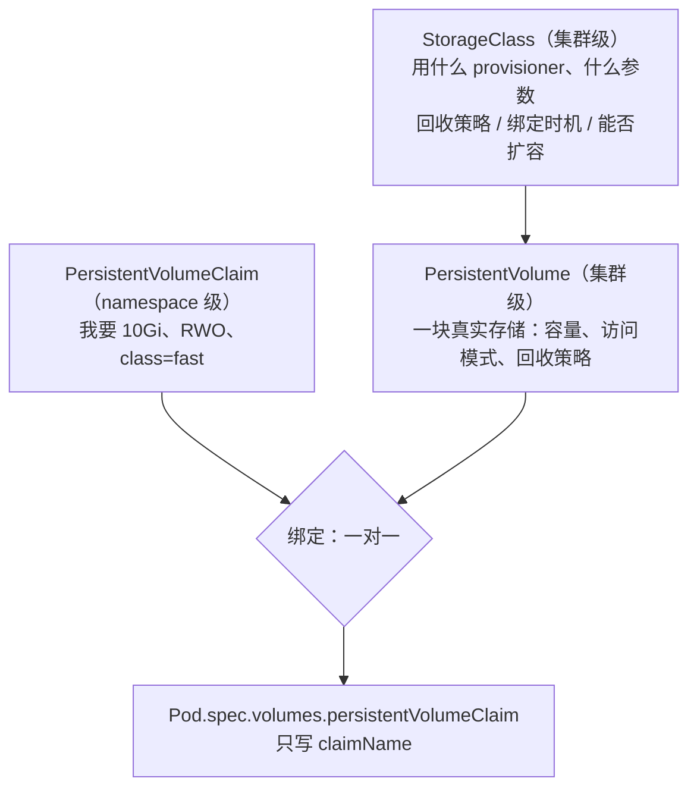
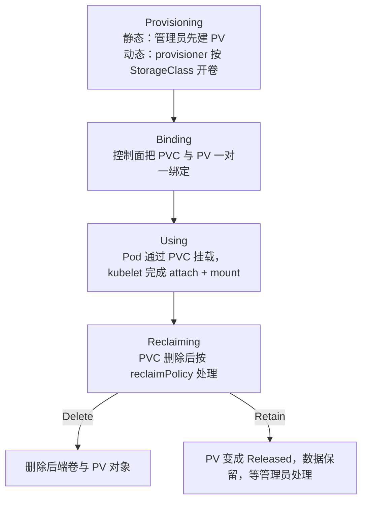
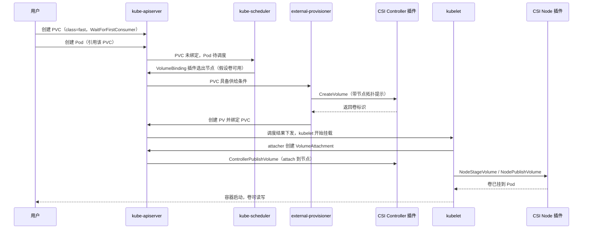

---
tags:
  - Kubernetes
  - 存储
  - PV
  - PVC
  - CSI
created: 2026-09-13
---

# 存储

> 本笔记对应 [[00_简介]] 的「阶段 5」。目标：能讲清「临时存储 / 持久存储 / 共享存储」三类需求分别由哪些卷类型承接，PV 与 PVC 如何把「谁提供存储」和「谁使用存储」解耦，动态供给与 CSI 由哪些组件分工完成，以及一个有状态应用从申请存储到回收数据的完整闭环（申请 → 绑定 → 挂载 → 扩容 → 快照 → 回收）。
>
> 关联复习：[[01_核心架构与对象模型]]（对象作用域与 finalizer）、[[02_工作负载与控制器]]（StatefulSet 与 `volumeClaimTemplates`）、[[03_调度_资源_QoS]]（`VolumeBinding` / `VolumeZone` / `NodeVolumeLimits` 调度插件）
>
> 说明：本笔记的字段、默认值与行为均以官方文档和 Kubernetes 源码为准，主要对照 Kubernetes 1.37 时期的文档；凡有版本差异的地方都标注引入或弃用版本，落地前请对照集群实际版本。

## 0. 30 秒速览

> [!abstract] 这一页只要记住六句话
> - **Volume 让数据活过容器**：容器可写层随容器重建消失，Pod 内多个容器要共享文件也必须显式挂同一份卷；但「挂卷」只解决共享，**不解决持久**——`emptyDir` 仍然随 Pod 消失。
> - **PV 与 PVC 把提供方和使用方拆开**：PV 是集群级资源（一块真实存储，由管理员或 provisioner 创建），PVC 是 namespace 级请求（我要多大、什么访问模式）。一条 PVC 与一个 PV 是**一对一**绑定，关系记录在双方的 `claimRef` / `volumeName` 上。
> - **删掉 PVC 之后数据还在不在，只看 `reclaimPolicy`**：动态供给出来的 PV **默认 `Delete`**，手工创建的 PV **默认 `Retain`**。`Recycle` 已弃用（1.37 只有 `nfs` 与 `hostPath` 还支持，行为就是 `rm -rf /thevolume/*`），不要再用。
> - **访问模式是能力声明，不是写保护**：`ReadWriteOnce` 的约束粒度是**单个节点**，同一节点上的多个 Pod 依然可以同时读写；要限制到「全集群只能被一个 Pod 挂载」，用 `ReadWriteOncePod`（1.29 稳定，仅 CSI 卷）。
> - **绑定时机与拓扑是最大的坑**：`volumeBindingMode` 缺省是 `Immediate`，PVC 一创建就开卷，多可用区集群里可能把卷开在 Pod 去不了的 zone；有拓扑约束的存储（云盘、本地盘）一律用 `WaitForFirstConsumer`。
> - **「有持久化」不等于「有数据可靠性」**：PVC 只保证 Pod 重建后数据还在。卷能不能扩容、能不能打快照、快照能不能恢复、集群外有没有备份，是另外四件事，必须分别验证。

> [!tip] 怎么用这篇笔记
> 首学按顺序读；复习时只看第 0 节和第 8~9 节，其余按需回查。
> 标着「动手验证」的折叠块可以直接跑，建议至少亲手跑一遍「静态供给 PV/PVC + Pod」和「动态供给 + 扩容」。

## 1. 概念

### 1.1 先问「这份数据要活多久」

容器有两个必须记住的事实：

- 容器的**可写层跟着容器走**：容器重建（`kubectl delete pod`、节点故障后重建、镜像升级）之后，写在容器里的文件就没了；
- 同一个 Pod 内的容器**共享网络命名空间，但不共享文件系统**，要共享文件必须显式挂同一份 Volume。

Volume 解决的是这两件事，但「挂上卷」不等于「数据持久」。**选卷类型之前先问数据要活多久、能不能丢、要不要跨节点**：

| 数据需求 | 生命周期要求 | 典型解法 |
| --- | --- | --- |
| 临时文件、缓存、容器间共享 | 容器重启可丢，Pod 生命周期内保留 | `emptyDir` |
| 配置、凭据、Pod 元数据 | 跟随 API 对象变化 | `configMap` / `secret` / `downwardAPI` / `projected` |
| 应用数据（数据库、队列、对象存储） | 必须活过 Pod 重建，可能要换节点 | `persistentVolumeClaim`（后端通常是 CSI 卷） |
| 多节点并发读写 | 跨节点共享同一份数据 | 支持 `ReadWriteMany` 的网络 / 文件存储 |
| 极致 IO，接受节点绑定 | 数据与节点同生共死 | `local` PV（+ 节点亲和） |

> [!important] 选型的出发点是「数据的生命周期」，不是「卷类型谁更高级」
> 反过来做就会得到「用 `hostPath` 跑数据库」这种生产事故：容器换个节点，数据就"不见了"，而且它还不计入本地临时存储的配额统计。

### 1.2 Volume 类型速查

| 类型 | 生命周期 | 典型用途 | 关键注意点 |
| --- | --- | --- | --- |
| `emptyDir` | 随 Pod（容器崩溃不影响） | 临时目录、缓存、容器间共享文件 | 默认落在节点磁盘，容量算在**节点本地临时存储**里；`sizeLimit` 超限会触发驱逐；`medium: Memory` 走 tmpfs，写入**计入容器内存**；Pod 被移除即永久删除 |
| `hostPath` | 独立于 Pod，绑定节点 | 节点级 agent 读 `/var/log`、静态 Pod 读配置 | 安全风险高（可能触达容器运行时 socket / kubelet 凭据，是容器逃逸的经典入口）；官方明确建议**能用 `local` PV 就不用它**；磁盘占用不计入临时存储，需要自己监控 |
| `local` | 独立于 Pod，绑定节点 | 本地 SSD/NVMe 提供高性能持久卷 | **只支持静态供给**（动态供给不支持），必须配 `nodeAffinity` + `WaitForFirstConsumer`；节点故障即不可用，且可能丢数据 |
| `configMap` / `secret` / `downwardAPI` / `projected` | 随 Pod（挂载点） | 配置与凭据注入 | env 不更新、卷挂载有延迟、`subPath` 不更新，三种消费方式语义完全不同（见 [[01_核心架构与对象模型]]） |
| `nfs` | 独立于 Pod | 跨节点共享（RWX） | 需要自建服务端与权限模型；官方的 StorageClass 里没有内置 NFS provisioner，动态供给要靠外部 provisioner |
| `csi` | 由驱动与回收策略决定 | 云盘、块存储、文件存储、分布式存储 | 今天的事实标准；供给、挂载、扩容、快照都由 CSI 驱动 + sidecar 完成 |
| `persistentVolumeClaim` | 取决于后端 PV | 所有需要持久化的有状态应用 | Pod 只引用 PVC 名字，不关心后端是云盘还是 Ceph |
| `ephemeral`（generic / CSI inline） | 随 Pod | 临时但想走 PVC 流程（generic）、驱动自定义临时卷（CSI inline） | generic ephemeral volume 会**真的创建一个 PVC**，由 Pod 的 ownerReference 触发 GC 一起删除；收 `Retain` 的类会变成"准持久" |
| `iscsi` / `fc` / `rbd` 等 in-tree 类型 | 取决于后端 | 存量集群 | in-tree 插件已整体迁往 CSI（`CSIMigration` 自 1.25 稳定），新集群不要以此选型 |

> [!note] `emptyDir` 的两个新细节
> `emptyDir.mode`（特性门控 `EmptyDirVolumeMode`，1.37 起 alpha，默认关闭）可以指定卷目录的 Unix 权限位；不设置时目录权限是 `0777`。给共享卷做权限收敛时值得留意这个字段。

### 1.3 三个对象，一层解耦



- **谁创建 PV**：管理员静态创建（提前造盘），或由 StorageClass 指定的 provisioner 动态创建。
- **为什么要解耦**：应用只需要说"我要 10Gi 的 RWO 卷"，不需要知道底层是云盘、NFS 还是 Ceph，也不需要集群级权限；平台侧换存储后端时应用无感。
- **作用域要记牢**：`PersistentVolume`、`StorageClass`、`CSIDriver`、`CSINode`、`VolumeSnapshotContent` 是集群级；`PersistentVolumeClaim`、`VolumeSnapshot`、`Pod` 是 namespace 级（作用域规则见 [[01_核心架构与对象模型]]）。
- **绑定是一对一的**：一个 PV 绑上一条 PVC 之后，其他 PVC 不能再绑它；跨 namespace 也不可能复用同一块 PV 给不同 namespace 的 PVC。

> [!important] 为什么"共享存储"的命名容易误导
> 就算 PV 支持 `ReadWriteMany`，**PVC 本身仍是 namespace 级的**，所以"多个 Pod 共享同一个 PVC"只能在同一个 namespace 内成立。跨 namespace 共享要么各自建 PVC 指向同一份网络存储，要么用应用层协议（对象存储、数据库、消息队列）。

### 1.4 PV/PVC 的生命周期



PV 与 PVC 的状态语义不一样，答题和排障时不要混用：

| 对象 | 状态 | 含义 |
| --- | --- | --- |
| PV | `Available` | 空闲，尚未绑定任何 PVC |
| PV | `Bound` | 已绑定到某条 PVC |
| PV | `Released` | 绑定的 PVC 已删除，但后端资源尚未被回收（`Retain` 时一直停在这里） |
| PV | `Failed` | 自动回收失败 |
| PVC | `Pending` | 尚未绑定（**"PVC Pending"指的是这个**） |
| PVC | `Bound` | 已绑定 |
| PVC | `Lost` | 曾经绑定的 PV 已不存在、数据丢失（一般是有人绕过 API 直接动后端导致的） |

注意：PV 在刚创建、控制面还没写入阶段时也会短暂显示为 `Pending`，但 PV 的稳定阶段是上表那四个；日常说"PVC 卡在 Pending"时，指的一定是 PVC。

删除动作会被 finalizer 挡住，这也是"删不掉"的常见原因：

- **`kubernetes.io/pvc-protection`**：PVC 还在被 Pod 使用时，删除会被推迟，表现为 PVC 停在 `Terminating`。
- **`kubernetes.io/pv-protection`**：PV 仍绑定着 PVC 时，删除会被推迟。
- **`external-provisioner.volume.kubernetes.io/finalizer`**：CSI 动态供给的 PV 会带上它（1.31 引入，1.33 起成为稳定特性），保证**先删后端卷、再删 PV 对象**，避免出现"PV 没了但云上的盘还在计费"。

> [!example]- 动手验证：静态供给，看清「数据在卷上、不在容器里」
> ```yaml
> apiVersion: v1
> kind: PersistentVolume
> metadata:
>   name: demo-pv
> spec:
>   capacity:
>     storage: 1Gi
>   accessModes:
>     - ReadWriteOnce
>   persistentVolumeReclaimPolicy: Retain
>   storageClassName: manual
>   hostPath:
>     path: /mnt/data/demo
> ---
> apiVersion: v1
> kind: PersistentVolumeClaim
> metadata:
>   name: demo-pvc
> spec:
>   accessModes:
>     - ReadWriteOnce
>   storageClassName: manual
>   resources:
>     requests:
>       storage: 1Gi
> ---
> apiVersion: v1
> kind: Pod
> metadata:
>   name: demo-pod
> spec:
>   containers:
>     - name: app
>       image: busybox:1.36
>       command: ["sh", "-c", "echo hello > /data/hello.txt && sleep 3600"]
>       volumeMounts:
>         - name: data
>           mountPath: /data
>   volumes:
>     - name: data
>       persistentVolumeClaim:
>         claimName: demo-pvc
> ```
> 验证「删 Pod 不丢数据，删 PVC 才触发回收」：
> ```text
> kubectl get pvc demo-pvc            # STATUS 必须是 Bound 才算绑上
> kubectl exec demo-pod -- cat /data/hello.txt
> kubectl delete pod demo-pod
> kubectl apply -f demo.yaml          # 重建 Pod 后再看
> kubectl exec demo-pod -- cat /data/hello.txt   # 数据还在：它在节点的 hostPath 里
> kubectl delete pvc demo-pvc
> kubectl get pv demo-pv              # STATUS 变成 Released（Retain），数据仍然保留
> kubectl delete pv demo-pv           # 删对象，但 hostPath 目录里的文件要手工清理
> ```
> 注意：这里为了单机实验用了 `hostPath`。生产环境要"节点本地但语义正确"的存储，请用 `local` PV（见 1.2 与第 4 节）。

### 1.5 绑定规则：谁和谁能配上

| 匹配条件 | 规则 |
| --- | --- |
| `storageClassName` | 必须一致。PVC 写 `""` 表示"只要无类的 PV"，和"不写这个字段"（走默认类）是两种含义 |
| `accessModes` | PVC 请求的模式必须在 PV 支持的列表里 |
| `resources.requests.storage` | PV 容量 **≥** 请求即可绑；用户拿到的可能比请求的大（绑定后不会缩回去） |
| `volumeMode` | 必须相容：PV 为 `Filesystem` 时 PVC 写 `unspecified` 可以绑，写 `Block` 不绑 |
| `selector` | 按 PV 的标签再过滤一层，和 StorageClass 条件是 **AND**；带非空 `selector` 的 PVC **不会被动态供给** |
| `volumeName` | 在 PVC 上点名绑定某个 PV；被点名的 PV 若已绑别人，PVC 会一直 `Pending` |
| `claimRef` | 在 PV 上预留某条 PVC，防止被别的 PVC 抢走 |

几个容易忽略的细节：

- **点名绑定（`volumeName` / claimRef）不做节点亲和校验**，但仍会校验存储类、访问模式与容量。
- **没有任何 PV 匹配时，PVC 会一直 `Pending` 而不是报错**，等到有合适的 PV（或被动态供给）时才绑定。
- **静态供给时容量只往大不往小**：一条请求 100Gi 的 PVC 绑不上 50Gi 的 PV，只能等更大的 PV 出现。

### 1.6 访问模式：能力上限，不是写保护

| 模式 | 缩写 | 语义 |
| --- | --- | --- |
| `ReadWriteOnce` | RWO | 可以被**单个节点**以读写方式挂载 |
| `ReadOnlyMany` | ROX | 可以被多个节点以只读方式挂载 |
| `ReadWriteMany` | RWX | 可以被多个节点以读写方式挂载 |
| `ReadWriteOncePod` | RWOP | 只能被**单个 Pod**以读写方式挂载（1.29 起稳定） |

> [!warning] 三个最容易讲错的点
> 1. **访问模式不强制写保护**。官方原文的意思是：RWO/ROX/RWX 只用于 PVC 与 PV 的匹配，**不会在挂载后强制只读**；只有 `ReadWriteOncePod` 是真的被约束住（由调度与 kubelet 共同保证）。
> 2. **RWO 的粒度是节点，不是 Pod**。同一台节点上的多个 Pod 挂同一个 RWO 卷是允许的——这正好是"多副本共享同一块盘"翻车的地方。
> 3. **一个卷同一时刻只能以一种访问模式挂载**，哪怕它声明支持多种。

`ReadWriteOncePod` 的落地条件也要记住：**只支持 CSI 卷**，集群版本 1.22+，并且 `csi-provisioner ≥ v3.0.0`、`csi-attacher ≥ v3.3.0`、`csi-resizer ≥ v1.3.0`。它解决的是"同一份数据被两个 Pod 同时写"这类问题，比 `ReadWriteOnce` 严格一档。

### 1.7 `volumeMode`：文件系统还是裸块设备

| 取值 | 语义 | 使用方式 |
| --- | --- | --- |
| `Filesystem`（未写时的隐含值） | 卷上有文件系统 | 容器里写 `mountPath` |
| `Block` | 裸块设备，不做格式化 | 容器里写 `devicePath`，并需要 `volumeDevices` |

要点：`Block` 适合需要自己管理文件系统、或直接做裸设备访问的场景（部分数据库、分布式存储组件）。和 `Filesystem` 的区别在扩容时也要注意：**文件系统类型的卷多了一步"扩文件系统"，必须在 Pod 以读写方式使用它时才能完成；裸块卷没有这一步**。另外静态供给时 PV 与 PVC 的 `volumeMode` 必须相容，否则不绑定。

## 2. StorageClass 与动态供给

### 2.1 动态供给解决什么问题

静态供给要求管理员提前造盘并建 PV：容量对不上就浪费，PVC 一来就要人工介入。动态供给把这件事交给控制器：**PVC 只声明"我要什么类、多大、怎么用"，由 StorageClass 指定的 provisioner 现开现绑**。

默认类的机制要背熟：

- StorageClass 上打注解 **`storageclass.kubernetes.io/is-default-class: "true"`** 即为默认类；
- PVC 不写 `storageClassName` 时，由 `DefaultStorageClass` 准入插件补上默认类；
- 允许存在多个默认类，此时**取最新创建的那个**（官方建议保持只有一个，多默认只是给迁移留的余地）；
- 引用了已存在的类名但没有 provisioner 能供给时，PVC 不会自动降级去用默认类；
- **retroactive default StorageClass assignment**（1.28 起稳定）：PVC 先创建、默认类后出现时，控制面会回头把 `storageClassName` 补上；但显式写 `""` 的 PVC 不会被补。

### 2.2 StorageClass 字段与默认值

| 字段 | 默认值 / 必填 | 作用 |
| --- | --- | --- |
| `provisioner` | 必填 | 用哪个存储驱动（今天基本都是 CSI 驱动名，如 `pd.csi.storage.gke.io`） |
| `parameters` | 空 | 传给驱动的参数（类型、IOPS、副本数……驱动自定义） |
| `reclaimPolicy` | **`Delete`** | 动态供给出来的 PV 用什么回收策略；只能是 `Delete` 或 `Retain` |
| `volumeBindingMode` | **`Immediate`** | `Immediate` 还是 `WaitForFirstConsumer`（见 2.3） |
| `allowVolumeExpansion` | 未设置 = 不允许 | 允许通过改 PVC 的 requests 扩容（见 4.1） |
| `mountOptions` | 空 | 挂载参数；**不会被校验**，写错就是挂载失败 |
| `allowedTopologies` | 空 | 限制卷可以被创建在哪些拓扑域（多 zone 集群用） |

### 2.3 `volumeBindingMode`：什么时候开卷

| 模式 | 行为 | 典型后果 |
| --- | --- | --- |
| `Immediate`（默认） | PVC 一创建就绑定/开卷 | 卷与 Pod 的调度约束无关，多可用区里可能开在 Pod 去不了的 zone，Pod 永远 Pending |
| `WaitForFirstConsumer` | 推迟到**第一个使用该 PVC 的 Pod** 出现才绑定/开卷 | 结合 Pod 的调度约束（资源、nodeSelector、亲和、污点）与拓扑选节点，是云盘/本地盘的正解 |

> [!warning] 用 `WaitForFirstConsumer` 时不要在 Pod 里写 `nodeName`
> `nodeName` 会**绕过调度器**，而 `WaitForFirstConsumer` 的绑定依赖调度器给出的节点线索，结果是 PVC 永远停在 `Pending`。要指定节点就用 `nodeSelector` 或 `nodeAffinity`（例如按 `kubernetes.io/hostname`）。

哪些插件支持 `WaitForFirstConsumer`：CSI 卷（前提是驱动支持）、以及 `local` PV 的预创建绑定。也就是说，**上云的多可用区集群和有本地盘的集群，默认就该用这个模式**。

### 2.4 回收策略：`Retain` / `Delete`（`Recycle` 已弃用）

| 策略 | 删 PVC 之后发生什么 | 生产建议 |
| --- | --- | --- |
| `Delete` | 删除 PV 对象，并调用后端删除真实存储资源（动态供给的默认值） | 适合无状态缓存、临时数据；**删 PVC = 删数据**，要让人知道 |
| `Retain` | PV 变成 `Released`，后端数据保留，需要管理员手工处理 | 数据库、核心业务数据的默认选择；代价是要自己管清理与复用 |
| `Recycle`（已弃用） | 对卷做基础擦洗（`rm -rf /thevolume/*`）后重新可用 | **不要使用**；1.37 只剩 `nfs` 与 `hostPath` 两个卷类型还支持它，官方推荐的替代是动态供给 |

`Retain` 的 PV 想复用，标准动作是：确认后端数据已备份或已清理 → 删除 `Released` 的 PV 对象（不会删后端数据）→ 清理后端数据或重建同内容的卷 → 让新 PVC 绑定到它（可以重建 PV 并把 `claimRef` 指向新 PVC，或直接在 PVC 上写 `volumeName`）。

> [!tip] 落地约定：默认类给 `Delete`，数据类给 `Retain`
> 更稳妥的组合是**按数据重要性分两类 StorageClass**：普通业务的默认类用 `Delete`（避免无用盘堆积、账单失控），数据库等关键业务单独用 `Retain` 的类，并在应用侧配好备份。这样"默认行为"和"关键数据"不会互相绑架。

## 3. CSI：存储接入的标准接口

### 3.1 CSI 是什么

CSI（Container Storage Interface）是一套**标准 RPC 接口**：存储厂商只实现一套驱动，就能同时接入 Kubernetes 和其他编排系统；Kubernetes 只定义接口和对象模型，不把各家存储的实现编译进核心二进制。

这决定了以后凡是遇到"这个功能能不能用"的问题，答案往往是"看驱动"——**Kubernetes 保证的是流程和语义，不是你的存储后端支持哪些能力**。快照、扩容、`ReadWriteOncePod`、`ModifyVolume` 都要驱动配合。

### 3.2 一个驱动，两个插件

| 插件 | 部署形态 | 负责什么 | 典型 RPC |
| --- | --- | --- | --- |
| **Controller 插件** | Deployment / StatefulSet，通常多副本（需要选主） | 卷的**生命周期与后端侧操作** | `CreateVolume` / `DeleteVolume`、`ControllerPublishVolume` / `UnpublishVolume`（attach / detach）、`CreateSnapshot` / `DeleteSnapshot`、`ControllerExpandVolume`、`ControllerModifyVolume` |
| **Node 插件** | DaemonSet，每个节点一个 | 节点侧的**挂载与统计**，由 kubelet 直接调用 | `NodeStageVolume` / `NodeUnstageVolume`、`NodePublishVolume` / `NodeUnpublishVolume`、`NodeExpandVolume`、`NodeGetVolumeStats` |

分工要点：**控制面侧的操作由 sidecar 发起调用，节点侧的操作由 kubelet 发起调用**。所以"卷开不出来"要查 Controller 插件与 `external-provisioner` 的日志，"Pod 卡在挂载"要查 Node 插件与 kubelet 的日志。

### 3.3 sidecar：把 Kubernetes 对象翻译成 CSI 调用

Kubernetes 自己不认识 CSI 的 RPC，靠一组官方 sidecar 做"对象 ↔ RPC"的翻译：

| sidecar | 监听的对象 | 触发的能力 |
| --- | --- | --- |
| `external-provisioner` | PVC、StorageClass | `CreateVolume` / `DeleteVolume`（动态供给） |
| `external-attacher` | `VolumeAttachment` | `ControllerPublishVolume` / `UnpublishVolume`（attach / detach） |
| `external-resizer` | PVC（requests 变大） | `ControllerExpandVolume`（扩容）与 `ModifyVolume`（卷属性变更） |
| `external-snapshotter` | `VolumeSnapshotContent` | `CreateSnapshot` / `DeleteSnapshot` |
| `node-driver-registrar` | — | 把驱动注册进 kubelet（写入 `CSINode` 与插件目录） |
| `livenessprobe` | — | 驱动健康探测 |
| `csi-external-health-monitor-controller` | — | 卷健康上报（可选，见 4.5） |

> [!important] 记住这条因果链，排障时不会乱
> **Pod 挂卷失败往往不是 Kubernetes 坏了，而是某一环 sidecar 或驱动没就绪**：provisioner 不在 → PVC 永远 Pending；attacher 不在 → Pod 卡在 `ContainerCreating`；resizer 不在 → 扩容请求一直重试。

### 3.4 CSI 相关的 API 对象

| 对象 | 作用域 | 作用 |
| --- | --- | --- |
| `CSIDriver` | 集群级 | 驱动的能力声明：是否需要 attach、是否启用容量跟踪（`storageCapacity`）、`fsGroupPolicy`、`preventPodSchedulingIfMissing` 等 |
| `CSINode` | 每节点一个 | 节点上注册了哪些驱动、每个驱动的**可挂载卷数上限**（`spec.drivers[].allocatable.count`） |
| `VolumeAttachment` | 集群级 | 一次 attach / detach 操作的状态对象，由 `external-attacher` 创建与维护 |
| `CSIStorageCapacity` | 驱动所在 namespace | 驱动上报的可用容量，供调度器做容量感知调度 |
| `StorageClass` / `PV` / `PVC` / `VolumeSnapshot*` | 见各节 | 用户与平台的操作面 |

### 3.5 一次「动态供给 + 挂载」的完整时序



看图要抓住四点：

1. **调度先于供给**（`WaitForFirstConsumer` 时）：调度器先在满足约束的节点里选一个，provisioner 再按这个拓扑开卷；
2. **绑定与供给是两个动作**：先有 PV 才有绑定，而供给的触发条件是"PVC 需要且能被满足"；
3. **attach 与 mount 也是两个动作**：attach 是"把卷挂到节点"（块设备层面），mount 是"挂进 Pod 的文件系统"；
4. **任何一跳失败都有对应的事件和 sidecar 日志**，这就是排障的入手点。

### 3.6 从 in-tree 到 CSI

- `CSIMigration` 自 **1.25 起稳定**：把原本内置（in-tree）的卷类型操作**重定向到对应的 CSI 驱动**，StorageClass、PV、PVC 都不需要改配置就能迁到 CSI。
- 迁移的前提是**集群里已经装好并配置了对应的 CSI 驱动**——Kubernetes 不会替你安装。
- 老 PV 即使对应类型的 in-tree 代码被移除，也仍然可以继续使用（操作被转发给 CSI 驱动）。
- 举例：`gcePersistentDisk` 的 in-tree 存储驱动在 **1.28 已整体移除**，1.37 时期这个名字仍然可用，但所有操作都被重定向到 `pd.csi.storage.gke.io`。
- `FlexVolume` 自 **1.23 弃用**，新集群一律直接用 CSI。

结论：**新集群、新平台直接按 CSI 选型，不要把 in-tree 卷类型写进架构文档**。

### 3.7 容量感知与节点挂载上限

两件容易被忽略、却直接决定"Pod 能不能起来"的事：

- **容量感知调度**：`CSIStorageCapacity`（**1.24 起稳定**）由驱动上报各拓扑域的可用容量；当 Pod 使用"尚未创建、`WaitForFirstConsumer`、且驱动开启了 `storageCapacity`"的卷时，调度器会把容量纳入筛选。它是启发式的（信息可能过期），供给失败会自动重试并重新选节点。
- **节点卷挂载数上限**：云厂商与 CSI 驱动对"一台节点能挂多少块卷"都有限制（例如 EBS 常见 39，部分机型 25；GCE PD / Azure Disk 默认 16 起）。动态卷限制（**1.17 起稳定**）由驱动通过 `NodeGetInfo` 上报到 `CSINode`，并由调度插件 `NodeVolumeLimits` 执行。**超限的典型表现是 Pod 一直 `ContainerCreating`**，而不是调度失败。
- 两个较新的改进：可变 CSI 节点可挂载数（**1.36 起稳定**，支持定期刷新与 `ResourceExhausted` 后立即纠正）、以及 1.37 引入的 `VolumeLimitScaling`（beta）与 `CSIDriver.spec.preventPodSchedulingIfMissing`，用于避免把 Pod 调度到没装驱动或容量信息不可信的节点上。

## 4. 卷的日常运维动作

### 4.1 扩容

**前置条件有两个，缺一不可**：StorageClass 上 `allowVolumeExpansion: true`，且驱动实现了扩容能力。

扩容是"控制面 + 节点侧"两段式：

1. 用户把 PVC 的 `spec.resources.requests.storage` 改大（**只能变大，不能缩容**）；
2. 控制面调用 `ControllerExpandVolume` 扩后端卷；
3. 节点侧完成文件系统扩容（ext3 / ext4 / XFS 支持；这一步需要 Pod 以读写方式使用该 PVC，可能在 Pod 启动时完成，也可能在运行中在线完成）；
4. `PVC.status.capacity` 更新为新值，扩容结束。

几个实践要点：

- **使用中的 PVC 也能扩容**（1.24 起稳定），不需要删 Pod 重建；文件系统扩容完成后 Pod 立即可用新容量。
- **不要在 PV 上手工改 `spec.capacity`**：控制面会认为"已经人工扩过了"，从而不再触发自动扩容（官方明确警告过这个坑）。
- **扩容失败可以"以小重试"**：把请求改成比上次小、但**大于 `status.capacity`** 的值，可以触发一次新的扩容尝试；持续失败要先修驱动或后端容量。
- **观测信号**：PVC 的 condition 会变成 `Resizing`；`status.allocatedResourceStatuses['storage']` 会给出 `ControllerResizeInProgress` / `ControllerResizeFailed` / `NodeResizePending` / `NodeResizeInProgress` / `NodeResizeFailed` 等子状态。

> [!example]- 动手验证：给动态供给的 PVC 扩容
> ```text
> kubectl get storageclass                    # 找到默认类，确认 ALLOWVOLUMEEXPANSION 为 true
> kubectl get pvc demo-data -o jsonpath='{.spec.resources.requests.storage}{"\n"}'
> kubectl patch pvc demo-data -p '{"spec":{"resources":{"requests":{"storage":"2Gi"}}}}'
> kubectl describe pvc demo-data               # 看 Conditions 里的 Resizing 与 Events
> kubectl get pvc demo-data -o jsonpath='{.status.allocatedResourceStatuses}{"\n"}'   # 扩容子状态
> kubectl get pvc demo-data -o jsonpath='{.status.capacity.storage}{"\n"}'           # 最终容量
> ```
> 如果容器里用 `df -h` 观察：文件系统大小会在节点侧扩容完成后变化，Pod 不需要重建。

### 4.2 快照与恢复（CSI 专属）

| 对象 | 作用域 | 作用 |
| --- | --- | --- |
| `VolumeSnapshot` | namespace | 用户的快照请求，类似 PVC |
| `VolumeSnapshotContent` | 集群级 | 真实快照，与 `VolumeSnapshot` **一对一**绑定，类似 PV |
| `VolumeSnapshotClass` | 集群级 | 用哪个驱动、什么参数、`deletionPolicy`（`Delete` / `Retain`） |

组件与责任边界（这段最容易被追问"快照功能是谁提供的"）：

- **CRD + snapshot controller + `csi-snapshotter` sidecar + validating webhook 由 Kubernetes 发行版负责安装**，驱动只负责实现快照能力；
- 快照与"从快照恢复卷"的能力自 **1.20 起稳定**，但**只支持 CSI 驱动**，且驱动必须实现了快照相关 RPC；
- 供给方式有两种：**动态**（`source.persistentVolumeClaimName` 指向 PVC）与**预置**（`source.volumeSnapshotContentName` 指向已存在的 Content）；
- 快照**不是备份**：它通常与源卷在同一后端、同一账号、同一故障域，属于"快速恢复的第一手手段"；跨区域 / 跨集群 / 时间点恢复要靠卷快照复制或备份工具（见 5.3）。

另外两条规则值得记住：

- **快照保护**：正在被快照的 PVC 如果被删除，删除会被推迟到快照 `readyToUse` 或取消为止，防止"快照做一半、源卷没了"。
- **快照的拓扑**：在多可用区、存储不跨 zone 共享的集群里，快照只在部分 zone 可用；CSI sidecar 侧支持把快照可用域记录下来（`VolumeSnapshotTopology`，alpha），恢复时据此放置新卷。

### 4.3 从快照或已有卷克隆出新的卷

PVC 的 `dataSource` / `dataSourceRef` 用来"预填充"新卷：

| 字段 | 允许的源 | 作用域 |
| --- | --- | --- |
| `dataSource` | `VolumeSnapshot`、`PersistentVolumeClaim`（仅这两类） | 必须与 PVC 同 namespace |
| `dataSourceRef` | 任意非 core API 对象（volume populator）与 PVC | 支持跨 namespace（`CrossNamespaceVolumeDataSource` 特性门控，目前 alpha） |

两个实操约束：**卷克隆只支持 CSI**；新 PVC 请求的容量**不能小于源**（从快照恢复时看 `VolumeSnapshot.status.restoreSize`）。

> [!example]- 动手验证：从快照恢复出一个新卷
> ```yaml
> apiVersion: snapshot.storage.k8s.io/v1
> kind: VolumeSnapshot
> metadata:
>   name: demo-snap
> spec:
>   volumeSnapshotClassName: csi-hostpath-snapclass
>   source:
>     persistentVolumeClaimName: demo-data
> ---
> apiVersion: v1
> kind: PersistentVolumeClaim
> metadata:
>   name: demo-restored
> spec:
>   storageClassName: csi-hostpath-sc
>   dataSource:
>     name: demo-snap
>     kind: VolumeSnapshot
>     apiGroup: snapshot.storage.k8s.io
>   accessModes:
>     - ReadWriteOnce
>   resources:
>     requests:
>       storage: 2Gi
> ```
> ```text
> kubectl get volumesnapshot demo-snap    # READYTOUSE 为 true 才可用
> kubectl get pvc demo-restored           # Bound 之后挂到 Pod 上验证数据
> kubectl describe pvc demo-restored      # 看 STATUS 与 Events
> ```
> 前提：集群已安装快照 CRD、snapshot controller 与支持快照的 CSI 驱动（kind 等测试环境常用 `csi-driver-host-path` 演练）。

### 4.4 `VolumeAttributesClass`：改属性，不改容量

`StorageClass` 描述"卷怎么来的"，创建后不可改；但生产上经常要调整的是**卷的属性**——IOPS、吞吐、性能档位。`VolumeAttributesClass`（**1.29 引入、1.34 GA、1.36 起锁定为稳定**）就是干这个的：

- 只有 **CSI 且驱动实现了 `ModifyVolume`** 的存储可用；实现方是 `external-provisioner` / `external-resizer`；
- 类里的 `driverName` 必填，`parameters` 描述属性（例如 `iops`、`throughput`）；
- **类名可以改（可换类），但类内的参数不可变**；换类只需改 PVC 的 `spec.volumeAttributesClassName`；
- 观测 `status.modifyVolumeStatus`：`Pending`（条件不满足，例如类不存在）、`InProgress`、`Infeasible`（驱动认为请求非法，需要换回合法的类）。

### 4.5 卷健康监控

`CSIVolumeHealth` 特性门控（1.21 起 alpha，**默认关闭**）让驱动把存储健康问题上报给 Kubernetes，落到三个状态字段：`PersistentVolumeClaim.status.healthStatus`、`Pod.status.volumeHealth`、`CSINode.status.storageHealth`；kubelet 侧暴露 `csi_node_storage_health_status` 指标。

> [!warning] 它只上报，不自动处置
> Kubernetes 不会因为"卷不健康"就自动迁移 Pod 或切换存储。真正要用它，得自己写控制器或接厂商方案。没有这个能力时，卷故障的第一现场通常是**应用的 IO 报错**与节点上的内核日志。

## 5. 生产实践

### 5.1 StorageClass 规划

- **一个集群只保留一个默认类**，其余类显式命名（`fast`、`standard`、`archive`），并在文档里写清"什么业务用哪个类"。
- **按可靠性分层，而不是按厂商分层**：关键数据用 `Retain` 的类，普通数据用 `Delete` 的类，两类不要混用。
- **有拓扑约束的存储一律 `WaitForFirstConsumer`**，并顺手把 `allowedTopologies` 收窄到业务实际部署的 zone。
- **默认把 `allowVolumeExpansion` 设为 true**。事后才发现不能扩容，只能新建更大的卷再迁数据，成本高得多（能否扩容最终取决于驱动）。
- 用 `ResourceQuota` 限制 `requests.storage` 与 PVC 数量（例如 `requests.storage: 500Gi`），避免单个 namespace 把存储池用光——这是存储版的爆炸半径控制。
- 记住 `mountOptions` **不做校验**：写错就是挂载失败，变更前先在测试集群验证。

### 5.2 StatefulSet 的存储闭环

有状态工作负载的存储细节在 [[02_工作负载与控制器]] 已讲过一遍，这里补上"存储侧"的关键点：

- **`volumeClaimTemplates` 给每个 Pod 一个独立 PVC**，命名规则是 `<模板名>-<StatefulSet 名>-<序号>`（例如 `data-mysql-0`）。扩容副本会新建 PVC，缩容**不会**删除已有 PVC。
- **删除时的默认行为是保留 PVC**：`persistentVolumeClaimRetentionPolicy` 是 1.32 起稳定的字段，`whenDeleted` 与 `whenScaled` 都可取 `Delete` / `Retain`，**默认都是 `Retain`**。要让"删 StatefulSet 就删卷"，必须显式改成 `Delete`——那等于把数据交给回收策略，配上 `Delete` 类就是真的删数据。
- **改名等于"丢数据"**：StatefulSet 名字变了，PVC 名字跟着变、绑不上旧卷，看起来就是数据没了。这也是"不要随手重建有状态工作负载对象"的原因。
- **滚动更新依赖卷能重新挂上**：Pod 重建时挂回自己的 PVC，跨节点重建要走 attach，可能失败或需要等待（见 7.3）。
- **改 `volumeClaimTemplates` 的容量不影响已有 PVC**：模板只对**将来新建**的 PVC 生效，已有 PVC 要单独 `patch` 扩容。

### 5.3 备份与恢复演练

卷快照不是备份，理由在 4.2 讲过：同一后端、同一账号、同一区域，误删、勒索、区域故障它都挡不住。生产上的分层是：

| 层次 | 手段 | 解决什么 |
| --- | --- | --- |
| 快速回滚 | `VolumeSnapshot` / 卷克隆 | 误删数据、发布前快照、分钟级恢复 |
| 跨域归档 | 卷快照复制、备份工具（如 Velero）把快照与对象导出到另一个区域 / 集群 | 区域故障、集群级误操作 |
| 应用一致性 | 数据库原生逻辑备份 / 物理备份（配合 binlog / WAL 做时间点恢复） | 保证"恢复出来的数据是自洽的" |
| 验证 | **定期做恢复演练**，记录步骤与 RTO | 避免"备份存在但恢复不了" |

**只做一个层次都不够**：只有快照没有跨域备份，遇到区域级故障就没辙；只有备份没演练，真出事时才发现备份是坏的或步骤没人会。

### 5.4 常见坑

| 常见做法或说法 | 事实或后果 |
| --- | --- |
| 用 `hostPath` 做应用的"持久化" | 卷绑定节点，Pod 换节点即丢数据；还有安全风险，且磁盘占用不计入本地临时存储统计 |
| 「RWO 意味着同一时刻只能一个 Pod 用」 | RWO 的粒度是节点；**同节点上的多个 Pod 可以同时读写**，多副本共盘就会互相覆盖或损坏数据 |
| 「删了 PVC 数据一定没了 / 一定还在」 | 取决于 `reclaimPolicy`：动态供给默认 `Delete`（数据没了），手工 PV 默认 `Retain`（数据还在，PV 变 `Released`） |
| 只给 StorageClass 设了 `allowVolumeExpansion` 就以为能扩 | 驱动也必须支持；并且**不能缩容**，扩容失败还会持续重试 |
| 直接改 PV 的 `spec.capacity` 来"扩容" | 控制面会认为已人工扩过，**不再触发自动扩容** |
| 多可用区集群里用 `Immediate` 绑定 | 卷可能开在 Pod 去不了的 zone，Pod 永远 Pending（`volume node affinity conflict`） |
| 把数据库放在 `local` 卷或 RWX 文件存储上 | `local`：节点故障即不可用甚至丢数据；RWX：文件语义通常与数据库的锁 / 一致性假设不匹配 |
| 用 `subPath` 挂 ConfigMap / Secret 并期望热更新 | `subPath` 挂载不接收更新，只能重启 Pod（见 [[01_核心架构与对象模型]]） |
| `emptyDir` 用 `medium: Memory` 但不设 `sizeLimit` | 写入计入容器内存，可能拖垮 Pod 甚至整台节点（官方明确警告可能触发节点 OOM） |
| 扩容失败后一直改大再重试 | 应先修根因；要重试就改成比上次小的值（但不能低于 `status.capacity`） |
| 看到 PVC / PV 删不掉就强行移除 finalizer | 多数情况是**还在被使用**（`pvc-protection`）或**后端卷还没删完**（`external-provisioner` finalizer），强删会留下孤儿卷或悬空数据 |
| 以为"能挂多少卷"只取决于容量 | 还有**节点可挂载卷数上限**：超限的 Pod 会卡在 `ContainerCreating`，与节点 CPU / 内存是否空闲无关 |

### 5.5 监控与容量

- **容量**：存储后端可用容量、`CSIStorageCapacity` 上报值、PVC 实际使用率（用驱动或云厂商指标），别等写满才发现。
- **配额**：`requests.storage` 与 PVC 数量的配额使用率，防止单个 namespace 吃光存储池。
- **可靠性**：卷 attach / detach 失败率、Node 插件上报的挂载失败、卷健康上报（若驱动支持）、快照任务成功率。
- **节点侧**：节点可挂载卷数使用率（接近上限就要扩节点池或拆工作负载）、本地临时存储与 `emptyDir` 用量。

## 6. 动手验证：一条端到端链路

把第 1~5 节串成一次演练：**动态供给 → 写入数据 → 打快照 → 从快照恢复 → 扩容 → 观察回收**。演练前先确认集群能力：

```text
kubectl get storageclass                                  # 默认类是谁？ALLOWVOLUMEEXPANSION 是否为 true？
kubectl get crd | grep volumesnapshot                     # 有输出才说明装了快照 CRD
kubectl get pods -A | grep -E 'snapshot|provisioner'      # 看 sidecar 是否在跑
```

> [!example]- 第 1~2 步：动态供给一个卷，写入数据
> ```yaml
> apiVersion: v1
> kind: PersistentVolumeClaim
> metadata:
>   name: demo-data
> spec:
>   accessModes:
>     - ReadWriteOnce
>   resources:
>     requests:
>       storage: 1Gi
> ---
> apiVersion: v1
> kind: Pod
> metadata:
>   name: demo-writer
> spec:
>   containers:
>     - name: app
>       image: busybox:1.36
>       command: ["sh", "-c", "date > /data/stamp.txt && sleep 3600"]
>       volumeMounts:
>         - name: data
>           mountPath: /data
>   volumes:
>     - name: data
>       persistentVolumeClaim:
>         claimName: demo-data
> ```
> ```text
> kubectl get pvc demo-data        # STATUS 从 Pending 变 Bound
> kubectl get pv                   # 出现一个新的 PV，RECLAIMPOLICY 与你预期的是否一致
> kubectl exec demo-writer -- cat /data/stamp.txt
> ```
> 这里故意没写 `storageClassName`，走默认类。**生产 manifest 里建议显式写类名**：默认类会变，显式写才能让"这个应用用哪种存储"在 YAML 里可见。

> [!example]- 第 3~4 步：打快照，再从快照恢复一个新卷
> ```text
> kubectl apply -f snapshot.yaml         # 用 4.3 的 VolumeSnapshot（把 volumeSnapshotClassName 换成你集群的类名）
> kubectl get volumesnapshot demo-snap   # 等 READYTOUSE 变成 true
> kubectl apply -f restore.yaml          # 用 4.3 的 PVC，dataSource 指向快照
> kubectl get pvc demo-restored          # Bound 后挂个 Pod 验证数据确实回来了
> ```
> 集群里没有快照 CRD / controller / 支持快照的 CSI 驱动时，这一步会卡在 `Pending` 或报"找不到 VolumeSnapshotClass"。这本身就是一次很好的练习：**先确认能力，再写 manifest**。

> [!example]- 第 5~6 步：扩容，再观察回收
> ```text
> kubectl patch pvc demo-data -p '{"spec":{"resources":{"requests":{"storage":"2Gi"}}}}'
> kubectl describe pvc demo-data
> kubectl get pvc demo-data -o jsonpath='{.status.capacity.storage}{"\n"}'
> kubectl delete pod demo-writer
> kubectl get pvc demo-data        # Pod 删了，PVC 仍在（这正是持久化的意义）
> kubectl delete pvc demo-data
> kubectl get pv                   # 关键观察点：PV 消失了（Delete）还是变成 Released（Retain）？
> ```
> 把最后一行看到的结果记下来，和你集群里 StorageClass 的 `reclaimPolicy` 对照。**"删 PVC 之后数据到底还在不在"必须在你自己的集群上验证过，而不是靠印象。**

演练结束后建议记录成表：**集群 / StorageClass / reclaimPolicy / volumeBindingMode / 是否支持扩容 / 是否支持快照 / 删 PVC 后的实际行为**。这张表在真出事时比任何文档都快。

## 7. 排障速查

### 7.1 PVC 一直 Pending

> [!tip] 第一反应不要是「重建 StatefulSet」或者「重启控制器」
> `Pending` 的含义是**没有满足条件的 PV，或者供给过程失败**，它不是"控制器挂了"。先看事件，九成答案写在里面。

按下面顺序排除：

1. **事件里是不是在等 Pod**：出现 `WaitForFirstConsumer` 相关提示，说明绑定被推迟，需要先创建使用它的 Pod；如果 Pod 用了 `nodeName`（绕过调度器），PVC 会一直等下去。
2. **类对不对**：`storageClassName` 写错会报 `storageclass.storage.k8s.io "xxx" not found`；集群没有默认类时，不写类的 PVC 不会自动供给。
3. **provisioner 在不在**：`external-provisioner` 与 CSI Controller 插件 Pod 是否健康、有没有报错日志。
4. **容量与访问模式是否被支持**：请求 RWX 但驱动只给 RWO、请求容量小于后端最小卷、请求 `volumeMode: Block` 但类不支持，都会一直 Pending。
5. **拓扑是否对得上**：`allowedTopologies`、zone/region 标签、`Immediate` 模式下开到了别的 zone，都会让 Pod 侧的卷亲和冲突。
6. **是不是点名绑定**：PVC 写了 `volumeName` 而那个 PV 已经绑了别人；或者 PV 的 `claimRef` 指向了另一条 PVC。
7. **是不是 RWOP 冲突**：`ReadWriteOncePod` 的卷已经被另一个 Pod 使用。

```text
kubectl describe pvc <name>            # Events 是第一现场
kubectl get storageclass               # 默认类、provisioner、绑定模式、是否允许扩容
kubectl -n kube-system logs -l app=csi-<driver>-controller --tail=100
```

### 7.2 Pod 因卷而 Pending（调度阶段）

这一类属于调度问题，完整排查清单在 [[03_调度_资源_QoS]] 的排障速查里，存储侧要特别注意三种：

- **`VolumeBinding`**：`WaitForFirstConsumer` 下没有满足条件（拓扑、容量）的节点；
- **`VolumeZone`**：PV 的可用区与节点不匹配，Pod 去不了卷所在的 zone；
- **`NodeVolumeLimits`**：节点可挂载卷数已达上限——这种常见于"节点还有空余 CPU / 内存，Pod 就是上不去"。

```text
kubectl describe pod <name>            # Events 与 Conditions
kubectl get csinode <node> -o yaml     # 看该节点各驱动的 allocatable.count 与已用量
```

### 7.3 Pod 卡在 ContainerCreating / 挂载失败

> [!tip] 第一反应不要是「删掉 Pod 重来」
> 反复删 Pod 只会让 attach / detach 排队更久。先看事件里的关键词，判断卡在 attach 还是 mount。

按顺序看：

1. **`FailedAttachVolume` / `Multi-Attach error`**：卷是 RWO，且仍被**另一个节点**上的 Pod 持有（旧 Pod 还在终止，或节点 NotReady 导致 attach 没释放）。RWO 的粒度是节点，跨节点就会撞上这个。
2. **`FailedMount`**：节点侧 CSI Node 插件、设备节点、挂载参数（`mountOptions` 写错也是这里的表现）、权限问题。
3. **一直没有事件、只停在 `ContainerCreating`**：可能是节点可挂载卷数超限、Node 插件未就绪、或 kubelet 正在等待 attach 完成。
4. **分不清时按顺序看**：先 Pod Events，再 kubelet 日志，最后 CSI Node 插件日志，顺序不要反。

```text
kubectl describe pod <name>
kubectl get volumeattachment          # 关注该卷的 ATTACHED 状态与节点
kubectl -n kube-system logs -l app=csi-<driver>-node --tail=100
journalctl -u kubelet -n 200 | grep -i -E 'volume|mount|attach'
```

### 7.4 删除卡在 Terminating

| 现象 | 原因 | 处理方向 |
| --- | --- | --- |
| PVC 停在 `Terminating` | 还有 Pod 在用它（`kubernetes.io/pvc-protection`），或它正在被快照 | 先删掉 / 迁走使用它的 Pod；确认快照已 `readyToUse` 或取消 |
| PV 停在 `Terminating` | 还绑定着 PVC（`kubernetes.io/pv-protection`），或后端卷尚未删除（`external-provisioner.volume.kubernetes.io/finalizer`） | 先处理 PVC；若 finalizer 一直不消失，查 provisioner 日志与后端是否还有该卷 |
| 命名空间一直停在 `Terminating` | 里面有 PVC / Pod 等资源没清干净，或某个 finalizer 卡住 | 用 `kubectl api-resources --verbs=list --namespaced -o name` 逐个查残留对象 |

> [!danger] 不要把「移除 finalizer」当常用手段
> 强行去掉 finalizer 会让 PV 对象消失但**后端卷仍在计费**（云盘），或者反过来留下无法挂载的残影。只有在明确知道后端状态、并且已经准备好手工清理时才可以这么做。

### 7.5 扩容失败或卡住

1. **先看能不能扩**：StorageClass 的 `allowVolumeExpansion` 是否为 true，驱动是否支持。
2. **看 PVC 状态**：condition `Resizing`、`status.allocatedResourceStatuses['storage']` 的子状态，以及正在重试的 Events。
3. **看有没有 Pod 在用**：文件系统扩容需要 Pod 以读写方式使用该 PVC。
4. **看后端容量**：云上常见的失败原因是**后端配额或容量不足**，此时会持续重试；按 4.1 的"以小重试"方式恢复。
5. **注意"改了 PV 就不自动扩"**：手工改过 `PV.spec.capacity` 的卷，控制面会认为无需扩容。

### 7.6 觉得「数据丢了」时的六种真相

| 现象 | 先怀疑什么 |
| --- | --- |
| 数据回到旧版本或空目录 | 应用挂到了**另一个 PVC**（改名、模板变更、多副本各用各的 PVC），或新卷刚被供给出来 |
| 删完 Pod 再建就没了 | 数据其实写在容器可写层或 `emptyDir` 里，从来没进过 PVC |
| 删了 PVC 之后数据没了 | `reclaimPolicy: Delete`（动态供给的默认值）已经把后端卷删掉了 |
| 目录在、文件在应用里"看不见" | 权限问题（`fsGroup` / `securityContext`）、`subPath` 指错、挂载点被 initContainer 覆盖或清空 |
| 多副本数据库出现数据回退 | 多个 Pod 同挂一个 RWO 卷（RWO 只在节点粒度约束）或共享 RWX 存储，应用自身的锁假设被打破 |
| 卷突然不可用、Pod 起不来 | `local` 卷所在节点故障、或网络存储掉线；此时 K8s 无法"把数据变回来" |

**排查思路**：先确认"应用到底写在哪个挂载点"，再确认"那个挂载点背后是哪条 PVC、哪个 PV、什么回收策略"，最后才去后端找数据。顺序反了就会在驱动日志里打转。

## 8. 要点自测

复述时先盖住答案自己讲一遍，再展开对照。每张卡能在 3~5 分钟内脱稿讲完就算过关。

> [!question]- PV、PVC、StorageClass 各自的职责与作用域是什么？生命周期有哪些状态？
> - **StorageClass（集群级）**：描述"这类存储怎么来"——provisioner、参数、回收策略、绑定时机、能否扩容。
> - **PV（集群级）**：一块真实存储，记录容量、访问模式、回收策略、节点亲和。
> - **PVC（namespace 级）**：用户请求，记录大小、访问模式、类名；与 PV 一对一绑定。
> - **PV 阶段**：`Available` → `Bound` → `Released`（异常时 `Failed`）；**PVC 阶段**：`Pending` → `Bound`（异常时 `Lost`）。答题时别把 `Pending` 说成 PV 的状态。
> - **一句话收尾**：解耦的价值是"应用不需要知道后端是谁，平台换存储后端时应用无感"。

> [!question]- 删 Pod、删 PVC、删 StatefulSet、缩容副本，这四件事之后数据分别在不在？
> - **删 Pod**：数据在（卷与 Pod 生命周期解耦），重建后重新挂回同一个 PVC。
> - **删 PVC**：看 `reclaimPolicy`——`Delete` 会连后端卷一起删，`Retain` 保留数据、PV 停在 `Released`。
> - **删 StatefulSet**：默认保留 PVC（`persistentVolumeClaimRetentionPolicy` 默认 `Retain`）；只有显式配 `Delete` 才会跟着删。
> - **缩容副本**：默认保留被缩掉 Pod 的 PVC，卷仍在，可能要手工清理。
> - **追问准备**：`Delete` 的 PV 还带 `external-provisioner` finalizer，删除顺序是"先删后端卷，再删 PV 对象"。

> [!question]- `reclaimPolicy` 三个取值分别是什么？生产该怎么选？
> - `Delete`：删 PVC 时删除 PV 与后端存储（**动态供给的默认值**）。
> - `Retain`：只把 PV 标记为 `Released`，数据保留，等管理员处理（**手工创建 PV 的默认值**）。
> - `Recycle`：已弃用；1.37 只有 `nfs` 与 `hostPath` 支持，行为是基础擦洗（`rm -rf`），**不要用**。
> - **生产落点**：关键数据用 `Retain` 的独立 StorageClass + 备份；普通数据用默认的 `Delete` 类，避免无用盘堆积和账单失控。

> [!question]- RWO / ROX / RWX / RWOP 的语义差别是什么？最容易讲错的地方在哪？
> - `RWO`：单个**节点**读写；`ROX`：多节点只读；`RWX`：多节点读写；`RWOP`：单个 **Pod** 读写（1.29 稳定，仅 CSI，且对 sidecar 版本有要求）。
> - 讲错点一：**访问模式不是写保护**，`ROX` 不等于强制只读，只有 `RWOP` 是真约束。
> - 讲错点二：**RWO 是节点粒度**，同节点多个 Pod 可以同时读写（多副本共盘翻车的根因）。
> - 讲错点三：同一时刻一个卷只能用一种访问模式挂载。
> - 追问准备：`RWOP` 的 sidecar 最低版本（`csi-provisioner v3.0.0` / `csi-attacher v3.3.0` / `csi-resizer v1.3.0`）。

> [!question]- 从「用户创建 PVC」到「Pod 能读写」，中间经过了哪些组件？CSI 由哪几部分组成？
> - **主链路**：PVC 创建 → 调度器 `VolumeBinding` 参与（`WaitForFirstConsumer` 时先选节点）→ `external-provisioner` 调 CSI Controller 的 `CreateVolume` → 创建 PV 并绑定 → kubelet 挂载 → `external-attacher` 创建 `VolumeAttachment` 完成 attach → CSI Node 插件完成 mount。
> - **CSI 组成**：Controller 插件（集群侧，卷生命周期）、Node 插件（每节点，挂载与统计）、sidecar（provisioner / attacher / resizer / snapshotter / registrar / livenessprobe），以及 `CSIDriver` / `CSINode` / `VolumeAttachment` / `CSIStorageCapacity` 几个对象。
> - **边界**：控制面调用由 sidecar 发起，节点侧调用由 kubelet 发起——这决定了日志该去哪看。
> - **衔接点**：卷的拓扑、可用区、节点可挂载卷数上限都会反过来影响调度（见 [[03_调度_资源_QoS]]）。

> [!question]- 卷扩容的前提、流程和限制是什么？
> - **前提**：StorageClass `allowVolumeExpansion: true` + 驱动支持扩容。
> - **流程**：改 PVC 的 requests → 控制面扩后端（`ControllerExpandVolume`）→ 节点侧扩文件系统（需要 Pod 在用、读写挂载）→ `status.capacity` 更新。
> - **限制**：只能变大不能变小；不能靠改 PV 容量来触发；失败会持续重试，可以用"比上次小但大于当前容量"的值重试。
> - **观测**：PVC condition `Resizing` 与 `status.allocatedResourceStatuses` 的子状态。

> [!question]- 快照、克隆、`VolumeAttributesClass` 分别解决什么问题？各自的前提是什么？
> - **快照（`VolumeSnapshot` 等）**：给卷做时间点副本，用于快速恢复；仅 CSI，需要发行版安装 CRD / controller / sidecar / webhook，且驱动实现快照能力；**它不是备份**。
> - **克隆（PVC `dataSource` 指向已有 PVC）**：拿现有卷做模板生成新卷；仅 CSI，容量不能小于源。
> - **`VolumeAttributesClass`**：修改卷的**可变属性**（IOPS / 吞吐），不改变容量；1.29 引入、1.34 GA、1.36 起稳定；需要驱动实现 `ModifyVolume`。
> - **共同点**：能力全部取决于驱动与 sidecar 版本，"K8s 版本够新"并不等于"功能可用"。

> [!question]- 设计题：让你为一个有状态应用（例如 MySQL）设计存储方案，你会怎么答？
> - **工作负载**：StatefulSet + Headless Service，`volumeClaimTemplates` 给每个副本独立 PVC（见 [[02_工作负载与控制器]]）。
> - **存储类**：专用 StorageClass，`reclaimPolicy: Retain`、`volumeBindingMode: WaitForFirstConsumer`、`allowVolumeExpansion: true`，`allowedTopologies` 收敛到业务 zone。
> - **可靠性**：`VolumeSnapshot` 做发布前与定时快照；跨区域 / 跨集群用备份工具归档；数据库自身配 binlog / WAL 做时间点恢复；**每季度做一次恢复演练**。
> - **运维**：PVC 容量与使用率告警、`ResourceQuota` 限制、节点可挂载卷数监控、扩容流程写进 runbook。
> - **加分项**：说明 `ReadWriteOncePod`（如果单副本且驱动支持）、`VolumeAttributesClass` 调 IOPS，以及"为什么不用 RWX 跑数据库"。

## 9. 回到路线图

完成本笔记后，回到 [[00_简介]]：

- [ ] 能区分「临时 / 持久 / 共享」三类需求并选对卷类型
- [ ] 能讲清 PV、PVC、StorageClass 的职责、作用域与一对一绑定关系
- [ ] 能说出 PV 与 PVC 各自的生命周期状态，不会把两者混在一起
- [ ] 能讲清动态供给流程，以及默认类、`volumeBindingMode`、`reclaimPolicy` 的作用
- [ ] 能画出「PVC → 供给 → 绑定 → attach → mount」的完整链路，并指出 CSI 各组件的分工
- [ ] 能解释 RWO / ROX / RWX / RWOP 的差别，以及「访问模式不是写保护」
- [ ] 能完成扩容、快照恢复与回收策略的验证，并知道各自的限制
- [ ] 能为一个有状态应用设计出「StorageClass + StatefulSet + 快照 + 备份 + 演练」的闭环
- [ ] 遇到 PVC Pending、Pod 卡在 ContainerCreating、删除卡在 Terminating 时，能按事件关键词定位根因

> 推荐扩展阅读：官方文档中的 [Storage](https://kubernetes.io/docs/concepts/storage/)、[Volumes](https://kubernetes.io/docs/concepts/storage/volumes/)、[Persistent Volumes](https://kubernetes.io/docs/concepts/storage/persistent-volumes/)、[Storage Classes](https://kubernetes.io/docs/concepts/storage/storage-classes/)、[Dynamic Volume Provisioning](https://kubernetes.io/docs/concepts/storage/dynamic-provisioning/)、[Ephemeral Volumes](https://kubernetes.io/docs/concepts/storage/ephemeral-volumes/)、[Volume Snapshots](https://kubernetes.io/docs/concepts/storage/volume-snapshots/)、[Volume Attributes Classes](https://kubernetes.io/docs/concepts/storage/volume-attributes-classes/)、[Storage Capacity](https://kubernetes.io/docs/concepts/storage/storage-capacity/)、[Node-specific Volume Limits](https://kubernetes.io/docs/concepts/storage/storage-limits/) 与 [Volume Health Monitoring](https://kubernetes.io/docs/concepts/storage/volume-health-monitoring/)。
>
> CSI 与生态：[Container Storage Interface 规范](https://github.com/container-storage-interface/spec)、[kubernetes-csi 文档](https://kubernetes-csi.github.io/docs/)、[本地卷静态供给器](https://github.com/kubernetes-sigs/sig-storage-local-static-provisioner)、[Velero](https://velero.io/)。
