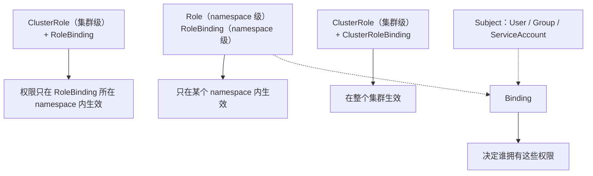
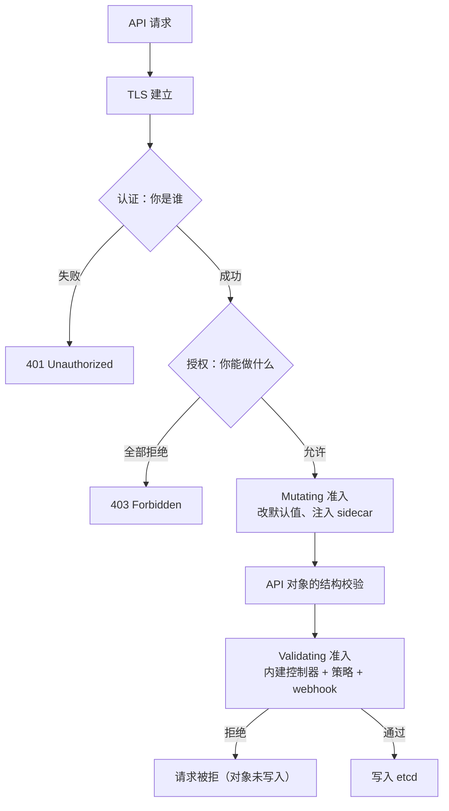

---
tags:
  - Kubernetes
  - 安全
  - RBAC
  - PSA
  - Secret
created: 2026-09-13
---

# 安全

> 本笔记对应 [[Kubernetes/00_简介]] 的「阶段 6」。目标：能把一次 API 请求经过的「认证 → 授权 → 准入 → 落库」讲清楚，能写出最小权限的 RBAC、用 PSA 把 Pod 关进笼子、把 Secret 真正保护起来，并知道「哪些权限本身就等于集群管理员」。
>
> 关联复习：[[01_核心架构与对象模型]]（控制面链路、apiserver 准入、Secret 与 ConfigMap 的更新语义）、[[02_工作负载与控制器]]（Pod 模板与 `securityContext` 的落点）、[[04_网络]]（NetworkPolicy 与东西向隔离）、[[05_存储]]（PV/PVC、`hostPath` 与数据加密）
>
> 说明：本笔记的字段、默认值与行为均以官方文档和 Kubernetes 源码为准，主要对照 Kubernetes 1.37 时期的文档；凡有版本差异的地方都标注引入或弃用版本，落地前请对照集群实际版本。

## 0. 30 秒速览

> [!abstract] 这一页只要记住六句话
> - **一次请求要过五关**：TLS → 认证（你是谁）→ 授权（你能做什么）→ 准入（这个对象允许长什么样）→ 校验并写入 `etcd`。**401 找认证、403 找授权、被拒在准入门**，这三类问题的排查路径完全不同。
> - **Kubernetes 里没有 User 对象**：普通用户完全不存在于 API 中，身份由认证器给出的「用户名 + 组」决定；只有 ServiceAccount 是真正被存储的对象，Pod 用的就是它。
> - **ServiceAccount 凭据早已换血**：1.22 起默认用 TokenRequest 签发**短期、可轮转**的 token 并挂成 projected volume，1.24 起不再自动创建长期 Secret token（相关门控在 1.27 移除）。不访问 API 的 Pod 就该 `automountServiceAccountToken: false`。
> - **RBAC 是加法，默认拒绝**：`Role` / `ClusterRole` 定义权限，`RoleBinding` / `ClusterRoleBinding` 授予主体；`RoleBinding` 引用 `ClusterRole` 时权限只落在该 namespace 内。
> - **最危险的往往不是 `cluster-admin` 本身，而是几个"看起来无害"的权限**：能读或 list Secret、能创建 Pod、能创建 PV、能读 `nodes/proxy`、能用 `escalate`/`bind`/`impersonate`、能为任意 SA 签 token —— 每一条都等价于拿到更高权限。
> - **Pod 加固有五个必配**：`runAsNonRoot`、`allowPrivilegeEscalation: false`、`capabilities.drop: ["ALL"]`、`readOnlyRootFilesystem: true`、`seccompProfile: RuntimeDefault`；`restricted` 档的判定基本就是这五条。

> [!tip] 怎么用这篇笔记
> 首学按 1→2→3→4→5→6 的顺序读；复习时只看第 0 节和第 10 节，其余按需回查。
> 第 2、3、4、5 节都有可以直接跑的「动手验证」（5.2 那个是控制面配置文件，不是 `kubectl apply` 的对象）；建议至少亲手跑一遍 RBAC 的 `can-i` 验证和 PSA 的「被拒 → 合规」对比。

## 1. 认证（AuthN）：你是谁

### 1.1 只有两类主体，但只有一类是对象

```
用户（User）        —— 人、外部系统、CI；不在 API 里，没有对象，无法用 kubectl 创建
组（Group）         —— 认证器附带的标签，用于批量授权
ServiceAccount      —— Pod/工作负载的身份；是真正的 API 对象
```

- **用户不是对象**：你无法 `kubectl get users`。认证器从证书的 CN、OIDC 的 `sub`、token 里解析出用户名与组，之后所有授权决定都基于这两个字符串。
- **`system:` 前缀是系统保留命名空间**：`system:masters`（绕过 RBAC 的超级组）、`system:nodes`（kubelet）、`system:serviceaccounts`（所有 SA）等。给用户起名时不要用这个前缀。
- **ServiceAccount 的用户名有固定格式**：`system:serviceaccount:<namespace>:<name>`，它自动属于 `system:serviceaccounts` 和 `system:serviceaccounts:<namespace>` 两个组，所以可以「一次性授权某个 namespace 里的所有 SA」。
- **认证成功后会附加 `system:authenticated` 组**；匿名请求的身份是 `system:anonymous`，属于 `system:unauthenticated` 组。

### 1.2 认证方式速查

| 方式 | 身份来源 | 典型用途 | 注意 |
| --- | --- | --- | --- |
| X.509 客户端证书 | 证书的 **CN = 用户名**，**O = 组** | 控制面组件、kubelet、管理员、CI | 签名后**无法吊销**，泄露只能重签并收紧 RBAC；需把 CA 配进 `--client-ca-file` |
| ServiceAccount Token（JWT） | TokenRequest 签发的 JWT | Pod 内访问 API | 短期、绑定对象、可轮转（见 1.3） |
| OIDC / JWT | 外部 IdP 的 ID Token | 人类用户接入企业目录 | 命令行 `--oidc-*` 参数是旧方式；**结构化认证配置** `--authentication-config`（1.29 引入、**1.34 起稳定**）支持多个 authenticator、CEL 声明映射与自动重载 |
| Webhook Token 认证 | 外部服务回调判断 | 对接已有认证系统 | 同步 HTTP 调用，后端不可用即 401；注意超时与缓存 |
| 静态 Token 文件 | token 文件 | 遗留场景 | 长生命周期、明文文件，新集群不要用 |
| Bootstrap Token | Secret（`bootstrap.kubernetes.io/token`） | 节点加入集群（kubeadm） | 引导用，必须短期并及时清理 |
| 匿名 | 无 | 只读发现接口 | 生产应显式 `--anonymous-auth=false`（apiserver 与 kubelet 都设） |

`system:masters` 组的特殊之处要单独记：它是 `cluster-admin` 的默认绑定对象，**成员绕过所有 RBAC 检查，删掉 RoleBinding 也收不回来**——唯一办法是把该用户从组里移除（也就是换掉签发给他的证书）。

### 1.3 ServiceAccount 与 token：现在是怎么工作的

三代机制的演进必须能讲清楚：

| 阶段 | 机制 | 现状 |
| --- | --- | --- |
| v1.22 之前 | 每个 SA 自动生成一个**永不过期**的 Secret token | 已淘汰；手工创建仍然可以，但不建议 |
| v1.22+ | kubelet 通过 **TokenRequest API** 取短期 token，以 **projected volume** 挂进 Pod | 默认机制 |
| v1.24 → v1.27 | 不再自动创建长期 Secret token（`LegacyServiceAccountTokenNoAutoGeneration` 从 1.24 默认开启，**1.27 移除门控、成为 GA**） | 长期 token 只能手工造，且要自负风险 |

几个落地细节：

- **默认挂载路径**是 `/var/run/secrets/kubernetes.io/serviceaccount/`（`token`、`ca.crt`、`namespace`）；
- **token 有有效期、audience 与被绑定对象**：绑到 Pod 的 token 在 Pod 删除后失效；kubelet 会在 token 达到 **TTL 的 80%** 或**超过 24 小时**时主动轮换；
- **Pod 里的应用要能重新读取文件**（按周期重载即可，不必自己跟踪精确过期时间）；
- **不需要访问 API 的 Pod 一律关掉自动挂载**：`automountServiceAccountToken: false`（Pod 级设置会覆盖 SA 级设置）；
- **需要别的 audience 或自定义路径**时，用 projected volume 显式声明 `audience` 与 `expirationSeconds`，或用 `TokenRequest` API 自己签；
- **临时给人/CI 一个 SA 身份**：`kubectl create token <sa> --duration=10m`（不要用长期 Secret token）；
- 1.33 起还有两项加固：`ServiceAccountTokenNodeBinding`（1.29 引入、**1.33 起稳定**，可把 token 绑定到 Node）与 `ServiceAccountNodeAudienceRestriction`（**1.33 起 beta、默认开启**，限制 kubelet 能请求的 audience）。

> [!important] 「能创建 Pod」= 「能拿到这个 namespace 里所有 SA 的权限」
> Pod 可以指定 `serviceAccountName`，所以任何能创建 Pod（或创建 Deployment/Job/StatefulSet 这类工作负载对象）的人，都能以该 namespace 内任意 ServiceAccount 的身份访问 API。这条推论是 RBAC 设计里最重要的一条（详见 2.5）。

### 1.4 证书签发与轮换

- 集群内部的客户端证书通过 **CSR API**（`CertificateSigningRequest`）签发：`signerName` 决定用途，最常用的有 `kubernetes.io/kube-apiserver-client`（客户端认证）、`kubernetes.io/kubelet-serving`（kubelet 服务端证书）等。
- CSR 要经过**批准（approve）+ 签发（sign）**两步，默认由 `certificate-controller` 与对应的 signer 完成；`approval` 是可以被 RBAC 授予的动作，所以 **「能创建 CSR + 能批准 `kube-apiserver-client` 类型」就等于「能给自己签任意用户名的证书」**（典型提权路径）。
- 轮换：kubeadm 集群用 `kubeadm certs check-expiration` 查看、`kubeadm certs renew` 续期；kubelet 的客户端证书可以配合 `rotateCertificates` 自动轮换。
- **证书不可吊销**：一旦泄露，只能重签新证书（必要时换 CA）并同步收紧 RBAC，所以给人和 CI 发证书时要控制有效期。

## 2. 授权（AuthZ）：你能做什么

### 2.1 授权模型：加法与默认拒绝

- 请求必须有身份、动作、目标对象；apiserver 按配置的顺序依次询问每个授权模块，**任何一个允许就通过，全部拒绝才拒绝**（HTTP 403）。
- 判定输入包括：用户与组、`verb`、`apiGroup`、`resource`（含子资源）、`resourceName`、namespace、`nonResourceURL`；较新版本还能带字段选择器做细粒度判定。
- 常见模块：

| 模块 | 作用 | 现状 |
| --- | --- | --- |
| `RBAC` | 基于角色动态配置权限，绝大多数集群的主力 | 推荐 |
| `Node` | 给 kubelet 授予「与它上面运行的 Pod 相关」的最小权限 | 与 RBAC 组合使用（`Node,RBAC`） |
| `Webhook` | 把授权决策委托给外部服务 | 与结构化授权配置配合 |
| `ABAC` | 基于静态 JSON 策略文件 | 遗留，基本不用 |
| `AlwaysAllow` | 全部放行 | **kube-apiserver 的 `--authorization-mode` 默认值就是它**，生产绝不能留 |

两个必须记住的默认值：**kube-apiserver 的 `--authorization-mode` 默认是 `AlwaysAllow`；kubelet 的 `--authorization-mode` 默认也是 `AlwaysAllow`**。kubeadm 会把 apiserver 显式配成 `Node,RBAC`，手工搭的集群一定要自己改。

1.29 引入、**1.32 起稳定**的**结构化授权配置**（`--authorization-config`）让授权链可以声明多个 webhook、设置失败策略，并用 CEL 预过滤请求；命令行参数方式仍然可用，但只有配置文件支持多 webhook 与预过滤。

### 2.2 RBAC 四件套与作用域



| 对象 | 作用域 | 作用 |
| --- | --- | --- |
| `Role` | namespace | 一组权限规则，只在所属 namespace 有效 |
| `ClusterRole` | 集群 | 一组权限规则，可用于集群级资源、`nonResourceURLs`，或作为模板被 `RoleBinding` 复用 |
| `RoleBinding` | namespace | 把权限授予主体；引用 `ClusterRole` 时**权限被裁剪到该 namespace** |
| `ClusterRoleBinding` | 集群 | 把权限授予主体，**全集群、所有 namespace 生效** |

三条容易考倒的语义：

1. **`RoleBinding` 引用 `ClusterRole` 是"复用模板"，不是"获得集群权限"**——这是把一套通用权限（如 `view`、`edit`）授予多个 namespace 的标准做法。
2. **`roleRef` 创建后不可改**：要换角色必须删除并重建绑定。这个限制是为安全服务的——它允许你把"管理 binding 主体"的权限单独授权出去，而不用担心对方顺手把角色换成 `cluster-admin`。
3. **默认角色会被自动调和**：apiserver 每次启动都会给默认 `system:` 角色补齐缺失权限；要保留自己的修改就得把 `rbac.authorization.kubernetes.io/autoupdate` 设为 `false`。

### 2.3 权限规则怎么写

| 字段 | 说明 |
| --- | --- |
| `apiGroups` | API 组，`""` 表示核心组（Pod/Service/Secret…） |
| `resources` | 资源名（复数小写），**子资源要显式写**：`pods/log`、`pods/exec`、`pods/portforward`、`serviceaccounts/token`、`nodes/proxy` |
| `resourceNames` | 限定到具体对象；注意 `create` 不能用它（新建时名字还不知道），`list`/`watch` 用它时客户端必须带 `metadata.name` 字段选择器 |
| `verbs` | `get` / `list` / `watch` / `create` / `update` / `patch` / `delete` / `deletecollection`，以及 `escalate` / `bind` / `impersonate` 这类特殊动词 |
| `nonResourceURLs` | 非资源路径（如 `/healthz`、`/metrics`），可用 `*` 通配 |
| `*` | 通配符；**对 RBAC 而言它还包括未来新增的资源和 API 组**，所以生产要尽量避免 |

> [!example]- 动手验证：最小权限的 Role 与 `can-i` 自检
> ```yaml
> apiVersion: rbac.authorization.k8s.io/v1
> kind: Role
> metadata:
>   name: pod-reader
>   namespace: dev
> rules:
>   - apiGroups: [""]
>     resources: ["pods", "pods/log"]
>     verbs: ["get", "list", "watch"]
> ---
> apiVersion: rbac.authorization.k8s.io/v1
> kind: RoleBinding
> metadata:
>   name: pod-reader
>   namespace: dev
> subjects:
>   - kind: ServiceAccount
>     name: app
>     namespace: dev
> roleRef:
>   apiGroup: rbac.authorization.k8s.io
>   kind: Role
>   name: pod-reader
> ```
> ```text
> kubectl auth can-i list pods --as=system:serviceaccount:dev:app -n dev        # yes
> kubectl auth can-i delete pods --as=system:serviceaccount:dev:app -n dev      # no
> kubectl auth can-i get pods -n prod --as=system:serviceaccount:dev:app        # no（RoleBinding 只在 dev 生效）
> kubectl auth can-i --list --as=system:serviceaccount:dev:app -n dev           # 完整权限清单
> ```
> 把最后一条输出的权限清单当成"这个身份的全部能力"来审阅，是 RBAC 评审最有效的一步。

### 2.4 内建角色：先用现成的，再考虑自定义

| 角色 | 绑定方式 | 能力 |
| --- | --- | --- |
| `cluster-admin` | 默认绑到 `system:masters` 组 | 任意资源任意动作；**只用于应急（break-glass）** |
| `admin` | 通常用 `RoleBinding` 给到 namespace | namespace 内读写绝大多数资源，可管理该 namespace 的 Role/RoleBinding；不能改 ResourceQuota 与 Namespace 本身 |
| `edit` | `RoleBinding` | namespace 内读写大部分对象；**不能**看/改 Role 与 RoleBinding |
| `view` | `RoleBinding` | namespace 内只读大部分对象；**不包含 Secret**（因为读到 Secret 就能拿到 SA 凭据） |
| `system:discovery`、`system:basic-user`、`system:public-info-viewer` | 默认绑到 `system:authenticated`（部分含 `system:unauthenticated`） | 只读 API 发现与公开信息 |

`admin` / `edit` / `view` 支持**聚合**：带上 `rbac.authorization.k8s.io/aggregate-to-<admin|edit|view>: "true"` 标签的 ClusterRole，其规则会被自动合并进对应内建角色——这是给 CRD 补权限的标准做法。

### 2.5 权限提升面：这些权限本身就是"半个管理员"

> [!danger] 授权评审时优先看这张表
> 下面这些权限只要给出去一条，注入的权限就可能远超预期。给之前务必确认业务真的需要。

| 授予的权限 | 实际等价于 |
| --- | --- |
| `get` **或 `list`/`watch`** Secret | 读到 Secret 内容（`list` 会把所有 Secret 一起返回）；**SA 凭据泄露 = 身份泄露** |
| 创建 Pod / Deployment / Job 等工作负载 | 拿到该 namespace **任意 SA** 的权限，并能挂载该 namespace 的 Secret、ConfigMap、PVC |
| 创建 PersistentVolume | 可以创建 `hostPath` 卷，进而让 Pod 触达节点文件系统 |
| `get nodes/proxy` | 拿到 kubelet API 的调用能力（可读日志、exec 进任何 Pod），且**绕过审计与准入** |
| `escalate` | 创建比自己权限更高的角色 |
| `bind` | 把"自己都没有的角色"绑定给主体 |
| `impersonate` | 变成其他用户/组/SA |
| 创建 CSR + 批准 | 用 `kube-apiserver-client` signer 给自己签任意用户名的客户端证书 |
| `create serviceaccounts/token` | 为任意 SA 签发 token |
| `patch` Namespace | 改 namespace 标签，从而**放松 PSA 策略或 NetworkPolicy 选择器** |
| 管理 `validatingwebhookconfigurations` / `mutatingwebhookconfigurations` | 控制能读取（甚至改写）所有准入对象的组件 |

**namespace 是最小的信任边界，但它不是安全边界**：上面这些权限决定了"同一 namespace 内的不同租户"基本上无法互相防住。真正的强隔离要拆集群、拆节点池或上虚拟化（见 7 节的多租户部分）。

### 2.6 kubelet 侧：Node 授权与 NodeRestriction

- kubelet 用节点身份证书认证，用户名形如 `system:node:<nodeName>`，属于 `system:nodes` 组。
- **Node 授权模块**给它"与其上运行的 Pod 相关"的最小读取权限（例如该节点上 Pod 需要的 Secret/ConfigMap/PV），而不是全部资源的读写。
- **`NodeRestriction` 准入控制器**进一步限制 kubelet：只能修改自己的 Node 对象、只能修改调度到本节点的 Pod，并且不能改自身标签等敏感字段——它把"节点被攻破"的影响面压到最小。
- 生产上 kubelet 必须同时满足：`--anonymous-auth=false`、`--authorization-mode=Webhook`（交给 apiserver 判定）、`--client-ca-file` 指向集群 CA。

### 2.7 授权的排障与自检命令

```text
kubectl auth can-i <verb> <resource> --as=system:serviceaccount:<ns>:<sa> -n <ns>
kubectl auth can-i --list --as=<user>                     # 列出某个身份的全部权限
kubectl auth reconcile -f rbac.yaml                       # 幂等地创建/更新 RBAC 对象
kubectl get rolebinding,clusterrolebinding -A -o wide      # 检查谁被授了什么
kubectl get clusterrolebinding -o json | jq -r '.items[] | select(.roleRef.name=="cluster-admin") | .subjects'
```

需要自动化判断时，可以直接创建 `SelfSubjectAccessReview`（查自己）或 `SubjectAccessReview`（查别人）——CI 里做"权限回归测试"就是这个思路。

## 3. 准入控制（Admission）：这个对象允许长什么样

### 3.1 准入在链路中的位置



五个要点：

1. **准入只处理写请求**（create / update / delete / connect-proxy），单纯读取对象不经过准入控制器；
2. **Mutating 在前，Validating 在后**：前者可以改对象（注入 sidecar、补默认值），后者只能接受或拒绝；
3. **任何一个 validating 环节拒绝，请求立即失败**，不会"部分写入"；
4. **准入失败通常在对象层面报错**（消息里会说明违反了哪条策略），而不是 401/403；
5. **准入是最后一道能在"落库之前"说不的关口**，因此它也是策略引擎（PSA、Kyverno、Gatekeeper）的落脚点。

### 3.2 内建准入控制器（安全相关的重点）

| 控制器 | 作用 |
| --- | --- |
| `NodeRestriction` | 限制 kubelet 只能改自己的 Node 与本节点的 Pod（见 2.6） |
| `PodSecurity` | 按 namespace 标签执行 Pod Security Standards（见 4.2） |
| `ServiceAccount` | 为未指定 SA 的 Pod 装上默认 SA；把 SA 的 `imagePullSecrets` 合并进 Pod |
| `LimitRanger` | 施加 LimitRange 中的默认值与约束（可自动补 requests） |
| `ResourceQuota` | 强制 namespace 配额，超限即拒绝 |
| `NamespaceLifecycle` | 拒绝往正在删除的 namespace 创建对象；保护 `kube-system` 等系统命名空间 |
| `StorageObjectInUseProtection` | 给 PV/PVC 加保护 finalizer（见 [[05_存储]]） |
| `CertificateApproval` / `CertificateSigning` / `CertificateSubjectRestriction` | CSR 的批准与签发控制 |
| `PersistentVolumeClaimResize` | 校验扩容请求（只能变大、类必须允许扩容） |
| `DefaultStorageClass` / `DefaultIngressClass` | 补默认 StorageClass / IngressClass |
| `TaintNodesByCondition`、`Priority`、`RuntimeClass` | 节点污点、优先级、运行时类别的默认行为 |
| `DenyServiceExternalIPs` | 可选启用，拒绝 `externalIPs`（与 [[04_网络]] 的弃用方向一致） |
| `ValidatingAdmissionPolicy` / `MutatingAdmissionPolicy` | 执行 CEL 声明式策略（见 3.4） |
| `MutatingAdmissionWebhook` / `ValidatingAdmissionWebhook` | 执行外部 webhook 策略（见 3.3） |

官方推荐的一批控制器在多数发行版里**默认已启用**；查看与调整用 `kube-apiserver --enable-admission-plugins=...`。注意这是一组"按顺序调用"的插件，擅自改动顺序在生产里风险很高。

### 3.3 动态准入：Mutating / Validating Webhook

| 字段 | 默认值 | 说明 |
| --- | --- | --- |
| `failurePolicy` | `Fail` | webhook 不可用/超时时是拒绝还是放行。**`Fail` 是安全默认，但也是"自锁"的来源** |
| `timeoutSeconds` | 10 | 取值范围 1~30 秒；太长会拖慢所有写请求 |
| `matchPolicy` | `Equivalent` | 是否把等价的 API 版本也送进 webhook |
| `sideEffects` | 必填 | 必须声明为 `None` 或 `NoneOnDryRun`，避免 dry-run 产生副作用 |
| `admissionReviewVersions` | 必填 | 支持的 `AdmissionReview` 版本列表 |
| `rules` | 必填 | 匹配 apiGroups / apiVersions / operations / resources / scope |
| `namespaceSelector` / `objectSelector` | 空 | 按 namespace 或对象标签缩小命中范围 |
| `matchConditions` | 空 | **CEL 预过滤**，最多 64 条；条件不命中就不调用 webhook，能显著降低调用量 |
| `clientConfig` | 必填 | 指向 webhook 后端（Service 或 URL），通常需要 `caBundle` |
| `reinvocationPolicy` | `Never` | 仅 mutating：在一次准入中是否被再次调用（`IfNeeded`） |

> [!danger] Webhook 是"集群级单点"，写之前先想清楚失败模式
> `failurePolicy: Fail` + 后端不可用 = **所有匹配到的写操作全部失败**。如果 webhook 匹配范围过大（比如所有资源），可能出现"连修 webhook 配置都修不动"的局面。生产实践：
> - 只匹配真正需要的资源与操作，用 `namespaceSelector` / `objectSelector` / `matchConditions` 收窄；
> - 超时设短（1~3 秒），后端做多副本 + PDB，并监控调用延迟与失败率；
> - 新策略先在 `Ignore` 模式或 audit/warn 模式观察，再切 `Fail`；
> - 关键 webhook 的配置对象要纳入变更管理（谁能改它，就等于谁能读/改所有准入对象）。

### 3.4 声明式策略：`ValidatingAdmissionPolicy` 与 `MutatingAdmissionPolicy`

**在内建准入里用 CEL 写策略**，不需要自己运维 webhook 后端：

- `ValidatingAdmissionPolicy`（1.28 引入、**1.30 起稳定**）：用 CEL 表达式校验对象；
- `ValidatingAdmissionPolicyBinding`：把策略绑定到具体范围（namespace、资源），并声明 `validationActions`：`Deny`（拒绝）、`Warn`（客户端警告）、`Audit`（写审计注解）；
- `failurePolicy`：CEL 求值出错时的行为（`Fail` / `Ignore`）；
- 支持 `variables`（复用表达式）、`matchConditions`（预过滤），以及 `paramKind` + `paramRef` 引用 ConfigMap/CRD 作为参数；
- `MutatingAdmissionPolicy`（**1.36 起稳定**）：同样用 CEL，但做的是"改写对象"（apply configuration），适合做组织级默认值注入。

> [!example]- 动手验证：用 ValidatingAdmissionPolicy 禁掉 hostPath
> ```yaml
> apiVersion: admissionregistration.k8s.io/v1
> kind: ValidatingAdmissionPolicy
> metadata:
>   name: no-hostpath.example.com
> spec:
>   failurePolicy: Fail
>   matchConstraints:
>     resourceRules:
>       - apiGroups: [""]
>         apiVersions: ["v1"]
>         operations: ["CREATE", "UPDATE"]
>         resources: ["pods"]
>   validations:
>     - expression: "!has(object.spec.volumes) || object.spec.volumes.all(v, !has(v.hostPath))"
>       message: "hostPath 卷被集群策略禁止"
> ---
> apiVersion: admissionregistration.k8s.io/v1
> kind: ValidatingAdmissionPolicyBinding
> metadata:
>   name: no-hostpath-binding.example.com
> spec:
>   policyName: no-hostpath.example.com
>   validationActions: ["Deny"]
>   matchResources:
>     namespaceSelector:
>       matchLabels:
>         policy.example.com/no-hostpath: enforced
> ```
> ```text
> kubectl label namespace dev policy.example.com/no-hostpath=enforced
> kubectl -n dev run bad --image=busybox:1.36 --overrides='{"spec":{"volumes":[{"name":"h","hostPath":{"path":"/"}}]}}'
> # 预期：被拒绝，错误信息里包含 “hostPath 卷被集群策略禁止”
> ```
> 与 webhook 相比，这类策略**不依赖外部服务**、天然高可用；缺点是只能用 CEL 表达，复杂逻辑（外部数据、镜像签名校验）仍要交给 webhook 或策略引擎。

### 3.5 策略生态：什么时候不要自己写

| 方案 | 形态 | 适合 |
| --- | --- | --- |
| 内建 PSA + VAP/MAP | apiserver 内建 | 简单、确定的规则；不引入外部依赖 |
| Kyverno | 独立控制器，用 Kubernetes 原生 YAML 写策略 | 需要 validate / mutate / generate 多种动作，且团队不想学新语言 |
| OPA Gatekeeper | 独立控制器，用 Rego 写策略 | 已有 OPA 体系、策略需要复杂逻辑与外部数据 |
| Kubewarden | WebAssembly 策略 | 多语言策略、需要沙箱执行 |

选型原则简单说就是：**能用内建解决就不用装组件；装了组件就要按 3.3 的风险清单去管它**（它同样是集群级单点）。

## 4. Pod 与容器加固

### 4.1 Pod Security Standards（PSS）三档

三档是**累积**关系：`restricted` 包含 `baseline` 的全部要求。

| 档位 | 定位 | 允许什么 |
| --- | --- | --- |
| `privileged` | 完全不限制 | 一切，包括已知的提权方式；只给系统级、受信任的工作负载 |
| `baseline` | 阻止已知提权，尽量贴近默认配置 | 不允许 hostNetwork/hostPID/hostIPC、privileged、hostPath、hostPort、越权 capabilities、HostProcess 等 |
| `restricted` | 现行加固最佳实践 | 在 baseline 之上，还要求非 root、禁提权、丢弃全部 capability、显式 seccomp、限定卷类型等 |

`restricted` 的具体要求（这就是"Pod 加固五件套"的出处）：

| 控制项 | 要求 | 引入版本 |
| --- | --- | --- |
| 卷类型 | 只允许 configMap、csi、downwardAPI、emptyDir、ephemeral、persistentVolumeClaim、projected、secret | 1.25 |
| `allowPrivilegeEscalation` | 必须为 `false` | v1.8+ 控制项，1.25 起仅 Linux |
| `runAsNonRoot` | 必须为 `true`（Pod 级或所有容器级） | — |
| `runAsUser` | 不能为 `0` | v1.23+ |
| `seccompProfile` | 必须显式设为 `RuntimeDefault` 或 `Localhost`（不允许 `Unconfined` 或不设） | v1.19+ 控制项，1.25 起仅 Linux |
| `capabilities` | `drop` 必须包含 `ALL`，`add` 只允许 `NET_BIND_SERVICE` | v1.22+ 控制项，1.25 起仅 Linux |

从 1.25 起，上述"仅 Linux"的控制项会根据 `spec.os.name` 判定；混用 Windows 节点时要注意版本固定问题（见 4.2）。

### 4.2 Pod Security Admission（PSA）：把 PSS 执行下去

PSA 是**内建准入控制器**（**1.25 起稳定**），按 namespace 标签执行 PSS。三种模式各自独立配置：

| 模式 | 违反策略时的行为 |
| --- | --- |
| `enforce` | 拒绝创建 Pod（**只作用于 Pod 对象**） |
| `audit` | 放行，但在审计日志里加注解（也作用于工作负载对象） |
| `warn` | 放行，但给客户端返回警告（也作用于工作负载对象） |

```text
# 模式与档位
pod-security.kubernetes.io/<MODE>: <privileged|baseline|restricted>
# 可选：把策略固定到某个 Kubernetes 版本的实现
pod-security.kubernetes.io/<MODE>-version: <v1.37|latest>
```

几个必须知道的细节：

- **`enforce` 只拦 Pod**：Deployment/Job 这类工作负载对象可以创建成功，但控制器建 Pod 时会被拒（并产生事件）。`audit`/`warn` 才会在提交工作负载对象时就给出反馈——这就是"先 warn 再 enforce"的迁移路径。
- **版本固定很重要**：策略实现会随版本演进（例如 1.25 引入 `os.name` 判定），不写 `-version` 就等于跟随集群升级自动换策略。官方建议把业务 namespace 固定到自己验证过的版本。
- **豁免要显式配置**：`exemptions` 支持按用户名、`runtimeClassName`、namespace 跳过检查，配置在准入控制器配置里；**不要豁免控制器使用的 SA**（那等于豁免了所有能创建该工作负载的用户）。
- **可以渐进落地**：先在 `warn`+`audit` 观察一段时间，改成 `enforce` 后配合事件与指标（`pod_security_evaluations_total`、`pod_security_exemptions_total`）。

> [!example]- 动手验证：把一个 namespace 锁到 restricted，并跑通合规 Pod
> ```text
> kubectl create namespace dev
> kubectl label namespace dev \
>   pod-security.kubernetes.io/enforce=restricted \
>   pod-security.kubernetes.io/enforce-version=v1.37 \
>   pod-security.kubernetes.io/warn=restricted
> kubectl -n dev run bad --image=busybox:1.36 -- sleep 3600
> # 预期：被拒绝，提示 violates PodSecurity "restricted:v1.37"，并列出违反的控制项
> ```
> ```yaml
> apiVersion: v1
> kind: Pod
> metadata:
>   name: hardened
>   namespace: dev
> spec:
>   securityContext:
>     runAsNonRoot: true
>     seccompProfile:
>       type: RuntimeDefault
>   containers:
>     - name: app
>       image: busybox:1.36
>       command: ["sh", "-c", "id && sleep 3600"]
>       securityContext:
>         allowPrivilegeEscalation: false
>         capabilities:
>           drop: ["ALL"]
>         readOnlyRootFilesystem: true
>         runAsUser: 10001
> ```
> ```text
> kubectl apply -f hardened.yaml
> kubectl -n dev exec hardened -- id          # 预期 uid=10001，不是 root
> ```
> 想快速体会三档差别，把 namespace 的 `enforce` 依次改成 `baseline`、`privileged` 再看 `bad` 这个 Pod 能不能创建成功。

### 4.3 `securityContext`：字段与所在层级

| 层级 | 常用字段 | 作用 |
| --- | --- | --- |
| Pod（`spec.securityContext`） | `runAsUser` / `runAsGroup` / `fsGroup` / `fsGroupChangePolicy` / `runAsNonRoot` / `supplementalGroups` / `seccompProfile` / `appArmorProfile` / `seLinuxOptions` / `sysctls` / `windowsOptions` | 对 Pod 内所有容器生效；**容器级同名设置会覆盖 Pod 级** |
| 容器（`securityContext`） | `runAsUser` / `runAsGroup` / `runAsNonRoot` / `allowPrivilegeEscalation` / `privileged` / `capabilities` / `readOnlyRootFilesystem` / `procMount` / `seccompProfile` / `appArmorProfile` / `seLinuxOptions` | 针对单个容器；`privileged` 会覆盖/关闭多项内核限制 |

实践上按这个顺序配置：

1. **先决定用户**：`runAsNonRoot: true` + 明确的 `runAsUser`/`runAsGroup`（镜像默认 root 时，只写 `runAsNonRoot` 会直接启动失败，这是好事）；
2. **关提权**：`allowPrivilegeEscalation: false`；
3. **丢能力**：`capabilities.drop: ["ALL"]`，需要绑定低端口再 `add: ["NET_BIND_SERVICE"]`；
4. **只读根文件系统**：`readOnlyRootFilesystem: true`，把需要写的位置显式挂 `emptyDir`；
5. **设 seccomp**：`seccompProfile.type: RuntimeDefault`；
6. **共享卷权限**：多用户写同一 PVC 时用 `fsGroup`（大卷可用 `fsGroupChangePolicy: OnRootMismatch` 减少扫描开销）。

### 4.4 Linux 内核与运行时加固

| 机制 | 作用 | 现状与建议 |
| --- | --- | --- |
| **seccomp** | 过滤进程可用的系统调用 | 容器运行时有默认 profile；kubelet 的 `--seccomp-default`（**1.27 起稳定**）可让所有工作负载默认使用 `RuntimeDefault`，不需要改任何工作负载 |
| **AppArmor** | 按程序限制文件/网络/能力访问 | **1.31 起稳定**（`securityContext.appArmorProfile.type`：`RuntimeDefault` / `Localhost`） |
| **SELinux** | 按标签限制访问，能防护到容器之外 | 通过 `seLinuxOptions` 配置；RHEL 系节点默认启用 |
| **capabilities** | 把 root 权限拆成细粒度能力 | 默认就该 `drop: ["ALL"]`，按需加回 |
| **User Namespaces** | 容器内 root 在宿主机上映射为非 root，**1.28 引入、1.36 起稳定** | `spec.hostUsers: false` 开启；需要节点内核 6.3+ 与运行时支持 |
| **RuntimeClass** | 换用不同隔离级别的运行时 | 敏感工作负载可用 gVisor / Kata Containers 这类沙箱 |

关于 `privileged: true` 的破坏力要能一句话说清：**它会给容器全部能力、把 seccomp 变成 `Unconfined`、忽略 AppArmor、以 `unconfined_t` 运行 SELinux**，等于放弃上面所有加固手段，并直接暴露节点设备与内核接口。

### 4.5 网络隔离与"容器之外"的边界

- Pod 之间的流量默认**全通**，需要 `NetworkPolicy` 显式做白名单；namespace 级 default-deny + 单独放行 DNS 是标准起手式（详见 [[04_网络]]）。
- 入口、出口要分别考虑：`Ingress` 策略管别人进来，`Egress` 管 Pod 出去（含访问云元数据服务的路径）。
- **PSA / seccomp / AppArmor 保护的是"进程能做什么"，NetworkPolicy 保护的是"能连谁"，两者互补，不能互相替代**。

## 5. Secret 与数据加密

### 5.1 Secret 的本质：它不加密，只是"更受控的配置"

- **base64 不是加密**：它只是编码。`kubectl get secret -o yaml` 里看到的 `data` 字段任何人都能一条命令解开。
- **默认在 `etcd` 里是明文**：不开静态加密时，拿到 etcd 快照就等于拿到全部 Secret。
- **单个 Secret 上限 1 MiB**，适合放凭据，不适合放文件。
- 类型（`type`）会带来额外校验，常用的是 `Opaque`、`kubernetes.io/tls`、`kubernetes.io/dockerconfigjson`、`kubernetes.io/service-account-token`、`bootstrap.kubernetes.io/token` 等；自定义类型用域名前缀（`example.com/xxx`）。
- 写入时用 `stringData`（明文），读取时统一在 `data`（base64）；`immutable: true`（**1.21 起稳定**）可以防止误改，并在大量 Secret 的场景显著降低 apiserver 与 kubelet 的负载——代价是改内容必须重建对象。
- **投递方式决定更新语义**：环境变量注入不会更新，卷挂载会更新（有延迟），`subPath` 挂载不会更新（见 [[01_核心架构与对象模型]]）。

> [!example]- 动手验证：确认 Secret 只是 base64，并看清挂载后的权限
> ```yaml
> apiVersion: v1
> kind: Secret
> metadata:
>   name: app-secret
> type: Opaque
> stringData:
>   password: "s3cr3t"
> ---
> apiVersion: v1
> kind: Pod
> metadata:
>   name: secret-demo
> spec:
>   securityContext:
>     runAsNonRoot: true
>     seccompProfile:
>       type: RuntimeDefault
>   containers:
>     - name: app
>       image: busybox:1.36
>       command: ["sh", "-c", "cat /etc/app/password && sleep 3600"]
>       securityContext:
>         allowPrivilegeEscalation: false
>         capabilities:
>           drop: ["ALL"]
>         readOnlyRootFilesystem: true
>         runAsUser: 10001
>       volumeMounts:
>         - name: secret
>           mountPath: /etc/app
>           readOnly: true
>   volumes:
>     - name: secret
>       secret:
>         secretName: app-secret
>         defaultMode: 0400
> ```
> ```text
> kubectl get secret app-secret -o jsonpath='{.data.password}' | base64 -d    # 直接读出明文
> kubectl exec secret-demo -- cat /etc/app/password
> kubectl exec secret-demo -- ls -l /etc/app                                  # 权限由 defaultMode 控制
> ```
> 结论：Secret 的保护**不来自"加密存储格式"，而来自 RBAC、静态加密、短生命周期凭据和投递范围**。

### 5.2 静态加密（Encryption at Rest）

默认 provider 是 `identity`，也就是**不加密**。要开启，需要在 kube-apiserver 上配置 `--encryption-provider-config=<file>`，文件本身是 `EncryptionConfiguration`：

| Provider | 强度 | 说明 |
| --- | --- | --- |
| `identity` | 无 | 不加密；**放在列表首位会让新写入的数据以明文落盘** |
| `aescbc` | 弱 | 不推荐（CBC 存在 padding oracle 风险）；密钥在控制面主机上 |
| `aesgcm` | 快但需轮换 | **每 20 万次写入必须轮换密钥**，除非有自动轮换方案，否则不要用 |
| `secretbox` | 强 | XSalsa20 + Poly1305，密钥同样在主机上 |
| `kms` **v1** | 最强（信封加密） | **1.28 起弃用**，新集群不要选 |
| `kms` **v2** | 最强（信封加密） | **1.29 起稳定**；按 API server 维护 DEK、KEK 由外部 KMS 管理，是当前推荐做法 |

规则与流程：

1. **加密只用列表里的第一个 provider；解密会用列表里的所有 provider 依次尝试**——所以轮换时新密钥要放在最前面，旧密钥仍留在后面；
2. 配置文件含密钥（或 KMS 凭据），必须严格限制控制面主机上的文件权限；
3. 可以开启 `--encryption-provider-config-automatic-reload=true`，apiserver 每分钟轮询文件变化，**轮换密钥不必重启 apiserver**；
4. **历史数据不会自动换密钥**：写入只影响新数据，要让旧数据也用上新密钥，必须重写一遍（官方示例是 `kubectl get secrets --all-namespaces -o json | kubectl replace -f -`）；
5. **etcd 备份也是敏感数据**：即使开了静态加密，备份、快照、日志同样要按密级管理。

> [!example]- 配置示例：用 KMS v2 加密 Secret 与 ConfigMap
> ```yaml
> # 控制面文件（/etc/kubernetes/enc/encryption-config.yaml），不是用 kubectl apply 的对象
> apiVersion: apiserver.config.k8s.io/v1
> kind: EncryptionConfiguration
> resources:
>   - resources:
>       - secrets
>       - configmaps
>     providers:
>       - kms:
>           apiVersion: v2
>           name: myKMSPlugin
>           endpoint: unix:///var/run/kmsplugin/socket.sock
>           timeout: 3s
>       - identity: {}
> ```
> ```text
> # kube-apiserver 启动参数（kubeadm 集群改 /etc/kubernetes/manifests/kube-apiserver.yaml）
> --encryption-provider-config=/etc/kubernetes/enc/encryption-config.yaml
> --encryption-provider-config-automatic-reload=true
>
> # 验证与新写入的数据是否已加密（直接看 etcd 里的原始值）
> kubectl get secret app-secret -o jsonpath='{.metadata.name}{"\n"}'   # 名字仍是明文
> # 用 etcdctl 读取该 key，应看到 k8s:enc:kms:v2:... 前缀；未加密则能看到 base64 的明文
> ```
> 注意：KMS v2 不支持 `cachesize` 字段（v1 才有）；KMS 插件要自己部署并保证高可用，否则 apiserver 可能无法解密已有数据。

### 5.3 到底谁能读到 Secret

| 路径 | 说明 |
| --- | --- |
| `get` / `list` / `watch` Secret | **三者都等于读到内容**；`list` 会把整个 namespace 的 Secret 一起返回 |
| 能创建 Pod / 工作负载 | 可以把任意 Secret 挂进自己的 Pod 读出来（见 2.5） |
| 节点上的 kubelet | 需要读取"本节点 Pod 用到的"Secret（由 Node 授权解决，不是全量） |
| 能访问 etcd / 备份 / 审计日志 | 不开静态加密时等同全量泄露；**把 Secret 的请求体记进审计日志也会泄露**（见 7 节） |
| 集群外的平台组件（CI、监控、GitOps） | 常见过度授权点：往往一个 ClusterRoleBinding 就能读全集群 Secret |

实践建议：**按 namespace 切分信任边界 + 使用短生命周期凭据 + 限制 Secret 的挂载范围（只给需要的容器）+ 对"单用户并发读取多个 Secret"这类行为设置审计告警**。

### 5.4 让密钥不落在集群里

| 方案 | 思路 | 取舍 |
| --- | --- | --- |
| 云厂商身份联合（IRSA / Workload Identity / RRSA） | Pod 用 SA 换取云上 IAM 身份，**不再需要静态 AccessKey** | 首选；依赖云与 OIDC 配置 |
| Secrets Store CSI Driver | kubelet 从外部密钥库拉取并挂载成卷 | 密钥不落 etcd；需要装驱动与 provider |
| External Secrets Operator | 把外部密钥同步成集群内 Secret | 仍是 Secret（要配合静态加密），但轮换集中管理 |
| SealedSecrets / SOPS | 加密后再提交进 Git | 适合 GitOps；解密密钥本身要保护好 |

## 6. 镜像与供应链

### 6.1 拉取策略与版本固定

| 你写的 image | 省略 `imagePullPolicy` 时的默认值 |
| --- | --- |
| 带 digest（`repo@sha256:...`） | `IfNotPresent` |
| 无 tag | `Always` |
| tag 是 `:latest` | `Always` |
| 其他 tag（如 `:1.27.3`） | `IfNotPresent` |

关键结论：**tag 是可变的，digest 是不可变的**。生产要把运行版本固定到 digest（或至少固定到不可变的版本 tag），否则"同一个 tag 在不同时间拉到的镜像可能不同"，滚动更新会出现新旧代码混跑且难以复现。

私有仓库的凭据有三种来源（可以同时存在）：

| 方式 | 范围 | 说明 |
| --- | --- | --- |
| Pod / SA 上的 `imagePullSecrets` | 单个 Pod 或使用该 SA 的 Pod | **官方推荐**；Secret 必须与 Pod 同 namespace，类型为 `kubernetes.io/dockerconfigjson` |
| 节点级配置 | 该节点上的所有 Pod | 由集群管理员配置，少用以免"人人可拉" |
| kubelet credential provider 插件 | 节点按需动态取凭据 | 适合云厂商仓库、需要动态轮换令牌的场景 |

### 6.2 扫描、签名与准入校验

| 环节 | 做法 |
| --- | --- |
| 构建 | 最小基础镜像、非 root 用户、固定 digest、生成 SBOM |
| 扫描 | CI 中用 Trivy / Grype 等扫镜像与依赖，高危阻断发布 |
| 签名 | 用 cosign（sigstore）或云厂商签名服务对镜像签名 |
| 准入校验 | 在准入层校验"镜像来自可信仓库且签名有效"（Kyverno 的 `verifyImages`、sigstore policy-controller、OPA 等） |
| 运行时 | 只读根文件系统、丢能力、按 4 节做加固；必要时用沙箱运行时 |

> [!important] 只在 CI 里扫描是不够的
> 扫描解决"已知漏洞"，签名 + 准入解决"这个镜像到底是谁构建的、有没有被替换过"。两者放一起才形成供应链闭环；再叠加 digest 固定，才能保证"跑起来的和审过的是同一个东西"。

## 7. 审计与运行时检测

### 7.1 审计日志的两个部分：策略与后端

- **审计事件在 kube-apiserver 内产生**，每个请求在多个阶段（`RequestReceived`、`ResponseStarted`、`ResponseComplete`、`Panic`）都可能产生事件；
- **策略决定记什么**：规则**按顺序匹配，第一条命中的规则决定级别**（`None`、`Metadata`、`Request`、`RequestResponse`），未配 `--audit-policy-file` 就完全不记录；
- **后端决定记到哪**：`log`（JSONlines 文件，带轮转参数）或 `webhook`（推给外部 HTTP API），两者都支持批处理、限流与截断；
- **成本要算**：审计会占用 apiserver 内存与磁盘；`Request` 及以上会记录请求体，**对 Secret/ConfigMap 用 `RequestResponse` 等于把敏感数据写进日志**（官方示例里 Secret 只记 `Metadata`，值得照抄）；
- 监控两个指标：`apiserver_audit_event_total`（产出量）与 `apiserver_audit_error_total`（丢弃量）。

起点建议：全局 `Metadata`，对工作负载、RBAC、Secret 名称变更、webhook 配置、CSR 审批这些资源单独提到 `Request`，并把日志送到独立的日志系统（不要只留在控制面主机上）。

### 7.2 运行时检测

准入与 PSA 都是"事前"控制；运行中的异常行为要靠运行时安全工具（如 Falco 这类基于内核事件的检测）发现：容器内起 shell、读写敏感路径、异常外联等。它属于"检测与响应"层，**不能替代事前加固**，但能把"加固被绕过"的时间窗压短。

## 8. 生产实践

### 8.1 集群与平台侧（管理员视角）

- **关掉匿名访问**：kube-apiserver 与 kubelet 都设置 `--anonymous-auth=false`；
- **明确授权模式**：apiserver 用 `Node,RBAC`（不要留下 `AlwaysAllow`），kubelet 用 `Webhook` 授权模式；
- **人类用户走 OIDC / 结构化认证**，并接入企业目录；不要给个人发长期客户端证书；
- **谁都不进 `system:masters`**，`cluster-admin` 只用于应急（break-glass），日常用低权账号 + `impersonate` 排障；
- **定期做 RBAC 评审**：用 `kubectl auth can-i --list` 和"谁绑了 cluster-admin"的查询做基线，把结果纳入变更流程；
- **默认安全基线**：业务 namespace 上 `enforce=restricted`（先从 warn 观察），系统组件单独放行；
- **强制 secret 加密**：KMS v2 + 自动重载 + 密钥轮换计划，并演练"KMS 插件不可用"的故障场景（这会导致已有数据读不出来）；
- **开启审计**并按 7.1 的分级策略落地，把审计日志接入告警（例如 CSR 审批、webhook 变更、批量读取 Secret）；
- **镜像治理**：私有仓库 + 扫描 + 签名 + 准入校验，禁止直接使用公网镜像的浮动 tag；
- **网络基线**：namespace 级 default-deny + 放行 DNS（见 [[04_网络]]）。

### 8.2 工作负载侧（开发者视角）

- **不用 `default` ServiceAccount**，每个工作负载一个 SA；
- 不需要访问 API 就 `automountServiceAccountToken: false`；
- 按 4.3 的五件套配 `securityContext`（非 root、禁提权、丢能力、只读根文件系统、RuntimeDefault）；
- 只把需要的 Secret 挂给需要的容器，能挂文件就不灌环境变量（避免被 `ps`/崩溃转储带走）；
- 配 `NetworkPolicy` 白名单，而不是依赖"默认不通"（默认是全通）；
- 设置 requests/limits 与合理 QoS，避免"被挤掉"变成可用性问题（见 [[03_调度_资源_QoS]]）；
- 把"集群的 PSA 档位"当成部署前提写进文档：换一个集群可能就被拒。

### 8.3 多租户：三档隔离强度

| 强度 | 手段 | 能防住什么 |
| --- | --- | --- |
| 软隔离（namespace 级） | namespace + RBAC + ResourceQuota + LimitRange + PSA + NetworkPolicy | 防误操作、防普通越权；**防不住能创建 Pod / 读 Secret / 改 namespace 标签的租户** |
| 中隔离（节点级） | 专用节点池 + taint/toleration + nodeAffinity + 更强的 PSA | 限制容器逃逸的横向影响面 |
| 硬隔离（集群级） | 独立集群 / 虚拟集群 / 虚拟机级沙箱（Kata、gVisor） | 面对不可信租户时的唯一稳妥选择 |

判断标准很直接：**你愿意把一个不可信的镜像跑在这个 namespace 里吗？** 如果答案是否定的，就不是软隔离能解决的问题。

### 8.4 上线前自查（精简版）

- [ ] 认证：匿名已关闭；人用 OIDC；证书有轮换计划
- [ ] 授权：没有裸奔的 `cluster-admin`；ServiceAccount 权限最小；`system:unauthenticated` 绑定已清理
- [ ] 准入：PSA 档位与版本已固定；关键策略有 CEL 策略或 webhook，且 webhook 有失败预案
- [ ] 工作负载：五件套 + `automountServiceAccountToken: false` + NetworkPolicy
- [ ] 数据：Secret 静态加密（KMS v2）；外部密钥优先；审计不记录 Secret 请求体
- [ ] 镜像：私有仓库 + 扫描 + 签名 + digest 固定
- [ ] 可观测：审计日志集中采集并有告警；RBAC 与 webhook 变更有审计记录

## 9. 排障速查

### 9.1 先分清是哪一类失败

| 现象 | 含义 | 常见原因 |
| --- | --- | --- |
| `401 Unauthorized` | **认证**失败：不知道你是谁 | 证书过期或 CA 不对、token 过期或 audience 不匹配、kubeconfig context 用错、匿名访问被关 |
| `403 Forbidden` | **授权**失败：知道你是谁，但不允许这么做 | RBAC 没授到子资源/动词、namespace 不匹配、用错了身份（SA/用户） |
| 策略拒绝（消息里带策略名与字段） | **准入**失败 | PSA 档位、`ValidatingAdmissionPolicy`、webhook 或策略引擎的规则 |
| `422 Invalid` / 字段校验错误 | 对象本身不合法 | 必填字段缺失、字段拼错、不可变字段被改（如 `roleRef`） |

### 9.2 `forbidden` 的定位顺序

1. **先确认"当前身份"是谁**：`kubectl config view --minify -o jsonpath='{.contexts[0].context.user}'`；Pod 里则是 `system:serviceaccount:<ns>:<sa>`。
2. **直接问 apiserver**：`kubectl auth can-i <verb> <resource> -n <ns>`；给别的身份查加 `--as=system:serviceaccount:<ns>:<sa>`。
3. **核对动词与子资源**：只给了 `pods` 不等于能用 `pods/log`、`pods/exec`；只给了 `get` 不等于能 `list`/`watch`。
4. **核对作用域**：`RoleBinding` 只在自身 namespace 生效；集群级资源（Node、PV、Namespace、CRD 定义）必须用 `ClusterRole` + `ClusterRoleBinding`。
5. **核对聚合**：给 CRD 的权限要靠 `aggregate-to-<admin|edit|view>` 标签并入内建角色，否则用内建角色的用户看不到新资源。
6. **仍不确定时看审计日志**：403 请求同样会被记录（`Metadata` 级别就有用户、动词、资源、结果）。

```text
kubectl auth can-i --list -n <ns> --as=<subject>
kubectl get rolebinding,clusterrolebinding -A -o wide | grep <subject>
kubectl get clusterrole <role> -o yaml        # 看 rules 是否覆盖目标动词/子资源
```

### 9.3 Pod 被 PSA 拒绝

典型报错长这样（关键是后半段的控制项列表）：

```text
Error from server (Forbidden): error when creating "pod.yaml": pods "x" is forbidden:
violates PodSecurity "restricted:" : allowPrivilegeEscalation != false,
unrestricted capabilities, runAsNonRoot != true, seccompProfile
```

处理路径：

1. **按列出的控制项逐条改**（绝大多数情况就是 4.1 的五件套）；
2. **如果是 Deployment/Job**：对象本身能创建成功，Pod 是控制器创建时才被拒——去看 ReplicaSet / Job 的 Events 和 `<workload>` 的 `kubectl describe`；
3. **临时观察**：把 namespace 的 `enforce` 换成 `warn`/`audit` 看完整影响面，**不要直接改成 `privileged`**；
4. **确实需要例外**（如节点级 agent）：优先用独立 namespace + `baseline` 档位，或走官方 `exemptions` 配置，而不是放宽业务 namespace。

### 9.4 ServiceAccount 与 token 问题

| 现象 | 先怀疑什么 |
| --- | --- |
| Pod 里 `ls /var/run/secrets/kubernetes.io/serviceaccount` 是空的 | `automountServiceAccountToken: false`，或 `volumes` 覆盖了默认挂载路径 |
| 应用调用 API 报 401 | token 过期/被轮换后没有重新读取、audience 不匹配、SA 被删除 |
| 需要访问非 API 服务（如 Vault） | 需要用 projected volume 显式声明 `audience`，默认 token 只给 apiserver |
| CI 需要临时身份 | 用 `kubectl create token <sa> --duration=30m`，不要造长期 Secret token |

```text
kubectl exec <pod> -- cat /var/run/secrets/kubernetes.io/serviceaccount/token      # 确认挂载
kubectl exec <pod> -- sh -c 'cut -d. -f2 /var/run/secrets/kubernetes.io/serviceaccount/token | base64 -d'  # 看 aud/exp/sub
kubectl auth can-i --list --as=system:serviceaccount:<ns>:<sa> -n <ns>              # 这个身份能做什么
```

### 9.5 Webhook 把集群"锁死"了

> [!tip] 症状很好认：所有写操作超时或报 `failed calling webhook`
> 典型消息是 `context deadline exceeded` 或 `no endpoints available for service <ns>/<svc>`，通常伴随"删不掉配置、改不了 Deployment"。

排查与恢复顺序：

1. **确认范围**：`kubectl get validatingwebhookconfigurations,mutatingwebhookconfigurations -o wide`，看是哪个 webhook、匹配了哪些资源；
2. **确认后端**：对应 Service 的 `Endpoints` 是否为空、Pod 是否 CrashLoop、证书（`caBundle` / 服务端证书）是否过期；
3. **能改配置就先降级**：把 `failurePolicy` 改成 `Ignore`（或删除该 webhook 配置），先恢复集群写入能力；
4. **改不动配置时**从控制面入手：修复 webhook 后端，或临时在 apiserver 上禁用对应准入插件/重启（**这是应急手段，事后必须补齐**）；
5. **复盘**：匹配范围是否过宽、超时是否过长、后端有没有高可用、新策略是否先在 audit/warn 下验证过。

### 9.6 Secret 加密"看起来开了但没生效"

- `--encryption-provider-config` 没加或路径写错 → 检查 apiserver 启动参数；
- **`identity` 排在 provider 列表第一位** → 新数据仍以明文写入；
- `resources` 列表里没有 `secrets` → 只有列出的资源会被加密；
- **历史数据没重写** → 旧数据仍是明文，需要 `kubectl get secrets -A -o json | kubectl replace -f -`；
- 验证方法是直接看存储层：加密后的值会有 `k8s:enc:<provider>:<name>:...` 前缀；
- KMS 插件不可用时的表现不是"解密失败"，而是**读取相关资源直接报错**——这是很重要的故障模式，要有预案。

### 9.7 kubelet API 暴露了

```text
# 从任意能访问节点 10250 端口的主机上执行（未认证）
curl -sk https://<node-ip>:10250/pods | head
```

能返回内容就说明：kubelet 允许匿名认证，且授权模式是默认的 `AlwaysAllow`——**等于把节点上的 Pod 列表、日志、exec 能力暴露出去**。修复方式是 kubelet 配置 `--anonymous-auth=false` + `--authorization-mode=Webhook` + 正确的 `--client-ca-file`，同时用网络策略/安全组限制 10250 只对控制面开放。

## 10. 要点自测

复述时先盖住答案自己讲一遍，再展开对照。每张卡能在 3~5 分钟内脱稿讲完就算过关。

> [!question]- 一次 API 请求要经过哪几关？401、403 和"被策略拒绝"分别出在哪一关？
> - **链路**：TLS → 认证（你是谁）→ 授权（你能做什么）→ Mutating 准入 → 对象校验 → Validating 准入 → 写入 etcd。
> - **401** 出在认证：证书/token/OIDC 的问题；
> - **403** 出在授权：身份没问题但 RBAC 不允许（注意子资源与作用域）；
> - **策略拒绝**出在准入：PSA、`ValidatingAdmissionPolicy`、webhook 等，错误信息里会指出违反的规则。
> - **补充**：准入只作用于写请求；任何 validating 环节拒绝都不会部分写入。

> [!question]- 为什么说"Kubernetes 里没有用户"？ServiceAccount 的身份长什么样？
> - 普通用户与组不在 API 里，也没有对象；身份由认证器提供（证书的 CN = 用户名，O = 组；OIDC 的 claim 映射成用户名与组），之后所有授权都基于这两个字符串。
> - ServiceAccount 是真正的对象，用户名固定为 `system:serviceaccount:<ns>:<name>`，并自动属于 `system:serviceaccounts` 与 `system:serviceaccounts:<ns>` 组。
> - **`system:masters` 是绕过 RBAC 的超级组**，删 binding 也收不回权限，只能换证书。

> [!question]- ServiceAccount token 这三代机制是怎么演进的？为什么不能再用长期 token？
> - v1.22 之前：每个 SA 自动生成**永不过期**的 Secret token；
> - v1.22+：kubelet 通过 **TokenRequest** 取短期 token，用 **projected volume** 挂载，按 TTL 的 80% 或 24 小时主动轮换；
> - v1.24 起不再自动创建长期 Secret token（门控 1.27 移除）；手工创建仍可行但不建议；
> - **实践**：不访问 API 的 Pod 设 `automountServiceAccountToken: false`；需要特殊 audience 用 projected volume 显式声明；给人/CI 用 `kubectl create token --duration`。

> [!question]- RBAC 四件套分别是什么？`RoleBinding` 引用 `ClusterRole` 会发生什么？
> - `Role`（namespace 级权限集）、`ClusterRole`（集群级权限集）、`RoleBinding`（namespace 级授权）、`ClusterRoleBinding`（集群级授权）。
> - `RoleBinding` 引用 `ClusterRole` 时，权限**只在该 RoleBinding 所在 namespace 内生效**——这是把通用权限批量授予多个 namespace 的标准做法。
> - `roleRef` 不可变（换角色要重建 binding）；默认 `system:` 角色会被 apiserver 自动调和。

> [!question]- 哪些"看起来普通"的权限实际上等于管理员？至少说出六条。
> - 读/list/watch Secret（等于拿到凭据）；
> - 创建 Pod 或工作负载（等于拿到该 namespace 任意 SA 的权限）；
> - 创建 PersistentVolume（可用 `hostPath` 触达节点）；
> - `get nodes/proxy`（等于 kubelet API，绕过审计与准入）；
> - `escalate` / `bind` / `impersonate`；
> - 创建 CSR + 批准（可签发任意用户名的客户端证书）；
> - `create serviceaccounts/token`（可为任意 SA 签 token）；
> - `patch` Namespace（可放松 PSA 与 NetworkPolicy 选择器）；
> - 管理 webhook 配置（可读/改写所有准入对象）。

> [!question]- PSS 三档分别是什么？`restricted` 到底要求哪几件事？PSA 又怎么执行它？
> - 三档：`privileged`（不限制）、`baseline`（阻止已知提权）、`restricted`（现行加固最佳实践，包含 baseline）。
> - **五件套**：非 root、`allowPrivilegeEscalation: false`、`capabilities.drop: ["ALL"]`、`readOnlyRootFilesystem`、`seccompProfile: RuntimeDefault`；再加上卷类型白名单与受控的 `hostPort`。
> - **PSA**（1.25 起稳定）用 namespace 标签执行：`enforce`（拒绝，只作用于 Pod）、`audit`、`warn`，可用 `-version` 固定策略实现版本。
> - **实践**：先 warn/audit 观察，再 enforce；Deployment 场景要记住"对象能建、Pod 被拒"。

> [!question]- Secret 的保护来自哪三层？静态加密怎么开、怎么轮换？
> - **三层**：RBAC（谁能读，注意 `list` 也等于读）→ 静态加密（etcd 里是不是密文）→ 凭据生命周期（短期 token、外部密钥、按需挂载）。
> - **静态加密**：`EncryptionConfiguration` + `--encryption-provider-config`；默认 `identity` 等于不加密；推荐 **KMS v2**（1.29 起稳定），`kms` v1 已弃用。
> - **关键规则**：第一个 provider 用于加密、所有 provider 用于解密；`identity` 放第一会让新数据变明文；历史数据必须重写才会换密钥；可用 `--encryption-provider-config-automatic-reload=true` 免重启轮换。
> - **别忘**：审计日志里记录 Secret 的请求体同样等于泄露。

> [!question]- 设计题：给一个多租户 SaaS 平台设计安全基线，你会怎么答？
> - **边界**：每个租户一个 namespace（软隔离）+ ResourceQuota/LimitRange + PSA `restricted` + default-deny NetworkPolicy；不可信租户升级到专用节点池或独立集群。
> - **身份**：人走 OIDC，机器走 SA；每个工作负载独立 SA 且 `automountServiceAccountToken: false`；不给 `system:masters`。
> - **授权**：用 `RoleBinding` 授予 namespace 内权限，避免 ClusterRoleBinding；禁止通配符；CI 里跑 `kubectl auth can-i --list` 基线检查。
> - **准入**：PSA + CEL 策略（禁 hostPath、必须带 owner 标签等）+ 必要的 webhook；镜像签名校验走准入。
> - **数据**：Secret 走 KMS v2 静态加密或外部密钥库；审计分级；etcd 备份加密存放。
> - **可观测**：审计日志集中采集，对 CSR 审批、webhook 变更、批量 Secret 读取告警。

> [!question]- 如果攻击者拿到了某个 Pod 里的 ServiceAccount token，你怎么把影响降到最小？
> - **事前**：SA 权限最小化（不用 `default` SA、不给通配符）、`automountServiceAccountToken: false`、token 短有效期与限定 audience、namespace 隔离、必要时用 `ReadWriteOncePod` 之类的机制减少数据面暴露（见 [[05_存储]]）。
> - **事中**：token 是短期且绑定 Pod 的，删除 Pod 即可失效；轮换/删除该 SA 的长期凭据；检查审计日志里该身份的全部动作。
> - **事后**：确认为什么能拿到（是否用了 privileged/PSA 未开/网络可达），把根因修在"工作负载加固 + 网络隔离 + 审计告警"上，而不是只删一个 token。

## 11. 回到路线图

完成本笔记后，回到 [[Kubernetes/00_简介]]：

- [ ] 能画出「TLS → 认证 → 授权 → 准入 → 落库」的链路，并说清 401/403/策略拒绝的区别
- [ ] 能解释为什么 Kubernetes 没有 User 对象，以及 ServiceAccount 的身份格式
- [ ] 能讲清 ServiceAccount token 的三代演进与 `automountServiceAccountToken` 的正确用法
- [ ] 能写出最小权限的 Role/RoleBinding，并用 `kubectl auth can-i` 验证
- [ ] 能说出至少六条"等于管理员"的权限，并在评审中主动检查
- [ ] 能用 PSA 把 namespace 锁到 `restricted`，并写出合规的 Pod
- [ ] 能配置声明式的准入策略（CEL 策略或 webhook），并知道 webhook 的自锁风险与恢复手段
- [ ] 能说明 Secret 的保护层次，会开 KMS v2 静态加密并做密钥轮换
- [ ] 能设计一套多租户安全基线，并解释软隔离与硬隔离的边界

> 推荐扩展阅读：官方文档中的 [Security](https://kubernetes.io/docs/concepts/security/)、[Controlling Access to the Kubernetes API](https://kubernetes.io/docs/concepts/security/controlling-access/)、[Authentication](https://kubernetes.io/docs/reference/access-authn-authz/authentication/)、[Authorization](https://kubernetes.io/docs/reference/access-authn-authz/authorization/)、[RBAC](https://kubernetes.io/docs/reference/access-authn-authz/rbac/)、[RBAC Good Practices](https://kubernetes.io/docs/concepts/security/rbac-good-practices/)、[Admission Controllers](https://kubernetes.io/docs/reference/access-authn-authz/admission-controllers/)、[Validating Admission Policy](https://kubernetes.io/docs/reference/access-authn-authz/validating-admission-policy/)、[Pod Security Standards](https://kubernetes.io/docs/concepts/security/pod-security-standards/)、[Pod Security Admission](https://kubernetes.io/docs/concepts/security/pod-security-admission/)、[Service Accounts](https://kubernetes.io/docs/concepts/security/service-accounts/)、[Secrets](https://kubernetes.io/docs/concepts/configuration/secret/)、[Good practices for Secrets](https://kubernetes.io/docs/concepts/security/secrets-good-practices/)、[Encrypt Data at Rest](https://kubernetes.io/docs/tasks/administer-cluster/encrypt-data/)、[KMS provider](https://kubernetes.io/docs/tasks/administer-cluster/kms-provider/)、[Auditing](https://kubernetes.io/docs/tasks/debug/debug-cluster/audit/)、[Linux kernel security constraints](https://kubernetes.io/docs/concepts/security/linux-kernel-security-constraints/) 与 [Security Checklist](https://kubernetes.io/docs/concepts/security/security-checklist/)。
>
> 生态与实践：[Kyverno](https://kyverno.io/)、[OPA Gatekeeper](https://open-policy-agent.github.io/gatekeeper/)、[Falco](https://falco.org/)、[sigstore / cosign](https://www.sigstore.dev/)、[Kubernetes Security Profiles Operator](https://github.com/kubernetes-sigs/security-profiles-operator)。
