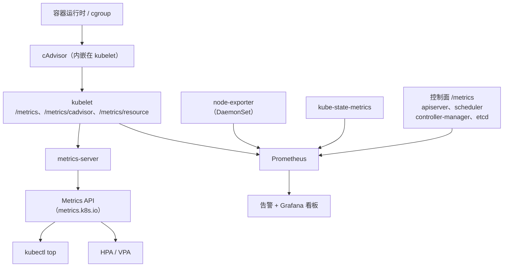
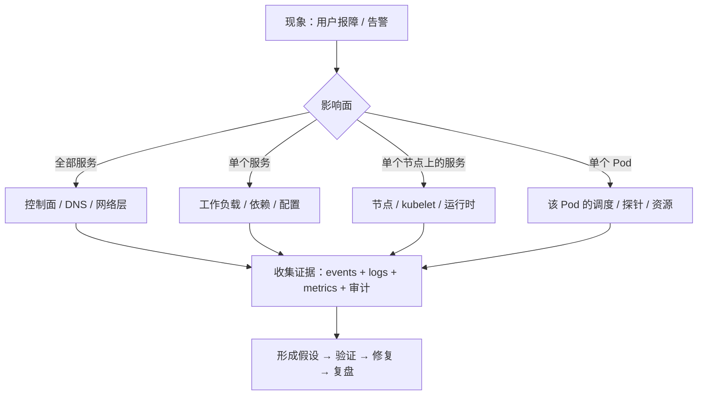

---
tags:
  - Kubernetes
  - 运维
  - 可观测性
  - HPA
  - 排障
created: 2026-09-13
---

# 生产运维与可观测性

> 本笔记对应 [[00_简介]] 的「阶段 7」。目标：能把「指标 / 日志 / 事件」三条可观测链路搭起来并用它们定位问题，能在不中断业务的前提下做节点维护与集群升级，能按时间线把「服务很慢」这类模糊报障拆成可验证的假设，并且**真的亲手做过一次 etcd 恢复演练**。
>
> 关联复习：[[01_核心架构与对象模型]]（etcd、apiserver 链路、控制面指标）、[[02_工作负载与控制器]]（滚动更新与发布策略）、[[03_调度_资源_QoS]]（驱逐、QoS、Pending 排查）、[[04_网络]]（DNS 与 Service 排障）、[[05_存储]]（PVC 与备份分层）、[[06_安全]]（审计日志、`/metrics` 的 RBAC 授权）
>
> 说明：本笔记的字段、默认值与行为均以官方文档和 Kubernetes 源码为准，主要对照 Kubernetes 1.37 时期的文档；凡有版本差异的地方都标注引入或弃用版本，落地前请对照集群实际版本。

## 0. 30 秒速览

> [!abstract] 这一页只要记住六句话
> - **可观测性是三条链路，不是一套仪表盘**：Metrics 回答"趋势对不对"、Logs 回答"具体发生了什么"、Events 与审计回答"谁在什么时候做了什么"。缺任何一条，排障都会退化成猜。
> - **`kubectl top` 和 HPA 靠的是 metrics-server**（Metrics API），而 Prometheus 生态里的 `kube-state-metrics` 提供的是"对象状态"（期望副本数、Pod 阶段、PDB 预算…）。**两者回答的问题不同，混用会得出错误结论**。
> - **节点失联的完整时间线**：kubelet 心跳停止 → `--node-monitor-grace-period`（默认 **50s**）后 Ready 变 `Unknown` → 同时被打上 `not-ready`/`unreachable` 污点，Pod 默认只能容忍 **300s** → node controller 在标记 `Unknown` 后默认**再等 5 分钟**才发起驱逐。所以"节点挂了，Pod 多久会飘走"的答案是**约 5~6 分钟**。
> - **节点维护是四步**：`cordon` → `drain` → 维护 → `uncordon`。drain 会走 **Eviction API** 并尊重 PDB；drain 卡住只会是四类原因：PDB 挡住、裸 Pod（无控制器）、DaemonSet、本地存储（`emptyDir` / `local` PV）。
> - **升级不能跳小版本**（kubeadm 明确不支持）：控制面逐台 → 插件 → 工作节点逐台 drain 后升级 kubelet/kube-proxy。版本偏斜政策：kubelet 最多比 apiserver 老 **3 个小版本**，kubectl 建议 ±1。**升级没有官方回滚**，回滚等于从 etcd 快照恢复。
> - **「服务很慢」按层级往下查**：资源（throttling / 内存 / 磁盘）→ 探针与重启 → 网络（DNS、端点）→ 依赖（数据库/缓存/外部 API）→ 存储 → 最后才是应用代码。顺序反了就会在日志里打转。

> [!tip] 怎么用这篇笔记
> 首学按 1→2→3→4 的顺序读；复习时只看第 0 节和第 6 节。
> 第 3 节的 etcd 恢复演练请务必在测试集群亲手做一遍——这是本篇唯一"看会了不算会"的内容。

## 1. 可观测性的三条链路

### 1.1 三种信号各回答什么问题

| 信号 | 回答的问题 | 数据形态 | 典型工具 |
| --- | --- | --- | --- |
| Metrics | "现在的趋势正常吗？要不要告警？" | 数值时间序列，可聚合、可求速率 | Prometheus + Grafana、metrics-server |
| Logs | "那一刻具体发生了什么？" | 离散文本流，细节最丰富、成本最高 | Loki / EFK、云日志服务 |
| Events 与 Audit | "谁在什么时候改了什么？为什么这个对象起不来？" | 结构化短记录，**默认只保留约 1 小时** | `kubectl describe`、事件采集、审计日志 |
| Traces | "这一次请求慢在哪一跳？" | 跨服务调用链 | OpenTelemetry + Jaeger/Tempo |

三条链路的分工要背下来：**指标发现问题、日志/事件解释问题、链路定位问题**。只有指标没有日志，你会知道"延迟涨了"但不知道为什么；只有日志没有指标，你会在海量文本里翻找，而且永远不知道"只有这一个 Pod 慢，还是全都慢"。

### 1.2 指标链路：从 cgroup 到告警



每一层提供的东西不一样，选错就会得出错误结论：

| 数据源 | 提供什么 | 谁在用 | 注意 |
| --- | --- | --- | --- |
| cAdvisor（kubelet 内） | 容器级 CPU / 内存 / 文件系统 / 网络，以及 PSI（`KubeletPSI`，1.36 起稳定） | Prometheus 抓 `/metrics/cadvisor` | 它是"资源用了多少" |
| kubelet `/metrics/resource` | 节点级汇总的资源用量 | metrics-server | 也是"资源用了多少" |
| **metrics-server** | 只提供 CPU / 内存的当前值，实现 Metrics API | `kubectl top`、HPA、VPA | 不存储历史、不用于告警 |
| **kube-state-metrics** | **对象状态**：Pod 阶段、重启次数、期望副本数、PVC 状态、PDB 预算、证书过期时间…… | Prometheus | 它是"对象状态对不对"，**不含资源用量** |
| node-exporter | 节点 OS 指标：CPU、内存、磁盘、网络、文件系统 | Prometheus | 节点级故障的第一现场 |
| 控制面 `/metrics` | apiserver 请求延迟/错误、etcd fsync 与 leader 变更、调度延迟、控制器队列深度 | Prometheus | **读取需要 RBAC 授权**（对 `/metrics` 这类非资源 URL 授权），见 [[06_安全]] |

指标怎么选，用的是两套经典方法论：

- **USE（资源视角）**：Utilization、Saturation、Errors——分别看利用率、饱和度（排队/节流）、错误。适合节点、磁盘、网络、CPU。
- **RED（服务视角）**：Rate、Errors、Duration——请求速率、错误率、延迟分布。适合业务服务，也是 SLO 的基础。
- **四个黄金信号**：延迟、流量、错误、饱和度——和上面两者互为补充。

> [!important] 最容易搞混的一对指标源
> 有人看到 `kube_pod_container_resource_requests`（kube-state-metrics）就以为"这是 Pod 的资源使用"，其实那是**配置的 requests**；真正的使用量来自 cAdvisor / metrics-server（`container_cpu_usage_seconds_total`、`container_memory_working_set_bytes`）。**用 requests 当使用量做容量规划，是生产上很常见的一类错误。**

### 1.3 日志链路

**容器日志的约定与落点**：

- 应用把日志写到 **stdout / stderr**，这是 Kubernetes 唯一"原生支持"的方式；
- kubelet 负责把日志写到节点上的 `/var/log/pods/<namespace>_<pod>_<uid>/<container>/`，并维护 `/var/log/containers/*.log` 软链接；
- CRI 的日志格式是「时间戳 + 流（stdout/stderr）+ 标记 + 内容」，所以多行日志（Java 堆栈、Python traceback）在采集端需要额外配置合并规则；
- **轮转由 kubelet 负责**（1.21 起稳定）：`containerLogMaxSize` 默认 **10Mi**、`containerLogMaxFiles` 默认 **5**；写日志太猛的 Pod 会把节点磁盘写满，进而触发 `DiskPressure` 驱逐——日志量本身就是容量规划的一部分。

**三种采集架构**：

| 架构 | 做法 | 优点 | 代价 |
| --- | --- | --- | --- |
| 节点 DaemonSet agent（最常用） | 每个节点跑一个采集器，读 `/var/log/pods` | 应用零改造、资源开销集中可控 | agent 需要权限读节点目录；多行解析要配好 |
| Sidecar 流式转发 | 应用容器旁边挂一个 sidecar，读同一份日志并转发 | 可以按应用定制处理、可写文件系统受限 | 每个 Pod 多一个容器，开销按 Pod 放大 |
| Sidecar 直接写文件 | 应用写文件，sidecar 读文件转发 | 兼容必须写文件的旧应用 | 日志不走 stdout，`kubectl logs` 看不到 |

实践要点：

- **日志必须集中**：节点被删掉时，节点上的日志一起消失；
- 优先让应用输出**结构化日志（JSON）**，字段化后才好按 trace_id / user_id 聚合，也能省掉大量正则；
- 日志系统自己要有容量与保留策略（按天/按量），并区分应用日志与审计日志的保留周期；
- **不要把敏感信息写进日志**（凭据、token、个人数据），这一点在 [[06_安全]] 的审计部分同样适用。

### 1.4 事件与审计：最容易被忽略的一条链路

- **Events 是排障第一现场**：`kubectl describe pod` 底部就是它。但事件**默认只保留 1 小时**（kube-apiserver 的 `--event-ttl` 默认 `1h0m0s`），事后去查往往已经没了——所以生产要把事件采集到日志/告警系统里。
- 常用命令：

```text
kubectl get events -A --sort-by=.lastTimestamp | tail -50
kubectl get events -A --field-selector type=Warning
kubectl describe pod <name>                 # 单个对象的完整事件时间线
```

- **审计日志**记录"谁在什么时候对什么对象做了什么"（见 [[06_安全]]）。它和事件互补：事件描述对象的状态变化，审计描述人的动作，**排查"是谁把它改坏的"只能靠审计**。
- 2 分钟热度之外的建议：把 Warning 事件做成指标/告警（例如 `kube_pod_container_status_restarts_total` 涨得快、`FailedScheduling` 出现），让异常主动找上门。

### 1.5 告警怎么设计才不吵

| 层次 | 告警对象 | 例子 |
| --- | --- | --- |
| 用户可见（最重要） | SLO / 错误预算 | 核心接口 5 分钟错误率 > 1%、P99 延迟超阈值 |
| 服务级 | RED | 某个 Deployment 的 5xx 比例、重试率、队列积压 |
| 基础设施级 | USE + 集群组件 | 节点 NotReady、apiserver 5xx/延迟、etcd fsync 与 leader 变更、kubelet PLEG 异常、磁盘/Inode 水位 |
| 平台级 | Kubernetes 特有对象 | PVC 使用率、证书到期、HPA 长期顶到 `maxReplicas`、PDB 阻止驱逐、准入 webhook 失败率 |

三条经验：

1. **告警要能行动**：不能指导动作的告警就是噪音，要么改阈值，要么删掉；
2. **按服务/命名空间聚合**，不要"一个 Pod 一条告警"，否则一次扩缩容就能刷屏；
3. **告警要区分"症状"与"原因"**：用户侧延迟是症状（值得叫醒人），etcd fsync 变慢是原因（更适合看板）。

## 2. 容量、伸缩与日常运维

### 2.1 日常巡检看什么

| 维度 | 关键问题 | 主要数据源 |
| --- | --- | --- |
| 容量余量 | 节点 allocatable 减去所有 requests 还剩多少？还能扛几个副本？ | kube-state-metrics + 节点指标 |
| 饱和度 | CPU 被 throttle 了吗？内存紧吗？磁盘/Inode 水位如何？ | cAdvisor（`container_cpu_cfs_throttled_seconds_total`）、node-exporter |
| 稳定性 | 有没有反复重启、驱逐、OOM、探针失败？ | kube-state-metrics、事件 |
| 控制面 | apiserver 延迟/5xx、etcd fsync 与 leader、调度与控制器队列深度 | 控制面 `/metrics` |
| 存储 | PVC 使用率、扩容中/失败、节点可挂载卷数余量 | 驱动指标 + [[05_存储]] 的命令 |
| 生命周期 | 证书还有多久到期？组件版本是否偏离？ | `kubeadm certs check-expiration`、版本清单 |

**requests 是调度依据，使用量是容量依据**：判断"还能不能再塞 Pod"要看 requests 与 allocatable；判断"要不要扩容"要看实际使用率与饱和度。两者的结论经常相反（requests 很保守、实际用量很低；或反之），这正是需要同时看两类指标的原因。

### 2.2 自动伸缩：HPA / VPA / KEDA / 集群层

| 机制 | 解决什么 | 依赖 | 注意 |
| --- | --- | --- | --- |
| HPA | 按指标调**副本数** | Metrics API（metrics-server）或自定义/外部指标 | 需要 requests 才能算利用率；缩容有稳定窗口 |
| VPA | 按历史用量调**requests/limits** | Metrics Server 或同类指标源；**是 CRD，需要单独安装** | `Recreate` 会驱逐 Pod；与 HPA 同时按 CPU 扩缩容易打架 |
| KEDA | 按**外部事件**（队列长度、积压量）扩缩 | 提供 external metrics 的适配器 | 适合消息队列/消费者场景 |
| Cluster Autoscaler / Karpenter | 按 Pending Pod 调**节点数** | 云厂商 API | 与 PDB、拓扑、本地存储交互复杂 |

HPA 的核心机制（1.37 时期）：

- 计算公式：`desiredReplicas = ceil(currentReplicas × currentMetricValue / desiredMetricValue)`；
- **容差默认 0.1**：比值在 1.0 附近时不做任何动作，避免抖动；
- 默认同步周期 **15 秒**（`--horizontal-pod-autoscaler-sync-period`）；
- **缩容有默认 5 分钟的稳定窗口**（`--horizontal-pod-autoscaler-downscale-stabilization`），窗口内取最高建议值，所以缩容是缓慢的；
- 未就绪 Pod 与缺指标的 Pod 会被"保守处理"（缩容时假设它们吃了满额、扩容时假设它们没吃），这些都影响你看到的扩缩速度；
- 用 `autoscaling/v2` 的 `behavior` 可以分别给 `scaleUp` / `scaleDown` 配策略和 `stabilizationWindowSeconds`。

> [!example]- 动手验证：带行为的 HPA
> ```yaml
> apiVersion: autoscaling/v2
> kind: HorizontalPodAutoscaler
> metadata:
>   name: web
> spec:
>   scaleTargetRef:
>     apiVersion: apps/v1
>     kind: Deployment
>     name: web
>   minReplicas: 2
>   maxReplicas: 10
>   metrics:
>     - type: Resource
>       resource:
>         name: cpu
>         target:
>           type: Utilization
>           averageUtilization: 70
>   behavior:
>     scaleDown:
>       stabilizationWindowSeconds: 300
>       policies:
>         - type: Percent
>           value: 50
>           periodSeconds: 60
>     scaleUp:
>       stabilizationWindowSeconds: 0
>       policies:
>         - type: Pods
>           value: 4
>           periodSeconds: 15
> ```
> ```text
> kubectl get hpa web                     # 看 TARGETS 是否真的拿到了指标
> kubectl describe hpa web                # Conditions 与 Events 会说明"为什么没扩/没缩"
> kubectl top pods -l app=web             # 被 HPA 监控的实时用量
> ```
> `TARGETS` 显示 `<unknown>` 通常意味着 metrics-server 没装好、Pod 没有 requests，或者指标还没采集到——**先修这三件事，再怀疑 HPA 算法**。

VPA 的 `updateMode`（`autoscaling.k8s.io/v1`）值得单独记：`Off`（只给建议）、`Initial`（只在新 Pod 上生效）、`Recreate`（差距大时驱逐重建）、`InPlaceOrRecreate`（优先原地改，改不了才重建）、`InPlace`（只原地改，不达标就等下次）。原地调整依赖的 **In-place Pod resize 自 1.35 起稳定**（1.27 引入），意味着改 requests/limits 不再必然重启 Pod。

### 2.3 PodDisruptionBudget：让"自愿中断"变得可预期

- **自愿中断**（人发起的删除、`kubectl drain`、节点池收缩）**受 PDB 保护**；**非自愿中断**（节点宕机、内核 OOM）**PDB 挡不住，但会消耗预算**。
- PDB 通过 label selector 选中 Pod，用 `minAvailable` 或 `maxUnavailable` 表达"至少 / 至多有多少个不可用"；控制器会把这个预算转换成**同一时刻最多能驱逐几个**。
- 只有走 **Eviction API** 的组件才尊重 PDB。`kubectl delete pod` 是直接删除，**绕过 PDB**——这就是"用 delete 删 Pod 会打穿可用性"的原因。
- **滚动更新不受 PDB 限制**（Deployment 有自己的 `maxUnavailable`）。PDB 管的是"节点维护/驱逐"，不是发布。
- `unhealthyPodEvictionPolicy`（1.27 引入，**1.31 起稳定**）决定"不健康的 Pod 算不算占用预算"：默认 `IfHealthyBudget` 会让长期 CrashLoop 的 Pod 挡住 drain，官方建议设为 **`AlwaysAllow`**，让排空能继续。
- 与 HPA 的关系：**不冲突但会叠加**。HPA 缩容属于自愿中断吗？——不是，HPA 触发的删除由控制器直接执行，不受 PDB 约束；真正会互相影响的是"节点池缩容 + HPA 同时缩"造成的容量紧张。

> [!example]- 动手验证：PDB 如何阻止 drain
> ```yaml
> apiVersion: policy/v1
> kind: PodDisruptionBudget
> metadata:
>   name: web-pdb
> spec:
>   minAvailable: 2
>   unhealthyPodEvictionPolicy: AlwaysAllow
>   selector:
>     matchLabels:
>       app: web
> ```
> ```text
> kubectl get pdb web-pdb                 # 看 ALLOWED DISRUPTIONS 是否 > 0
> # 制造一台只有该 Deployment 的 Pod 的节点，然后：
> kubectl drain <node> --ignore-daemonsets --delete-emptydir-data --dry-run=server
> # 预期：allowed disruptions = 0 时报 "Cannot evict pod as it would violate the pod's disruption budget."
> kubectl get pod --field-selector=status.phase!=Running
> # 先修不健康的副本，再重新 drain——这比加 --force 安全得多
> ```

### 2.4 节点维护：cordon / drain / uncordon

标准流程（**一台一台做**）：

```text
kubectl cordon <node>                                   # 标记不可调度（不影响已运行的 Pod）
kubectl drain <node> --ignore-daemonsets --delete-emptydir-data --dry-run=server   # 先演练
kubectl drain <node> --ignore-daemonsets --delete-emptydir-data                    # 真正排空
# 维护……
kubectl uncordon <node>
```

几个必须理解的行为：

- `drain` 走 **Eviction API**，因此会尊重 PDB，并会**周期性重试被拒绝的驱逐**直到成功或超时；
- 有 DaemonSet 时必须 `--ignore-daemonsets`：DaemonSet 的 Pod 会无视 `unschedulable` 污点继续回到节点上，**drain 不会（也不该）移除它们**；
- 有 `emptyDir` 数据时必须显式加 `--delete-emptydir-data`，否则 drain 会直接报错停下——这个报错是**保护机制**，提醒你"删了这些 Pod 会丢数据"；
- 不要给 Pod 加 `node.kubernetes.io/unschedulable` 的容忍，也不要手写 `nodeName`：这两件事都会让 Pod 落到已排空的节点上。

> [!danger] drain 卡住只会是四类原因
> | 原因 | 现象 | 处理 |
> | --- | --- | --- |
> | **PDB 预算为 0** | `Cannot evict pod as it would violate the pod's disruption budget` | 先修复不健康副本，或把不健康 Pod 纳入 `AlwaysAllow` 策略；**不要用 `--force` 绕过** |
> | **裸 Pod（无控制器）** | `cannot delete Pods declare no controller` | 手工确认后 `--force` 删除，或给它找一个控制器 |
> | **DaemonSet** | 报错提示需要 `--ignore-daemonsets` | 加上该参数；这些 Pod 会随节点一起下线 |
> | **本地存储** | 报错要求 `--delete-emptydir-data`，或 `local` PV 的 Pod 一直无法驱逐 | 确认数据可丢再删；`local` PV 的 Pod 迁不走，属于设计限制（见 [[05_存储]]） |

**节点失联时 Pod 的命运**（把这条时间线背下来）：

1. kubelet 停止上报心跳（Lease，默认每 10 秒更新一次）；
2. 超过 `--node-monitor-grace-period`（**默认 50 秒**）后，node-lifecycle-controller 把 Node 的 `Ready` 置为 `Unknown`，并打上 `node.kubernetes.io/not-ready` / `unreachable` 污点；
3. Pod 对这两个污点的默认容忍时间是 **300 秒**（kube-apiserver 的 `--default-not-ready-toleration-seconds` 与 `--default-unreachable-toleration-seconds`，默认都是 300）；
4. 同时 node controller 在标记 `Unknown` 之后**默认还要等 5 分钟**才提交第一个驱逐请求，之后按 `--node-eviction-rate`（默认 0.1，即每 10 秒最多一个节点）节流。

所以：**节点宕机约 5~6 分钟后，Pod 才会被驱逐并在别的节点重建**。如果业务要求更快，就自己去调这三个参数（改之前先想清楚"网络抖动"会不会导致大规模误驱逐）。

### 2.5 集群升级

**版本偏斜政策**（先记住，再谈流程）：

| 组件 | 与 kube-apiserver 的关系 |
| --- | --- |
| 多个 kube-apiserver（HA） | 最新与最旧之间最多差 **1 个小版本** |
| kubelet | 不能比 apiserver 新；最多老 **3 个小版本**（1.25 之前是 2 个） |
| kube-proxy | 不能比 apiserver 新；最多老 3 个小版本；与同节点 kubelet 最多差 3 个 |
| kubectl | 官方建议 ±1 个小版本 |

**流程（kubeadm 集群）**：

1. **升级前**：备份 etcd（见第 3 节）、确认没有弃用 API 在用、确认 PDB 与容量余量能扛住逐台 drain、确认证书未过期；
2. **控制面逐台**：`kubeadm upgrade plan` 查看计划 → 第一台执行 `kubeadm upgrade apply v1.x.y`，其余节点执行 `kubeadm upgrade node` → 升级 kubelet/kubectl → `uncordon`；**一台完全就绪后再动下一台**；
3. **插件（addon）**：控制面全部升级完成后再升 CNI / CoreDNS / 其他组件；
4. **工作节点逐台**：`drain` → 升级 `kubeadm` 与 `kubelet`/`kube-proxy` → `uncordon`；
5. **验收**：节点版本全部一致、Pod 恢复正常、关键业务指标回落到基线。

> [!warning] 两个"必须知道"的约束
> - **不能跳小版本**：kubeadm 明确不支持跳过 MINOR 版本升级，只能 1.36 → 1.37 这样逐级走（补丁版本可以随便挑）。
> - **没有官方回滚**：`kubeadm upgrade` 是单向的。真出问题时的"回滚"实际是**从 etcd 快照恢复 + 重建控制面**，这也是为什么升级前必须先备份。

## 3. 备份与灾难恢复

### 3.1 先想清楚"要恢复什么"

| 层次 | 内容 | 手段 |
| --- | --- | --- |
| 集群状态 | 所有 API 对象（Deployment、Service、RBAC、CRD……） | **etcd 快照** |
| 应用数据 | PV 上的数据 | 卷快照 / 卷克隆 / 备份工具（见 [[05_存储]]） |
| 秘密材料 | Secret、加密密钥、KMS 凭据、TLS 证书 | 密钥管理系统 + 加密后的备份 |
| 交付物 | 镜像、Helm chart、GitOps 仓库 | 镜像仓库 + 代码仓库（也必须有异地副本） |
| 外部依赖 | 集群外的数据库、对象存储、DNS | 各自的备份方案 |

> [!important] 只备份 etcd 是不够的（反过来也一样）
> etcd 快照恢复的是"集群的说明书"，不包含 PV 里的业务数据；而只备份数据不备份 etcd，重建集群时要靠人手把对象重新 apply 一遍。两者的**时间点要尽量对齐**，否则会出现"Deployment 记录的是新版本、卷里是新版本的数据、但快照是旧对象"这类错位。

### 3.2 etcd 备份

两种方式：

- **内置快照**（推荐）：`etcdctl snapshot save` 从存活成员导出，**不影响成员性能**；也可以用 `etcdutl` 校验；
- **卷快照**：存储层支持时可以对 etcd 数据盘做快照；代价是必须处理一致性，一般需要配合停机或第三方工具。

```text
# kubeadm 集群的 etcd 是静态 Pod，证书在 /etc/kubernetes/pki/etcd/
ETCDCTL_API=3 etcdctl \
  --endpoints=https://127.0.0.1:2379 \
  --cacert=/etc/kubernetes/pki/etcd/ca.crt \
  --cert=/etc/kubernetes/pki/etcd/server.crt \
  --key=/etc/kubernetes/pki/etcd/server.key \
  snapshot save /backup/etcd-$(date +%F-%H%M).db

# 校验快照（etcdctl snapshot status 已弃用，用 etcdutl）
etcdutl --write-out=table snapshot status /backup/etcd-2026-09-13-0300.db
# 预期：输出 HASH / REVISION / TOTAL KEYS / TOTAL SIZE 表格
```

实践要求：

- **频率**：至少每天一次，重大变更（升级、迁移、批量变更）前额外做一次；`etcd` 的写入量决定了你的 RPO；
- **加密与权限**：快照里有全部 Secret，**必须加密存储**并严格限制访问（见 [[06_安全]]）；
- **异地**：快照不能只放在同一台机器/同一个可用区；
- **保留**：按合规要求保留多份，并定期验证可读性；
- **注意**：如果集群开启了静态加密但用的是本地密钥（或 KMS），**恢复后要能拿到同一把密钥/KMS**，否则数据是解不开的——密钥的备份常常是 DR 里被遗忘的一环；
- 官方建议生产规模下使用**静态的 3 或 5 成员 etcd**，不要给 etcd 配自动伸缩组（伸缩不会提升性能，只会增加风险）。

### 3.3 恢复演练：本篇唯一"必须动手"的部分

恢复的核心顺序（官方给的安全顺序）：

1. **停掉所有 kube-apiserver**（避免在恢复期间继续写入）；
2. 在**每个 etcd 实例**上用快照恢复数据目录；
3. 重启所有 etcd；
4. 重启 kube-apiserver（官方还建议把 kube-scheduler、kube-controller-manager、kubelet 一并重启，避免它们依赖旧数据）；
5. 校验集群：对象是否齐全、控制器是否开始调谐、Pod 是否逐步恢复。

```text
# 单个 etcd 实例上的恢复（必须用 etcdutl，etcdctl 的 restore 已弃用）
etcdutl --data-dir /var/lib/etcd-restored snapshot restore /backup/etcd-2026-09-13-0300.db
# 然后把 etcd 的 --data-dir 指到新目录（kubeadm 集群改 /etc/kubernetes/manifests/etcd.yaml 并重启 kubelet）
```

> [!warning] 快照与 etcd 的版本约束
> 只能恢复**同一个 major.minor 版本**的 etcd 产生的快照（patch 版本可以不同）。跨小版本恢复前请先升级/降级 etcd 到匹配版本，否则恢复会失败或行为不可预期。

演练时请记录这些结论（这才是演练的价值）：

| 要记录的内容 | 为什么 |
| --- | --- |
| 从"决定恢复"到"服务可用"的墙钟时间 | 这就是真实的 RTO |
| 快照的时间点与最新数据之间的差距 | 这就是真实的 RPO |
| 需要人工执行/确认的步骤 | 决定要不要写成 runbook、要不要脚本化 |
| 恢复后哪些东西没回来（PV 数据、外部依赖、镜像） | 暴露"只备份了 etcd"的盲区 |
| 团队里谁会做这件事 | 避免"只有一个人会" |

**常见误区**：以为有定时快照就等于有 DR（没验证过就没把握）；把快照和数据放在同一个故障域；忘了加密密钥；演练只在测试集群做一次就再也不做（集群、版本、组件都变了，runbook 会过期）。

### 3.4 应用层备份与 DR 目标

- **RTO / RPO 要先和业务谈清楚**：恢复多快、能丢多少数据，直接决定备份频率与架构（同城双活？异地多活？）。
- **卷快照 ≠ 备份**（见 [[05_存储]]）：同一后端、同一账号、同一区域，挡不住区域故障与误删，要配合跨域归档（例如 Velero）与数据库原生备份（binlog/WAL 时间点恢复）。
- **演练要分层做**：单 Pod 故障 → 单节点故障 → 单可用区故障 → 整个集群重建。层次越高，越依赖 etcd 与 PV 的联合恢复能力。

## 4. 故障排查方法论

### 4.1 先定层级，再定对象



三条纪律：

1. **先看影响面**：全都慢、单个服务慢、单节点上的服务慢、单个 Pod 慢——这四个方向的排查路径完全不同；
2. **先拿证据，再动手**：`describe`（事件）、`logs --previous`（上一次容器）、`get -o yaml`（最终生效的配置）、指标与审计；**重启会毁掉现场**，让"偶发故障"变成"查不出来"；
3. **把时间线对齐**：用户报障时间、告警时间、事件时间、发布时间要对齐（注意时区），绝大多数事故都能被"最近改了什么"解释。

### 4.2 高频场景速查

| 现象 | 事件关键词 / 观测点 | 常见根因 | 深入 |
| --- | --- | --- | --- |
| Pod 一直 `Pending` | `FailedScheduling`、`Insufficient cpu/memory`、`node(s) had untolerated taint`、`volume node affinity conflict` | 资源不足、亲和/污点、卷未就绪 | [[03_调度_资源_QoS]] |
| `CrashLoopBackOff` | `BackOff`、容器 Exit Code 与上一次日志 | 启动参数/配置错误、依赖不可用、探针配错、OOMKilled | [[02_工作负载与控制器]] |
| `ImagePullBackOff` | `Failed to pull image`、`unauthorized` | 镜像名/tag 错、私有仓库凭据缺失、仓库限流或网络不通 | — |
| `OOMKilled` | 容器 `Last State: Terminated, Reason: OOMKilled` | 容器内存 limit 太小或内存泄漏 | [[03_调度_资源_QoS]] |
| Pod 被驱逐 | `Evicted`、节点 `MemoryPressure` / `DiskPressure` | 节点资源不足（含日志写满磁盘） | [[03_调度_资源_QoS]] |
| 节点 `NotReady` | Node Condition、`kubelet` 日志与 `journalctl` | kubelet 挂了/证书过期/磁盘满/运行时异常/网络分区 | 4.1 时间线 |
| Service 访问不通 | EndpointSlice 为空、DNS 失败 | 就绪探针、选择器、NetworkPolicy、DNS | [[04_网络]] |
| PVC `Pending` / 挂载失败 | `WaitForFirstConsumer`、`ProvisioningFailed`、`FailedAttachVolume` | 存储类/拓扑/容量/挂载上限 | [[05_存储]] |
| 发布后大面积 5xx | `rollout status`、新副本就绪情况 | 新版本缺陷、探针缺失导致带病上线 | [[02_工作负载与控制器]] |

### 4.3 「服务很慢」怎么查（按顺序，别跳步）

1. **确认是不是集群侧的问题**：`kubectl top pod` 看用量、看 CPU throttling 指标、看重启次数与节点压力——如果这些正常，问题可能在应用或下游；
2. **探针与生命周期**：`readiness` 抖动会让 Pod 反复被摘出/放回（表现为"间歇性超时"）；`liveness` 配得太激进会把启动慢的实例杀掉（表现为周期性重启）；
3. **网络**：DNS 解析延迟（`ndots:5` 造成的额外查询）、Service 端点是否在剧烈变化、连接是否复用、NetworkPolicy 是否误拦（见 [[04_网络]]）；
4. **依赖**：数据库/缓存/外部 API 的延迟与错误率——K8s 层看不到的部分往往才是根因；
5. **存储**：PVC 所在的存储是否饱和、是否存在正在扩容的卷、节点是否接近可挂载卷上限（见 [[05_存储]]）；
6. **最后才是应用自身**：日志、火焰图、GC、线程池。

回答这类问题时，**先说顺序，再说每一步看什么数据**，比直接背指标名字更能体现"生产手感"。

### 4.4 排障工具箱

| 工具 | 用途 |
| --- | --- |
| `kubectl describe` / `kubectl logs --previous` / `kubectl get -o yaml` | 三件套：事件、上次崩溃日志、最终生效的配置 |
| `kubectl debug -it <pod> --image=... --target=<container>` | 给运行中的 Pod 注入 **ephemeral container**（镜像里没有调试工具时的救星） |
| `kubectl debug <pod> --copy-to=<new> --share-processes` | 用同一个卷/配置复制一份 Pod 慢慢调，不影响线上实例 |
| `kubectl debug node/<node> -it --image=busybox` | 直接在节点上起一个调试 Pod（会挂载宿主机的文件系统） |
| `kubectl events` / `kubectl get events --field-selector type=Warning` | 快速捞最近的事件（记住默认只留 1 小时） |
| `crictl ps` / `crictl logs`（节点上） | 容器运行时视角：kubelet 都看不到的容器状态 |
| `journalctl -u kubelet -n 200`（节点上） | kubelet 自己的日志，节点 NotReady 的第一现场 |
| `kubectl get --raw /metrics` 等 | 直接取组件指标，用于确认"指标准不准" |

## 5. 生产实践清单

### 5.1 可观测性

- 指标、日志、事件三条链路都要有，**事件必须采集**（默认 1 小时就没了）；
- 指标按 SLO 分层告警，避免按 Pod 告警刷屏；
- 区分"资源用量"（cAdvisor / metrics-server）与"对象状态"（kube-state-metrics）；
- 控制面与 etcd 指标纳入监控（apiserver 延迟/5xx、etcd fsync、leader 变更）；
- 日志集中采集 + 保留策略 + 结构化输出；容器日志轮转参数纳入容量规划；
- 对"最近一次发布"做变更标记（annotation/事件），排障时能一眼对齐时间线。

### 5.2 可用性与变更

- 控制面 HA（多 master + LB + 3/5 节点 etcd），etcd 不做自动伸缩；
- 核心服务配 PDB 且设 `unhealthyPodEvictionPolicy: AlwaysAllow`，并把"不健康副本"纳入告警；
- 节点维护走 runbook：`cordon` → `drain`（先 `--dry-run=server`）→ 维护 → `uncordon`，一次只动一台；
- 升级前备份 etcd、检查弃用 API、确认容量能扛住逐台 drain；升级过程中盯核心 SLO；
- 所有变更（特别是升级、CNI/CSI 变更、RBAC、webhook）都记录并保留审计。

### 5.3 备份与演练

- etcd 定时快照 + 加密 + 异地 + 定期校验；
- **至少每季度做一次恢复演练**，记录 RTO/RPO 与 runbook；升级前额外做一次；
- PV 数据、密钥材料、镜像与交付物分别有备份方案，并保证时间点尽量对齐；
- 把"演练"扩展到故障注入（Node 宕机、Pod 被杀、依赖超时），验证告警、PDB、自动伸缩与恢复流程是否真的有效。

## 6. 要点自测

复述时先盖住答案自己讲一遍，再展开对照。每张卡能在 3~5 分钟内脱稿讲完就算过关。

> [!question]- 可观测性三条链路分别回答什么问题？metrics-server 和 kube-state-metrics 有什么区别？
> - **Metrics**：趋势与告警（数值时间序列）；**Logs**：细节（文本）；**Events/审计**：对象状态变化与人的动作。指标发现问题、日志解释问题、链路定位问题。
> - **metrics-server** 实现 Metrics API，只提供当前 CPU/内存用量，供 `kubectl top`、HPA、VPA 使用，**不存储历史**；
> - **kube-state-metrics** 把对象状态转成指标（期望副本、重启次数、PVC 状态、PDB 预算），给 Prometheus 做告警与看板，**不含资源用量**。
> - 常见错误：拿 `kube_pod_container_resource_requests`（配置）当"资源使用量"。

> [!question]- 节点失联后，Pod 多久会被驱逐？完整时间线是什么？
> - kubelet 心跳（Lease）停止 → 超过 `--node-monitor-grace-period`（**默认 50s**）后被标记 `Ready=Unknown`；
> - 同时加上 `not-ready` / `unreachable` 污点，Pod 默认容忍 **300s**；
> - node controller 在标记 `Unknown` 后**再等 5 分钟**才提交第一个驱逐请求，之后按 0.1 节点/秒节流；
> - 结论：约 **5~6 分钟**后 Pod 才会被驱逐重建。要更快只能改这三个参数，但要防网络抖动引发误驱逐。

> [!question]- `kubectl drain` 卡住一般是什么原因？怎么处理？
> - 四类原因：**PDB 预算为 0**（先修不健康副本，别用 `--force`）、**裸 Pod**（无控制器，确认后可 `--force`）、**DaemonSet**（加 `--ignore-daemonsets`）、**本地存储**（`--delete-emptydir-data` 或 `local` PV 无法迁移）。
> - drain 走 Eviction API，会尊重 PDB 并自动重试；`kubectl delete pod` 则是直接删除，**绕过 PDB**。
> - 先 `--dry-run=server` 演练，一次只 drain 一台节点。

> [!question]- PDB 保护什么、不保护什么？和 HPA、滚动更新会不会冲突？
> - 只保护**自愿中断**（`drain`、节点池收缩、走 Eviction API 的操作）；**非自愿中断**（宕机、OOM）PDB 挡不住，但会消耗预算。
> - **滚动更新不受 PDB 限制**（由 Deployment 的 `maxUnavailable` 控制）；HPA 造成的副本变化也不经过 Eviction API。
> - `minAvailable` / `maxUnavailable` 二选一；`unhealthyPodEvictionPolicy: AlwaysAllow` 可避免 CrashLoop 的 Pod 长期挡住 drain。

> [!question]- 集群升级的流程与约束是什么？为什么不能"回滚"？
> - **偏斜政策**：HA 的 apiserver 之间最多差 1 个小版本；kubelet 不能比 apiserver 新、最多老 3 个小版本（1.25 前是 2 个）；kubectl 建议 ±1。
> - **流程**：备份 etcd → 检查弃用 API 与容量 → 控制面逐台 `kubeadm upgrade apply/node` → 插件 → 工作节点逐台 drain/升级/uncordon → 验收。
> - **不能跳小版本**（kubeadm 不支持）；**没有官方回滚**，出问题只能从 etcd 快照恢复。

> [!question]- etcd 备份与恢复怎么做？常见误区有哪些？
> - **备份**：`etcdctl snapshot save`（可配合 `etcdutl snapshot status` 校验），加密集群要保证密钥/KMS 可用；快照异地保存、定时校验。
> - **恢复顺序**：停所有 apiserver → 每个 etcd 用 `etcdutl snapshot restore --data-dir ...` 恢复 → 重启 etcd → 重启 apiserver（建议一并重启 scheduler/controller-manager/kubelet）。
> - **误区**：只备份 etcd 忘了 PV 与密钥；快照和数据在同一故障域；从不演练；跨小版本恢复（只支持同 major.minor）。

> [!question]- 用户说「服务很慢」，你的排查顺序是什么？
> - 资源（CPU throttling / 内存 / 磁盘）→ 探针与重启（readiness 抖动、liveness 杀启动慢的实例）→ 网络（DNS、端点、策略）→ 依赖（数据库/缓存/外部 API）→ 存储（IO 饱和、扩容中、卷上限）→ 应用自身。
> - 同时对齐"最近改了什么"（发布、配置、扩缩容）与时间线；**先取证据再动手，不要先重启**。
> - 加分项：说明用 RED/USE 指标如何把"慢"量化成可验证的假设。

> [!question]- 设计题：给一套生产集群设计"可观测性 + 备份 + 变更"方案，你会怎么答？
> - **可观测**：Prometheus（cAdvisor + kube-state-metrics + node-exporter + 控制面）→ 分层告警；日志集中采集；事件与审计入湖；关键 SLO 有看板与错误预算。
> - **备份**：etcd 定时加密快照（异地、校验）+ PV/应用层备份（快照 + 跨域归档 + 数据库原生）+ 密钥材料备份；RTO/RPO 和业务对齐；季度恢复演练。
> - **变更**：runbook（cordon/drain/uncordon、升级、回滚）、变更窗口与灰度、PDB 全覆盖、升级前备份、变更后盯 SLO；Chaos/GameDay 定期验证。

## 7. 回到路线图

完成本笔记后，回到 [[00_简介]]：

- [ ] 能说清指标、日志、事件三条链路各自回答什么问题，并搭出基础版本
- [ ] 能区分 metrics-server 与 kube-state-metrics，会把 RED/USE 用对地方
- [ ] 能按事件时间线讲清节点 NotReady 后 Pod 的完整经历（50s / 300s / 5min）
- [ ] 能用 PDB 正确保护可用性，并知道它不保护什么
- [ ] 能独立完成一次节点维护（cordon → drain → 维护 → uncordon）并处理四类卡住原因
- [ ] 能说出升级的前置检查、顺序、版本偏斜约束，以及为什么"回滚 = 恢复快照"
- [ ] 能手写 etcd 备份与恢复命令，并做过一次恢复演练、记录 RTO/RPO
- [ ] 面对「服务很慢」能按层级给出可验证的排查顺序，而不是直接重启
- [ ] 能为一个生产集群设计「监控告警 + 备份恢复 + 变更流程」的整体方案

> 推荐扩展阅读：官方文档中的 [Node](https://kubernetes.io/docs/concepts/architecture/nodes/)（心跳与节点状态）、[Pod Disruptions](https://kubernetes.io/docs/concepts/workloads/pods/disruptions/)（PDB 语义）、[Horizontal Pod Autoscaling](https://kubernetes.io/docs/concepts/workloads/autoscaling/horizontal-pod-autoscale/)、[Vertical Pod Autoscaling](https://kubernetes.io/docs/concepts/workloads/autoscaling/vertical-pod-autoscale/)、[Metrics for Kubernetes system components](https://kubernetes.io/docs/concepts/cluster-administration/system-metrics/)、[Resource metrics pipeline](https://kubernetes.io/docs/tasks/debug/debug-cluster/resource-metrics-pipeline/)、[Logging Architecture](https://kubernetes.io/docs/concepts/cluster-administration/logging/)、[Node-pressure Eviction](https://kubernetes.io/docs/concepts/scheduling-eviction/node-pressure-eviction/)、[Safely Drain a Node](https://kubernetes.io/docs/tasks/administer-cluster/safely-drain-node/)、[Upgrading kubeadm clusters](https://kubernetes.io/docs/tasks/administer-cluster/kubeadm/kubeadm-upgrade/)、[Operating etcd](https://kubernetes.io/docs/tasks/administer-cluster/configure-upgrade-etcd/)、[Monitor Node Health](https://kubernetes.io/docs/tasks/debug/debug-cluster/monitor-node-health/)、[Troubleshooting](https://kubernetes.io/docs/tasks/debug/) 与 [Version Skew Policy](https://kubernetes.io/releases/version-skew-policy/)。
>
> 生态工具：[Prometheus Operator](https://prometheus-operator.dev/)、[kube-state-metrics](https://github.com/kubernetes/kube-state-metrics)、[Loki](https://grafana.com/oss/loki/)、[OpenTelemetry](https://opentelemetry.io/)、[Velero](https://velero.io/)、[Chaos Mesh](https://chaos-mesh.org/)、[KEDA](https://keda.sh/)。
