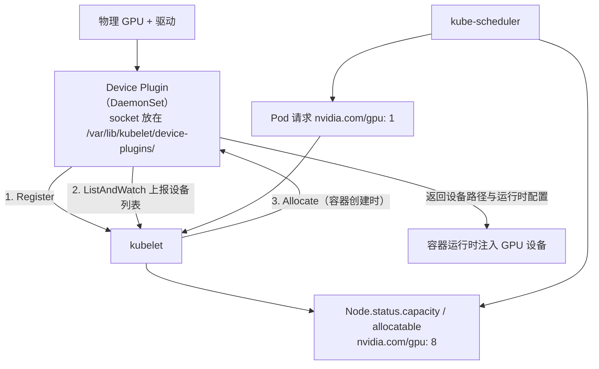

---
tags:
  - Kubernetes
  - GPU
  - AI
  - 调度
  - RDMA
created: 2026-09-13
---

# GPU / AI 场景扩展

> 本笔记对应 [[Kubernetes/00_简介]] 的「阶段 8」。目标：能讲清 GPU 是**怎么变成** Kubernetes 可调度资源的、NVIDIA GPU Operator 到底装了哪些组件、三种 GPU 共享方式（时间切片 / MIG / MPS）的取舍、多卡训练为什么同时需要**拓扑感知**与 **gang 调度**、训练网络（RDMA/RoCE）怎么接进来，以及 GPU 监控告警怎么落地。
>
> 关联复习：[[03_调度_资源_QoS]]（扩展资源、QoS、污点与亲和）、[[04_网络]]（Multus / SR-IOV / RDMA CNI）、[[02_工作负载与控制器]]（Job 与控制器）、[[07_生产运维与可观测性]]（指标、告警、节点维护）
>
> 说明：本笔记的字段、默认值与行为均以官方文档为准——Kubernetes 侧对照 1.37 时期的文档，NVIDIA 侧对照 GPU Operator / DCGM Exporter 的当前文档；生态组件（Volcano、Kueue、Kubeflow）迭代很快，落地前请对照你所用版本的文档核对 API 版本与字段。

## 0. 30 秒速览

> [!abstract] 这一页只要记住六句话
> - **GPU 在 K8s 里是「扩展资源」**：由 device plugin 通过 gRPC 向 kubelet 注册并上报，最终出现在 Node 的 `capacity` / `allocatable` 里，名字形如 `nvidia.com/gpu`。扩展资源**必须是整数、不能超卖**，`requests` 与 `limits` 同时存在时必须相等。
> - **NVIDIA GPU Operator = 驱动 + Container Toolkit + Device Plugin + DCGM Exporter + MIG Manager（+ NFD/GFD/Validator）**：默认部署在每个 GPU 节点上，NFD 是它的硬依赖；也可以选择「节点预装驱动 + Operator 只装其余组件」的路线。
> - **共享 GPU 有三条路，隔离强度完全不同**：**时间切片**可超卖但**没有显存与故障隔离**；**MIG** 在硬件层切分、有显存与故障隔离（需要 A100/H100 这类机型）；**MPS** 让多进程共享上下文。时间切片还有一个副作用：DCGM Exporter **无法把指标关联到具体容器**。
> - **多卡训练的两个硬需求**：**拓扑**（NVLink/NVSwitch/PCIe/NUMA + NCCL 自己探测）与 **gang 调度**（要么全部 worker 一起起，要么都不起，否则 GPU 被占着互相等待，直接死锁）。
> - **训练网络是"两张网卡"的事**：默认 CNI 管控制面与 Service，高速网络靠 **Multus + SR-IOV + RDMA CNI** 提供第二张网卡；RDMA 流量**不走 Service/DNS**，必须单独验证（`ibv_devinfo`、nccl-tests）。
> - **GPU 监控别只看利用率**：DCGM Exporter 的 `DCGM_FI_DEV_GPU_UTIL`、`FB_USED`、`GPU_TEMP`、`POWER_USAGE`、`XID_ERRORS` 要一起看；**XID 错误与温度/ECC 才是硬件故障的第一现场**。

> [!tip] 怎么用这篇笔记
> 首学按 1→2→3→4→5 的顺序读；如果时间紧，至少把第 0、1、2 节读懂——面试和设计题绝大多数问题都落在这里。
> 第 1.1 节的 Device Plugin 机制建议自己在一个单机集群上装一次 NVIDIA device plugin，亲眼看到 `nvidia.com/gpu` 出现在 Node 的 allocatable 里。

## 1. GPU 如何变成可调度资源

### 1.1 Device Plugin：GPU 进入 Kubernetes 的唯一入口

Kubernetes 本身不认识 GPU。它提供的是一套**设备插件框架**：厂商写一个插件（通常以 DaemonSet 部署在每个节点上），插件通过 gRPC 与 kubelet 对话，把设备"卖"给 kubelet。



关键的协议与方法（都在 kubelet 的 `DevicePlugin` gRPC 服务里）：

| 方法 | 作用 |
| --- | --- |
| `Register` | 插件向 kubelet 注册自己，声明 socket 名、API 版本与要上报的资源名 |
| `ListAndWatch` | kubelet 持续获取设备列表；设备变化或消失都要通知 kubelet |
| `Allocate` | **容器创建时**调用，插件返回设备路径、环境变量、挂载点等运行时配置 |
| `GetPreferredAllocation` | 可选，让插件在大批量设备里给出"更适合一起分配"的组合 |
| `PreStartContainer` | 可选，容器启动前做设备重置等准备工作 |

几个容易被追问的细节：

- **资源名**：形如 `<vendor-domain>/<resource>`，NVIDIA 用 `nvidia.com/gpu`；扩展资源名在 `kubernetes.io` 域下是保留的。
- **socket 位置**：插件把 Unix socket 放在**宿主机的** `/var/lib/kubelet/device-plugins/`，通过 `Register` 告诉 kubelet 自己叫什么。
- **kubelet 重启**：新 kubelet 会删掉该目录下的旧 socket，插件必须能检测到并**重新注册**；所以设备插件普遍要挂载这个目录。
- **插件挂了会怎样**：kubelet 会认为资源不可用（设备从 allocatable 中移除），已有 Pod 不受影响，但新 Pod 无法再申请到 GPU。
- **它只负责"分配"，不负责"调度"**：调度决策由 kube-scheduler 根据 `allocatable` 做，插件只保证"被分配的设备真的注入容器"。

### 1.2 扩展资源的硬规则

| 规则 | 说明 |
| --- | --- |
| 必须是整数 | 不能写 `nvidia.com/gpu: 0.5` |
| 不能超卖 | **`requests` 与 `limits` 同时存在时必须相等**；换句话说，一个 GPU 不能同时被两个 Pod"占额"（除非用共享机制把一张卡上报成多份资源） |
| 调度依据是 requests | 和 CPU/内存一致，**只有 requests 参与调度**；因为没有超卖，实际就等于"整块占住" |
| 配额用 `requests.` 前缀 | `ResourceQuota` 只允许 `requests.nvidia.com/gpu`，不允许 `limits.nvidia.com/gpu` |
| 没有 requests 会被当成 0 | Pod 不写 requests 就能调度上去，但运行时也拿不到 GPU（容器里看不到设备）——这是新手最常见的"调度成功但 `nvidia-smi` 报错" |

> [!example]- 动手验证：一个最小 GPU Pod + 命名空间配额
> ```yaml
> apiVersion: v1
> kind: Pod
> metadata:
>   name: gpu-test
> spec:
>   restartPolicy: Never
>   containers:
>     - name: cuda
>       image: nvcr.io/nvidia/k8s/cuda-sample:vectoradd-cuda12.5.0
>       resources:
>         limits:
>           nvidia.com/gpu: 1
> ---
> apiVersion: v1
> kind: ResourceQuota
> metadata:
>   name: gpu-quota
>   namespace: team-a
> spec:
>   hard:
>     requests.nvidia.com/gpu: "8"
> ```
> ```text
> kubectl get node <gpu-node> -o jsonpath='{.status.allocatable.nvidia\.com/gpu}{"\n"}'   # 例如 8
> kubectl get pod gpu-test -o jsonpath='{.spec.containers[0].resources}{"\n"}'
> kubectl logs gpu-test          # 预期看到 [Vector addition of 50000 elements] 与 Test PASSED
> kubectl -n team-a describe quota gpu-quota     # 看 Used / Hard
> ```
> 如果 Pod 一直 Pending，事件里会写 `0/3 nodes are available: 3 Insufficient nvidia.com/gpu.`——这是"节点上没有可分配的 GPU 资源"的标准信号，优先排查 device plugin 是否就绪、驱动是否装上。

### 1.3 节点侧：驱动、运行时与 GPU Operator

要让上面这套跑起来，节点上必须准备好几层东西——这正是 NVIDIA GPU Operator 存在的理由：

| 组件 | 作用 | 备注 |
| --- | --- | --- |
| NVIDIA GPU 驱动 | 内核模块 + `nvidia-smi`/CUDA 支持 | 由 Driver Manager/Driver 容器安装，也可以节点预装 |
| NVIDIA Container Toolkit | 让容器运行时能把 GPU 设备与驱动库注入容器 | 依赖模式与 CDI 支持，见下 |
| NVIDIA Device Plugin | 上报 `nvidia.com/gpu` | 也可单独以 DaemonSet/Helm 安装 |
| DCGM Exporter | 暴露 GPU 指标给 Prometheus | 见第 5 节 |
| MIG Manager | 按配置把 GPU 切成 MIG 实例 | 需要 MIG 支持的机型 |
| NFD（Node Feature Discovery） | 给节点打硬件特性标签 | **是 GPU Operator 的依赖**，默认由它一起装 |
| GFD（GPU Feature Discovery） | 给节点打 `nvidia.com/gpu.*` 标签 | 供 nodeSelector/affinity 使用 |
| Validator / node-status-exporter | 校验部署健康、上报节点 GPU 状态 | 排障时很有用 |

两种部署路线（选一条，别混着来）：

- **Operator 全托管**（默认）：Operator 在每个 GPU 节点上部署驱动容器、Toolkit、Device Plugin、DCGM Exporter、MIG Manager 等。要求同一批节点的 OS 版本一致（因为驱动容器与内核模块绑定）。
- **节点预装驱动**：镜像里已经有匹配的驱动（例如云厂商 GPU 镜像、自有黄金镜像），安装 Operator 时关闭驱动管理（`driver.enabled=false`），只让它管 Toolkit/Device Plugin/监控。适合混合 OS、需要严格控制驱动版本的场景。

> [!important] CDI 正在取代"专用 runtime"
> 老方案是注册一个 `nvidia` 的 runtime 并在 Pod 里指定 `runtimeClassName: nvidia`；新版本 Container Toolkit 默认做 **CDI（Container Device Interface）注入**，**不再修改容器运行时的配置文件**，由 containerd / CRI-O 原生完成设备注入。这意味着"必须配 RuntimeClass 才能用 GPU"的说法已经过时——落地前用 `kubectl get runtimeclass` 和节点上的 CDI 规范文件确认你集群的实际模式。

### 1.4 用节点标签把 Pod 送到对的卡上

GFD 会根据硬件生成一组 `nvidia.com/gpu.*` 标签，常见的包括 `nvidia.com/gpu.product`（型号，如 `A100-SXM4-40GB`）、`nvidia.com/gpu.count`、`nvidia.com/gpu.memory`、`nvidia.com/gpu.machine`；开启时间切片或 MIG 后，`product` 还会带上 `-SHARED` 或 `-MIG-<profile>` 后缀。

用法上就是普通的 `nodeSelector` / `nodeAffinity`：

```text
kubectl get nodes -l nvidia.com/gpu.product=A100-SXM4-40GB
kubectl describe node <gpu-node> | grep -A20 Labels
```

> [!tip] 让 GPU 与型号绑定，而不是与节点名绑定
> 用产品标签做亲和（`nvidia.com/gpu.product`）比写死 nodeName 稳得多：节点池扩容的新机器会自动带上同样的标签。反过来，**不要用 `nvidia.com/gpu.count: 8` 这类会随硬件变化的标签做业务约束**。

### 1.5 下一步：DRA（Dynamic Resource Allocation，1.35 起稳定）

Device Plugin 的机制虽然能用，但有几个天然限制：**只能按容器请求数量**、**不支持设备共享**、**不能按设备属性筛选**。Kubernetes 的答案是新机制 **DRA**（1.30 引入、**1.35 起稳定**）：

| 概念 | 类比 | 说明 |
| --- | --- | --- |
| `ResourceSlice` | 存储后端 | 由驱动上报：这个节点上有哪些设备、什么属性 |
| `DeviceClass` | `StorageClass` | 集群管理员定义的设备"类别"（如"高性价比卡"和"高性能卡"） |
| `ResourceClaim` / `ResourceClaimTemplate` | `PVC` / 模板 | 工作负载声明"我要一张满足某些属性的卡" |

它带来三件 device plugin 做不到的事：用 **CEL 过滤设备属性**、**多个 Pod/容器共享同一个 claim**、**按 claim 配置设备**（而不是按节点统一配置）。

两点现状要讲清楚：

- **调度器目前不支持针对 DRA 资源的抢占**：高优先级 Pod 抢不到正在被占用的设备，只能等对方释放；
- **配额方式不同**：DRA 按设备类计数（`<deviceclass>.deviceclass.resource.k8s.io/devices`），而 device plugin 上报的扩展资源仍用 `requests.nvidia.com/gpu`；两者在配额上会一起计数。

结论：**存量集群继续用 device plugin；新平台在做选型时把 DRA 纳入评估**（NVIDIA 已有对应的 DRA 驱动）。

## 2. GPU 共享：三条路，隔离强度不同

### 2.1 三种共享方式对比

| 维度 | 时间切片（Time-Slicing） | MIG（Multi-Instance GPU） | MPS（Multi-Process Service） |
| --- | --- | --- | --- |
| 切分层次 | 软件调度（同一张卡轮流用） | **硬件切分**成独立实例 | 软件层多进程共享 CUDA 上下文 |
| 显存隔离 | ❌ 共享显存池，会互相影响 | ✅ 每个实例有独占显存 | ❌ 共享 |
| 故障隔离 | ❌ 一个进程崩可能拖垮整卡 | ✅ 硬件级隔离 | ❌ |
| 是否超卖 | ✅ 可把一张卡上报成 N 份 | ❌ 按实例数上报 | 视实现 |
| 机型要求 | 无特殊要求 | 需要 MIG 支持的卡（A100/A30/H100 等） | 无特殊要求 |
| 典型场景 | 开发/测试、低优先级推理 | 多租户推理、需要隔离的生产共享 | 小模型高并发（进程数不多时） |
| 主要代价 | 干扰不可控；**DCGM 无法关联到容器** | 需要规划 profile，实例粒度固定 | 配置与调优复杂，隔离仍弱 |

### 2.2 时间切片：用 ConfigMap 把一张卡"上报"成多张

```yaml
apiVersion: v1
kind: ConfigMap
metadata:
  name: time-slicing-config
  namespace: gpu-operator
data:
  any: |-
    version: v1
    flags:
      migStrategy: none
    sharing:
      timeSlicing:
        renameByDefault: false
        failRequestsGreaterThanOne: false
        resources:
          - name: nvidia.com/gpu
            replicas: 4
```

落地三步：**建 ConfigMap → 让 ClusterPolicy/device plugin 引用它 → 给目标节点打上对应标签**；改完之后**必须重启 device plugin**——Operator **不会**监听这个 ConfigMap 的变化。

副作用要提前知道：

- 节点标签会变化：`nvidia.com/gpu.replicas=4`、`nvidia.com/gpu.product=A100-SXM4-40GB-SHARED`（可用 `renameByDefault` 控制）；
- **DCGM Exporter 无法把指标关联到容器**——你只能看到整卡指标，"哪个 Pod 用了多少"要靠别的手段（例如按 Pod 名做外部映射，或接受只能看卡级指标）；
- 没有显存与故障隔离，**一个 Pod 打满显存，同卡上其他 Pod 一起受影响**。

### 2.3 MIG：硬件级切分

- 需要机型支持（A100/H100 等），由 `MIG Manager` 按配置把物理卡切成若干实例；
- device plugin 的 `migStrategy` 决定暴露方式：`none`（不区分 MIG，仍只暴露 `nvidia.com/gpu`）、`single`、`mixed`（可以同时暴露不同 profile）；
- 资源名形如 **`nvidia.com/mig-3g.20gb`**，节点标签的 `product` 会变成 `A100-SXM4-40GB-MIG-1g.5gb` 这类；
- 一个容器**同一时刻只能请求一种设备类型**（例如不能同时要 `nvidia.com/gpu` 和 `nvidia.com/mig-3g.20gb`），但可以要多个同类型实例；
- MIG 与时间切片可以组合使用（在 MIG 实例上再做时间切片）。

### 2.4 MPS 与 vGPU

- **MPS**：让多个进程共享同一张 GPU 的 CUDA 上下文，减少上下文切换开销，适合小模型高并发；但显存与故障隔离依然很弱，通常配合 `CUDA_MPS_*` 环境变量与显存限制使用。
- **vGPU**：NVIDIA 的虚拟化路线（vGPU Device Manager），把物理卡按厂商策略切给虚拟机/容器，常用于既有虚拟化平台的场景；与 MIG 的取舍要按许可与机型算成本。

### 2.5 选型建议

1. **默认独占**：训练、对性能与稳定性敏感的任务，一张卡给一个 Pod；
2. **需要共享且要隔离** → MIG；
3. **只需要提高利用率、能接受互相干扰**（开发环境、低优先推理） → 时间切片，并接受"监控只能到卡级"；
4. **同一张卡上多进程并发、且进程数可控** → MPS；
5. 无论选哪种，**都用队列/配额管住总量**（见 3.4），否则共享会变成"谁都嫌慢、又谁都不释放"。

## 3. 多卡训练：拓扑与 gang 调度

### 3.1 为什么多卡训练在 Kubernetes 上特别难

| 难点 | 具体表现 | 对应机制 |
| --- | --- | --- |
| **通信是木桶效应** | 分布式训练每步都要 all-reduce，**最慢的一张卡决定整体速度**，一张卡降速会让所有卡一起等 | 拓扑感知放置、RDMA、NCCL 调优 |
| **拓扑不匹配会静默降速** | 同一节点内走 NVLink、跨 NUMA 走 QPI/UPI、跨节点走网卡，带宽差一个数量级；放错位置不报错，只是变慢 | `nvidia-smi topo -m`、Topology Manager |
| **必须整体启动（gang）** | 8 个 worker 里有 1 个没起来，其余 7 个占着 GPU 死等 → 资源被锁死，还可能触发超时重启循环 | Volcano / Kueue 的 gang 调度 |
| **资源碎片** | "需要 8 张卡且在同一个 NVLink 域"这种请求，调度器必须能整体放置，否则永远凑不齐 | 拓扑约束 + 队列（避免小任务占碎片） |
| **容错成本高** | 一个 worker 挂掉通常要整个 job 从头再来（除非有 checkpoint 或弹性训练） | checkpoint、`backoffLimit`、弹性调度框架 |

### 3.2 节点内拓扑：先看清硬件，再谈调度

```text
# 在 GPU 节点上看卡间互联与 NUMA 关系
nvidia-smi topo -m        # NV#=NVLink, PIX/PXB=PCIe, SYS=跨 NUMA/跨 socket
nvidia-smi nvlink -s      # NVLink 各链路状态与速率
```

理解 `nvidia-smi topo -m` 的输出就够讲清概念了：`NV#` 表示这几张卡之间有 NVLink（带宽最高、延迟最低），`PIX/PXB` 表示走 PCIe 交换机，`SYS` 表示要跨 NUMA/socket（最贵）。**8 卡训练任务最好落在同一个 NVLink/NVSwitch 域里**。

Kubernetes 侧负责这件事的是 **Topology Manager**（kubelet 组件）：

| `topologyManagerPolicy` | 行为 |
| --- | --- |
| `none`（默认） | 完全不对齐 |
| `best-effort` | 尽量对齐，对不齐也接受 |
| `restricted` | 对不齐就拒绝 Pod（但允许部分资源无法对齐时仍通过，取决于实现细节） |
| `single-numa-node` | 所有资源必须落在同一个 NUMA 节点，最严格，也最容易因为资源碎片而调度失败 |

作用域（`topologyManagerScope`）分 `container`（默认）与 `pod` 两种：前者逐容器对齐，后者要求**整个 Pod 的所有资源**落在同一 NUMA 节点（多容器共享 GPU/NIC 的场景更合适）。

要让它真正生效，需要三件事配合：

1. **CPU Manager** 开启 `static` 策略（否则 CPU 不参与对齐）；
2. 需要内存对齐时启用 **Memory Manager**；
3. **设备插件上报拓扑信息**：Device Plugin API 的 `TopologyInfo`（`NUMANode`）字段告诉 kubelet "这张卡挂在哪个 NUMA 节点上"，kubelet 才能把它纳入 hint 计算。

> [!important] GPU 与网卡也要对齐
> 做 GPUDirect RDMA 时，**GPU 与 RDMA 网卡挂在同一个 NUMA/PCIe 域**会显著影响带宽。所以真实的训练节点上，参与对齐的不止 CPU 和显存，还包括 SR-IOV VF 这类网络设备——它们同样通过 device plugin（带拓扑信息）上报。

### 3.3 节点间拓扑：跨机架通信也是成本

- 物理网络的分层（leaf-spine、rail-optimized）决定了"跨交换机"的通信成本；两个 Pod 在同一个 leaf 下和在跨 spine 的节点上，带宽与延迟差异很大；
- 平台侧要做的是**给节点打上拓扑标签**（机房、机架、leaf/rail），再让调度器按拓扑放置；
- 两种现成机制：
  - **Kueue** 的 `Topology` + `ResourceFlavor`（Topology Aware Scheduling）：用节点标签描述层级结构（如 block/rack），让 Workload 的 Pod 尽量落在通信成本最低的位置；
  - **Volcano** 的 network topology-aware scheduling：把节点间带宽特征纳入调度决策。

### 3.4 gang 调度与排队：Volcano / Kueue

**gang 调度的定义**：一个作业的所有任务必须**同时**获得资源才开始运行，否则一个都不启动（all-or-nothing）。它是分布式训练、MPI、Spark 这类"任务间强耦合"负载的前提。

| 维度 | Volcano | Kueue |
| --- | --- | --- |
| 定位 | CNCF 孵化的**批调度系统**（自带调度器与作业类型） | Kubernetes SIG 的**作业排队与配额**层（复用默认调度器） |
| 核心对象 | `VolcanoJob`、`PodGroup`、`Queue` | `Workload`、`ClusterQueue`、`LocalQueue`、`ResourceFlavor` |
| gang 调度 | ✅ 原生（PodGroup 的 `minMember` 语义） | ✅ 通过 Workload 准入实现"配额预留再放行 Pod" |
| 队列与公平 | 多级队列、配额借用/回收/抢占、DRF 公平调度 | ClusterQueue 配额 + Cohort 借用 + Fair Sharing |
| 其他能力 | binpack、NUMA aware、网络拓扑感知、动态 MIG、vCUDA、在线离线混部 | 拓扑感知调度、AdmissionCheck、DRA 集成、弹性 Workload |
| 侵入性 | 需要自定义作业类型或适配器；默认调度器可被替代 | 尽量不改工作负载（Job/JobSet/Kubeflow/Ray 等加 label/注解即可） |

选型经验：

- 需求是"**先排队、再放行**，按团队/租户分配额，别把集群卡死"——**Kueue** 更贴合，因为它不改工作负载的定义，也不接管调度；
- 需求是"**一整套批处理能力**：gang、binpack、DRF、NUMA/拓扑感知、混部"——**Volcano** 更完整；
- 两者**可以组合**（Kueue 负责配额准入，Pod 仍由默认调度器 + 拓扑插件放置），但组合前先明确"谁负责排队、谁负责放置"，避免两套队列互相打架。

配套的作业层组件：

| 组件 | 作用 |
| --- | --- |
| JobSet | 把"一组 Job"当成一个整体编排（例如 worker + parameter server） |
| Kubeflow Training Operator | 提供 `PyTorchJob` / `MPIJob` / `TFJob` 等作业类型，内置集合通信的启动语义 |
| scheduler-plugins（coscheduling） | 在默认调度器上加 gang 能力，轻量替代方案 |
| Ray on Kubernetes | 用 RayCluster 管理训练/推理集群，适合交互式与弹性场景 |

**训练作业本身的可靠性**同样属于运维范围：每个 worker 要能处理 `SIGTERM` 并**保存 checkpoint**；用 `activeDeadlineSeconds` 与重试上限防住"永远重启"；对长任务明确"故障后从头再来还是从 checkpoint 续跑"。

## 4. 训练网络：把 RDMA/RoCE 接进来

> **主机侧前置**：驱动与内核模块、PCIe/NUMA 拓扑、RoCE 无损网络配置与 perftest 基线属于主机层，见 [[AI-Infra/00_简介|AI-Infra 大纲]]；容器内的设备注入与 NCCL 排障见 [[05_容器内GPU与RDMA]] 与 [[06_NCCL排障]]。

### 4.1 两张网卡，两套数据面

| 网络 | 载体 | 负责什么 |
| --- | --- | --- |
| 默认网络（`eth0`） | 集群 CNI | 控制面通信、Service、DNS、NetworkPolicy、监控采集 |
| 高速网络（附加网卡） | Multus + SR-IOV + RDMA CNI | 训练集合通信（NCCL）、存储访问（部分场景） |

关键事实：**Service、DNS、NetworkPolicy 通常只覆盖默认网络**。附加网卡上的流量既不经过 kube-proxy，也不受 Service 语义管辖，所以"Pod 能被 Service 访问"和"RDMA 能跨节点通信"是**两件需要分别验证的事**（组件链的细节见 [[04_网络]]）。

### 4.2 GPUDirect RDMA：让网卡直接读写显存

- 传统路径是 GPU → 内存 → 网卡（CPU 参与拷贝）；**GPUDirect RDMA** 让网卡通过 PCIe 直接访问 GPU 显存，绕开 CPU 与系统内存；
- 依赖内核模块（`nvidia-peermem`）与驱动版本匹配，并**要求 GPU 与网卡具备良好的 PCIe/NUMA 亲和**；
- 正确的收益是"**更低延迟 + 更低 CPU 占用**"，但如果拓扑放错（网卡与 GPU 跨 NUMA），收益可能还不如普通路径——这也是 3.2 里那个"GPU 与网卡一起对齐"的原因。

### 4.3 NCCL：训练通信的实际执行者

NCCL 会自己探测拓扑（NVLink/NVSwitch/PCIe/IB/RoCE）并选择算法，容器里通常只需要通过环境变量做少量引导与诊断：

| 环境变量 | 用途 |
| --- | --- |
| `NCCL_DEBUG=INFO` | 打印拓扑探测与算法选择过程，排障第一选择 |
| `NCCL_SOCKET_IFNAME` | 指定用于 bootstrap/控制通信的网卡（多网卡时必须显式指定） |
| `NCCL_IB_HCA` | 指定参与 RDMA 的 HCA 设备 |
| `NCCL_IB_GID_INDEX` | 指定 RoCE 使用的 GID 索引（v1/v2 与交换机配置相关） |
| `NCCL_TOPO_DUMP_FILE` | 导出拓扑文件，用于和显卡/网卡布局对照 |

> [!tip] 一眼判断"到底走没走 RDMA"
> 在容器里跑 `NCCL_DEBUG=INFO` 的 nccl-tests，日志会明确写出用的是 IB/RoCE 还是 socket（TCP）。**如果看到走 socket，那说明附加网卡没打通或环境变量指错了**——这类问题在"小规模测试正常、上量后慢十倍"的事故里非常常见。

### 4.4 验证清单与常见坑

```text
# 容器里（附加网卡 + RDMA 设备）
rdma link                # 能看到 RDMA 设备与状态
ibv_devinfo              # HCA 端口、链路速率、RoCE 版本

# 双节点集合通信基准（nccl-tests）
./all_reduce_perf -b 8 -e 8G -f 2 -g 8
```

| 常见坑 | 现象 | 方向 |
| --- | --- | --- |
| 只有部分节点配好了 Multus/SR-IOV/RDMA 链 | 同一任务在某些节点组合下变慢，换组合就正常 | 把网络配置纳入节点池的"交付标准"，新节点自动带齐 |
| 容器里没有 RDMA 设备 | `ibv_devinfo` 报找不到设备 | 检查 RDMA CNI 是否真的把设备移进命名空间（见 [[04_网络]]） |
| 网卡 MTU 与交换机不一致 | 小包正常、大包超时或降速 | 端到端对齐 MTU |
| 没配无损网络（PFC/ECN） | RoCE 丢包导致性能抖动甚至极慢 | 与网络团队对齐 RoCEv2 的无损配置 |
| 多网卡但没设 `NCCL_SOCKET_IFNAME` | 控制面流量走了慢网卡或默认路由 | 显式指定接口 |
| 把 RDMA 流量当成"Service 能通就没事" | 服务访问正常但训练通信没走高速网 | RDMA 单独验证，别用 Service 通不通判断 |

## 5. GPU 监控与告警

### 5.1 DCGM Exporter：GPU 指标的标准出口

DCGM Exporter 以 DaemonSet 形式跑在每个 GPU 节点上，把 DCGM 采集到的 GPU 指标以 Prometheus 格式暴露出来（默认监听 `:9400`，路径 `/metrics`）。GPU Operator 默认就会安装它，采集范围由一份 CSV 配置文件（如 `dcp-metrics-included.csv`）决定，生产上通常按需裁剪。

关键指标速查：

| 指标 | 含义 | 为什么重要 |
| --- | --- | --- |
| `DCGM_FI_DEV_GPU_UTIL` | SM（计算单元）利用率 | 最常被引用，但**它不代表显存压力，也不代表有效算力** |
| `DCGM_FI_DEV_FB_USED` / `FB_FREE` | 显存已用 / 剩余（MiB） | 判断 OOM 风险与"卡被占着不用" |
| `DCGM_FI_DEV_MEM_COPY_UTIL` | 显存带宽利用率 | 很多模型是**带宽瓶颈**而非算力瓶颈 |
| `DCGM_FI_DEV_GPU_TEMP` / `MEMORY_TEMP` | 核心 / 显存温度 | 过热会降频，是性能抖动的常见原因 |
| `DCGM_FI_DEV_POWER_USAGE` | 功耗 | 结合时钟频率看是否撞到功耗墙 |
| `DCGM_FI_DEV_SM_CLOCK` / `MEM_CLOCK` | 时钟频率 | 与标称值对比可发现降频 |
| `DCGM_FI_DEV_XID_ERRORS` | XID 错误码 | **硬件 / 驱动故障的第一现场**，非 0 就要处理 |
| `DCGM_FI_DEV_ECC_*` | ECC 错误计数 | 显存可靠性问题 |
| `DCGM_FI_DEV_NVLINK_*` | NVLink 带宽 / 错误 | 多卡训练拓扑问题的线索 |

指标的标签里会带 `gpu`（序号）、`UUID`、`device`、`Hostname`；在 MIG 场景下还会有 `GPU_I_PROFILE`（如 `1g.5gb`）与 `GPU_I_ID`，**聚合时要注意区分"整卡"与"实例"**。

### 5.2 告警与看板怎么设计

| 告警项 | 判定思路 | 说明 |
| --- | --- | --- |
| XID 错误 | `DCGM_FI_DEV_XID_ERRORS > 0` | 高优先级；常见于驱动 / 硬件 / 链路问题，需要对照 XID 码表判读 |
| 温度异常 | 持续高于阈值（如 85℃ 附近） | 会触发降频，先查散热与机房环境 |
| 显存水位 | 显存使用率持续高位 | 预示 OOM 与排队；共享场景下更是"互相踩踏"的信号 |
| 利用率长期为 0 | 连续 N 分钟为 0 且 Pod 在运行 | 典型的"占着卡不干活"，是成本治理的主要抓手 |
| 利用率长期 100% | 持续打满 | 可能真在训练，也可能欠配 / 排队，要结合队列指标看 |
| GPU 资源消失 | Node 的 `nvidia.com/gpu` allocatable 变 0 | 通常是 device plugin 或驱动异常 |
| 队列与配额 | Kueue / Volcano 的排队时长、配额使用率 | 平台视角的"谁在排队、谁在占着不用" |
| 任务健康 | 训练 job 的重启次数、失败率、运行时长 | 与 checkpoint 策略一起看 |

看板建议分三层：**集群总览**（GPU 总数 / 已分配 / 利用率分布）、**节点与卡**（每张卡的利用率、显存、温度、XID）、**租户与队列**（配额、排队、运行中的作业）。

### 5.3 归因的难点：指标能告诉你"卡忙"，但常常说不出"谁在忙"

- **时间切片开启后，DCGM Exporter 无法把指标关联到具体容器**——同一张卡上的多个 Pod 只能共享卡级指标。要按 Pod 归因，就得改用独占或 MIG，或者用"分配记录 + Pod 标签"在外部拼出映射（工程量大且容易失真）；
- **MIG 场景**要把实例维度的指标单独看，别把 `1g.5gb` 的实例当成整卡；
- **利用率不等于效率**：一个在等数据或等通信的训练任务，GPU 利用率可能很低，这时要看数据加载、NCCL 日志与应用侧指标（必要时上 profiling）；
- **没有应用侧指标就只剩猜**：建议训练框架把 step 时间、吞吐（samples/s）、loss 曲线也暴露出来，与 GPU 指标对齐时间线。

### 5.4 其他可观测点

- **节点侧**：`nvidia-smi -q`、`dcgmi diag`，以及 GPU Operator 的 Validator 输出；
- **Kubernetes 侧**：Node 的 GPU allocatable、Pod 的 GPU 请求、调度失败事件（`Insufficient nvidia.com/gpu`）、device plugin 健康状态；
- **网络侧**：RDMA 端口错误计数、NCCL 的告警输出（见第 4 节）；
- **成本视角**：按命名空间 / 队列统计 GPU 时长、平均利用率、排队时长——这是"要不要扩容、要不要回收"的依据。

## 6. 生产实践清单

### 6.1 节点与驱动

- **GPU 节点单独成池**，用 taint/toleration 把非 GPU 负载挡在外面（卡很贵，别让普通服务挤上去）；
- 用 **GPU Operator 统一管理**驱动与运行时；全托管与"节点预装驱动 + Operator 关掉驱动管理"二选一，不要混用；
- 升级驱动等于升级内核模块，**必须 drain 节点**并留好回滚镜像；
- 关注 GFD 标签（`nvidia.com/gpu.product` 等）的内容变化，业务亲和别写死会变的标签。

### 6.2 调度与共享

- 训练类负载**默认独占**；需要共享优先 **MIG**；时间切片只给容忍干扰的场景；
- **ResourceQuota（`requests.nvidia.com/gpu`）+ 队列（Kueue/Volcano）** 双管齐下：前者限制 namespace 总量，后者负责排队、公平与抢占；
- 分布式训练**必须配 gang 调度**，否则会出现"部分 worker 占着 GPU 空转"的死锁；
- 拓扑敏感作业用亲和性 / 拓扑感知调度约束到同一 NVLink 域或机架，而不是事后抱怨性能差；
- `topologyManagerPolicy` 要实测：`single-numa-node` 最严格，但在碎片化集群里会显著提高调度失败率。

### 6.3 网络

- 训练集群按"两张网卡"设计：默认 CNI 管控制面，Multus + SR-IOV + RDMA CNI 管高速通信；
- 把 RDMA 打通纳入**节点池交付标准**（新节点自动带齐），并定期跑 nccl-tests 作为基线；
- 与网络团队对齐 RoCEv2 的无损配置（PFC/ECN）、MTU 与 GID 索引；
- 用 `NCCL_DEBUG=INFO` 验证"确实走了 RDMA"，并把它列为上线检查项。

### 6.4 监控与成本

- DCGM Exporter + Prometheus 是最小集合；XID、温度、显存、利用率四类告警必备；
- 需要"按 Pod 归因"的场景，就不要用时间切片；
- 定期输出"GPU 利用率分布 + 排队时长 + 闲置卡"报告，用数据驱动扩容与回收；
- 开发/测试环境的 GPU 用队列与自动回收（夜间缩容）控制成本。

### 6.5 面试 / 设计题怎么讲：把 CUDA、RDMA 与 K8s 串成一条线

一个能让面试官记住的版本是（30 秒讲完主干，再按追问展开）：

1. **资源可见性**：GPU 通过 device plugin 上报成扩展资源 `nvidia.com/gpu`，调度器按 requests 分配，kubelet 建容器时调 `Allocate` 把设备注入（新方向是 DRA，1.35 起稳定）；
2. **放置质量**：节点内用 `nvidia-smi topo -m` 看清 NVLink/PCIe/NUMA，用 Topology Manager + CPU Manager + 支持 `TopologyInfo` 的 device plugin 把 GPU、CPU、网卡对齐到同一 NUMA；
3. **多机通信**：第二张网卡由 Multus + SR-IOV + RDMA CNI 提供，GPUDirect RDMA 让网卡直读显存，NCCL 负责集合通信并按拓扑选算法；
4. **作业语义**：分布式训练必须 gang 调度（Volcano/Kueue），配合 checkpoint 与队列配额；
5. **可观测与成本**：DCGM Exporter 出指标，XID/温度/显存告警，按队列做配额与回收。

## 7. 要点自测

复述时先盖住答案自己讲一遍，再展开对照。每张卡能在 3~5 分钟内脱稿讲完就算过关。

> [!question]- Kubernetes 是怎么知道节点上有几张 GPU 的？
> - 厂商实现 **Device Plugin**（通常是 DaemonSet），socket 放在宿主机的 `/var/lib/kubelet/device-plugins/`；
> - 插件通过 gRPC 调 `Register` 向 kubelet 注册，再用 `ListAndWatch` 上报设备列表，kubelet 把数量写进 Node 的 `capacity` / `allocatable`（如 `nvidia.com/gpu: 8`）；
> - 调度器据此调度；容器创建时 kubelet 调 `Allocate` 拿到设备路径与运行时配置，再注入容器；
> - kubelet 重启会删掉旧 socket，插件必须能自动重新注册。

> [!question]- 为什么扩展资源不能超卖？只写 requests 或只写 limits 会怎样？
> - 扩展资源**只支持整数且不可超卖**，所以 `requests` 与 `limits` 同时出现时必须相等（只写一个会被自动补齐）；
> - 调度只看 requests；完全不写时 Pod 能被调度，但容器里拿不到 GPU（表现为 `nvidia-smi` 报错）；
> - 配额只能用 `requests.nvidia.com/gpu` 这种形式，不允许 `limits.` 前缀。

> [!question]- 共享 GPU 的三种方式怎么选？各自的副作用是什么？
> - **时间切片**：可超卖，把一张卡上报成 N 份；**没有显存与故障隔离**，且 **DCGM 无法关联到容器**；
> - **MIG**：硬件切分，有显存与故障隔离；需要机型支持，profile 粒度固定，资源名形如 `nvidia.com/mig-3g.20gb`；
> - **MPS**：多进程共享 CUDA 上下文，隔离弱、胜在开销小；
> - 结论：训练默认独占，需要隔离的共享上 MIG，容忍干扰的场景才用时间切片。

> [!question]- 多卡训练的调度难点是什么？为什么必须 gang 调度？
> - 难点：通信木桶效应（慢卡拖全局）、拓扑敏感（错误放置静默降速）、资源碎片（8 卡任务需要整体放置）、容错成本高；
> - gang 调度 = "所有任务要么全起、要么都不起"；缺了它会出现部分 worker 占着 GPU 等同伴，资源被锁死并进入超时重启循环；
> - 实现：Volcano（PodGroup / 自带批调度器）或 Kueue（Workload + ClusterQueue，配额先行、准入后放行）。

> [!question]- Topology Manager 解决什么问题？需要哪些组件配合？
> - 解决"**同一 Pod 的资源被分配到不同 NUMA 节点**"造成的性能损失，让 CPU、内存、设备对齐；
> - 策略：`none`（默认）/ `best-effort` / `restricted` / `single-numa-node`；作用域：`container`（默认）/ `pod`；
> - 需要 CPU Manager（static），需要时加 Memory Manager，以及**支持上报 `TopologyInfo` 的设备插件**；
> - GPU 场景还要把 RDMA 网卡一起纳入对齐（GPUDirect RDMA 对 GPU-网卡亲和很敏感）。

> [!question]- RDMA 网络在 Kubernetes 里怎么落地？为什么不能用"Service 能通"来判断？
> - 默认 CNI 管控制面与 Service；高速网络靠 **Multus（多网卡）+ SR-IOV（VF）+ RDMA CNI（把 RDMA 设备移进命名空间）** 提供第二张网卡；
> - Service、DNS、NetworkPolicy 通常**只覆盖默认网络**，RDMA 流量不经过 kube-proxy，所以必须单独验证；
> - 验证方式：容器里 `rdma link` / `ibv_devinfo`，跨节点跑 nccl-tests，并用 `NCCL_DEBUG=INFO` 确认走的是 IB/RoCE 而不是 socket。

> [!question]- GPU 监控看哪些指标？为什么"利用率"经常不够用？
> - 必看：`DCGM_FI_DEV_GPU_UTIL`、`FB_USED`/`FB_FREE`、`MEM_COPY_UTIL`、`GPU_TEMP`、`POWER_USAGE`、`XID_ERRORS`、`ECC_*`、`NVLINK_*`；
> - 利用率只表示"SM 忙不忙"，不代表显存压力、带宽瓶颈或有效算力；
> - 时间切片下**无法按容器归因**，MIG 下要注意实例维度标签；要按 Pod 归因就只能放弃时间切片或另建映射。

> [!question]- 设计题：给一个多租户 GPU 训练平台做设计，你会怎么答？
> - **资源层**：GPU 节点池 + taint/toleration + GFD 标签亲和；GPU Operator 管驱动、Toolkit、device plugin、DCGM；
> - **共享策略**：训练独占；推理 / 开发按需 MIG 或时间切片（明确说清隔离代价）；
> - **调度层**：Kueue 或 Volcano 提供队列、配额、公平与 gang；ResourceQuota 兜住 namespace 上限；拓扑感知约束到同一 NVLink 域 / 机架；
> - **网络层**：Multus + SR-IOV + RDMA CNI，RoCEv2 无损配置，NCCL 基线测试；
> - **可观测与成本**：DCGM + Prometheus + 告警（XID/温度/显存/利用率），队列与租户看板，闲置回收；
> - **运维**：驱动升级走 drain，节点池交付标准包含 RDMA 验证，训练作业配 checkpoint 与重试策略。

## 8. 回到路线图

完成本笔记后，回到 [[Kubernetes/00_简介]]：

- [ ] 能讲清 Device Plugin 的注册、上报、分配三段流程，以及扩展资源的整数与不可超卖规则
- [ ] 能说出 GPU Operator 装了哪些组件，以及"全托管 vs 预装驱动"两条路线的取舍
- [ ] 能对比时间切片 / MIG / MPS 的隔离强度与副作用，并给出选型结论
- [ ] 能用 `nvidia-smi topo -m` 解释拓扑，并说明 Topology Manager 的策略与依赖组件
- [ ] 能解释 gang 调度为什么是分布式训练的必需品，并对比 Volcano 与 Kueue
- [ ] 能画出"默认 CNI + Multus + SR-IOV + RDMA CNI"的两张网卡架构，并知道 RDMA 要单独验证
- [ ] 能说出 DCGM 的关键指标与告警项，以及时间切片下的归因限制
- [ ] 能把 CUDA / RDMA / 调度 / 可观测串成一段完整叙述，用于面试或方案评审

> 推荐扩展阅读：Kubernetes 官方文档中的 [Device Plugins](https://kubernetes.io/docs/concepts/extend-kubernetes/compute-storage-net/device-plugins/)、[Dynamic Resource Allocation](https://kubernetes.io/docs/concepts/scheduling-eviction/dynamic-resource-allocation/)、[Manage Resources for Containers](https://kubernetes.io/docs/concepts/configuration/manage-resources-containers/)（扩展资源）、[Resource Quotas](https://kubernetes.io/docs/concepts/policy/resource-quotas/)（`requests.nvidia.com/gpu`）、[Topology Manager](https://kubernetes.io/docs/tasks/administer-cluster/topology-manager/) 与 [RuntimeClass](https://kubernetes.io/docs/concepts/containers/runtime-class/)。
>
> NVIDIA 与生态：[NVIDIA GPU Operator](https://docs.nvidia.com/datacenter/cloud-native/gpu-operator/latest/index.html)（含[GPU 时间切片](https://docs.nvidia.com/datacenter/cloud-native/gpu-operator/latest/gpu-sharing.html)、[GPU Operator 安装与组件](https://docs.nvidia.com/datacenter/cloud-native/gpu-operator/latest/getting-started.html)）、[MIG Support in Kubernetes](https://docs.nvidia.com/datacenter/cloud-native/kubernetes/latest/index.html)、[NVIDIA Container Toolkit](https://docs.nvidia.com/datacenter/cloud-native/container-toolkit/latest/install-guide.html)、[DCGM Exporter](https://docs.nvidia.com/datacenter/cloud-native/gpu-telemetry/latest/dcgm-exporter.html)、[NCCL 环境变量](https://docs.nvidia.com/deeplearning/nccl/user-guide/docs/env.html)。
>
> 调度与作业：[Volcano](https://volcano.sh/en/docs/)、[Kueue](https://kueue.sigs.k8s.io/docs/concepts/)、Kubeflow Training Operator、JobSet、scheduler-plugins（coscheduling）。
