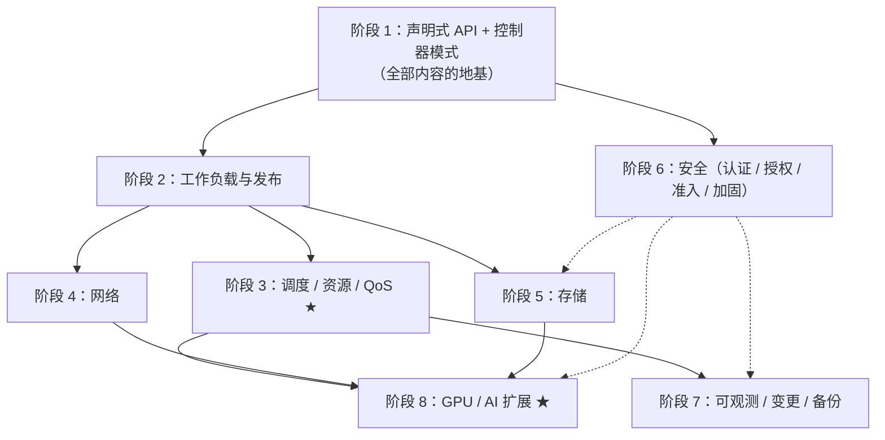
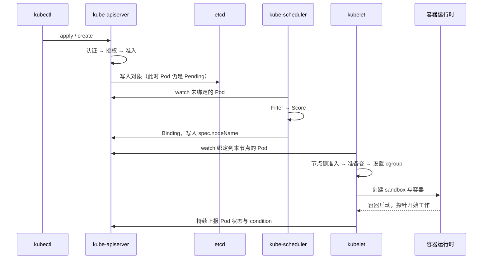
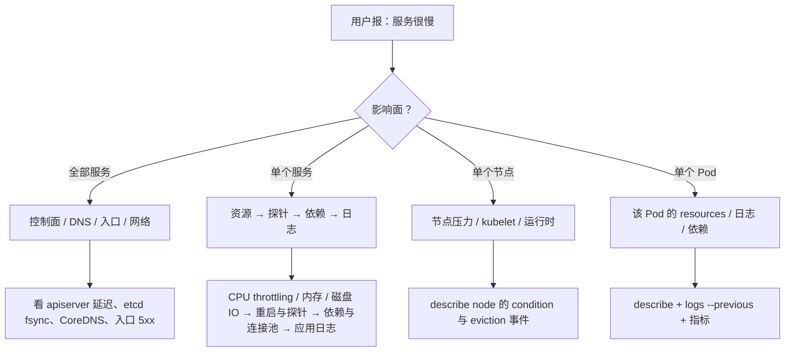

---
tags:
  - Kubernetes
  - 复习
  - 自测
  - 实战
created: 2026-09-13
---

# 复习与自测

> 本笔记对应 [[Kubernetes/00_简介]] 的「阶段 9」。目标：把 [[01_核心架构与对象模型]] 到 [[08_GPU_AI场景]] 串成一张**能脱稿讲出来**的网——先给结论层（速览卡），再用跨阶段因果链、系统设计参考答案、自测题库和排障总表把结论压回细节。
>
> 关联复习：[[01_核心架构与对象模型]]、[[02_工作负载与控制器]]、[[03_调度_资源_QoS]]、[[04_网络]]、[[05_存储]]、[[06_安全]]、[[07_生产运维与可观测性]]、[[08_GPU_AI场景]]
>
> 说明：本篇**不引入新知识**，只做压缩与串联。文中所有数字与默认值都取自前面各阶段已核对过的官方文档（Kubernetes 1.37 时期）；若某处与对应阶段的笔记冲突，**以那一篇为准**。

## 0. 30 秒速览

> [!abstract] 这一页只要记住六句话
> - **整个 Kubernetes 是一句话**：声明式 API（写期望状态）+ 控制器循环（Observe → Diff → Act）不断把实际状态拉回期望状态。组件、对象、探针、Operator、排障手段，全都是这句话的推论。
> - **一次写请求过五关**：TLS → 认证 → 授权 → 准入 → 写 `etcd`；**401 找认证、403 找授权、被拒在准入门**，三类失败的排查路径完全不同。RBAC 默认拒绝，Kubernetes 里没有 User 对象。
> - **调度只认 `requests`，运行时才看 `limits`**：Filter → Score → Bind；QoS 三档是 `requests`/`limits` 组合的**结果**，不是能单独设置的字段，Pod 创建后终身不变。
> - **网络是两段独立的事**：DNS 把名字变成地址，节点上的转发规则把 ClusterIP 变成 Pod IP（DNAT）。Service 只做 L4；NetworkPolicy **默认全通**，默认拒绝要自己写。
> - **数据的生死线在 `reclaimPolicy` 与备份**：PVC 只保证「Pod 重建后数据还在」；能不能扩容、能不能快照、集群外有没有备份、恢复演练做过没有，是另外四件事，必须分别验证。
> - **生产运维三件事**：可观测三链路（Metrics / Logs / Events+Audit）、变更三件套（PDB + drain + 不跳小版本升级）、备份一件事（etcd 快照 **+ 定期恢复演练**）。升级没有官方回滚——**回滚等于从快照恢复**。

> [!tip] 怎么用这篇笔记
> - **首轮复习（刚学完阶段 1~8）**：读第 1、2 节，把 13 张速览卡逐一脱稿讲一遍；讲不顺的地方回对应笔记，别在这里硬背。
> - **实战 / 推演前 3 天**：只看第 0 节 + 第 2 节 + 第 5 节题库；第 4 节的四道设计题每题限时 15 分钟写提纲。
> - **上场前 1 小时**：只看第 0 节和第 6 节排障总表。
> - 本篇的题库是「答案对照表」，用来查漏；真正练口述还是用各篇笔记里的 `> [!question]-` 卡片（可以盖住答案自己讲）。

## 1. 全景地图

### 1.1 八个阶段的主线与标志性数字

复习时先建立这张表的**骨架**：每个阶段只要能用一句话 + 一个数字讲清楚，细节就是可推导的。数字讲错比讲不出来更糟，因为它会暴露「没在生产里用过」。

| 阶段  | 主线（一句话）                        | 必须脱口而出的数字 / 边界                                                         | 笔记               |
| --- | ------------------------------ | ---------------------------------------------------------------------- | ---------------- |
| 0   | 先把集群跑起来，把 `kubectl` 用成肌肉记忆     | 推荐 `kind` 做多节点演练；`containerd`/CRI-O 才是 CRI 实现，Docker ≠ 容器              | [[Kubernetes/00_简介]] §阶段 0  |
| 1   | 控制面做决策与存储，`kubelet` 才是真正拉起容器的人 | `etcd` quorum = N/2+1；请求五关；`kubectl create` 成功 ≠ Pod 运行                | [[01_核心架构与对象模型]] |
| 2   | 控制器模式：用「期望状态」驱动「实际状态」          | `maxSurge`/`maxUnavailable` 默认 25%；`revisionHistoryLimit` 默认 10        | [[02_工作负载与控制器]]  |
| 3 ★ | 调度、资源约束与 QoS 判定                | Filter→Score→Bind；QoS 三档；CPU 限流 vs 内存 OOM                              | [[03_调度_资源_QoS]] |
| 4   | Service 是「虚拟 IP + 转发规则」，不是进程   | Service 只做 L4；`ndots:5`；ipvs 1.35 弃用、1.43 移除                           | [[04_网络]]        |
| 5   | 持久化闭环：申请 → 挂载 → 扩容 → 快照 → 回收   | 动态 PV 默认 `Delete`、手工 PV 默认 `Retain`；`volumeBindingMode` 默认 `Immediate` | [[05_存储]]        |
| 6   | 最小权限 + 工作负载加固 + 数据加密           | 401/403/准入三分；PSS 三档；KMS v2（1.29 稳定）                                    | [[06_安全]]        |
| 7   | 可观测、变更、备份三件事都要能演练              | 节点失联 50s → 300s → 约 5 分钟；升级不跳小版本、无回滚                                   | [[07_生产运维与可观测性]] |
| 8 ★ | GPU 变成可调度资源，以及多卡训练的拓扑与排队       | 扩展资源整数不可超卖；时间切片下 DCGM 无法按容器归因                                          | [[08_GPU_AI场景]]  |
| 9   | 把上面八条压成能讲、能设计、能排障的整体           | 每张速览卡 3~5 分钟；三道设计题 15 分钟                                               | 本篇               |

### 1.2 一张依赖图：为什么这些主题必须按这个顺序学

三条容易讲漏的连线：

- **阶段 6 → 阶段 5/7/8**：安全是横切面。「不让某类卷被挂载」「禁止特权 Pod」「谁能读 Secret」都发生在**准入**这一关——它不是独立模块，而是所有对象的过滤器。
- **阶段 3 → 阶段 8**：GPU 只是「扩展资源 + 拓扑约束」的极端案例；讲不清调度三步，GPU 调度就只能是背名词。
- **阶段 5 → 阶段 7**：备份不是一个动作，而是「`etcd` 快照 + PV 数据 + 密钥材料 + 交付物」四层，缺一层就恢复不回来。

### 1.3 三条复习路径

| 你的目标 | 复习路径 | 时间 |
| --- | --- | --- |
| 实战 / 推演 | 第 0 节 → 第 2 节 13 张卡 → 第 4 节三道设计题 → 第 5 节题库查漏 | 2~3 天 |
| 上生产前自查 | 第 1.1 节表格 → 第 3.2/3.3/3.4 节因果链 → 第 6 节排障总表 → 各阶段「生产实践清单」 | 1 天 |
| 定期复习（长期） | 第 2 节抽卡口述 + 第 5 节题库随机抽题；答不上来的回笔记 | 每周 30 分钟 |

## 2. 核心速览卡（13 张）

> [!important] 每张卡的用法
> 「一句话」定调，「口述提纲」是 3~5 分钟的结构，「关键数字」必须能脱口而出，「常见失分」是现场追问和线上事故最爱抓的地方。
> 讲的时候**先说结论再展开**，不要从组件定义开始背。

### 2.1 架构与组件职责 + 一次请求的全链路

**一句话**：控制面只做「决策与存储」，真正把容器拉起来的是节点上的 `kubelet`；`kube-apiserver` 是唯一写入口，也是唯一直接访问 `etcd` 的组件。

口述提纲：

1. 控制面四件套：`kube-apiserver`（唯一入口）、`etcd`（唯一事实来源）、`kube-scheduler`（只写 `spec.nodeName`）、`kube-controller-manager`（一组控制器），加上云上的 `cloud-controller-manager`。
2. 数据面三件套：`kubelet`（节点上的 Pod 管理者）、`kube-proxy`（Service 转发，可被 CNI 取代）、容器运行时（`containerd` / CRI-O，通过 CRI 对接）。
3. 一次写请求：认证 → 授权 → 准入（Mutating → Validating）→ 校验并写入 `etcd`。
4. 异步接力：`kubectl create` 返回时 Pod 只是「被记录了」；之后 scheduler 绑定、kubelet 拉镜像建容器、控制器持续纠偏。
5. `etcd`：Raft 多数派（N/2+1）才能提交写；生产用 3 或 5 节点；4 节点不比 3 节点更能容错，只是多一个故障点。

关键数字：quorum = N/2+1；3 或 5 个 `etcd` 节点；请求五关。

常见失分：把 `kube-scheduler` 说成「启动容器」的组件；把 `kubectl create` 成功等同于「部署成功」，后面诊断时说不清「对象已存在但 Pod 起不来」。

出处：[[01_核心架构与对象模型]]、[[06_安全]]

### 2.2 控制器模式 / 声明式 API / Operator

**一句话**：控制器用 Observe → Diff → Act 的 **level-triggered** 循环把实际状态拉向期望状态，靠幂等实现最终一致——所以单个事件的丢失或重复通常不会让系统出错。

口述提纲：

1. `spec` 是人的声明，`status` 是系统的观测；两者分离是声明式 API 的骨架。
2. level-triggered 看「当前状态」，edge-triggered 看「事件」；前者对丢失事件不敏感，代价是循环要写得幂等。
3. 对象通用字段：GVK / REST 路径、作用域（namespaced vs cluster-scoped）、`resourceVersion`（乐观并发）、`ownerReferences`（级联删除）、`finalizer`（阻止删除直到清理完成）。
4. 扩展机制：CRD + 自定义控制器 = Operator；`kubectl apply` 之外还有 server-side apply（字段管理）。
5. 删除为什么卡在 `Terminating`：对象有 `finalizer`，而负责清理的控制器没跑或对方资源没删掉。

关键数字：ReplicaSet 历史保留 `revisionHistoryLimit` 默认 10。

常见失分：把「声明式」当成「不可变」；忘了 `finalizer`，把「删不掉」误判成 API Server 故障。

出处：[[01_核心架构与对象模型]]

### 2.3 调度：Filter → Score → Bind

**一句话**：调度就是「筛掉不满足硬性要求的节点 → 给剩下的打分 → 选中一个写进 `spec.nodeName`」；**一个可行节点都没有才会 `Pending`**，所以「加机器」不一定有用。

口述提纲：

1. Filter（Predicates）看硬约束：资源余量（按 `requests` 累加）、`nodeSelector`/NodeAffinity 的 required、污点与容忍、`nodeName`、卷的拓扑与可用性、`topologySpreadConstraints` 的硬约束。
2. Score（Priorities）做偏好：`preferredDuringScheduling` 亲和权重、镜像本地性、节点负载均衡、Pod 打散。
3. Bind 只写 `spec.nodeName`；`kubelet` 自己拉清单。
4. 三种摆放手段分工：**NodeAffinity 负责吸引、Taint 负责排斥、Priority 负责插队**。toleration 只是「允许调度」，不是「保证调度」。
5. 抢占：高优先级 Pod 找不到节点时，尝试驱逐低优先级 Pod；抢占**只看优先级、不看 QoS**，PDB 在这里只是 best-effort。
6. 三个绕过调度的入口：直接写 `nodeName`、DaemonSet（每节点一个）、静态 Pod（由 kubelet 直接管）。

关键数字：调度分两阶段 + 绑定；被驱逐的 Pod 会被重建（不是原地复活）。

常见失分：把「无容忍」和「亲和不匹配」混为一谈；`Pending` 就只会说「资源不够」。

出处：[[03_调度_资源_QoS]]

### 2.4 QoS 三档与驱逐顺序（现场高频）

**一句话**：QoS 由每个容器的 `requests`/`limits` 组合决定，**Pod 创建时定死、终身不变**；它影响驱逐与调度，但**驱逐的真实排序不是按 QoS**。

口述提纲：

1. 判定：每个容器对所有资源都设了 request 且 `request == limit` → `Guaranteed`；任何容器既没 request 也没 limit → `BestEffort`；其余 → `Burstable`。
2. 反直觉点：**只写 `limits` 会被自动补成 `requests`**，于是可能「意外的 Guaranteed」；一个容器写、一个不写，则整 Pod 降为 `Burstable`。
3. `requests` 决定调度与驱逐水位，`limits` 决定运行时上限：CPU 超限是**限流**（throttling），内存超限是 **OOM kill**。
4. 驱逐真实排序：先看「用量是否超过 `requests`」，再看优先级，再看超出程度；**磁盘压力场景 QoS 完全不适用**。
5. 关系面：QoS 影响 `oom_score_adj`、节点压力驱逐顺序和抢占后的生存概率；**不影响**调度器是否选中你，也不影响 HPA。

关键数字：Guaranteed 的判定是「所有容器、所有资源」都要 request == limit，不是「内存相等就行」。

常见失分：说「驱逐按 BestEffort → Burstable → Guaranteed 排队」。这句话只在没有其它条件时近似成立。

出处：[[03_调度_资源_QoS]]

### 2.5 Service 类型与流量路径 + kube-proxy 模式

**一句话**：`ClusterIP` 是「虚拟 IP + 转发规则」，不绑定在任何网卡上；`ping` 不通是常态，**不能据此判断 Service 坏了**。

口述提纲：

1. 五种类型：`ClusterIP`（集群内互访）、`NodePort`（节点端口暴露）、`LoadBalancer`（云上对外，底层通常还是 NodePort）、`ExternalName`（纯 DNS 映射）、Headless（`clusterIP: None`，DNS 直接返回 Ready 的 Pod IP）。
2. 访问永远是两段：**DNS 解析**（名字 → ClusterIP）+ **节点转发**（ClusterIP → 某个 Ready Pod 的 DNAT，回包靠 conntrack 还原）。排障也要分段查。
3. `EndpointSlice` 是后端清单；Selector 不匹配、Pod 未 Ready 都会让后端为空——这是「Service 通但没后端」的常见原因。
4. kube-proxy 模式：`iptables` 是 1.37 默认；`nftables` 是官方推荐的演进方向（内核 5.13+），也是 ipvs 的替代；**`ipvs` 自 1.35 弃用、1.40 默认关闭、1.43 移除**。
5. 集群可以完全不跑 kube-proxy：Cilium 这类 CNI 用 eBPF 接管 Service 转发，但 Service / ClusterIP / EndpointSlice 这些**对象语义不变**。
6. L4 vs L7：Service 看不懂 Host 和 Path；七层路由靠 Ingress / Gateway API（应用层代理，新建连接，不是内核 NAT）。

关键数字：`externalTrafficPolicy: Local` 才保留客户端源 IP（代价是可能流量不均）；`ndots:5`；`dnsPolicy` 默认 `ClusterFirst`。

常见失分：说「ClusterIP 绑定在 `kube-ipvs0` / 某块网卡上」；说「Service 会做负载均衡所以一定均匀」——`iptables` 模式是随机概率，长连接也不均。

出处：[[04_网络]]

### 2.6 CNI / NetworkPolicy / Ingress vs Gateway API

**一句话**：CNI 负责「Pod 能不能通」，NetworkPolicy 负责「允许谁跟谁通」，**默认是全通**；入口层（Ingress / Gateway API）负责七层路由。

口述提纲：

1. CNI 的活：给 Pod 分配 IP、接通跨节点网络、实现 NetworkPolicy（**只有支持策略执行的 CNI 才真的拦得住**）。
2. 主流选型：Flannel（简单）、Calico（策略与 BGP 成熟）、Cilium（eBPF、性能与可观测性强，还能替代 kube-proxy）。
3. NetworkPolicy 语义：没被任何策略选中 = 全放通；被选中且 `policyTypes` 含某方向 = 该方向**只有显式放行的才通**。白名单写法是先 `podSelector: {}` 做 default-deny，再放行 DNS 与上下游。
4. 两个选择器坑：同一个 `from/to` 条目里 `namespaceSelector` 和 `podSelector` 是 **AND**，分开写是 **OR**。
5. 入口层换代：Ingress API 自 GA 后**已冻结**，社区版 Ingress NGINX 已于 2026 年 3 月退役；新集群直接用 **Gateway API**（GatewayClass / Gateway / HTTPRoute）。
6. Policy 只覆盖 L3/L4，且只管被策略选中的 Pod；它不管主机网络、不管集群外流量、也不做七层鉴权。

关键数字：无策略即全通；`ndots:5` 会让外部域名多出多余查询（egress 默认拒绝时最容易「集体解析失败」）。

常见失分：只背「NetworkPolicy 默认拒绝」——**事实是默认放行**，默认拒绝必须显式声明。

出处：[[04_网络]]

### 2.7 StatefulSet vs Deployment + 有状态应用最佳实践

**一句话**：StatefulSet 提供三个「稳定」——稳定网络标识、稳定存储、有序扩缩容；Deployment 管的是「一群等价的 Pod」，不保证身份。

口述提纲：

1. 身份：StatefulSet 的 Pod 名是 `sts-0/1/2`，配合 Headless Service 提供稳定 DNS（`pod-0.svc.ns.svc.cluster.local`）；Deployment 的 Pod 名是随机后缀。
2. 存储：`volumeClaimTemplates` 为每个副本生成独立 PVC，Pod 重建后重新挂回同一个 PVC；删 Pod **不会**删 PVC。
3. 顺序：默认 OrderedReady——扩容从 0 递增、缩容从大到小、逐个等待 Ready；`podManagementPolicy: Parallel` 可放开顺序。
4. Deployment：`spec.template` 一变就生成新 ReplicaSet，走滚动更新；回滚靠历史 ReplicaSet（`revisionHistoryLimit` 默认 10，`kubectl rollout undo`）。
5. 有状态落地检查：独立 StorageClass、`Retain` 回收策略、备份与恢复演练、PDB、`terminationGracePeriodSeconds` 足够长、应用自己会选主。
6. DaemonSet / Job / CronJob：每节点一个用 DaemonSet（日志、监控、CNI）；一次性任务用 Job（`backoffLimit`、`completions`、`parallelism`）；定时用 CronJob（`concurrencyPolicy`、`startingDeadlineSeconds`）。

关键数字：滚动更新 `maxSurge`/`maxUnavailable` 默认都是 25%，**不能同时为 0**；`revisionHistoryLimit` 默认 10；缩容 StatefulSet 时 PVC 默认保留。

常见失分：把数据库套在 Deployment 上（多副本 + 共享 PVC = 灾难）；忘了 PVC 不会随 StatefulSet 删除，导致存储悄悄泄漏。

出处：[[02_工作负载与控制器]]、[[05_存储]]

### 2.8 PV / PVC / StorageClass 生命周期

**一句话**：PV 是集群级的「一块存储」，PVC 是 namespace 级的「我要多大、什么模式」，StorageClass 是「怎么自动开出来」的模板；一条 PVC 与一个 PV **一对一**绑定。

口述提纲：

1. 静态供给 vs 动态供给：前者管理员先建 PV、PVC 去匹配；后者由 `provisioner` 按 StorageClass 现开。
2. 绑定匹配条件：class、`accessModes`、容量（只往大不往小）、`volumeMode`、`selector`；PV 侧还有 `claimRef`。
3. 生命周期状态要分开讲：**PV 是** `Available` / `Bound` / `Released` / `Failed`；**PVC 是** `Pending` / `Bound` / `Lost`。「`Pending`」是 PVC 的状态，别说成 PV 的。
4. `reclaimPolicy`：动态供给默认 `Delete`，手工 PV 默认 `Retain`；`Recycle` 已弃用（1.37 仅 `nfs`/`hostPath` 支持），不要用。
5. `volumeBindingMode`：默认 `Immediate`；**有拓扑约束的存储一律 `WaitForFirstConsumer`**，否则卷可能开在 Pod 去不了的可用区。
6. 访问模式是**能力声明，不是写保护**：`ReadWriteOnce` 的粒度是**单个节点**（同节点多个 Pod 仍可同时读写）；要全集群只允许一个 Pod 挂载，用 `ReadWriteOncePod`（1.29 稳定，仅 CSI）。
7. CSI = Controller 插件 + Node 插件 + 一组 sidecar（provisioner / attacher / resizer / snapshotter / registrar）；一次「动态供给 + 挂载」的链路是：调度 → 供给 → 绑定 → attach → mount。
8. 保护机制：`kubernetes.io/pvc-protection`、`kubernetes.io/pv-protection`，以及 `external-provisioner` 的 finalizer（1.31 引入、1.33 稳定）。

关键数字：动态 PV 默认 `Delete` / 手工 PV 默认 `Retain`；`volumeBindingMode` 默认 `Immediate`；`ReadWriteOncePod` 1.29 稳定；快照 1.20 稳定；PVC 扩容 1.24 稳定；`VolumeAttributesClass` 1.34 GA。

常见失分：把「有持久卷」说成「数据安全」；卷扩容说成「改大就行」——还需要 `allowVolumeExpansion` + 驱动支持，且**只能扩不能缩**。直接改 PV 容量会让 PVC 不再自动扩容。

出处：[[05_存储]]

### 2.9 RBAC 与最小权限（含工作负载加固）

**一句话**：一次请求要过五关，RBAC 只管第三关（授权）；而**真正危险的不是 `cluster-admin`，是那些「看起来无害」的权限**——读 Secret、建 Pod、建 PV、`nodes/proxy`、`escalate`/`bind`/`impersonate`。

口述提纲：

1. 五关与失败信号：TLS → 认证（401）→ 授权（403）→ 准入（被策略拒绝）→ 写 `etcd`。
2. 主体：User / Group **不是 API 对象**（由认证器给出），ServiceAccount 是对象；`system:` 前缀为系统保留。
3. RBAC 四件套：Role / ClusterRole 定义权限，RoleBinding / ClusterRoleBinding 授予主体。**RoleBinding 引用 ClusterRole 时，权限被裁剪到该 namespace**；`roleRef` 不可变，改规则就改 role 本身。
4. 规则字段：`apiGroups` / `resources`（含 `pods/log`、`pods/exec`、`serviceaccounts/token` 等子资源）/ `resourceNames` / `verbs` / `nonResourceURLs`；通配符要慎用。
5. 权限提升面清单：读或 list Secret、创建 Pod（可直接挂任意 SA 或卷）、创建 PV、`get nodes/proxy`、`escalate`/`bind`/`impersonate`、CSR 审批、为任意 SA 签 token、改 Namespace 标签（影响 NetworkPolicy/PSA）、改 webhook 配置。
6. 工作负载加固五件套：`runAsNonRoot`、`allowPrivilegeEscalation: false`、`capabilities.drop: ["ALL"]`、`readOnlyRootFilesystem: true`、`seccompProfile: RuntimeDefault`——`restricted` 档基本就是这五条。
7. PSA 三模式 `enforce`/`audit`/`warn`，并固定 `-version`（避免集群升级后规则静默变化）；PSA 的 enforce **只作用于 Pod**。
8. Secret 的保护是三层：RBAC 最小权限 + 静态加密（KMS v2）+ 审计与外部密钥管理。base64 **不是加密**。

关键数字：PSA 1.25 稳定；`ValidatingAdmissionPolicy` 1.30 稳定、`MutatingAdmissionPolicy` 1.36 稳定；KMS v2 1.29 稳定（v1 自 1.28 弃用）；`seccompDefault` 1.27 稳定；AppArmor 1.31 稳定；`--anonymous-auth` 默认开启，必须显式关闭；kube-apiserver 与 kubelet 的 `--authorization-mode` 默认都是 `AlwaysAllow`。

常见失分：说「namespace 是安全边界」。它只是**软隔离**，不可信租户要么独立节点池，要么独立集群。

出处：[[06_安全]]、[[03_调度_资源_QoS]]

### 2.10 滚动更新 / 蓝绿 / 金丝雀 + PDB

**一句话**：滚动更新的闸门是**就绪探针**，金丝雀的闸门是**指标**，蓝绿的闸门是**一次性切流量**；PDB 只保护**自愿中断**，它保证不了「服务不中断」。

口述提纲：

1. 滚动更新：`maxSurge`（能超额多少）+ `maxUnavailable`（能少几个可用），默认 25%；`minReadySeconds` 决定「Ready 多久才算可用」，`progressDeadlineSeconds` 决定多久算卡住。
2. 更新的推进条件是新 Pod Ready。**没有就绪探针 = 盲发**；探针写得松 = 假成功。
3. 优雅下线：删 Pod 时「摘流量」（更新 EndpointSlice）与节点侧关停**并行**，而规则更新有延迟，所以要在 `preStop` 里留缓冲，应用要处理 `SIGTERM`，`terminationGracePeriodSeconds`（默认 30s）是硬上限，超时 `SIGKILL`。
4. 金丝雀：按权重/比例逐步放量（Gateway API 权重、Argo Rollouts），用错误率/延迟/业务指标做门禁；蓝绿：两套环境并存，一次性切换，回滚只是切回去。
5. PDB：`minAvailable` / `maxUnavailable` 只对**自愿中断**（drain、`kubectl delete pod` 走 Eviction API）生效；节点崩溃、OOM 驱逐、直接 `--force --grace-period=0` 删 Pod 都不受它保护。
6. PDB 要和滚动更新一起算：新副本没 Ready 前不算可用，PDB 卡的其实是「还要不要继续动老副本」。
7. 配套：`topologySpreadConstraints` 打散副本、HPA 与 PDB 一起评估、发布过程盯 SLO 而不是盯 Pod 数量。

关键数字：`maxSurge`/`maxUnavailable` 默认 25% 且不能同时为 0；`terminationGracePeriodSeconds` 默认 30；`unhealthyPodEvictionPolicy` 建议 `AlwaysAllow`（1.31 稳定）。

常见失分：把 PDB 当成「保证可用」的银弹；说「滚动更新天然零停机」——没有就绪探针和优雅下线，它一样会 5xx。

出处：[[02_工作负载与控制器]]、[[07_生产运维与可观测性]]

### 2.11 etcd 高可用与备份恢复（+ 集群升级）

**一句话**：`etcd` 是集群的唯一事实来源，所以**备份 `etcd` + 亲手恢复一次**比任何高可用配置都重要；而**升级没有官方回滚，回滚 = 从快照恢复**。

口述提纲：

1. 高可用：奇数节点（3 或 5）、quorum N/2+1、跨故障域部署、延迟敏感（fsync / 网络 RTT）、定期 defrag 与监控 DB 大小、leader 变更、fsync 延迟。
2. 备份：`etcdctl snapshot save`；用 `etcdutl snapshot status` 校验；快照**只能恢复到相同 major.minor**；快照要加密、异地保存。
3. 恢复顺序（必须背下来）：停掉**所有** `kube-apiserver` → 在每台 `etcd` 上 `etcdutl --data-dir ... snapshot restore` → 重启 `etcd` → 重启 `kube-apiserver` → 重启 scheduler / controller-manager / 各节点 kubelet（必要时）。
4. 恢复不只是 `etcd`：密钥材料（加密配置/KMS/SA 签名密钥）、PV 数据、交付物（manifest、镜像、CI 配置）都要能恢复，否则对象回来了 Pod 还是起不来。
5. 升级：kubeadm **不支持跳小版本**；顺序是控制面逐台 → 插件（CNI/CSI/Ingress）→ 工作节点逐台 drain 后升级 kubelet/kube-proxy。版本偏斜：HA 的 apiserver 之间最多 1 个小版本，kubelet 最多比 apiserver 老 3 个小版本，kubectl 建议 ±1。
6. 变更前的三件事：备份 `etcd`、检查弃用 API（`kubectl api-resources`、deprecation 告警）、确认容量能扛住逐台 drain。

关键数字：quorum N/2+1；升级不跳小版本；kubelet 最多老 3 个小版本；无官方回滚；快照只能恢复同 major.minor。

常见失分：把「有 etcd 快照」等同于「能恢复」——没做过恢复演练，就不知道 RTO 是多少、密钥在不在。

出处：[[01_核心架构与对象模型]]、[[07_生产运维与可观测性]]、[[06_安全]]

### 2.12 HPA 原理、扩容延迟与「冷启动」

**一句话**：HPA 是「周期性读指标 → 算期望副本数 → 改 `replicas`」的控制器，它**不解决冷启动**——扩容延迟来自指标周期、就绪慢、镜像拉取和集群层有没有机器。

口述提纲：

1. 数据来源：Metrics API（metrics-server，CPU/内存）或自定义/外部指标（Prometheus Adapter、KEDA）。
2. 算法：`期望副本数 = ceil(当前副本数 × 当前指标值 / 目标值)`，容差 **0.1**（差异小于 10% 不动）。
3. 时间常量：同步周期 **15s**；缩容有 **5 分钟**稳定窗口（取窗口内最大值，避免抖动）；新 Pod 的「初始就绪延迟」默认 **30s**、CPU 初始化期默认 **5 分钟**内不计入指标，避免把启动期的尖峰算进去。
4. 真正的延迟链：HPA 反应（15s 级）→ Pod 调度 → 拉镜像 → 启动 → 通过就绪探针 → 才会被算作可用。这几步加起来常常是分钟级。
5. 「冷启动」的正确解法：`startupProbe` 放慢检查、预热/常驻最小副本（`minReplicas`）、就绪探针别写太严、用 KEDA 按业务指标（队列长度）提前扩、集群层用 Cluster Autoscaler / Karpenter 提前备机器（否则会先卡在 Pending）。
6. 反模式：只按 CPU 扩容（IO 密集或排队型服务不敏感）、把 `minReplicas` 设为 0 却不接受冷启动、缩容窗口太短导致抖动、HPA 与 PDB/ResourceQuota 冲突导致扩不上去。

关键数字：同步 15s；容差 0.1；缩容稳定窗口 5 分钟；初始就绪延迟 30s；CPU 初始化期 5 分钟；in-place resize 1.35 稳定。

常见失分：把「HPA 扩容慢」当成 HPA 的 bug。它只是链路里的第一环，慢的是后面几环。

出处：[[07_生产运维与可观测性]]、[[03_调度_资源_QoS]]

### 2.13 GPU / AI：资源模型、共享、拓扑与 gang 调度（差异化加分项）

**一句话**：Kubernetes 不认识 GPU，它只认识「由 Device Plugin 上报的扩展资源」；多卡训练的真正难点不在于拿到卡，而在于**拓扑匹配 + gang 调度 + 高速网络**同时成立。

口述提纲：

1. 资源模型：Device Plugin（DaemonSet）→ gRPC `Register` → `ListAndWatch` 上报设备 → kubelet 写进 Node 的 `capacity`/`allocatable`（`nvidia.com/gpu: 8`）→ 容器创建时 `Allocate` 返回设备路径。socket 在 `/var/lib/kubelet/device-plugins/`，kubelet 重启会删旧 socket，插件必须能重注册。
2. 硬规则：扩展资源**必须是整数、不可超卖**，`requests` 与 `limits` 同时存在时**必须相等**；配额只能用 `requests.nvidia.com/gpu`。
3. 共享三条路：**时间切片**（可超卖，无显存与故障隔离）、**MIG**（硬件切分，有隔离，需机型支持）、**MPS**（共享 CUDA 上下文）。训练默认独占，要隔离就上 MIG，只有能容忍干扰才用时间切片。
4. 时间切片的两个副作用：`nvidia.com/gpu.product` 变成带 `-SHARED` 的标签；**DCGM 无法把指标关联到具体容器**——要按 Pod 归因就别开时间切片。
5. 拓扑：节点内看 `nvidia-smi topo -m`（NVLink / PCIe / NUMA）；Topology Manager 策略 `none`/`best-effort`/`restricted`/`single-numa-node`，作用域 `container`/`pod`，依赖 CPU Manager 与上报 `TopologyInfo` 的设备插件；节点间按机架/leaf/rail 打标签做拓扑感知。
6. gang 调度：要么全起要么都不起，否则部分 worker 占着 GPU 空等、资源锁死。Volcano 走 `PodGroup` + 批调度器；Kueue 走 `Workload`/`ClusterQueue`/`LocalQueue`，复用默认调度器做准入排队。
7. 网络：默认 CNI 管控制面与 Service，训练通信靠 Multus + SR-IOV + RDMA CNI 的第二张网卡；**RDMA 不走 Service/DNS**，必须用 `rdma link`、`ibv_devinfo`、nccl-tests 单独验证，`NCCL_DEBUG=INFO` 确认走的是 RDMA 而不是 socket。
8. 监控：DCGM Exporter（`:9400/metrics`）看 `DCGM_FI_DEV_GPU_UTIL`、`FB_USED`、`MEM_COPY_UTIL`、`GPU_TEMP`、`POWER_USAGE`、`XID_ERRORS`、`ECC_*`；XID 与温度/ECC 才是硬件故障的第一现场。

关键数字：扩展资源整数且不可超卖；时间切片靠 `sharing.timeSlicing.replicaCount`（改完必须重启 device plugin）；Topology Manager 依赖 `TopologyInfo`；DRA 1.30 引入、**1.35 稳定**且**调度器暂不支持 DRA 抢占**。

常见失分：只写 `requests` 或只写 `limits`（会被自动补齐，看起来「配了」但语义不对）；说「一张卡切 4 份就是 4 张卡」——时间切片没有显存隔离，一块卡 OOM 会带走所有共享者。

出处：[[08_GPU_AI场景]]

## 3. 跨阶段因果链：把知识点连成一句话

### 3.1 一个 Pod 从 YAML 到 Running 的完整时间线

这条链的每一跳都会产生**特征性的失败信号**，记住它们就记住了排障入口：

| 卡在哪一跳 | 用户看到的现象 | 事件关键词 | 主责阶段 |
| --- | --- | --- | --- |
| 授权 / 准入 | 对象根本没创建 | `forbidden`、`admission webhook ... denied`、PSA 拒绝 | [[06_安全]] |
| 调度（Filter） | Pod `Pending` | `FailedScheduling`、`Insufficient cpu`、`node(s) had untolerated taint`、`volume node affinity conflict` | [[03_调度_资源_QoS]] |
| 调度前被配额挡住 | 对象创建失败 | `exceeded quota` | [[03_调度_资源_QoS]] |
| 准备卷 / 挂载 | `ContainerCreating` | `FailedMount`、`FailedAttachVolume`、`Unable to attach or mount volumes` | [[05_存储]] |
| 分配网络 | `ContainerCreating` | `failed to set up sandbox`、CNI 插件报错 | [[04_网络]] |
| 拉镜像 | `ImagePullBackOff` / `ErrImagePull` | `Failed to pull image`、`unauthorized` | [[06_安全]] |
| 容器启动后退出 | `CrashLoopBackOff` | `Back-off restarting failed container`；看 `--previous` 日志 | [[01_核心架构与对象模型]] |
| 探针失败 | `Running` 但 `0/1`，或反复重启 | `Liveness probe failed`、`Readiness probe failed` | [[01_核心架构与对象模型]] |
| 删除被 finalizer 拦住 | `Terminating` 长时间不结束 | finalizer 名称、`failed to delete ...` | [[01_核心架构与对象模型]] |

### 3.2 「Pod 起不来」的四层归因（每次都按这个顺序说）

> [!important] 先说影响面，再说层级
> 「一个 Pod 起不来」「一个 namespace 全挂」「一个节点上的 Pod 全挂」「整个集群都不对」，这四种影响面对应的排查路径完全不同。**先定影响面，能省一半时间。**

1. **调度层**（Pod 还是 `Pending`）：资源不足、亲和/污点不匹配、卷的拓扑冲突、配额被吃满、被打散的硬约束无解。
2. **节点层**（Pod 已绑定但起不来）：CNI 没就绪、CSI 挂载失败、节点磁盘/内存压力、运行时故障（`kubelet` 与 CRI 不通）、节点 `NotReady`。
3. **准入与配置层**：PSA/策略拒绝、Secret 或 ConfigMap 缺失、ServiceAccount 不存在、镜像私有仓库缺 `imagePullSecrets`。
4. **应用层**：启动即退出（配置错误、依赖不可用、迁移失败）、探针阈值不合理（`initialDelaySeconds` 太短把慢启动打死）、资源 `limits` 太小被 OOM kill。

### 3.3 「数据还在不在」的四层归因

存储类的题几乎都长这样：先让对方说清楚「删了什么」，再谈数据。

| 操作 | 数据还在吗 | 关键机制 |
| --- | --- | --- |
| 删 Pod（Deployment 托管） | 在（如果挂了 PVC）；`emptyDir` 不在 | 卷与 Pod 生命周期绑定关系不同 |
| 删 Pod（StatefulSet） | 在，PVC 不删 | `volumeClaimTemplates` 生成的 PVC 独立存在 |
| 缩容 StatefulSet 副本 | PVC 默认保留，重新扩容还会挂回来 | `persistentVolumeClaimRetentionPolicy` 可改成 `Delete` |
| 删 PVC | 取决于 `reclaimPolicy`：`Delete` 删卷、`Retain` 保留但 PV 变 `Released` | 手工 PV 默认 `Retain` |
| 删 StatefulSet 对象 | Pod 被删，PVC 默认保留 | 与上一行同理 |
| 节点故障 | 云盘/网络卷通常还在；`local` / `hostPath` 的数据随节点一起丢 | 这也是有状态服务不能用本地盘的原因 |

> [!warning] 三条最容易讲错的
> 1. **「有 PVC」不等于「有备份」**：快照与源卷同故障域，跨区域/跨集群归档 + 数据库原生备份 + 恢复演练，缺一不可。
> 2. **「`Retain` 之后数据一定在」**：PV 变 `Released` 后不会自动被新 PVC 复用，需要人工清 `claimRef` 或回收卷。
> 3. **「`ReadWriteOnce` 就是单写保护」**：它的粒度是节点，同节点上的多个 Pod 依然可以同时写。

### 3.4 「服务很慢」的排查顺序（别跳步）

排查纪律：

1. **先定影响面和起始时间**，并把报障时间与发布、告警、变更时间对齐（注意时区）。
2. **先取证据再动手**：重启会毁掉现场。`describe` + `logs --previous` + `get -o yaml` 三件套先跑。
3. **按层级而不是按猜测**：资源 → 探针与重启 → 网络（DNS、端点、入口）→ 依赖 → 存储 → 应用代码。反过来就只能在日志里打转。

## 4. 系统设计题参考答案

> [!tip] 答题结构比答案本身重要
> 无论抽到哪道题，都按这五步讲：**需求拆解 → 分层设计 → 关键取舍 → 反模式 → 验收方式**。
> 现场追问想听的是「你知道哪里会出问题」，不是「你背了多少组件名」。

### 4.1 设计一个多租户 Kubernetes 平台

**需求拆解**：租户之间要隔离什么？——计算、网络、存储、权限、镜像来源、可观测与配额。还要回答：租户是内部团队（可信）还是外部客户（不可信）？这决定隔离强度。

| 层 | 做法 | 关键机制 | 常见坑 |
| --- | --- | --- | --- |
| 身份与权限 | 每租户一组主体，用 OIDC 身份映射到 RBAC，不用共享证书 | `RoleBinding` 绑到租户 namespace；平台组用 ClusterRole 但收窄 | 给租户 `cluster-admin`、共享 ServiceAccount、宽泛通配符 |
| 命名空间 | 一租户多 namespace（dev/staging/prod 分开），用标签做策略锚点 | Namespace label + PSA + NetworkPolicy 选择器 | 只用 namespace 当安全边界 |
| 配额与默认值 | `ResourceQuota` 限 CPU/内存/存储/PVC 数量/对象数，`LimitRange` 给默认值与上下限 | `requests.cpu`、`requests.storage`、`count/persistentvolumeclaims` | 只限 CPU 内存，不限存储与对象数量 |
| 调度隔离 | 共享池 + 独占池；用 taint/toleration 与节点亲和区分 | `PriorityClass` 防止邻居抢占关键业务 | 高优先级给所有租户，抢占变成互相伤害 |
| 网络 | default-deny + 显式放行（DNS、上下游、监控采集），跨租户只走网关 | NetworkPolicy（需要支持策略的 CNI） | 忘了放行 DNS，整租户「集体解析失败」 |
| 存储 | 按等级给不同 StorageClass（性能/回收策略/是否允许扩容） | `Retain` 给关键数据，`Delete` 给普通数据；禁 `hostPath`/`local` | 所有租户共用一个默认类，误删即丢数据 |
| 工作负载加固 | PSA `restricted` 作基线（先 `warn`/`audit` 观察再 `enforce`，固定 `-version`） | 禁特权、禁 `hostPath`、禁 host 网络/端口 | 直接 `enforce` 把存量业务全打挂 |
| 密钥 | KMS v2 静态加密 + 外部密钥（Secrets Store CSI / External Secrets） | 审计记录 Secret 访问 | 把 Secret 提交进 Git，或只依赖 base64 |
| 镜像与供应链 | 私有仓库 + 扫描 + 签名 + digest 固定，准入校验来源 | 镜像策略准入 / `imagePullSecrets` | 允许任意公网镜像直接上线 |
| 可观测与计费 | 指标/日志按 namespace 与标签归属，GPU/CPU 时长做租户看板 | kube-state-metrics 对象状态 + 用量指标 | 只做集群级监控，租户无法自助 |
| 变更与自服务 | GitOps + 准入校验 + 审计集中采集 | 审计日志告警：CSR 审批、webhook 变更、批量读 Secret | 手工改集群，事后无从追溯 |

**关键取舍**：

- 隔离强度三档：**namespace（软）→ 独立节点池（中）→ 独立集群（硬）**。用「租户可信度 + 数据敏感度 + 合规要求」来决定。
- 共享池省成本但邻居影响大；独占池稳定但利用率低。折中做法是「共享池 + 关键业务优先池 + 配额兜底」。

**反模式**：把 namespace 当安全边界放不可信租户；所有租户共用一个 ServiceAccount；只做配额不做网络策略；没有租户级成本可见性。

**验收方式（要能演示，不是口头保证）**：

- `kubectl auth can-i get secrets -n tenant-b --as=tenant-a-user` → `no`。
- 租户 A 把 `ResourceQuota` 打满后，租户 B 不受影响。
- 跨租户 Pod 互访被拒，DNS 与自身依赖正常。
- 特权 Pod 被 PSA 拒绝，日志里有记录。
- 审计日志能定位到「谁、什么时候、改了哪个租户的什么」。

### 4.2 设计一个「零停机升级」方案

**需求拆解**：「零停机」的主语是什么？——是**业务请求不中断**（SLO 不破），而不是「Pod 不重启」。所以要先把应用改成「可以随时被替换」，再谈集群侧和集群升级。

分层设计：

1. **应用侧前提**：无状态或状态外置；`readinessProbe` 真实反映「能接流量」；处理 `SIGTERM`；`preStop` 留缓冲（覆盖端点更新延迟）；`terminationGracePeriodSeconds` 大于最长请求处理时间。
2. **发布策略**：滚动更新设 `maxSurge`/`maxUnavailable`（默认 25%，不能同时为 0）+ `minReadySeconds` + `progressDeadlineSeconds`；关键业务走金丝雀（权重逐步放量）或蓝绿。
3. **流量与预算**：PDB 保证自愿中断预算（`minAvailable`/`maxUnavailable`）；`topologySpreadConstraints` 打散副本，避免「一个可用区挂了就全挂」；入口层用 Gateway API 权重或 Ingress 灰度。
4. **数据层**：数据库变更必须**向前兼容**——先加列/加表（expand）→ 双写/双读 → 切换 → 再删旧结构（contract）。一步到位的破坏性变更 = 不可回滚。
5. **观测与门禁**：发布全程盯 SLO（错误率、P95/P99 延迟、业务指标），把「自动回滚触发条件」提前写死，而不是靠人肉判断。
6. **集群侧变更**：控制面逐台 → 插件（CNI/CSI/Ingress）→ 工作节点逐台 `cordon`/`drain`/`uncordon`；一次只动一台，drain 前确认 PDB 与本地存储，动之前备份 `etcd`。
7. **回滚设计**：应用层用 `kubectl rollout undo`（依赖历史 ReplicaSet）；集群层**没有官方回滚**，回滚等于从 `etcd` 快照恢复——所以升级前的快照是唯一退路。

**关键取舍**：

- 金丝雀更安全但需要可靠的指标门禁；没有指标门禁的金丝雀只是「慢慢出事」。
- 变更频率越高，越要把迁移做成可兼容；一次大版本升级的风险远大于十次小步变更。

**反模式**：没有就绪探针就滚动更新；`maxUnavailable` 调大追求速度；把数据库 schema 变更和代码发布绑在同一批；把 drain 当成「无影响的例行操作」。

**验收方式**：变更过程中核心接口 5xx 与 P95 无异常；PDB 在 drain 时确实拦住并发驱逐；回滚在 5 分钟内完成；有演练记录与 RTO/RPO 数据。

### 4.3 设计一个 GPU 训练平台

**需求拆解**：谁在用（训练/推理/开发）？任务特征（单卡/多卡/多机、时长、容错要求）？SLA（排队时长、利用率目标）？先答这三个，再谈组件。

| 层 | 设计 | 关键机制 | 常见坑 |
| --- | --- | --- | --- |
| 设备与驱动 | GPU 节点单独成池 + taint/toleration；GPU Operator 管驱动、Toolkit、device plugin、DCGM；驱动升级必须 drain 并准备回滚 | GFD 标签（`nvidia.com/gpu.product` 等）做亲和 | 驱动版本与应用 CUDA 版本不匹配 |
| 资源与配额 | 调度用扩展资源（整数、不可超卖），namespace 级 `ResourceQuota` 用 `requests.nvidia.com/gpu` | 队列配额用 Kueue `ClusterQueue` 或 Volcano `Queue` | 只加 quota 不做队列，长任务饿死短任务 |
| 共享策略 | 训练默认独占；需要隔离的共享用 MIG；时间切片只给能容忍干扰的推理/开发场景 | MIG `migStrategy` + `nvidia.com/mig-3g.20gb` | 开了时间切片还指望按容器归因 |
| 调度与排队 | gang 调度保证「全起或全不起」；拓扑感知把多卡任务约束在 NVLink 域/机架 | Volcano（`PodGroup`、批调度、binpack/DRF）或 Kueue（`Workload`+`ClusterQueue`+`ResourceFlavor`） | 用默认调度器跑分布式训练 → 部分 worker 占卡空等、死锁 |
| 拓扑 | Topology Manager 对齐 CPU/内存/GPU/NIC 到同一 NUMA；节点间按机架/leaf 打标签 | 策略 `single-numa-node`+作用域 `pod`；需要 CPU Manager 与支持 `TopologyInfo` 的插件 | 只调调度器不看硬件拓扑，性能静默下降 |
| 网络 | 两张网卡：默认 CNI 管控制面/Service；Multus + SR-IOV + RDMA CNI 提供高速网，RoCEv2 配 PFC/ECN | GPUDirect RDMA 依赖 GPU-NIC 的 PCIe/NUMA 亲和 | 用「Service 能通」判断 RDMA 可用 |
| 作业层 | JobSet / Training Operator（`PyTorchJob`/`MPIJob`）管理作业生命周期，配 checkpoint 与重试 | 失败重启时保住拓扑与队列位置 | 没有 checkpoint，抢占后从头再来 |
| 监控与成本 | DCGM Exporter + Prometheus，告警 XID/温度/显存/利用率，按租户与队列统计 GPU 时长与排队时长 | `DCGM_FI_DEV_GPU_UTIL`、`FB_USED`、`XID_ERRORS`、`GPU_TEMP` | 只看利用率做成本决策，忽略排队与碎片 |
| 运维 | 节点交付标准包含 RDMA 验证（`ibv_devinfo` + nccl-tests 基线）；定期跑基线对比 | `NCCL_DEBUG=INFO` 确认走 RDMA | 从没验证过，跨机训练慢就怪框架 |

**关键取舍**：

- **独占 vs 共享**：独占稳但贵，共享省但隔离弱。用 MIG 拿到「低成本 + 中等隔离」，用时间切片换「更高密度 + 更弱隔离」。
- **Volcano vs Kueue**：Volcano 自带批调度器，功能全但替换了默认调度器；Kueue 只做配额与准入排队，复用默认调度器，组合更轻。团队运维能力弱时优先 Kueue。
- **拓扑严格度**：`restricted` / `single-numa-node` 能保证性能，但会明显降低调度成功率（碎片化），必须实测。

**反模式**：把 GPU 节点和普通节点混在一个池子；让所有租户共享一个队列；开启时间切片还要求按 Pod 归因；用默认调度器跑多机训练；没有检查点和队列，抢占即事故。

**验收方式**：一个 8 卡任务被整体调度或整体排队（不会只起一半）；跨机 nccl-tests 达到带宽基线；XID/温度/显存告警能触发；租户看板能看到 GPU 时长与排队时长；驱动升级演练一次且可恢复。

### 4.4 故障复盘 / 恢复演练（第 4 道，按判断力给分）

**场景**：某集群升级过程中 `etcd` 数据损坏，需要恢复到 30 分钟前。请给出完整方案。

1. **止血**：停止所有写操作（必要时把 apiserver 摘出负载均衡），避免产生「恢复后又被覆盖」的数据；记录时间点与影响面。
2. **确认恢复点**：选最近一个**校验通过**的快照；确认快照的 major.minor 与当前集群一致（`etcd` 快照只能恢复到相同 major.minor）。
3. **确认能恢复的不只是对象**：加密配置与 KMS 是否可用（否则 Secret 解不开）、SA 签名密钥、PV 数据与存储后端、镜像与交付物。
4. **执行恢复**：停掉全部 `kube-apiserver` → 每台 `etcd` 执行 `etcdutl --data-dir ... snapshot restore` → 重启 `etcd` → 重启 `kube-apiserver` → 重启 scheduler / controller-manager / 节点 kubelet。
5. **验证**：`kubectl get --raw='/readyz?verbose'`、`etcdctl endpoint health`、核心工作负载是否恢复、控制器是否在正常调谐；检查是否有「对象回来了但 Pod 起不来」（多半是密钥或存储没恢复）。
6. **复盘**：RTO/RPO 实际值 vs 目标；快照是否异地、是否加密、多久校验一次；升级流程里哪一步缺了检查点；把结论写回变更流程。

> [!danger] 这道题的唯一及格线
> **你亲手做过一次恢复演练。** 没做过的人会在「密钥没备份」「快照在同一个故障域」「恢复后控制器行为异常」这些地方翻车，而这些恰恰是现场最想看到的细节。

## 5. 自测题库（快问快答）

> [!tip] 用法
> 遮住最后一列，随机抽题；答不上来的回对应笔记补齐。**括号里的数字是现场最可能被追问的点。**

### 5.1 架构与对象模型

| # | 问题 | 一句话答案 | 深入 |
| --- | --- | --- | --- |
| 1 | 谁唯一直接读写 `etcd`？ | `kube-apiserver`，其它组件都通过它 | [[01_核心架构与对象模型]] |
| 2 | `kubectl create` 成功代表什么？ | 对象写进了 `etcd`，不代表 Pod 已运行 | [[01_核心架构与对象模型]] |
| 3 | 控制器模式的核心循环？ | Observe → Diff → Act，level-triggered + 幂等 | [[01_核心架构与对象模型]] |
| 4 | `spec` 和 `status` 谁写？ | 人/控制器写 `spec`，控制器/kubelet 写 `status` | [[01_核心架构与对象模型]] |
| 5 | Pod 重启的粒度是什么？ | 容器级；Pod 本身不会被「重启」 | [[01_核心架构与对象模型]] |
| 6 | `etcd` 为什么用奇数节点？ | quorum = N/2+1；4 节点不比 3 节点更能容错 | [[01_核心架构与对象模型]] |
| 7 | 探针三件套的分工？ | readiness 摘流量、liveness 重启、startup 保护慢启动 | [[01_核心架构与对象模型]] |
| 8 | 删 Pod 时「摘流量」和 `SIGTERM` 谁先？ | 并行，且规则更新有延迟，所以 `preStop` 要留缓冲 | [[01_核心架构与对象模型]] |
| 9 | ConfigMap 挂成 env 会更新吗？ | 不会；卷会（有延迟），`subPath` 不更新 | [[01_核心架构与对象模型]] |

### 5.2 工作负载与发布

| # | 问题 | 一句话答案 | 深入 |
| --- | --- | --- | --- |
| 10 | StatefulSet 的三个「稳定」？ | 稳定网络标识、稳定存储、有序扩缩容 | [[02_工作负载与控制器]] |
| 11 | 滚动更新的两个旋钮与默认值？ | `maxSurge`/`maxUnavailable` 默认 25%，不能同时为 0 | [[02_工作负载与控制器]] |
| 12 | 回滚靠什么？ | 历史 ReplicaSet，`revisionHistoryLimit` 默认 10 | [[02_工作负载与控制器]] |
| 13 | 金丝雀和蓝绿的区别？ | 金丝雀按比例逐步放量看指标；蓝绿一次性切换、两套并存 | [[02_工作负载与控制器]] |
| 14 | 无状态服务怎么做到零停机？ | 就绪探针 + 优雅下线 + PDB + 逐步放量，缺一不可 | [[02_工作负载与控制器]] |
| 15 | DaemonSet 和 Deployment 的区别？ | DaemonSet 每节点一个、随节点加入自动补齐 | [[02_工作负载与控制器]] |

### 5.3 调度、资源与 QoS

| # | 问题 | 一句话答案 | 深入 |
| --- | --- | --- | --- |
| 16 | 调度三步是什么？ | Filter → Score → Bind | [[03_调度_资源_QoS]] |
| 17 | 一个节点都不可行会怎样？ | `Pending` + `FailedScheduling`；加机器不一定有用 | [[03_调度_资源_QoS]] |
| 18 | toleration 保证被调度吗？ | 不保证，只表示「允许」 | [[03_调度_资源_QoS]] |
| 19 | QoS 三档怎么判定？ | 所有容器、所有资源 `request == limit` → Guaranteed；都没有 → BestEffort；其余 Burstable | [[03_调度_资源_QoS]] |
| 20 | 只写 `limits` 会怎样？ | 被自动补成 `requests`，可能「意外的 Guaranteed」 | [[03_调度_资源_QoS]] |
| 21 | 驱逐真的按 QoS 排序吗？ | 不；按「是否超 requests → 优先级 → 超出量」，磁盘压力时 QoS 不适用 | [[03_调度_资源_QoS]] |
| 22 | 抢占看 QoS 吗？ | 不看，只看优先级；PDB 在这里是 best-effort | [[03_调度_资源_QoS]] |
| 23 | CPU 超限和内存超限的结果？ | CPU 被限流（throttling），内存被 OOM kill | [[03_调度_资源_QoS]] |
| 24 | Pod `Pending` 怎么排查？ | 资源不足 / 亲和与污点 / 卷未就绪 / 配额与准入 | [[03_调度_资源_QoS]] |

### 5.4 网络

| # | 问题 | 一句话答案 | 深入 |
| --- | --- | --- | --- |
| 25 | ClusterIP 绑定在网卡上吗？ | 不是；虚拟 IP + 转发规则，`ping` 不通是常态 | [[04_网络]] |
| 26 | Service 工作在几层？ | L4；七层要靠 Ingress / Gateway API | [[04_网络]] |
| 27 | 访问 Service 的两段是什么？ | DNS 解析出 ClusterIP + 节点上 DNAT 到 Pod | [[04_网络]] |
| 28 | Headless Service 有什么不同？ | 不分配 ClusterIP，DNS 直接返回 Ready 的 Pod IP | [[04_网络]] |
| 29 | NetworkPolicy 默认放行还是拒绝？ | 默认全放通；default-deny 必须自己写 | [[04_网络]] |
| 30 | `dnsPolicy` 默认值和 `ndots`？ | 默认 `ClusterFirst`；`ndots:5` 让外部域名产生多余查询 | [[04_网络]] |
| 31 | kube-proxy 三种模式的现状？ | iptables 仍是 1.37 默认；nftables 是推荐方向；ipvs 1.35 弃用、1.43 移除 | [[04_网络]] |
| 32 | 入口层现在怎么选？ | Ingress API 已冻结、ingress-nginx 2026-03 退役 → 新集群用 Gateway API | [[04_网络]] |

### 5.5 存储

| # | 问题 | 一句话答案 | 深入 |
| --- | --- | --- | --- |
| 33 | 动态供给 PV 的默认回收策略？ | `Delete`；手工创建的 PV 默认 `Retain` | [[05_存储]] |
| 34 | 删了 PVC 数据还在吗？ | 取决于 `reclaimPolicy`；`Retain` 后 PV 变 `Released`，需人工处理 | [[05_存储]] |
| 35 | `ReadWriteOnce` 的粒度？ | 单个节点；同节点多个 Pod 仍可同时读写 | [[05_存储]] |
| 36 | 要「全集群只能一个 Pod 挂载」用哪个？ | `ReadWriteOncePod`（1.29 稳定，仅 CSI） | [[05_存储]] |
| 37 | `volumeBindingMode` 默认值？ | `Immediate`；有拓扑约束必须 `WaitForFirstConsumer` | [[05_存储]] |
| 38 | 卷能缩容吗？ | 不能；扩容需要 `allowVolumeExpansion` + 驱动支持 | [[05_存储]] |
| 39 | 快照能替代备份吗？ | 不能；同故障域，还要原生备份 + 异地归档 + 恢复演练 | [[05_存储]] |
| 40 | `PVC Pending` 的常见原因？ | StorageClass 不存在、provisioner 失败、拓扑不匹配、容量不足 | [[05_存储]] |

### 5.6 安全

| # | 问题 | 一句话答案 | 深入 |
| --- | --- | --- | --- |
| 41 | 一次请求要过哪五关？ | TLS → 认证 → 授权 → 准入 → 写 `etcd` | [[06_安全]] |
| 42 | 401 / 403 / 被拒分别在哪一关？ | 认证 / 授权 / 准入 | [[06_安全]] |
| 43 | Kubernetes 里有 User 对象吗？ | 没有；只有 ServiceAccount 是被存储的对象 | [[06_安全]] |
| 44 | RoleBinding 引用 ClusterRole 会怎样？ | 权限被裁剪到该 namespace | [[06_安全]] |
| 45 | 哪些「普通」权限等于半个管理员？ | 读/list Secret、建 Pod、建 PV、`nodes/proxy`、`escalate`/`bind`/`impersonate`、SA token、CSR 审批、改 webhook | [[06_安全]] |
| 46 | `restricted` 档的五个必配？ | `runAsNonRoot`、`allowPrivilegeEscalation: false`、`capabilities.drop: ["ALL"]`、`readOnlyRootFilesystem`、`seccompProfile: RuntimeDefault` | [[06_安全]] |
| 47 | Secret 的保护来自哪几层？ | RBAC 最小权限 + 静态加密（KMS v2）+ 审计 + 外部密钥管理；base64 不是加密 | [[06_安全]] |
| 48 | 匿名认证和默认授权模式？ | 匿名认证默认开启（需显式关闭）；`--authorization-mode` 默认 `AlwaysAllow` | [[06_安全]] |

### 5.7 生产运维与可观测性

| # | 问题 | 一句话答案 | 深入 |
| --- | --- | --- | --- |
| 49 | metrics-server 和 kube-state-metrics 的区别？ | 前者给资源用量（Metrics API），后者给对象状态 | [[07_生产运维与可观测性]] |
| 50 | 节点失联到 Pod 被驱逐要多久？ | 50s 标记 `Unknown` → 300s 容忍 → node controller 约 5 分钟后发起驱逐 | [[07_生产运维与可观测性]] |
| 51 | `drain` 卡住的四类原因？ | PDB、裸 Pod、DaemonSet、本地存储 | [[07_生产运维与可观测性]] |
| 52 | PDB 保护什么、不保护什么？ | 只保护自愿中断；崩溃、OOM、驱逐式删除都不管 | [[07_生产运维与可观测性]] |
| 53 | 升级的顺序与约束？ | 不跳小版本；控制面 → 插件 → 工作节点；kubelet 最多老 3 个小版本 | [[07_生产运维与可观测性]] |
| 54 | 升级回滚怎么做？ | 没有官方回滚，等于从 `etcd` 快照恢复 | [[07_生产运维与可观测性]] |
| 55 | 容器日志默认轮转策略？ | `containerLogMaxSize` 10Mi / `containerLogMaxFiles` 5 | [[07_生产运维与可观测性]] |
| 56 | 事件默认保留多久？ | 1 小时（`--event-ttl`），所以事件必须采集 | [[07_生产运维与可观测性]] |
| 57 | HPA 的关键常量？ | 同步 15s、容差 0.1、缩容窗口 5min、初始就绪延迟 30s、CPU 初始化 5min | [[07_生产运维与可观测性]] |

### 5.8 GPU / AI

| # | 问题 | 一句话答案 | 深入 |
| --- | --- | --- | --- |
| 58 | GPU 怎么变成可调度资源？ | Device Plugin `Register` + `ListAndWatch` 上报 + `Allocate` 分配 | [[08_GPU_AI场景]] |
| 59 | 扩展资源能超卖吗？ | 不能；必须是整数，`requests` 必须等于 `limits` | [[08_GPU_AI场景]] |
| 60 | 三种 GPU 共享方式怎么选？ | 训练独占；要隔离上 MIG；时间切片只给能容忍干扰的场景 | [[08_GPU_AI场景]] |
| 61 | 时间切片为什么影响监控归因？ | DCGM 无法把指标关联到具体容器，只剩卡级指标 | [[08_GPU_AI场景]] |
| 62 | 为什么必须 gang 调度？ | 否则部分 worker 占着 GPU 空等，资源锁死、任务互相拖死 | [[08_GPU_AI场景]] |
| 63 | Topology Manager 解决什么问题？ | 同一 Pod 的资源跨 NUMA 错配；依赖 CPU Manager 与 `TopologyInfo` | [[08_GPU_AI场景]] |
| 64 | RDMA 怎么验证？ | 用 `rdma link`/`ibv_devinfo` + nccl-tests + `NCCL_DEBUG=INFO`，不能靠 Service 连通性判断 | [[08_GPU_AI场景]] |
| 65 | DRA 的现状与限制？ | 1.35 稳定，支持 CEL 设备筛选与共享；调度器暂不支持 DRA 抢占 | [[08_GPU_AI场景]] |

## 6. 排障总表

> [!important] 排障三纪律
> 1. **先定影响面**：全部 / 单服务 / 单节点 / 单 Pod，再定层级。
> 2. **先取证据再动手**：重启会毁掉现场；`describe` + `logs --previous` + `get -o yaml` 是标准三件套。
> 3. **对齐时间线**：把报障时间与发布、告警、变更时间对齐，注意时区。

### 6.1 现象 → 第一现场 → 处理方向

| 现象 | 第一现场 | 常见根因 | 处理方向 |
| --- | --- | --- | --- |
| Pod `Pending` | `kubectl describe pod` Events | 资源不足、亲和/污点不匹配、卷拓扑冲突、配额 | 看 `FailedScheduling` 原文；补资源或用 `preferred`/污点容忍调整 |
| Pod `ContainerCreating` 卡住 | `describe pod` + `kubectl get events` | CNI 未就绪、CSI 挂载失败、Secret/ConfigMap 缺失、可挂载卷数超限 | 查 `FailedMount`/`FailedAttachVolume`；确认驱动与节点上限 |
| `ImagePullBackOff` | `describe pod` | 镜像名/标签错、私有仓库缺凭据、网络或仓库限流 | 补 `imagePullSecrets`，用 digest 固定，验证节点能否拉取 |
| `CrashLoopBackOff` | `kubectl logs --previous` | 应用启动失败、配置错误、依赖不可用、探针误杀 | 看上一次日志；确认是不是 `liveness` 阈值太紧 |
| `OOMKilled` | `describe pod` 的 `Last State` + 节点事件 | 容器内存超 `limits`，或节点内存压力驱逐 | 调 `limits`/`requests`，查是不是内存泄漏；区分 OOM 与驱逐 |
| `Running` 但不接流量 | `kubectl get endpointslices` + 探针状态 | readiness 未通过、Selector 不匹配、`externalTrafficPolicy: Local` 无本地端点 | 先看端点是否为空，再看探针与选择器 |
| Service 不通 | `get svc`/`get endpointslices` + DNS 解析 | 后端为空、端口名写错、NetworkPolicy 拒绝、CNI/转发异常 | 分段查：DNS → ClusterIP → 后端 Pod 直连 |
| DNS 集体失败 | CoreDNS Pod 状态 + 日志 | CoreDNS 挂、`ndots` 造成查询风暴、egress 策略未放行 DNS | 放行 53 端口 UDP/TCP；检查 CoreDNS 资源与副本 |
| `Terminating` 不结束 | `get -o yaml` 看 `finalizers` | finalizer 未清理、kubelet 失联、卷卸载失败 | 定位持有 finalizer 的控制器；不要直接 `--force` |
| 节点 `NotReady` | `describe node` + `journalctl -u kubelet` | kubelet 挂、运行时故障、磁盘/内存/PID 压力、网络分区 | 看 condition 与污点，处理压力源；必要时 drain 后重启 |
| 节点失联后 Pod 不重建 | node events + `--node-monitor-grace-period` | 还在容忍窗口内（50s → 300s → 约 5 分钟） | 等窗口走完；确认不是被 PDB 挡住 |
| `drain` 卡住 | `kubectl get pdb` + 事件 | PDB 预算、裸 Pod、DaemonSet、本地存储 | 逐类排除；裸 Pod 需显式决定删除或迁移 |
| `forbidden`（403） | `kubectl auth can-i` + 审计日志 | RBAC 规则不足或被授权范围错 | 用 `can-i --list` 与 SubjectAccessReview 定位 |
| Pod 被 PSA 拒绝 | apiserver 审计/事件原文 | `securityContext` 不合规、用了特权或 `hostPath` | 先改 `warn`/`audit` 观察，再逐项修 `securityContext` |
| 卷扩容卡住 | PVC 的 condition + provisioner 日志 | 驱动不支持在线扩容、`allowVolumeExpansion` 未开 | 查 `FileSystemResizePending`，必要时重启 Pod 触发节点侧扩容 |
| GPU 不可调度 | `describe node` 的 `allocatable` | device plugin 未注册、驱动异常、节点被 taint | 查 device plugin DaemonSet 与 `Allocate` 日志 |
| 多机训练变慢 | `nvidia-smi topo -m` + `NCCL_DEBUG=INFO` | 拓扑错配、RDMA 未生效、RoCE 丢包 | 约束拓扑、验证 RDMA、跑 nccl-tests 基线 |

### 6.2 工具箱

| 工具 | 用在哪 | 一句话提醒 |
| --- | --- | --- |
| `kubectl describe` | 一切对象 | 先看 Events，再看 Conditions |
| `kubectl logs --previous` | 容器反复重启 | 当前容器日志可能还没写出来 |
| `kubectl get -o yaml/json` + `jq` | 精确字段 | `jsonpath` 也行，但复杂过滤用 `jq` |
| `kubectl debug` | 容器里没工具 | `--copy-to` 改镜像、`--share-processes` 看进程、`node/<node>` 进节点命名空间 |
| `kubectl auth can-i` | 403 排查 | `--list` 列出全部权限，`--as` 模拟身份 |
| `crictl` | 节点上排查运行时 | 看 sandbox 与容器状态，`journalctl -u kubelet` 看 kubelet |
| `kubectl top` | 快速看用量 | 依赖 metrics-server；只能看当前值 |
| `nvidia-smi` / `dcgm` | GPU 节点 | `topo -m` 看拓扑，`nvlink -s` 看链路，指标看 XID/温度/ECC |

## 7. 输出与复习方法

### 7.1 「一页纸笔记」怎么写

每个阶段只写一页 A4，格式固定成四块：

1. **一句话主线**（≤ 20 字）+ **标志性数字**（1~3 个）。
2. **一张图或一张表**：只画流程、判定分支或对照关系。
3. **生产默认值**：这个阶段在真实环境里「默认怎么配」。
4. **排障入口**：出问题时第一眼看什么、命令是什么。

写完能不看笔记讲 3~5 分钟，才算这一阶段过关。

### 7.2 间隔重复节奏

| 时间点 | 做什么 | 检查标准 |
| --- | --- | --- |
| 学完当天 | 写一页纸笔记 + 口述一遍 | 能讲清主线与一个关键数字 |
| D+1 | 只看速览卡，口述 | 每张卡 3~5 分钟，卡壳的标记 |
| D+3 | 抽题库 5.1~5.8 随机 10 题 | 正确率 > 80%，错题记进错题本 |
| D+7 | 做一道系统设计题（写提纲） | 15 分钟内能写满五步结构 |
| D+21 | 抽一道设计题 + 抽 5 张速览卡 | 仍能脱稿，且能举例说明 |

> [!tip] 错题本比笔记更值钱
> 错题只记三样：**题目、我当时的答案、正确口径**。不要抄整段笔记——抄的过程会让你误以为记住了。

### 7.3 端到端项目清单（挑 1~2 个真做完）

- [ ] 用 `kind` 起一个多节点集群，跑通「部署 → Service → Ingress/Gateway」的南北向链路。
- [ ] 配就绪探针与优雅下线，做一次滚动更新，观察 `kubectl rollout status` 与端点变化。
- [ ] 给一个服务配 HPA，做一次压测，观察扩容延迟链（HPA → 调度 → 启动 → Ready）。
- [ ] 主动注入故障：杀掉节点上的 Pod、让节点 `NotReady`、把探针改坏，验证告警与自愈。
- [ ] 做一次 `drain` 演练，观察 PDB 如何影响驱逐（并把 PDB 去掉再试一次）。
- [ ] 建 PV/PVC + StorageClass，做一次扩容、一次快照恢复。
- [ ] 亲手做一次 `etcd` 快照恢复演练，记录 RTO/RPO。
- [ ] 配 RBAC + PSA `restricted`，用 `can-i` 验证越权失败、用不合规 Pod 验证被拒。
- [ ] （有 GPU 环境时）装 device plugin 看到 `nvidia.com/gpu` 出现在 `allocatable`；跑一次 nccl-tests 基线。

### 7.4 实战 / 推演怎么讲

**把「你的背景」串成一条线**：从一次请求或一次故障切入，向下讲清「调度怎么落地、网络怎么走、存储怎么挂、权限怎么收、指标怎么看」，最后落到「我用什么手段验证它是真的」。

示例（结合 RDMA/GPU 背景）：

> 一个多机训练任务提交上来 → 队列（Kueue/Volcano）做配额与 gang 准入 → 调度器按扩展资源与拓扑打分，能整除才允许整体绑定 → 节点侧 Topology Manager 把 GPU/NIC/CPU 对齐到同一 NUMA 域 → 容器拿到 VF 与 RDMA 设备，通信走 RoCEv2 而不走 Service → DCGM 与 NCCL 基线证明「排在正确的卡上、走在正确的网络上」。

讲这条线的关键不是名词数量，而是**每一步都能说出一个「如果没做到会怎样」**：没 gang 就死锁、没拓扑就静默降速、没 RDMA 验证就只是「看起来能跑」。

## 8. 回到路线图

完成本笔记后，回到 [[Kubernetes/00_简介]]：

- [ ] 13 张速览卡都能在 3~5 分钟内脱稿讲完，并随口说出关键数字
- [ ] 能手画「一个 Pod 从 YAML 到 Running」的全链路，并指出每一跳的失败信号
- [ ] 能讲清「Pod 起不来」「数据还在不在」「服务很慢」三条跨阶段因果链
- [ ] 能按五步结构（需求拆解 → 分层设计 → 取舍 → 反模式 → 验收）回答多租户平台、零停机升级、GPU 训练平台三类设计题
- [ ] 题库 5.1~5.8 的题目随机抽 20 道，正确率 ≥ 80%
- [ ] 端到端项目清单里至少完成 3 项，其中必含一次 `etcd` 恢复演练
- [ ] 建好自己的错题本，并跑完 D+1 / D+3 / D+7 / D+21 的复习节奏

> 推荐扩展阅读：官方文档的 [Concepts](https://kubernetes.io/docs/concepts/)、[Tasks](https://kubernetes.io/docs/tasks/)、[Reference](https://kubernetes.io/docs/reference/) 与 [Tutorials](https://kubernetes.io/docs/tutorials/)；自查时重点看 [Pod Lifecycle](https://kubernetes.io/docs/concepts/workloads/pods/pod-lifecycle/)、[Resource Management](https://kubernetes.io/docs/concepts/configuration/manage-resources-containers/) 和 [Cluster Administration](https://kubernetes.io/docs/tasks/administer-cluster/) 三组页面。
