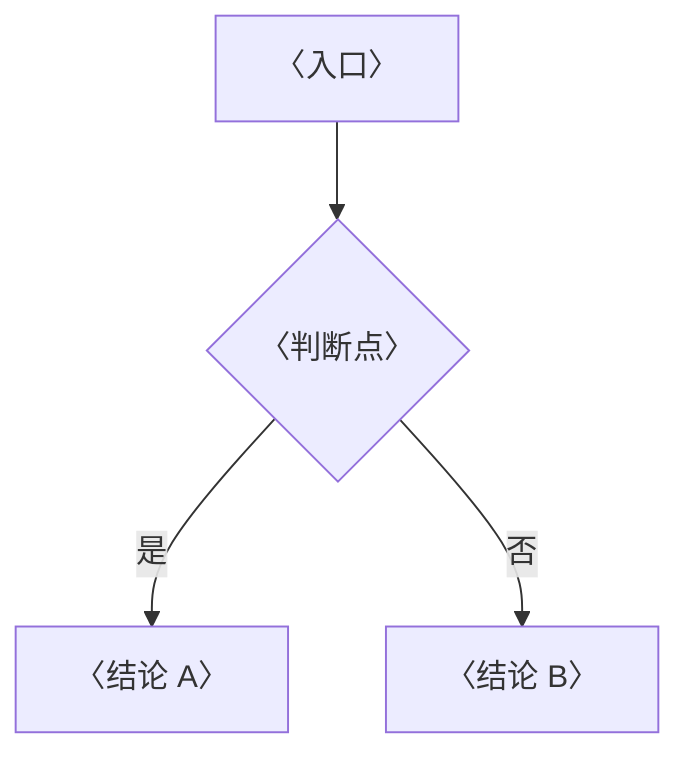

---
tags:
  - Kubernetes
  - 笔记模板
created: 2026-09-13
---

# 笔记模板

> [!info] 使用说明（复制成新笔记后删掉本节）
> 1. 复制本文件，重命名为 `NN_主题.md`，`NN` 与 [[Kubernetes/00_简介]] 里的阶段编号保持一致。
> 2. 在 [[Kubernetes/00_简介]] 对应阶段下补上「对应笔记」链接和 checklist 条目。
> 3. 按下面的骨架填写。`<!-- -->` 里的提示只在编辑视图可见，写完可以整段删掉。
> 4. 定稿前对照文末的「自检清单」逐条过一遍。
>
> **适用范围**：本模板适用于阶段 1–9 的单篇 `NN_主题` 形式。**阶段 0（`00_容器技术/`）不用本模板**——它是按「原理 / 体系 / 实操 / 判例 / 治理」分层的目录章，骨架见 `Linux/写作规约.md` 第三节，实例见 `00_容器技术/` 各篇与 `Kubernetes/AGENTS.md`。

> 本笔记对应 [[Kubernetes/00_简介]] 的「阶段 N」。目标：〈用一句话说清学完能讲明白什么〉。
>
> 关联复习：[[Kubernetes/00_简介]]
>
> 说明：本笔记的字段、默认值与行为均以官方文档和 Kubernetes 源码为准，凡有版本差异的地方都标注引入版本，落地前请对照集群实际版本。

## 0. 30 秒速览

<!-- 全篇最重要的一块。3~6 条，只写结论和关键数字，不写推导过程。复习时只看这里。
     每条的写法：结论 + 一个数字或边界。示例：「调度三步：Filter → Score → Bind；一个可行节点都没有才会 Pending，所以加机器不一定有用。」 -->

> [!abstract] 这一页只要记住 N 句话
> - **〈一句话结论〉**：〈补充关键数字或默认值〉。
> - **〈边界或反直觉点〉**：〈什么情况下直觉会出错〉。
> - **〈生产默认值〉**：〈绝大多数场景该怎么配〉。

## 1. 概念

<!-- 三层结构的第一层：讲清「是什么、为什么这样设计」。
     凡是流程、时序、判定分支，优先画图而不是写长段落：
       流程用 flowchart；多个角色按时间交互用 sequenceDiagram；二选一分流用决策树。
     图不必多，一篇 1~2 张，每张只回答一个问题。 -->

### 1.1 〈小节标题〉

<!-- 表格适合放对照关系、字段速查、默认值清单；用管道表并对齐。 -->

| 〈维度〉 | 〈说明〉 |
| --- | --- |
| 〈A〉 | 〈B〉 |



### 1.2 〈小节标题〉

<!-- 关键结论用 callout 顶出来，不要让它埋在段落末尾。
     常用类型：important 记结论、warning 记坑、tip 记经验、danger 记红线。 -->

> [!important] 〈最容易被追问倒的一句话〉
> 〈一句话把结论说死，再补一句为什么〉。

## 2. 生产实践

<!-- 三层结构的第二层：从「知道」落到「能选、能配、能防坑」。 -->

### 2.1 默认配置

- 〈生产环境应该怎么配〉
- 〈什么场景需要偏离默认值〉

### 2.2 常见坑

<!-- 用「误解 / 只做一半 → 事实或后果」的对照，比并列 bullet 好记。 -->

| 常见做法或说法 | 后果或事实 |
| --- | --- |
| 〈只做了一半的操作〉 | 〈会出现什么后果〉 |
| 〈常见误解〉 | 〈事实是什么〉 |

## 3. 排障速查（有排障内容时保留）

<!-- 排障类内容统一走「现象 → 事件关键词 → 根因 → 处理方向」。
     先给一句「第一反应不要是什么」，再给排查顺序，最后附上事件原文长什么样。 -->

### 3.1 〈现象，例如：资源一直处于某状态〉

> [!tip] 第一反应不要是〈错误的第一反应〉
> 〈一句话解释这个现象真正的含义〉。

按下面顺序排除：

1. **〈原因一〉**：〈事件关键词与判断依据〉。
2. **〈原因二〉**：〈事件关键词与判断依据〉。

```text
kubectl describe 〈资源〉 〈名称〉        # 先看 Events
```

## 4. 动手验证（可选）

<!-- 可运行示例优先就近放在相关小节里，那才是你最需要它的地方；用带 - 的折叠 callout 包起来，
     正文不会被撑长，需要时展开。只有需要把多个实验串成一套端到端演练时，才单独用这一节汇总。
     示例必须能直接 apply，并给出可观察的验证命令和预期输出。 -->

> [!example]- 动手验证：〈这个例子证明什么〉
> ```yaml
> apiVersion: 〈group/version〉
> kind: 〈Kind〉
> metadata:
>   name: 〈name〉
> spec:
>   〈字段〉: 〈值〉
> ```
> 验证：
> ```text
> kubectl get 〈资源〉 〈名称〉 -o jsonpath='{〈字段路径〉}{"\n"}'
> # 预期输出 〈期望值〉
> ```

## 5. 要点自测

<!-- 三层结构的第三层：一张卡一个问题，答案分点写。
     能盖住答案在 3~5 分钟内脱稿讲完才算过关；这些卡片也可以直接拿去做间隔重复。 -->

> [!question]- 〈这一篇最核心的问题是什么〉
> - **判定 / 定义**：〈把规则说死〉
> - **影响什么**：〈列出实际作用面〉
> - **不影响什么**：〈纠正最常见的误解〉
> - **落点**：〈生产上怎么用〉

> [!question]- 〈第二个问题〉
> 〈分点回答〉。

## 6. 回到路线图

完成本笔记后，回到 [[Kubernetes/00_简介]]：

- [ ] 〈能讲清……〉
- [ ] 〈能区分……〉
- [ ] 〈能设计……〉

> 推荐扩展阅读：官方文档中的 [〈页面标题〉](https://kubernetes.io/docs/)

## 自检清单

<!-- 本模板自带的检查项，正式笔记定稿后可以删掉本节。 -->

- [ ] frontmatter 有 `tags` 和 `created`，全篇只有一个 `#` 标题
- [ ] 速览卡不超过 6 条，每条都是结论而不是描述
- [ ] 每张 Mermaid 图都在 Obsidian 里预览过，能正常渲染
- [ ] 每个 YAML 示例都通过 `kubectl apply --dry-run=server -f` 校验
- [ ] 命令、版本号、默认值都能在官方文档或 Kubernetes 源码里对上
- [ ] 所有跨笔记引用都用 wikilink 写法，且都指向存在的笔记
- [ ] [[Kubernetes/00_简介]] 里已补上对应阶段的 checklist 与链接
