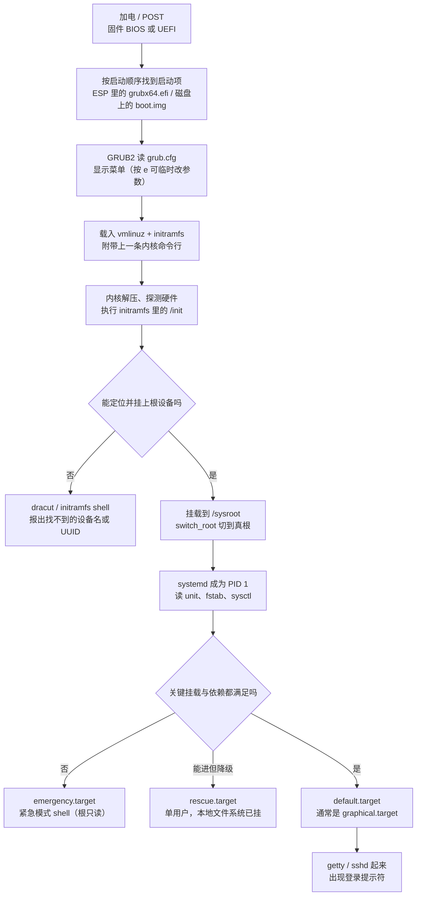

---
tags:
  - Linux
  - 启动流程
  - 内核
  - 运维面试
created: 2026-09-16
---

# 启动流程与内核

> 本笔记对应 [[Linux/00_简介|Linux 大纲]] 的「阶段 1：启动流程、内核与系统初始化」。目标：把从加电到登录提示符的每一环讲成一条链，知道每一环失败时长什么样、现场在哪里，并且能在一台起不来的机器上按顺序把它救回来。
>
> 关联复习：[[07_systemd与服务管理]]（unit 依赖与服务的深水区）、[[09_性能分析与排障]]（开机慢属于它的方法论）、[[04_存储与文件系统]]（fstab 与根分区）。
>
> 说明：命令、默认值与行为以 man 页和发行版官方文档为准；凡涉及默认值、内核差异与发行版差异的地方都标注适用环境（本文以 **RHEL 8/9 系** 与 **Debian/Ubuntu LTS 系** 两个目标环境为主线）。

> [!warning] 本篇的验证状态：框架已完成，尚未逐条实测
> 本文的结论来自 man 页与发行版官方文档，**尚未在实验机上逐条复现**：所有「预期输出」都标注为文档值而不是实测值，涉及默认值的地方写了「以本机查询结果为准」的查询命令。
> 建议的动手顺序：先补一份版本基线（`cat /etc/os-release`、`uname -r`、`systemd --version`），再按第 4 节的实验逐个做，把实测输出、耗时与踩坑回填到对应小节，最后核对文末的「自检清单」。

## 0. 30 秒速览

> [!abstract] 这一页只要记住六句话
> - **启动链只有五环**：固件（BIOS/UEFI）→ GRUB2 → 内核 + `initramfs` → `systemd`（PID 1）→ `default.target`。前两环还归固件管，**从内核开始就是操作系统自己在给自己接生**，所以「起不来」的第一步永远是先分清卡在哪一环。
> - **`initramfs` 是微缩 Linux**：它唯一的关键任务是把「挂载真正根文件系统所需的驱动」装进内存。根分区迁移、换存储控制器、内核升级后起不来，十次有八次是它没跟上。
> - **存在两套「内核参数」**：`/proc/cmdline` 里的启动参数只在启动那一瞬间生效；`sysctl` 改的是运行时参数。名字相似，机制完全不同，改错地方就会「配置写了但没生效」。
> - **改启动参数**：临时改在 GRUB 菜单按 `e` 编辑；持久改要动 `/etc/default/grub`（Debian 系再 `update-grub`，RHEL 系 `grub2-mkconfig`），改完用 `cat /proc/cmdline` 复查——它是唯一的验收标准。
> - **救援的通道要在故障前就验证过**：能进 GRUB 才能改参数进 `emergency.target` / `rd.break`；GRUB 都进不去就只能靠带外管理（IPMI/iDRAC/云控制台）或 Live 介质，这一步没演练过，真出事时只能干等。
> - **重启会毁掉现场**：panic 与启动失败的第一手证据在 `journalctl -b -1`、`dmesg` 的引导段、`vmcore` 里，重启一次就没了，取证永远优先于「先拉起来再说」。

> [!tip] 怎么用这篇笔记
> 首学按 1 → 2 → 3 的顺序读；面试前只看第 0 节与第 5 节的问答卡。
> 「动手验证」里的折叠块建议至少在快照实验机上做两件事：`rd.break` 重置 root 密码、触发一次 panic 看 kdump 能不能抓到 `vmcore`。这两件事是面试里最容易露底的地方。

## 1. 概念

### 1.1 启动链全景

| # | 环节 | 谁在跑 | 关键动作 | 失败时的典型现象 |
| --- | --- | --- | --- | --- |
| 1 | 固件自检与启动项 | BIOS/UEFI（主板固件） | POST、按启动顺序找到 ESP 或 MBR，把控制权交给 `grubx64.efi` / `boot.img` | 黑屏无输出、蜂鸣码、`No bootable device`；**此时操作系统还没开始运行** |
| 2 | 引导加载器 | GRUB2 | 读 `grub.cfg`，显示菜单，把 `vmlinuz` 与 `initramfs` 载入内存 | 掉进 `grub>` 或 `grub rescue>`、`error: unknown filesystem`、`attempt to read or write outside of disk 'hd0'` |
| 3 | 内核初始化 + `initramfs` | `vmlinuz` 与 initramfs 里的 `/init` | 探测硬件、加载驱动、组装并挂载真正的根文件系统、`switch_root` | `VFS: Unable to mount root fs on unknown-block(0,0)`、`dracut-initqueue timeout`、掉进 `dracut:/#` shell |
| 4 | 系统初始化 | `systemd`（PID 1） | 读 unit 与 `fstab`，挂载文件系统、拉起服务，走到 `default.target` | `You are in emergency mode`、大量 `Failed to mount ...`、`Dependency failed for local-fs.target` |
| 5 | 登录与服务 | `getty` / `sshd` / 业务单元 | 提供登录界面或对外服务 | 能登录但服务没起、`systemctl --failed` 有单元、网络不通 |



两个容易被忽略的边界：

- **固件阶段的输出不在操作系统日志里**。POST 报错、RAID 卡自检、网卡 PXE 尝试只出现在带外管理（IPMI/iDRAC/iLO）的 SEL 日志或物理屏幕上，`journalctl` 里看不到，所以「起不来」时要先确认自己是在看哪个屏幕。
- **第 3 环与第 4 环之间有一个语义断层**：内核命令行里的 `rd.*` 参数归 initramfs 用，`systemd.*` 参数归 PID 1 用，同一个参数的 `rd.` 前缀有时不是可选修饰而是两套不同机制（`systemd.unit=` 与 `rd.systemd.unit=` 就是典型）。

### 1.2 `initramfs`：为什么必须有它，什么时候必须重建

内核本身只带最小驱动集，而根文件系统可能位于 LVM、RAID、LUKS 加密卷、iSCSI 或 NFS 之上——**要挂根，先得加载这些东西的驱动，但驱动又在根文件系统里**，这是一个先有鸡还是先有蛋的问题。`initramfs` 就是把解这个死锁所需的最小用户态与驱动打成一个 cpio 归档，由内核在内存里解成一个临时根，跑完 `/init` 后再 `switch_root` 到真正的根。

| 维度 | RHEL 8/9（`dracut`） | Debian/Ubuntu LTS（`initramfs-tools`） |
| --- | --- | --- |
| 生成物 | `/boot/initramfs-$(uname -r).img` | `/boot/initrd.img-$(uname -r)` |
| 重建当前内核 | `dracut -f` | `update-initramfs -u` |
| 重建所有内核 | `dracut --regenerate-all -f` | `update-initramfs -u -k all` |
| 追加驱动 | `/etc/dracut.conf.d/*.conf` 里写 `force_drivers+=" nvme "` 或 `--add-drivers` | `/etc/initramfs-tools/modules` |
| 查看内容 | `lsinitrd` | `lsinitramfs` |
| 内核包升级时 | 由 `kernel-core` 等包自动触发重建 | 由 `linux-image-*` 的 postinst 自动触发 |

必须重建的时机（记忆锚点：**凡是让「挂根」这件事变复杂的变化，都要重建**）：

- 新增或更换存储控制器、RAID 卡、LVM/LUKS 布局、根分区从本地盘换到 iSCSI/NFS；
- 手工安装了根文件系统所需的驱动模块，或修改了 `/etc/dracut.conf.d/`；
- 从别处克隆/快照恢复的系统要跑在不同硬件的机器上（虚拟化平台换 virtio 型号也会踩到）；
- 内核升级后自动重建失败（例如 DKMS 编译失败、`/boot` 空间不足），此时 `initramfs` 与内核不匹配，机器起不来。

失败时你会看到的典型现象，全都发生在第 3 环：

```text
# 在 dracut 的 shell 里能看到什么（RHEL 系）
ls /dev/disk/by-uuid/            # 验证：启动时系统能看到的块设备 UUID 有没有变
cat /run/initramfs/rdsosreport.txt   # 验证：dracut 生成的诊断报告，报 bug 时要求附带这个文件
```

预期：如果 `fstab` 或 `grub.cfg` 里写的 UUID 与实际设备对不上，这里就找不到对应条目，屏幕上会出现 `Warning: /dev/disk/by-uuid/<uuid> does not exist` 或 `dracut-initqueue timeout`，最终落到 `dracut:/#`。

### 1.3 `systemd` 接管之后：target 体系与三种救援模式

PID 1 的启动是一条 target 链：`sysinit.target`（本地文件系统、swap、udev 等基础设施）→ `basic.target` → `multi-user.target`（网络与多用户服务）→ `graphical.target`；`default.target` 通常是指向 `graphical.target` 或 `multi-user.target` 的软链，用 `systemctl get-default` 看当前值、`systemctl set-default` 改它。

三种「进去修东西」的方式差别很大，生产上必须分清：

| 进入方式 | PID 1 是谁 | 文件系统状态 | 能启服务吗 | 典型用途 |
| --- | --- | --- | --- | --- |
| `emergency.target` | `systemd` | **只有根被挂上，且默认只读** | 可以手动启单个 unit | fstab 写坏、根分区需要人工干预 |
| `rescue.target` | `systemd` | 所有本地文件系统已挂载 | 可以（基础服务已起） | 单用户模式改配置、查依赖问题 |
| `init=/bin/bash` | 直接是 `bash` | 根通常只读，`/proc`、`/sys` 可能都没挂 | **不能**（没有 systemd） | 最原始的抢救，改密码、改 fstab |
| `rd.break` | 还在 initramfs 里 | 真根挂在 `/sysroot`，只读 | 不能 | 改密码、修 initramfs 场景下的根设备问题 |

对应的进入方式（面试常问「怎么进单用户/紧急模式」）：

```text
# 运行中切换（需要 root，会停掉大部分服务）
systemctl isolate rescue.target        # 验证：当前系统降到单用户模式
systemctl get-default                  # 验证：默认 target 是哪个

# 启动时用内核参数进入（GRUB 菜单按 e 编辑，Ctrl-X / F10 引导）
#   systemd.unit=rescue.target         # 等价写法：single、rescue、1
#   systemd.unit=emergency.target      # 等价写法：emergency
#   rd.break                           # 停在 initramfs 里，真根在 /sysroot
#   init=/bin/bash                     # 不要 systemd，直接起 shell
cat /proc/cmdline                      # 验证：本次启动到底带了哪些参数（永久性证据）
```

预期：`/proc/cmdline` 会原样显示引导器传给内核的全部参数；`systemctl get-default` 输出形如 `graphical.target`。

> [!important] 现代发行版进救援模式要 root 密码，不要指望「卡住就有 root shell」
> `rescue.target` 与 `emergency.target` 都要过 `sulogin` 验证（systemd 的紧急 shell 同样会要 root 密码）。若 root 已被锁定，会看到 `Cannot open access to console, the root account is locked`——这不是故障，而是设计：**它能防住的就是「拿到控制台就等于拿到 root」这件事**。
> 所以真正能无条件拿到 root 的是 `init=/bin/bash` 与 `rd.break` 这类绕过认证的路径，也正因如此它们在物理接触面前等于零防护。

### 1.4 两套「内核参数」：启动参数与运行时参数

这是本阶段最容易被混为一谈的一组概念，先钉死区别：

| 维度 | 启动参数（kernel command line） | 运行时参数（`sysctl` / `/proc/sys`） |
| --- | --- | --- |
| 存放位置 | 引导器配置 → `/proc/cmdline` | `/proc/sys/**`，可读写文件 |
| 谁传递 | GRUB2 传给内核 | 内核自己暴露，由用户态写入 |
| 生效时机 | **只在启动瞬间**，改完必须重启（或 `kexec`） | 写入即生效 |
| 持久化 | `/etc/default/grub` + 重新生成 `grub.cfg` | `/etc/sysctl.d/*.conf` 等配置文件，开机时由 `systemd-sysctl` 写入 |
| 典型例子 | `ro`、`quiet`、`console=ttyS0,115200n8`、`crashkernel=`、`systemd.unit=` | `net.ipv4.ip_forward`、`vm.swappiness`、`kernel.pid_max` |

**启动参数的持久化**（RHEL 与 Debian 的路径差异必须记牢）：

```text
# Debian/Ubuntu：改 /etc/default/grub 里的 GRUB_CMDLINE_LINUX / GRUB_CMDLINE_LINUX_DEFAULT，然后
update-grub                       # 验证：/boot/grub/grub.cfg 的时间戳被刷新

# RHEL 8/9：改 /etc/default/grub 后重新生成
grub2-mkconfig -o /boot/grub2/grub.cfg   # BIOS 机器；UEFI 机器的输出路径以发行版文档与本机 ls -l 为准

# RHEL 上更稳的改法是 grubby：它不依赖 grub.cfg 的具体路径，直接改所有启动项
grubby --update-kernel=ALL --args="console=ttyS0,115200n8"
grubby --info=ALL                 # 验证：每个启动项的 args 里是否都加上了新参数
cat /proc/cmdline                 # 验证：重启后内核确实收到了（唯一验收标准）
```

几个常见参数的用途与坑：

| 参数 | 作用 | 坑 |
| --- | --- | --- |
| `ro` / `rw` | 根文件系统的初始挂载方式 | 改密码用的 `init=/bin/bash` 常需 `rw`，或进 shell 后 `mount -o remount,rw /` |
| `quiet`、`rhgb` | 少打内核日志 / 图形化启动画面（RHEL 常用） | 排障时要**去掉它们**，否则现场信息被吞掉 |
| `console=ttyS0,115200n8` | 把内核与 systemd 日志输出到串口 | 云主机与服务器带外管理依赖它；漏配就只剩一句「机器没起来」 |
| `crashkernel=` | 为 kdump 预留捕获内核的内存 | 预留过小 → `vmcore` 抓不全；过大 → 正常运行业务少一块内存（用 `kdumpctl estimate` 估） |
| `systemd.unit=` | 指定本次启动的目标 unit | 写错 unit 名会掉回 `rescue.target` 而不是报错重试 |
| `init=` | 指定 PID 1 | `init=/bin/bash` 下没有 systemd，服务、日志、`systemctl` 全都不可用 |
| `systemd.log_level=debug`、`rd.debug` | 打印 initrd / systemd 的详细日志 | 只在排障时临时加，日志量很大 |
| `selinux=0`、`enforcing=0` | 关闭或降级 SELinux | **生产事故的常见错误动作**：它掩盖问题并让系统处于无标签状态，正确做法是看 `ausearch`/`dmesg` 排坑 |
| `net.ifnames=0` | 回到 `eth0` 式网卡命名 | 改了会导致网络配置与既有脚本失配，「改回来」往往比重装还麻烦 |

**运行时参数的三种改法**，作用域和持久性完全不同：

| 改法 | 生效范围 | 重启后 |
| --- | --- | --- |
| `echo 1 > /proc/sys/net/ipv4/ip_forward` | 当前运行内核 | 丢失 |
| `sysctl -w net.ipv4.ip_forward=1` | 当前运行内核（本质是往 `/proc/sys` 写） | 丢失 |
| `/etc/sysctl.d/99-xxx.conf` + `sysctl --system` | 当前运行内核 + 今后每次开机 | 保留 |

```text
sysctl -a                              # 验证：全部运行时参数的当前值（数量随内核与已加载模块变化）
sysctl net.ipv4.ip_forward             # 验证：单个参数，等价于 cat /proc/sys/net/ipv4/ip_forward
sysctl --system                        # 验证：按加载顺序重新应用所有 sysctl 配置文件（失败项会打印出来）
ls -l /etc/sysctl.d/99-sysctl.conf     # 验证：本机的老配置入口是不是一个软链（见下方说明）
```

> [!important] `/etc/sysctl.conf` 与 `/etc/sysctl.d/` 谁先谁后
> `systemd-sysctl` 读取的目录顺序是 `/etc/` > `/run/` > `/usr/local/lib/` > `/usr/lib/`，**所有 `.conf` 文件不分目录、统一按文件名字典序排序执行，名字排在后面的覆盖前面的**；同名文件以高优先级目录里的为准。
> 关键是：**systemd（v198 起）不再直接读 `/etc/sysctl.conf`**，而多数发行版提供一个软链 `/etc/sysctl.d/99-sysctl.conf -> ../sysctl.conf` 来兼容老习惯——于是它以 `99-` 开头，天然排在 `/etc/sysctl.d/` 里最后被应用，优先级最高。所以：
> - 如果你要覆盖它，配置文件名必须排在它之后（例如 `100-local.conf`），**光写 `50-xxx.conf` 是会被它盖掉的**；
> - 用 `ls -l /etc/sysctl.d/99-sysctl.conf` 确认本机到底有没有这个软链，再决定自己的编号策略。
>
> 另一个陷阱：**参数要等对应模块加载后才存在**。`systemd-sysctl` 在启动早期就跑完了，比如某些 `net.*` 参数在网卡驱动加载前并不存在，写进去会失败；这种参数要改用 udev 规则，或用 `modules-load.d/` 让模块提前加载。

### 1.5 内核模块：驱动是怎么被装进去的

内核功能分两种形态：**编进内核镜像（builtin）** 与 **编译成可加载模块（`.ko`）**。`lsmod` 只列后者，所以「`lsmod` 里没有这个驱动」不等于「内核不支持它」，这一点在排障时经常把人带偏。

```text
lsmod | head                       # 验证：当前已加载的模块及其依赖计数、被引用次数
modinfo <module>                   # 验证：模块的路径、参数（parm）、依赖（depends）、别名（alias）
modinfo -n <module>                # 验证：模块文件在 /lib/modules/$(uname -r) 下的真实路径
modprobe <module>                  # 验证：按依赖顺序加载模块（比 insmod 安全，会处理依赖）
modprobe -r <module>               # 验证：卸载模块（被占用时会失败，lsmod 第三列非 0 即为占用）
modprobe --show-depends <module>   # 验证：加载它会连带拉起哪些模块
```

三个「模块没有按预期加载」的写法，全都放在 `/etc/modprobe.d/*.conf`：

| 指令 | 语义 | 常见误用 |
| --- | --- | --- |
| `options <mod> <k>=<v>` | 加载时附带的模块参数 | 参数名写错不会报错，只会被内核忽略，用 `modinfo -p <mod>` 核对 |
| `blacklist <mod>` | `modprobe <mod>` 与 udev 自动加载时不主动选它 | **它挡不住被别的模块依赖而被动加载**，要彻底禁掉得再加 `install <mod> /bin/false` |
| `install <mod> <cmd>` | 用自定义命令替代真正的加载动作 | 写 `/bin/false` 是最常见的「硬禁用」写法 |

另外两张表要知道在哪里：`/etc/modules-load.d/*.conf`（开机由 `systemd-modules-load.service` 静态加载，用来让模块早于 sysctl 生效），以及 `depmod -a`（手工往 `/lib/modules/$(uname -r)/` 放模块后重建依赖表，否则 `modprobe` 找不到）。

驱动加载失败时，**证据只在两处**：内核日志与固件文件是否存在。

```text
dmesg | grep -i -E 'error|fail|firmware'      # 验证：驱动加载、固件加载、符号缺失的错误
journalctl -k -b                               # 验证：本次启动的内核日志（比 dmesg 更完整、带启动 ID，推荐）
journalctl -k -b -1                            # 验证：上一次启动的内核日志（需要 journal 持久化）
```

预期的错误文案与含义：

| 现象/日志片段 | 含义 | 处理方向 |
| --- | --- | --- |
| `Unknown symbol in module` | 模块与当前内核不匹配（常见于手工编译的老驱动） | 用匹配当前内核的版本重编（DKMS）或回滚内核 |
| `module verification failed` / `Key was rejected by service` | Secure Boot 下模块没签名或被拒 | 用发行版签名模块，或按流程注册 MOK，**不要直接关 Secure Boot** |
| `Direct firmware load for xxx failed` | 模块在，但设备需要的固件文件缺失 | 装对应的 `linux-firmware` 包，并确认固件路径与版本 |
| `modprobe: ERROR: could not insert` 但 `dmesg` 无相关记录 | 多半是参数/别名问题或模块根本没打进 initramfs | 核对 `modinfo`、`/etc/modprobe.d/`，必要时 `dracut -f --add-drivers` 重建 initramfs |
| 运行中新插的硬件没被识别 | 模块未随设备自动加载 | 查 `dmesg` 尾部的设备枚举记录，再 `modprobe` 手工加载验证 |

## 2. 生产实践

### 2.1 环境与版本基线

这套笔记里所有「默认值」都要落到本机实测上，先建基线再动手：

```text
cat /etc/os-release                 # 验证：发行版与版本（决定 dracut 还是 initramfs-tools 等路径差异）
uname -r                            # 验证：当前运行内核版本（重启后要对比它是否变化）
systemd --version | head -1         # 验证：systemd 版本（决定 systemd-sysctl 行为、日志与 unit 语法）
stat -fc %T /sys/fs/cgroup           # 验证：cgroup 版本，cgroup2fs 即 v2（阶段 2/3 会继续用）
lsblk -o NAME,SIZE,TYPE,FSTYPE,MOUNTPOINT,UUID   # 验证：根分区到底是什么设备（fstab 与 grub 参数的依据）
cat /proc/cmdline                   # 验证：本次启动的内核参数基线
```

预期：把这几条的输出直接贴进笔记首页或资产台账。特别是 `uname -r` 与 `cat /proc/cmdline`——内核升级、参数调整之后要拿它们做前后对比。

### 2.2 内核升级与回滚

原则只有一句：**永远保证「至少有一个能起来的旧内核」留在机器上**，其余都是流程细节。

```text
# RHEL 8/9：安装新内核（不会删掉旧内核，保留数量由 dnf 的 installonly_limit 控制）
dnf install kernel-<version>            # 验证：新内核与配套 initramfs 出现在 /boot
ls -1 /boot/vmlinuz-* /boot/initramfs-*.img   # 验证：新旧内核文件都在，且 initramfs 是新的
grep -r installonly_limit /etc/dnf/dnf.conf   # 验证：本机到底保留几个内核（默认值以输出为准）
grubby --default-kernel                 # 验证：下次默认启动哪个内核
grubby --set-default /boot/vmlinuz-<old-version>   # 验证：需要回滚时把默认启动项指回旧内核

# Debian/Ubuntu：安装指定版本内核后更新引导
apt install linux-image-<version>       # 验证：/boot 下新增 vmlinuz/initrd，grub.cfg 自动刷新
dpkg -l 'linux-image-*' | grep ^ii      # 验证：本机装了哪些内核（确定旧内核还在）
```

升级流程按四步走，缺一步都算没做完：

1. **升级前**：记录 `uname -r`、`cat /proc/cmdline`、`grubby --info=ALL`（或 `grep -E 'menuentry|linux' /boot/grub/grub.cfg`）、关键服务清单；确认带外管理可用、`/boot` 有足够空间（内核与 initramfs 各占几十 MB，`/boot` 单独分区时最容易在这里翻车）。
2. **升级中**：只装不动 GRUB 默认项，先让新旧内核并存；涉及 DKMS（如 NVIDIA、部分存储驱动）的机器，要确认新内核的模块编译成功，否则新内核起来后设备全丢。
3. **重启后验证**：`uname -r` 确认运行的是新内核；`systemctl --failed`、`dmesg -T | tail -50`、`ip a`、以及业务健康检查全部过一遍。**别把「命令没报错」当成验证通过**。
4. **回滚**：重启时在 GRUB 菜单选旧内核，或在系统里 `grubby --set-default` 改回旧内核再重启；回滚后要保留失败现场（`journalctl -b -1`），否则等于白回滚一次。

两个加速/替代手段的边界必须说清楚：

| 手段 | 能做什么 | 不能做什么 |
| --- | --- | --- |
| `kexec`（`systemctl kexec`） | 跳过固件与 GRUB，直接把新内核换进内存重启，省掉 POST 那段时间 | **不是冷重启**：固件未重新初始化、硬件状态未复位，不适合用来排除硬件问题；Secure Boot 开启时对未签名内核会失败 |
| Livepatch（RHEL 的 `kpatch`、Ubuntu 的 livepatch 客户端） | 用函数级热补丁修掉厂商明确覆盖的 **CVE**，推迟重启窗口 | 不能替代内核**版本升级**；不覆盖驱动与模块更新；补丁是累积栈，通常不能只挑一个；不同发行版/内核版本的覆盖范围差异很大，装机前要查清单 |

### 2.3 崩溃取证：kdump、`vmcore` 与 `crash`

内核 panic 后机器只会重启，现场在内存里、重启即失。`kdump` 的思路是：**提前预留一块内存 + 提前把「捕获内核」装好**，panic 时用 `kexec` 直接引导捕获内核，把崩溃内核的内存镜像（`vmcore`）写成文件。

```text
cat /proc/cmdline | tr ' ' '\n' | grep crashkernel   # 验证：启动参数里到底预留了多少内存
cat /sys/kernel/kexec_crash_size                     # 验证：内核实际为 kdump 保留的字节数
systemctl status kdump                               # 验证：kdump 服务（RHEL 系）是否在跑、捕获内核是否已加载
kdumpctl estimate                                    # 验证：官方工具给出的建议预留值，比拍脑袋靠谱（RHEL 系）
ls /var/crash/                                       # 验证：历史上抓到的崩溃目录（每个目录一份 vmcore + dmesg）
```

配置与验证要点：

- 预留内存由 `crashkernel=` 决定，**大小与实际内存、内核版本和发行版有关**：预留不足会抓不到完整 `vmcore` 或直接抓失败，预留过大则常年占用业务内存。取值用 `kdumpctl estimate` 之类工具在本机算，不要照抄别人的数字。
- 转储路径与过滤方式在 `/etc/kdump.conf`（RHEL）/ `kdump-tools` 的配置里：本地目录是最基础的方案，生产更常见的是 NFS/SSH 远端转储；`makedumpfile` 的压缩与去零页选项能显著缩小文件（`vmcore` 大小接近内存容量，必须提前算盘空间）。
- **kdump 自己也要演练**：在一台可快照的实验机上用 `echo c > /proc/sysrq-trigger`（需 `kernel.sysrq=1`）主动触发 panic，确认机器能自动重启并落下 `vmcore`。没演练过的 kdump，和没配是一样的。
- Secure Boot 环境下 `kexec` 受 lockdown 限制，kdump 依赖发行版提供的**已签名**捕获内核；某些云主机或受管环境会直接禁用 kexec，此时只能靠串口控制台日志与带外管理取证。

拿到 `vmcore` 之后的分析入口（需要匹配内核版本的 debuginfo）：

```text
crash /usr/lib/debug/lib/modules/$(uname -r)/vmlinux /var/crash/<timestamp>/vmcore
# 进入 crash 交互后的常用命令
crash> bt          # 验证：崩溃时的调用栈，定位崩在哪条路径
crash> log         # 验证：崩溃前的内核日志（find 现场最直接的一条线索）
crash> ps          # 验证：崩溃瞬间的进程列表（谁在跑、是否卡在 D 状态）
crash> vm          # 验证：内存状态（是否已经 OOM 边缘）
crash> exit
```

预期的判断顺序：先看 `bt` 崩在哪个子系统，再看 `log` 里最后打印的内容，最后用 `ps`/`vm` 判断是「资源耗尽」还是「代码路径 bug」。这一步只是初步定位，真正的根因往往要连到具体的驱动、文件系统或业务模块。

### 2.4 常见坑

| 常见做法或说法 | 后果或事实 |
| --- | --- |
| 改完 `/etc/fstab` 直接重启 | 挂载项写错 → 启动落到 `emergency.target`，远端的机器直接失联；**必须先 `mount -a` 验证**，并考虑给非关键挂载点加 `nofail` 与 `x-systemd.device-timeout=` |
| 内核升级后只重启了事 | 新内核缺 DKMS 模块/驱动 → 网卡、存储、GPU 全失联；升级前必须确认模块重编译成功 |
| `/boot` 分区给小了 | 内核与 initramfs 累积写满 `/boot`，包安装失败或留下半个内核 → 启动直接失败 |
| 以为 `lsmod` 没有就是内核不支持 | 功能可能已经编进内核（builtin）；判断依据是 `modinfo`、内核配置或设备是否工作 |
| 用 `blacklist` 就以为禁掉了模块 | 被其他模块依赖时会照样加载；要硬禁用需配 `install <mod> /bin/false` |
| 改了 `/etc/default/grub` 就重启 | 没重新生成 `grub.cfg`，参数根本没进启动项；改完必须 `grub2-mkconfig` / `update-grub` 并核对 `/proc/cmdline` |
| 用 `sysctl -w` 改完就当配置已完成 | 重启即丢，且没有审计痕迹；正确做法是写入 `/etc/sysctl.d/` 后 `sysctl --system` |
| 把 `/etc/sysctl.conf` 当最高优先级 | 它通常靠 `/etc/sysctl.d/99-sysctl.conf` 软链生效；自己要覆盖它，文件名编号必须排在它之后 |
| `dmesg -T` 当时间证据 | `-T` 是用当前时钟换算的，开机早期还没同步时间，时间戳可能是错的；跨机器对日志用 `journalctl -b` + 统一时区 |
| 生产机上关掉 SELinux 来「解决」问题 | 会让系统进入无标签状态、掩盖根因，重新打开时往往起不来；正确做法是 `ausearch`/`dmesg` 定位再到允许规则 |
| 只保留一个新内核 | 新内核起不来时没有退路；至少保留一个可用的旧内核启动项 |
| 忘记做带外管理演练 | 根分区损坏或网络写错时，除了拆机进机房没有第二条路 |

## 3. 排障速查

统一原则：**先定位卡在第几环，再动手；没找到现场前不做不可逆操作。**

### 3.1 卡在 GRUB 阶段

> [!tip] 第一反应不要是「重装系统」
> GRUB 提示符本身就是一个可用的引导器，绝大多数情况能在两分钟内手工把系统拉起来；`grub>` 出现说明配置读取失败，但内核文件通常还在盘上。

按顺序排除：

1. **看提示符是哪一种**：`grub rescue>` 表示连 GRUB 的正常模块都没加载；`grub>` 表示 GRUB 本体可用但没找到配置或配置有错。
2. **在 `grub rescue>` 里找回配置**：

```text
ls                                  # 验证：GRUB 能看到哪些磁盘与分区，形如 (hd0,gpt2)
ls (hd0,gpt2)/                      # 验证：逐个分区看一眼，找出含 grub2/ 与 vmlinuz 的那个（通常就是独立 /boot 分区）
set root=(hd0,gpt2)                 # 设定根分区（下面统一按「该分区即 /boot」举例）
set prefix=(hd0,gpt2)/grub2         # 模块目录：RHEL 系是 /grub2，Debian 系是 /grub；prefix 写错时 insmod 会失败
insmod normal                       # 加载 normal 模块
normal                              # 进入正常菜单
```

3. **在 `grub>` 里手工引导**（知道内核文件名时最快）：

```text
ls (hd0,gpt2)/                      # 验证：确认 vmlinuz 与 initramfs 的确切文件名
linux (hd0,gpt2)/vmlinuz-<version> root=/dev/mapper/rhel-root ro
initrd (hd0,gpt2)/initramfs-<version>.img
boot
```

如果 `/boot` 不是独立分区、而是根分区下的目录，则把上面两行的路径改成 `(hd0,gpt2)/boot/vmlinuz-<version>` 与 `(hd0,gpt2)/boot/initramfs-<version>.img`——**`root=` 指向的是根分区，`linux`/`initrd` 指向的是内核文件所在位置，两者不一定是同一个分区**，这是手工引导最容易写错的地方。

4. **进系统后立即修根因**：重新生成配置（`grub2-mkconfig -o /boot/grub2/grub.cfg` 或 `update-grub`），重装引导器（RHEL 系 `grub2-install`，Debian 系 `grub-install`），并检查 `/boot` 是否被写满。

### 3.2 卡在 initramfs / `dracut:/#`（找不到根设备）

> [!tip] 第一反应不要是「重装 initramfs 就完事」
> 先确认是「设备真的不在了（磁盘/RAID/云盘问题）」还是「名字对不上（UUID、LVM 名、云盘设备名变了）」，这两类问题的处理方向完全相反。

按顺序排除：

1. **设备在不在**：在 dracut shell 里 `ls /dev/disk/by-uuid/`、`ls /dev/mapper/`、`lvm vgscan`，与 `/proc/cmdline` 里的 `root=`、`rd.lvm.lv=` 对比。
2. **驱动缺不缺**：如果整个盘都看不到（`lsblk` 为空），通常是存储驱动没进 initramfs——换硬件、克隆到新平台、内核升级后最容易出现。
3. **修好参数还是修好 initramfs**：只是 UUID 变了，可以在 dracut shell 里改成正确的 `root=UUID=...` 先进系统；如果是驱动缺失，进系统后 `dracut -f --add-drivers=<mod>` 重建。

```text
cat /proc/cmdline                   # 验证：内核拿到的 root= 与 rd.* 参数（在 dracut shell 里同样可看）
lsblk                               # 验证：initramfs 能看到哪些块设备（空或缺失关键盘即为驱动问题）
lvm vgscan --mknodes                # 验证：LVM 元数据是否可见（LVM 根分区专用）
cat /run/initramfs/rdsosreport.txt  # 验证：dracut 诊断报告，包含设备与模块加载全过程
```

### 3.3 落到 `emergency.target`（`You are in emergency mode`）

> [!tip] 第一反应不要是「一路回车直接重启」
> 紧急模式是 systemd 明确告诉你「有东西挂不上」，重启只会再演一遍；而这是个**根文件系统已挂、可以动手修**的环境。

按顺序排除：

1. **看是谁失败了**：`systemctl --failed`、`journalctl -xb | grep -A5 -i 'failed to mount'`，一半以上的场景是 `/etc/fstab` 里的某个挂载点。
2. **验证 fstab**：修完 `fstab` 后先 `mount -a` 试一遍，再 `systemctl daemon-reload`；确认无误后 `systemctl default` 继续启动。
3. **本地文件系统检查失败**：如果根分区被要求做 `fsck` 而失败，通常是盘坏或超级块受损，先只读挂载取数据，再考虑修复。

```text
systemctl --failed                  # 验证：哪些 unit 处于 failed 状态
mount -a                            # 验证：fstab 里所有条目能否手工挂上（报错会直接指到那一行）
mount -o remount,rw /               # 验证：紧急模式下根目录通常只读，改配置前先确认可写
systemctl default                   # 验证：修完后继续往日用 target 启动
```

### 3.4 启动卡在「A start job is running for ...（1min 30s）」

> [!tip] 第一反应不要是「等它超时」
> 那 90 秒是 systemd 的 `DefaultTimeoutStartSec` 在等一个永远不会出现的设备或服务；等下去只是把 5 秒的开机拖成两分钟。

按顺序排除：

1. **看等的是谁**：消息里会写明 unit 名，例如 `dev-disk-by\x2duuid-<uuid>.device`（设备不见了）、`NetworkManager-wait-online.service`（网络未就绪）、`systemd-udev-settle`（硬件枚举慢）。
2. **设备类**：检查 `fstab` 里是否有指向已下线设备/UUID 的挂载项；给它加 `nofail`、`x-systemd.device-timeout=10s` 让启动不再被一个可选挂载拖住。
3. **网络类**：`network-online.target` 依赖链被当成硬依赖时，会把开机变成「等网络」；服务只应 `Wants=network-online.target` 而不是 `Requires=`，细节见 [[07_systemd与服务管理]]。

```text
systemctl list-jobs                 # 验证：当前还有哪些 job 在排队/运行
systemd-analyze blame | head -20    # 验证：按耗时排序的单元启动时间
systemd-analyze critical-chain      # 验证：关键路径上被谁卡住（比 blame 更贴近「为什么开机慢」）
```

### 3.5 panic 之后：现场怎么取

> [!tip] 第一反应不要是「先重启再看」
> 重启一次，`vmcore` 与上一次启动的日志就都没了；先确认 kdump 是否落下 `vmcore`，再决定动不动。

按顺序排除：

1. **有没有 `vmcore`**：`ls -lt /var/crash/`，有则先保住（拷到远端）。
2. **有没有串口日志**：云主机与控制台通常只有串口输出，从带外管理导出完整日志，包含 panic 的调用栈与退出前的最后几行。
3. **有没有上一次启动的日志**：`journalctl --list-boots`、`journalctl -b -1 -k`；依赖 journal 持久化（`/var/log/journal` 存在且 `Storage=` 允许持久）。

```text
journalctl --list-boots             # 验证：本机保留了几次启动的日志（-1 是上一次）
journalctl -b -1 -k -p warning      # 验证：上一次启动的内核警告与错误（崩溃/掉电前的最后一手证据）
journalctl --disk-usage             # 验证：日志占用（持久化前先确认磁盘够用）
```

### 3.6 改了内核参数却不生效

> [!tip] 第一反应不要是「再改一遍重启试试」
> 先判断你改的是不是**另一套参数**：启动参数与运行时参数是两套机制，「改对了地方」比「再改一遍」重要。

按顺序排除：

1. **它本来是启动参数吗**：`grep <名字> /proc/cmdline` 没出现，说明这次启动根本没带上它——检查 `/etc/default/grub` 是否重新生成、GRUB 菜单是否选了正确的启动项。
2. **它在运行时是可见参数吗**：`sysctl <名字>` 报 `cannot stat`，说明模块没加载或名字写错（`/proc/sys` 里点号要换成路径）。
3. **它被谁覆盖了**：`sysctl -a` 看当前值、按文件名字典序检查 `/etc/sysctl.d/` 与 `/usr/lib/sysctl.d/`，注意 `99-sysctl.conf` 的存在。

```text
cat /proc/cmdline                   # 验证：启动参数是否真的进来了（启动参数的唯一真相）
grep -r '<参数名>' /etc/default/grub /etc/sysctl.d/   # 验证：配置写在了哪一层
sysctl --system                     # 验证：重新应用全部 sysctl 配置，观察是否报错被覆盖
```

### 3.7 忘记 root 密码（以及为什么它是安全事件）

> [!tip] 第一反应不要是「重装系统」或「找厂商」
> 只要有控制台，重置 root 密码是标准操作；反过来讲，**任何人只要有控制台就能做这件事**，这才是它在生产上属于安全事件的原因。

标准路径（RHEL 系，利用 `rd.break` 停在 initramfs 里）：

```text
# GRUB 菜单按 e，在内核行末尾加 rd.break，Ctrl-X 引导，进入 dracut 提示符
mount -o remount,rw /sysroot        # 验证：真根以只读方式挂在 /sysroot，先改成可写
chroot /sysroot                     # 验证：把 /sysroot 当根使用
passwd root                         # 验证：重置密码（passwd 会写 /etc/shadow）
touch /.autorelabel                 # 验证：让 SELinux 在下次启动重新打标签（否则可能登录被拒）
exit                                # 退出 chroot
exit                                # 退出 initramfs，继续启动
```

Debian/Ubuntu 的等价做法：GRUB 里选 recovery mode 进 root shell（根只读，需 `mount -o remount,rw /`），或在内核行加 `init=/bin/bash` 后 `mount -o remount,rw /` 再 `passwd`。

安全视角要说的三句话：

- **控制台即 root**：未加密磁盘 + 可物理接触/可访问带外控制台 = 可重置任何本地密码。真正的防护是**磁盘加密**（LUKS）、BIOS/GRUB 密码、带外管理账号的独立鉴权与审计，而不是指望恢复路径被堵死。
- **恢复动作要留痕**：谁能进控制台、什么时候进的，应进变更记录；恢复后立刻复查 `/etc/shadow` 的改动时间、`auth` 日志与登录记录。
- **这类操作本身就是攻击手法**，所以「发现有人进过控制台」要和入侵处置同一优先级处理。

## 4. 动手验证

> [!warning] 前置纪律
> 实验 2 会改 root 密码、实验 5 会故意写坏 `fstab` 让机器进不了正常启动、实验 6 会直接触发 panic，**都只在可快照的实验机上做**，每条实验前打一次快照；实验 3 会改内核网络参数，同样别在生产机上练。生产机上只做只读观测（`cat`、`ls`、`journalctl`、`systemd-analyze`）。

> [!example]- 实验 1：临时参数与持久参数的作用域
> ```text
> # 第一步：在 GRUB 菜单按 e，在 Linux 行末尾追加 systemd.log_level=debug，Ctrl-X 启动
> cat /proc/cmdline                    # 验证：参数出现在本次启动里
> # 第二步：重启（不做任何持久化），再次查看
> cat /proc/cmdline                    # 预期：systemd.log_level=debug 消失——临时参数只作用于这一次启动
> # 第三步：写进 /etc/default/grub 的 GRUB_CMDLINE_LINUX 后重新生成配置并重启
> cat /proc/cmdline                    # 预期：参数持续存在，成为新的启动基线
> ```
> 环境：RHEL 9 / Ubuntu 24.04 LTS 均可；RHEL 系重生成命令为 `grub2-mkconfig -o /boot/grub2/grub.cfg`，Debian 系为 `update-grub`。
> 回滚：把 `/etc/default/grub` 改回去，重新生成配置再重启。

> [!example]- 实验 2：`rd.break` 重置 root 密码并被 SELinux 拦一次
> ```text
> # GRUB 编辑启动项，内核行末尾加 rd.break，Ctrl-X 引导
> mount -o remount,rw /sysroot         # 验证：/sysroot 从 ro 变 rw（mount 输出里可见）
> chroot /sysroot
> passwd root                          # 验证：连续输入两遍新密码，成功后 /etc/shadow 时间戳变化
> # 故意跳过 touch /.autorelabel：重启后尝试登录，记录 SELinux 的行为
> # 再重做一次并执行 touch /.autorelabel，对比两次差异
> exit; exit
> ```
> 预期：不重打标签时，SELinux enforcing 的机器可能在登录阶段出现权限类拒绝（`/var/log/audit/audit.log` 里有 AVC）；执行 `/.autorelabel` 后首次启动会明显变慢（全盘重打标签）。
> 环境：RHEL 9（SELinux enforcing）；Debian/Ubuntu 用 recovery mode 或 `init=/bin/bash` 做对照。
> 回滚：把 root 密码改回原值，删除 `/.autorelabel`。

> [!example]- 实验 3：`sysctl` 三种改法的作用域
> ```text
> sysctl net.ipv4.ip_forward                 # 记录初始值
> echo 1 > /proc/sys/net/ipv4/ip_forward     # 改法一：直接写 /proc/sys
> sysctl -w net.ipv4.ip_forward=0            # 改法二：sysctl -w（本质上还是写 /proc/sys）
> printf 'net.ipv4.ip_forward = 1\n' > /etc/sysctl.d/60-lab-forward.conf
> sysctl --system                            # 改法三：配置文件 + 重新应用
> sysctl net.ipv4.ip_forward                 # 预期：1（配置文件里的值被应用）
> reboot
> sysctl net.ipv4.ip_forward                 # 预期：重启后仍为 1；而只做过改法一/二的参数会回到默认值
> ```
> 环境：任意 systemd 发行版。**这条实验要在实验机做**：`ip_forward` 会影响是否转发流量。
> 回滚：删除 `/etc/sysctl.d/60-lab-forward.conf`，`sysctl --system`，必要时把 `ip_forward` 设回 0。

> [!example]- 实验 4：用 `systemd-analyze` 找到开机慢的原因
> ```text
> systemd-analyze time                  # 验证：firmware / loader / kernel / userspace 各段耗时
> systemd-analyze blame | head -20      # 验证：单元自身的启动耗时排行（不含等待依赖的时间）
> systemd-analyze critical-chain        # 验证：关键路径上是谁拖住了开机
> systemd-analyze plot > /tmp/boot.svg  # 验证：可视化时间线，可直接在浏览器打开
> ```
> 预期：`blame` 里的高耗时单元与 `critical-chain` 里 `@` 后面标注的时间要能对上；对不上的部分通常是「并行等待」——这正是只看 `blame` 会误判的原因。
> 环境：任意 systemd 发行版；建议连做三次取稳定值，避免首次启动的缓存干扰。

> [!example]- 实验 5：故意写坏 `fstab`，观察紧急模式与恢复
> ```text
> cp /etc/fstab /etc/fstab.bak.$(date +%F)          # 先备份（纪律动作）
> printf '/dev/disk/by-uuid/00000000-0000-0000-0000-000000000000 /mnt/bad auto defaults 0 0\n' >> /etc/fstab
> mount -a                                          # 验证：这条命令就会报错，说明启动同样会失败
> systemctl daemon-reload && reboot                 # 观察：启动落到 emergency.target
> # 在紧急模式里：journalctl -xb | grep -i 'failed to mount'；然后删掉那一行
> mount -a                                          # 验证：不再报错
> systemctl default                                 # 继续正常启动
> ```
> 预期：错误写法 → `mount -a` 立即报错；紧急模式下 `systemctl --failed` 能看到失败单元，`journalctl -xb` 里有 `Failed to mount /mnt/bad`。
> 环境：**仅实验机**，且要保证有快照或带外控制台。生产上给可选挂载点加 `nofail`、`x-systemd.device-timeout=10s`，就是为了避免这种单点故障。
> 回滚：恢复 `fstab.bak` 那一份，或删掉新增行。

> [!example]- 实验 6：触发一次 panic，验证 kdump 是否真的能抓到现场
> ```text
> sysctl kernel.sysrq                     # 验证：sysrq 是否开启（0 表示全关，需要先放开）
> kdumpctl status                         # 验证：捕获内核已加载（RHEL 系；Debian 系用 kdump-config show）
> echo c > /proc/sysrq-trigger            # 主动触发内核 panic —— 破坏性动作，仅实验机
> # 机器自动重启后：
> ls -lt /var/crash/                      # 验证：是否生成了 vmcore 目录与文件
> journalctl -b -1 -k | tail -50          # 验证：上一次启动崩溃前的内核日志
> ```
> 预期：`/var/crash/<时间戳>/` 下出现 `vmcore`（大小与内存容量、过滤选项相关）与 `vmcore-dmesg.txt`；`journalctl -b -1` 能看到崩溃前后的内核输出。
> 环境：**仅实验机**且已提前配好 `crashkernel=` 与 kdump 服务；云主机若禁用 kexec，此实验不成立，需改用带外串口日志取证。
> 回滚：清理 `/var/crash` 中的大文件，确认预留内存与业务内存需求是否需要调整。

## 5. 要点自测

> [!question]- 从按下电源到出现登录提示符，中间发生了什么？云主机上最常出问题的是哪一环？
> - **定义**：五环链条——固件（BIOS/UEFI）→ GRUB2 → 内核 + `initramfs` → `systemd`（PID 1）→ `default.target`。
> - **每环的产出**：固件交出控制权；GRUB 载入 `vmlinuz` 与 initramfs；内核与 initramfs 挂上真根并 `switch_root`；systemd 按 unit 与 `fstab` 拉起服务；最后 `getty`/`sshd` 给出登录入口。
> - **云主机最常出问题的位置**：第 3、4 环占绝大多数——根设备 UUID/设备名变化、`initramfs` 缺存储驱动、`/etc/fstab` 写错、cloud-init 或网络配置把启动拖住；真正的固件故障相对罕见。
> - **落点**：判断故障时先问「现在屏幕/日志是谁在输出」——固件的事 `journalctl` 看不到，systemd 的事不会出现在 dracut shell 里。
> - **第一反应不要是什么**：不要一上来就重启，`journalctl -b -1` 与带外串口日志是重启一次就没了的证据。

> [!question]- `initramfs` 是干什么的？为什么换了存储控制器或做了根分区迁移后系统可能起不来？
> - 它解决的是「挂根需要驱动，而驱动在根里」的死锁：把存储、文件系统、LVM/RAID/LUKS、网络根所需的模块打成一个内存中的临时根，由内核先跑它，再把真根挂到 `/sysroot` 并 `switch_root`。
> - 换控制器/迁移根分区后起不来，是因为**新的根设备依赖新的驱动或新的标识**（新驱动不在 initramfs 里，或 `root=UUID=` 还是旧值），而这层信息在重建 initramfs 与更新启动配置之前不会自动更新。
> - 处置套路：在 dracut shell 里用 `lsblk`、`ls /dev/disk/by-uuid/` 确认设备可见性，进系统后 `dracut -f`（可带 `--add-drivers`）重建，再核对 `/proc/cmdline` 里的 `root=`。
> - **第一反应不要是什么**：不要只改 `fstab` 就觉得完事——根设备的定位发生在 initramfs 阶段，改 `fstab` 影响不到它。

> [!question]- 一台机器卡在 GRUB，另一台卡在 `emergency.target`，处理顺序分别是什么？
> - **卡在 GRUB**：先分辨 `grub>` 还是 `grub rescue>`，用 `ls`/`set root`/`set prefix`/`insmod normal`/`normal` 找回菜单；或直接用 `linux` + `initrd` + `boot` 手工引导；进系统后重生成配置、重装引导器、检查 `/boot` 空间。
> - **卡在 `emergency.target`**：`systemctl --failed` 与 `journalctl -xb` 找出失败单元（多为 `fstab`），先 `mount -o remount,rw /`，改好后 `mount -a` 验证，再 `systemctl default` 继续启动。
> - **共性**：两者的处理目标都是「先让系统起来并保住数据」，不是立刻查清根因；根因分析放到恢复之后。
> - **第一反应不要是什么**：不要在 GRUB 阶段就重装引导器（可能把唯一能用的配置覆盖掉），也不要在紧急模式里盲目重启。

> [!question]- `journalctl -b -1` 在什么场景下是救命命令？
> - 机器刚刚异常重启/panic，第二次启动一切正常，现场只剩「上一次启动」的日志——这是唯一能回答「上一次到底发生了什么」的命令（配合 `-k` 看内核、`-p warning` 降噪）。
> - 前提是 **journal 持久化**：`/var/log/journal` 存在且 `Storage=` 允许持久，否则只有当前这次启动的日志，`--list-boots` 里只有一条。
> - 相关限制：内核环缓冲（`dmesg`）会被覆盖，日志也可能因 `RateLimitBurst` 被限流丢弃，所以关键机器要先把日志持久化与保留策略配好。
> - **第一反应不要是什么**：不要在排查现场前执行 `journalctl --vacuum-*` 清理日志，那等于自己删证据。

> [!question]- `sysctl -w` 改过的参数重启后会怎样？想持久化该写到哪里？`/etc/sysctl.conf` 与 `/etc/sysctl.d/` 谁先谁后？
> - `sysctl -w` 只写进当前内核的 `/proc/sys`，**重启即失效**，也不留审计痕迹；生产上只用于临时验证或应急。
> - 持久化写到 `/etc/sysctl.d/*.conf`（本机自己的配置，建议两位数字前缀），加完 `sysctl --system` 应用；用 `sysctl <key>` 复查。
> - 加载规则：目录优先级 `/etc/` > `/run/` > `/usr/local/lib/` > `/usr/lib/`；所有文件统一按**文件名字典序**执行，**名字靠后的覆盖靠前的**；同名文件以高优先级目录为准。
> - `/etc/sysctl.conf` 在 systemd v198 之后不再被直接读取，通常靠发行版提供的软链 `/etc/sysctl.d/99-sysctl.conf` 生效——于是它排在最后、优先级最高，**要覆盖它，你的文件名必须排在 `99` 之后**。
> - **第一反应不要是什么**：不要以为「写了 `50-xxx.conf` 就一定生效」，先用 `ls -l /etc/sysctl.d/99-sysctl.conf` 看清本机的实际布局。

> [!question]- 内核升级后新内核起不来，你会怎么做？`kexec` 与 Livepatch 各解决什么问题？
> - **回滚**：重启在 GRUB 菜单选旧内核；或在系统内 `grubby --set-default /boot/vmlinuz-<old>` 后重启，并保留 `journalctl -b -1` 的失败现场。
> - **前提**：升级前保留至少一个旧内核启动项（RHEL 由 `installonly_limit` 控制保留数量，Debian 需要自己确认旧 `linux-image-*` 还在）。
> - **`kexec`**：跳过固件与 GRUB 快速换内核，省 POST 时间；但它不是冷重启，硬件状态未复位，不能拿来排除硬件问题，Secure Boot 下对未签名内核会失败。
> - **Livepatch**：厂商覆盖的函数级 CVE 热补丁，用来推迟重启窗口；不能替代版本升级、不覆盖驱动/模块，补丁通常是累积的。
> - **第一反应不要是什么**：不要把「装上就重启」当流程——DKMS 模块没编好、`/boot` 写满、`fstab` 有问题这三件事，会让重启变成一台起不来的机器。

> [!question]- 内核 panic 之后，你怎么拿到「现场」？
> - **配置阶段**：`crashkernel=` 预留内存 + kdump 服务加载捕获内核；转储目标与过滤选项在 `/etc/kdump.conf`（RHEL）里配。
> - **取证阶段**：`/var/crash/<时间戳>/` 里的 `vmcore` 与 `vmcore-dmesg.txt`；云/无 kexec 环境则靠带外串口日志。
> - **分析阶段**：`crash <vmlinux> <vmcore>`，先 `bt` 看崩溃路径，再 `log`、`ps`、`vm`；需要与内核版本匹配的 debuginfo。
> - **验证阶段**：在实验机上用 `echo c > /proc/sysrq-trigger` 主动 panic 演练一次，确认能抓到、能分析、磁盘空间够用。
> - **第一反应不要是什么**：不要在没有 kdump 的机器上指望「重启后还能看到原因」——重启之后现场只剩一句「机器重启过」。

> [!question]- 忘记 root 密码怎么恢复？为什么说这在生产上属于安全事件？
> - **恢复路径**：能用 GRUB 时走 `rd.break`（RHEL）或 recovery/`init=/bin/bash`（Debian），把 `/sysroot` 或 `/` 重新挂成可写，`chroot` 后 `passwd`，最后按需 `touch /.autorelabel` 让 SELinux 重打标签。
> - **为什么算安全事件**：这条路径不需要任何凭据，**谁能碰到控制台谁就能拿到 root**；所以「有人进过控制台并改过本地认证文件」必须按入侵处置的口径查证（`auth` 日志、`/etc/shadow` 时间戳、带外管理记录）。
> - **真正的防护**：磁盘加密（LUKS）+ BIOS/GRUB 密码 + 带外管理独立鉴权与审计 + 变更留痕，而不是「把恢复路径堵死」（堵不住）。
> - **第一反应不要是什么**：不要在排障机上重装系统——数据、审计线索和根因都会一起丢掉。

## 6. 回到路线图

完成本笔记后，回到 [[Linux/00_简介|00_简介]]：

- [ ] 能脱稿讲清五环启动链，并说出每一环失败时的典型现象与现场位置
- [ ] 能讲清 `initramfs` 的职责，并说出三类必须重建它的变更
- [ ] 能在 GRUB 里手工引导一台系统，并区分 `grub>` 与 `grub rescue>` 的处理办法
- [ ] 能在实验机上用 `rd.break` 重置 root 密码，并说出为什么这是安全事件
- [ ] 能区分启动参数与运行时参数，独立完成一次持久化修改并用 `/proc/cmdline`、`sysctl` 验证
- [ ] 能讲清 `/etc/sysctl.conf` 与 `/etc/sysctl.d/` 的加载顺序与覆盖关系
- [ ] 能用 `lsmod`/`modinfo`/`modprobe`/`/etc/modprobe.d/` 排查一次驱动加载失败
- [ ] 能用 `journalctl -b -1`、`systemd-analyze blame/critical-chain`、`dmesg -T` 复现一次启动问题定位
- [ ] 能讲清内核升级与回滚流程，以及 `kexec`、Livepatch 的能力边界
- [ ] 能讲清 `kdump` 的工作原理、`vmcore` 取用路径与 `crash` 的初步分析顺序

> 推荐扩展阅读：`man 7 bootup`、`man 7 systemd.special`、`man 5 sysctl.d`、`man 8 dracut`、`man 8 kdumpctl`（RHEL 系）、`man 5 crontab`（阶段 7 会用到），以及发行版官方文档中「Managing the kernel / Working with GRUB 2」与「Kernel crash dump」两章。

## 自检清单

- [x] frontmatter 有 `tags` 和 `created`，全篇只有一个 `#` 标题
- [x] 速览卡 6 条，每条都是结论 + 可复现的证据
- [x] 涉及默认值、内核行为或版本差异的地方都标注了适用版本与发行版
- [x] 涉及时间的地方写明了时区与时间同步前提（`dmesg -T` 的陷阱已单列）
- [x] 跨笔记引用都用 wikilink；跨目录引用用路径写法；指向尚未创建的阶段笔记（[[04_存储与文件系统]]、[[07_systemd与服务管理]]、[[09_性能分析与排障]]）的链接与 [[Linux/00_简介|00_简介]] 的规划保持一致，目前在 Obsidian 中显示为未解析属预期
- [x] [[Linux/00_简介|00_简介]] 的阶段 1 已有「对应笔记」链接与 checklist 条目
- [ ] 每条命令都附了「验证什么」与预期输出，并在真实实验机上跑过
- [ ] 第 4 节的六个实验全部实操完成，把实测输出、耗时与踩坑回填到对应小节
- [ ] 每张 Mermaid 图都在 Obsidian 里预览过，能正常渲染
- [ ] 破坏性实验（`rd.break`、写坏 `fstab`、触发 panic）只在快照实验机上做过，且每次动手前都有快照
