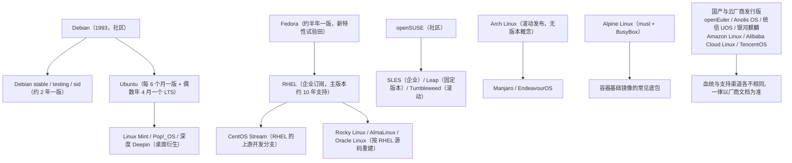

---
tags:
  - Linux
  - 实验环境
  - 发行版
  - 操作纪律
  - 运维面试
created: 2026-09-17
---

# 实验环境与操作纪律

> 本笔记对应 [[Linux/00_简介|Linux 大纲]] 的「阶段 1：实验环境与操作纪律」。目标：**先有一台能快照、能重建、能进控制台的实验机**，把版本基线固化下来；知道主流发行版的差别在哪、同一条命令为什么换个家族就不成立；并且形成「先取证、再动手、留回滚」的习惯——后面 11 个阶段的每一篇笔记都建立在它上面。
>
> 关联复习：[[02_启动流程与内核]]（救援入口、GRUB 与 emergency 的处置在这里第一次用到）、[[03_进程与信号]]（PID 1 的信号语义、容器里的 PID 1）、[[05_存储与文件系统]]（打满磁盘与 fstab 写错的深水区）、[[06_网络协议栈与排障]]（`ip`/`ss`/`nstat` 这条工具链的来源）。
>
> 说明：结论以 man 页（`os-release(5)`、`ld.so(8)`、`sysrq.rst`、`man(1)`）与各发行版官方文档为准。发行版的**生命周期与小版本号变化很快**，本文只给「节奏与血统」层面的量级，具体 EOL 与版本一律现场查；凡涉及实测的输出都标注了环境。

> [!info] 读之前：这篇笔记假设你已经具备三件事
> 1. **会基本的 Shell 操作**：`cd`/`ls`/`grep`/管道、用 `sudo` 提权、会看命令的退出码。
> 2. **有一台可以随便折腾的机器**（虚拟机/云主机），**不是**你正在用的办公机或生产机。第 4 节的实验 3~5 会故意把系统弄坏。
> 3. **知道 `man` 是什么**、用过 `top`/`ps`/`systemctl` 至少看过一次系统状态——本文会把这些命令「按现象归类」，但不从零讲每个参数。
>
> 环境提醒：本文的实测输出取自 **WSL2 上的 Ubuntu 24.04.4 LTS**（内核 `6.6.87.2-microsoft-standard-WSL2`，systemd 255，cgroup v2，24 vCPU，非 root 用户 `uid=1000`）。**WSL2 是共享微软内核的发行版环境**，它覆盖不了内核模块、`SysRq`、loop 挂载、独立控制台这类实验——所以文中的破坏性演练只给了实验机步骤，并标为未实测，详见文末「验证进度」。

## 0. 30 秒速览

> [!abstract] 这一页只要记住六句话
> 首学读不懂很正常：先跳过这一节，读完第 1、3 节再回来逐条验证——每一条都是「结论 + 一句可复现的证据」。
> - **实验机的最低要求不是「有 root」，而是「能快照 + 能进控制台」**。快照给你回滚，控制台给的是「网络/`fstab` 被你弄坏之后唯一还能进去的路」——只管快照、不留控制台，演练一次就可能把机器变成砖。
> - **版本基线先于一切**：`cat /etc/os-release`（发行版）、`uname -r`（内核）、`systemctl --version`（systemd）、`stat -fc %T /sys/fs/cgroup`（`cgroup2fs` 即 v2）。实测本机：Ubuntu 24.04.4 LTS / 6.6.87.2-microsoft-standard-WSL2 / systemd 255 / `cgroup2fs`。**没有这四项，后面所有「默认值」都没有意义。**
> - **发行版差异先于命令记忆**：RHEL 系是 `dnf` + `firewalld` + SELinux + XFS，Debian/Ubuntu 是 `apt` + `ufw` + AppArmor + ext4（实测本机 Ubuntu 的 `ufw`/`aa-status` 才有效）；**同一条「关闭防火墙」的命令在另一个家族里根本不存在**。
> - **内核版本号不能跨发行版直接比大小**：RHEL 9 的基线内核是 5.14、Ubuntu 22.04 是 5.15、Ubuntu 24.04 是 6.8、Debian 12 是 6.1，但 RHEL 会把新特性**回移（backport）**进它的 5.14——「你的内核怎么这么老」不是有效判断，要查具体特性。
> - **纪律只有三句话**：变更前三件事（**带时间戳的备份、明确的回滚命令、确认时间窗**）、现象发生时**先同时刻取证**（`top`/`vmstat`/`iostat`/`ss`/`journalctl -k` 各取一份）、**重启会毁掉现场**。
> - **`error while loading shared libraries` 是四步**：缺哪个（`ldd`）→ 装没装（`rpm -qf`/`dpkg -S`）→ 搜索路径对不对（`/etc/ld.so.conf.d/`、`LD_LIBRARY_PATH`）→ `ldconfig` 刷新缓存后复验。实测本机：删掉自建库的搜索路径后程序报 `libhello.so: cannot open shared object file`，退出码 **127**，补上路径即恢复。

> [!tip] 怎么用这篇笔记：分三遍读
> 全篇按难度分了两层：标 **【核心】** 的属于阶段 1 必须掌握；标 **【进阶】** 的（1.7 动态链接库）第一遍知道有这条路即可，等真遇到「命令跑不起来」再回来查。
> - **第一遍（约半天，把机器和台账准备好）**：第 0 节 → 1.1 实验机 → 1.2 版本基线 → 1.3 工具箱 → 实验 1。做完这一遍，你手里应该有一台能快照的机器，和一份写进笔记首页的基线表。
> - **第二遍（约一天，把「发行版差异」吃透）**：1.4 主流发行版对比 → 1.5 差异四件套 → 1.6 `man` → 1.8 操作纪律 → 2.1~2.3 → 3.1、3.2 → 实验 2。这一遍的目标是：拿到任何一条命令，都能先判断「它属于哪个家族、在这台机器上成不成立」。
> - **第三遍（半天，破坏性演练）**：1.7 动态链接库 → 1.9 演练清单 → 1.10 PID 1 → 3.3、3.4 → 实验 3、4、5。**只在实验机、先打快照、并确认控制台可用**的前提下做。
> 面试前只看第 0 节与第 5 节的问答卡。

## 1. 概念

> [!info]- 名词速查（读到哪里卡住，就回这里查）
> | 名词 | 一句话解释 | 在哪一节展开 |
> | --- | --- | --- |
> | 快照（snapshot） | 磁盘在某时刻的副本，用来回滚；**不是备份**，也不包含时间与外部状态 | 1.1、3.4 |
> | 控制台 / 带外管理 | 不经过操作系统的访问通道（VNC、串口、IPMI、云控制台） | 1.1 |
> | 版本基线 | 发行版/内核/systemd/cgroup 四项环境快照，所有结论的前提 | 1.2、2.1 |
> | 发行版家族 | 共享包管理、安全栈与发布节奏的一支（RHEL 系 / Debian 系 / SUSE / Alpine…） | 1.4 |
> | 上游 / 下游 | 谁基于谁开发（Fedora → RHEL → Rocky/Alma）；决定「谁先有新特性」 | 1.4 |
> | EOL / LTS | 停止维护的日期 / 长期支持版本；生产选型的硬门槛 | 1.4 |
> | backport（回移） | 把新内核的功能移植进老版本内核；RHEL 的看家做法 | 1.4 |
> | 包管理器 | `dnf`/`apt`/`zypper`/`pacman`/`apk`，各自有包格式与仓库配置 | 1.5 |
> | 强制访问控制（MAC） | SELinux / AppArmor：在内核层约束进程能碰哪些资源 | 1.5 |
> | `ld.so` / `ld.so.cache` | 动态链接器 / 它缓存库路径的索引；`ldconfig` 负责刷新 | 1.7 |
> | SONAME | 库的「接口版本名」（如 `libfoo.so.1`），决定二进制找哪个库 | 1.7 |
> | `LD_LIBRARY_PATH` | 临时追加库搜索路径的环境变量，**只影响当前进程树** | 1.7、3.2 |
> | glibc / musl | 两套不同的 C 库实现；Alpine 用 musl，glibc 二进制直接跑不起来 | 1.4、1.7 |
> | PID 1 | 第一个用户态进程；内核为它屏蔽了信号的默认动作 | 1.10 |
> | SysRq | 内核的应急按键接口，可触发落盘、只读重挂、重启甚至崩溃 | 1.9 |
> | 取证（forensics） | 现象发生时**先固定证据**再动手；重启会清掉大部分证据 | 1.8、3.3 |

### 1.1 实验机怎么来：快照、控制台与重建【核心】

阶段 1 的产物是一台**敢弄坏**的机器。选型不看性能，看三件事：

| 能力 | 为什么必须有 | 没有会怎样 |
| --- | --- | --- |
| **快照 / 快速重建** | 演练前打一份，弄坏了直接回滚 | 每次演练都要重装系统，最后你会放弃演练 |
| **控制台（带外/VNC/串口）** | 网络配置、`fstab`、`/etc/passwd` 写坏之后，SSH 已经进不去了 | 只能重装——「演练」变成「事故」 |
| **与生产隔离** | 演练会打满磁盘、触发 panic、伪造报文 | 影响真实业务；这是纪律问题，不是技术问题 |

四种常见做法的边界（**这是选实验机时最容易想当然的地方**）：

| 方案 | 快照 | 独立控制台 | 改内核/模块、SysRq | loop 挂载、LVM | 能覆盖的演练 |
| --- | --- | --- | --- | --- | --- |
| 本地虚拟化（KVM/libvirt、VirtualBox、VMware、UTM） | ✅ | ✅ | ✅ | ✅ | **全部**，推荐 |
| 云主机（ECS/EC2 等） | ✅（云盘快照） | ✅（要**先确认**控制台/VNC 已开通） | ✅（受虚拟化平台限制） | ✅ | 全部；注意安全组别把自己锁在外面 |
| WSL2 | ⚠️ 需手工导出/导入 tar | ❌（只有终端窗口） | ❌（内核是微软定制的） | ❌（多为受限） | 只覆盖「基线 / 工具箱 / 库 / 命令差异」 |
| 容器 | ❌（靠镜像重建） | ❌ | ❌（共享宿主内核） | ❌ | 只能练命令与配置语法 |

> 本文的实测环境就是上表第三行的 WSL2——**它足够练 1.2、1.3、1.7 与全部只读命令，但覆盖不了 1.9 的破坏性演练**。这不是缺陷，是选型时要提前知道的边界。

三条快照纪律：

1. **动手前打快照，并写下快照名与时间**（回滚时不用猜哪一份是干净的）。
2. **快照不是备份**：它保护的是磁盘，不是「你删掉的文件在另一台机器上的副本」，也没有覆盖「演练之后你忘了回滚，第二天又拿它做别的事」。
3. **演练前用控制台登录一次**——确认你能进去，比快照本身更重要。

> 对应实验：第 4 节**实验 3、4、5** 都依赖「有快照 + 有控制台」，动手前先按本节确认一遍。

### 1.2 版本基线：先知道自己在哪台机器上【核心】

登录一台机器（或换了一台实验机）的第一件事不是敲业务命令，而是**固化四项基线**。实测本机输出：

```text
cat /etc/os-release | head -3      # 验证：发行版与版本（PRETTY_NAME 一行就够写台账）
PRETTY_NAME="Ubuntu 24.04.4 LTS"
VERSION_ID="24.04"
VERSION_CODENAME=noble

uname -r                           # 验证：内核版本（决定有哪些特性、参数在哪里）
6.6.87.2-microsoft-standard-WSL2

systemctl --version | head -1      # 验证：systemd 版本（决定 unit 语法与可用指令）
systemd 255 (255.4-1ubuntu8.17)

stat -fc %T /sys/fs/cgroup         # 验证：cgroup 版本（cgroup2fs = v2，其他输出 = v1）
cgroup2fs
```

再补上「机器长什么样」的一组，一起写进台账：

```text
nproc; grep MemTotal /proc/meminfo; df -hT / | tail -1
                                   # 验证：核数、内存总量、根文件系统类型与可用空间
24
MemTotal:       16224400 kB
/dev/sdd       ext4 1007G   17G  940G   2% /

timedatectl | head -3              # 验证：时间与时区（排障对齐时间线的前提）
Local time: Thu 2026-09-17 20:54:21 CST
Universal time: Thu 2026-09-17 12:54:21 UTC
RTC time: Thu 2026-09-17 12:54:21

cat /proc/cmdline                  # 验证：内核启动参数（排查「为什么这个参数没生效」的第一现场）
initrd=\initrd.img WSL_ROOT_INIT=1 panic=-1 nr_cpus=24 ... WSL_ENABLE_CRASH_DUMP=1
```

几个必须记住的边界：

- **四项基线是「跨机器可比较」的最小集合**：同一个 `vm.swappiness` 在 RHEL 9 与 Ubuntu 24.04 上的默认值可能不同，不写清基线，笔记里的数字半年后就没法复用（这也是 [[04_内存管理与OOM]] 与 [[05_存储与文件系统]] 反复强调「默认值一律查本机」的原因）。
- **`/proc/cmdline` 与运行时参数是两套东西**：前者只在启动时生效，后者用 `sysctl` 管；改法完全不同（详见 [[02_启动流程与内核]]）。
- **`stat -fc %T /sys/fs/cgroup` 是判 cgroup 版本的唯一可靠方法**：不要靠发行版猜。v2 与 v1 的路径、控制器、可用参数都不同，cgroup 相关的所有结论都得先过这一关（v2 的系统上找不到 `/sys/fs/cgroup/memory/` 是正常的）。
- **WSL2/云主机的内核版本不代表物理机**：本机内核带 `microsoft-standard-WSL2` 后缀，说明是虚拟化平台定制内核；`uname -r` 一样要记，但别拿它去推断物理服务器的行为。

> 对应实验：第 4 节**实验 1**（把这一组命令固化成一个 baseline 脚本，输出直接贴进笔记/台账）。

### 1.3 诊断工具箱：按「现象 → 工具」装，而不是按字母背【核心】

工具不在多，而在「现象出现时你能想起哪一个」。先按现象归类，再按发行版装：

| 现象 | 首选工具 | 深挖/补充 | 包（RHEL 系 / Debian 系） |
| --- | --- | --- | --- |
| 负载高、CPU 打满 | `uptime`、`top`、`mpstat -P ALL`、`pidstat -u` | `perf top`、`/proc/pressure/cpu` | `sysstat` / `sysstat` |
| 内存水位、swap 抖动 | `free -h`、`vmstat 1`、`sar -r` | `/proc/pressure/memory`、`smaps_rollup` | `procps-ng`、`sysstat` / 同 |
| 磁盘满、inode 满 | `df -hT`、`df -i`、`du -xh --max-depth=1` | `lsof +L1`、`tune2fs -l` | `coreutils`、`lsof` / 同 |
| IO 慢、延迟高 | `iostat -x 1`、`pidstat -d` | `iotop -oPa`、`blktrace`/`bpftrace` | `sysstat`、`iotop` / 同 |
| 连接堆积、丢包 | `ss -s`、`ss -lntp`、`nstat -az` | `tcpdump -w`、`conntrack -S` | `iproute2`、`tcpdump`、`conntrack-tools` / 同 |
| 路由与二层 | `ip -br addr`、`ip route get`、`ip neigh` | `ethtool -S/-i/-g` | `iproute2`、`ethtool` / 同 |
| 进程卡死、杀不掉 | `ps -o pid,stat,wchan`、`strace -p` | `/proc/<pid>/stack`、`gdb` | `procps-ng`、`strace` / 同 |
| 句柄/文件事件耗尽 | `lsof -p`、`/proc/<pid>/limits` | `sysctl fs.file-max`、`inotify` 上限 | `lsof` / `lsof` |
| 内核与硬件报错 | `dmesg -T`、`journalctl -k` | `smartctl -a`、`nvme smart-log` | `util-linux`、`smartmontools`、`nvme-cli` / 同 |
| 命令/库跑不起来 | `ldd`、`readelf -d`、`ldconfig -p` | `LD_DEBUG=libs`、`strace -e trace=openat` | `glibc`、`binutils` / 同 |
| 性能基线 | `stress-ng`、`fio`、`iperf3` | `sar` 历史数据 | 各自单独打包 / 同 |

安装命令按家族来（**别跨家族抄**）：

```text
# RHEL 系（RHEL/CentOS Stream/Rocky/Alma）
dnf install -y sysstat iotop lsof strace tcpdump perf bpftrace numactl smartmontools iperf3 stress-ng
# Debian 系（Debian/Ubuntu）
apt update && apt install -y sysstat iotop lsof strace tcpdump linux-tools-common linux-tools-$(uname -r) numactl smartmontools iperf3 stress-ng
# SUSE 系
zypper install -y sysstat iotop lsof strace tcpdump perf numactl smartmontools iperf3
```

实测「刚装好的系统缺什么」（本机 WSL2 Ubuntu，未做任何补装）：

```text
for t in sar iostat pidstat vmstat top htop lsof strace tcpdump perf bpftrace iftop numactl smartctl iperf3 stress-ng openssl nc ss nstat ethtool ip python3; do
    p=$(command -v "$t" 2>/dev/null); [ -n "$p" ] && echo "OK       $t -> $p" || echo "MISSING  $t"
done
# 验证：一份「最小可用工具箱」的体检结果（缺的按上表补装）
OK       vmstat -> /usr/bin/vmstat
OK       top -> /usr/bin/top
OK       lsof -> /usr/bin/lsof
MISSING  sar                 # ← 来自 sysstat：不装就没有历史数据与 iostat/pidstat
MISSING  iostat
MISSING  pidstat
MISSING  htop                # ← 可选，但有比没有好读
MISSING  strace
MISSING  tcpdump
MISSING  perf
MISSING  bpftrace
MISSING  iftop
MISSING  numactl
MISSING  smartctl
MISSING  iperf3
MISSING  stress-ng
OK       openssl -> /usr/bin/openssl
OK       nc -> /usr/bin/nc
OK       ss -> /usr/bin/ss
OK       nstat -> /usr/bin/nstat
OK       ethtool -> /usr/sbin/ethtool
OK       ip -> /usr/sbin/ip
OK       python3 -> /usr/bin/python3
```

三个必须记住的边界：

- **`sysstat` 是「历史」的唯一来源**：`sar` 能回答「昨天 3 点发生了什么」，`top` 只能回答「现在」。**先把 `/etc/sysstat/sysstat`（Debian 系）或 `/etc/sysconfig/sysstat`（RHEL 系）里的采样开关确认打开**，否则 `sar` 只有当天数据。
- **`perf`/`bpftrace` 与内核版本强绑定**：Debian 系要装与 `uname -r` 匹配的 `linux-tools-*`，否则报 `perf not found for kernel ...`——**WSL2 与自编译内核通常没有对应的包**；RHEL 系上 `bpftrace` 在 RHEL 8 需要 EPEL、RHEL 9 才进官方仓库；容器里通常没权限调 BPF。
- **工具的输出字段本身也随版本变**：`iostat` 的 `aqu-sz` 在旧版本里叫 `avgqu-sz`，`ss` 的列在不同 iproute2 版本略有差异——**记基线时把工具版本一起记**（`sysstat -V`、`ss -V`）。

> 对应实验：第 4 节**实验 1**（体检 + 补装 + 记录版本）。

### 1.4 主流发行版对比：血统、节奏与选型【核心】

后面的每一个阶段，命令都隐含一个前提——**「在哪种发行版上」**。同一个需求（装包、开端口、配 IP、放开某个目录），五个家族的入口各不相同；面试里「RHEL 和 Ubuntu 有什么差别」也是高频题。这一节把血统讲清，下一节给差异对照表。

**一、血统图：谁从谁派生**



读这张图的三个要点：

1. **血缘决定「谁会先拿到新特性」**：Fedora 先试，RHEL 才收；CentOS Stream 是 RHEL 的上游，而 Rocky/Alma 是 RHEL 的**下游重建**——所以 Stream 比 Rocky 早、Rocky 与 RHEL 高度同步但补丁会晚几天。
2. **CentOS Linux 这条老路的终结**：CentOS Linux 8 在 2021 年底停止维护、CentOS Linux 7 在 2024 年 6 月 EOL，官方把重心转到 CentOS Stream。**这就是这几年「CentOS 迁移」话题的来源**，常见去向是 Rocky Linux、AlmaLinux、Oracle Linux 或直接买 RHEL 订阅。
3. **「国产发行版」不等于一个技术家族**：它们有的源自 RHEL/openEuler 体系、有的源自 Debian 体系，生命周期与补丁渠道由厂商定义。**在这些系统上做事，第一原则是查厂商文档，而不是套用 Ubuntu 的经验。**

**二、横向对比**

| 家族 | 代表发行版 | 包管理（工具/格式） | 发布节奏 | 支持周期（量级，以官方生命周期页为准） | 默认防火墙 | 强制访问控制 | 默认文件系统 | 典型场景 |
| --- | --- | --- | --- | --- | --- | --- | --- | --- |
| **RHEL 系** | RHEL、CentOS Stream、Rocky、AlmaLinux、Oracle Linux | `dnf`（RPM） | 主版本约 3 年一版，小版本约半年 | RHEL 主版本 **10 年**（分阶段）；重建版跟随 RHEL | `firewalld` | **SELinux** | XFS（RHEL 7 起） | 金融、政企、运营商；企业运维面试的主场 |
| **Debian 系** | Debian、Ubuntu | `apt`（DEB） | Debian 约 2 年一版；Ubuntu 每 6 个月一版 + 每两年一个 LTS | Debian stable 约 3 年，加上 LTS 至 **5 年**；Ubuntu LTS **5 年**（ESM/Pro 可延长） | Ubuntu 默认 `ufw`；Debian 最小安装无规则 | Ubuntu 默认 **AppArmor** | Ubuntu 默认 ext4 | 互联网、云原生、AI 基础设施、开发环境 |
| **SUSE 系** | SLES、openSUSE Leap/Tumbleweed | `zypper`（RPM） | Leap 约 1 年一版；Tumbleweed 滚动 | SLES 主版本 **10 年以上**（按 Service Pack 推进） | `firewalld`（老的 SuSEfirewall2 已废弃） | AppArmor（默认启用） | btrfs（配合 snapper 快照） | SAP、欧洲企业、制造业 |
| **独立（滚动）** | Arch Linux、Manjaro | `pacman`（自有格式） | 滚动发布，**没有「版本」概念** | 无固定周期，靠使用者自行维护 | 需自行安装配置 | 可选 AppArmor/SELinux | 自选 | 个人桌面、学习与尝鲜；**不建议直接上生产** |
| **容器/精简** | Alpine Linux | `apk` | 约半年一个稳定分支 | 每个稳定分支约 2 年（社区） | 无前端，直接用 nftables/iptables | 默认不启用 | 自选 | 容器基础镜像、嵌入式；注意 **musl** 与 BusyBox |
| **云厂商** | Amazon Linux 2023、Alibaba Cloud Linux、TencentOS Server | 多为 `dnf`/`yum`（RPM） | 由厂商定义 | 由厂商定义（多数量级为 3~5 年） | 视镜像而定 | 视镜像而定 | 多为 ext4/XFS | 云上默认镜像、国产化替代场景 |

> [!warning] 表里的「支持周期」是量级，不是承诺
> 具体 EOL 必须查官方生命周期页（RHEL/Alma/Rocky 各有 lifecycle 表，Ubuntu 有 ESM 矩阵，Debian 有 LTS 页面）。**本文不写死当前小版本号**——写笔记的时点（2026-09）主线仍在 RHEL 9、Ubuntu 24.04 LTS、Debian 12 这一代，但半年后就会变。**任何要落进文档的版本号，都用 `cat /etc/os-release` 现场取。**

**三、四个最容易踩的「发行版差异」**

1. **内核版本号不能直接比大小**：RHEL 9 的基线内核是 **5.14**、Ubuntu 22.04 是 **5.15**、Ubuntu 24.04 是 **6.8**、Debian 12 是 **6.1**。但 RHEL 的做法是**把新特性回移（backport）进老内核**——所以「RHEL 内核版本低 = 功能少」是错的判断。要确认某个特性在不在，只能查该发行版的 release notes，或直接在本机试（这也是 [[04_内存管理与OOM]]、[[05_存储与文件系统]]、[[06_网络协议栈与排障]] 三篇都要求「实测 + 标注环境」的根本原因）。
2. **同一个软件，包名不同**：`bind-utils`（RHEL）vs `dnsutils`（Debian）、`httpd` vs `apache2`、`firewalld` vs `ufw`、`nftables` vs `iptables-persistent`。**判断「这个命令属于哪个包」，用 `rpm -qf $(command -v <cmd>)` 或 `dpkg -S $(command -v <cmd>)`**，而不是去猜包名。
3. **服务名与配置目录不同**：同为 systemd，RHEL 的 `/etc/sysconfig/` 对应 Debian 的 `/etc/default/`；`httpd.service` 对 `apache2.service`、`sshd.service` 在两边一致但 `chronyd` 对 `chrony`。**在 RHEL 上找 `/etc/default/`、在 Debian 上找 `/etc/sysconfig/`，是典型的「抄错发行版」。**
4. **强制访问控制不是同一套东西**：SELinux 看 `getenforce`/`sestatus`/`ausearch -m AVC`，AppArmor 看 `aa-status`/`journalctl -k | grep -i apparmor`——模型、工具、排错入口都不同，**不要把一个的经验套到另一个上**。更不要把 `setenforce 0` 当成修复手段（见 2.3）。

**四、实验机怎么选**

- **按目标岗位对齐**：企业/金融/政企方向 → RHEL 系（用 Rocky 或 AlmaLinux 免订阅做实验机）；互联网/SRE/云原生方向 → Ubuntu LTS 或 Debian。
- **建议至少两台**：一台 Ubuntu LTS（文档多、生态全，作为主实验机）+ 一台 Rocky/AlmaLinux（练 `dnf`、`firewalld`、SELinux、XFS）。本文的实测环境只有 Ubuntu，涉及 RHEL 系的部分以官方文档为准。
- **不要用滚动发行版当唯一实验机**：Arch/Tumbleweed 适合了解「上游在发生什么」，但你的笔记需要可复现，而滚动发行版的包版本每周都在变。

> 面试答法：被问「RHEL 和 Ubuntu 有什么差别」，按 **血统与支持周期 → 包管理 → 安全与网络默认栈 → 现场怎么查** 四步讲，最后补一句「具体以 `cat /etc/os-release` 和厂商文档为准」。给方法比背参数表更像做过事的人。

### 1.5 发行版差异四件套：包管理 / 防火墙 / 网络 / 访问控制【核心】

上面是「选型视角」，这一节是「手里的命令视角」。**四件事，五个家族，各查各的**：

| 事情 | RHEL 系 | Debian / Ubuntu | SUSE | Alpine | 查本机现状 |
| --- | --- | --- | --- | --- | --- |
| 装/查/卸包 | `dnf install`、`dnf provides`、`dnf info` | `apt install`、`apt search`、`apt policy` | `zypper install`、`zypper search -f` | `apk add`、`apk info -L` | `command -v <cmd>` + `rpm -qf`/`dpkg -S` |
| 仓库配置 | `/etc/yum.repos.d/*.repo`；`dnf config-manager --add-repo` | `/etc/apt/sources.list`、`/etc/apt/sources.list.d/`；`add-apt-repository` | `/etc/zypp/repos.d/*.repo` | `/etc/apk/repositories` | `dnf repolist -v` / `apt policy` / `zypper lr -u` |
| 防火墙 | `firewalld`：`firewall-cmd --state`、`--add-port=80/tcp --permanent` | Ubuntu：`ufw status verbose`；Debian 最小安装默认无规则 | `firewalld`（`SuSEfirewall2` 已废弃） | 无前端，`nft list ruleset` | `firewall-cmd --state` / `ufw status` / `nft list ruleset` |
| 网络配置 | NetworkManager（`nmcli`/`nmtui`）；**RHEL 9 起不再默认安装 `network-scripts`** | Ubuntu Server：netplan（`/etc/netplan/*.yaml`，后端 systemd-networkd 或 NM）；Debian 传统 `/etc/network/interfaces` | `wicked` 或 NetworkManager | `/etc/network/interfaces`（BusyBox 风格） | `nmcli device status`、`networkctl status`、`cat /etc/netplan/*.yaml` |
| 强制访问控制 | SELinux：`getenforce`、`sestatus`、`ausearch -m AVC -ts recent`、`restorecon -Rv` | AppArmor：`aa-status`、`aa-enabled`、`journalctl -k \| grep -i apparmor` | AppArmor（默认启用） | 默认不启用 | `getenforce` / `aa-status` |
| cgroup 版本 | RHEL 8 默认 v1（可切 v2）、**RHEL 9 默认 v2** | **Ubuntu 22.04+ 默认 v2** | 以实测为准 | 以实测为准 | `stat -fc %T /sys/fs/cgroup` |

四条纪律：

- **跨家族抄命令前，先 `command -v`**：命令不存在时不要怀疑权限，先确认它在不在。RHEL 上敲 `ufw`、Ubuntu 上敲 `firewall-cmd`，得到的都是「没这条命令」。
- **只读查询命令通常可以跨家族复用，写操作几乎都要换**：`ss`/`nstat`/`ip`/`df`/`vmstat` 两边一致；而「开端口、改 IP、装包、重启服务」的入口几乎都不一样。
- **`nftables` 是底层，前端才是差异**：Ubuntu 的 `ufw` 与 RHEL 的 `firewalld` 最终都落到 nftables（老系统上是 iptables）。所以**「规则到底有没有生效」要看 `nft list ruleset`，而不是只看前端状态**。
- **文档要配套**：查 Ubuntu 的行为看 Ubuntu Server Guide 与 man 页，查 RHEL 的看 RHEL 文档——同一个参数在两个家族里的默认值经常不同，混着看必然出错。

### 1.6 第一手资料：`man` 与 `/usr/share/doc`【核心】

遇到没见过的参数或配置文件，**先查本机手册**，比搜索引擎快，而且版本一定对得上。`man` 的章节编号不是装饰，它告诉你这份文档在讲什么层面：

| 章节 | 内容 | 实测本机路径 |
| --- | --- | --- |
| `man 1` | 用户命令（`ls`、`systemctl`） | `/usr/share/man/man1/ls.1.gz` |
| `man 2` | 系统调用（`mount`、`open`） | `/usr/share/man/man2/mount.2.gz` |
| `man 3` | 库函数（`printf`、`malloc`） | `/usr/share/man/man3/printf.3.gz` |
| `man 5` | **配置文件格式**（`fstab`、`nsswitch.conf`、`proc`） | `/usr/share/man/man5/fstab.5.gz` |
| `man 7` | 概览与概念（`tcp`、`signal`、`cgroups`） | `/usr/share/man/man7/tcp.7.gz` |
| `man 8` | 管理命令（`ip-netns`、`xfs_repair`） | `/usr/share/man/man8/ip-netns.8.gz` |

```text
man -w 5 fstab                     # 验证：这份 man 页在哪个文件（-w 只打印路径，不开分页器）
man -k passwd                      # 验证：按关键字搜索所有章节（等价 apropos，输出里括号内是章节号）
man -a printf                      # 验证：同名页存在于多个章节时，按顺序看完所有章节
man 5 nsswitch.conf                # 验证：查配置文件格式（这类问题先看第 5 章）
```

几条实践经验：

- **`--help` 与 man 页的分工**：`--help` 看参数速查，man 页看语义、默认值与「文件/环境变量/退出码」等小节——**面试里能答出的细节基本都在 man 页的后几节**。
- **`man` 会找不到页，这不是 bug**：实测本机 `man -w 8 systemctl` 返回 `No manual entry for systemctl in section 8`，因为 systemctl 在**第 1 章**（用户命令）。**同一个主题在不同发行版可能落在不同章节，先不指定章节查一次**。
- **`/usr/share/doc/<包名>/` 里常有 upstream 文档**：`README`、`NEWS`、`examples/`；配置文件里提到的「参见官方文档」通常就在这里。
- **man 页与发行版文档冲突时，以发行版文档 + 本机实测为准**：man 页来自软件上游，发行版会改默认值（`tuned`、`sysctl.d`、编译开关），[[04_内存管理与OOM]] 与 [[06_网络协议栈与排障]] 里的参数就属于这一类。

### 1.7 动态链接库：`error while loading shared libraries`【进阶】

这类报错的完整形态是：

```text
./app: error while loading shared libraries: libhello.so: cannot open shared object file: No such file or directory
```

它的意思是：**程序本身被内核加载了，但动态链接器（`ld.so`）找不到它依赖的某个 `.so`**。所以排查的不是「程序坏了」，而是「库在哪、链接器有没有看到它」。

程序依赖哪些库，由编译时写进 ELF 的 `NEEDED` 段决定；运行时由 `ld.so` 按固定顺序搜索（`ld.so(8)`）：

1. ELF 里的 `DT_RPATH`（老式硬编码路径，已被 `RUNPATH` 取代）
2. 环境变量 **`LD_LIBRARY_PATH`**
3. ELF 里的 `DT_RUNPATH`
4. **`/etc/ld.so.cache`**（由 `/etc/ld.so.conf` 与 `/etc/ld.so.conf.d/*.conf` 生成）
5. 默认目录：`/lib`、`/usr/lib` 及各自的 `x86_64-linux-gnu` 子目录等

```text
readelf -d ./app | grep NEEDED     # 验证：这个二进制依赖哪些库（SONAME 列表）
ldd ./app                          # 验证：依赖实际解析到了哪些路径；not found 就是缺的
ldconfig -p | grep libhello        # 验证：链接器缓存里有没有这个库（本地自建的库通常没有）
LD_DEBUG=libs ./app 2>&1 | head -20
                                   # 验证：打印链接器的搜索过程（会看到它逐个目录 trying file=...）
```

**标准处理顺序（四步，不要跳步）**：

| 步骤 | 目的 | 命令 |
| --- | --- | --- |
| ① 确认缺哪个库 | 拿到缺失的 SONAME | `ldd <程序>` / `readelf -d <程序>` |
| ② 确认装没装、装在哪 | 区分「没装」与「装了但找不到」 | `rpm -qf <路径>`、`dpkg -S <路径>`、`find / -name '库名*' -print`（**慎用 `find /`**，优先用 `ldconfig -p`） |
| ③ 修路径或补装 | 装了没找到 → 补搜索路径；没装 → 装包 | 装包：`dnf install <pkg>` / `apt install <pkg>`；补路径：写 `/etc/ld.so.conf.d/xx.conf` 或临时 `LD_LIBRARY_PATH=` |
| ④ 刷新缓存并复验 | 让 `ld.so` 看见新路径 | `ldconfig`（需 root）→ 再跑一次 `ldd` 与程序本身 |

几条必须记住的边界：

- **`LD_LIBRARY_PATH` 只影响当前进程树**：它不进 `ld.so.cache`，换个终端就没了。**生产上不要用它当修复手段**——那会让「为什么这台机器能跑」变成一个没人记得住的隐性条件；正确做法是补 `/etc/ld.so.conf.d/` 并 `ldconfig`。
- **`ldconfig` 需要 root，并且会重建整个缓存**：改完配置要执行它；执行后 `ldconfig -p | grep <库>` 应该能看到路径。
- **`ldd` 对不可信二进制有风险**：老版本 `ldd` 会通过设置 `LD_TRACE_LOADED_OBJECTS` 让程序自己「跑一遍」，**对来源不明的二进制不要直接 `ldd`**（新版已是安全的 ELF 解析，但习惯要保留）。更安全的是 `readelf -d`。
- **`not found` 也可能是「架构/发行版不对」**：32/64 位混装、或者把 glibc 编译的二进制丢进 Alpine（musl）容器里，都会报找不到库——后者的典型现象是连 `/lib64/ld-linux-x86-64.so.2` 都没有。这是 1.4 里 Alpine 那一行的直接后果。
- **`glibc-hwcaps` 子目录会被优先搜索**：实测 `LD_DEBUG=libs` 输出里，链接器先试了 `/tmp/lab-lib/glibc-hwcaps/x86-64-v3/libhello.so`、`.../x86-64-v2/...` 再试 `/tmp/lab-lib/libhello.so`。这是 glibc 2.33+ 的硬件能力分派机制——**看到陌生子目录别慌，它不是恶意代码**。

> 对应实验：第 4 节**实验 2**（亲手制造这个报错，再用两条路径分别修好）。

### 1.8 操作纪律：变更前三件事与取证纪律【核心】

**变更前三件事**（任何一台机器、任何一次手工改动都适用）：

1. **备份原文件，且带时间戳**：`cp -a /etc/fstab /etc/fstab.bak.$(date +%F-%H%M)`。用 `-a` 保住权限与属主；时间戳让你事后能说清「改的是哪一版」。
2. **确认回滚方式**：回滚命令要**先写下来**（写进变更单或聊天窗口），而不是「不行再改回来」。判断标准很简单：如果回滚需要你临时想，那就说明没准备好。
3. **确认时间窗与影响面**：这条改动会影响谁？要不要通知？有没有正在跑的业务？**生产上的手工改动都应排窗口**，哪怕只是加一条防火墙规则。

**取证纪律**：现象发生时，**先固定证据，再动手**。一次「同时刻快照」至少包含这些：

```text
date; uptime; hostname                                   # 验证：时间线与机器身份（先对齐时间）
vmstat 1 5; free -m; cat /proc/pressure/memory           # 验证：CPU/内存/压力水位
iostat -x 1 5; df -hT; df -i                             # 验证：IO 与容量、inode
ss -s; ss -lnt; nstat -az | head -40                     # 验证：连接与协议栈计数
ps -eo pid,ppid,stat,pcpu,pmem,wchan:20,cmd --sort=-pcpu | head -15
                                                         # 验证：谁在吃资源、卡在哪个内核函数
journalctl -k -n 50 --no-pager; dmesg -T | tail -30      # 验证：内核最近说了什么
```

为什么强调「同时刻」和「先取证」——因为**重启会毁掉大部分现场**：

| 证据 | 重启后 | 说明 |
| --- | --- | --- |
| 进程状态、`wchan`、句柄与连接 | **全没了** | 内存里的东西不落盘 |
| `nstat`/`/proc/vmstat` 等计数器 | **清零** | 只能靠外部监控（`sar`/Prometheus）回溯 |
| `temp`/`/tmp` 里的临时文件、socket、锁文件 | 多半消失 | 有些应用状态只在运行时存在 |
| 内核环形缓冲（`dmesg`） | **被清空**（除非持久化 journal） | 所以 `journalctl -k --no-pager > /tmp/kmsg.$(date +%s).log` 值得养成习惯 |
| 内存里的 core/`vmcore` | 取决于是否配置 | panic 场景见 [[02_启动流程与内核]] 的 kdump |

一句话纪律：**「重启能解决 90% 的问题，但会毁掉 100% 的现场」**——它适合当止损手段，不适合当排查手段。

### 1.9 破坏性演练清单【核心】

阶段 1 的 checklist 要求在实验机上主动做破坏性演练。**先确认本节标题下面这行字**：

> [!warning] 前置条件（缺一个都别开始）
> ① 这台机器**不是**生产机、也不是你唯一的机器；② 已打快照并记下快照名；③ **控制台/VNC/串口可用**（演练 `fstab`、网卡、`/etc/passwd` 时 SSH 会断）；④ 知道怎么从快照回滚。

| 演练 | 怎么弄坏（实验机上） | 典型现象 | 恢复路径 |
| --- | --- | --- | --- |
| **打满根分区** | 在独立分区上 `dd if=/dev/zero of=/mnt/lab/big bs=1M count=...`（**不要直接写根分区**，见实验 3 的 loop 做法） | `No space left on device`；日志/服务写失败；ext4 可能触发只读重挂 | 删大文件、`journalctl --vacuum-size=200M`、`truncate -s 0` 截断被进程持有的日志；必要时从单用户清理 |
| **写坏 `/etc/fstab`** | 把某个 UUID 改错一个字符，或去掉 `nofail` 后写一个不存在的设备 | 重启时进 `emergency mode`，`systemctl --failed` 有失败挂载 | `emergency.target` 里 `mount -o remount,rw /` → 修 fstab → `mount -a` 验证 → `systemctl default`（详见 [[02_启动流程与内核]]） |
| **down 掉网卡** | `ip link set <dev> down`（远程操作 = 断连） | SSH 断开，业务不可达 | 控制台里 `ip link set <dev> up`；NetworkManager 系统用 `nmcli con up <名称>`；远程操作前先用 `nohup` 或 `at` 定时恢复 |
| **改坏 `/etc/passwd`** | 把某个用户行的字段删一个（**用 `vipw` 而不是 `vi`**，它会加锁与做基本校验） | 登录失败、`su`/`sudo` 报错、`getent passwd` 异常 | rescue/单用户里用 `vipw`/`pwck` 修回；或从快照恢复 |
| **SysRq 触发 panic** | `sysctl -w kernel.sysrq=1` 后 `echo c > /proc/sysrq-trigger` | 立即内核 panic → 重启（配了 kdump 则落 `vmcore`） | 等重启，看 `journalctl -b -1` 与 `/var/crash`；**这是「内核崩溃取证」最便宜的练习方式** |

关于 **SysRq** 的两点补充：

- 它是内核的应急接口，**位掩码控制允许哪些功能**：常用安全位组合是 `176`（`16` sync + `32` remount-ro + `128` reboot，即「能落盘、能只读重挂、能重启」，但不触发进程转储与崩溃）。**生产上建议只开必要位，`1` 会连「触发 panic/强制重启」一起打开**；各位的确切含义以 `Documentation/admin-guide/sysrq.rst` 为准。
- **它救过很多人，也害过很多人**：数据库写入卡死时，`sync`（`s`）→ `remount-ro`（`u`）→ `reboot`（`b`）是经典的「安全重启」序列；但如果在错误的机器上敲了 `c`，就是一次不必要的宕机。

> 对应实验：第 4 节**实验 3、4、5** 分别对应上表的前三项与最后一项；**本文未在 WSL2 上实测这三项**（WSL2 没有独立控制台、内核也不受控），必须在自己的实验机上做。

### 1.10 一个反直觉点：PID 1 忽略 `SIGKILL`/`SIGSTOP`【核心】

`kill -9 1` 不会有任何效果——但「为什么没效果」要分两层看，把两层混在一起是常见的面试扣分点。

**第一层：普通用户根本没有向 PID 1 发信号的权限**。PID 1（init/systemd）是 root 进程，而给别的进程发信号要求发送者 euid 匹配或具备 `CAP_KILL`——所以非 root 用户拿到的是明确的 `EPERM`，不是「神秘的静默失败」。实测（本机 WSL2，`uid=1000`，PID 1 为 systemd）：

```text
ps -p 1 -o pid,comm,cmd              # 验证：PID 1 是谁（本机是 systemd）
    PID COMMAND         CMD
      1 systemd         /usr/lib/systemd/systemd --system --deserialize=95

kill -9 1                            # 验证：普通用户向 PID 1 发信号的结果
/bin/bash: line 1: kill: (1) - Operation not permitted

ps -p 1 -o pid,comm                  # 验证：PID 1 依然存活
      1 systemd
```

**第二层：就算有权限（root），内核也不会让它生效**。内核对 **PID 1** 有一条特殊规则：**凡是「默认动作是终止进程」的信号都不投递给它**（`SIGKILL`、`SIGSTOP` 也在其中，尽管它们不可捕获、不可忽略）。原因很直白：init 一死，就没人回收孤儿进程、没人接管服务与挂载了；内核宁可让 `kill` 静默成功，也不允许系统进入这种状态。所以 root 下的表现是「**命令返回成功，PID 1 依然活着**」。

> 这一层**本文未实测**（需要 root，而实测环境是非 root 用户），依据是内核信号处理规则与 `signal(7)`：对全局 init 的致命信号会被丢弃。要做实验的话，在**可快照的实验机**上用 root 跑一次 `kill -9 1`，再用 `ps -p 1` 确认它还在——顺便体会一下「返回成功 ≠ 生效」。

两条延伸：

- **容器里的 PID 1 是「子命名空间的 init」，同样受这套规则保护；但从宿主机看它只是一个普通进程**：所以「容器里的 1 号进程杀不掉」和「宿主机上杀掉容器的 1 号进程」是两件事——后者用宿主机看到的 PID 就能杀（见 [[03_进程与信号]] 的容器章节）。这也是为什么有些容器停不掉要靠 `docker rm -f` 或宿主侧 `kill`。
- **PID 1 还负责回收孤儿进程**：容器里如果让业务进程直接当 PID 1，它通常不会 `wait()` 那些被它「继承」的孤儿，于是出现僵尸堆积——这是「容器里该不该用 `tini`/`--init`」这类问题的根源（同样见 [[03_进程与信号]]）。

## 2. 生产实践

### 2.1 环境与版本基线（台账模板）

把这四张表填进每篇笔记或一份独立的台账里。**没有基线的机器上，「这台机器有没有问题」这个判断本身就不成立。**

| 项目 | 命令 | 实测示例（本文环境） |
| --- | --- | --- |
| 发行版 | `cat /etc/os-release` | Ubuntu 24.04.4 LTS（noble） |
| 内核 | `uname -r` | 6.6.87.2-microsoft-standard-WSL2 |
| 启动参数 | `cat /proc/cmdline` | `initrd=\initrd.img ... panic=-1 nr_cpus=24` |
| systemd | `systemctl --version` | systemd 255 |
| cgroup | `stat -fc %T /sys/fs/cgroup` | `cgroup2fs`（v2） |
| 资源 | `nproc`、`grep MemTotal /proc/meminfo` | 24 vCPU / 16224400 kB |
| 根文件系统 | `df -hT /`、`df -i /` | `/dev/sdd` ext4 1007G（用 2%） |
| 时间 | `timedatectl` | CST，与 UTC 相差 +8h |
| 工具版本 | `sysstat -V`、`ss -V`、`iostat -V` | 记下来，字段名随版本变 |

### 2.2 变更与回滚纪律

1. **备份、回滚、窗口**：见 1.8。生产上的手工改动一律三件套齐全再动手。
2. **能用配置管理就别手工**：Ansible/云初始化脚本的一次性改动比「记得改过什么」可靠；手工改动必须落到文档里。
3. **改动后立刻验证**：`mount -a`、`ss -lnt`、`systemctl status`、业务侧探活——**只做「改完不验证」这一步，等于把验证留给了下一个事故。**
4. **一次只改一件事**：和性能调参一样，同时改三处之后你不知道是哪一处起的作用（或闯的祸）。
5. **给实验机和生产机不同的 prompt/配色**：`PS1` 里带主机名与环境前缀，能显著降低「在生产机上练手」的概率——这是最便宜的一道保险。

### 2.3 常见坑

| 常见做法或说法 | 后果或事实 |
| --- | --- |
| 在办公机/生产机上做演练 | 阶段 1 的实验包含打满磁盘、改坏 `fstab`、触发 panic，**只能在实验机上做** |
| 只打快照、不留控制台 | 网络配置写错后 SSH 进不去，快照也救不了你——只能重装 |
| 把快照当备份 | 快照保护的是磁盘，不覆盖误删、跨机器、跨时间的需求；**重要数据要有独立备份** |
| 改了配置直接重启验证 | 重启会同时毁掉现场并放大故障；先 `mount -a`/`nginx -t`/`sshd -t` 这类「语法自检」 |
| 跨发行版照抄命令 | `ufw` 在 RHEL 上不存在、`firewall-cmd` 在 Ubuntu 上通常没装；先 `command -v` |
| 看到 `setenforce 0` 问题就消失 | SELinux 报警只说明策略拦了访问，**关掉它等于关掉审计**；正确做法是 `ausearch` 找出被拦的上下文再 `restorecon`/调策略 |
| 用 `LD_LIBRARY_PATH` 修「库找不到」 | 只对当前进程树生效，重启/换用户就失效；应写 `/etc/ld.so.conf.d/` + `ldconfig` |
| 把 `1` 当 `SysRq` 的安全值 | `kernel.sysrq=1` 会连触发 panic/强制重启一起打开；生产用位掩码（如 `176`）只开必要功能 |
| 认为「内核版本低就是功能旧」 | RHEL 会把新特性回移到 5.14 基线；判断特性要用发行版 release notes 或本机实测 |
| 装完 `sysstat` 就不管了 | 采样开关没打开时 `sar` 只有当天数据；要有「历史数据」必须先启用采集 |
| `man` 报找不到就以为没文档 | 同一个主题可能在第 1/5/8 章，先不指定章节查；也可能装在 `/usr/share/doc/<pkg>/` |
| 用 `vi` 直接改 `/etc/passwd` | 没有加锁与校验，容易改坏；用 `vipw`/`vigr`，改完 `pwck`/`grpck` 自检 |

## 3. 排障速查

### 3.1 `command not found`：是没装、PATH，还是发行版差异

> [!tip] 第一反应不要是「权限不够」
> `command not found` 与权限无关（权限不足会报 `Permission denied`）。先分清三种情况。

按顺序排除：

1. **是不是没装**：`command -v <cmd>`；确认没装后用家族对应的包管理器装（`dnf`/`apt`/`zypper`/`apk`）。
2. **是不是 PATH 里没有**：管理命令常在 `/usr/sbin`、`/sbin`，非 root 用户默认不查这些目录——`echo $PATH`、`ls -l /usr/sbin/<cmd>` 确认，必要时用绝对路径或 `sudo`。
3. **是不是发行版差异**：`ifconfig`/`netstat`（net-tools，现代发行版默认不装）→ `ip`/`ss`；`service` → `systemctl`；`ufw` ↔ `firewall-cmd`。**这一类的正解是换命令，不是装老工具。**
4. **是不是同名不同包**：`python`/`python3`、`node`/`nodejs`、`perf` 与 `linux-tools-*`——先确认「这个命令属于哪个包」，再装。

```text
command -v <cmd>; echo $PATH                        # 验证：命令是否存在、PATH 是否含 sbin
dpkg -S "$(command -v ss)"                          # 验证（Debian 系）：这个命令属于哪个包
rpm -qf "$(command -v ss)"                          # 验证（RHEL 系）：同上
dnf provides '*/iperf3'                             # 验证：哪个包提供这个文件（未安装时用这个）
apt-file search bin/iperf3                          # 验证（需先 apt install apt-file）
```

### 3.2 `error while loading shared libraries`：四步定位

> [!tip] 第一反应不要是「重装这个软件」
> 先确认到底是**库不存在**还是**库存在但找不到**——后者重装一百次也没用。

按顺序排除（原理见 1.7）：

1. **缺哪个库**：`ldd <程序>`（或 `readelf -d <程序> | grep NEEDED`），找到 `=> not found` 的那一行。
2. **库在不在机器上**：`ldconfig -p | grep <库名>`、`find /usr /lib /opt -name '<库名>*'`。
3. **在但没被搜索到**：把目录写进 `/etc/ld.so.conf.d/xx.conf` → `ldconfig` → 复验；临时验证可用 `LD_LIBRARY_PATH`。
4. **确实没装**：按包管理器装（`dnf install`/`apt install`）；**注意架构与 C 库实现**（Alpine 用 musl，glibc 二进制在那里跑不起来）。

```text
ldd ./app | grep 'not found'                        # 验证：缺失的 SONAME
readelf -d ./app | grep -E 'NEEDED|RUNPATH|RPATH'   # 验证：依赖列表与硬编码搜索路径
ldconfig -p | grep <库名>                           # 验证：链接器缓存里有没有它
LD_DEBUG=libs ./app 2>&1 | grep -i 'trying file' | head
                                                     # 验证：链接器到底试了哪些目录
ldconfig                                             # 验证：刷新缓存（需 root），之后复验 ldd
```

### 3.3 演练之后：四类「把自己关在门外」的恢复入口

> [!tip] 第一反应不要是「重装系统」
> 阶段 1 的五种破坏方式都有对应的救援路径——**前提是你按 1.1 准备了控制台**。

| 现象 | 入口 | 关键动作 |
| --- | --- | --- |
| SSH 不通，但控制台能进 | 控制台登录 | 先看网卡是否 `down`、再 `ip a` 与 `ip route`，恢复网络后再排查业务 |
| 重启后进 `emergency mode`（`fstab` 写坏） | 控制台 + `emergency.target` | `mount -o remount,rw /` → 注释/修正出错行 → `mount -a` 验证 → `systemctl default`（详见 [[02_启动流程与内核]]） |
| 登录报错、`su`/`sudo` 失败（`passwd` 改坏） | rescue/单用户，或从快照启动 | `vipw` 改回、`pwck` 校验；`/etc/shadow` 同理（`vipw -s`） |
| 系统起不来 / 文件系统坏了 | Live CD/USB 或云主机挂载恢复 | 挂载根分区到 `/mnt` 后改文件；文件系统的深水区见 [[05_存储与文件系统]] |

### 3.4 快照回滚之后：现象对不上是正常的

回滚磁盘 ≠ 回到过去。以下东西**不在快照里**，所以「回滚后现象变了」通常不是玄学：

| 不在快照里的东西 | 表现 | 处理 |
| --- | --- | --- |
| 时间与外部时钟状态 | 时间跳回、证书校验失败、日志时间线错乱 | 回滚后立刻 `timedatectl`/`chronyc sources` 校时 |
| 外部依赖的状态 | 数据库、消息队列、对端服务仍是「未来」的状态 | 把依赖一起回滚，或按顺序重建 |
| 机器身份与密钥 | SSH host key 变化、`machine-id` 重复（克隆场景） | 确认 host key 变化是你预期的；克隆模板要重置 `machine-id` |
| 快照之后产生的数据 | 回滚即丢失 | 回滚前先确认「这份数据能不能丢」 |

```text
timedatectl; chronyc sources -v      # 验证：回滚后时间是否正常、有没有对上游
hostnamectl; cat /etc/machine-id     # 验证：机器身份（克隆/回滚后是否重复）
systemctl --failed                   # 验证：回滚后有没有失败的单元
journalctl -b -1 | tail -50          # 验证：上一次启动（也就是回滚前那一次）的结尾发生了什么
```

## 4. 动手验证

> [!warning] 前置纪律
> 实验 1、2 是只读/自建目录，**任何 Linux 上都能做**（本文的实测就是在这台 WSL2 上跑的）；实验 3、4、5 是破坏性演练，**只在有快照与控制台的实验机上做，本文未实测**，每一步都先确认自己在哪台机器上。

### 实验 1：固化版本基线 + 工具箱体检

```text
# ① 四项基线 + 资源与时间（输出直接贴进台账）
cat /etc/os-release | head -3
uname -r
systemctl --version | head -1
stat -fc %T /sys/fs/cgroup
nproc; grep MemTotal /proc/meminfo; df -hT / | tail -1
timedatectl | head -3

# ② 工具箱体检：缺什么列出来
for t in sar iostat pidstat vmstat top htop lsof strace tcpdump perf bpftrace iftop numactl smartctl iperf3 stress-ng; do
    p=$(command -v "$t" 2>/dev/null); [ -n "$p" ] && echo "OK       $t -> $p" || echo "MISSING  $t"
done

# ③ 工具版本也要记（字段名随版本变化）
sysstat -V 2>/dev/null | head -2; ss -V; iostat -V 2>/dev/null | head -1
```

**实测输出**（本机 WSL2 Ubuntu 24.04.4 LTS，节选）：

```text
PRETTY_NAME="Ubuntu 24.04.4 LTS"
6.6.87.2-microsoft-standard-WSL2
systemd 255 (255.4-1ubuntu8.17)
cgroup2fs
24
MemTotal:       16224400 kB
/dev/sdd       ext4 1007G   17G  940G   2% /
Local time: Thu 2026-09-17 20:54:21 CST
...
MISSING  sar / iostat / pidstat / htop / strace / tcpdump / perf / bpftrace / iftop / numactl / smartctl / iperf3 / stress-ng
```

**结论**：一台「看起来能用」的 Ubuntu 上，**排障工具箱默认几乎全是缺的**（本机缺 13 个）。阶段 2 之后用到的 `iostat`/`sar`/`tcpdump`/`perf` 都要先补装。
环境：任意发行版；补装命令见 1.3。
回滚：无（只读命令与一次体检）。

### 实验 2：亲手制造并修好 `error while loading shared libraries`

```text
# ① 造一个自建的动态库与依赖它的程序
mkdir -p /tmp/lab-lib && cd /tmp/lab-lib
printf '%s\n' '#include <stdio.h>' 'void hello_from_lib(void) { printf("hello from lab lib\n"); }' > hello.c
printf '%s\n' '#include <stdio.h>' 'void hello_from_lib(void);' 'int main(void) { hello_from_lib(); puts("main ok"); return 0; }' > main.c
gcc -shared -fPIC -o libhello.so hello.c
gcc -o app main.c -L. -lhello

# ② 先看依赖：库存在，但链接器的缓存里没有它
ldd ./app                            # 验证：libhello.so => not found（而 libc 能正常解析）
ldconfig -p | grep -c libhello       # 验证：输出 0，说明缓存里没有这个库

# ③ 直接运行 → 复现报错
./app; echo "exit=$?"                # 验证：error while loading shared libraries，退出码 127

# ④ 方法一（临时）：用 LD_LIBRARY_PATH 追加搜索路径
LD_LIBRARY_PATH=/tmp/lab-lib ./app   # 验证：hello from lab lib / main ok

# ⑤ 方法二（持久，需 root）：写进 ld.so.conf.d 并刷新缓存
echo /tmp/lab-lib > /etc/ld.so.conf.d/lab-lib.conf && ldconfig
ldd ./app                            # 验证：libhello.so => /tmp/lab-lib/libhello.so

# ⑥ 清理
rm -f /etc/ld.so.conf.d/lab-lib.conf && ldconfig
cd / && rm -rf /tmp/lab-lib
```

**实测输出**（本机 WSL2，节选）：

```text
ldd ./app
	linux-vdso.so.1 (0x00007ffe5f5a6000)
	libhello.so => not found
	libc.so.6 => /lib/x86_64-linux-gnu/libc.so.6 (0x00007c9f9de00000)

./app
./app: error while loading shared libraries: libhello.so: cannot open shared object file: No such file or directory
exit=127

LD_LIBRARY_PATH=/tmp/lab-lib ./app
hello from lab lib
main ok

LD_DEBUG=libs LD_LIBRARY_PATH=/tmp/lab-lib ./app 2>&1 | grep 'trying file' | head -3
	  trying file=/tmp/lab-lib/glibc-hwcaps/x86-64-v3/libhello.so
	  trying file=/tmp/lab-lib/glibc-hwcaps/x86-64-v2/libhello.so
	  trying file=/tmp/lab-lib/libhello.so
```

**结论**：`not found` 的判定证据是 `ldd`，修复路径有临时（`LD_LIBRARY_PATH`）与持久（`ld.so.conf.d` + `ldconfig`）两条；`LD_DEBUG=libs` 能看到链接器的真实搜索顺序（含 `glibc-hwcaps` 子目录）。
环境：任意 Linux，需要 `gcc`（Debian 系装 `build-essential`，RHEL 系装 `gcc`）；第 ⑤ 步需要 root。
回滚：第 ⑥ 步已把配置与临时目录清理干净；确认 `ldconfig -p | grep -c libhello` 回到 0。

### 实验 3：把一个小文件系统打满（**实验机，未实测**）

```text
# 用 loop 设备造一个 64MB 的独立文件系统，避免碰真实根分区
dd if=/dev/zero of=/tmp/lab-full.img bs=1M count=64
LOOP=$(losetup --find --show /tmp/lab-full.img)
mkfs.ext4 "$LOOP" && mkdir -p /mnt/labfull && mount "$LOOP" /mnt/labfull

# 打满它
df -hT /mnt/labfull; df -i /mnt/labfull      # 验证：记录基线（容量与 inode）
dd if=/dev/zero of=/mnt/labfull/fill bs=1M count=200
                                             # 验证：中途报 No space left on device
df -hT /mnt/labfull; du -sh /mnt/labfull     # 验证：df 显示 100%，du 也能对上

# 恢复：删掉大文件即释放
rm -f /mnt/labfull/fill; df -hT /mnt/labfull
umount /mnt/labfull; losetup -d "$LOOP"; rm -f /tmp/lab-full.img
```

预期：写入在 64MB 附近失败并报 `No space left on device`；删除文件后空间立即恢复。**再进阶一步**：用 `df -i` 对比 inode 视角、用 `lsof +L1` 观察「删了文件但空间没释放」的现象（完整原理见 [[05_存储与文件系统]]）。
环境：任意发行版，需要 root；`loop` 在容器里通常不可用。
回滚：命令末尾已卸载并删除镜像；若中途失败，`umount /mnt/labfull; losetup -d "$LOOP"` 后删文件。

### 实验 4：写坏 `/etc/fstab` 然后从 `emergency` 救回（**实验机，未实测**）

```text
# ① 先备份并记录当前状态
cp -a /etc/fstab /etc/fstab.bak.$(date +%F-%H%M)
findmnt -o TARGET,SOURCE,FSTYPE,OPTIONS | head -5     # 验证：记录当前挂载关系
cat /etc/fstab                                        # 验证：看清每一行

# ② 故意改坏：把某个非关键挂载（如 /data）的 UUID 换成一个不存在的值
#    注意：只动非根、非 /boot 的条目，否则连 emergency 都可能进不去
sed -i 's|^UUID=[0-9a-f-]*\(\s\+/data\s\)|UUID=00000000-0000-0000-0000-000000000000\1|' /etc/fstab
grep /data /etc/fstab                                 # 验证：确认替换生效（UUID 已成假值）

# ③ 关键一步：不要直接重启，先验证
mount -a                                              # 验证：立即报错，暴露问题（这就是「先验证再重启」的价值）
findmnt --verify                                      # 验证：逐条校验 fstab

# ④ 重启，观察是否进入 emergency mode（有控制台才敢这么做）
systemctl reboot

# ⑤ 在 emergency 里修复
mount -o remount,rw /
cp -a /etc/fstab.bak.* /etc/fstab       # 或手工改回 UUID
mount -a && systemctl default
```

预期：第 ③ 步 `mount -a` 报 `can't find UUID=...`；如果跳过验证直接重启，则进 `emergency mode`（`systemctl --failed` 能看到失败的挂载单元），修复后 `systemctl default` 恢复正常。
环境：**虚拟机/云主机 + 控制台**；改动前后都要确认「快照已打」。和 [[02_启动流程与内核]] 的 `emergency.target` 章节对照看。
回滚：从快照回滚，或用备份的 `fstab.bak.*` 覆盖后 `mount -a` 验证。

### 实验 5：用 SysRq 触发一次 panic（**实验机，未实测**）

```text
# ① 记录现状：SysRq 位掩码、崩溃转储是否配置
sysctl kernel.sysrq; cat /proc/sys/kernel/panic; ls /var/crash 2>/dev/null
systemctl is-active kdump 2>/dev/null || echo "kdump 未启用"

# ② 打开 SysRq（实验机；生产上只开必要位，如 176）
sysctl -w kernel.sysrq=1

# ③ 触发 panic（会立即重启这台机器！）
echo c > /proc/sysrq-trigger

# ④ 重启后回来取证
journalctl -b -1 | tail -50      # 验证：上一次启动的结尾有没有 panic 记录
ls -lh /var/crash 2>/dev/null    # 验证：配了 kdump 才有 vmcore
```

预期：`echo c` 之后内核立即 panic 并重启（或停在 kdump 抓取阶段）；重启后 `journalctl -b -1` 能看到 crash 相关记录。**这是理解「panic 现场靠什么保留下来」最直接的方式**，也是 [[02_启动流程与内核]] 里 kdump 那一节的前置体验。
环境：实验机（虚拟机或云主机），**必须有控制台**；生产机上 `kernel.sysrq` 通常只开安全位。
回滚：重启后按 ③ 的值恢复 `kernel.sysrq`（例如 `sysctl -w kernel.sysrq=176` 或改回默认值）。

## 5. 要点自测

> [!question]- 给你一台陌生的机器，5 分钟内你怎么判断它「有没有问题」？
> - **先取基线**：`cat /etc/os-release`、`uname -r`、`systemctl --version`、`stat -fc %T /sys/fs/cgroup`——没有基线，后面的判断都没有参照物。
> - **看四个维度的趋势而不是瞬时值**：负载（`uptime` 与核数对比）、内存水位（`free -h` 的 `available`、PSI）、磁盘（`df -hT`/`df -i`/`iostat -x` 的 `await`）、连接（`ss -s`、`nstat` 的重传与溢出计数）。
> - **看内核说过什么**：`dmesg -T | tail`、`journalctl -p err -b`。
> - **看「有没有历史」**：`sar` 里有数据说明 `sysstat` 在采集，能回答「昨天 3 点怎么样」；没有就只能看现在。
> - **第一反应不要是什么**：不要一上来就重启或调参数；没有基线与趋势时，任何「优化」都是赌博。

> [!question]- 为什么说「重启能解决 90% 的问题，但会毁掉 100% 的现场」？
> - **重启确实能恢复**：清掉卡住的进程、泄漏的内存、异常的网络状态与僵死的服务，这也是它有效的原因。
> - **但证据全在内存里**：进程状态与 `wchan`、连接与队列、`nstat`/`vmstat` 计数器、`dmesg` 环形缓冲、临时文件与锁——重启后（几乎）全部消失。
> - **所以纪律是先后顺序**：现象发生时**先同时刻取证**（1.8 的那组命令），再决定是止损重启还是继续定位；重启是止损手段，不是排查手段。
> - **落点**：把「重启前必须取哪几组证据」写进运行手册；难复现的问题尤其如此（重启一次可能几个月都等不到第二次）。
> - **第一反应不要是什么**：不要用「先重启看看，不行再说」回应任何一个未被解释的故障。

> [!question]- `man 1/2/3/5` 分别看什么？举三个你会先查 `man 5` 的场景。
> - `man 1` 用户命令、`man 2` 系统调用、`man 3` 库函数、`man 5` **配置文件格式**、`man 7` 概览与概念、`man 8` 管理命令。
> - 先查 `man 5` 的典型场景：**`fstab`**（挂载选项语义）、**`nsswitch.conf`**（名称解析顺序，解释 `getent` 与 `dig` 的差异）、**`proc`**（`/proc/meminfo` 各字段口径）；同类还有 `sysctl.conf`、`resolv.conf`、`systemd.unit`。
> - 找不到时先不指定章节查一次（同一个主题在不同发行版可能落在不同章节），再考虑 `/usr/share/doc/<pkg>/`。
> - **第一反应不要是什么**：不要凭记忆猜配置项语义——上游 man 页与发行版文档冲突时，以发行版文档 + 本机实测为准。

> [!question]- RHEL 系和 Debian 系，做同一件事的入口差在哪？
> - **包管理**：`dnf`（RPM，`/etc/yum.repos.d/`）对 `apt`（DEB，`/etc/apt/sources.list*`）；查「命令属于哪个包」用 `rpm -qf` 对 `dpkg -S`。
> - **防火墙**：`firewalld`（`firewall-cmd --permanent --add-port=...`）对 `ufw`（`ufw allow ...`）；**底层都是 nftables**，查实际规则要 `nft list ruleset`。
> - **网络与安全**：NetworkManager（`nmcli`）对 netplan（Ubuntu Server，`/etc/netplan/*.yaml`）+ 传统 `/etc/network/interfaces`（Debian）；SELinux（`getenforce`/`ausearch`）对 AppArmor（`aa-status`）。
> - **默认值也不同**：RHEL 用 XFS、Ubuntu 默认 ext4；RHEL 9 与 Ubuntu 22.04+ 默认 cgroup v2，而 RHEL 8 默认还是 v1。
> - **第一反应不要是什么**：不要把「在 Ubuntu 上有效」的命令直接搬到 RHEL（或反过来）——先 `command -v` 再动手；面试时给「怎么查」的方法，而不是背参数表。

> [!question]- 程序报 `error while loading shared libraries`，你怎么查？
> - **定性**：程序本身被加载了，缺的是动态库——不是「程序损坏」。
> - **找缺失项**：`ldd ./app` 找 `not found` 的行；`readelf -d ./app | grep NEEDED` 看依赖清单。
> - **判断「没装」还是「没找到」**：`ldconfig -p | grep 库名` 与 `find /usr /lib -name '库名*'`；装了却搜不到就是路径问题。
> - **修**：持久方案是写 `/etc/ld.so.conf.d/xx.conf` + `ldconfig`；临时方案 `LD_LIBRARY_PATH=`（只影响当前进程树，别用于生产）。
> - **两个别忘的坑**：32/64 位与 glibc/musl（Alpine）不匹配也会「找不到库」；`LD_DEBUG=libs` 能直接看到链接器的搜索过程。
> - **第一反应不要是什么**：不要直接重装软件包——如果是搜索路径问题，重装一百次也一样。

> [!question]- 实验机上做了破坏性演练，怎么保证「玩坏了一定救得回来」？
> - **三件套**：快照（并记下名字）、控制台（演练前先登录一次）、隔离（确认不是生产机/不是唯一机器）。
> - **按现象选入口**：SSH 不通但有控制台 → 控制台改网络；`fstab` 写坏 → `emergency.target` 里 `mount -o remount,rw /` 后修；`passwd` 写坏 → rescue 里 `vipw` 修；文件系统坏 → Live 环境或挂载恢复。
> - **先验证再重启**：`mount -a`、`findmnt --verify`、`sshd -t` 这类语法自检能拦掉大部分低级错误。
> - **回滚不等于回到过去**：时间、外部依赖、机器身份、快照之后的数据都不在快照里（见 3.4）。
> - **第一反应不要是什么**：不要在没确认控制台可用的情况下改网络配置或 `fstab`。

## 6. 回到路线图

完成本笔记后，回到 [[Linux/00_简介|00_简介]]：

- [ ] 有一台能随时快照/重建的实验机，且发行版与目标岗位对齐（RHEL 系 / Ubuntu LTS / Debian）
- [ ] 能把四项版本基线（发行版 / 内核 / systemd / cgroup）写进笔记首页，并说清每一项影响什么
- [ ] 能把诊断工具箱按「现象 → 工具」装齐，并说出每类现象的首选命令与所属包
- [ ] 能说清主流发行版的血统与差异（RHEL 系 / Debian 系 / SUSE / Arch / Alpine / 云厂商），并现场用命令确认「我在哪个家族」
- [ ] 能按「包管理 / 防火墙 / 网络配置 / 访问控制」四件事说出 RHEL 系与 Debian 系的入口差异，并用 `command -v` 判断命令是否存在
- [ ] 能处理 `error while loading shared libraries`：定位缺失库、判断「没装」还是「没找到」、用 `ldconfig` 或 `LD_LIBRARY_PATH` 分别验证
- [ ] 会用 `man 1/2/3/5/7/8` 按章节查资料，并知道 `/usr/share/doc/` 与 `--help` 的分工
- [ ] 变更前有三件套（带时间戳备份、明确回滚命令、确认时间窗），并能写出一次变更记录的六要素
- [ ] 能同时刻取一组证据（负载/内存/IO/连接/内核日志），并说清为什么「重启会毁掉现场」
- [ ] 在实验机上完成至少三项破坏性演练（打满文件系统、写坏 `fstab`、SysRq panic），并各自走通恢复路径
- [ ] 能解释为什么 `kill -9 1` 无效，以及容器里的 PID 1 为什么能从宿主机杀掉

> 推荐扩展阅读：`man 5 os-release`、`man 1 man`、`man 8 ldconfig`、`man 8 ld.so`、`man 1 sysctl`，发行版文档中的「System Administrator's Guide（RHEL）」「Server Guide（Ubuntu）」「Administration Guide（Debian/SUSE）」章节，以及内核文档 `Documentation/admin-guide/sysrq.rst`。

## 验证进度

> [!warning] 本篇的验证状态：只读部分已实测，破坏性演练未做
> **已在本机实测**（WSL2 Ubuntu 24.04.4 LTS，内核 `6.6.87.2-microsoft-standard-WSL2`，systemd 255，cgroup v2，24 vCPU / 16GB，非 root `uid=1000`）：
>
> - 1.2 与实验 1 的四项基线、资源与时间输出——**实测粘贴**；
> - 1.3 的工具箱体检结果（本机缺 `sar`/`iostat`/`pidstat`/`htop`/`strace`/`tcpdump`/`perf`/`bpftrace`/`iftop`/`numactl`/`smartctl`/`iperf3`/`stress-ng`）——**实测粘贴**；
> - 1.6 的 `man -w` 章节映射（`man1/ls`、`man2/mount`、`man3/printf`、`man5/fstab`、`man5/nsswitch.conf`、`man7/tcp`、`man8/ip-netns`）与 `man -k passwd`——**实测粘贴**；
> - 1.7 与实验 2 的动态库实验（`ldd` → `not found` → 报错退出码 127 → `LD_LIBRARY_PATH` 修复 → `LD_DEBUG` 搜索顺序）——**实测粘贴**；
> - 1.10 的第一层结论——非 root 用户 `kill -9 1` 实测得到 `Operation not permitted`（`EPERM`），PID 1 仍存活；**第二层（root 下「返回成功但进程不退出」）未实测**，依据 `signal(7)` 与内核信号处理规则，需在有 root 的实验机上补做。
>
> **未实测**（受环境限制，需在有快照与控制台的实验机上做）：
>
> - 实验 3、4、5 的破坏性演练（打满文件系统、写坏 `fstab`、SysRq panic）——WSL2 没有独立控制台，内核也由平台管理，**这三项是本篇唯一需要你补做的部分**；
> - RHEL 系 / SUSE / Alpine 的命令输出（本文只有 Ubuntu 环境），1.4、1.5 中涉及它们的**入口名称与默认值以官方文档为准**；
> - 发行版生命周期与当前主线版本号：只写了节奏与量级，**具体 EOL 与版本号必须查官方生命周期页**，不要引用本文的数字当承诺。

## 自检清单

- [x] frontmatter 有 `tags` 和 `created`，全篇只有一个 `#` 标题
- [x] 速览卡 6 条，每条都是结论 + 可复现的证据（实测数字或命令）
- [x] 开篇有「读之前」的前置假设（Shell 基础、可折腾的机器、`man` 与 systemd 经验）与「分三遍读」路径，1.x 小节按【核心】/【进阶】分级
- [x] 有「名词速查」表，缩写与术语都能查到一句话解释与所在小节
- [x] 需要动手的小节都标了对应实验（1.1→实验 3~5、1.2/1.3→实验 1、1.7→实验 2、1.9→实验 3~5）；1.4~1.6、1.8、1.10 是选型、查询与纪律类内容，只有只读命令，不需要专门实验
- [x] 发行版对比一节覆盖了血统、发布节奏、支持周期、包管理、防火墙、访问控制、默认文件系统与选型建议，并说明「版本号必须现场查」
- [x] 涉及默认值与版本差异的地方都标注了适用环境（RHEL 8 与 9 的 cgroup 版本差异、Ubuntu 22.04+ 的 cgroup v2、各发行版的默认防火墙与 MAC 均已标注）
- [x] 实测与未实测分离：只读部分标注了实测环境与输出，破坏性演练显式标注「未实测」并给出前置条件
- [x] 跨笔记引用都用 wikilink；跨目录引用用路径写法（[[Linux/00_简介|Linux 大纲]]）；指向尚未创建的阶段笔记（[[10_性能分析与排障]]）的链接与 [[Linux/00_简介|00_简介]] 的规划保持一致，目前在 Obsidian 中显示为未解析属预期
- [x] [[Linux/00_简介|00_简介]] 的阶段 1 已有「对应笔记」链接，且 checklist 已补上「发行版对比」这一项
- [ ] 在物理机/虚拟机上补做实验 3、4、5，并把实测输出与踩坑记录回填到对应小节
- [ ] 按 1.1 的要求准备好第二台实验机（RHEL 系），补上 `dnf`/`firewalld`/SELinux 的实测输出
- [ ] 四项版本基线与工具箱清单已固化进自己的台账（或本笔记的 2.1 表格）
