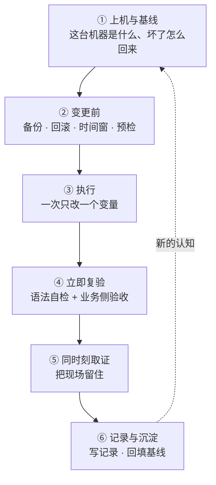

---
tags:
  - Linux
  - 实验环境
  - 操作纪律
  - 学习地图
created: 2026-09-20
---

# 实验环境与操作纪律

## 知识地图

### 一次手工变更的旅程

时间主线跟着**一次手工变更**走：从接手一台机器、确认它现在是什么样，到改之前留下回退能力，到动手、复验、出事时留住现场，最后把过程写成记录、把新的认知回填到基线。

| #   | 阶段    | 这一步在做什么                  | 到这里要能说清             |
| --- | ----- | ------------------------ | ------------------- |
| 1   | 上机与基线 | 这一步确认身份、版本、资源与时间，并取一份基线   | 这台机器是什么、它在哪、坏了有什么回退能力 |
| 2   | 变更前   | 这一步做备份、写下回滚命令与触发条件、约时间窗，并做只读预检 | 改哪个文件、怎么撤回、什么条件下撤回  |
| 3   | 执行    | 这一步一次只改一个变量，并且改在持久生效的位置         | 改了什么、为什么现在改         |
| 4   | 立即复验  | 这一步做语法自检、服务与端口检查、业务侧探活与观察窗口    | 怎么知道改对了、观察多久        |
| 5   | 同时刻取证 | 这一步在现象出现时一次性取完各层证据，并把它复制出机器     | 现场在哪、哪些证据重启就没       |
| 6   | 记录与沉淀 | 这一步写记录、回填基线，并把判断过程留成 Runbook | 下次遇到同类现象先看什么        |

### 三条跨阶段的核对对象

有三类量各自贯穿多个阶段，排障时按它们切分比从头走一遍时间线更快。每一条都要点名它贯穿哪几个阶段，并写清每一处读什么字段。

| 核对对象 | 它贯穿哪几个阶段 | 每一处读什么字段 |
| --- | --- | --- |
| 同一件事在不同家族的入口 | 它贯穿第一个阶段、第三个阶段与第四个阶段：家族身份要在上机与基线时确认，真正的入口要在执行的阶段才被敲下，而它是否生效要在立即复验的阶段验证 | 在第一个阶段读 `/etc/os-release` 的 `ID` 与 `ID_LIKE`；在第三个阶段用 `command -v` 确认本机装了哪个前端；在第四个阶段读该前端自己的输出（如 `ufw status`、`getenforce`、`aa-status`），并与底层规则表（如 `nft list ruleset`）对照 |
| 结论的依据从哪来 | 它贯穿第一个阶段、第二个阶段、第四个阶段与第六个阶段：版本基线要在上机与基线时取，默认值的出处要在变更前查清才能写下回滚命令，字段口径要在立即复验时核对，最后在记录与沉淀时连工具版本一起记进记录 | 在第一个阶段读 `uname -r`、`systemctl --version` 与 `stat -fc %T /sys/fs/cgroup`；在第二个阶段读 man 页与发行版的发布说明来确认默认值；在第四个阶段用 `man -w` 定位手册并现场核对字段口径；在第六个阶段把工具版本与出处一起写进记录 |
| 这个动作能不能在这台机器上做 | 它贯穿第一个阶段到第五个阶段：每一个动作在动手之前都要先问"弄坏了能不能回来"，因此回退能力要在上机与基线时确认，回滚方案要在变更前写下，破坏性动作的边界要在执行时守住，取证与止损的先后顺序要在同时刻取证时体现 | 在第一个阶段查平台侧的快照与控制台能力，因为它们不在任何命令的输出里；在第二个阶段读备份产物的大小与时间戳；在第三个阶段读这个动作有没有上限与自停；在第五个阶段读证据是否已经复制出机器 |

## 术语速查

| 名词 | 一句话解释 | 在哪一篇展开 |
| --- | --- | --- |
| 发行版 | 它由内核、用户态、包管理与一套默认选择共同构成，因此同一件事在不同发行版上走不同入口 | 原理：发行版的构成与差异来源 |
| 内核与用户态的分工 | 内核只提供机制，而策略由发行版选择 | 原理：发行版的构成与差异来源 |
| 用户态 ABI | 它是库与程序之间的二进制接口约定，而且它只增不减 | 原理：发行版的构成与差异来源 |
| backport | 它指把上游新版本的补丁回移到发行版自己的低版本内核分支上，因此版本号的含义被改写了 | 原理：发行版的构成与差异来源 |
| 发行版的派生关系 | 它指的是发行版之间的上下游关系，因此它决定了补丁到达的延迟与文档的适用范围 | 原理：发行版的构成与差异来源 |
| 版本基线四项 | 它指发行版、内核、systemd 与 cgroup 四个相互独立的版本，因此它是跨机器比较的最小集合 | 原理：发行版的构成与差异来源 |
| ELF | 它是 Linux 的可执行与可链接文件格式 | 原理：程序启动与依赖解析 |
| 动态链接器（`ld.so`） | 它是在程序 `main` 之前把依赖找齐并接好的那个程序 | 原理：程序启动与依赖解析 |
| SONAME | 它是库对外声明的名字，而依赖记的是它，不是库的路径 | 原理：程序启动与依赖解析 |
| `DT_NEEDED` | 它是 ELF 里记录"我需要哪些库"的列表 | 原理：程序启动与依赖解析 |
| 搜索顺序 | 依赖查找按五级顺序进行，依次是 `RPATH`、环境变量、`RUNPATH`、缓存与默认路径 | 原理：程序启动与依赖解析 |
| `ld.so.cache` | 它是 `ldconfig` 扫描配置目录后生成的库缓存 | 原理：程序启动与依赖解析 |
| 安全执行模式 | 它指 setuid 等特权程序的运行方式，而这种方式会忽略部分环境变量 | 原理：程序启动与依赖解析 |
| `glibc-hwcaps` | 它是一套按硬件指令集分派的搜索子目录机制，用来选到更优的库版本 | 原理：程序启动与依赖解析 |
| 快照 | 它是虚拟化平台保存的某一时刻的机器状态，其中可以包含内存 | 原理：快照与状态一致性 |
| 崩溃一致性 | 它是只快照磁盘时得到的一致性等级，因此它相当于断电 | 原理：快照与状态一致性 |
| 静默（quiesce） | 它指打快照时暂停写入并刷盘，因此它把一致性等级抬高一级 | 原理：快照与状态一致性 |
| 机器身份（`machine-id`） | 它是安装时生成、此后不变的机器标识，因此克隆会把它一起复制过去 | 原理：快照与状态一致性 · 治理 |
| 证据易失性 | 它指证据的寿命由它存在哪一层介质决定 | 原理：观测的代价与证据的易失性 |
| 计数 / 采样 / 探针 | 它们是观测的三档机制，而这三档的代价与事件频率的关系完全不同 | 原理：观测的代价与证据的易失性 |
| 采集间隔与保留期 | 这两个量决定"历史数据能看到什么、能回溯多久" | 实操：基线卡与观测工具箱 |
| 基线卡 | 它是一台机器"正常"的定义，因此变更结束时要把读数回填进去 | 实操：基线卡与观测工具箱 · 治理 |
| 取证包 | 它是一组几分钟内取完、带统一时间戳、并且已经复制出机器的读数 | 实操：基线卡与观测工具箱 · 治理 |
| 变更记录六要素 | 它们是目标、范围、备份、回滚、验证与时间窗 | 体系：一次手工变更的完整旅程 · 治理 |
| 回滚触发条件 | 它指什么可观察的状态下必须回滚，因此它与回滚命令同等重要 | 体系：一次手工变更的完整旅程 · 治理 |
| 配置生效层级 | 它指启动参数、模块参数、运行时参数与配置文件各自在不同的时机被读取 | 体系：一次手工变更的完整旅程 |
| Runbook | 它是把现象、证据、动作、验收与回滚连在一起的一段可执行说明 | 治理：操作纪律与变更治理 |
| 不可逆操作 | 它指的是没有回滚路径的动作，因此只能靠前置条件与备份提供回退路径 | 体系：一次手工变更的完整旅程 · 治理 |

## 故障现场定位表

排障的第一问不是"怎么修"，而是「**我现在在哪台机器上、这个现象属于哪一类、它的现场在哪一层**」。用这张表把现象定位到类别，再进对应篇目。

| 你看到的现象 | 它属于哪一类 | 现场在哪 | 第一反应不要做 |
| --- | --- | --- | --- |
| 一条命令报 `command not found` | 这属于入口选错了的情况，而不是权限不足 | 先读本机的包管理家族，再读 `command -v` 与 `PATH` | 不要加 `sudo` 反复重试 |
| 程序报 `error while loading shared libraries` | 这属于依赖解析失败的情况，此时程序一行都没跑 | 先读 ELF 的 `NEEDED` 条目，再读 `ldconfig -p` 与搜索路径配置 | 不要用 `LD_LIBRARY_PATH` 当修复 |
| 改了配置但没生效 | 这属于生效层级与读取时机不一致的情况 | 先读文件位置与优先级，再读它是否需要重新加载 | 不要反复改同一个值 |
| 写进 `sysctl.d` 的值没生效 | 这属于目录优先级与字典序覆盖的情况 | 先读 `/etc` 与 `/usr/lib` 下的同名文件，再读目录顺序 | 不要直接往运行时接口里写当持久方案 |
| SSH 不通，但控制台能进 | 这属于网络、认证、服务与策略四层之一出问题的情况 | 先读地址与路由，再读 22 端口监听与底层规则表 | 不要重装，也不要在没取证时重启 |
| 重启后停在紧急模式 | 这属于启动期挂载失败的情况 | 先读失败单元与内核启动日志，再读挂载表对照 | 不要在没确认控制台时反复重启 |
| 登录、`su`、`sudo` 都失败 | 这属于账号库损坏或认证策略出问题的情况 | 先读账号解析结果，再读账号库的结构与格式自检 | 不要用普通编辑器继续改账号库 |
| 快照回滚后现象对不上 | 这属于现象由快照之外的状态决定的情况 | 先读时钟，再依次读外部依赖、机器身份与快照之后产生的数据 | 不要断定"回滚失败" |
| 装了采集工具却查不到历史 | 这属于采集没开或已过保留期的情况 | 先读采集计时器状态与数据目录，再读保留天数 | 不要现场补装后声称能回溯过去 |
| `journalctl -b -1` 报找不到启动偏移 | 这属于日志没持久化或旧数据被清掉的情况 | 先读启动列表，再读持久目录与存储配置 | 不要反复重试同一个偏移 |
| `systemctl --failed` 有内容 | 这属于存在失败单元、而它未必是本次造成的情况 | 先读单元名，再读失败时间 | 不要当成自己弄坏的 |
| 两台机器在监控里像同一台 | 这属于身份重复的情况 | 先读 `machine-id`，再读主机密钥 | 不要先把监控改成人工忽略 |

## 篇目

| # | 篇目 | 一句话 |
| --- | --- | --- |
| 01 | [[Linux/01_实验环境与操作纪律/01_原理_发行版的构成与差异来源\|原理：发行版的构成与差异来源]] | 它讲内核只提供机制而发行版选择策略，以及版本基线为什么是四项 |
| 02 | [[Linux/01_实验环境与操作纪律/02_原理_程序启动与依赖解析\|原理：程序启动与依赖解析]] | 它讲从 `execve` 到 `main` 的四步与依赖查找的五级搜索顺序 |
| 03 | [[Linux/01_实验环境与操作纪律/03_原理_快照与状态一致性\|原理：快照与状态一致性]] | 它讲快照保存了哪几部分状态，以及回滚不了哪四样东西 |
| 04 | [[Linux/01_实验环境与操作纪律/04_原理_观测的代价与证据的易失性\|原理：观测的代价与证据的易失性]] | 它讲证据如何按介质分层，以及观测的三档代价 |
| 05 | [[Linux/01_实验环境与操作纪律/05_体系_一次手工变更的完整旅程\|体系：一次手工变更的完整旅程]] | 它讲六个阶段与三条跨阶段的核对对象，并含配置生效层级 |
| 06 | [[Linux/01_实验环境与操作纪律/06_实操_基线卡与观测工具箱\|实操：基线卡与观测工具箱]] | 它讲一个问题对应哪把工具、字段怎么读，以及七类现象的排查方向 |
| 07 | [[Linux/01_实验环境与操作纪律/07_判例_高频误判\|判例：高频误判]] | 它按场景、常见误判、判据与出处给出高频误判 |
| 08 | [[Linux/01_实验环境与操作纪律/08_治理_操作纪律与变更治理\|治理：操作纪律与变更治理]] | 它讲制度缺位会怎样、要交出哪六种产物，以及治理场景 |

## 参考文档

- `man 5 os-release`、`man 1 uname`、`man 1 hostnamectl`、`man 1 systemd-detect-virt`、`man 5 machine-id`：机器身份与版本基线。
- `man 8 ld.so`、`man 8 ldconfig`、`man 5 ld.so.conf`、`man 1 ldd`、`man 1 readelf`、`man 2 execve`：程序启动与依赖解析。
- `man 5 sysctl.d`、`man 8 sysctl`、`man 5 systemd.unit`、`man 5 fstab`、`man 8 mount`、`man 1 findmnt`：配置的层级、覆盖与撤回。
- `man 1 journalctl`、`man 5 journald.conf`、`man 5 sysstat`、`man 1 sar`、`man 1 dmesg`、`man 2 ptrace`：现场与历史数据。
- `man 1 timedatectl`、`man 8 systemd-timesyncd`、`man 8 hwclock`：时钟与同步状态。
- 内核 6.x 文档 `Documentation/admin-guide/sysrq.rst`、`Documentation/admin-guide/kernel-parameters.rst`、`Documentation/process/stable-kernel-rules.rst`。内核文档一律按与目标机器同一主版本取（当前基线 6.x）——同一条路径在不同版本里可能同名而内容不同。
- 虚拟化平台的快照文档（快照类型、静默机制、Snapshot Limitations）、各发行版的发布说明与生命周期页、各家族的包管理与配置文档。

