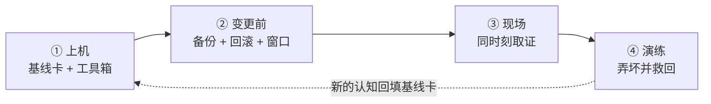

---
tags:
  - Linux
  - 实验环境
  - 发行版
  - 操作纪律
  - 学习地图
created: 2026-09-19
---

# 实验环境与操作纪律

> [!cite] 参考资料
> `man 5 os-release`、`man 1 man`、`man 1 ldconfig`、`man 8 ld.so`、`man 1 sysctl`、`man 1 vipw`、`man 5 fstab`、`man 1 systemctl`，内核文档 `Documentation/admin-guide/sysrq.rst`，以及发行版官方文档中的 "System Administrator's Guide"（RHEL 系）、"Server Guide"（Ubuntu）、"Administration Guide"（Debian/SUSE）三章。
>
> 实测状态：本章已从 WSL2 迁移到**真实虚拟机**实测。**实测环境：Ubuntu 24.04.5 LTS（VMware 虚拟机，`systemd-detect-virt` = `vmware`，legacy BIOS 启动）/ 内核 6.8.0-139-generic / systemd 255（255.4-1ubuntu8.17）/ cgroup2fs（v2）/ 4 vCPU / `MemTotal` 7894 MiB / root 可用**。
>
> **本次真跑并已替换输出**：四项版本基线、机器事实与启动参数（子笔记 02）、工具箱体检与 `man` 章节映射（子笔记 04）、同时刻取证包（子笔记 06）、`kill -9 1` 的 **root 与 `realtyz`（uid=1000）双场景对比**（子笔记 07）、动态库排障全流程（子笔记 08）、以及**用临时 loop 文件系统等价复现的「打满文件系统」与「只读根」**（子笔记 10）。
>
> **仍未实测**：写坏 `/etc/fstab` 到重启进 `emergency mode`、`echo c > /proc/sysrq-trigger` 触发内核 panic、`ip link set ens33 down` 断网——这三类**需要控制台/快照，本实验环境不做**（要重建机器，不属于可自恢复操作）。RHEL/SUSE/Alpine 的命令输出同样未实测，入口名称与默认值以官方文档为准。具体到篇的实测状态写在每篇开头的「参考资料」里。

> 本笔记对应《Linux 运维学习大纲》的「阶段 1：实验环境与操作纪律」。目标：**先有一台能快照、能重建、能进控制台的实验机**，把版本基线固化下来；知道主流发行版的差别在哪、同一条命令为什么换个家族就不成立；并且形成「先取证、再动手、留回滚」的习惯。
>
> **本页是子目录 `01_实验环境与操作纪律/` 的 00 号导读，不是全部正文。** 知识脉络、生产技能地图、术语速查、故障现场定位表都在这一页；逐项深入的正文按知识点拆成子笔记，索引见第 7 节。
>
> **读者定位：刚入职的运维/SRE。** 假设你会基本 shell（`cd`/`ls`/`grep`/管道、`sudo` 提权、看退出码），用过 `top`/`ps`/`systemctl` 至少看过一次系统状态，但没系统整理过「在哪台机器上做、坏了怎么回滚、证据去哪取」。这一章要补的前置知识单独成篇（子笔记 01–03）。

> [!info] 读之前：先自检三条前提
> 1. **有一台可以随便折腾的机器**（虚拟机或云主机），它不是你的办公机、也不是生产机。子笔记 07 的演练会故意把系统弄坏。
> 2. **能进控制台**：虚拟化平台的图形/串口控制台、带外管理（IPMI/iDRAC/iLO）或云厂商 VNC。网络配置与 `/etc/fstab` 被写坏之后，SSH 已经进不去了。
> 3. **会基本的 shell，并知道 `man` 是什么**：本篇会把这些命令「按现象归类」，但不从零讲每个参数。
>
> 第 1、2 条不满足 → 先读子笔记 01；第 3 条不满足 → 先补 shell 基础再回来。

## 0. 30 秒速览

> [!abstract] 这一章只要记住六句话
> - **实验机的最低要求不是「有 root」，而是「能快照 + 能进控制台」。**
>   证据：快照给你回滚，控制台给的是「网络或 `fstab` 被你弄坏之后唯一还能进去的路」；只管快照不留控制台，演练一次就可能把机器变成砖。**本实验环境（VMware 虚拟机）root 免密可用，但只有 SSH 一条通道，因此「写坏 `fstab`」与「SysRq panic」两类演练仍不做。**
> - **版本基线先于一切：发行版、内核、systemd、cgroup 四项。**
>   怎么验证：`cat /etc/os-release`、`uname -r`、`systemctl --version | head -1`、`stat -fc %T /sys/fs/cgroup`；实测本机输出 `PRETTY_NAME="Ubuntu 24.04.5 LTS"` / `6.8.0-139-generic` / `systemd 255 (255.4-1ubuntu8.17)` / `cgroup2fs`。没有这四项，后面所有「默认值」都没有意义。
> - **发行版差异先于命令记忆。**
>   证据：RHEL 系是 `dnf` + `firewalld` + SELinux + XFS，Debian/Ubuntu 是 `apt` + `ufw` + AppArmor + ext4；同一条「关闭防火墙」的命令在另一个家族里根本不存在。
> - **内核版本号不能跨发行版直接比大小。**
>   证据：RHEL 9 的基线内核是 5.14、Ubuntu 24.04 是 6.8、Debian 12 是 6.1，但 RHEL 会把新特性**回移（backport）**进 5.14——「你的内核怎么这么老」不是有效判断，要查该发行版的 release notes。
> - **纪律只有三句话：变更前三件事、现象发生时同时刻取证、重启会毁掉现场。**
>   怎么验证：变更前三件是**带时间戳的备份、写下来的回滚命令、确认时间窗**；取证是 `date`/`vmstat`/`free`/`iostat`/`ss`/`nstat`/`dmesg` 在同一分钟各取一份。
> - **`error while loading shared libraries` 是四步：缺哪个 → 装没装 → 路径对不对 → `ldconfig` 后复验。**
>   证据：实测自建 `libhello.so` 后 `ldd ./app` 报 `libhello.so => not found`，直接运行退出码 **127**；`LD_LIBRARY_PATH=/tmp/lab-lib ./app` 修复成功，`ld.so.conf.d` + `ldconfig` 的持久方案也验证通过（复验后已还原）。

> [!tip] 这一页怎么用：三条入口
> - **系统学（推荐，按大纲给的 2~3 天）**：从第 3 节的「四级训练台阶」开始，T0 → T4 逐级往上；每一级都用第 2 节的技能表核对交付物。
> - **出事急救**：直接看第 6 节「故障现场定位表」，定位到场景后进对应子笔记，或直接翻子笔记 09 的处置手册。
> - **面试速览**：第 0 节 + 第 5 节术语表 + 各子笔记末尾的自测卡。

## 1. 知识地图（第一条主线）

### 1.1 四站主线：一次手工变更的一生

这一章不是「命令大全」，而是把你之后每个阶段都会重复的动作讲成一条时间线。**一次手工变更从准备到收尾只经过四站**，每一站的产出就是下一站的输入：

| # | 环节 | 这一站在回答什么 | 这一站的产出 |
| --- | --- | --- | --- |
| 1 | 上机 | 我在哪台机器上？它是哪个发行版、什么版本？工具齐不齐？ | 一份基线卡 + 可用的工具箱 |
| 2 | 变更前 | 我要改什么？备份在哪？回滚命令是什么？什么时间段做？ | 一份带回滚的变更记录 |
| 3 | 现场 | 现象正在发生，我先固定什么证据？哪些证据重启就没了？ | 一个同时刻取证包 |
| 4 | 演练 | 我敢不敢把它弄坏？弄坏之后从哪个入口救回来？ | 一份演练记录（含恢复耗时） |

**这一章真正要练出来的，是同一个三问：**

1. **我现在在哪台机器上？** —— 决定这条命令、这个默认值、这份文档成不成立。
2. **弄坏了怎么回来？** —— 决定这次操作属于只读、可回滚，还是不可逆。
3. **现场在哪里？** —— 决定第一步取证去哪，以及为什么不能先用重启止损。

把这三问记住，后面每一篇你都能自己往里填内容，而不是背命令清单。

### 1.2 三条横切线

四站是时间线，但有几件事会横穿多站。新人最容易「每一站都看过、却串不起来」，就是因为没抓住这三条线：

| 横切线 | 贯穿内容 | 收口于 | 主要子笔记 |
| --- | --- | --- | --- |
| **发行版差异线** | 家族血统 → 包管理 → 防火墙 → 网络 → 访问控制 | 同一条命令换个家族为什么不成立 | 02、03 |
| **资料与工具来源线** | 版本基线 → 默认值从哪查 → 工具箱从哪装 → 依赖缺失怎么办 | 遇到没见过的参数，5 分钟内找到一手说明 | 04、08 |
| **风险分级线** | 只读 → 可回滚变更 → 破坏性演练 | 哪些事只能在可快照实验机上做 | 05、06、07、09 |

### 1.3 前置地基

以下三块是读懂四站的最低门槛。**它们不是「扩展阅读」，是必修**——缺哪块补哪块，再回来看主线。

| 前置篇 | 你要先建立的概念 | 对应子笔记 |
| --- | --- | --- |
| 可回滚的实验机 | 快照、控制台、隔离三要件；四种常见环境的边界 | [[Linux/01_实验环境与操作纪律/01_前置_可回滚的实验机\|01 前置：可回滚的实验机]] |
| 版本基线与发行版家族 | 四项基线怎么取；血统、支持周期与 backport 的意义 | [[Linux/01_实验环境与操作纪律/02_前置_版本基线与发行版家族\|02 前置：版本基线与发行版家族]] |
| 发行版差异四件套 | 包管理、防火墙、网络、访问控制在两个家族里的入口 | [[Linux/01_实验环境与操作纪律/03_前置_发行版差异四件套\|03 前置：发行版差异四件套]] |

## 2. 生产技能地图（第二条主线）

知识和技能是两条线。**读完不等于会做**，所以这一章明确交付 8 项技能，每项都有可观察的行为和一个交付物。学每一篇的时候，对照这张表看自己在练哪一项。

| #   | 技能      | 可观察的行为                             | 在哪几篇练       | 交付物                    |
| --- | ------- | ---------------------------------- | ----------- | ---------------------- |
| S1  | 环境与基线   | 拿到一台陌生机器，10 分钟内说清它「在哪、有什么、怎么回滚」    | 01、02、04    | 一份本机基线卡                |
| S2  | 发行版差异判断 | 给一条命令，先判断它在当前家族成不成立，再决定用哪条替代       | 02、03       | 一份「命令 → 家族 → 是否可用」对照记录 |
| S3  | 工具就位    | 按「现象 → 工具」装齐工具箱，并记录工具版本与缺口         | 04          | 一份工具箱体检结果              |
| S4  | 资料检索    | 遇到没见过的参数或配置，用 man 页与官方文档找到一手说明     | 04          | 一份「问题 → man 章节 → 结论」记录 |
| S5  | 变更与回滚   | 任何手工改动都能先写出「备份 + 回滚 + 窗口」三件套       | 05          | 一份带回滚命令的变更记录           |
| S6  | 取证      | 现象发生时先取同时刻证据，并说得出哪些证据重启即失          | 06          | 一个同时刻取证包               |
| S7  | 风险分级与演练 | 分得清只读、可回滚与破坏性；按台阶演练并能完整恢复          | 05、06、07    | 一份演练记录（含恢复耗时）          |
| S8  | 沉淀      | 把一次处置写成 Runbook 片段：现象、证据、根因、回滚、巡检项 | 09、10（贯穿全章） | 至少一段 Runbook 片段        |

这 8 项里，S1、S4、S7 是**判断力**，S2、S3、S5、S6 是**操作力**，S8 是把一次经验变成可复用资产的能力。新人通常卡在 S4、S5、S7——这三项没有命令清单可背，只能靠带反馈的练习。

## 3. 四级训练台阶

技能靠难度递增、风险可控的重复练习获得。**每一级都写明了在哪台机器上做**，这条边界本身就是 S7 的训练内容。

| 台阶 | 做什么 | 在哪台机器 | 交付物 |
| --- | --- | --- | --- |
| **T0 读通** | 说清四站主线与三条横切线；画出「危险操作 → 恢复入口」的对照 | 纸面/白板 | 自己画的一张变更生命周期图 |
| **T1 观测** | 取四项版本基线；体检工具箱；跑只读取证命令；记录一次 `man` 检索路径 | **生产机可以做（只读）** | 本机基线卡 + 工具箱体检结果 |
| **T2 可回滚变更** | 按三件套改一个小配置（如 `sysctl` 的一个非关键项）并回滚；写一份变更记录 | 实验机 | 变更记录（含回滚与耗时） |
| **T3 故障注入与恢复** | 打满一个文件系统、写坏 `fstab`、down 网卡、SysRq panic（至少三项），各自走通恢复 | **可快照 + 有控制台的实验机** | 演练记录 |
| **T4 限时模拟** | 给一个现象（如「SSH 不通」「命令跑不起来」），10 分钟内定位并写出处置记录 | 实验机 + 计时 | 一份排障报告 |

> [!warning] 一条不能破的边界
> **只有 T1 允许在生产机上做，而且全程只读**（`cat`、`ls`、`df`、`ss`、`journalctl` 这类）。T2 到 T4 一律在实验机，动手前先打快照。
>
> 生产上唯一「看起来像 T2」的例外是应急止损（例如紧急模式下改回来一行 `fstab`）——那属于事故处置，不属于练习，事后要按 S8 补记录。
>
> **本章实测环境的边界**：本实验机是 VMware 虚拟机，root 免密可用、有快照能力，但**日常只有 SSH 一条通道**。因此 T3 里「打满文件系统」用**临时 loop 文件系统等价复现**（已实测），「只读根」用临时 loop 挂载后 `remount,ro` 等价复现（已实测）；而写坏 `/etc/fstab`、SysRq panic、down `ens33` 三类**需要控制台或快照回滚才能保证救回来，本实验环境不做**，保持「未实测」。

## 4. 学习路线

**系统学的三遍读法（对应大纲给的 2~3 天）：**

- **第一遍（约半天，把机器和台账准备好）**：第 1 节 → 子笔记 01（实验机三要件）→ 02（四项基线）→ 04（工具箱与资料）→ T1 的两份交付物。
- **第二遍（约一天，把「发行版差异」吃透）**：02 的发行版家族与横向对比 → 03（差异四件套）→ 04 的 `man` → 05（变更三件套）→ 做一次 T2 小变更。
- **第三遍（半天，破坏性演练）**：06（同时刻取证）→ 07（破坏性清单与恢复入口）→ 08（依赖缺失）→ 09 的处置手册与 10 的实验 → T3、T4。

**只想解决手头问题的快捷入口：**

| 你的问题 | 去哪 |
| --- | --- |
| 没有能弄坏的机器，或者只有 WSL2/容器 | 子笔记 01 |
| 这台机器是什么系统？默认值从哪查？ | 子笔记 02 |
| 这条命令为什么在另一台机器上不存在？ | 子笔记 03 |
| 现象设备上没有 `iostat`/`tcpdump`/`perf` | 子笔记 04 |
| 马上要改一个配置，怕改坏 | 子笔记 05 |
| 故障正在发生，不知道该先做什么 | 子笔记 06、09 |
| 想在实验机上主动演练一次 | 子笔记 07、10 |
| 命令报「找不到库」 | 子笔记 08、09 |

## 5. 术语速查

> [!info]- 名词速查（读到哪里卡住，就回这里查）
> | 名词 | 一句话解释 | 在哪一篇展开 |
> | --- | --- | --- |
> | 快照（snapshot） | 磁盘在某时刻的副本，用来回滚；**不是备份**，也不包含时间与外部状态 | 01、07 |
> | 控制台 / 带外管理 | 不经过操作系统的访问通道（VNC、串口、IPMI、云控制台） | 01、07 |
> | 版本基线 | 发行版 / 内核 / systemd / cgroup 四项环境快照，所有结论的前提 | 02、04 |
> | 发行版家族 | 共享包管理、安全栈与发布节奏的一支（RHEL 系 / Debian 系 / SUSE / Alpine…） | 02 |
> | 上游 / 下游 | 谁基于谁开发（Fedora → RHEL → Rocky/Alma）；决定「谁先拿到新特性」 | 02 |
> | EOL / LTS | 停止维护的日期 / 长期支持版本；生产选型的硬门槛 | 02 |
> | backport（回移） | 把新内核的功能移植进老版本内核；RHEL 的看家做法 | 02 |
> | 包管理器 | `dnf`/`apt`/`zypper`/`pacman`/`apk`，各有包格式与仓库配置 | 03 |
> | 强制访问控制（MAC） | SELinux / AppArmor：在内核层约束进程能碰哪些资源 | 03、09 |
> | `ld.so` / `ld.so.cache` | 动态链接器 / 它缓存库路径的索引；`ldconfig` 负责刷新 | 08 |
> | SONAME | 库的「接口版本名」（如 `libfoo.so.1`），决定二进制找哪个库 | 08 |
> | `LD_LIBRARY_PATH` | 临时追加库搜索路径的环境变量，**只影响当前进程树** | 08 |
> | glibc / musl | 两套不同的 C 库实现；Alpine 用 musl，glibc 二进制在它上面跑不起来 | 02、08 |
> | 变更三件套 | 带时间戳的备份、写下来的回滚命令、确认过的时间窗 | 05 |
> | 取证（forensics） | 现象发生时**先固定证据**再动手；重启会清掉大部分证据 | 06、09 |
> | PID 1 | 第一个用户态进程；内核为它屏蔽了信号的默认动作 | 07 |
> | SysRq | 内核的应急按键接口，可触发落盘、只读重挂、重启甚至崩溃 | 07 |
> | Runbook | 可照着执行的处置手册：现象、证据、动作、验收、回滚 | 09 |

## 6. 故障现场定位表

遇到问题时，第一问不是「怎么修」，而是「**我现在在哪一站**」。用这张表把现象定位到场景，再进对应子笔记。

| 你看到的现象 | 属于哪一站 | 现场在哪 | 第一反应不要做 | 去哪一篇 |
| --- | --- | --- | --- | --- |
| 还没动手，但不确定该不该做 | 变更前 | 变更记录上的「备份 / 回滚 / 窗口」 | 不要「先做了再说」 | 05 |
| 故障正在发生，且可能还要恶化 | 现场 | `date`/`vmstat`/`iostat`/`ss`/`dmesg` 的同时刻输出 | 不要先用重启止损 | 06 |
| 同一时刻多台机器现象不同 | 上机 | 四项版本基线与发行版家族 | 不要假设两边默认值相同 | 02 |
| 命令报 `command not found` | 上机 | `command -v` 与 `$PATH` | 不要先怀疑权限 | 03 |
| 命令报 `error while loading shared libraries` | 上机/横切 | `ldd` 的 `not found` 行 | 不要直接重装软件 | 08、09 |
| 服务或工具缺依赖，装不上 | 上机 | 工具箱体检结果 | 不要为了一个工具升级整个系统 | 04、08 |
| SSH 不通，但控制台能进 | 演练/恢复 | 控制台里的 `ip a`、`ip route` | 不要重装系统 | 07、09 |
| 重启后进 `emergency mode` | 演练/恢复 | 失败挂载单元与 `fstab` | 不要在紧急模式里盲目重启 | 07、09 |
| 登录报错、`su`/`sudo` 失败 | 演练/恢复 | `/etc/passwd`、`/etc/shadow` | 不要用 `vi` 直接改这两个文件 | 07、09 |
| 系统起不来或文件系统报错 | 演练/恢复 | 带外控制台、Live 环境 | 不要对有数据的盘直接 `fsck -y` | 07、09 |
| 快照回滚后现象却对不上 | 演练/恢复 | 时间、机器身份、外部依赖的状态 | 不要以为回滚失败了 | 07、09 |
| 演练之后机器状态不对劲 | 演练/恢复 | 快照名、演练记录、上一次启动日志 | 不要在没有证据时直接再演练一次 | 07、09 |

两个容易被忽略的边界：

- **快照保护的是磁盘，不保护时间与外部状态。** 回滚之后时间会跳回、证书可能校验失败、上游依赖仍是「未来」的状态——这些都不在快照里，回滚后要主动校时、核对依赖。
- **「重启能解决问题」和「重启会毁掉现场」同时成立。** 它是止损手段，不是排查手段；决定重启之前，先把子笔记 06 的取证包取一份。

## 7. 子笔记索引

| # | 子笔记 | 一句话 | 主要技能 | 难度 |
| --- | --- | --- | --- | --- |
| 01 | [[Linux/01_实验环境与操作纪律/01_前置_可回滚的实验机\|前置：可回滚的实验机]] | 快照、控制台、隔离三要件，以及四种环境的边界 | S1、S7 | 前置 |
| 02 | [[Linux/01_实验环境与操作纪律/02_前置_版本基线与发行版家族\|前置：版本基线与发行版家族]] | 我在哪台机器上、它是哪个家族、默认值从哪查 | S1、S2 | 前置 |
| 03 | [[Linux/01_实验环境与操作纪律/03_前置_发行版差异四件套\|前置：发行版差异四件套]] | 包管理、防火墙、网络、访问控制的家族入口 | S2 | 前置 |
| 04 | [[Linux/01_实验环境与操作纪律/04_第1站_上机_基线卡与工具就位\|第 1 站：上机——基线卡与工具就位]] | 十项基线、现象到工具、man 与官方文档 | S1、S3、S4 | 核心 |
| 05 | [[Linux/01_实验环境与操作纪律/05_第2站_变更前_备份回滚与时间窗\|第 2 站：变更前——备份、回滚与时间窗]] | 动手前的三件套与变更记录 | S5、S7 | 核心 |
| 06 | [[Linux/01_实验环境与操作纪律/06_第3站_现场_同时刻取证\|第 3 站：现场——同时刻取证]] | 先取证再动手，以及重启会毁掉什么 | S6、S7 | 核心 |
| 07 | [[Linux/01_实验环境与操作纪律/07_第4站_演练_破坏性清单与恢复入口\|第 4 站：演练——破坏性清单与恢复入口]] | 六种破坏方式与四类救援通道 | S7 | 核心 |
| 08 | [[Linux/01_实验环境与操作纪律/08_横切_依赖缺失与动态链接库\|横切：依赖缺失与动态链接库]] | `error while loading shared libraries` 的四步处置 | S2、S6 | 核心 + 进阶 |
| 09 | [[Linux/01_实验环境与操作纪律/09_实验环境与纪律处置手册\|实验环境与纪律处置手册]] | 跨场景收口：现象 → 证据 → 处置 → 验收 | S7、S8 | 核心 |
| 10 | [[Linux/01_实验环境与操作纪律/10_动手实验与要点自测\|动手实验与要点自测]] | 五个实验的索引与总自测 | 全部 | 汇总 |

## 自检清单

- [x] frontmatter 有 `tags` 和 `created`，全篇只有一个一级标题
- [x] 速览卡 6 条，每条都是「结论 + 可复现的证据」
- [x] 读者定位、前置自检、知识地图、生产技能地图、四级台阶、学习路线、术语速查、故障定位表、子笔记索引齐全
- [x] 引用链接只指向本目录内的子笔记；提到其它阶段一律用纯文本
- [x] 所有命令与输出都标注了适用环境，未实测的部分显式标注
- [x] 子笔记 01–10 全部写完，且本页每一条链接都能解析
- [x] 全章已从 WSL2 迁移到 VMware 虚拟机实测；正文与速览里的 WSL2 数字（发行版、内核、vCPU、内存、根分区、网卡、DNS、用户）已全部替换为虚拟机实测值
- [ ] 第 6 节的每一种现象都在对应子笔记里演练过一次
- [ ] 每张 Mermaid 图都在 Obsidian 里预览过，能正常渲染
