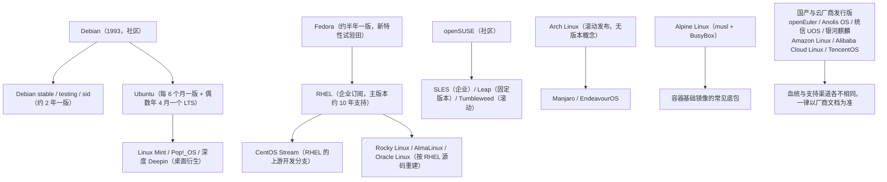

---
tags:
  - Linux
  - 实验环境
  - 发行版
  - 前置知识
created: 2026-09-19
---

# 前置：版本基线与发行版家族

> [!cite] 参考资料
> `man 5 os-release`、`man 1 uname`、`man 1 systemctl`、`man 1 stat`、`man 5 proc`（`/proc/cmdline`、`/proc/meminfo`）、`man 1 timedatectl`、`man 1 lsb_release`；发行版官方生命周期页（RHEL Life Cycle、Ubuntu ESM 矩阵、Debian LTS）与官方文档中的发行版概述章节。
>
> 实测状态：四项基线与资源、时间、启动参数输出已在 WSL2 Ubuntu 24.04.4 LTS 上实测并粘贴；RHEL/SUSE/Alpine 的输出未实测，其生命周期与默认栈以官方文档为准。**发行版的小版本号与 EOL 变化很快，本文只给「节奏与血统」层面的量级，具体数字一律现场查。**

> **这篇讲什么**：登录一台机器的第一件事——确认「我在哪台机器上」。这一篇给出四项版本基线、一份可复制的台账模板，以及主流发行版的血统、节奏与选型边界。
>
> **必须先读什么**：子笔记 01；会基本 shell。
>
> **读完能回答**：① 为什么版本基线要放在最前面？② RHEL 和 Ubuntu 有什么本质差别？③ 为什么「内核版本低」不等于「功能旧」？
>
> 所属：[[Linux/01_实验环境与操作纪律/00_导读与知识地图|01 实验环境与操作纪律]] 的 1.3 前置地基 · 主要练 **S1 环境与基线**、**S2 发行版差异判断**

## 0. 30 秒速览

> [!abstract] 这一篇只要记住五句话
> - **四项基线是「跨机器可比较」的最小集合：发行版、内核、systemd、cgroup。**
>   怎么验证：`cat /etc/os-release`、`uname -r`、`systemctl --version | head -1`、`stat -fc %T /sys/fs/cgroup`；实测本机依次是 `Ubuntu 24.04.4 LTS`、`6.6.87.2-microsoft-standard-WSL2`、`systemd 255`、`cgroup2fs`。
> - **同一个默认值在不同发行版上可能不同，不写基线，结论半年后就不能复用。**
>   证据：`vm.swappiness`、cgroup 版本、默认文件系统都随家族与版本变；本目录所有讨论都建立在「本机实测 + 标注环境」之上。
> - **`/proc/cmdline` 与运行时参数是两套东西。**
>   证据：前者只在启动那一瞬间生效，后者用 `sysctl` 管；名字相似，改法完全不同。
> - **内核版本号不能跨发行版直接比大小。**
>   证据：RHEL 9 基线内核 5.14、Ubuntu 24.04 是 6.8、Debian 12 是 6.1，但 RHEL 会把新特性**回移（backport）**进 5.14；要确认特性在不在，只能查 release notes 或本机实测。
> - **选实验机要按目标岗位对齐。**
>   证据：企业/金融/政企方向以 RHEL 系为主，互联网/SRE/云原生方向以 Ubuntu LTS 或 Debian 为主；至少准备一台 RHEL 系，才能练到 `dnf`/`firewalld`/SELinux 这条链路。

## 1. 四项版本基线：先知道自己在哪台机器上

登录一台新机器（或换了一台实验机）的第一件事不是敲业务命令，而是**固化四项基线**。实测本机输出：

```bash
cat /etc/os-release | head -3      # 验证：发行版与版本（PRETTY_NAME 一行就够写台账）
uname -r                           # 验证：内核版本（决定有哪些特性、参数在哪里）
systemctl --version | head -1      # 验证：systemd 版本（决定 unit 语法与可用指令）
stat -fc %T /sys/fs/cgroup         # 验证：cgroup 版本（cgroup2fs = v2，其他输出 = v1）
```

实测输出：

```text
PRETTY_NAME="Ubuntu 24.04.4 LTS"
NAME="Ubuntu"
VERSION_ID="24.04"
6.6.87.2-microsoft-standard-WSL2
systemd 255 (255.4-1ubuntu8.17)
cgroup2fs
```

再补上「机器长什么样」的一组，一起写进台账：

```bash
nproc; grep MemTotal /proc/meminfo; df -hT / | tail -1
                                   # 验证：核数、内存总量、根文件系统类型与可用空间
timedatectl | head -3              # 验证：时间与时区（排障对齐时间线的前提）
cat /proc/cmdline                  # 验证：内核启动参数（排查「为什么这个参数没生效」的第一现场）
```

实测输出（某次实测的快照，`MemTotal` 与磁盘用量随开机略有浮动）：

```text
24
MemTotal:       16224400 kB
/dev/sdd       ext4 1007G   17G  940G   2% /
Local time: Thu 2026-09-17 20:54:21 CST
Universal time: Thu 2026-09-17 12:54:21 UTC
RTC time: Thu 2026-09-17 12:54:21
initrd=\initrd.img WSL_ROOT_INIT=1 panic=-1 nr_cpus=24 ... WSL_ENABLE_CRASH_DUMP=1
```

## 2. 基线台账模板

把这十项填进每篇笔记或一份独立台账里。**没有基线的机器上，「这台机器有没有问题」这个判断本身就不成立。**

| 项目 | 命令 | 实测示例（本文环境） |
| --- | --- | --- |
| 发行版 | `cat /etc/os-release` | Ubuntu 24.04.4 LTS（noble） |
| 内核 | `uname -r` | 6.6.87.2-microsoft-standard-WSL2 |
| 启动参数 | `cat /proc/cmdline` | `initrd=\initrd.img ... panic=-1 nr_cpus=24` |
| systemd | `systemctl --version` | systemd 255 |
| cgroup | `stat -fc %T /sys/fs/cgroup` | `cgroup2fs`（v2） |
| 资源 | `nproc`、`grep MemTotal /proc/meminfo` | 24 vCPU / 16224400 kB（实测值随开机略有浮动） |
| 根文件系统 | `df -hT /`、`df -i /` | `/dev/sdd` ext4 1007G（用 2%） |
| 时间 | `timedatectl` | CST，与 UTC 相差 +8h |
| 虚拟化与启动模式 | `systemd-detect-virt`、`ls /sys/firmware/efi` | WSL2 / 无 EFI 目录 |
| 工具版本 | `sysstat -V`、`ss -V`、`iostat -V` | 记下来，字段名随版本变 |

四条必须记住的边界：

- **同一个参数在不同基线下的默认值可能不同**：不写清基线，笔记里的数字半年后就没法复用。阶段 4《内存管理与 OOM》与阶段 5《存储与文件系统》反复强调「默认值一律查本机」，根源就在这里。
- **`/proc/cmdline` 与运行时参数是两套东西**：前者只在启动时生效，后者用 `sysctl` 管，改法完全不同（深水区在阶段 2《启动流程与内核》）。
- **`stat -fc %T /sys/fs/cgroup` 是判断 cgroup 版本的唯一可靠方法**：不要靠发行版猜。v2 与 v1 的路径、控制器、可用参数都不同；v2 的系统上找不到 `/sys/fs/cgroup/memory/` 是正常的。
- **虚拟化平台的内核版本不代表物理机**：本机内核带 `microsoft-standard-WSL2` 后缀，说明是平台定制内核。`uname -r` 一样要记，但别拿它去推断物理服务器的行为。

## 3. 发行版家族：谁从谁派生

后面的每一个阶段，命令都隐含一个前提——**「在哪种发行版上」**。同一个需求（装包、开端口、配 IP、放开某个目录），各家族的入口各不相同；面试里「RHEL 和 Ubuntu 有什么差别」也是高频题。



读这张图的三个要点：

1. **血缘决定「谁会先拿到新特性」**：Fedora 先试，RHEL 才收；CentOS Stream 是 RHEL 的上游，而 Rocky/Alma 是 RHEL 的**下游重建**——所以 Stream 比 Rocky 早，Rocky 与 RHEL 高度同步但补丁会晚几天。
2. **CentOS Linux 这条老路的终结**：CentOS Linux 8 在 2021 年底停止维护、CentOS Linux 7 在 2024 年 6 月 EOL，官方把重心转到 CentOS Stream。**这就是这几年「CentOS 迁移」话题的来源**，常见去向是 Rocky Linux、AlmaLinux、Oracle Linux 或直接买 RHEL 订阅。
3. **「国产发行版」不等于一个技术家族**：它们有的源自 RHEL/openEuler 体系、有的源自 Debian 体系，生命周期与补丁渠道由厂商定义。**在这些系统上做事，第一原则是查厂商文档，而不是套用 Ubuntu 的经验。**

## 4. 横向对比

下表是「选型视角」。具体的小版本号与 EOL 日期变化很快，**表里的支持周期只是量级，不是承诺**。

| 家族 | 代表发行版 | 包管理（工具/格式） | 发布节奏 | 支持周期（量级） | 默认防火墙 | 强制访问控制 | 默认文件系统 | 典型场景 |
| --- | --- | --- | --- | --- | --- | --- | --- | --- |
| **RHEL 系** | RHEL、CentOS Stream、Rocky、AlmaLinux、Oracle Linux | `dnf`（RPM） | 主版本约 3 年一版，小版本约半年 | RHEL 主版本约 10 年；重建版跟随 RHEL | `firewalld` | **SELinux** | XFS（RHEL 7 起） | 金融、政企、运营商；企业运维面试的主场 |
| **Debian 系** | Debian、Ubuntu | `apt`（DEB） | Debian 约 2 年一版；Ubuntu 每 6 个月一版 + 每两年一个 LTS | Debian stable 约 3 年，加 LTS 至约 5 年；Ubuntu LTS 约 5 年（ESM/Pro 可延长） | Ubuntu 默认 `ufw`；Debian 最小安装无规则 | Ubuntu 默认 **AppArmor** | Ubuntu 默认 ext4 | 互联网、云原生、AI 基础设施、开发环境 |
| **SUSE 系** | SLES、openSUSE Leap/Tumbleweed | `zypper`（RPM） | Leap 约 1 年一版；Tumbleweed 滚动 | SLES 主版本 10 年以上（按 Service Pack 推进） | `firewalld`（老的 SuSEfirewall2 已废弃） | AppArmor（默认启用） | btrfs（配合 snapper 快照） | SAP、欧洲企业、制造业 |
| **独立（滚动）** | Arch Linux、Manjaro | `pacman`（自有格式） | 滚动发布，**没有「版本」概念** | 无固定周期，靠使用者自行维护 | 需自行安装配置 | 可选 AppArmor/SELinux | 自选 | 个人桌面、学习与尝鲜；**不建议直接上生产** |
| **容器/精简** | Alpine Linux | `apk` | 约半年一个稳定分支 | 每个稳定分支约 2 年（社区） | 无前端，直接用 nftables/iptables | 默认不启用 | 自选 | 容器基础镜像、嵌入式；注意 **musl** 与 BusyBox |
| **云厂商** | Amazon Linux 2023、Alibaba Cloud Linux、TencentOS Server | 多为 `dnf`/`yum`（RPM） | 由厂商定义 | 由厂商定义（多数量级为 3~5 年） | 视镜像而定 | 视镜像而定 | 多为 ext4/XFS | 云上默认镜像、国产化替代场景 |

> [!warning] 表里的「支持周期」是量级，不是承诺
> 具体 EOL 必须查官方生命周期页（RHEL/Alma/Rocky 各有 lifecycle 表，Ubuntu 有 ESM 矩阵，Debian 有 LTS 页面）。**本文不写死当前小版本号**——任何要落进文档的版本号，都用 `cat /etc/os-release` 现场取。

## 5. 四个最容易踩的「发行版差异」

1. **内核版本号不能直接比大小**：RHEL 9 的基线内核是 **5.14**、Ubuntu 22.04 是 **5.15**、Ubuntu 24.04 是 **6.8**、Debian 12 是 **6.1**。但 RHEL 的做法是**把新特性回移（backport）进老内核**——所以「RHEL 内核版本低 = 功能少」是错的判断。要确认某个特性在不在，只能查该发行版的 release notes，或直接在本机试。
2. **同一个软件，包名不同**：`bind-utils`（RHEL）对 `dnsutils`（Debian）、`httpd` 对 `apache2`、`firewalld` 对 `ufw`、`nftables` 对 `iptables-persistent`。**判断「这个命令属于哪个包」，用 `rpm -qf $(command -v <cmd>)` 或 `dpkg -S $(command -v <cmd>)`**，而不是去猜包名。
3. **服务名与配置目录不同**：同为 systemd，RHEL 的 `/etc/sysconfig/` 对应 Debian 的 `/etc/default/`；`httpd.service` 对 `apache2.service`，`chronyd` 对 `chrony`。**在 RHEL 上找 `/etc/default/`、在 Debian 上找 `/etc/sysconfig/`，是典型的「抄错发行版」。**
4. **强制访问控制不是同一套东西**：SELinux 看 `getenforce`/`sestatus`/`ausearch -m AVC`，AppArmor 看 `aa-status`/`journalctl -k | grep -i apparmor`——模型、工具、排错入口都不同，**不要把一个的经验套到另一个上**。更不要把 `setenforce 0` 当成修复手段。

## 6. 实验机怎么选

- **按目标岗位对齐**：企业/金融/政企方向 → RHEL 系（用 Rocky 或 AlmaLinux 免订阅做实验机）；互联网/SRE/云原生方向 → Ubuntu LTS 或 Debian。
- **建议至少两台**：一台 Ubuntu LTS（文档多、生态全，作为主实验机）+ 一台 Rocky/AlmaLinux（练 `dnf`、`firewalld`、SELinux、XFS）。本目录的实测环境只有 Ubuntu，涉及 RHEL 系的部分以官方文档为准。
- **不要用滚动发行版当唯一实验机**：Arch/Tumbleweed 适合了解「上游在发生什么」，但你的笔记需要可复现，而滚动发行版的包版本每周都在变。

> 面试答法：被问「RHEL 和 Ubuntu 有什么差别」，按 **血统与支持周期 → 包管理 → 安全与网络默认栈 → 现场怎么查** 四步讲，最后补一句「具体以 `cat /etc/os-release` 和厂商文档为准」。给方法比背参数表更像做过事的人。

## 常见坑

| 常见做法或说法 | 后果或事实 |
| --- | --- |
| 不记版本基线就开始排障 | 同一个参数在不同发行版/版本上默认值可能不同，结论无法复用也无法对比 |
| 靠发行版名字猜 cgroup 版本 | 必须用 `stat -fc %T /sys/fs/cgroup` 确认；v1 与 v2 的路径与参数完全不同 |
| 认为「内核版本低就是功能旧」 | RHEL 会把新特性回移到 5.14 基线；判断特性要用发行版 release notes 或本机实测 |
| 把 `uname -r` 的输出当物理机行为 | WSL2、云主机、容器的内核都由平台提供，行为与物理机可能不同 |
| 用滚动发行版当唯一实验机 | 包版本每周都变，笔记与基线无法复现 |
| 跨家族直接套默认值 | RHEL 默认 XFS + SELinux，Ubuntu 默认 ext4 + AppArmor，默认值不可移植 |
| 引用生命周期数字却不写来源 | EOL 与主线版本变化很快，写死的数字半年后就会误导人；要写「查官方生命周期页」 |
| 克隆虚拟机后不重置机器身份 | `/etc/machine-id` 重复会导致日志、授权与监控系统混淆 |

## 决策练习

> **场景**：你接手了两台服务器，一台 Rocky Linux 9、一台 Ubuntu 22.04。同事说「两台内核都是 5.14/5.15，差不多是同一个时代的东西」。你要判断某个新特性（比如某个 cgroup v2 控制器）在不在。
>
> A. 比较 `uname -r` 的数字大小，谁的版本号高就认为谁有。
> B. 分别在这两台机器上取四项基线，再查各自的 release notes / 本机实测该特性。
> C. 以 Ubuntu 22.04 的结论为准，因为 Ubuntu 文档多。

**为什么选 B**：RHEL 系采用 backport 策略，会把新特性移植进它较低版本号的内核里；所以「版本号大小」不是判据。唯一可靠的做法是查该发行版自己的 release notes，或直接在本机验证。

**为什么 A 不对**：这正是 backport 打破的直觉。RHEL 9 的 5.14 里可能有 Ubuntu 6.x 才有的特性，反过来也一样。

**为什么 C 不对**：发行版的默认内核配置、编译开关、回移策略都不同，一个家族的结论不能直接搬到另一个家族。

## 要点自测

> [!question]- 四项版本基线是哪四项？为什么必须放在最前面？
> - 发行版（`/etc/os-release`）、内核（`uname -r`）、systemd（`systemctl --version`）、cgroup 版本（`stat -fc %T /sys/fs/cgroup`）。
> - 它们决定了「这条命令在不在、这个默认值是多少、这份文档对不对得上」，是后面所有结论的前提。
> - 还要顺手记资源、根文件系统、时间、虚拟化类型与工具版本；字段名会随版本变。
> - **第一反应不要是什么**：不要凭发行版名字猜默认值，一律现场取。

> [!question]- 为什么说「内核版本号不能跨发行版直接比大小」？
> - RHEL 系采用 backport：把上游新功能移植进它自己的老版本内核，所以 5.14 里可能有比 6.x 更早或更晚的特性。
> - 判断某个特性在不在，只能查该发行版的 release notes、内核 changelog，或直接在本机验证。
> - 这也是本套笔记要求「实测 + 标注环境」的根本原因：默认值、编译开关、回移策略都随发行版变。
> - **第一反应不要是什么**：不要用 `uname -r` 的数字大小下结论。

> [!question]- 同一个需求（比如「开放 80 端口」）在 RHEL 和 Ubuntu 上怎么做？底层又是什么？
> - RHEL 系是 `firewall-cmd --permanent --add-port=80/tcp` + `firewall-cmd --reload`；Ubuntu 是 `ufw allow 80/tcp`。
> - 两者最终都落到 netfilter（nftables，老系统上是 iptables）；所以**「规则到底有没有生效」要看 `nft list ruleset`，而不是只看前端状态**。
> - 前提是先 `command -v` 确认命令存在：RHEL 上通常没有 `ufw`，Ubuntu 上通常没有 `firewall-cmd`。
> - **第一反应不要是什么**：不要把在一个家族里有效的命令直接搬到另一个家族。

> 上一篇：[[Linux/01_实验环境与操作纪律/01_前置_可回滚的实验机|01 前置：可回滚的实验机]] ｜ 下一篇：[[Linux/01_实验环境与操作纪律/03_前置_发行版差异四件套|03 前置：发行版差异四件套]]
