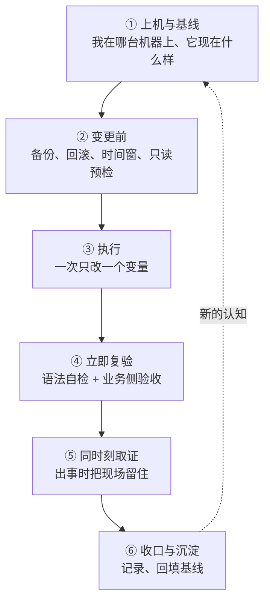

---
tags:
  - Linux
  - 变更管理
  - 操作纪律
  - 体系
created: 2026-09-20
---

# 一次手工变更的完整旅程

## 主线：从"接手一台机器"到"这次改动有了记录"

下面跟着**一次手工变更**走完整条链。之所以用"手工变更"做主线，是因为它是运维日常里最小、最完整、也最容易出事的单位：一次改配置、一次调参数、一次装补丁。自动化与流程只是把这条链搬到平台上，环节一个都不会少。

| #   | 站点    | 这一步在做什么                    | 产出        | 到这里要能说清             |
| --- | ----- | -------------------------- | --------- | ------------------- |
| 1   | 上机与基线 | 确认身份、版本、资源、时间、虚拟化能力，取一份基线  | 基线卡       | 这台机器是什么、它在哪、坏了有什么退路 |
| 2   | 变更前   | 备份、写下回滚命令、约时间窗、做只读预检       | 变更记录的前半   | 改哪个文件、怎么撤回、什么条件下撤回  |
| 3   | 执行    | 只改一个变量，边改边留痕               | 变更本身      | 改了什么、为什么现在改         |
| 4   | 立即复验  | 语法自检 + 业务侧探活 + 观察窗口        | 验收结论      | 怎么知道改对了、观察多久        |
| 5   | 同时刻取证 | 现象出现时一次性取完各层证据             | 取证包       | 现场在哪、哪些证据重启就没       |
| 6   | 收口与沉淀 | 写记录、回填基线、把可复用的部分变成 Runbook | 处置记录与基线更新 | 下次遇到同类现象先看什么        |

一条贯穿全链的判据：**每一个动作在动手之前，都要能回答"如果它把机器弄坏了，我怎么发现、怎么回来"。** 答不出来的动作，属于下一节要说的第三级风险。

## 一、上机与基线：先知道自己站在哪里

接手一台陌生机器，第一分钟要做的不是看负载，而是确认四类事实：

- **身份**：主机名、当前用户与权限、这是哪台机器（生产还是实验、哪套环境）；
- **版本基线**：发行版、内核、systemd、cgroup 版本。这四项决定了后面的命令能不能用、字段在不在（机制见《发行版的构成与差异来源》）；
- **资源与退路**：核数、内存、根文件系统容量与类型、有没有 swap、能不能打快照、有没有可用的控制台；
- **时间**：时区与同步状态。时间不对，后面所有时间线都不可信（机制见《观测的代价与证据的易失性》）。

**"能打快照"与"能进控制台"是两条独立的退路**，经常有人只确认了第一条。取消勾选它们的方式很简单：把网络配置或挂载表改坏。能力边界与回滚不了的东西，机制在《快照与状态一致性》。

**"我在哪台机器上"要靠环境本身来回答，而不是靠记忆。** 给实验机和生产机不同的提示符或配色，是一条成本极低、收益很高的纪律：它让"顺手试一下"在敲下回车之前就被制止。

## 二、变更前：三件套与一次只读预检

**三件套：备份、回滚命令、时间窗。**

- **备份要带时间戳，并且保留属性。** 判断标准是"能不能一眼看出它是什么时候的"，以及"出问题时能不能直接复制回去"。`cp -a` 这类保留属性的用法是合格的；把命令输出重定向到一个 `.bak` 文件（`cp 源 > 目标`）会得到一个空文件——它看起来像备份，实际什么也没存；
- **回滚命令必须写下来，并且能照着念。** 三个特征缺一不可：包含具体路径与文件名、包含执行后的验收动作、包含执行的前提边界（在什么状态下才能执行）。只在脑子里想过的回滚方案，在事故现场通常会被想错；
- **回滚要有触发条件。** "不行就改回来"不是触发条件；"观察窗口内错误率超过变更前的水平，或关键指标没有回到基线"才是。没有触发条件的回滚方案会错过止损窗口。

**只读预检：在动手之前把"现在的样子"记下来。** 至少覆盖已有的失败单元、挂载与其选项、磁盘与 inode 用量、目标文件的内容与权限、以及相关服务的当前状态。这份快照式的记录有两个用途：判断"这个现象是不是我造成的"，以及在事后回答"原来是什么样"。

**再确认一次时间窗与影响面。** 低峰期、通知相关方、确认这期间不会有别的变更同时进行——同时进行的两件事，会毁掉因果判断（见第四站）。

## 三、执行：一次只改一个变量

这一站只有一条核心纪律：**同一次变更只改一个变量。**

同时改三处，出问题时无法判断是哪一处起作用，也无法决定该回滚哪一处。这一条与"效率"直接冲突，因此它需要被明确说出来才可能被遵守。

配套的三条：

- **能声明就声明。** 能用配置管理或云初始化脚本表达的改动，就不要手工敲。手工改动不可复现、不可审计、不在任何版本历史里；
- **改动要落在"持久生效"的位置。** 直接把值写进运行时接口（`/proc/sys` 一类）只影响当前这次启动；重启之后回到默认值，于是制造出"重启后问题复现/消失"的伪现象。持久位置与生效时机见第八节；
- **破坏性动作要有上限与自停。** 会让磁盘写满、会打满 CPU 的动作，必须带着上限（时间、大小）执行，而不是赌它"应该够用"。

## 四、立即复验：三层验收

改完不动，等第二天看有没有异常，是把一次可控变更变成一次未知变更。复验要分三层，缺一层就会出现"看起来好着"的假成功：

| 层 | 做什么 | 能拦住什么 |
| --- | --- | --- |
| 语法与配置自检 | 用程序自带的校验模式检查配置文件、重新加载挂载表、检查单元文件 | 拼写错误、路径写错、选项名写错——大部分低级错误能在重启前拦下 |
| 服务与端口 | 确认服务处于运行状态、监听端口在、依赖的服务没被带崩 | 服务起不来、被依赖顺序连累 |
| 业务侧与指标 | 走一次真实业务路径（探活、请求、事务），并确认关键指标回到变更前的基线 | 语法正确但语义错了、参数改了没效果、副作用在别处 |

第三层是最容易被跳过的一层，也是唯一能回答"这次变更有没有达到目的"的一层。**"重启之后机器正常了"不属于任何一层**：它既没验证变更目标，也没留下证据。

**观察窗口要明确说出来。** "复验通过"与"观察了多久"是两件事，把窗口写进记录（例如低峰期观察到下一次业务高峰过去），可以让下一个人判断结论的强度。

## 五、同时刻取证：把现场留住

变更过程中出现异常，第一件事是取证，第二件事才是止损。顺序反了，就会在重启之后面对一堆空日志。

取证的判据是"同时刻"与"落到机器之外"：一组读数在几分钟内取完，带时间戳，写进文件，然后复制出这台机器。哪些证据重启即失（进程状态、连接与队列、内核计数器、内存文件系统里的东西），哪些是耐久的（磁盘上的日志、外部监控），机制在《观测的代价与证据的易失性》。

**取证的产物要跟着变更记录一起走。** 变更记录说"几点改了什么"，取证包说"几点开始异常、现场是什么样"，两者拼起来才是完整的时间线。只留在出事机器上的取证包，在机器起不来时等于没取。

## 六、收口与沉淀

变更结束（成功或回滚）时，有三件事要落地：

- **写记录**：目标、范围、备份、回滚、验证、时间窗六要素，加上实际结果与偏差。回滚过一次也要写——回滚本身就是一次有价值的结论；
- **回填基线**：这次改动改变了机器的哪个基线量，就更新基线卡。基线卡过期比没有基线更危险，因为它会给出错误的"正常值"；
- **留下可复用的部分**：把这次判断过程里"看到 A 就转 B"的部分抽成 Runbook 片段。产物模板与制度设计见《操作纪律与变更治理》。

**一次变更的价值不止在于它解决了什么，还在于它给下一次留了什么。** 完整的收口让第六站的产出直接成为第一站的输入——这正是闭环的含义。

## 七、三条横切线

三条线各自贯穿整条主线，不单独成站。

### 7.1 发行版差异线：同一件事，入口不同

同一件运维动作在不同家族走不同入口。判断时不要靠记忆，靠现场取：

| 要做的事 | RHEL 系 | Debian/Ubuntu 系 |
| --- | --- | --- |
| 装包与查归属 | `dnf`、`rpm -qf` | `apt`、`dpkg -S`（注意查的是真实路径，不是别名） |
| 仓库配置位置 | `/etc/yum.repos.d/*.repo` | `/etc/apt/sources.list` 与 `sources.list.d/`；Ubuntu 24.04 起默认用 deb822 格式的 `.sources` 文件 |
| 服务与日志 | `systemctl`、`journalctl`（两系一致） | 同上；但**单元名可能不同**（`sshd` 与 `ssh`、`httpd` 与 `apache2`） |
| 网络配置 | NetworkManager（`nmcli`） | netplan（Ubuntu Server）或 `/etc/network/interfaces`（Debian） |
| 主机防火墙入口 | firewalld（`firewall-cmd`） | ufw；底层同为 netfilter |
| 强制访问控制 | SELinux（`getenforce`、`ausearch`） | AppArmor（`aa-status`） |

这张表的作用不是背，而是**给"命令不存在"提供第一层解释**：先问"这台机器选的是哪个前端"，再问"包装没装"。

### 7.2 资料线：结论从哪来

排障结论的可信度，取决于它引用了什么。这条线的固定顺序是：

1. **man 页与官方文档**。man 的章节号本身就说明"这是哪一类东西"：1 用户命令、2 系统调用、3 库函数、4 设备文件、5 文件格式与配置、7 概览与约定、8 管理命令。分不清某个名字是什么类别时，最先看的就是章节号；
2. **发行版官方文档与发布说明**。默认值、支持周期、与上游的差异都以它为准；
3. **本机实测**。当前面两者说不清，或与观察冲突时才走到这一步，并且要写清环境——同一份输出换个版本可能就不同；
4. **不写没依据的数字**。默认值现场取，字段口径现场核对，工具版本与结论一起记。

工具箱从哪来、装哪个包、缺了怎么办，属于操作细节，见《基线卡与观测工具箱》。

### 7.3 风险分级线：这个动作能不能在这台机器上做

按"弄坏了能不能回来"分三级，每级对应不同的机器边界：

| 级别 | 典型动作 | 机器边界 | 前提 |
| --- | --- | --- | --- |
| 只读 | 看状态、看日志、按现象取样 | 生产机上也可以做 | 低频、限时，别把观测变成事故 |
| 可回滚变更 | 改配置、调参数、装补丁 | 实验机先走通，生产机走变更流程 | 三件套齐全、触发条件写下来 |
| 破坏性演练 | 写坏挂载表、关网卡、打满文件系统、触发内核转储 | 只在能快照、能进控制台的实验机上做 | 快照已打并记下名字、控制台可用 |

生产上唯一"看起来像可回滚变更"的例外是应急止损：影响面已经不允许再等时，动手是对的，但事后必须补记录与复盘。**"顺手试一下"不属于任何一级——它是一次未经管理的变更。**

## 八、配置项的生效层级：改了不生效该问什么

"我改了配置，但没生效"是这一章最高频的问题。它几乎总能被四句话问清：

**第一问：我改的是哪个层？** 同一个量可能同时存在于多个层：内核启动参数（只在启动时读一次，改完要重启）、模块参数（多数只能在模块加载时设定）、运行时内核参数（`/proc/sys` 下的值，随时可改但不持久）、发行版配置文件（开机时由服务加载）、应用自己的配置文件。改的层与生效的层不是同一个，现象就是"改了没用"。

**第二问：谁读它，什么时候读？** 内核启动参数由启动引导程序传给内核，改配置文件不等于改了已经启动的内核命令行。运行时参数由 `systemd-sysctl.service` 在启动早期读取 `sysctl.d` 下的文件——这一点在金标准环境里可以直接看到：Ubuntu 24.04 用 `/etc/sysctl.d/10-magic-sysrq.conf` 把 `kernel.sysrq` 设成发行版选定的值，而不是内核默认值。

**第三问：有没有更高优先级的东西覆盖它？** 配置目录有明确的优先级与排序规则。以 `sysctl.d` 为例（`man 5 sysctl.d`）：目录优先级是 `/etc/` > `/run/` > `/usr/local/lib/` > `/usr/lib/`，同名文件按目录优先级覆盖；不同名的文件按文件名**字典序**排列，排后面的覆盖排前面的。于是有两种覆盖方式：**放一个同名文件到更高优先级目录**（整份替换），或者**放一个名字排在后面的文件**（只改其中几项）。发行版包把文件装在 `/usr/lib/`，`/etc/` 留给管理员；推荐的文件名前缀是两位数字加连字符。systemd 的单元文件遵循同样的模式（`man 5 systemd.unit`），并且 drop-in 目录的优先级高于同名单元文件本身。

**第四问：需不需要重新加载？** 改文件与让程序重新读文件是两件事：运行时参数要显式应用一次，单元文件要先让 systemd 重读再重启服务。**"重读配置"与"重启服务"也不是一回事**——前者刷新定义，后者才让新定义跑起来。

四问走完，剩下没生效的原因通常是最后一类：文件改对了、也重新加载了，但那个生效位置在重启后会回到默认值（例如只写了运行时接口、没落配置文件）。**判断一个改动是否持久，看它在重启后还在不在，而不是看它现在生效没生效。**

## 常见坑

| 常见做法或说法 | 后果或事实 |
| --- | --- |
| 只确认了"能打快照"，没确认控制台 | 改坏网络或挂载表后两个入口同时失效，快照也难验证回滚结果 |
| 用重定向生成备份（`cp 源 > 目标`） | 得到的是空文件；备份要用保留属性的复制并带时间戳 |
| 回滚方案只在脑子里想过 | 事故现场会想错版本；回滚命令要能照着念，并带验收与边界 |
| 没有回滚触发条件 | 错过止损窗口；"不行再改回来"不是条件 |
| 一个窗口里改三处 | 无法判断哪一处起作用，也无法决定回滚哪一处 |
| 把值直接写进运行时接口 | 重启后回到默认值，制造"重启后问题消失/复现"的伪现象 |
| 只做语法自检就宣布成功 | 语法对但语义错的情况不会被拦住；要加业务侧验收 |
| 改完不设观察窗口 | "通过"没有强度；短窗口正常与长窗口正常是两种结论 |
| 出问题先重启再取证 | 内存态证据全部消失，难复现的问题可能不再出现 |
| 取证包只留在出事的机器上 | 机器起不来时等于没取 |
| 变更后不更新基线卡 | 过期的基线会给出错误的"正常值" |
| 在生产机上"顺手试一下" | 这是一次未经管理的变更，不属于任何风险级别 |

## 要点自测

**问：一次手工变更的主线有哪几站？每一站的产出是什么？**
答：上机与基线（基线卡）→ 变更前（变更记录的前半：备份、回滚命令、时间窗）→ 执行（改动本身）→ 立即复验（验收结论）→ 同时刻取证（取证包）→ 收口与沉淀（处置记录与基线更新）。每一站的产出都是下一站的输入，收口后的认知回到基线。

**问：为什么"能打快照"之外还要确认"能进控制台"？**
答：快照回滚在虚拟化平台层完成，不需要客户机健康；但判断要不要回滚、确认回滚是否成功、核对时间与身份，都需要一条独立于网络配置的系统内通道，而改坏网络或挂载表时正好是 SSH 失联的那种故障。

**问：一份合格的回滚方案要包含什么？**
答：可照着念的具体命令（带路径与文件名）、执行后的验收动作、执行的前提边界，以及触发条件——在什么可观察的状态下必须执行它。只有命令、没有触发条件与验收的回滚方案，在事故现场不起作用。

**问：改了配置没生效，你的四问是什么？**
答：改的是哪一层、谁在什么时候读它、有没有更高优先级的文件覆盖它、需不需要重新加载（以及"重读配置"和"重启服务"的区别）。四问之外还有一类：改的位置在重启后会失效。

**问：为什么同一次变更只改一个变量值得反复强调？**
答：它直接与效率冲突，所以只在被明确要求时才会被执行。同时改多处时，出问题无法归因、无法决定回滚哪一处，事后也无法把结论沉淀成可复用的经验。

**问：怎么判断一个动作属于哪一级风险？**
答：问"弄坏了能不能回来"。只读动作在任何机器上都可做；有回滚路径的变更要在实验机走通并走流程；没有回滚路径或会破坏启动路径的动作只在能快照、能进控制台的实验机上做。

**第一反应不要做什么**：不要在没确认控制台之前改网络与挂载配置；不要在一个窗口里改多处；不要把运行时改动当成持久改动；不要在取证之前重启。

## 参考文档

- `man 5 sysctl.d`（配置目录优先级与字典序覆盖规则）、`man 8 sysctl`、`man 8 systemd-sysctl`。
- `man 5 systemd.unit`（单元文件与 drop-in 的优先级）、`man 1 systemctl`（重读配置与重启服务的区别）、`man 5 systemd.exec`。
- `man 5 fstab`、`man 8 mount`、`man 1 findmnt`（挂载表的校验与只读重挂）、`man 1 cp`（保留属性的复制）。
- `man 1 journalctl`、`man 5 journald.conf`（现场与历史日志的来源）。
- 内核 6.x 文档 `Documentation/admin-guide/kernel-parameters.rst`（哪些参数只能在启动时给、改完必须重启）。
- 各发行版的变更管理实践与配置管理文档（Ansible、云初始化脚本）用于说明"能声明就不手工"的行业做法。

