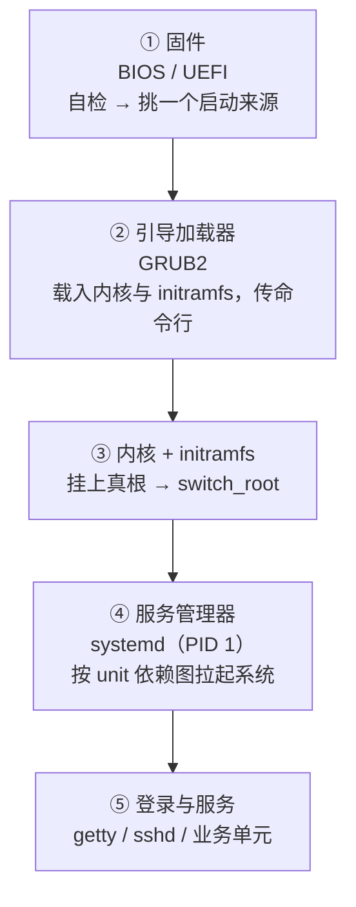

---
tags:
  - Linux
  - 启动流程
  - 内核
  - 学习地图
created: 2026-09-21
---

# 启动流程与内核

## 知识地图

### 一次启动的完整交接

时间主线跟着**控制权**走：从按下电源、固件拿到第一行指令，到内核挂上真根、PID 1 接管，再到登录入口与业务服务出现。

| #   | 阶段            | 谁在跑                              | 它凭什么移交控制权                                              | 移交不出去时会看到什么                                                 | 到这里要能说清                                                  |
| --- | ------------- | -------------------------------- | --------------------------------------------------- | -------------------------------------------------------- | -------------------------------------------------------- |
| 1   | 固件与启动项        | 主板固件                             | UEFI：NVRAM 里的启动项指向 ESP 上的 `.efi`；legacy：设备顺序 + 引导扇区 | 黑屏/蜂鸣、固件报错页、`No bootable device`、直接进固件设置                 | 启动项与引导器文件是"指针 + 实体"，要分别验证                                |
| 2   | 引导加载器         | GRUB2                            | `grub.cfg`（或 BLS 条目）里的菜单项                           | `grub>`（配置坏了）、`grub rescue>`（连模块都没加载）                    | 配置是生成物；`grub.cfg` 与 `/etc/default/grub` 谁是谁的输入           |
| 3   | 内核与 initramfs | `vmlinuz` 与 initramfs 里的 `/init` | 命令行里的 `root=`（加密/LVM/RAID 根还要 `rd.*`）               | `VFS: Unable to mount root fs`、`dracut:/#`、`(initramfs)` | initramfs 解的是什么死锁；`root=` 是哪种标识                          |
| 4   | 服务管理器         | `systemd`（PID 1）                 | unit 依赖图与 `default.target`                          | `emergency.target`、`A start job is running …（1min 30s）`  | target 链、`Requires`/`Wants`/`After` 的分工、`fstab` 怎么变成挂载单元 |
| 5   | 登录与服务         | `getty`、`sshd`、业务单元              | 单元自身启动成功                                            | 没有登录提示符、端口没监听、`systemctl --failed` 有内容                   | `is-enabled` 与 `is-active` 是两个独立问题                       |

**贯穿全章的一个三问**：控制权现在在谁手里；它要靠什么才能把棒交出去；移交不出去时现场在哪个屏幕或哪份日志里。

### 三条跨阶段的核对对象

| 跨阶段的核对对象 | 贯穿内容 | 最后核对 |
| --- | --- | --- |
| 存储标识 | 分区/卷名 → PARTUUID → 文件系统 UUID → `root=` → `fstab` 来源 | 「分区迁移或克隆之后起不来」怎么一次核完三处 |
| 配置的读取时刻 | 内核命令行 → initramfs 内容 → 模块参数 → `sysctl` → unit 文件 | 「配置写了却不生效」先问它什么时候被读 |
| 证据所在介质 | 固件屏/带外日志 → initramfs shell → 内核环缓冲 → journal → `vmcore` → pstore | 「先取证还是先止损」按证据所在介质决定 |

## 术语速查

| 名词 | 一句话解释 | 在哪一篇展开 |
| --- | --- | --- |
| 固件 / POST | 主板上的第一段程序 / 它的加电自检 | 原理：启动链为什么要分成五段 |
| UEFI / legacy BIOS | 两代固件；差别在"从哪里加载引导器" | 原理：启动链为什么要分成五段 · 体系 |
| ESP | EFI System Partition，UEFI 存放引导器的小分区（FAT） | 原理：启动链为什么要分成五段 · 体系 |
| 启动项 | UEFI 存在 NVRAM 里的"设备路径 + `.efi` 文件路径"记录 | 原理：启动链为什么要分成五段 |
| BIOS boot 分区 | GPT 盘在 legacy 模式下放 `core.img` 的约 1 MiB 分区 | 体系 |
| shim / MOK | Secure Boot 下"双方都认"的中间引导器 / 注册自签公钥的机器所有者密钥库 | 原理：内核参数与模块的两套机制 |
| `grub.cfg` / BLS 条目 | 生成的菜单配置 / RHEL 8/9 默认的"一个内核一个小文件"约定 | 原理：启动链为什么要分成五段 · 体系 |
| `grub>` / `grub rescue>` | GRUB 的正常模式 / 精简模式（模块未加载） | 实操 · 判例 |
| `vmlinuz` | 压缩过的内核镜像 | 原理：启动链为什么要分成五段 |
| initramfs / initrd | cpio 归档形式的临时根 / 旧的块设备镜像形式 | 原理：启动链为什么要分成五段 |
| `root=` | 指定根文件系统所在设备的命令行参数 | 原理：从内核到 PID 1 与用户态 |
| `rd.*` | 归 initramfs 用的一组参数前缀（与 `systemd.*` 是两套） | 原理：从内核到 PID 1 与用户态 |
| `/sysroot` / `switch_root` | 停在 initramfs 时真根的挂载点 / 把 `/` 换成真根并启动 PID 1 | 原理：启动链为什么要分成五段 |
| PID 1 | 内核拉起的第一个用户态进程；收不到未安装处理函数的信号 | 原理：从内核到 PID 1 与用户态 |
| target / `default.target` | systemd 的"到达某阶段"单元 / 开机默认终点 | 原理：从内核到 PID 1 与用户态 |
| `Requires=` / `Wants=` / `After=` | 硬依赖 / 软依赖 / 只排序不产生依赖 | 原理：从内核到 PID 1 与用户态 |
| 生成器（generator） | 在单元启动前把非 unit 配置翻译成 unit 的程序 | 原理：从内核到 PID 1 与用户态 · 体系 |
| `nofail` | 让挂载只被 wanted、不被 required，且不被等待 | 原理：从内核到 PID 1 与用户态 · 判例 |
| `emergency.target` / `rescue.target` | 只有根挂载（只读） / 本地文件系统全挂载，两者都要过 `sulogin` | 原理：从内核到 PID 1 与用户态 |
| `rd.break` / `init=/bin/bash` | 停在 initramfs 里 / 不要 systemd 直接起 shell，两者都不过认证 | 原理：从内核到 PID 1 与用户态 |
| `/proc/cmdline` | 本次启动实际收到的内核命令行（启动参数的唯一验收标准） | 原理：内核参数与模块的两套机制 |
| `sysctl` | 读写运行时内核参数的接口，与启动参数是两套东西 | 原理：内核参数与模块的两套机制 |
| `systemd-sysctl` | 开机早期按文件名顺序应用 `/etc/sysctl.d/` 等目录的服务 | 原理：内核参数与模块的两套机制 |
| builtin / `.ko` | 编进内核 / 编成可加载模块 | 原理：内核参数与模块的两套机制 |
| `/etc/modprobe.d/` | 管"模块怎么加载"：`options`、`blacklist`、`install` | 原理：内核参数与模块的两套机制 |
| `modules-load.d` | 管"开机加载谁"，早于 `sysctl` 生效 | 原理：内核参数与模块的两套机制 |
| `depmod -a` | 重建模块依赖表；手工放模块后必须跑 | 原理：内核参数与模块的两套机制 |
| DKMS | 内核升级后自动重编第三方模块的框架 | 治理 |
| Lockdown | Secure Boot 开启时内核切到的受限模式，影响未签名模块与 kexec | 原理：内核参数与模块的两套机制 |
| panic / oops | 内核判定无法继续 / 内核出了错但尽量继续跑 | 原理：崩溃现场为什么留不到重启以后 |
| `kernel.panic` | panic 后等多少秒重启；`0` 表示停在现场 | 原理：崩溃现场为什么留不到重启以后 |
| `kernel.panic_on_oops` | 把 oops 升级成 panic 的开关 | 原理：崩溃现场为什么留不到重启以后 · 治理 |
| `vm.panic_on_oom` | 决定 OOM 是否升级为 panic（默认不） | 原理：崩溃现场为什么留不到重启以后 |
| kdump / `crashkernel=` | 用捕获内核保存崩溃现场 / 为它预留内存的参数 | 原理：崩溃现场为什么留不到重启以后 |
| `vmcore` / `vmcore-dmesg.txt` | 崩溃内存镜像 / 从中抽出的纯文本崩溃前日志（无需调试信息） | 原理：崩溃现场为什么留不到重启以后 |
| kexec | 不经过固件直接换内核的机制，kdump 也用它 | 治理 |
| pstore / ramoops | 写到重启不清空区域的日志后端 | 原理：崩溃现场为什么留不到重启以后 |
| `dmesg` / `journalctl -k` | 内核日志的两个入口（前者是内存环缓冲） | 实操 |
| `journalctl --list-boots` | 能回溯几次启动；只有一条 = 重启即丢现场 | 实操 · 判例 |
| `systemd-analyze` | 把开机时间分成固件/引导器/内核/用户态四段 | 实操 · 体系 |
| `blame` / `critical-chain` | 单元自身耗时排行 / 关键路径（含等待） | 实操 · 体系 |
| `installonly_limit` | RHEL 系限制同时保留几个内核的配置 | 治理 |
| Livepatch / kpatch | 厂商提供的函数级热补丁，用来推迟重启窗口 | 治理 |

## 故障现场定位表

排障的第一问不是「怎么修」，而是「**现在是谁在输出**」。用这张表把现象定位到环节，再进对应篇目。

| 你看到的现象 | 卡在哪一环 | 现场在哪 | 第一反应不要做 |
| --- | --- | --- | --- |
| 黑屏、蜂鸣、固件报错页 | ① 固件 | 物理屏、带外 SEL 日志 | 不要在操作系统里找日志 |
| 直接进入固件设置界面 | ① 固件 | 固件设置、`efibootmgr -v`（UEFI） | 不要重装系统；启动项可能只是丢了 |
| `No bootable device` / `Boot Device Not Found` | ① 固件 | 固件里的设备顺序 | 不要先怀疑系统盘数据；先看顺序是否被 PXE/U 盘顶掉 |
| Secure Boot 签名错误、卡在 MokManager | ① 固件 | 物理屏/带外控制台 | 不要随手关 Secure Boot |
| `grub>` / `error: unknown filesystem` | ② 引导加载器 | GRUB 提示符 | 不要在现场直接改 `grub.cfg` |
| `grub rescue>` | ② 引导加载器 | GRUB 精简模式 | 不要重装引导器或系统；先 `ls` 探明分区 |
| `VFS: Unable to mount root fs` / `dracut-initqueue timeout` / `(initramfs)` | ③ 内核 + initramfs | initramfs shell | 不要只改 `fstab` 就重启 |
| `You are in emergency mode` / `Failed to mount …` | ④ systemd | `journalctl -xb`、失败单元 | 不要盲目重启；根已挂上，是可以动手修的环境 |
| `A start job is running for …（1min 30s）` | ④ systemd | `systemctl list-jobs`、`journalctl -b` | 不要把超时调小了事 |
| 开机明显变慢，说不清哪里慢 | ①–④ 未定 | `systemd-analyze` 的四段分解 + `critical-chain` | 不要照 `blame` 排名去优化 |
| 改了内核参数却不生效 | 核对对象：参数 | `/proc/cmdline`、`sysctl`、配置文件名与编号 | 不要只盯 `/etc/default/grub` 重改一遍 |
| 驱动加载失败、设备不认 | 核对对象：模块 | `journalctl -k -b`、`modinfo`、DKMS 状态 | 不要用 `lsmod` 没有就断定内核不支持 |
| 机器莫名重启过，现场全无 | ③/硬件 | `/var/crash/`、`journalctl --list-boots`、带外事件日志 | 不要"再重启一次看看" |
| 能登录但服务没起来 | ⑤ | `systemctl --failed`、`systemctl status` | 不要先 `restart`，那会覆盖上次失败的现场 |
| 忘记 root 密码 | ②/③ | GRUB 菜单、`rd.break`、recovery | 不要重装系统；这条路径同时是安全事件 |

两个容易被忽略的边界：

- **固件阶段的输出不在操作系统日志里。** POST 报错、RAID 卡自检、网卡 PXE 尝试只出现在物理屏或带外管理（IPMI/iDRAC/iLO）的日志中，`journalctl` 里不可能有。所以"起不来"时要先确认自己在看哪个屏幕。
- **第 ③ 环与第 ④ 环之间有一个语义断层。** `rd.*` 参数归 initramfs 用，`systemd.*` 参数归 PID 1 用；同一个词加不加 `rd.` 前缀，有时是两套不同机制。

## 篇目

| # | 篇目 | 一句话 |
| --- | --- | --- |
| 01 | [[Linux/02_启动流程与内核/01_原理_启动链为什么要分成五段\|原理：启动链为什么要分成五段]] | 五个阶段各自解决什么；initramfs 解决的循环依赖 |
| 02 | [[Linux/02_启动流程与内核/02_原理_从内核到PID1与用户态\|原理：从内核到 PID 1 与用户态]] | 内核的四步、`root=` 的写法、target 与依赖、四种救援入口 |
| 03 | [[Linux/02_启动流程与内核/03_原理_内核参数与模块的两套机制\|原理：内核参数与模块的两套机制]] | 启动参数与运行时参数的分工；模块加载的四道关 |
| 04 | [[Linux/02_启动流程与内核/04_原理_崩溃现场为什么留不到重启以后\|原理：崩溃现场为什么留不到重启以后]] | 三级错误严重程度；让现场留存到重启以后的四类载体 |
| 05 | [[Linux/02_启动流程与内核/05_体系_一次启动的完整交接\|体系：一次启动的完整交接]] | 五段交接按一条主线走完，含三条跨阶段的核对对象与字段读法 |
| 06 | [[Linux/02_启动流程与内核/06_实操_启动观测与故障定位\|实操：启动观测与故障定位]] | 一个问题一把工具、字段怎么读、七类现象的排查方向 |
| 07 | [[Linux/02_启动流程与内核/07_判例_高频误判\|判例：高频误判]] | 现象 → 误判 → 判据 → 出处 |
| 08 | [[Linux/02_启动流程与内核/08_治理_内核基线与启动变更治理\|治理：内核基线与启动变更治理]] | 基线卡、变更记录、升级检查单、参数台账、演练记录 |
| 09 | [[Linux/02_启动流程与内核/09_验收_盲区排查\|验收：盲区排查]] | 八类现象逐层剖析、三条跨阶段的核对对象的四层定位、缺口类型与补法、交付物与核对方式 |

## 参考文档

- `man 7 bootup`、`man 7 systemd.special`、`man 5 systemd.unit`、`man 5 systemd.target`、`man 5 systemd-system.conf`：启动总览、target 体系、依赖语义与默认超时。
- `man 5 fstab`、`man 8 systemd-fstab-generator`、`man 5 systemd.mount`、`man 8 findmnt`、`man 8 mount`：挂载的声明、翻译与事实。
- `man 8 efibootmgr`、`man 8 grub-install`、`man 8 grub-mkconfig`、`man 8 grubby`、`man 8 mokutil`：固件与引导器侧的配置与救援。
- `man 5 sysctl.d`、`man 8 sysctl`、`man 8 systemd-sysctl`、`man 8 modprobe`、`man 5 modprobe.d`、`man 8 modinfo`、`man 8 depmod`、`man 5 modules-load.d`：两套内核参数与模块。
- `man 8 dracut`、`man 5 dracut.conf`、`man 1 lsinitrd`（RHEL 系）；`man 8 update-initramfs`、`man 1 lsinitramfs`、`man 7 initramfs-tools`（Debian/Ubuntu 系）。
- `man 8 sulogin`、`man 8 systemd-sulogin-shell`、`man 1 systemctl`：救援入口与认证。
- `man 1 kexec`、`man 8 kdumpctl`、`man 5 kdump.conf`、`man 8 makedumpfile`、`man 1 crash`、`man 1 journalctl`、`man 5 journald.conf`、`man 1 dmesg`：崩溃取证与证据留存。
- `man 5 os-release`、`man 1 uname`、`man 8 lsblk`、`man 8 blkid`、`man 8 fdisk`、`man 1 systemd-analyze`：基线、设备与耗时。
- 内核 6.x 文档 `Documentation/admin-guide/kernel-parameters.rst`、`Documentation/admin-guide/initrd.rst`、`Documentation/admin-guide/kdump/`、`Documentation/admin-guide/sysctl/`、`Documentation/admin-guide/module-signing.rst`、`Documentation/process/stable-kernel-rules.rst`。内核文档一律按与目标机器同一主版本取（当前基线 6.x）——同一条路径在不同版本里可能同名而内容不同。

