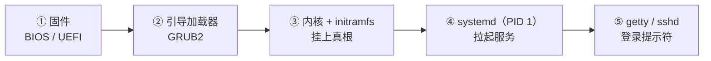

---
tags:
  - Linux
  - 启动流程
  - 内核
  - 学习地图
  - 运维面试
created: 2026-09-18
---

# 启动流程与内核

> [!cite] 参考资料
> `man 7 bootup`、`man 7 systemd.special`、`man 5 sysctl.d`、`man 8 dracut`、`man 5 dracut.conf`、`man 8 kdumpctl`（RHEL 系），以及发行版官方文档中的 "Managing the kernel"、"Working with GRUB 2"、"Kernel crash dump" 三章。
>
> 本笔记与全部子笔记的结论来自上述资料，**命令输出尚未在实验机上逐条实测**；本机结果与文中不一致时以本机为准，并回填到对应小节。

> 本笔记对应《Linux 运维学习大纲》的「阶段 2：启动流程、内核与系统初始化」。
>
> **本页是子目录 `02_启动流程与内核/` 的 00 号导读，不是全部正文。** 知识脉络、生产技能地图、术语速查、故障现场定位表都在这一页；逐项深入的正文按知识点拆成子笔记，索引见第 7 节。
>
> **读者定位：刚入职的运维/SRE。** 假设你会基本 shell、用过 `systemctl` 和 `top`，但没碰过固件、分区和内核机制。这一章要补的前置知识在第 1.3 节，并单独成篇（子笔记 01–03）。
>
> 说明：命令、默认值与行为以 man 页和发行版官方文档为准；凡涉及默认值、内核差异与发行版差异的地方都标注适用环境（本文以 **RHEL 8/9 系** 与 **Debian/Ubuntu LTS 系** 两个目标环境为主线）。文中「预期输出」目前仍是文档值而非实测值，资料出处与实测状态见本页开头的「参考资料」。

> [!info] 读之前：先自检三条前提
> 1. **一台可快照的实验机**（虚拟机即可）。破坏性操作只在它上面做；没有的话，子笔记 06、07、11 里的动手部分只看不动。
> 2. **能进控制台**：虚拟机串口/图形控制台、带外管理（IPMI/iDRAC/iLO）或云厂商 VNC。启动流程的排障全部发生在登录之前，只靠 SSH 够不着现场。
> 3. **会最基本的 `mount`、`lsblk`、`journalctl`**：知道「挂载」是把文件系统接到目录树上、`/etc/fstab` 记录开机要挂哪些目录。
>
> 第 3 条不满足 → 先读子笔记 01–03；第 1、2 条不满足 → 先读阶段 1《实验环境与操作纪律》。

## 0. 30 秒速览

> [!abstract] 这一章只要记住六句话
> - **启动链只有五环**：固件（BIOS/UEFI）→ GRUB2 → 内核 + `initramfs` → `systemd`（PID 1）→ `default.target`。前两环归固件管；**从内核开始，就是操作系统自己在给自己接生**。
> - **每一环失败了都有各自的「现场」**：固件看物理屏与带外日志，GRUB 看 `grub>` / `grub rescue>`，内核看 `dracut:/#`，systemd 看 `emergency.target` 与 `journalctl -xb`。判断故障的第一问永远是「**现在是谁在输出**」。
> - **`initramfs` 是微缩 Linux**：它唯一的关键任务，是把「挂载真正根文件系统所需的驱动」装进内存。根分区迁移、换存储控制器、内核升级后起不来，十次有八次是它没跟上。
> - **存在两套「内核参数」**：`/proc/cmdline` 里的启动参数只在启动那一瞬间生效；`sysctl` 改的是运行时参数。名字相似，机制完全不同，改错地方就会「配置写了但没生效」。
> - **改启动参数**：临时改在 GRUB 菜单按 `e`；持久改要动 `/etc/default/grub`（Debian 系再 `update-grub`，RHEL 系 `grub2-mkconfig`），改完用 `cat /proc/cmdline` 复查——它是唯一的验收标准。
> - **先取证，再动手**：panic 与启动失败的第一手证据在 `journalctl -b -1`、`dmesg` 的引导段、`vmcore` 里，重启一次就没了。**救援通道要在故障之前就演练过、写进巡检**，而不是出事再找。

> [!tip] 这一页怎么用：三条入口
> - **系统学（推荐，按阶段 2 的 3~5 天）**：从第 3 节的「四级训练台阶」开始，T0 → T4 逐级往上；每一级都用第 2 节的技能表核对交付物。
> - **出事急救**：直接看第 6 节「故障现场定位表」，定位到环节后进对应子笔记的排障小节。
> - **面试速览**：第 0 节 + 第 1 节 + 第 5 节术语表 + 各子笔记末尾的自测卡。

## 1. 知识地图（第一条主线）

### 1.1 五环接力赛

先只看主干、不展开细节：从按下电源到出现登录提示符，控制权只经过五环，**每一环的产出就是下一环的输入**。

| # | 环节 | 谁在跑 | 这一环的产出 |
| --- | --- | --- | --- |
| 1 | 固件自检与启动项 | BIOS/UEFI（主板固件） | 找到启动项，把控制权交给引导加载器 |
| 2 | 引导加载器 | GRUB2 | 载入内核与 `initramfs`，并把内核命令行一起传下去 |
| 3 | 内核初始化 + `initramfs` | `vmlinuz` 与 initramfs 里的 `/init` | 挂上真正的根文件系统，切换过去（`switch_root`） |
| 4 | 系统初始化 | `systemd`（PID 1） | 按 unit 与 `fstab` 挂文件系统、拉起服务 |
| 5 | 登录与服务 | `getty` / `sshd` / 业务单元 | 给出登录入口或对外服务 |

**这一章真正要练出来的，是同一个三问：**

1. **控制权现在在谁手里？** —— 决定了你面对的是固件、GRUB、initramfs 还是 systemd。
2. **它要靠什么才能把接力棒交出去？** —— 决定了这一环的依赖是什么（启动项、`grub.cfg`、`root=` 设备、`fstab`）。
3. **交不出去的时候，现场在哪个屏幕或哪份日志里？** —— 决定了第一步取证去哪。

把这三问记住，后面每一节你都能自己往里填内容，而不是背五张表。

### 1.2 三条横切线

五环是时间线，但有几件事会横穿多个环节。新人最容易「每一环都看过、却串不起来」，就是因为没抓住这三条线：

| 横切线 | 贯穿内容 | 收口于 | 主要子笔记 |
| --- | --- | --- | --- |
| **存储线** | 分区 → 文件系统 → 挂载 → 根设备定位 | 为什么 `root=UUID=` 写错就起不来 | 01、02、06、11 |
| **内核线** | 内核镜像 → 模块 → 启动参数 → 升级/回滚/取证 | 内核升级后起不来怎么办 | 03、08、09、10 |
| **服务线** | PID 1 → target → unit | 系统起来了、服务却没好 | 03、07、11（深水区在阶段 8） |

### 1.3 前置地基

以下三块是读懂五环的最低门槛。**它们不是「扩展阅读」，是必修**——缺哪块补哪块，再回来看主线。

| 前置篇 | 你要先建立的概念 | 对应子笔记 |
| --- | --- | --- |
| 硬件与固件 | 一台机器里谁先动；BIOS/UEFI 的区别；磁盘、分区、块设备名是什么 | [[Linux/02_启动流程与内核/01_前置_硬件固件与磁盘分区\|01 前置：硬件、固件与磁盘分区]] |
| 文件系统与挂载 | 分区 ≠ 文件系统；挂载是把文件系统接到目录树上；`/etc/fstab` 是什么 | [[Linux/02_启动流程与内核/02_前置_文件系统挂载与fstab\|02 前置：文件系统、挂载与 fstab]] |
| 内核与进程 | 内核管什么；`/proc` 是内核的窗口；PID 1 为什么特殊；日志怎么看 | [[Linux/02_启动流程与内核/03_前置_内核进程与观测命令\|03 前置：内核、进程与观测命令]] |

## 2. 生产技能地图（第二条主线）

知识和技能是两条线。**读完不等于会做**，所以这一章明确交付 8 项技能，每项都有可观察的行为和一个交付物。学每一篇的时候，对照这张表看自己在练哪一项。

| # | 技能 | 可观察的行为 | 在哪几篇练 | 交付物 |
| --- | --- | --- | --- | --- |
| S1 | 观测与建基线 | 拿到一台陌生机器，10 分钟内说清它的启动配置 | 01、02、03、04 | 一份本机启动基线卡 |
| S2 | 变更与回滚 | 独立完成内核参数持久化、initramfs 重建、内核升级，每步有验证与回滚 | 06、08、09 | 一份带回滚命令的变更记录 |
| S3 | 取证 | 故障时先取证据，并说得出哪些证据重启即失 | 02、03、10、11 | 一次历史日志复盘记录 |
| S4 | 分层定位 | 给一个现象，10 分钟内判定卡在五环的哪一环 | 08、10、11 + 全部主线篇 | 一份限时定位记录 |
| S5 | 救援通道 | 会规划并用带外管理/串口/救援介质；能在 GRUB 命令行手工引导 | 04、05、07、11 | 一次救援通道验证记录 |
| S6 | 恢复操作 | 在实验机完成 `rd.break` 改密码、`fstab` 写坏后的恢复、旧内核回滚 | 06、07、11 | 一份故障演练记录（含耗时） |
| S7 | 风险与止损判断 | 分得清「先取证还是先止损」；知道哪些操作属于安全事件 | 07、09、11（贯穿全章） | 演练中的决策记录 |
| S8 | 沉淀 | 把一次处置写成 Runbook 片段：现象、证据、根因、回滚、巡检项 | 全部（每篇一次的收尾动作） | 至少一段 Runbook 片段 |

这 8 项里，S1、S3、S7 是**判断力**，S2、S5、S6 是**操作力**，S4 是把两者收敛到结论的能力，S8 是把它变成组织资产的能力。新人通常卡在 S3、S4、S7——这三项没有命令清单可背，只能靠带反馈的练习。

## 3. 四级训练台阶

技能靠难度递增、风险可控的重复练习获得。**每一级都写明了在哪台机器上做**，这条边界本身就是 S7 的训练内容。

| 台阶 | 做什么 | 在哪台机器 | 交付物 |
| --- | --- | --- | --- |
| **T0 读通** | 画出五环；说清每环失败时的现象与现场 | 纸面/白板 | 自己画的一张启动链图 |
| **T1 观测** | 采集版本基线、`/proc/cmdline`、根设备、initramfs 类型；跑只读排障命令；检查日志是否持久化 | **生产机可以做（只读）** | 本机启动基线卡 |
| **T2 可回滚变更** | 内核参数持久化、重建 initramfs、加载/禁用模块 | 实验机 | 变更记录（含回滚与耗时） |
| **T3 故障注入与恢复** | 写坏 `fstab`、`rd.break` 改密码、触发 panic 取证 | **可快照实验机** | 演练记录 |
| **T4 限时模拟** | 给一个现象，10 分钟定位到环节，并写出处置记录 | 实验机 + 计时 | 一份排障报告 |

> [!warning] 一条不能破的边界
> **只有 T1 允许在生产机上做，而且全程只读**（`cat`、`ls`、`journalctl`、`systemd-analyze` 这类）。T2 到 T4 一律在实验机，动手前先打快照。
>
> 生产上唯一「看起来像 T2」的例外是应急止损（例如紧急模式下改回来一行 `fstab`）——那属于事故处置，不属于练习，事后要按 S8 补记录。

## 4. 学习路线

**系统学的三遍读法（对应 00_学习大纲 给的 3~5 天）：**

- **第一遍（约半天，建立直觉，只读）**：第 1 节 → 前置 01–03 的「只读观测」动作 → 子笔记 04、05、06、07 的概念部分 → T1 基线卡。
- **第二遍（约一天，接上参数与模块）**：子笔记 06 的生产动作 → 08（参数与模块）→ 07 的救援入口 → 11 的定位表 → T2 变更。
- **第三遍（在快照实验机上）**：09（升级与回滚）→ 10（崩溃取证，可跳过）→ 11 的处置流程 → T3、T4。

**只想解决手头问题的快捷入口：**

| 你的问题 | 去哪 |
| --- | --- |
| 机器根本起不来，现在怎么办 | 第 6 节 → 子笔记 11 |
| 开机特别慢 | 子笔记 07、11（深水区在阶段 10） |
| 内核升级后新内核起不来 | 子笔记 09 |
| 改了参数却不生效 | 子笔记 08 |
| 系统起来了但服务没起 | 子笔记 07，深水区在阶段 8 |
| 机器异常重启过，想查原因 | 子笔记 10、11 |

## 5. 术语速查

> [!info]- 名词速查（读到哪里卡住，就回这里查）
> | 名词 | 一句话解释 | 在哪一节展开 |
> | --- | --- | --- |
> | POST | 加电自检，主板固件开机后做的第一件事 | 01、04 |
> | BIOS / UEFI | 主板固件；UEFI 是较新的那套，通常配 GPT 分区表 | 01、04 |
> | ESP | EFI System Partition，UEFI 用来存放引导器文件的小分区（FAT32） | 01、04 |
> | MBR | 传统 BIOS 时代的分区表与引导记录 | 01、04 |
> | `grubx64.efi` / `boot.img` | UEFI / BIOS 下被固件加载的那个 GRUB 文件 | 04、05 |
> | `grub.cfg` | GRUB 的配置，记录菜单项与内核命令行 | 05、08 |
> | `vmlinuz` | 压缩过的内核镜像文件 | 03、06 |
> | `initramfs` | 内存里的临时根文件系统，负责挂上真根 | 06 |
> | `switch_root` | initramfs 把控制权交给真根的动作 | 06 |
> | `/sysroot` | 停在 initramfs 阶段时，真根被挂载的位置 | 06、11 |
> | PID 1 / `systemd` | 内核拉起的第一个用户态进程，所有服务的祖先 | 03、07 |
> | `target` / `default.target` | systemd 的「启动目标」，相当于旧说法的运行级别 | 07 |
> | `emergency.target` / `rescue.target` | 两种救援模式，区别在文件系统挂了多少 | 07、11 |
> | `rd.break` | 内核命令行参数，让启动停在 initramfs 阶段 | 06、07、11 |
> | `sulogin` | 救援模式启动前要求输入 root 密码的程序 | 07 |
> | `/proc/cmdline` | 本次启动实际使用的内核命令行 | 03、08 |
> | `grubby` | RHEL 系改启动项的工具，不依赖 `grub.cfg` 的具体路径 | 05、08 |
> | `sysctl` | 读写运行时内核参数的接口，与启动参数是两套东西 | 08 |
> | `dmesg` / `journalctl -k` | 内核日志的两个入口 | 03、11 |
> | `builtin` / `.ko` | 驱动编进内核 / 编成可加载模块 | 03、08 |
> | DKMS | 内核升级后自动重编第三方模块的框架 | 08、09 |
> | `kexec` | 不经过固件直接换内核重启的机制，kdump 也用它 | 09、10 |
> | `crashkernel=` / `vmcore` | 为 kdump 预留的内存 / panic 时抓到的内存镜像 | 10 |
> | `crash` | 分析 `vmcore` 的工具，需要匹配版本的 debuginfo | 10 |
> | `nofail` / `x-systemd.device-timeout=` | fstab 挂载项参数，避免一个可选挂载拖死启动 | 02、11 |

## 6. 故障现场定位表

排障的第一问不是「怎么修」，而是「**现在是谁在输出**」。用这张表把现象定位到环节，再进对应子笔记。

| 你看到的现象 | 卡在哪一环 | 现场在哪 | 第一反应不要做 | 去哪一篇 |
| --- | --- | --- | --- | --- |
| 黑屏、蜂鸣、`No bootable device` | 1 固件 | 物理屏、带外 SEL 日志 | 不要拔盘重装系统 | 04 |
| `grub>` / `grub rescue>` / `error: unknown filesystem` / `attempt to read or write outside of disk 'hd0'` | 2 引导加载器 | GRUB 自己的提示符 | 不要在 GRUB 阶段就重装引导器 | 05 |
| `VFS: Unable to mount root fs` / `dracut-initqueue timeout` / `dracut:/#` | 3 内核 + initramfs | initramfs shell、`/run/initramfs/rdsosreport.txt` | 不要只改 `fstab` 就重启 | 06 |
| `You are in emergency mode` / `Failed to mount ...` / `Dependency failed for local-fs.target` | 4 systemd | `emergency.target` 里 `journalctl -xb` | 不要在紧急模式里盲目重启 | 07、11 |
| `A start job is running for ... (1min 30s)` | 4 systemd | `systemctl list-jobs`、`journalctl -b` | 不要直接调大超时了事 | 11 |
| 机器莫名重启过，现场全无 | 5 / 内核崩溃 | `/var/crash/`、`journalctl -b -1` | 不要「再重启一次看看」 | 10 |
| 改了内核参数却不生效 | 变更层面 | `/proc/cmdline`、生成的 `grub.cfg` | 不要只盯着 `/etc/default/grub` | 08 |
| 能登录，但服务没起来 | 5 | `systemctl --failed` | 不要重装或重启了事 | 07、11 |

两个容易被忽略的边界：

- **固件阶段的输出不在操作系统日志里。** POST 报错、RAID 卡自检、网卡 PXE 尝试只出现在带外管理（IPMI/iDRAC/iLO）的 SEL 日志或物理屏上，`journalctl` 里看不到。所以「起不来」时要先确认自己在看哪个屏幕。
- **第 3 环与第 4 环之间有一个语义断层。** `rd.*` 参数归 initramfs 用，`systemd.*` 参数归 PID 1 用；同一个词加不加 `rd.` 前缀，有时是两套不同机制（`systemd.unit=` 与 `rd.systemd.unit=` 就是典型）。

## 7. 子笔记索引

| # | 子笔记 | 一句话 | 主要技能 | 难度 |
| --- | --- | --- | --- | --- |
| 01 | [[Linux/02_启动流程与内核/01_前置_硬件固件与磁盘分区\|前置：硬件、固件与磁盘分区]] | 从按下电源到「看到一个块设备」 | S1 | 前置 |
| 02 | [[Linux/02_启动流程与内核/02_前置_文件系统挂载与fstab\|前置：文件系统、挂载与 fstab]] | 从块设备到「挂到目录树上」 | S1、S3 | 前置 |
| 03 | [[Linux/02_启动流程与内核/03_前置_内核进程与观测命令\|前置：内核、进程与观测命令]] | 内核是什么、PID 1 是什么、日志怎么看 | S1、S3 | 前置 |
| 04 | [[Linux/02_启动流程与内核/04_第1环_固件与启动项\|第 1 环：固件与启动项]] | 固件如何找到并交出控制权 | S1、S5 | 核心 |
| 05 | [[Linux/02_启动流程与内核/05_第2环_GRUB2引导加载器\|第 2 环：GRUB2 引导加载器]] | 菜单、配置与命令行救援 | S2、S5 | 核心 |
| 06 | [[Linux/02_启动流程与内核/06_第3环_内核与initramfs\|第 3 环：内核与 initramfs]] | 挂根的死锁、initramfs 的重建与排障 | S2、S6 | 核心 |
| 07 | [[Linux/02_启动流程与内核/07_第4-5环_systemd与登录\|第 4–5 环：systemd 与登录]] | target 体系与四种救援入口 | S5、S6、S7 | 核心 |
| 08 | [[Linux/02_启动流程与内核/08_内核参数与内核模块\|内核参数与内核模块]] | 两套参数、模块加载与禁用 | S2、S4 | 核心 |
| 09 | [[Linux/02_启动流程与内核/09_内核升级回滚与热补丁\|内核升级、回滚与热补丁]] | 升级四步、保留退路、kexec/Livepatch | S2、S7 | 核心 + 进阶 |
| 10 | [[Linux/02_启动流程与内核/10_崩溃取证_kdump与vmcore\|崩溃取证：kdump 与 vmcore]] | panic 的现场怎么留下来、怎么读 | S3、S4 | 进阶 |
| 11 | [[Linux/02_启动流程与内核/11_启动故障处置手册\|启动故障处置手册]] | 跨环排障：现象 → 分层 → 证据 → 处置 | S3、S4、S7、S8 | 核心 |
| 12 | [[Linux/02_启动流程与内核/12_动手实验与要点自测\|动手实验与要点自测]] | 六个实验的索引与总自测 | 全部 | 汇总 |

## 自检清单

- [x] frontmatter 有 `tags` 和 `created`，全篇只有一个一级标题
- [x] 速览卡 6 条，每条都是结论 + 可复现的证据
- [x] 涉及默认值、内核行为或版本差异的地方都标注了适用版本与发行版
- [x] 跨笔记引用都用 wikilink；跨目录引用用路径写法
- [x] 阶段 2 已按「主笔记（地图）+ 子笔记（正文）」拆分，索引完整
- [x] 知识主线（五环 + 三条横切线）与技能主线（S1–S8 + T0–T4）都在本页可见
- [ ] 全部 12 篇子笔记写完，且本页每一条子笔记链接都能解析
- [ ] 第 6 节的每一种现象都在对应子笔记里演练过一次
- [ ] 每张 Mermaid 图都在 Obsidian 里预览过，能正常渲染
