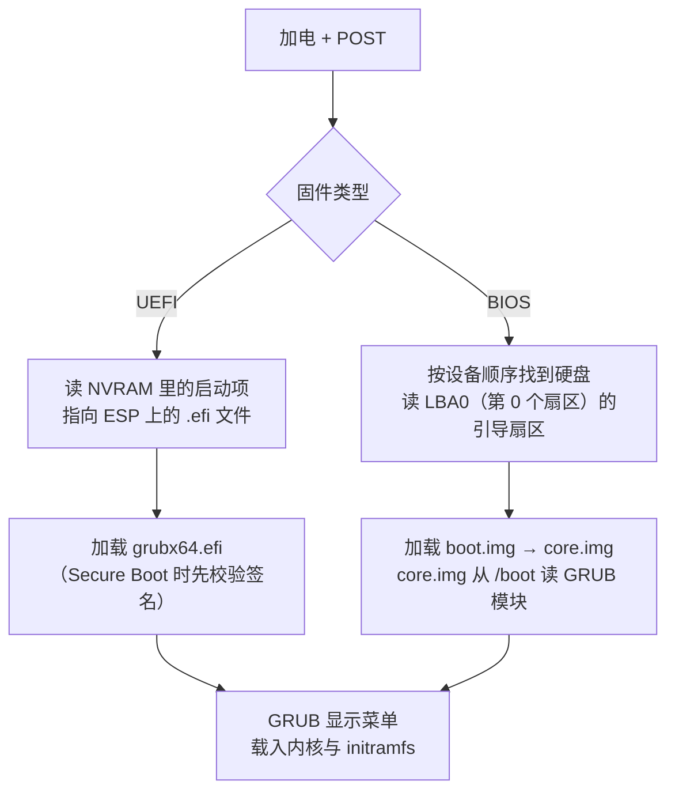

---
tags:
  - Linux
  - 启动流程
  - 前置知识
created: 2026-09-18
---

# 前置：硬件、固件与磁盘分区

> [!cite] 参考资料
> `man 8 lsblk`、`man 8 blkid`、`man 8 efibootmgr`、`man 8 fdisk`、`man 8 parted`、`man 8 findmnt`；UEFI 规范中关于 ESP 与启动项的部分；发行版官方文档的 "Working with GRUB 2" 一章。
>
> 本篇结论来自上述资料，**命令输出尚未在实验机上逐条实测**；本机结果与文中不一致时以本机输出为准，并回填到对应小节。

> **这篇讲什么**：从按下电源键到「操作系统看到一个块设备」，中间是谁在干活。这是读懂启动链第 1、2 环的地基。
>
> **必须先读什么**：无。这是整章的起点，只需要会基本 shell。
>
> **读完能回答**：① BIOS 和 UEFI 到底差在哪？② 机器是怎么「知道该从哪启动」的？③ 为什么生产上不许用 `/dev/sdX` 挂载？
>
> 所属：[[Linux/02_启动流程与内核/00_导读与知识地图|02 启动流程与内核]] 的 1.3 前置地基 · 主要练 **S1 观测与建基线**

## 0. 30 秒速览

> [!abstract] 这一篇只要记住四句话
> - **固件是开机后跑的第一段程序**，它住在主板上，不属于任何操作系统。它的任务只有一件：检查硬件，然后把控制权交出去。
> - **UEFI 与 BIOS 是两代固件**，最实际的差别是「从哪里加载引导器」：UEFI 读 ESP 分区里的 `.efi` 文件，BIOS 读磁盘最前面的引导扇区。
> - **分区不等于文件系统。** 分区是磁盘上的一段区间，文件系统是这段区间里的组织方式；两者是两步操作，对应 `fdisk` 和 `mkfs`。
> - **`/dev/sda` 这种名字不稳定。** 插槽顺序、控制器、云盘挂载顺序一变就变，所以生产上一律用 UUID 或 LABEL 定位设备——这是第 3 环「找不到根设备」问题的源头。

## 1. 一台机器里，谁先动

### 1.1 硬件的分工

先建立一个最小模型。开机时真正按顺序登场的角色只有这几个：

| 角色               | 是什么                        | 开机时负责什么                                     |
| ---------------- | -------------------------- | ------------------------------------------- |
| CPU              | 执行指令                       | 加电后从固定地址取第一条指令——那条指令属于固件，不属于操作系统            |
| 内存（RAM）          | 运行时的临时存储                   | 加电时内容无意义，需要固件初始化后才能使用                       |
| 主板固件             | 烧在主板 flash 里的程序（BIOS/UEFI） | 自检、初始化硬件、找启动项、把控制权交出去                       |
| 磁盘/块设备           | 持久化存储                      | 存放引导器、内核和根文件系统；**开机时操作系统还不会读它，是固件先读**       |
| 外设（网卡、RAID 卡、显卡） | 可选                         | 有些带自己的固件（Option ROM），会在主板固件之后、操作系统之前抢一次执行机会 |

理解这张表的要点是：**操作系统不是自己启动的，是被固件「挑出来」并交棒的**。这也是为什么固件阶段出问题时，`journalctl` 里什么都看不到。

### 1.2 固件与 POST

**固件（firmware）** 是出厂就烧在主板上的程序，用户平时看不到它，但它决定了这台机器能不能开始启动。

加电后它做的第一件事叫 **POST（Power-On Self-Test，加电自检）**：检查 CPU、内存、显卡、控制器是否可用。POST 的结果只出现在两个地方——**物理屏幕/串口**和**带外管理（IPMI/iDRAC/iLO）的日志**，不在操作系统日志里。

POST 通过后，固件按 **启动顺序（boot order）** 逐个尝试启动项，找到第一个可用的就把控制权交出去，自己退场。

> [!important] 「起不来」的第一条分界线
> 如果你还能看到操作系统输出（内核日志、systemd、登录提示符），说明固件和引导器都已经成功交接了——问题在后面几环。
> 如果连输出都没有，或者停在 `No bootable device` 这类文案上，问题在固件或引导器，**这时候去看 `journalctl` 是白费力气**。

### 1.3 启动顺序和启动项

固件怎么决定「从哪里启动」？两代固件的答案不同，但思路一样：维护一个候选列表，按顺序试。

- **UEFI**：启动项（Boot Entry）存在主板 NVRAM 里，形如 `Boot0001: ubuntu`，指向 ESP 分区上的某个 `.efi` 文件。用 `efibootmgr -v` 能看。
- **BIOS/legacy**：没有「启动项」这个概念，只有设备顺序（硬盘、光驱、网卡 PXE），轮到某块盘时就读它的引导扇区。

服务器上常见的第三个来源是 **PXE 网络启动**：固件里的网卡固件（Option ROM）先从网络拿一个引导程序。云主机和裸金属无人值守安装都用它。排障时如果机器莫名其妙进不了本地系统，先确认 PXE 是不是排在硬盘前面。

## 2. BIOS 与 UEFI：两代固件

### 2.1 差别对照

| 维度 | BIOS（legacy） | UEFI |
| --- | --- | --- |
| 引导器文件放哪 | 磁盘最前面的引导扇区（MBR）与分区间隙 | ESP 分区（FAT32）里的 `.efi` 文件 |
| 引导器文件叫什么 | `boot.img` / `core.img` | `grubx64.efi`（不同发行版路径不同） |
| 启动项存哪 | 无独立启动项；靠设备顺序 | 主板 NVRAM，用 `efibootmgr` 管理 |
| 通常搭配的分区表 | MBR（也能带 GPT，需要额外的 BIOS boot 分区） | GPT（也能从 MBR 盘启动） |
| 安全启动 | 无 | 有 Secure Boot，固件校验引导器签名 |
| 怎么看自己在哪种模式 | `ls /sys/firmware/efi` 不存在 | `ls /sys/firmware/efi` 存在 |

最后一行是最实用的判据，**一线排障时先跑它**：

```bash
ls /sys/firmware/efi                      # 验证：目录存在 = 以 UEFI 模式启动；不存在 = legacy BIOS 模式
efibootmgr -v                             # 验证：UEFI 模式下查看启动项顺序与每条指向的 .efi 文件（需要 root）
```

预期分两种情况看：

- **UEFI 机器**：第一条命令会列出 `efi`、`efivars` 等条目；`efibootmgr -v` 会输出形如 `Boot0001* ubuntu HD(1,GPT,<PARTUUID>)/File(\EFI\ubuntu\shimx64.efi)` 的行。
- **legacy 机器**：`efibootmgr` 会直接报错说找不到 EFI 变量——**报错本身就是结论**，说明这台机器不是 UEFI 启动，后面要按 BIOS 那套路径去查。

### 2.2 ESP：UEFI 的引导器仓库

**ESP（EFI System Partition）** 是 UEFI 专门用来放引导器的小分区，格式是 FAT 系列（实际上基本都是 FAT32），通常 100~600 MiB（约等于常说的 100~600 MB），挂载在 `/boot/efi`。

它有个很容易踩的坑：**空间很小，而且内核升级会往相关分区写文件**。很多人 `/boot` 分了 1 GiB 却忘了 ESP 也要参与引导器更新，等到装新引导器时才发现写不进去。

```bash
findmnt /boot/efi                         # 验证：ESP 挂载在哪个设备、什么文件系统（没有输出说明这台机器可能不是 UEFI 启动）
findmnt /boot                            # 验证：/boot 是否单独分区、剩余空间有多少（配合 df -h /boot 看）
```

### 2.3 两条启动路径



注意这张图的终点：**两条路最后都汇到 GRUB**。所以「机器起不来」时，先判断自己停在岔路的哪一段——是固件没找到启动项，还是 GRUB 已经跑起来但配置有问题。两者的现场完全不同（前者是黑屏/固件提示，后者是 `grub>` 提示符）。

## 3. 磁盘、分区与块设备

### 3.1 块设备是怎么命名的

操作系统看到磁盘时，会给它一个名字。名字的格式直接暴露了这块盘的来路：

| 名字 | 来自哪里 | 分区怎么表示 |
| --- | --- | --- |
| `/dev/sda` | SATA / SAS / SCSI / USB 盘 | `/dev/sda1`、`/dev/sda2` |
| `/dev/vda` | 虚拟化平台半虚拟化（virtio）磁盘 | `/dev/vda1` |
| `/dev/nvme0n1` | NVMe SSD | `/dev/nvme0n1p1`（**注意有 p**） |
| `/dev/mmcblk0` | eMMC / SD 卡 | `/dev/mmcblk0p1` |
| `/dev/mapper/vg-root` | LVM 逻辑卷、或 dm-crypt 解密后的设备 | 不分分区，本身就是设备 |
| `/dev/md0` | Linux 软 RAID 阵列 | 阵列本身是设备 |

> [!important] 名字能用来看，不能用来当标识
> `/dev/sda` 里的 `a` 取决于内核枚举顺序，插拔硬盘、换控制器、换虚拟化平台都可能改变它。**把 `/dev/sdb1` 写进 `/etc/fstab`，是「重启后挂载错盘」甚至「起不来」的经典原因。**
> 生产上一律用 UUID / PARTUUID / LABEL 定位设备。

### 3.2 分区表：MBR 与 GPT

磁盘要被操作系统使用，先要划分成**分区**，记录这些划分的表就是分区表。

| 维度    | MBR                            | GPT                             |
| ----- | ------------------------------ | ------------------------------- |
| 分区表位置 | 磁盘第 0 扇区（512 字节，其中引导代码 446 字节） | 磁盘开头与结尾各一份（主表 + 备份表），带 CRC32 校验 |
| 分区数量  | 最多 4 个主分区（可用扩展分区突破）            | 默认 128 个                        |
| 容量上限  | 512 字节扇区下约 2 TiB               | 极大（受操作系统限制，而非分区表）               |
| 通常搭配  | legacy BIOS                    | UEFI                            |

两点补充，面试和排障都用得上：

- **MBR 的 4 个主分区限制**是它被淘汰的主因之一，不是「容量小」一条。
- **GPT 有备份**：GPT 的尾部有一份备份头。所以磁盘尾部被人为写坏、或者用工具缩过盘，可能出现「主表能读、备份表不匹配」的告警，需要用 `gdisk`/`sgdisk` 修复重建。

### 3.3 分区 ≠ 文件系统

这是新人最常见的混淆点，用一句话分开。下面会用到「扇区」这个词——它是磁盘读写的最小单位，**LBA0 就是第 0 个扇区**，也就是磁盘最开头那 512 字节：

> **分区是「划出一块地」，文件系统是「在这块地上盖好房子」；挂载才是「把房子接上水电」。**

对应到三步操作：

| 步骤 | 做什么 | 典型命令 | 风险 |
| --- | --- | --- | --- |
| 分区 | 在磁盘上划出区间 | `fdisk` / `parted` / `sgdisk` | 高，写错会丢分区表 |
| 格式化 | 在区间里建立文件系统 | `mkfs.ext4` / `mkfs.xfs` | **极高，会清空该分区数据** |
| 挂载 | 把文件系统接到目录树上 | `mount` | 低，卸载即还原 |

> [!danger] 这一步只在实验机做
> `mkfs` 的破坏性是不可逆的，`fdisk` 写错分区表也可能让整盘数据无法访问。这一篇的动手部分**只有只读观测**；分区与格式化只在可快照的实验机上做，并且要拿下图里的空闲盘，不要碰系统盘。

### 3.4 设备标识：UUID / PARTUUID / LABEL

既然设备名不稳定，就用内容里的标识来定位：

| 标识 | 属于谁 | 什么时候变 | 用在哪 |
| --- | --- | --- | --- |
| **UUID** | 文件系统 | 重新 `mkfs` 会变 | `/etc/fstab` 挂载、`root=` 内核参数（最常用） |
| **PARTUUID** | 分区 | 重建分区表会变 | GPT 环境下的 UEFI 启动项、部分 `root=PARTUUID=` 场景 |
| **LABEL** | 文件系统 | 手工改名才变 | 可读性好，但容易重名，生产上少用 |
| `/dev/sdX` | 内核枚举顺序 | 随时可能变 | **禁止用于持久配置** |

```bash
ls -l /dev/disk/by-uuid/                  # 验证：UUID → 设备名的映射（软链指向真实的 /dev/sdX）
lsblk -o NAME,SIZE,TYPE,FSTYPE,MOUNTPOINTS,UUID,PARTUUID   # 验证：一次看全设备、分区、文件系统、挂载点与两种 UUID
blkid                                    # 验证：所有已识别文件系统的 UUID/TYPE/LABEL（需要 root 才能看全）
```

## 4. 生产动作：给一台陌生机器建「固件与存储基线」（S1）

> [!example]+ 生产动作：接手一台机器时，先弄清它的启动模式与磁盘布局
> **什么时候用**：接手新机器、迁移系统、做根分区变更之前；也是 T1 台阶的一部分。
>
> **动手前确认**：全部命令只读，**生产机上可以做**。`efibootmgr`、`fdisk -l`、`blkid` 需要 root 或 sudo。
>
> **怎么做**：
> ```bash
> ls /sys/firmware/efi                      # 验证：UEFI 还是 legacy BIOS
> lsblk -o NAME,SIZE,TYPE,FSTYPE,MOUNTPOINTS,UUID,PARTUUID   # 验证：磁盘、分区、文件系统、挂载点、UUID
> findmnt /                                 # 验证：根文件系统挂在哪个设备上（后面 root= 的依据）
> df -h /boot /boot/efi 2>/dev/null          # 验证：/boot 与 ESP 的剩余空间
> cat /proc/cmdline                          # 验证：本次启动实际使用的内核命令行（含 root=）
> ```
>
> **怎么验证**：把输出整理成一张表——启动模式（UEFI/legacy）、根设备（UUID 与设备名）、`/boot` 与 ESP 是否独立分区、各自剩余空间。**根设备的 UUID 必须与 `/proc/cmdline` 里的 `root=` 对得上**，对不上就说明这台机器有历史遗留配置。
>
> **怎么退回去**：无需回滚，全部只读。
>
> **要沉淀什么**：把这张表存成基线卡（建议放在资产台账或本机 `/root/baseline.txt`），后续任何启动相关变更，都拿它做前后对比。

## 5. 常见坑

| 常见做法或说法                       | 后果或事实                                                       |
| ----------------------------- | ----------------------------------------------------------- |
| 用 `/dev/sdb1` 写进 `/etc/fstab` | 设备名会变，重启后可能挂载错盘或直接起不来；必须用 UUID                              |
| 「分区完就能用了」                     | 分区只是划区间，还要 `mkfs` 建文件系统、`mount` 挂载                          |
| 在 UEFI 机器上按 BIOS 的思路找引导器      | 找不到 MBR 那一套东西；先用 `ls /sys/firmware/efi` 确认模式                |
| 忘了 ESP 也要空间                   | ESP 写满会导致引导器无法更新、内核升级失败                                     |
| 用 `fdisk -l` 看容量就以为掌握了布局      | 它不显示 UUID 与挂载点；要配合 `lsblk -f`、`blkid`、`findmnt`             |
| 以为云主机没有固件阶段                   | 云主机同样有固件与启动项，只是你通常看不到 POST；`ls /sys/firmware/efi` 在云主机上同样有效 |
| 把 `mkfs` 当「清理分区」用             | `mkfs` 会覆盖原有文件系统元数据，是**不可逆**的数据破坏                           |

## 6. 决策练习

> [!question]- 场景：一台 UEFI 机器启动后直接进了固件设置界面，`efibootmgr -v` 里没有任何 Linux 启动项
> 你接下来先做哪件事？
> A. 直接重装系统
> B. 先确认 ESP 分区里还有没有 `\EFI\<发行版>\grubx64.efi`（或 `shimx64.efi`），再判断是「启动项丢了」还是「引导器文件丢了」
> C. 立刻用 `grub2-install` 重装引导器
>
> **答案：B。**
> 现象有两种成因，处置完全不同：**启动项丢了但文件还在**（挂载 ESP 后 `efibootmgr -c` 重建条目即可），和**文件已经不在了**（需要重装引导器）。先取证再动手，成本最低。
> A 会毁掉全部现场和数据；C 在「只是启动项丢了」的情况下属于过度操作，而且如果 ESP 没挂上、参数写错，反而会把原本可用的引导器覆盖坏。

## 7. 要点自测

> [!question]- BIOS 和 UEFI 最实际的差别是什么？怎么一条命令判断自己在哪种模式？
> - **加载位置不同**：UEFI 读 ESP（FAT32 分区）里的 `.efi` 文件，启动项存在主板 NVRAM；BIOS 读磁盘引导扇区，靠设备顺序。
> - **配套生态不同**：UEFI 通常配 GPT、有 Secure Boot；BIOS 通常配 MBR。
> - **判据**：`ls /sys/firmware/efi`，存在即 UEFI 模式。这条命令在虚拟机、云主机上同样有效。

> [!question]- 为什么生产上禁止用 `/dev/sdX` 挂载？替代方案是什么？
> - 设备名由内核枚举顺序决定，插槽、控制器、云盘挂载顺序变化都会改变它，属于**不稳定标识**。
> - 替代方案：文件系统用 UUID / LABEL，分区用 PARTUUID。`/etc/fstab` 与内核 `root=` 参数都走 UUID。

> [!question]- 分区和文件系统分别解决什么问题？三步操作里哪一步不可逆？
> - 分区解决「磁盘上哪一段归谁用」，文件系统解决「这段空间怎么组织文件和目录」，挂载解决「接到目录树的什么位置」。
> - `mkfs`（格式化）不可逆，会覆盖原有文件系统元数据；分区表操作风险也高，但规范的误操作通常还有恢复手段。

> 下一篇：[[Linux/02_启动流程与内核/02_前置_文件系统挂载与fstab|02 前置：文件系统、挂载与 fstab]]
