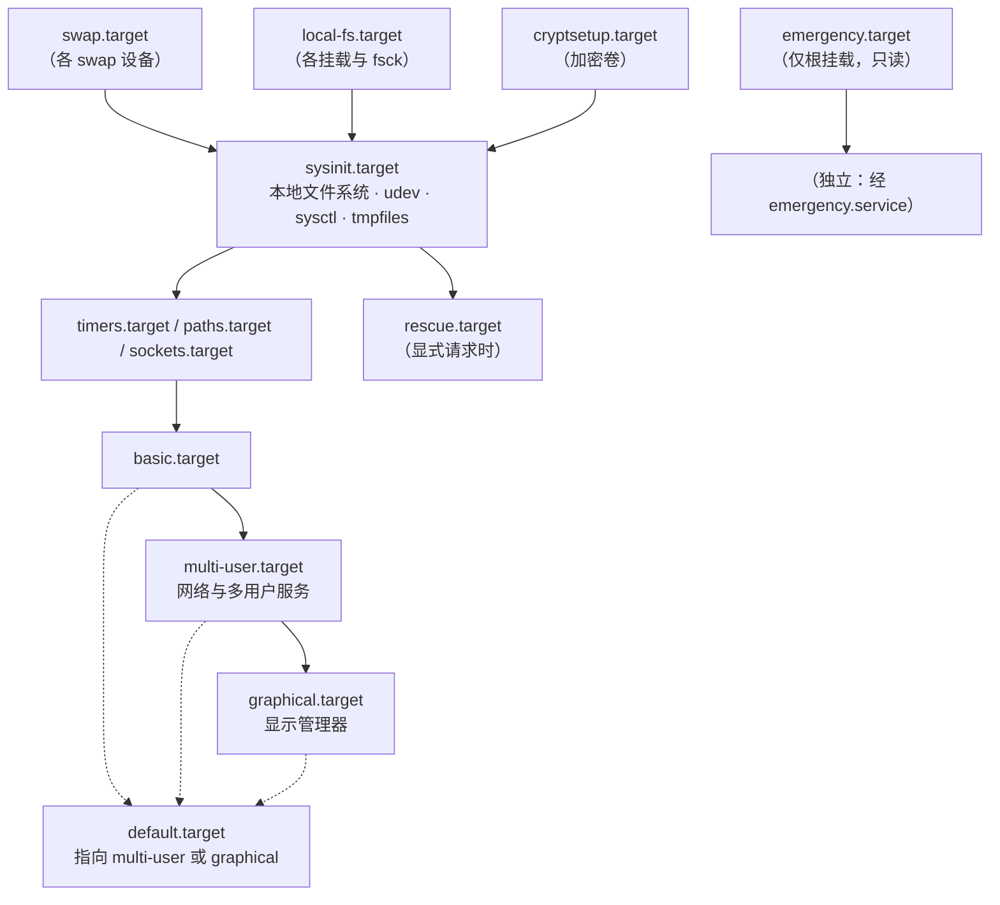
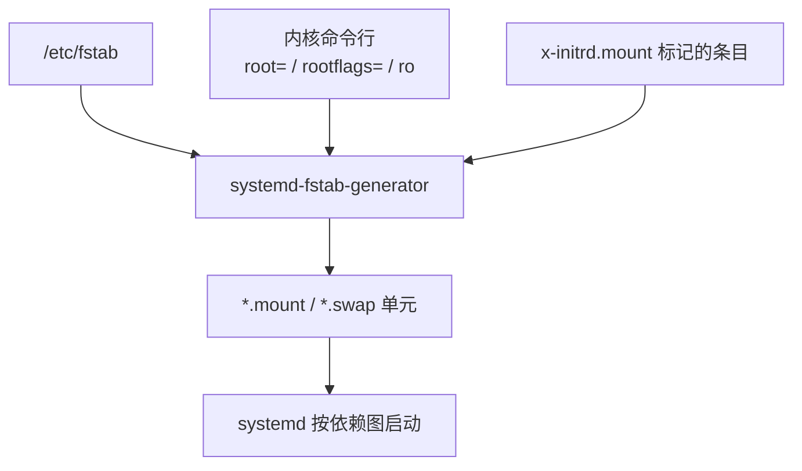

---
tags:
  - Linux
  - 启动流程
  - 内核
  - systemd
  - 原理
created: 2026-09-21
---

# 从内核到 PID 1 与用户态

## 1. 内核被载入之后做的四件事

引导加载器把 `vmlinuz`（压缩过的内核镜像）与 initramfs 归档读进内存、并把内核命令行一起递过来之后，内核在拿到控制权的最初几秒里按顺序做四件事。每一步都有自己典型的失败输出，认出输出就定位到了步骤。

| 步骤 | 做什么 | 失败时看到什么 |
| --- | --- | --- |
| 1. 自解压与最初的初始化 | 把自己解压到内存、建立最初的内存管理与 CPU 初始化 | 极早期的 panic，常常只有一两行输出，控制台可能还没配好 |
| 2. 解析命令行、探测硬件 | 读内核命令行，枚举总线、加载已编入内核的驱动、识别 CPU 与内存 | 设备识别不全；`quiet` 把该有的输出压掉了 |
| 3. 把 initramfs 当成临时根 | 解开 cpio 归档到内存里的 `tmpfs`，它成为此刻的 `/` | `Initramfs unpacking failed`（归档损坏、被截断、空间不足） |
| 4. 执行 `/init` | 跑归档里的初始化程序，由它去找并挂载真正的根 | 落入 `dracut:/#`（RHEL 系）或 `(initramfs)`（Debian 系） |

关键认知在第 3、4 步：**这时候的 `/` 不是你的系统盘**，是内存里的临时根。真正的根文件系统稍后被挂到 `/sysroot`，然后由 `switch_root` 把 `/` 换成它，并在真根上启动 PID 1。做完这件事，initramfs 的使命就结束了——它不会被保留，也不占磁盘空间（占的是内存）。量级可以现场看：金标准机器上 `/boot/initrd.img-6.8.0-139-generic` 是约 73 MiB 的压缩归档（约 76.5 MB），解开后约 102 MiB（`lsinitramfs -l` 的字节和）。**"几十到几百 MiB 内存"这个量级是这么来的，不要凭印象说成几百兆字节的常驻开销。**

一个容易被忽略的细节：现代发行版的 initramfs 常是**多段 cpio 拼接**（前面一段放 CPU 微码，后面一段才是主内容）。所以在金标准机器（Ubuntu 24.04.5 / 内核 6.8.0-139-generic）上直接列内容，开头几行看到的是 `kernel/x86/microcode/AuthenticAMD.bin`、`genuineIntel` 一类路径，而不是 `/init`——**这是拼接结构，不是镜像坏了**。用发行版自带工具（`lsinitramfs` / `lsinitrd`）列内容比自己用 `cpio` 解包省事，后者可能要手工跳过前面几段。

## 2. `root=` 与"根在什么样的设备上"

内核自己不知道你的系统盘是哪一块，它只听命令行里那一个参数。这一串参数由引导加载器从菜单项里读出来原样传给内核，所以链条是：

```text
/etc/default/grub（或 grubby 管理的 BLS 条目）
        ↓ 重新生成
grub.cfg（或 /boot/loader/entries/*.conf）里 linux 行上的 root=
        ↓ 引导加载器传给内核
/proc/cmdline 里能看到的那一行
        ↓ 内核与 initramfs 使用
设备标识（UUID / PARTUUID / LABEL / 设备路径）
```

链条上任何一环写的是旧值，都会在最后一环暴露成"找不到根设备"。这就是为什么换盘、克隆系统之后不能只改一处。

`root=` 支持几种写法，各有代价：

| 写法 | 何时失效 | 建议 |
| --- | --- | --- |
| `root=UUID=<uuid>` | 重新 `mkfs` 会换 UUID | 生产首选，最稳 |
| `root=PARTUUID=<uuid>` | 重建分区表会换 PARTUUID | GPT 环境可用；它标识分区而非文件系统 |
| `root=LABEL=<label>` | 手工改名才变，但可重名 | 可读性好，机器上多块盘时容易歧义 |
| `root=/dev/sdX` 或 `/dev/mapper/...` | 内核枚举顺序、卷名变化即失效 | 只适合临时引导；`/dev/mapper` 名字比 `/dev/sdX` 稳但仍依赖卷名 |

**根不在裸分区上时，`root=` 只是答案的一半。** 这些参数会一起出现在 `/proc/cmdline` 里，各自负责"把那个设备组装出来"：

| 参数 | 作用 | 值取自 |
| --- | --- | --- |
| `rd.luks.uuid=` | 指出要解锁哪个 LUKS 加密设备 | LUKS 容器的 UUID（`blkid`、`cryptsetup luksUUID`）；Debian 系的对应配置在 `/etc/crypttab` |
| `rd.lvm.lv=` | 指出根在哪个逻辑卷 | `lsblk` 里的 `vg/lv` 名称 |
| `rd.md.uuid=` | 指出要组装哪个软 RAID 阵列 | 阵列 UUID（`mdadm --detail`） |
| `rd.iscsi.*`、`rd.neednet=1` | 网络根的发起端与联网要求 | iSCSI/NFS 根场景 |

这些值同样由安装器写在启动配置里，**分区迁移、克隆系统、重建加密卷之后都会失效**。现象上有个明显分别：加密根会在挂载前先要求输入口令，口令输错和设备压根没识别到最终都落到同一个 initramfs shell——但前者是输入问题，后者是驱动或参数问题，处置方向完全不同。

## 3. 谁在给谁定策略：内核提供机制，用户态选择策略

`switch_root` 之后，内核仍然在跑，但它已经把所有"选择"性质的职责交出去了。这条分工线是理解启动后半段的主线：

| 由内核决定（机制） | 由用户态决定（策略） |
| --- | --- |
| 进程调度、内存管理、设备驱动、系统调用接口 | 拉起哪些服务、按什么顺序、失败怎么办 |
| 命令行里 `ro`/`rw`、`root=` 的解析 | 其余文件系统挂到哪、用什么选项（`fstab`） |
| 暴露 `/proc`、`/sys` 这些接口 | 往这些接口里写什么值（`sysctl`、`/etc/sysctl.d/`） |
| 向 PID 1 投递信号、收养孤儿进程 | PID 1 是谁、它装了哪些信号处理函数 |

这套分工在排障里表现为两种完全不同的动作：**改内核侧的东西要重启（参数、模块、initramfs），改用户态侧的东西可以当场生效（服务、挂载、sysctl）**。把两类混在一起，就会得到"我明明改了却不生效"。

## 4. PID 1 的语义

内核把硬件准备好之后，会拉起**第一个用户态进程**，它的 PID 固定是 1。这个进程再按配置把其余服务逐个拉起来，所以它是整棵进程树的根。现代发行版上它就是 `systemd`；更早用过 SysV init 与 Upstart。

PID 1 有两条与普通进程不同的语义，两条都不是权限问题：

**第一，它只接受自己安装了处理函数的信号。** `man 2 kill` 的 NOTES 一节写得很直接：能发给 1 号进程的信号，只有它显式安装了处理函数的那些，目的是"确保系统不会被意外带下去"。而 `SIGKILL` 与 `SIGSTOP` 天生不允许安装处理函数，所以它们永远到不了主机 PID 1。这正是 `kill -9 1` 以 root 执行时**命令返回成功、进程却什么也不做**的原因——信号确实发出去了，内核只是不投递。

想知道 PID 1 究竟装了哪些处理函数，读 `/proc/1/status` 里的 `SigCgt` 字段（一个十六进制位图，`SIGKILL`、`SIGSTOP` 永远不会出现在里面）。

这条规则保护的是"同一个 PID 命名空间内的 1 号进程"。从祖先命名空间（宿主机）发给容器里那个 1 号进程的信号不受它保护——`docker stop` 先发 `SIGTERM`，若容器里的 1 号进程没处理，仍会被丢掉，要等超时才升级到 `SIGKILL`；而从宿主机直接 `kill -9` 容器里的 1 号进程是有效的。

**第二，它负责收养孤儿进程。** 子进程的父进程先退出时，孤儿被 PID 1 收养，退出后由 PID 1 回收，否则会留下僵尸进程。这也是"容器里进程退不干净、僵尸堆积"这类问题的根——容器里那个 1 号进程不一定是会回收孤儿的实现。

## 5. 服务管理器怎么把系统带起来

systemd 不是"一口气把所有服务拉满"，而是沿一条 well-known target 组成的链走。`man 7 bootup` 给了完整的结构图，化简成主干是这样：



几个必须分清的层次：

- **`default.target` 是"开机默认终点"**，通常是指向 `multi-user.target` 或 `graphical.target` 的软链。`systemctl get-default` 看，`systemctl set-default` 改（持久变更）。
- **`emergency.target` 与 `rescue.target` 不在主链上**，它们是显式请求时才到的救援环境；`emergency.target` 依赖 `emergency.service`，`rescue.target` 依赖 `sysinit.target` 与 `rescue.service`。这两个 target 都带 `AllowIsolate=yes`，所以既能用内核参数 `systemd.unit=` 请求，也能用 `systemctl isolate` 在当前运行的系统上切过去。
- **同一时刻可能有多个 target 处于 active**：target 表达的是"到达了某个阶段"，不是"当前只在这个阶段"。所以 `systemctl list-units --type=target --state=active` 在正常运行的机器上会列出十几二十个 active target，这本身就是正常的。

### 5.1 依赖关系里最容易写错的三件事

unit 起不来、开机变慢，很大一部分原因出在依赖写错上。三类指令的语义完全不同：

| 指令 | 语义 | 写错的后果 |
| --- | --- | --- |
| `Requires=` | 硬依赖：被依赖者启动失败，自己也失败 | 一个可选组件挂掉，连累整个服务起不来 |
| `Wants=` | 软依赖：尽量拉起，被依赖者失败不影响自己 | 写得太少，服务启动时依赖还没就绪 |
| `After=` / `Before=` | **只排序，不产生依赖** | 只写 `After=` 不写 `Wants=`，表现为"顺序对了但对方根本没被启动" |

最经典的写法错误是**把网络依赖写成 `Requires=network-online.target`**：网络没就绪时服务直接失败，或者让开机干等。通常应该是 `Wants=` 加 `After=`。本机实测的一个例子：金标准机器上 `systemd-networkd-wait-online.service` 是关键路径上耗时最长的一环（1.301 s），而整机 userspace 只用了 2.976 s——**等待网络就绪是这类机器上开机耗时的主要来源**。

### 5.2 `fstab` 不是被"逐个执行"的

第 ④ 段开始时会跑一批**生成器**（generator），它们在正常单元启动之前运行，把非 unit 格式的配置翻译成 unit。与启动关系最大的是 `systemd-fstab-generator`：



两个实用推论：

1. **挂载单元的名字由路径转义而来**：`/boot` 对应 `boot.mount`，`/data` 对应 `data.mount`，`/mnt/data` 对应 `mnt-data.mount`。排障时可以直接查单元状态，而不只是看 `fstab`。
2. **改完 `fstab`，运行中的 systemd 不会自动知道**——生成器只在启动早期跑一次。要么 `systemctl daemon-reload` 让它重跑，要么等下次启动（阶段 5 会展开挂载选项的细节）。

`nofail` 的语义值得单独记住，`man 5 systemd.mount` 写得很准确：加了它之后，这个挂载**只是被 `local-fs.target`/`remote-fs.target` "wanted"、不是被 "required"**，而且挂载单元不再排在这两个 target 之前。也就是说，开机既不要求它成功，也不等它完成。这是"允许失败"，不是"让它能挂上"——设备真的丢了它照样挂不上，只是机器不会因此起不来。

## 6. 救援入口为什么有四种，它们的本质区别是什么

控制台前的救援手段有四种，经常被混为一谈。区别的实质是**控制权停在哪一段，以及要不要过认证**：

| 进入方式 | PID 1 是谁 | 文件系统状态 | 能启服务吗 | 要 root 密码吗 |
| --- | --- | --- | --- | --- |
| `rd.break` | 还没到用户态，仍在 initramfs 里 | 真根挂在 `/sysroot`，只读 | 不能 | **不要** |
| `init=/bin/bash` | 直接是 `bash`，没有 systemd | 根通常只读，`/proc`、`/sys` 可能都没挂 | 不能 | **不要** |
| `systemd.unit=emergency.target` | `systemd` | 只有根被挂上，且默认只读 | 可以手动启单个 unit | **要** |
| `systemd.unit=rescue.target` | `systemd` | 所有本地文件系统已挂载，基础服务已起 | 可以 | **要** |

后两种要过认证，实现方式是 `emergency.service` / `rescue.service` 去执行 `/usr/lib/systemd/systemd-sulogin-shell`（它再调 `sulogin`），给出 shell 之前先验 root 密码。如果 root 被锁定，会看到：

```text
Cannot open access to console, the root account is locked.
```

**这不是故障，是设计。** 它在防的正是"拿到控制台就等于拿到 root"这件事。`man 8 sulogin` 的 `--force` 选项写明了它的例外条件与代价：如果 root 账号被 `!` 或 `*` 锁定，`sulogin --force` 会**不问密码直接给 root shell**，手册同时提醒"只有在确认控制台在物理上受保护时才使用"。

反过来也说明一件在生产上很重要的事：**真正无条件拿到 root 的是 `rd.break` 与 `init=/bin/bash` 这类绕过认证的路径**。它们在物理接触与带外控制台面前等于零防护——这不是漏洞，而是"能碰到控制台的人本来就能控制这台机器"这一事实的体现。

## 7. target 只保证有限的顺序约束，网络是否就绪要查具体单元的 `After=` 与 `Wants=`

**target 的"阶段"语义是近似的。** `man 7 bootup` 明确写了：引导过程高度并行，到达各 target 的先后**不是确定的**，只保证有限的一组顺序约束。所以"我到了 multi-user 就说明网络一定好了"这类推断不成立，要查具体单元的 `After=`/`Wants=`。

**`default.target` 可以被换掉，而且不只一种换法。** 有的发行版用软链，有的用 `systemctl set-default`；如果它被指向一个不存在的 unit，开机会落到一个几乎没有服务运行的状态，而现象与"系统正常启动了但没有服务"非常像。

**"系统起来了"的标准是策略而非机制。** Type=simple 的服务在 `fork` 之后就算启动成功，此时它可能还没监听端口；`Type=notify` 的会明确报到；`Type=forking` 的靠 PID 文件。同一句 `systemctl start` 成功，在三种类型下的含义不同。

**用户态的工具本身依赖已经挂好的文件系统。** 救援环境里 `systemctl`、`journalctl` 能用是因为 systemd 与它的依赖已经可读；在 `init=/bin/bash` 下这些工具所在的路径可能根本没挂，你能用的只有 shell 内建命令与 `/bin` 里那点东西。

## 常见误解

| 说法 | 事实 |
| --- | --- |
| "`kill -9 1` 杀不掉是因为权限不够" | 以 root 执行时命令返回成功、信号只是不被投递；内核只向 PID 1 投递它有处理函数的信号 |
| "target 就是运行级别，只是换了个名字" | 语义相近但不同：多个 target 可同时 active；target 表达"到达了某阶段"，不表达"当前处于该级别" |
| "开机到了 multi-user.target 就说明网络已就绪" | 引导过程高度并行，顺序只保证有限约束；网络就绪要看 `network-online.target` 与其 wait-online 服务 |
| "`fstab` 里所有条目都要挂上才能进系统" | 只有被 `local-fs.target` required 的才阻塞；带 `nofail` 的条目只被 wanted，且不被等待 |
| "`systemctl isolate rescue.target` 和重启用 `systemd.unit=rescue.target` 是一回事" | 前者在当前运行的系统上停掉大部分服务（有业务中断），后者只影响这一次启动；风险完全不同 |
| "`emergency.target` 和 `rd.break` 都是"救援模式"" | 前者 PID 1 是 systemd、要过 root 密码、根已挂载；后者还在 initramfs 里、不要密码、真根在 `/sysroot`、只读 |
| "`switch_root` 之后 initramfs 还留在内存里备用" | 它被切换掉，不再参与运行；临时根占用的内存会被释放 |
| "`/proc/cmdline` 是配置文件" | 它是内核暴露的只读视图，反映内核这次真正收到了什么；改它不会有任何效果 |

## 要点自测

**问：内核把 initramfs 解开之后，为什么还需要 `switch_root` 这一步？**

答：解开后的 initramfs 成为此刻的 `/`，但它只是内存里的临时根，里面没有你的系统。真根被挂到 `/sysroot` 之后，`switch_root` 把 `/` 换成真根、移到真根上启动 PID 1，并释放不再需要的临时根内存。不切换，系统就永远到不了用户态。

**第一反应不要做什么**：不要在 initramfs shell 里直接改文件就以为修好了——除非先 `mount -o remount,rw /sysroot` 并 `chroot /sysroot`，否则改的是内存里的临时根，重启即失。

**问：为什么 `kill -9 1` 在主机上没有任何效果，在容器里却有效？**

答：因为这条规则按 PID 命名空间生效。主机 PID 1 收不到自己没有处理函数的信号（`SIGKILL`/`SIGSTOP` 永远无法安装处理函数），内核有意不投递，以防一条命令掀掉整个系统。容器里的 1 号进程只是它所在命名空间内的 1 号；从宿主机（祖先命名空间）看它是普通进程，`SIGKILL` 会被正常投递。

**第一反应不要做什么**：不要把"杀不掉"当成权限问题去反复加 `sudo`，也不要用它当重启 systemd 的手段。

**问：`emergency.target` 与 `rescue.target` 差在哪，为什么选错会浪费一次故障处置的机会？**

答：`emergency.target` 只挂了根且默认只读，适合根分区或 `fstab` 需要人工干预的场景；`rescue.target` 已挂载全部本地文件系统并起了基础服务，适合改配置、查依赖。两者都要过 `sulogin` 验 root 密码。选错方向的代价是：在只有根挂载的环境里试图改一个在别的分区上的配置，或者在本可以正常操作的环境里因为大量依赖缺失而无法定位问题。

**第一反应不要做什么**：不要在紧急模式里盲目重启。它是一个根已经挂上、可以动手修的环境，重启只会把同一个场景重演一遍并覆盖日志。

**问：`Requires=` 与 `After=` 分别负责什么？为什么"只写 `After=`"是错误的？**

答：`Requires=`/`Wants=` 决定**要不要拉起**被依赖者（硬/软依赖），`After=`/`Before=` 只决定**两者的先后顺序**。只写 `After=` 时，如果对方没有任何别的理由被启动，它根本不会被启动，你的顺序约束也就无从谈起——表现为"依赖没就绪"或"对方压根没跑"。

**第一反应不要做什么**：不要把网络依赖写成 `Requires=network-online.target`。网络不可用时服务会直接失败，或者让开机卡在等待上；通常应该用 `Wants=` 加 `After=`，让服务自己处理网络暂不可用的情况。

## 参考文档

- `man 7 bootup`：内核交给服务管理器之后的完整启动过程，含 well-known target 的结构图与 "BOOTUP IN THE INITRD" 一节（initramfs 里 systemd 的 `initrd.target` 流程）。
- `man 7 systemd.special`：每个 well-known target 的语义、依赖与 `AllowIsolate` 属性。
- `man 5 systemd.target`、`man 5 systemd.unit`：target 与 unit 的依赖、排序语义。
- `man 2 kill` 的 NOTES 一节：PID 1 的信号投递规则及其理由。
- `man 8 systemd-fstab-generator`、`man 5 systemd.mount`、`man 5 fstab`：生成器如何把 `fstab` 与内核命令行翻译成挂载单元，`nofail`/`x-systemd.*` 的准确语义。
- `man 8 sulogin`、`man 8 systemd-sulogin-shell`：救援 shell 前的认证与 `--force` 的边界。
- 内核 6.x 文档 `Documentation/admin-guide/initrd.rst`：initramfs 的生成与内容约定；`Documentation/admin-guide/kernel-parameters.rst` 中 `root=`、`rd.*`、`systemd.*` 各参数的语义。

上一篇：启动链为什么要分成五段 ｜ 下一篇：内核参数与模块的两套机制
