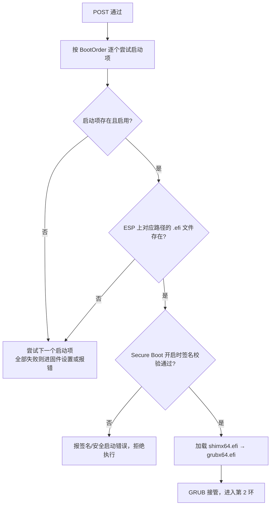

---
tags:
  - Linux
  - 启动流程
  - 固件
  - UEFI
created: 2026-09-18
---

# 第 1 环：固件与启动项

> [!cite] 参考资料
> `man 8 efibootmgr`、`man 8 grub-install`、`man 8 lsblk`；UEFI 规范中关于启动项与 ESP 的章节；发行版官方文档的 "Managing EFI boot entries"、"Working with GRUB 2" 两节。基础概念见子笔记 01。
>
> 本篇结论来自上述资料，**命令输出尚未在实验机上逐条实测**；本机结果与文中不一致时以本机输出为准，并回填到对应小节。

> **这篇讲什么**：固件从加电到「把控制权交给引导器」这一段究竟做了什么，以及这一环出故障时你能看到什么、只能从哪个通道去修。
>
> **必须先读什么**：[[Linux/02_启动流程与内核/01_前置_硬件固件与磁盘分区|01 前置：硬件、固件与磁盘分区]]。
>
> **读完能回答**：① UEFI 和 legacy 两条启动路径分别做了什么？② 启动项丢了怎么判断、怎么修？③ 为什么这一环的故障几乎只能靠带外管理解决？
>
> 所属：[[Linux/02_启动流程与内核/00_导读与知识地图|02 启动流程与内核]] 的第 1 环 · 主要练 **S5 救援通道**、**S1 观测与建基线**

## 0. 30 秒速览

> [!abstract] 这一篇只要记住五句话
> - **第 1 环的全部任务是「找到并交棒」**：固件初始化硬件，然后按启动顺序挑一个启动项，把控制权交出去。它不读你的文件系统，也不认识 Linux。
> - **UEFI 靠启动项（NVRAM）+ ESP 上的 `.efi` 文件**；legacy 靠设备顺序 + 磁盘引导扇区。判断自己在哪条路上，用 `ls /sys/firmware/efi`。
> - **启动项丢失是「看起来像硬件坏了」的典型故障**：机器直接进固件设置界面或报 `No bootable device`，此时数据完好，只是**没人告诉固件从哪启动**。
> - **这一环的输出不在操作系统日志里。** POST 报错、RAID 卡自检、PXE 尝试只出现在物理屏或带外管理（IPMI/iDRAC/iLO）日志中。
> - **所以救援通道必须提前演练**：根分区坏了还能进救援模式，固件这一环坏了，没有带外控制台就只剩进机房。

## 1. 这一环要完成的事

固件阶段可以拆成三步，每一步都有对应的失败现场：

| 步骤 | 做什么 | 失败时看到什么 |
| --- | --- | --- |
| 1. POST 与硬件初始化 | 自检 CPU/内存/控制器，初始化显卡、网卡、RAID 卡 | 黑屏、蜂鸣码、固件报错页；**操作系统还没开始运行** |
| 2. 读启动配置 | UEFI 读 NVRAM 里的启动项顺序；legacy 读设备顺序 | 启动项为空、顺序被改、进了固件设置界面 |
| 3. 加载引导器 | 从 ESP 读 `.efi` 文件，或从磁盘读引导扇区 | `No bootable device`、`Invalid partition table` |

理解这一环的关键是：**固件不认识 Linux，也不读 `/etc/fstab`**。它只认启动项和引导器文件。所以这一环的故障，本质都是「找不到该交给谁」或「交出去的那个文件坏了」。

## 2. UEFI 的启动过程

### 2.1 启动项长什么样

UEFI 固件在 NVRAM 里保存一个启动项列表，每一项包含**名字、设备路径、`.efi` 文件路径**：

```bash
efibootmgr -v                              # 验证：启动项顺序，以及每一项指向的 .efi 文件
```

预期输出形如：

```text
BootCurrent: 0001
Timeout: 5 seconds
BootOrder: 0001,0000,0003
Boot0000* Windows Boot Manager  HD(1,GPT,...)/File(\EFI\Microsoft\Boot\bootmgfw.efi)
Boot0001* rhel                  HD(1,GPT,...)/File(\EFI\redhat\shimx64.efi)
Boot0003* UEFI: PXE IP4 ...     PciRoot(0x0)/...
```

三个要会读的点：

- **`BootOrder` 决定先后**：从左到右尝试，第一个可用的胜出。
- **名字后面有没有 `*`**：有 `*` 是启用，没有是被禁用。
- **`File(\EFI\redhat\shimx64.efi)` 是真实路径**，它落在 ESP 分区里。**启动项存在 ≠ 文件存在**，这两件事要分别验证。

### 2.2 从固件到 GRUB 的完整链条



UEFI 机器上通常还多一层 **shim**。直觉是这样：Secure Boot 开启后，固件只肯执行「有可信签名」的引导器，而发行版的 `grubx64.efi` 并不是由固件内置的那套密钥签的。于是发行版放了一个「双方都认」的小程序 `shimx64.efi`——它由微软 UEFI CA 签名，固件放行它；再由它去验证发行版签名的 `grubx64.efi`。这就是 Secure Boot 下能启动 Linux 的原因，也解释了为什么手工换自编译内核或未签名模块时常常被拦。

> [!info] 怎么知道这台机器开没开 Secure Boot
> ```bash
> mokutil --sb-state                        # 验证：输出 SecureBoot enabled 或 disabled
> ls /sys/firmware/efi                      # 验证：先确认是 UEFI 启动，否则这条命令本身不适用
> ```
> 这个判断很重要：**它决定了「换自编译内核」和「装第三方驱动模块」会不会被固件拦下来**，而这正是内核升级时的常见动作。

> [!important] 需要加载未签名模块时：MOK 注册流程
> Secure Boot 开启时，自己编译的模块（例如某些第三方存储驱动、DKMS 编出来的模块）会因为没有可信签名而被拒。正规做法是给模块签名，再把**公钥**注册进固件的信任库——这个库叫 **MOK（Machine Owner Key，机器所有者密钥）**：
>
> ```bash
> mokutil --import <公钥>.der                # 验证：登记待注册的公钥，系统会要求设置一次性密码
> mokutil --list-enrolled                    # 重启后在 MokManager 界面选 Enroll MOK → 输入刚才设置的密码 → 完成，再验证公钥已进入信任库
> ```
>
> **这一步必须在本地屏幕或带外控制台上完成**，因为重启后要有人对着固件界面按键。远程机器上如果只发了 `mokutil --import` 就重启，会卡在 MokManager 界面——**看起来和「机器起不来」一模一样**。这是 Secure Boot 环境里最容易让人误判成硬件故障的一种情况。

> [!info] 没有启动项时固件还会试一次
> UEFI 规范定义了可移动介质回退路径：启动项为空或全部失败时，固件会尝试 ESP 上的 `\EFI\BOOT\BOOTX64.EFI`。所以「启动项丢了但文件还在、且放在回退路径上」的机器有时仍能起来——这也是判断故障范围的一条线索。

## 3. legacy（BIOS）的启动过程

legacy 路径没有启动项这个概念，只有**设备顺序**：

```text
POST 通过
  → 按设备顺序找到第一块可引导硬盘
  → 读该盘 LBA0 的 512 字节（MBR）
  → 执行其中的引导代码（GRUB 的 boot.img）
  → boot.img 加载 core.img（位于 MBR 与第一个分区之间的间隙）
  → core.img 从 /boot/grub2/i386-pc/ 读模块与 grub.cfg
  → GRUB 接管
```

legacy 有几个 UEFI 没有的坑：

| 现象 | 原因 |
| --- | --- |
| 装系统后直接进不了，报 `Invalid partition table` | 引导代码写进去了，但分区表无效 |
| 换盘克隆后起不来 | 引导代码在磁盘的**固定位置**；全盘镜像能带过去，单分区拷贝带不过去 |
| 多系统互相顶掉引导器 | 只有一个 MBR，后装的系统可能覆盖前一个的引导代码 |
| GPT 盘 + legacy 启动 | 需要额外的 BIOS boot 分区存放 `core.img`，否则装不上引导器 |

诊断入口是 `fdisk -l` 里的 `Disklabel type`。重新安装引导器（`grub2-install` / `grub-install`）是写操作，属于第 2 环的处置范围。

## 4. 这一环失败时的四种现场

| 现象 | 含义 | 第一反应 |
| --- | --- | --- |
| 黑屏、蜂鸣、固件报错页 | 卡在 POST | 判断是不是内存/控制器/电源问题；这时操作系统还没参与 |
| 直接进入固件设置界面 | 启动项为空，或全部启动项都失败 | 去带外控制台确认启动项与 ESP 内容，不要在系统里瞎找 |
| `No bootable device` / `Boot Device Not Found` | 没找到可引导设备 | 检查启动顺序是否被 PXE/USB 顶掉，其次是引导器文件是否还在 |
| Secure Boot 相关的签名错误 | 引导器没签名或被改动 | 确认引导器来源是否合规，不要随手关 Secure Boot |

> [!tip] 第一反应不要是：拔盘重装系统
> 这一环的故障绝大多数发生在**引导配置层**（启动项、启动顺序、ESP 文件），系统盘上的数据通常完好。重装会从根上毁掉现场和数据。
> 正确的第一步是：**换到带外控制台，看清固件在说什么**。

## 5. 生产动作：把「救援通道」确认下来（S5）

这一环值得单独做一个动作，原因是它的**故障只能从带外修**——如果机器起不来时你还没有带外通道，那这条通道就永远不会有了。

> [!example]+ 生产动作：启动项与带外通道的验证
> **什么时候用**：接手机器时、做内核或引导器相关变更之前、上架验收环节。
>
> **动手前确认**：
> 1. 分清**只读验证**与**写入启动项**：只读部分在生产机上做，写入部分只在实验机或有变更窗口时做。
> 2. 写入前先记录现状（下面的第一步），它是唯一的回滚依据。
> 3. 确认这台机器**当前**能从带外控制台看到画面，而不只是能 ping 通。
>
> **怎么做**（只读部分）：
> ```bash
> ls /sys/firmware/efi                      # 验证：这台机器是 UEFI 还是 legacy
> efibootmgr -v                             # 验证：UEFI 机器的启动项、顺序（BootOrder）与 .efi 路径
> findmnt /boot/efi                         # 验证：ESP 是否挂载、在哪个设备上
> df -h /boot /boot/efi 2>/dev/null          # 验证：两个引导相关分区的剩余空间
> ```
>
> **写入部分**（只在实验机上试，先记后改）：
> ```bash
> efibootmgr -v > /root/efiboot-before.txt   # 验证：先把现状存档，这就是回滚依据
> efibootmgr -o 0001,0000,0003               # 验证：调整启动顺序（示例值，必须换成本机实际编号）
> efibootmgr -v                              # 验证：顺序已改，且所有条目一条不少
> ```
>
> **别漏掉串口登录的另一半**：串口控制台要能用，需要**两件事都做**——内核参数只负责「有输出」，串口的登录服务才负责「能登进去」：
> ```bash
> grubby --update-kernel=ALL --args="console=ttyS0,115200n8"   # 第一步：日志输出到串口（参数改法见子笔记 05、08）
> systemctl enable --now serial-getty@ttyS0.service            # 第二步：在串口上提供登录提示符
> systemctl status serial-getty@ttyS0.service                  # 验证：服务为 active
> ```
> 只做第一步是新人最常见的半吊子配置：出事时看得到内核日志，却登不进去做任何事。**验收标准是用串口线或带外控制台真的登录一次**，不是「服务显示 active」。
>
> **怎么验证**：重启后能正常进入 GRUB 菜单与系统；带外控制台在**系统未启动时**也能看到 POST 与 GRUB 画面；串口上能出现并登录一个提示符；存档里的启动项在改完后一条都不少（只改顺序，不删条目）。
>
> **怎么退回去**：按存档恢复顺序，`efibootmgr -o <原顺序>`。如果条目被误删，用 `efibootmgr -c -d <磁盘> -p <分区号> -L <名字> -l <efi路径>` 重建——**参数必须按本机实际值填**，写错只会生成一个无效启动项，不会损坏数据。
>
> **要沉淀什么**：启动模式、启动项顺序、ESP 设备与路径、带外通道类型与访问方式，写进资产台账。**「带外通道可用」要写成巡检项**，因为它会随固件升级、密码轮换、网络变更而失效。

> [!warning] 带外通道的验证标准不是「能 ping 通」
> 要验证的是**在操作系统完全没有启动的情况下，你还能看到屏幕并操作**。很多「有带外管理」的机器实际只配到了电源控制，真出事时看不到画面，等于没有。

## 6. 常见坑

| 常见做法或说法 | 后果或事实 |
| --- | --- |
| 以为「启动项存在」就等于「能启动」 | 启动项只是指针，`.efi` 文件可能已经不在；两者要分别验证 |
| 换硬盘后只克隆分区 | legacy 的引导代码在磁盘固定位置，单分区拷贝带不过去，需要重装引导器 |
| 用 U 盘装系统后忘了改回启动顺序 | 插着 U 盘的机器可能反复从 U 盘启动 |
| PXE 排在硬盘之前 | 机器开机先去网络上要引导程序，网络异常时就卡住 |
| 跨平台迁移后直接启动 | 固件类型（UEFI/legacy）可能不同，启动项与引导器路径全都不适用 |
| 用关闭 Secure Boot 来绕过签名问题 | 属于降低安全基线的手段，应走正规签名或注册 MOK 的流程 |
| 以为云主机没有固件阶段 | 云主机同样有固件与启动项，只是通常不可见；`ls /sys/firmware/efi` 同样有效 |
| 没验证带外通道就上架 | 这一环的故障没有第二条救援路径，等于把机器放在无法维护的位置 |

## 7. 决策练习

> [!question]- 场景：一台 UEFI 服务器重启后直接进入固件设置界面，`efibootmgr -v` 显示 `BootOrder` 为空，但 `findmnt /boot/efi` 能挂上、里面的 `\EFI\redhat\shimx64.efi` 还在
> 你下一步做什么？
> A. 重装系统
> B. 重建启动项，并查清「启动项为什么丢了」——是固件升级、NVRAM 被清，还是有人执行过删除
> C. 直接关掉 Secure Boot 再试
>
> **答案：B。**
> 证据很清楚：**文件在、启动项没了**，这是「重建指针」就能解决的问题，不需要动系统。但只重建不追问原因，下次还会再丢一次——NVRAM 被清、固件升级重置、误执行删除都可能，值得记录并纳入巡检。
> A 会破坏数据；C 没解决问题，还降低了安全基线。

> [!question]- 场景：一台远端机器在维护窗口重启后彻底失联，机房回复「带外控制台也看不到画面」
> 你的判断是什么？
> A. 操作系统起不来，去修引导
> B. 带外通道本身可能失效，或者机器停在 POST/固件层——**这是唯一能解释「连画面都没有」的两类原因**
> C. 网络配置写错了
>
> **答案：B。**
> 「带外看不到画面」把范围压得很小：如果是操作系统层的问题，带外至少能看到 POST 与 GRUB。
> C 不成立：网络配错只影响带内连通性，带外控制台走独立通道，应该仍然可见。

## 8. 要点自测

> [!question]- UEFI 和 legacy 在「找引导器」这一步分别怎么做？
> - UEFI：读 NVRAM 里的启动项顺序，按项去找 ESP 上的 `.efi` 文件；全部失败时还会尝试可移动介质回退路径 `\EFI\BOOT\BOOTX64.EFI`。
> - legacy：按设备顺序找到第一块可引导硬盘，读 LBA0 的引导扇区，逐级加载 `boot.img`、`core.img`，再由 core.img 读 `/boot` 下的模块与配置。

> [!question]- 「启动项存在」与「引导器文件存在」为什么要分开验证？
> - 启动项只是指针（设备路径 + 文件路径），文件才是实体。文件被删、ESP 被重新格式化、路径变更，都会让指针悬空。
> - 分开验证才能定出正确处置：指针问题是重建启动项，文件问题要重装引导器。

> [!question]- 为什么这一环的救援通道必须提前演练？
> - 这一环的输出不在操作系统日志里；故障时系统完全没起来，SSH、`journalctl`、救援模式都用不上，只剩物理屏与带外管理。
> - 带外通道会随固件升级、密码轮换、网络策略变更而失效，所以「配过」不等于「现在还能用」，必须纳入巡检并实测到能看到画面为止。

> 上一篇：[[Linux/02_启动流程与内核/03_前置_内核进程与观测命令|03 前置：内核、进程与观测命令]] ｜ 下一篇：[[Linux/02_启动流程与内核/05_第2环_GRUB2引导加载器|05 第 2 环：GRUB2 引导加载器]]
