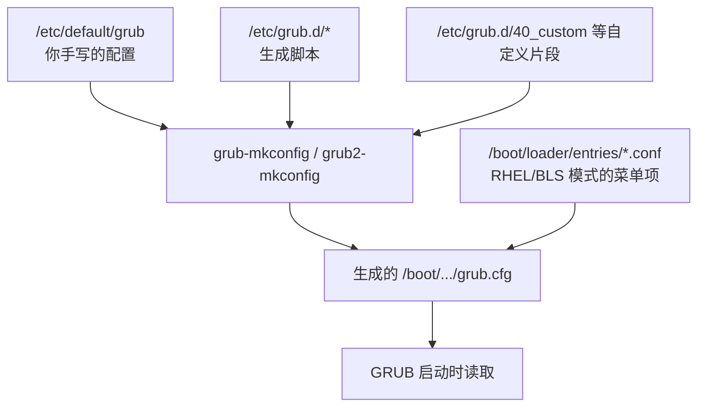

---
tags:
  - Linux
  - 启动流程
  - GRUB
created: 2026-09-18
---

# 第 2 环：GRUB2 引导加载器

> [!cite] 参考资料
> `man 8 grub-mkconfig`、`man 8 grub-install`、`man 8 grubby`（RHEL 系）、`man 1 grub2-editenv`；GNU GRUB Manual 的 "Simple configuration" 与 "GRUB command line" 两章；发行版官方文档的 "Working with GRUB 2" 一章。
>
> 本篇结论来自上述资料，**命令输出尚未在实验机上逐条实测**；本机结果与文中不一致时以本机输出为准，并回填到对应小节。

> **这篇讲什么**：GRUB 从固件手里接过控制权之后做什么、它的配置到底存在哪一层，以及菜单进不去时怎么在命令行里把系统救起来。
>
> **必须先读什么**：[[Linux/02_启动流程与内核/04_第1环_固件与启动项|04 第 1 环：固件与启动项]]。
>
> **读完能回答**：① 改内核参数应该改哪个文件，为什么不直接改 `grub.cfg`？② `grub>` 和 `grub rescue>` 的区别是什么？③ 菜单没出来时怎么手工引导一次？④ 哪些动作会让 GRUB 掉进这两个提示符，怎么快速判断属于哪一类？
>
> 所属：[[Linux/02_启动流程与内核/00_导读与知识地图|02 启动流程与内核]] 的第 2 环 · 主要练 **S2 变更与回滚**、**S5 救援通道**

## 0. 30 秒速览

> [!abstract] 这一篇只要记住六句话
> - **GRUB 做三件事**：显示菜单、把内核与 initramfs 载入内存、把内核命令行一起传下去。它是启动链里唯一「可交互」的一环。
> - **`grub.cfg` 是生成物，不是配置文件。** 真正要改的是 `/etc/default/grub`（或 RHEL 的 BLS 条目），改完必须重新生成。
> - **RHEL 8/9 默认走 BLS**（Boot Loader Specification，把「一个菜单项」变成「一个小配置文件」的约定）：菜单项不在 `grub.cfg` 里，而在 `/boot/loader/entries/*.conf`——所以在 RHEL 上直接 `grep grub.cfg` 常常什么也搜不到。
> - **临时改参数用菜单里的 `e`**，只对这一次启动生效；**持久改**走 `grubby`（RHEL）或 `/etc/default/grub` + `update-grub`（Debian）。
> - **唯一验收标准是 `cat /proc/cmdline`**，不是「我改了配置文件」。
> - **`grub>` 是正常模式**（模块已加载），**`grub rescue>` 是精简模式**（模块没加载）；后者要靠 `set root` + `set prefix` + `insmod normal` 把自己救回来。

## 1. GRUB 在这一环做什么

| 动作              | 说明                                     | 对应配置                                                              |
| --------------- | -------------------------------------- | ----------------------------------------------------------------- |
| 显示菜单            | 按配置显示可启动项与倒计时                          | `GRUB_TIMEOUT`、`GRUB_DEFAULT`、BLS 条目                              |
| 载入内核与 initramfs | 从文件系统读 `vmlinuz` 与 initramfs 到内存       | 条目的 `linux` / `initrd` 行                                          |
| 传递内核命令行         | 把 `root=`、`quiet`、`console=` 等参数原样交给内核 | `GRUB_CMDLINE_LINUX`、`GRUB_CMDLINE_LINUX_DEFAULT`、`grubby --args` |
| 提供交互入口          | 菜单里按 `e` 临时编辑、按 `c` 进命令行               | 无需配置，但要能看到菜单                                                      |

GRUB 是启动链上唯一你能「当场改点东西再继续」的环节，这也是它在救援中的价值：**只要 GRUB 还能跑，你就还有一次改写启动参数的机会**（进救援模式、`rd.break`、`init=/bin/bash` 都是这么做的）。

## 2. 配置存在哪一层

### 2.1 三层结构



关键点：**`grub.cfg` 是产物**。手工改它，下次内核升级或执行一次重新生成就被覆盖，所以生产上禁止直接编辑它。

### 2.2 发行版差异

| 维度 | Debian / Ubuntu | RHEL 8/9 |
| --- | --- | --- |
| 生成的配置文件 | `/boot/grub/grub.cfg` | BIOS：`/boot/grub2/grub.cfg`；UEFI：`/boot/efi/EFI/redhat/grub.cfg` |
| 重新生成 | `update-grub` | `grub2-mkconfig -o <上面的路径>` |
| 菜单项来源 | 由 `grub-mkconfig` 按 `/etc/grub.d/` 扫描内核生成 | 默认走 **BLS**：`/boot/loader/entries/*.conf` |
| 改参数的推荐工具 | 编辑 `/etc/default/grub` | `grubby`（它直接改所有启动项，不依赖 `grub.cfg` 路径） |
| 默认启动项 | `GRUB_DEFAULT` | `grubby --default-kernel`、`grub2-editenv list` |

> [!important] RHEL 上「为什么 grep 不到我的参数」
> **先解释 BLS 是什么**：早期做法是让 `grub-mkconfig` 扫描磁盘上所有内核，把菜单项**全部写死**进一个巨大的 `grub.cfg`。BLS 把这件事拆开——每个内核对应 `/boot/loader/entries/` 下的一个小文件，`grub.cfg` 只负责「去读这些文件」。好处很实际：内核升级时只需增删一个小文件，不必重新生成整个配置，也就不会在生成过程中把引导配置写坏。
>
> RHEL 8/9 的 `/etc/default/grub` 里有 `GRUB_ENABLE_BLSCFG=true`，此时菜单项由 `/boot/loader/entries/*.conf` 提供，`grub.cfg` 只负责引导到 BLS 解析流程。
> 所以在 RHEL 上核对参数要去 `grep -r <参数> /boot/loader/entries/`，或者直接 `grubby --info=ALL`。**在 Debian 上那一套 `grep grub.cfg` 的经验，在 RHEL 上会失效。**

### 2.3 两个常被混淆的变量

| 变量 | 作用范围 |
| --- | --- |
| `GRUB_CMDLINE_LINUX` | **所有**菜单项都带上 |
| `GRUB_CMDLINE_LINUX_DEFAULT` | 只加在**默认**菜单项上（Debian 系常用） |

生产上建议把参数写进作用范围明确的那一个，并在重新生成后**逐项核对每个启动项**，避免出现「默认内核有、旧内核没有」的不一致。

## 3. 菜单里的三个操作

启动时看到 GRUB 菜单，键盘上有三个动作要会：

| 按键 | 作用 | 用在哪 |
| --- | --- | --- |
| `e` | 编辑当前选中项的启动脚本（**只对本次启动生效**） | 临时加 `rd.break`、`systemd.unit=emergency.target`、去掉 `quiet` |
| `c` | 进入 GRUB 命令行 | 手工引导、测试路径 |
| `Ctrl-X` 或 `F10` | 用编辑后的内容引导 | 配合 `e` |

临时编辑的典型用法，就是**去掉 `quiet` 和 `rhgb`**：这两个参数会把内核启动信息压下去，排障时它们是最大的障碍。

> [!warning] 服务器上不要设置菜单隐藏
> `GRUB_TIMEOUT_STYLE=hidden` 和过短的 `GRUB_TIMEOUT` 会让菜单一闪而过。服务器上应保留可见菜单（例如 `GRUB_TIMEOUT=5`），因为**救援的第一入口就是菜单**；为了「开机快两秒」而隐藏菜单，代价是每次救援都要赌 ESC 的时机。

## 4. GRUB 命令行救援

### 4.1 两种提示符的区别

| 提示符 | 状态 | 能力 |
| --- | --- | --- |
| `grub>` | 正常模式，模块已加载 | 支持 `linux`、`initrd`、`boot`、`ls`、`set` 等 |
| `grub rescue>` | 精简模式，模块**未**加载 | 只有 `ls`、`set`、`insmod`、`unset` 等有限命令 |

`error: unknown filesystem` 通常意味着：分区选错了，或者读该文件系统所需的模块还没加载。**这时你往往在 `grub rescue>` 里，需要先把模块加载回来。**

### 4.2 从 `grub rescue>` 回到菜单

思路是先找到 `/boot` 所在的分区，再告诉 GRUB「模块和配置在哪个目录」，最后加载 `normal` 模块把菜单要回来：

```text
ls                                        # 验证：GRUB 能看到哪些磁盘与分区，如 (hd0) (hd0,gpt1) (hd0,gpt2)
ls (hd0,gpt2)/                            # 验证：试探该分区能否读取、里面有什么目录
set root=(hd0,gpt2)                       # 验证：把根设为 /boot 所在分区（按实际探测结果填）
set prefix=(hd0,gpt2)/grub2               # 验证：指出 GRUB 模块与 grub.cfg 的目录（RHEL 常见；Debian 常见为 /boot/grub）
insmod normal                             # 验证：加载 normal 模块（无输出即成功）
normal                                    # 验证：回到 GRUB 菜单
```

回到菜单只解决「本次能启动」。**真正的修复是进系统后重新生成配置、必要时重装引导器**，属于写操作，要先确认现场再动手。

### 4.3 不经菜单，手工引导一次

如果菜单彻底回不来，可以手工把内核和 initramfs 交给内核：

```text
linux /vmlinuz-<版本> root=UUID=<根设备UUID> ro      # 验证：路径存在、root= 指向真实根设备
initrd /initramfs-<版本>.img                          # 验证：initramfs 与内核版本一致（RHEL 命名）
boot                                                  # 验证：开始引导
```

三个最容易出错的地方：

- **路径是相对 `set root` 的分区**，所以要先把 `root` 指到 `/boot` 所在分区。
- **内核与 initramfs 版本必须一致**，混用会出现「内核起来了但找不到根」。
- **`root=` 必须是真实根设备的 UUID**，不是 `/boot` 分区的 UUID——这两个分区经常被搞混，是手工引导最常见的失败原因。

### 4.4 什么情况会掉进救援模式

前三节讲「掉进去怎么救」，这一节讲「怎么掉进去的」。

**先分清两套「救援」**：`grub>` / `grub rescue>` 是 GRUB 自己的命令行，此时控制权还没交给内核；`rd.break`、`emergency.target`、dracut 的 `dracut:/#` 是内核与 initramfs 起来**之后**的救援。内核参数写错只会掉进后者，不会让你回到 `grub>`。

落点由失败发生在哪一步决定：

| 落点 | 失败位置 | 意味着 |
| --- | --- | --- |
| `grub rescue>` | GRUB 连 `normal` 模块都没加载起来 | 找不到 `/boot` 分区、找不到 `grub2`（Debian 为 `grub`）目录（即 `prefix` 指的地方），或该目录里的模块文件已经不在 |
| `grub>` | `normal` 模块加载成功，但配置读不成 | `prefix` 与模块都是好的，坏的是 `grub.cfg` 本身：缺失、被截断、语法错误 |
| 报错后退回菜单 | 配置与模块都没问题，条目本身坏了 | 选中项引用的 `vmlinuz` / initramfs 已被删除或路径变了（见第 6 节） |

常见成因，按「重启前你做过什么」归类：

| 触发动作 | 典型现象 | 落点 |
| --- | --- | --- |
| 增删磁盘、换 SATA/NVMe 接口、改 BIOS 里的启动盘顺序 | 昨天还好，今天重启就进救援；`ls` 出来的分区编号与装系统时不一样，GRUB 记的 `(hd0,gpt1)` 不再是原来那块盘 | `grub rescue>` |
| 克隆虚拟机、把磁盘 dd 到新盘后没重装引导器 | 分区 UUID 变了，而 GRUB 定位 `/boot` 依赖 UUID（`search --fs-uuid`）或磁盘编号 | `grub rescue>` |
| 清理 `/boot` 空间时把 `grub2`（Debian 为 `grub`）目录当缓存删掉 | 模块文件一起没了，`insmod normal` 报找不到模块 | `grub rescue>` |
| 手工 chroot 修系统时忘了挂载独立的 `/boot` | 新内核与 BLS 条目落进了根分区，而引导时 `/boot` 是另一个分区，里面没有它们 | `grub rescue>` 或条目执行失败 |
| `grub2-mkconfig -o` 写到了不生效的路径（UEFI 机器写到 BIOS 的 `/boot/grub2/grub.cfg`），或生成时 `/boot` 写满、命令被打断 | 实际被读取的那份 `grub.cfg` 是旧的或被截断的 | 通常是 `grub>` |
| `grub-install` 装到了错误设备；UEFI 下 `grubx64.efi` 被删或 ESP 丢失 | 连 GRUB 都没起来，直接进固件 Boot 菜单或报 `no bootable device` | 不是 `grub>` / `grub rescue>`，属于固件那一环（见同阶段的《04 第 1 环：固件与启动项》） |
| 根或 `/boot` 改成了 GRUB 读不了的组合（LVM、软 RAID、加密、新文件系统，缺对应模块） | `error: unknown filesystem` | `grub rescue>` |

三件第一反应**不要**做的事：

- 不要在没 `ls` 探明分区之前就 `set root=(hd0,1)` 再 `boot`——路径是猜的，报错只会掩盖现场，还容易误判成「分区坏了」。
- 不要因为进了一次 `grub rescue>` 就重装引导器甚至重装系统：多数情况只是「GRUB 找错了地方」，进系统后重新生成配置、必要时重装引导器就能修好。
- 不要把两套救援的打法混用：在 `grub rescue>` 里敲 `rd.break` 或 `systemd.unit=emergency.target` 没有任何作用，那是菜单条目里的内核参数。

判断方向只有一条——**是「找不到 `/boot`」还是「`/boot` 里的配置坏了」**：

```text
ls                       # 验证：分区编号是否与装系统时一致（增删磁盘后最常见的差异就在这里）
ls (hd0,gpt2)/           # 验证：该分区里有没有 vmlinuz-* 与 grub2（Debian 为 grub）目录，分区名按上一条的实际结果替换
```

第一种（`ls` 探不到 `/boot`，或探到的分区里没有 `grub2` 目录）按 4.2 救模块与 `prefix`；第二种（目录都在、配置读不成）先进系统再重新生成配置。**两种都不要在现场直接改 `grub.cfg`**，原因见第 2 节。

## 5. 生产动作：改一次内核命令行（S2）

内核参数改动是这一环最高频的生产操作，也是「改完没生效」投诉最多的一类。

> [!example]+ 生产动作：持久修改内核参数
> **什么时候用**：需要持久打开串口控制台、调整大页、开启 kdump 预留、统一启动参数基线时。
>
> **动手前确认**：
> 1. 记录现状：`cat /proc/cmdline`、`grubby --info=ALL`（RHEL 系）或 `grep -E 'menuentry|linux' /boot/grub/grub.cfg`（Debian 系）。
> 2. 明确参数该进哪个变量：只给默认项（`GRUB_CMDLINE_LINUX_DEFAULT`）还是所有项（`GRUB_CMDLINE_LINUX`）。
> 3. 确认这台机器**能带着旧参数起来**，且带外通道可用——参数写错会导致启动失败或掉进内核救援（`emergency.target` 一类），注意这**不是** GRUB 的 `grub rescue>`，两者修法不同。
> 4. 需要重启窗口。
>
> **怎么做**：
> ```bash
> cp /etc/default/grub /etc/default/grub.bak.$(date +%F)   # Debian / Ubuntu：备份（验证：备份文件已生成）
> update-grub                                              # 先手工编辑 /etc/default/grub，在 GRUB_CMDLINE_LINUX 或 _DEFAULT 里追加参数；验证：重新生成 grub.cfg
> grep -E 'menuentry|linux' /boot/grub/grub.cfg | head      # 验证：新参数确实写进了每个启动项
>
> grubby --update-kernel=ALL --args="console=ttyS0,115200n8"   # RHEL 8/9：给所有内核加参数
> grubby --info=ALL                                          # 验证：每个启动项的 args 里都有新参数
> ```
>
> **怎么验证**：重启后用 `cat /proc/cmdline` 确认内核确实收到了参数——**这是唯一验收标准**。附带验证受影响的功能是否真的生效（例如串口有没有输出、`crashkernel=` 是否预留成功）。
>
> **怎么退回去**：RHEL 用 `grubby --update-kernel=ALL --remove-args="<参数>"`；Debian 恢复 `/etc/default/grub` 备份后重新 `update-grub`；已经起不来时在 GRUB 菜单按 `e` 临时去掉参数启动。
>
> **要沉淀什么**：变更原因、参数取值依据（为什么是这个值）、验证输出、回滚命令。**「改了配置文件」不算完成，`/proc/cmdline` 里的结果才算。**

## 6. 常见坑

| 常见做法或说法 | 后果或事实 |
| --- | --- |
| 直接编辑 `/boot/.../grub.cfg` | 它是生成物；下次内核升级或重新生成就被覆盖，改动凭空消失 |
| 改了 `/etc/default/grub` 没重新生成 | 等于没改；必须 `update-grub` / `grub2-mkconfig` |
| 在 RHEL 8/9 上 `grep grub.cfg` 找参数 | 默认走 BLS，参数在 `/boot/loader/entries/*.conf`，要用 `grubby --info=ALL` 核对 |
| 改了 UEFI 机器的 `/boot/grub2/grub.cfg` | 那是 BIOS 机器的路径；UEFI 下实际生效的是 ESP 里的 `grub.cfg` |
| 用「命令没报错」当验收 | 参数要重启后才生效，唯一验收是 `/proc/cmdline` |
| 隐藏 GRUB 菜单 | 救援时进不去菜单，等于放弃了启动链上唯一可交互的入口 |
| 删除旧内核后不清菜单项 | 菜单里留着指向已删除内核的条目，选中就报文件不存在 |
| 手工引导时把 `root=` 填成 `/boot` 的 UUID | 内核会去找一个不含 `/` 目录树的设备，报找不到根文件系统 |
| 增删磁盘、换接口或改 BIOS 启动顺序后不重装引导器 | GRUB 记的 `(hd0,gpt1)` 不再是原来那块盘，重启直接进 `grub rescue>` |
| 克隆虚拟机、dd 磁盘到新盘后不重装引导器 | 分区 UUID 变了，GRUB 按 UUID 找不到 `/boot`，同样进 `grub rescue>` |
| 清理 `/boot` 空间时连 `grub2`（Debian 为 `grub`）目录一起删 | 模块文件随之消失，`insmod normal` 失败，只能停在 `grub rescue>` |
| chroot 修引导时漏挂独立的 `/boot` | 内核与 BLS 条目写进了根分区，重启时 `/boot` 里找不到它们 |
| 把 `grub rescue>` 与内核救援（`rd.break`、`emergency.target`）当同一件事 | 两套救援的现场、可用命令与修法都不同；在 `grub rescue>` 里敲内核参数无效 |

## 7. 决策练习

> [!question]- 场景：一台 RHEL 9 机器需要持久打开串口控制台参数 `console=ttyS0,115200n8`。你改了 `/etc/default/grub` 里的 `GRUB_CMDLINE_LINUX` 并 `grub2-mkconfig -o /boot/grub2/grub.cfg`，但重启后 `cat /proc/cmdline` 里没有这个参数
> 最可能的原因是什么？
> A. 参数写错地方了
> B. 这台机器走 BLS，菜单项来自 `/boot/loader/entries/*.conf`；`grub2-mkconfig` 生成的文件不是实际生效的那一份
> C. 内核不支持串口
>
> **答案：B。**
> 这是「按 Debian 经验操作 RHEL」的典型翻车。RHEL 8/9 默认 `GRUB_ENABLE_BLSCFG=true`，参数要落到 BLS 条目里，最稳的做法是用 `grubby --update-kernel=ALL --args=...`。
> C 不成立：`console=` 是内核自带能力，Linux 服务器上基本不存在「不支持」的情况。

> [!question]- 场景：一次重启后机器停在 `grub rescue>`。你已经用 `ls` 探到 `(hd0,gpt2)` 里有 `grub2` 目录，执行了 `set root` 和 `set prefix`，`insmod normal` 也成功了
> 下一步应该做什么？
> A. 直接 `boot`
> B. 执行 `normal` 回到菜单，正常引导进系统后再做正式修复
> C. 重装系统
>
> **答案：B。**
> 这一步的目标是**先把系统救起来并保住现场**。`boot` 在这种情况下没有可引导的已加载内核，会报错；重装则是彻底破坏。
> 进系统之后才轮到正式修复：核对启动项、重新生成配置、必要时重装引导器，并查清为什么 GRUB 会掉进 rescue 模式。

## 8. 要点自测

> [!question]- 为什么不能直接编辑 `grub.cfg`？正确的改法是什么？
> - `grub.cfg` 是 `grub-mkconfig` 的产物，内核升级或重新生成时会被覆盖，手工改动不会保留。
> - 正确改法：Debian 改 `/etc/default/grub` 后 `update-grub`；RHEL 用 `grubby` 改 BLS 条目（或改 `/etc/default/grub` 后用对应路径 `grub2-mkconfig`）。

> [!question]- `grub>` 与 `grub rescue>` 的区别是什么？
> - `grub>` 是正常模式，模块已加载，支持 `linux`/`initrd`/`boot` 等完整命令。
> - `grub rescue>` 是精简模式，模块未加载，只能做 `ls`、`set`、`insmod` 这类基础操作；要先用 `set root` + `set prefix` + `insmod normal` 把正常模式找回来。

> [!question]- 临时改与持久改内核参数，分别怎么做、怎么验收？
> - 临时改：GRUB 菜单按 `e` 编辑当前项，`Ctrl-X` 引导，只对本次生效。
> - 持久改：Debian 改 `/etc/default/grub` + `update-grub`；RHEL 用 `grubby --update-kernel=ALL --args=...`。
> - 验收只有一个标准：重启后 `cat /proc/cmdline` 里能看到该参数。

> [!question]- 哪些情况会让 GRUB 掉进 `grub rescue>` 而不是 `grub>`？怎么快速判断是哪一类？
> - 掉到 `grub rescue>` 说明 `normal` 模块没加载起来：磁盘顺序/接口变化使 `(hd0,...)` 不再指向原盘；克隆或 dd 后分区 UUID 变化；`/boot` 里的 `grub2`（Debian 为 `grub`）模块目录被删；chroot 修引导时漏挂独立的 `/boot`；根或 `/boot` 用了缺模块的文件系统组合。
> - 掉到 `grub>` 说明 `prefix` 和模块都好，坏的只是 `grub.cfg`（缺失、被截断、语法错误），例如 `grub2-mkconfig -o` 写到了 UEFI 机器上不生效的路径。
> - 判断方法：`ls` 看分区编号是否与装系统时一致，`ls (hdX,gptY)/` 看该分区里有没有内核与 `grub2` 目录——目录找不到是「找错了地方」，目录在而配置读不成是「配置坏了」。
> - 两套救援不要混：内核参数（`rd.break`、`emergency.target`）只在 `grub>` 或菜单条目里才有意义。

> 上一篇：[[Linux/02_启动流程与内核/04_第1环_固件与启动项|04 第 1 环：固件与启动项]] ｜ 下一篇：[[Linux/02_启动流程与内核/06_第3环_内核与initramfs|06 第 3 环：内核与 initramfs]]
