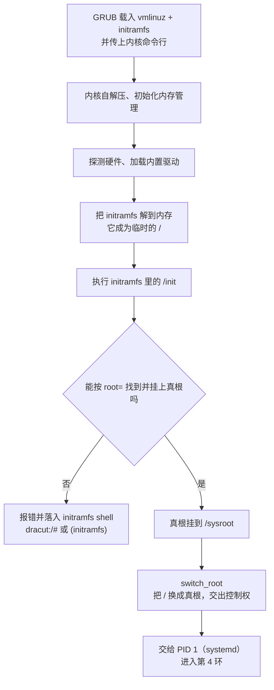

---
tags:
  - Linux
  - 启动流程
  - 内核
  - initramfs
created: 2026-09-18
---

# 第 3 环：内核与 initramfs

> [!cite] 参考资料
> `man 8 dracut`、`man 5 dracut.conf`、`man 1 lsinitrd`、`man 8 initramfs-tools`、`man 5 initramfs.conf`、`man 7 bootup`；救援入口的用法见子笔记 07、11。
>
> 本篇结论来自上述资料，**命令输出尚未在实验机上逐条实测**；本机结果与文中不一致时以本机输出为准，并回填到对应小节。

> **这篇讲什么**：控制权交到内核手里之后，到「真正的根文件系统挂上」为止发生了什么，以及为什么这一环是「换硬件/迁移系统后起不来」的重灾区。
>
> **必须先读什么**：[[Linux/02_启动流程与内核/01_前置_硬件固件与磁盘分区|01 前置]]（UUID、块设备）、[[Linux/02_启动流程与内核/02_前置_文件系统挂载与fstab|02 前置]]（挂载、根文件系统）、[[Linux/02_启动流程与内核/03_前置_内核进程与观测命令|03 前置]]（内核镜像与模块）。
>
> **读完能回答**：① `initramfs` 解决的是什么死锁？② 根设备是怎么被找到的？③ 哪些变更必须重建 `initramfs`，怎么安全地重建？
>
> 所属：[[Linux/02_启动流程与内核/00_导读与知识地图|02 启动流程与内核]] 的第 3 环 · 主要练 **S2 变更与回滚**、**S6 恢复操作**、**S4 分层定位**

## 0. 30 秒速览

> [!abstract] 这一篇只要记住六句话
> - **第 3 环要完成的事只有一件：把真正的根文件系统挂上，然后切过去。** 挂不上，系统永远到不了 systemd。
> - **`initramfs` 解决的死锁是「挂根需要驱动，而驱动在根里」**：先把一小套驱动和用户态程序装进内存，用它去挂真根。
> - **它是内存中的临时根，不是磁盘上的系统。** 内核把 cpio 归档解到内存里，执行里面的 `/init`；跑完就 `switch_root` 走人。
> - **根设备由内核命令行的 `root=` 指定**，来源是 `grub.cfg` 里那一行 `linux ... root=UUID=...`。它是「找根」的唯一依据。
> - **凡是让「挂根」变复杂的变化都要重建 initramfs**：换存储控制器、换虚拟化平台、根分区改 LVM/LUKS/iSCSI/NFS、改了 initramfs 配置。
> - **失败现场是 `dracut:/#`（RHEL）或 `(initramfs)`（Debian）**，第一步永远是取证：`cat /proc/cmdline` 对比 `ls /dev/disk/by-uuid/`。

## 1. 这一环在干什么

### 1.1 内核启动的四步

GRUB 把 `vmlinuz` 和 `initramfs` 载入内存之后，内核按顺序做四件事：

| 步骤 | 做什么 | 出问题的典型现象 |
| --- | --- | --- |
| 1. 自解压与初始化 | 把自己解压、建立内存管理、初始化 CPU | 极早期的 panic，通常只有一行输出 |
| 2. 探测硬件 | 枚举总线、加载内置驱动、识别 CPU/内存 | 设备识别不全 |
| 3. 挂载 `initramfs` 作为临时根 | 把内存里的归档解开，当作 `/` | 归档损坏 → `Initramfs unpacking failed` |
| 4. 执行 `/init` | 跑 initramfs 里的初始化程序，由它去挂真根 | 落进 `dracut:/#` 或 `(initramfs)` |

注意第 3、4 步：**这时候的 `/` 不是你的系统盘，是内存里的临时根。** 你的真根此刻还没被挂上。

### 1.2 为什么必须有 `initramfs`

问题出在一个循环依赖上：

> 要挂载根文件系统，就得先有它的驱动（LVM、RAID、LUKS、iSCSI、NVMe 控制器……）；
> 但驱动文件存放在根文件系统里。

这是一个「先有鸡还是先有蛋」的死锁。`initramfs` 就是把解这个死锁所需的最小集合——**存储与文件系统驱动 + 一小套用户态工具**——打成一个归档，让内核先跑它。

所以判断「要不要重建 initramfs」的逻辑很简单：**只要是让「挂根」这件事变复杂的变化，都要重建。** 哪些算，见第 5 节。

### 1.3 完整时序



`switch_root` 是这一环的终点动作：**把内存里的临时根换成真正的根，并在真根上启动 PID 1**。做完这件事，initramfs 的使命就结束了。

## 2. `initramfs` 到底是个什么文件

### 2.1 它是一个归档，不是一个小系统

`initramfs` 是一个 **cpio 归档**（可以理解为「给内核用的 tar」），通常经过压缩。内核把它解开到内存里的 `tmpfs`，于是内存里出现了一棵完整的目录树：

```text
/init          ← 内核执行的第一个程序
/etc           ← 最小配置
/lib/modules   ← 挂根所需的驱动
/bin /sbin     ← busybox 或精简工具集
/sysroot       ← 真根稍后挂到这里（此时还是空目录）
```

几个澄清点：

- **它不是磁盘镜像，也不占磁盘空间**，全部在内存里，所以开机时多占几十到几百 MiB 内存是正常的。
- **它不是「精简版操作系统」**，只是为了完成「挂根」这一件事而存在。里面没有 systemd 服务、没有你的业务。
- 现代发行版的 initramfs 常常是**多段 cpio 拼接**（例如前面一段放 CPU 微码，后面一段才是主内容）。所以用 `cpio` 手工解包时可能要跳过前面几段——用发行版自带的 `lsinitrd` 更省事。

### 2.2 `initrd` 和 `initramfs` 不是一回事

旧文档里常出现 `initrd`。两者的差别是：

| | 旧 initrd | 现代 initramfs |
| --- | --- | --- |
| 形态 | 一块「压缩的块设备镜像」，需要先当设备挂上 | cpio 归档，直接解成 `tmpfs` |
| 挂载前的处理 | 需要 ramdisk 驱动 | 内核原生支持 |
| 现在是否还用 | 基本不用 | 主流 |

遇到老文档时按这个对照翻译即可；现代的 `/boot/initrd.img-*` 文件名字虽然还叫 `initrd`，内容其实已经是 initramfs。

## 3. 根设备是怎么被找到的

### 3.1 `root=` 是唯一依据

内核本身不知道「你的系统盘是哪一块」。它只听命令行里那一个参数：

```bash
cat /proc/cmdline                          # 验证：本次启动实际收到的完整命令行，里面能找到 root=
```

这一串参数由 GRUB 从 `grub.cfg` 的 `linux` 那一行读出来、原样传给内核。所以链条是：

```text
/etc/default/grub（或 grubby 管理的配置）
        ↓ 重新生成
/boot/grub2/grub.cfg 里的 linux 行
        ↓ GRUB 传递给内核
/proc/cmdline 里的 root=UUID=...
        ↓ 内核与 initramfs 使用
/dev/disk/by-uuid/<uuid> 这个设备
```

**任何一个环节写的是旧值，都会在最后一环暴露成「找不到根设备」。** 这也是为什么换盘、克隆系统之后不能只改一处。

> [!info] 根在 LUKS、LVM 或软 RAID 上时，`root=` 只是答案的一半
> 如果根分区不是一块普通分区，还得额外告诉 initramfs「怎么把它组装出来」。这几个参数会一起出现在 `/proc/cmdline` 里：
>
> | 参数 | 作用 | 值从哪里来 |
> | --- | --- | --- |
> | `rd.luks.uuid=` | 指出要解锁哪个 LUKS 加密设备 | LUKS 容器的 UUID（`blkid`、`cryptsetup luksUUID`）；Debian 系的对应配置在 `/etc/crypttab` |
> | `rd.lvm.lv=` | 指出根在哪个逻辑卷 | `lsblk` 里的 `vg/lv` 名称 |
> | `rd.md.uuid=` | 指出要组装哪个软 RAID 阵列 | 阵列 UUID（`mdadm --detail`） |
>
> 这些值同样由安装器写在启动配置里，**分区迁移、克隆系统、重建加密卷之后都会失效**，排查思路与 `root=` 完全一致：先在 initramfs shell 里确认设备能不能被看到，再对比参数。
>
> 现象上有个明显差别：**加密根会在挂载前先要求输入口令**（dracut 的解锁提示）。口令输错、或设备压根没识别到，最终都会落到同一个 `dracut:/#`——但前者是输入问题，后者是驱动或参数问题，处置方向完全不同。

### 3.2 `/sysroot` 与 `switch_root`

真根挂上以后，并不是直接变成 `/`，而是先挂在 `/sysroot`：

```bash
mount -o remount,rw /sysroot               # 验证：救援场景下把 /sysroot 从只读改成可写
```

停在这一步（`rd.break`）时你看到的世界是「内存里的临时根」，`/sysroot` 才是你的真实系统。想改真系统里的文件（比如重置密码），必须先 `chroot /sysroot`，否则改的是临时根——**重启就没了**。

### 3.3 挂根失败时的现场

这一环失败的报错很有辨识度，认出它们就能立刻定位：

| 报错 | 含义 | 常见原因 |
| --- | --- | --- |
| `VFS: Unable to mount root fs on unknown-block(0,0)` | 内核完全没找到根设备 | `root=` 写错、驱动不在 initramfs 里 |
| `Warning: /dev/disk/by-uuid/<uuid> does not exist` | UUID 找不到 | 分区被重建导致 UUID 变了、盘没识别到 |
| `dracut-initqueue timeout` | 等待设备超时 | 存储驱动缺失、多路径/iSCSI 配置没跟上 |
| `Gave up waiting for root file system device`（Debian） | 同上 | initramfs-tools 体系下的等价报错 |
| 落入 `dracut:/#` 或 `(initramfs)` | initramfs 给了一个救援 shell | 以上任何一种，具体看前面几行 |

## 4. 两套工具链

发行版不同，命令和路径都不同。**第一遍只需要记两件事：你现在用的是哪一套，以及「重建当前内核」那条命令。**

| 维度 | RHEL 8/9（`dracut`） | Debian/Ubuntu LTS（`initramfs-tools`） |
| --- | --- | --- |
| 生成物 | `/boot/initramfs-$(uname -r).img` | `/boot/initrd.img-$(uname -r)` |
| 重建当前内核 | `dracut -f` | `update-initramfs -u` |
| 重建所有内核 | `dracut --regenerate-all -f` | `update-initramfs -u -k all` |
| 追加驱动 | `/etc/dracut.conf.d/*.conf` 里写 `add_drivers+=" nvme "` 或 `force_drivers+=" nvme "`，或命令行 `--add-drivers` | 写进 `/etc/initramfs-tools/modules`（一行一个模块名） |
| 主配置文件 | `/etc/dracut.conf`、`/etc/dracut.conf.d/` | `/etc/initramfs-tools/initramfs.conf` |
| 查看内容 | `lsinitrd` | `lsinitramfs` |
| 内核升级时 | 由内核包自动触发重建 | 由 `linux-image-*` 的 postinst 自动触发 |

> [!important] `add_drivers` 与 `force_drivers` 的差别
> 两者都会把指定模块加进 initramfs；`force_drivers` 的语义更强（强制包含、并更早加载），常用于「根设备的驱动必须在扫设备之前就位」的场景。
> 具体行为与默认值在不同 dracut 版本之间有过调整，**以本机 `man dracut.conf` 为准**，不要照抄别人的配置。

> [!warning] host-only 模式：一个容易被忽略的坑
> `dracut` 默认倾向于生成 **host-only** 镜像，也就是「只包含当前这台机器检测到的驱动」，体积小但绑硬件。**把系统盘挂到别的硬件、或换个虚拟化平台，host-only 镜像很可能起不来。**
> 需要跨硬件复用时用 `dracut --no-hostonly -f` 生成通用镜像，代价是体积大、启动略慢。本机的默认行为用 `dracut --print-cmdline` 或配置文件确认，不要照抄别人的。

## 5. 生产动作 A：判断这次变更要不要重建 initramfs（S4）

> [!decision] 先判断，再动手
> 这张表是这一环最高频的决策。「要不要重建」判断错了，后果是「改完重启，机器再也起不来」。

| 你做的变更 | 要不要重建 | 为什么 |
| --- | --- | --- |
| 新增/更换存储控制器（换 RAID 卡、换虚拟化平台、云盘换类型） | **要** | 新控制器的驱动可能不在 initramfs 里，host-only 镜像尤其危险 |
| 根分区迁到 LVM / LUKS / RAID / iSCSI / NFS | **要** | 需要对应的 dracut 模块与启动参数（`rd.luks.uuid=`、`rd.lvm.lv=` 等） |
| 修改 `/etc/dracut.conf.d/` 或 `/etc/initramfs-tools/modules` | **要** | 配置文件不重新生成就不生效 |
| 把系统盘整盘克隆到别的机器 | **要**（且换通用镜像） | 硬件变了，原镜像里的驱动可能不够 |
| 内核升级 | **通常自动** | 包管理器会触发重建；要确认重建成功（DKMS 失败、`/boot` 满都会导致漏建） |
| 只是改内核命令行参数（`quiet`、`console=` 等） | 不用 | 参数归 GRUB 管，与 initramfs 内容无关 |
| 改 `/etc/fstab` 里的非根挂载点 | 不用 | 那是第 4 环 systemd 的事 |
| 更新一个和启动无关的普通软件 | 不用 | 启动过程用不到它 |

## 6. 生产动作 B：安全地重建 initramfs（S2、S6）

> [!example]+ 生产动作：重建 initramfs 并验证
> **什么时候用**：上一节判断为「要」的情况。这是典型 T2 台阶动作。
>
> **动手前确认**：
> 1. `/boot` 空间够（新镜像几十到几百 MiB）：`df -h /boot`
> 2. 备份当前镜像：`cp /boot/initramfs-$(uname -r).img /root/`（放在 `/boot` 外面的原因见下）
> 3. 记录现状：`uname -r`、`cat /proc/cmdline`、`lsinitrd | head -50`
> 4. 确认有快照或带外控制台——**这一类变更做错就是「重启后再也起不来」**
>
> **怎么做**：
> ```bash
> df -h /boot                                   # 验证：剩余空间足够容纳新镜像
> cp /boot/initramfs-$(uname -r).img /root/initramfs-$(uname -r).img.bak   # 备份放 /root，不占用 /boot
> dracut -f                                     # RHEL 系：重建当前内核的 initramfs
> update-initramfs -u                           # Debian 系：等价命令（二选一）
> lsinitrd /boot/initramfs-$(uname -r).img | grep -i <关键驱动>   # 验证：需要的驱动确实进包了
> ls -l /boot/initramfs-$(uname -r).img         # 验证：文件大小与时间戳已更新，且不是 0 字节
> ```
>
> **怎么验证**：`lsinitrd` 里能搜到关键驱动；文件大小与预期相符（不是异常地小）；**真正的验收是重启后用 `uname -r`、`lsblk`、`dmesg | grep -i error` 确认系统正常且设备齐全**。
>
> **怎么退回去**：把备份恢复回 `/boot/` 覆盖新镜像；如果已经起不来，在 GRUB 菜单里选旧内核启动（旧内核的 initramfs 没被动过）。
>
> **要沉淀什么**：变更原因、变更前后的 `lsinitrd` 差异、耗时、`/boot` 剩余空间。`/boot` 空间不足是这一类变更最常见的失败原因，值得写进巡检项。

> [!tip] 为什么要备份到 `/root` 而不是留在 `/boot`
> `/boot` 写满会导致重建出来的镜像被截断，**这时留在 `/boot` 里的备份可能也一起坏掉**。放到 `/root` 是刻意的选择。

## 7. 排障：停在 initramfs shell（S4、S6）

> [!tip] 第一反应不要是：反复重启，或者只去改 `/etc/fstab`
> **`fstab` 在这一环根本还没被读。** 停在这里说明系统连真根都没挂上，问题在驱动层或 `root=` 参数，不在挂载清单。

按下面顺序取证，**每一步都在回答「它要什么」和「有什么」这两个问题**：

1. **它要什么**：`cat /proc/cmdline`，看 `root=` 指向哪个设备。
2. **有什么**：`ls /dev/disk/by-uuid/`、`blkid`、`lsblk`，看当前能识别到哪些设备。
3. **分支出结论**：
   - 目标设备**在列表里**，但名字/UUID 与 `root=` 不符 → 设备识别正常，是**参数旧了**（分区被重建、系统被克隆）。
   - 目标设备**完全不在列表里** → 内核或 initramfs 根本没识别到那块盘，是**驱动缺失**。
4. **收集报告**：`cat /run/initramfs/rdsosreport.txt`（RHEL 系 dracut 生成的诊断报告，报 bug 或提交工单时要求附带）。

```bash
cat /proc/cmdline                          # 验证：内核在找哪个根设备
ls /dev/disk/by-uuid/                      # 验证：当前能看到的块设备 UUID 有哪些
lsblk                                      # 验证：磁盘与分区结构是否被识别
cat /run/initramfs/rdsosreport.txt         # 验证：dracut 汇总的诊断报告（RHEL 系）
```

> [!warning] 权限提醒
> `rdsosreport.txt` 里包含设备序列号、UUID、内核命令行等主机信息。提交工单或贴到外部渠道之前先做脱敏。

**处理方向**（在能进系统之后做，不要在救援 shell 里瞎试）：

- 参数旧了 → 更新 `root=`：RHEL 用 `grubby --update-kernel=ALL --args=...`，Debian 修 `/etc/default/grub` 后 `update-grub`。
- 改完**必须**复查 `cat /proc/cmdline`，确认新值真的进了启动配置；只改文件不核对，等于没验证。
- 驱动缺失 → 补进 initramfs 配置后重建（第 6 节），重启验证。
- 只是临时要进系统 → 在救援 shell 里手工挂载真根、`exit` 继续启动流程，属于应急手段，事后必须回到上面两条做正式修复。

## 8. 常见坑

| 常见做法或说法 | 后果或事实 |
| --- | --- |
| 换存储控制器后只改 `fstab` | `fstab` 在第 4 环才被读，改它解决不了第 3 环的问题 |
| 把 initramfs 当成「小操作系统」 | 它只为挂根存在，里面没有你的服务，也没有 systemd 的完整环境 |
| 重建前不看 `/boot` 空间 | 空间不足 → 镜像被截断 → **保证起不来**；备份要放到 `/boot` 之外 |
| 备份 initramfs 留在 `/boot` | 写满时新镜像和备份一起损坏，等于没有备份 |
| 用 host-only 镜像迁移系统 | 换硬件/换虚拟化平台后驱动缺失，落进 initramfs shell |
| 在 `rd.break` 或 `dracut:/#` 里直接改文件 | 改的是内存里的临时根或没 `chroot` 的路径，重启即失效；改真系统必须先挂可写并 `chroot` |
| 认为远程改 initramfs「风险不大」 | 这是少数几个**一次做错就彻底失联**的操作，必须先在实验机演练 |

## 9. 决策练习

> [!question]- 场景：一台虚拟机从 A 平台迁到 B 平台后，启动停在 `dracut:/#`。`cat /proc/cmdline` 里的 `root=UUID=xxxx`，而 `ls /dev/disk/by-uuid/` 里根本看不到 `xxxx`
> 你判断最可能的原因是什么？
> A. `/boot/grub2/grub.cfg` 损坏了
> B. 新平台的存储控制器驱动不在 initramfs 里，或磁盘标识已改变
> C. `/etc/fstab` 写错了
>
> **答案：B。**
> 关键证据是「UUID 连出现都没出现」——说明系统根本没识别到那块盘，问题在**设备识别层**而不是参数层。
> A 站不住：GRUB 已经把内核和 initramfs 载入并交出控制权了，说明 `grub.cfg` 是可读可用的。C 更早就不成立：`fstab` 要等 systemd 起来才会被读，而现在系统还没到第 4 环。
> 处置方向：确认是驱动缺失（补驱动后重建 initramfs，迁移场景用 `--no-hostonly`）还是标识变化（更新 `root=`），两者都要在能进系统时做。

> [!question]- 场景：你刚给一台远端生产机重建了 initramfs，重启前怎么判断这次变更「大概率安全」？
> A. 命令没报错就算安全，直接重启
> B. 确认 `/boot` 空间充足、新镜像大小与时间戳正常、`lsinitrd` 里能搜到关键驱动，并且有旧内核可以回退
> C. 先重启一次看看，不行再说
>
> **答案：B。**
> 远程机器上这类操作的容错成本极高，「命令没报错」不等于镜像可用——**文件被截断、驱动没进包都不会让命令报错**。
> C 的问题在于：如果新镜像真的有问题，机器就再也联系不上了，只能靠带外控制台。所以 S2 的核心不是「会敲命令」，而是**在动手前就设计好验证与退路**。

## 10. 要点自测

> [!question]- `initramfs` 解决的是什么死锁？它和根文件系统是什么关系？
> - 死锁是「挂根需要驱动，而驱动在根里」。initramfs 把所需的驱动与最小用户态工具放进内存，先跑起来去挂真根。
> - 它是**临时的内存根**，只在第 3 环存在；真根挂到 `/sysroot` 后 `switch_root` 切换过去，initramfs 就退场了。

> [!question]- 为什么换了存储控制器或做了根分区迁移后系统可能起不来？三类必须重建的场景是什么？
> - 因为新的根设备依赖新的驱动或新的标识：驱动不在 initramfs 里，或 `root=` 还是旧值。这两件事都不会自动跟着变。
> - 三类典型场景：① 换存储控制器/虚拟化平台/云盘类型、整盘克隆到别的硬件；② 根分区改到 LVM/LUKS/RAID/iSCSI/NFS 之上；③ 修改了 initramfs 的配置文件。

> [!question]- 停在 `dracut:/#` 时，你的第一步是什么？为什么不能先改 `fstab`？
> - 第一步取证：`cat /proc/cmdline` 看内核在找什么，再 `ls /dev/disk/by-uuid/`、`lsblk`、`blkid` 看现在有什么，用两者的差异判断是「参数旧了」还是「驱动缺失」。
> - 不能改 `fstab` 是因为它要到第 4 环 systemd 启动时才被读取；现在系统连真根都没挂上，改它不会产生任何影响。

> 上一篇：[[Linux/02_启动流程与内核/05_第2环_GRUB2引导加载器|05 第 2 环：GRUB2 引导加载器]] ｜ 下一篇：[[Linux/02_启动流程与内核/07_第4-5环_systemd与登录|07 第 4–5 环：systemd 与登录]]
