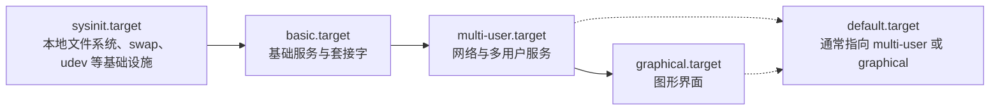

---
tags:
  - Linux
  - 启动流程
  - systemd
  - 救援模式
created: 2026-09-18
---

# 第 4–5 环：systemd 与登录

> [!cite] 参考资料
> `man 7 bootup`、`man 7 systemd.special`、`man 5 systemd.unit`、`man 5 systemd.target`、`man 1 systemctl`、`man 8 sulogin`。
>
> 本篇结论来自上述资料，**命令输出尚未在实验机上逐条实测**；本机结果与文中不一致时以本机输出为准，并回填到对应小节。

> **这篇讲什么**：真根挂上之后，systemd 怎么按 target 与服务依赖把系统带起来，以及「进救援模式修东西」这件事在生产上到底意味着什么。
>
> **必须先读什么**：[[Linux/02_启动流程与内核/06_第3环_内核与initramfs|06 第 3 环：内核与 initramfs]]（`switch_root` 之后控制权交到谁手里）。
>
> **读完能回答**：① target 链是什么，`default.target` 决定什么？② `emergency.target` 与 `rescue.target` 差在哪？③ 为什么「卡住了就有 root shell」是过时的经验？
>
> 所属：[[Linux/02_启动流程与内核/00_导读与知识地图|02 启动流程与内核]] 的第 4–5 环 · 主要练 **S5 救援通道**、**S6 恢复操作**、**S7 风险判断**

## 0. 30 秒速览

> [!abstract] 这一篇只要记住五句话
> - **第 4 环的起点是「内核交给 PID 1」**，现代发行版上这个 PID 1 就是 systemd。它按 target 与 unit 依赖把系统一步步带起来。
> - **`default.target` 决定开机走到哪一步**，它通常是指向 `graphical.target` 或 `multi-user.target` 的软链。`systemctl get-default` 看，`set-default` 改。
> - **`After=`/`Before=` 只排序、不产生依赖**；真正决定「要不要拉起」的是 `Requires=` 与 `Wants=`。写错的常见后果是「服务起不来」或「开机被一个可选依赖拖住」。
> - **四种救援入口差别很大**：两个是 systemd 的 target（要过 `sulogin`），两个是绕过 systemd 的路径（不要密码，因此等于零防护）。
> - **能登录但服务没起属于第 5 环**：先 `systemctl --failed` 与 `systemctl status`，不要在没看清失败单元之前重启或重装。

## 1. 第 4 环：systemd 接管

### 1.1 target 链

systemd 起来后并不是「一口气把所有服务拉满」，而是按一条 target 链往前走。每一环代表「系统到达了某个阶段」：



| target | 含义 | 典型内容 |
| --- | --- | --- |
| `sysinit.target` | 最早的基础设施 | 本地文件系统挂载、swap、`udev` |
| `basic.target` | 基础服务 | 套接字、定时器、路径监控 |
| `multi-user.target` | 多用户、无图形 | 网络、`sshd`、大多数业务服务 |
| `graphical.target` | 图形界面 | 显示管理器 |
| `default.target` | **开机默认终点** | 软链到上面某一个 |

```bash
systemctl get-default                     # 验证：本机开机默认走到哪个 target
systemctl list-units --type=target --state=active    # 验证：当前已到达哪些 target
```

> [!important] `set-default` 是持久变更，`isolate` 是临时切换
> `systemctl set-default multi-user.target` 会**改变下次开机的默认目标**；`systemctl isolate rescue.target` 只影响**本次运行**，重启后仍回到 `default.target`。
> 生产上这两个命令的风险完全不同：前者会让服务器以后都不进图形界面（多数情况下正是想要的），后者会**在当前运行的系统上停掉大部分服务**。

### 1.2 unit 依赖：三类关系要分清

服务起不来、开机变慢，一半以上的原因出在依赖写错。三类关系的作用完全不同：

| 指令 | 语义 | 写错的后果 |
| --- | --- | --- |
| `Requires=` | 硬依赖：被依赖者失败，自己也失败 | 一个可选组件挂掉，连累整个服务起不来 |
| `Wants=` | 软依赖：尽量拉起，被依赖者失败不影响自己 | 写得过少，服务启动时依赖还没就绪 |
| `After=` / `Before=` | **只排序，不产生依赖** | 只写 `After=` 却不写 `Wants=`，表现为「顺序对了但对方根本没被启动」 |

最常见的两个坑：

- **把 `After=` 当成依赖**。它只保证「如果两个都启动，谁先谁后」，不保证对方会启动。
- **把网络依赖写成 `Requires=network-online.target`**。网络没就绪时服务直接失败；通常应该是 `Wants=` + `After=`，否则容易演变成开机等 90 秒（第 5 节）。

## 2. 第 5 环：登录与服务

走到 `default.target` 之后，系统提供两类入口：

| 入口 | 由谁提供 | 起不来时的表现 |
| --- | --- | --- |
| 本地登录 | `getty`（各 tty 上的登录提示符） | 控制台没有登录提示符，但系统其实已经起来了 |
| 远程登录 | `sshd` | 网络通但连不上，`systemctl status sshd` 有失败信息 |
| 业务服务 | 各自的 unit | 能登录、能 ping 通，但端口没监听、接口报错 |

前两类失败属于「入口问题」，第三类才是日常排障的主战场。判断入口统一从状态查起：

```bash
systemctl --failed                        # 验证：当前有哪些 unit 处于 failed 状态（第一入口）
systemctl status <unit>                   # 验证：单个服务的状态、退出码与最近日志
systemctl is-enabled <unit>               # 验证：是否开机自启（enabled / disabled / static）
systemctl is-active <unit>                # 验证：当前是否在运行
```

> [!tip] 「能登录但服务没起」的第一反应不要是重启服务
> 先 `systemctl status <unit>` 看清**它以什么退出码退出、有没有 core dump、退出前打了什么日志**。直接 `restart` 会把上一次失败的现场覆盖掉，把一个可诊断的问题变成一个偶发问题。

## 3. 四种救援入口

### 3.1 对照表

这四种方式经常被混为一谈，实际差别很大。**前两种是 systemd 提供的 target，后两种是绕过 systemd 的路径：**

| 进入方式 | PID 1 是谁 | 文件系统状态 | 能启服务吗 | 要 root 密码吗 | 典型用途 |
| --- | --- | --- | --- | --- | --- |
| `emergency.target` | `systemd` | **只有根被挂上，且默认只读** | 可以手动启单个 unit | **要**（过 `sulogin`） | `fstab` 写坏、根分区需人工干预 |
| `rescue.target` | `systemd` | 所有本地文件系统已挂载 | 可以（基础服务已起） | **要**（过 `sulogin`） | 单用户模式改配置、查依赖 |
| `init=/bin/bash` | 直接是 `bash` | 根通常只读，`/proc`、`/sys` 可能都没挂 | 不能（没有 systemd） | **不要** | 最原始的抢救：改密码、改 `fstab` |
| `rd.break` | 还在 initramfs 里 | 真根挂在 `/sysroot`，只读 | 不能 | **不要** | 改密码、处理根设备与 initramfs 问题 |

进入方式有两种。**运行中切换需要 root，并且会停掉大部分服务：**

```bash
systemctl isolate rescue.target        # 验证：当前系统降到单用户模式
systemctl isolate emergency.target     # 验证：降到紧急模式（只有根挂载）
```

**启动时用内核参数**：在 GRUB 菜单按 `e` 编辑内核行，追加下列参数之一，再按 `Ctrl-X` / `F10` 引导。

```text
systemd.unit=rescue.target         # 等价写法：single、rescue、1
systemd.unit=emergency.target      # 等价写法：emergency
rd.break                           # 停在 initramfs 里，真根在 /sysroot
init=/bin/bash                     # 不要 systemd，直接起一个 shell
```

```bash
cat /proc/cmdline                  # 验证：本次启动到底带了哪些参数（永久性证据）
```

### 3.2 `sulogin`：为什么现代发行版要 root 密码

`rescue.target` 与 `emergency.target` 在给出 shell 之前会先跑 `sulogin` 验证 root 密码。如果 root 已被锁定，你会看到：

```text
Cannot open access to console, the root account is locked
```

**这不是故障，是设计**：它能防住的正是「拿到控制台就等于拿到 root」这件事。

反过来也说明一件事：**真正能无条件拿到 root 的是 `init=/bin/bash` 与 `rd.break` 这类绕过认证的路径**。它们在物理接触与带外控制台面前等于零防护——这不是漏洞，而是「能碰到控制台的人本来就能控制这台机器」这一事实的体现。

## 4. 生产动作：安全地进一次救援模式（S5、S6、S7）

救援模式是这一环最需要「练过才敢用」的东西，因为它的操作对象是**正在运行的生产服务**。

> [!example]+ 生产动作：进入救援模式并恢复
> **什么时候用**：需要在几乎没有服务运行的情况下改配置、修挂载、做离线检查时。
>
> **动手前确认**：
> 1. **这是有服务中断风险的操作**：`isolate` 会停掉大部分服务。生产机上必须先有变更窗口与业务确认；**只读的 `get-default`、`list-units` 可以在生产机上随意执行**。
> 2. 确认 root 密码可用（否则进不了 `rescue.target`/`emergency.target`）。
> 3. 确认控制台可用（本地或带外），因为救援模式下网络与 SSH 多半不可用。
> 4. 记录当前状态：`systemctl --failed`、`systemctl get-default`、关键服务清单。
>
> **怎么做**（实验机）：
> ```bash
> systemctl get-default                  # 验证：记录开机默认 target（后面要用来核对）
> systemctl isolate rescue.target        # 验证：进入单用户模式，提示符变为 root shell
> systemctl list-units --state=active    # 验证：大部分业务 unit 已经不在了；在此处做需要停服务的操作（改配置、查挂载、修文件系统）
> systemctl default                      # 验证：继续启动到默认 target
> systemctl --failed                     # 验证：没有遗留的失败单元
> ```
>
> **怎么验证**：`systemctl get-default` 在操作前后**没有变化**（因为 `isolate` 是临时的）；`systemctl default` 之后关键服务全部回到 active；`systemctl --failed` 为空。
>
> **怎么退回去**：救援模式里如果改坏了东西，直接**重启**即可——因为 `default.target` 没改，系统会尝试回到正常启动。这也是「用 `isolate` 而不是 `set-default`」的原因：**临时切换天然带一条回退路径**。
>
> **要沉淀什么**：进入/退出的耗时、当时停掉了哪些服务、在救援模式里做了什么改动。这段记录本身就是 Runbook 的素材。

> [!warning] `set-default rescue.target` 是一个几乎不该用的操作
> 它会把开机默认目标永久改成单用户模式，机器重启后停在救援环境里。**要进入救援模式就用 `systemd.unit=` 内核参数，它只影响这一次启动**；`set-default` 留给「确实需要改变默认运行形态」的场景（例如服务器改成 `multi-user.target`）。

## 5. 开机卡在「A start job is running for ...（1min 30s）」

这是第 4 环最常见的「开机变慢」现象。那 90 秒是 systemd 的默认设备/任务超时在等一个**永远不会出现的依赖**。

| 等的是谁 | 含义 | 处理方向 |
| --- | --- | --- |
| `dev-disk-by\x2duuid-<uuid>.device` | 某个设备不存在（`fstab` 指向了已下线或改名设备） | 修 `fstab`；可选挂载加 `nofail` 与 `x-systemd.device-timeout=` |
| `NetworkManager-wait-online.service` | 在等网络就绪 | 检查服务的网络依赖是不是写成了 `Requires=`/`Wants=network-online.target` |
| `systemd-udev-settle` | 硬件枚举慢 | 排查是否有驱动或存储设备响应迟缓 |

```bash
systemctl list-jobs                      # 验证：当前还有哪些 job 卡在排队或运行
systemd-analyze blame | head -20         # 验证：单元自身耗时排行（不含等待依赖的时间）
systemd-analyze critical-chain           # 验证：关键路径上是谁拖住了开机（比 blame 更接近「为什么慢」）
```

> [!important] `blame` 和 `critical-chain` 要配合看
> `blame` 排的是**单元自身**的耗时，不含它等待依赖的时间；真正拖慢开机的往往是关键路径上的等待。只看 `blame` 容易误判成「某个无辜的服务很慢」。

## 6. 常见坑

| 常见做法或说法 | 后果或事实 |
| --- | --- |
| 把 `After=` 当成依赖 | 它只排序不拉取；对方没被启动，你还是起不来 |
| 用 `Requires=network-online.target` | 网络未就绪时服务直接失败，或开机干等 90 秒 |
| 用 `set-default` 进救援模式 | 默认目标被永久改掉，重启后停在救援环境 |
| 在生产机上「试一下」`isolate` | 会停掉大部分服务，属于有业务影响的变更 |
| 以为 `rescue`/`emergency` 一定会给 root shell | 现代发行版要过 `sulogin`；root 被锁定时只会看到拒绝信息 |
| 服务失败后先重启 | 覆盖现场；应先 `systemctl status` 看清退出码与日志 |
| 只优化 `blame` 里的头几名 | 拖慢开机的常在 `critical-chain` 的关键路径上，两者要对上 |

## 7. 决策练习

> [!question]- 场景：一台生产机重启后进入 `You are in emergency mode`。你想立刻进系统修，但发现它要求输入 root 密码，而密码在密码管理器里需要网络审批才能拿到
> 你现在最该做的是什么？
> A. 直接重启，希望下次能起来
> B. 先用控制台把现场记下来（`systemctl --failed`、`journalctl -xb` 的关键片段、屏幕照片），然后再走取密码的流程
> C. 用 `init=/bin/bash` 绕过认证，进去把它修好
>
> **答案：B。**
> 紧急模式的现场是有限的（日志会被后续启动覆盖），而**取密码需要时间**，这段时间正是取证窗口。先记录再动手，成本最低。
> A 会把同一场景重演一遍并继续覆盖日志；C 在数据上可行，但它**绕过了系统设计的认证保护**，在生产上属于需要审批的安全事件，不能作为「图省事」的默认选择。

> [!question]- 场景：一台服务器开机比平时慢了 90 秒，`systemd-analyze blame` 显示某个无关紧要的小服务耗时最长
> 下一步该看什么？
> A. 优化 `blame` 里排第一的那个服务
> B. 看 `systemd-analyze critical-chain`，找关键路径上真正在等待的环节
> C. 把 `DefaultTimeoutStartSec` 调小
>
> **答案：B。**
> 90 秒这个数字本身就是线索——它是默认超时，说明某个依赖一直在等。`blame` 只反映单元自身耗时，等待依赖的时间根本不计入，所以它排出来的「第一名」常常是误导。
> C 是把症状藏起来：超时调小之后开机是快了，但那个挂不上/连不上的东西仍然没解决。

## 8. 要点自测

> [!question]- target 链是什么？`default.target` 起什么作用？
> - 链条是 `sysinit.target` → `basic.target` → `multi-user.target` → `graphical.target`，每一环代表系统到达的一个阶段。
> - `default.target` 是软链，指向开机要到达的终点（`multi-user` 或 `graphical`）；用 `systemctl get-default` 查看、`set-default` 修改。

> [!question]- `emergency.target` 与 `rescue.target` 的差别是什么？各适合什么场景？
> - `emergency.target`：只有根文件系统挂载且默认只读，适合 `fstab` 写坏、需要人工干预根分区的场景。
> - `rescue.target`：本地文件系统全部挂载、基础服务已起，适合改配置、查依赖问题。
> - 两者都要过 `sulogin`；都要用 root 密码。

> [!question]- 为什么说「卡住了就有 root shell」是过时的经验？
> - 现代发行版的 `rescue`/`emergency` 都要过 `sulogin` 验证 root 密码，root 被锁定时会直接拒绝。
> - 真正无条件的路径是 `init=/bin/bash` 与 `rd.break` 这类绕过 systemd 的做法——也正因如此，它们在能接触控制台的人面前等于零防护，属于安全事件范畴。

> 上一篇：[[Linux/02_启动流程与内核/06_第3环_内核与initramfs|06 第 3 环：内核与 initramfs]] ｜ 下一篇：[[Linux/02_启动流程与内核/08_内核参数与内核模块|08 内核参数与内核模块]]
