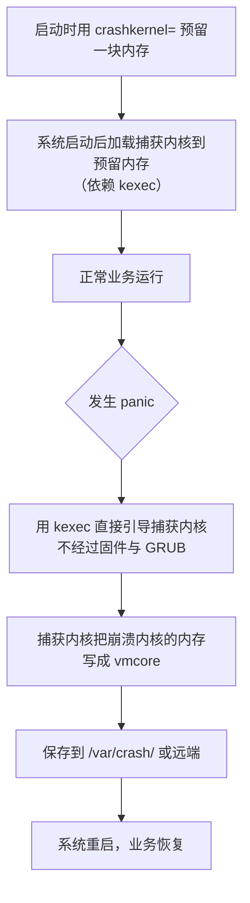

---
tags:
  - Linux
  - 内核
  - kdump
  - 崩溃取证
created: 2026-09-18
---

# 崩溃取证：kdump 与 vmcore

> [!cite] 参考资料
> `man 8 kdumpctl`、`man 5 kdump.conf`（RHEL 系）、`man 1 kexec`、`man 8 makedumpfile`、`man 1 crash`；内核文档 `Documentation/admin-guide/kdump/`；`crashkernel=` 参数的作用见子笔记 08。
>
> 本篇结论来自上述资料，**命令输出尚未在实验机上逐条实测**；本机结果与文中不一致时以本机输出为准，并回填到对应小节。
>
> **本篇属于【进阶】**：第一遍只需要读第 0 节和第 1 节，知道「panic 的现场会被 kdump 存成 `vmcore`」即可，配置与分析留到需要时再回来看。

> **这篇讲什么**：内核崩溃的现场为什么会消失、kdump 怎么把它留下来，以及拿到 `vmcore` 之后从哪看起。
>
> **必须先读什么**：[[Linux/02_启动流程与内核/08_内核参数与内核模块|08 内核参数与内核模块]]（`crashkernel=` 属于启动参数）。
>
> **读完能回答**：① panic 之后现场为什么留不下来？② kdump 靠什么机制抓现场？③ 拿到 `vmcore` 之后第一步看什么？
>
> 所属：[[Linux/02_启动流程与内核/00_导读与知识地图|02 启动流程与内核]] 的横切主题 · 主要练 **S3 取证**、**S4 分层定位**

## 0. 30 秒速览

> [!abstract] 这一篇只要记住五句话
> - **内核 panic 之后，现场在内存里，重启即失。** 默认行为就是重新启动，所以「机器莫名重启过」往往只剩一句「它重启过」。
> - **kdump 靠两个前置条件**：启动参数 `crashkernel=` 预留一块内存，加上提前把「捕获内核」用 `kexec` 装好。
> - **panic 时系统切到捕获内核**，由它把崩溃内核的内存写成 `/var/crash/<时间戳>/vmcore`。
> - **没演练过的 kdump 等于没配**：磁盘空间不够、预留值偏小、`kexec` 被环境禁用，都会让你在最需要它的时候抓不到东西。
> - **OOM 不等于内核崩溃**：OOM 是内核杀进程，默认不会产生 `vmcore`。

## 1. panic 之后会发生什么

**panic** 是内核自己判定「无法继续安全运行」后的动作，常见触发原因包括：

- 内核代码路径出现无法恢复的错误（空指针、断言失败、数据结构损坏）；
- 关键子系统失效（根文件系统完全不可访问、init 无法启动）；
- 人为触发，例如 `echo c > /proc/sysrq-trigger`（**破坏性操作，只用于演练**）。

panic 之后默认的处理是：**打印一段诊断信息到控制台，然后重启**。这意味着：

| 现场 | 重启后还在吗 |
| --- | --- |
| 控制台上的 panic 输出 | 只有物理屏或带外日志里还有；没导出就没了 |
| 内核环缓冲（`dmesg`） | 内存内容，重启即失 |
| 崩溃瞬间的进程、内存、调用栈 | 内存内容，重启即失 |
| journal 里的历史日志 | 取决于是否持久化（见子笔记 03） |

所以「机器莫名重启」这类问题，**在不重启的前提下抢到证据**才是关键。

> [!info] 想改变「panic 后自动重启」这个默认行为，用这两个参数
> | 参数 | 作用 |
> | --- | --- |
> | `panic=<秒>` | panic 之后等多少秒再重启；`panic=0` 表示**永不自动重启**，停在现场等人 |
> | `panic_on_oops=1` | 让「oops」（内核还能继续跑的错误）也升级成 panic，避免问题被静默吞掉 |
>
> 日常生产通常保持默认（尽快自动重启以恢复业务）。但**排障窗口期可以临时改成 `panic=0`**：让机器停在崩溃现场，把控制台上的输出抓完，再手动重启。改动方式与其它启动参数一样（见子笔记 05、08）。

## 2. kdump 的原理

kdump 的思路是：**提前准备第二个内核，让它在崩溃时接管现场。**



几个必须理解的点：

- **预留内存是硬成本**：`crashkernel=` 预留的那块内存在系统正常运行期间不可用于业务，所以它是「兜底成本」与「业务内存」之间的取舍。
- **捕获内核是另一个内核**：与被捕获的内核版本相关，由发行版工具配置，不需要你手工编译。
- **它依赖 kexec**：如果环境禁用了 kexec（部分云主机、受管环境、Lockdown 状态），kdump 就无法工作。

## 3. 配置与验证

```bash
cat /proc/cmdline | tr ' ' '\n' | grep crashkernel   # 验证：启动参数里到底预留了多少
cat /sys/kernel/kexec_crash_size                     # 验证：内核实际为 kdump 保留了多少字节
systemctl status kdump                               # 验证：kdump 服务是否在跑（RHEL 系）
kdumpctl status                                     # 验证：捕获内核是否已加载（RHEL 系）
kdump-config show                                   # 验证：Debian 系的等价命令（软件包名为 kdump-tools）
kdumpctl estimate                                   # 验证：官方工具给出的建议预留值（RHEL 系，比拍脑袋靠谱）
ls -lt /var/crash/                                  # 验证：历史上抓到过哪些崩溃
```

预期：`kdumpctl status` 显示捕获内核已加载；`/var/crash/` 下每个目录对应一次崩溃，里面有 `vmcore` 与 `vmcore-dmesg.txt`。

配置要点：

- **预留值**由内存容量、内核版本与发行版共同决定：太小会导致抓不全或直接抓失败，太大则常年占用业务内存。**用 `kdumpctl estimate` 在本机算，不要照抄别人的数字。**
- **转储路径**在 `/etc/kdump.conf`（RHEL 系；Debian 系的对应配置是 `/etc/default/kdump-tools`）：本地目录最基础，生产更常见的是 NFS/SSH 远端转储。**如果转储目标是本机磁盘，根分区写满时崩溃就抓不下来了。**
- **过滤与压缩**由 `makedumpfile` 负责：去掉零页与无关页能显著缩小文件。即便如此，`vmcore` 仍可能接近内存容量级别，**空间必须提前算好**。
- **Secure Boot 环境**下 kexec 受 Lockdown 限制，kdump 依赖发行版提供的**已签名**捕获内核。

## 4. 拿到 `vmcore` 之后怎么分析

```bash
ls -lt /var/crash/<时间戳>/                  # 验证：目录里通常有 vmcore 与 vmcore-dmesg.txt
crash /usr/lib/debug/lib/modules/$(uname -r)/vmlinux /var/crash/<时间戳>/vmcore
```

进入 `crash` 交互后，推荐的初步顺序：

| 命令 | 看什么 |
| --- | --- |
| `bt` | 崩溃时的调用栈——先定位崩在哪个子系统 |
| `log` | 崩溃前的内核日志——最直接的一条线索 |
| `ps` | 崩溃瞬间的进程列表——谁在跑、有没有卡在 D 状态 |
| `vm` | 内存状态——判断是资源耗尽还是代码路径问题 |
| `exit` | 退出 |

两点前提：

- **需要匹配版本的 debuginfo**（`vmlinux` 与内核版本必须对应），否则符号解析不出来，只能看到地址。
- `vmcore-dmesg.txt` 是纯文本的崩溃前内核日志，**没有 debuginfo 也能看**，是性价比最高的一份证据。

## 5. 云主机与受限环境怎么办

| 情况 | 降级方案 |
| --- | --- |
| 环境禁用 kexec | 抓不到了；改用**串口/带外控制台日志**作为唯一证据来源 |
| 根分区太小、放不下 `vmcore` | 改远端转储；或接受「只保留 `vmcore-dmesg.txt`」 |
| 无法确认是内核崩溃还是掉电重启 | 看带外日志与 BMC 的事件日志；两者在操作系统侧是「一样」的，但硬件侧有区别 |
| 只想先知道「有没有崩过」 | `ls /var/crash/`、`journalctl --list-boots`、`journalctl -b -1 -k` |

> [!warning] OOM 不是内核崩溃
> OOM Killer 是内核在内存不足时**杀掉一个进程**，属于正常的内核机制，默认不会产生 `vmcore`。
> 只有在显式配置了 `vm.panic_on_oom=2` 之类的参数时，OOM 才会升级成 panic 并进入 kdump 流程。**这个选项不适合「宁可杀一个进程也不许重启」的服务**，取舍要先和业务对齐。

## 6. 生产动作：演练一次 panic 取证（S3）

> [!example]+ 生产动作：主动触发一次 panic，验证 kdump 真的能抓到现场
> **什么时候用**：新机器上架、kdump 配置变更后、以及年度的应急演练。
>
> **动手前确认**：
> 1. **这是破坏性操作**：会让内核立即崩溃。**只在可快照的实验机上做**，生产机上永远不做。
> 2. 已配置 `crashkernel=` 且 `kdumpctl status` 显示捕获内核已加载。
> 3. 转储目标（本地或远端）有足够空间。
> 4. 已确认快照可用。
>
> **怎么做**：
> ```bash
> sysctl kernel.sysrq                            # 验证：sysrq 是否开启（0 表示全关，需要先放开）
> kdumpctl status                                # 验证：捕获内核已加载
> echo c > /proc/sysrq-trigger                   # 验证：立即触发内核 panic（仅实验机）
> ls -lt /var/crash/                             # 机器自动重启后：验证是否生成了新的 vmcore 目录
> journalctl -b -1 -k | tail -50                 # 验证：上一次启动崩溃前的内核日志
> ```
>
> **怎么验证**：`/var/crash/<时间戳>/` 下出现 `vmcore` 与 `vmcore-dmesg.txt`；`vmcore-dmesg.txt` 里能看到 panic 前后的输出；`kdumpctl status` 在重启后恢复正常。
>
> **怎么退回去**：清理 `/var/crash` 里的大文件；确认预留内存与业务内存需求是否需要调整。**注意：这次演练本身会丢失内存中的未落盘数据，必须是无业务的实验机。**
>
> **要沉淀什么**：抓到的 `vmcore` 体积、转储耗时、磁盘空间消耗、`kdumpctl estimate` 的建议值。**没演练过的 kdump 和没配是一样的**，这条记录就是它「有效」的证明。

## 7. 常见坑

| 常见做法或说法 | 后果或事实 |
| --- | --- |
| 配了 kdump 就以为万事大吉 | 空间不足、预留值偏小、kexec 被禁都会让它静默失效；必须演练 |
| 转储目标设在本机根分区 | 根分区写满时崩溃抓不下来；生产应优先远端转储 |
| 照抄别人的 `crashkernel=` 值 | 预留值与内存容量、内核版本、发行版相关；用 `kdumpctl estimate` 在本机算 |
| 把 OOM 当成内核崩溃 | OOM 默认不产生 `vmcore`；只有显式配置 `panic_on_oom=2` 才会升级为 panic |
| 分析时随便找一份 `vmlinux` | 必须与内核版本匹配，否则符号解析失败，只能看到地址 |
| 忽略 `vmcore-dmesg.txt` | 它是纯文本、无需 debuginfo，往往是性价比最高的第一份证据 |
| 在生产机上做 panic 演练 | 会丢失内存中的未落盘数据，属于严重事故；演练只在实验机 |

## 8. 决策练习

> [!question]- 场景：一台生产机在凌晨重启过，早上你能登录。你想知道「它到底是不是内核崩溃」
> 你的第一步是什么？
> A. 先看看 `/var/crash/` 里有没有新的目录，再 `journalctl --list-boots` 看能回溯几次启动
> B. 立刻重启一次，看会不会复现
> C. 直接查 `dmesg` 有没有 panic 记录
>
> **答案：A。**
> A 同时回答了两个问题：**「有没有抓到 vmcore」**和**「历史日志还在不在」**——这正是取证技能 S3 的标准起手式：先确认证据是否存在，再读证据。
> B 会覆盖现场；C 看的是**本次启动**的环缓冲，与凌晨那次无关（`dmesg -T` 的时间戳在早期还不可靠）。

> [!question]- 场景：一台机器的 kdump 配置齐全，但故障后 `/var/crash/` 是空的。排查时你最先怀疑什么？
> A. 内核版本太旧
> B. 转储目标没空间、预留内存偏小、或环境禁用了 kexec
> C. 需要重装操作系统
>
> **答案：B。**
> kdump 失效的常见原因集中在这三条，而且它们**都不会在平时报错**——只在崩溃那一刻暴露。这也正是「必须演练」的理由。
> `kdumpctl status`、`df`（看转储目录）、`cat /sys/kernel/kexec_crash_size` 三件事就能覆盖大部分排查。

## 9. 要点自测

> [!question]- 内核 panic 之后现场为什么留不下来？kdump 靠什么机制解决？
> - 因为崩溃瞬间的进程、内存与调用栈都在内存里，而默认处理是「打印信息 → 重启」，重启即失。
> - kdump 提前用 `crashkernel=` 预留内存、并用 `kexec` 加载一个捕获内核；panic 时直接引导捕获内核，由它把崩溃内核的内存写成 `vmcore` 保存下来。

> [!question]- 拿到 `vmcore` 之后第一步看什么？有什么不需要 debuginfo 的证据？
> - 先看 `crash` 里的 `bt`（调用栈）与 `log`（崩溃前日志），再用 `ps`/`vm` 判断是资源耗尽还是代码路径问题。
> - `vmcore-dmesg.txt` 是纯文本的崩溃前内核日志，**不需要 debuginfo**，是最容易拿到的第一手证据。

> [!question]- 为什么说「没演练过的 kdump 等于没配」？
> - 因为它的失效条件（空间不足、预留偏小、kexec 被禁）在平时完全不报错，只在崩溃那一刻暴露。
> - 只有在实验机上主动触发一次 panic、确认 `vmcore` 真的落盘并能打开，才算验证过。

> 上一篇：[[Linux/02_启动流程与内核/09_内核升级回滚与热补丁|09 内核升级、回滚与热补丁]] ｜ 下一篇：[[Linux/02_启动流程与内核/11_启动故障处置手册|11 启动故障处置手册]]
