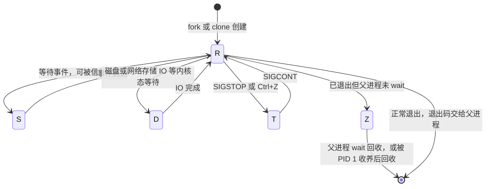

---
tags:
  - Linux
  - 进程
  - 信号
  - cgroup
  - 运维面试
created: 2026-09-16
---

# 进程与信号

> 本笔记对应 [[Linux/00_简介|Linux 大纲]] 的「阶段 3：进程、信号与资源隔离」。目标：能说清进程的生死、状态与信号语义，能定位「卡死、杀不掉、起不来、悄悄消失」这四类问题，并且讲得清 namespace 与 cgroup 各管什么——这两样是后面所有容器问题的基础。
>
> 关联复习：[[02_启动流程与内核]]（PID 1 与 initramfs 里的进程）、[[04_内存管理与OOM]]（OOM Killer 是进程的第三种死法）、[[08_systemd与服务管理]]（服务的重启、限流与信号）、[[10_性能分析与排障]]（CPU 与上下文切换的分析方法）、[[Kubernetes/03_调度_资源_QoS|Kubernetes 资源与 QoS]]（cgroup 的编排层用法）。
>
> 说明：结论以 man 页（`proc(5)`、`signal(7)`、`cgroups(7)`、`systemd.exec(5)`）与内核源码为准；凡涉及默认值、内核差异与发行版差异的地方都标注适用环境（本文以 **RHEL 8/9 系** 与 **Debian/Ubuntu LTS 系** 为主线，cgroup 以 **v2** 为准，v1 差异单独标注）。

> [!warning] 本篇的验证状态：框架已完成，尚未逐条实测
> 本文结论来自 man 页、内核源码与发行版文档，**尚未在实验机上逐条复现**：涉及默认值的地方都给了「查本机」的命令，而不是直接断言数字。
> 建议顺序：先取一份版本基线（`systemd --version`、cgroup 版本、`ulimit -Sa`、`sysctl kernel.pid_max`），再按第 4 节的实验逐个做，把实测输出回填到对应小节，最后核对文末的「自检清单」。

## 0. 30 秒速览

> [!abstract] 这一页只要记住六句话
> - **D 状态杀不掉不是 bug 而是设计**：进程正卡在内核态等待（磁盘 IO、NFS、内核锁），信号要等它回到用户态才处理；`kill -9` 只是把信号挂起来，不是没生效。**判断依据是 `wchan`/`stack`，不是状态字母**。
> - **SIGTERM 是请求，SIGKILL 是命令**。前者可捕获、可优雅退出；后者不可捕获、不可阻塞、不可忽略，代价是文件锁没释放、临时文件残留、数据可能不一致——数据库与消息队列上尤其致命。
> - **进程有三种死法**：正常退出（退出码）、被信号杀死（`128+N`，如 143=TERM、137=KILL）、被 OOM Killer 选中（内核发的 SIGKILL）。**退出码 137 本身不能证明是 OOM**，必须去 `dmesg`/`journalctl -k` 的 OOM 记录里对上号。
> - **僵尸进程不是「没死干净」，是父进程没回收**：它只剩一个 PID 与退出状态，杀它无效，要处理的是父进程（`wait()`，或父进程退出后由 PID 1 收养回收）。
> - **资源限制有五层**：`ulimit`（当前 shell/会话）、`limits.conf`（PAM 登录会话）、systemd unit 的 `LimitXXX=`（服务）、cgroup（整组）、内核全局（`fs.file-max`、`kernel.pid_max`）。**改 `limits.conf` 对 systemd 服务无效**，这是最高频的踩坑点。
> - **namespace 管「看得见什么」，cgroup 管「能用多少」**：容器 = namespace + cgroup + 根文件系统 + 能力/权限约束；少任何一层都不成其为「容器」，面试时能把这四层说全就是加分项。

> [!tip] 怎么用这篇笔记
> 首学按 1 → 2 → 3 读；面试前只看第 0 节与第 5 节。
> 第 4 节的实验里，「`SIGTERM` vs `SIGKILL` 对照」和「三层句柄上限对照」成本最低、收益最高，建议先做这两个。

## 1. 概念

### 1.1 进程与线程：内核眼里它们是同一类东西

Linux 没有独立的「线程」实体，内核调度单位统一叫 **task**；我们平时说的进程，是「一组共享地址空间的 task」加上一个线程组 ID（TGID，就是用户态看到的 PID）。

| 系统调用 | 做了什么 | 用户态对应 |
| --- | --- | --- |
| `fork()` | 复制父进程，得到独立地址空间 | `fork`、`bash` 里的 `&` |
| `execve()` | 用新程序替换当前地址空间，PID 不变 | 所有「启动一个新命令」的动作 |
| `clone()` | 按 flag 决定共享什么（内存、文件描述符、信号处理…） | `pthread_create()`、`clone3()` |

- **`fork` 通常紧跟 `exec`**：`fork` 复制出的子进程马上 `execve` 换成新程序，所以 `fork` 的成本主要不在复制内存（有 COW），而在页表与内核对象。
- **线程 = `clone` 时共享地址空间**：同一个 TGID 下的每个 task 在 `/proc/<pid>/task/` 里各占一个目录，共享 `mm`、文件描述符表；因此一个线程崩溃会带走整个进程。
- **`/proc/<pid>/status` 里的 `Threads:`** 是线程数，`VmRSS` 是**整组共享**的；排查线程级问题看 `top -H`、`ps -eLf`、`ps -L -p <pid>`。
- **`ps -eLf` 的 `LWP` 列**就是线程 ID（TID）；`top -H` 打开后第一列 PID 实际显示的是 TID，这是「`top` 里有个进程占了 100% 但主进程看不见」的经典原因。

```text
ps -eLf                             # 验证：所有进程与线程（LWP 列即 TID，NLWP 为线程数）
ls /proc/<pid>/task                 # 验证：该进程的线程目录列表（每个目录名就是 TID）
ps -L -p <pid> -o pid,tid,pcpu,stat,wchan:20,comm   # 验证：线程级 CPU 与等待点，定位单线程热点
cat /proc/<pid>/status | grep -E 'Threads|VmRSS'    # 验证：线程数与整组内存占用
```

### 1.2 进程状态：五个字母，三种命运

`ps` 的 `STAT` 列与 `/proc/<pid>/status` 的 `State:` 字段取自内核同一张表：

| 状态 | 内核含义 | 常见来源 | `kill -9` 的结果 |
| --- | --- | --- | --- |
| `R` | running / runnable | 正在跑或在运行队列排队 | 立即生效 |
| `S` | interruptible sleep | `sleep`、等网络、等锁，绝大多数进程常态 | 立即生效 |
| `D` | uninterruptible sleep | 等磁盘 IO、NFS/网络存储、内核态锁 | **挂起信号，等它回到用户态才处理** |
| `T` | stopped | `SIGSTOP`、`Ctrl+Z`、调试器挂起 | 先把进程唤醒（`SIGCONT`）才谈得上退出 |
| `t` | tracing stop | 被 `ptrace`（`strace`/`gdb`）挂住 | 同上，先让调试器放掉 |
| `Z` | zombie | 已退出、等父进程回收 | **无效**，它已经死了，问题在父进程 |
| `I` | idle | 内核线程（无 CPU 亲和时才显示） | 一般不需要也不应该管 |
| `X` | dead | 转瞬即逝的中间态 | 基本看不到 |

> [!important] 「D 状态一定杀不掉」这句话只对了一半
> 内核自 2.6.25 起引入 `TASK_KILLABLE`：同样是不可中断睡眠，但**能被致命信号打断**（典型用于 NFS 的某些等待路径）。历史上内核曾在状态表里把它单独显示为 `K (wakekill)`，较新的内核已不再区分，**仍然显示为 `D`**。
> 所以正确的判断方式不是背字母，而是**看它在等什么**：`wchan`、`/proc/<pid>/stack`，以及 `dmesg` 里对应时间点的 IO/NFS 报错。这也是「D 状态查 IO 与网络挂载」这条经验的来源。

`STAT` 还带后缀，读起来很实用：`<` 高优先级、`N` 低优先级（nice 为正）、`L` 有内存页被锁定、`s` 是会话首进程、`l` 是多线程、`+` 位于前台进程组。例如 `Ss` 表示「可中断睡眠 + 会话首进程」，这正是 systemd 与多数守护进程的常态。



图里要看清一件事：**`D` 只能自己走出来，没有人能把它踢出来**——这正是「`D` 状态杀不掉」的可视化版本。

```text
ps -eo pid,ppid,stat,wchan:24,etime,cmd --sort=-pcpu | head -20   # 验证：状态 + 等待点 + 运行时长
cat /proc/<pid>/wchan                # 验证：进程正睡在哪个内核函数上（D 状态的第一手证据）
cat /proc/<pid>/stack                # 验证：内核态调用栈（需要 root 与内核开启栈回溯）
cat /proc/<pid>/status | head -8     # 验证：State 字段的原始值与组信息
```

### 1.3 信号：进程之间唯一被内核承认的「异步通知」

信号有几个必须说死的性质：**派生自内核、投递是异步的、进程只能选择「捕获 / 忽略 / 用默认动作」**。默认动作通常是终止进程，而 `SIGKILL` 与 `SIGSTOP` 是唯二**不可捕获、不可阻塞、不可忽略**的信号。

| 信号 | 号 | 默认动作 | 生产上的含义 |
| --- | --- | --- | --- |
| `SIGHUP` | 1 | 终止 | 终端断开；**守护进程约定用它做配置重载**（重开日志也用得多） |
| `SIGINT` | 2 | 终止 | `Ctrl+C`，交互式中断 |
| `SIGQUIT` | 3 | 终止 + core | 部分程序（如 JVM）用它输出线程栈 |
| `SIGABRT` | 6 | 终止 + core | `abort()`，断言失败的标准出口 |
| `SIGKILL` | 9 | 终止 | 不可捕获；**没有任何清理机会** |
| `SIGSEGV` | 11 | 终止 + core | 段错误，用户态崩溃取证的主战场 |
| `SIGPIPE` | 13 | 终止 | 往已关闭的管道/套接字写；写日志管道断开时常见 |
| `SIGTERM` | 15 | 终止 | 优雅退出的标准信号，`systemctl stop`/`docker stop` 的第一发 |
| `SIGCHLD` | 17 | 忽略 | 子进程状态变化通知，**父进程回收僵尸的钩子** |
| `SIGCONT` | 18 | 继续 | 与 `SIGSTOP` 配对，`fg`/`bg` 背后就是它 |
| `SIGSTOP` | 19 | 停止 | 不可捕获；调试与「冻住进程」用 |
| `SIGUSR1/2` | 10/12 | 终止 | 应用自定义：重开日志、dump 状态（nginx 用 `SIGUSR1` 重开日志文件） |

发送与观测：

```text
kill -15 <pid>                       # 验证：标准的优雅退出（等价 kill -TERM、kill -s TERM）
kill -9 <pid>                        # 验证：强杀（只该在优雅退出超时后用）
kill -15 -<pgid>                     # 验证：给整个进程组发信号（负号即进程组，清理一串子进程时用）
pkill -f '<匹配模式>'                # 验证：按命令行匹配批量发信号（危险，先 ps -ef 核对）
timeout -k 5 30 <cmd>                # 验证：30 秒后发 TERM，5 秒后仍不退则发 KILL
kill -l                              # 验证：信号名与编号对照表
```

四个必须知道的语义边界：

1. **信号是挂起后投递的**：进程正阻塞在某处（尤其是内核态）时，信号会被记下，等它回到用户态才处理。所以「发出去了」不等于「已经生效」，`kill` 命令本身几乎永远返回成功。
2. **可以屏蔽**：程序可以用 `sigprocmask` 阻塞除 `SIGKILL`/`SIGSTOP` 外的信号；这能解释「为什么这个服务对 `SIGTERM` 没反应」。
3. **PID 1 受内核特殊保护**：内核对 PID 1 **不会执行信号的默认动作**——凡是它没有显式安装处理函数的信号，一律被忽略。这条规则在容器里会变成事故（见 1.9）。
4. **`SIGKILL` 也杀不掉 D 状态与僵尸**：前者因为信号投递不进去，后者因为进程已经终止、只剩一个待回收的壳。

### 1.4 进程退出的三种死法

「进程没了」这件事有且只有三类原因，判定方法完全不同：

| 死法 | 表现 | 证据在哪里 |
| --- | --- | --- |
| 正常退出 | 退出码 0（成功）或应用自定义的非 0（`1`、`2`、`255`…） | 应用日志、`systemctl status` 的 `status=<n>`、`$?` |
| 被信号杀死 | shell 里退出码 `128+N`；`systemctl` 显示 `signal=` | `journalctl -u <svc>`、`systemctl show -p ExecMainStatus,ExecMainCode` |
| 被 OOM Killer 选中 | 内核发的 `SIGKILL`，退出码同样是 137 | **只有内核日志**：`dmesg` / `journalctl -k` 的 OOM 记录，cgroup v2 的 `memory.events` |

```text
echo $?                              # 验证：上一条命令的退出码（128+N 表示被信号 N 杀死）
systemctl status <svc>               # 验证：Active/Process 段会写明 code=exited/killed 与 signal
systemctl show -p ExecMainCode -p ExecMainStatus -p ExecMainExitTimestamp <svc>
                                     # 验证：脚本抓取时用这两条字段（exited/killed + 退出码或信号号）
journalctl -k -b | grep -i -E 'out of memory|oom-kill|killed process'
                                     # 验证：OOM Killer 的完整选择过程（含被选中进程的 RSS 与打分）
```

常见退出码对照（面试常被追问「137 是什么」）：

| 退出码 | 含义 | 注意 |
| --- | --- | --- |
| `1` | 通用错误 | 应用自定义，必须看日志 |
| `126` | 找到了命令但无法执行 | 权限不足、不是可执行文件 |
| `127` | 命令未找到 | 脚本里 PATH 不对、依赖缺失 |
| `137` | `128 + 9`：被 `SIGKILL` 杀死 | **可能来自 OOM，也可能来自人工 `kill -9`**，两者要靠内核日志区分 |
| `143` | `128 + 15`：被 `SIGTERM` 终止 | 常见于 `systemctl stop` 到期后系统主动发 TERM |
| `203` | systemd 特定：`EXEC` 失败 | 二进制不存在、权限不对、shebang 有问题，**不是进程退出而是压根没起来** |

### 1.5 用户态崩溃取证：core dump

进程因信号异常终止（`SIGSEGV`、`SIGABRT` 等）时，内核可以把它**当时的内存镜像与寄存器上下文**写成 core 文件；没有 core，事后只能靠日志猜。

链路要按顺序看，缺一环就没有 core：

```text
ulimit -c                            # 验证：当前 shell 的 core 大小上限（0 表示不产生 core）
cat /proc/sys/kernel/core_pattern    # 验证：core 往哪里写——文件名模板，或以 | 开头的管道程序
cat /proc/sys/fs/suid_dumpable       # 验证：setuid 程序是否允许 dump（默认 0，出于安全考虑）
coredumpctl list                     # 验证：systemd 系统上已抓到的崩溃记录（时间、PID、信号）
coredumpctl info <PID 或编号>        # 验证：崩溃进程的可执行文件、调用栈概要、资源限制
coredumpctl debug <PID>              # 验证：直接进 gdb 分析（需要 debuginfo 才好看）
```

RHEL 8/9 与 Ubuntu 的默认落点不同，这是排障时最容易找错文件的地方：

| 发行版 | 默认机制 | core 落在哪 | 相关配置 |
| --- | --- | --- | --- |
| RHEL 8/9 | `systemd-coredump` | `/var/lib/systemd/coredump/`（元数据进 journal） | `/etc/systemd/coredump.conf`（`Storage=`、`MaxUse=`、`ProcessSizeMax=`） |
| Ubuntu | `apport`（新版本也常配 systemd-coredump） | `/var/crash/*.crash` | `/etc/default/apport`、`apport-cli` |
| 传统/手工 | `core_pattern` 为文件名模板 | 崩溃进程的 CWD（容器里容易找不到） | `kernel.core_pattern`、`kernel.core_uses_pid` |

> [!important] 为什么生产上要限制 core 的体积
> core 的大小可以接近进程的整个虚拟地址空间，**一个几 GB 内存的服务崩溃就能写出几 GB 的文件**，而崩溃往往伴随服务反复重启（CrashLoop），几分钟就能把根分区写满——于是「一个服务崩溃」升级成「一整台机器故障」。
> 常见做法：`systemd-coredump` 里设 `ProcessSizeMax=`/`MaxUse=` 限量，或 `Storage=none ProcessSizeMax=0` 完全关闭；容器里通常把 `ulimit -c` 设为 0；确需现场时再在目标机器上临时打开，取完即关。
> 另外两个限制也要知道：**`core_pattern` 以 `|` 开头时由内核把 core 通过管道交给指定程序**（不再自己写文件），安全加固场景常用这种方式集中收集；**setuid 程序默认不产生 core**（`fs.suid_dumpable=0`），这是防信息泄露的设计，不是配置错误。

### 1.6 优先级与调度：nice、chrt、taskset 各管什么

| 手段 | 作用对象 | 取值范围 | 生产上怎么用 |
| --- | --- | --- | --- |
| `nice` / `renice` | CPU 时间分配的相对权重（默认调度器 `SCHED_OTHER`） | `-20`（最高）~ `19`（最低），默认 `0` | 给备份、日志压缩这类批处理任务降优先级；**普通用户只能调大 nice（降优先级）** |
| `ionice` | IO 调度优先级 | `-c 1/2/3`（实时/尽力/空闲）+ `-n 0~7` | 让备份任务在空闲时读写：`ionice -c3` |
| `chrt` | 调度策略与实时优先级 | 策略 `SCHED_OTHER/FIFO/RR/BATCH/IDLE/DEADLINE`，RT 优先级 `1~99` | 只在有明确实验依据时使用；**RT 线程会抢占一切非 RT 任务** |
| `taskset` | CPU 亲和性 | CPU 列表或掩码 | 绑定中断处理、延迟敏感进程；与 cgroup 的 `cpuset` 取交集 |
| `numactl` | NUMA 绑核 + 绑内存 | — | 跨 NUMA 场景，详见 [[04_内存管理与OOM]] |

几条反直觉但重要的结论：

- **nice 只在同一资源组内竞争 CPU 时起作用**。整机 CPU 空闲时，把 nice 调到 19 的进程照样能跑满一个核。
- **实时调度（`SCHED_FIFO`/`SCHED_RR`）是双刃剑**：优先级 99 的 RT 线程如果把 CPU 跑满，普通进程（包括 `sshd`）会被饿死，机器「看起来活着但登不上」。内核用 RT 节流兜底（`/proc/sys/kernel/sched_rt_runtime_us`，默认 `950000`/`sched_rt_period_us` 默认 `1000000`，即最多占 95%），**不要在没读文档的情况下动这两个值**。
- **cgroup 与 nice 是两个层次**：cgroup v2 的 `cpu.weight` 决定**组之间**的分配，nice 决定**组内**的分配，两者叠加生效。容器里调 nice 影响的是容器内部的相对顺序，跨容器要靠 `cpu.weight`/`cpu.max`。
- **`taskset` 不等于 cgroup 的 `cpuset`**：前者改的是单个进程的亲和掩码，后者是整组的可用 CPU 集合，二者是**交集**关系——`taskset` 把进程绑到 cgroup 不允许的 CPU 上是无效的，这种「绑了但没生效」在容器里很常见。

```text
nice -n 10 <cmd>                     # 验证：以 nice 10 启动命令（降低优先级）
renice -n 5 -p <pid>                 # 验证：调整运行中进程的 nice（不能低于硬限制，普通用户只能调大）
chrt -p <pid>                        # 验证：查看进程当前的调度策略与 RT 优先级
chrt -f -p 10 <pid>                  # 验证：改成 SCHED_FIFO 优先级 10（谨慎：需要权限，可能影响整机响应）
taskset -cp <pid>                    # 验证：查看进程当前允许的 CPU 列表
ionice -p <pid>                      # 验证：查看进程的 IO 调度类与优先级
```

### 1.7 资源限制：五层结构，改错地方等于没改

`setrlimit(2)` 定义的那组限制（`ulimit` 就是它的 shell 前端）每个进程各持一份，**软限制是当前生效值，硬限制是软限制的上限**；降低硬限制之后（无特权时）就再也提不回来，这是「手滑把服务锁死」的经典方式。

| 限制 | ulimit 参数 | 控制什么 | 典型故障 |
| --- | --- | --- | --- |
| `RLIMIT_NOFILE` | `-n` | 单进程可打开的 fd 数 | `too many open files` |
| `RLIMIT_NPROC` | `-u` | **同一 real UID** 下的进程/线程数 | `fork: Resource temporarily unavailable` |
| `RLIMIT_CORE` | `-c` | core 文件大小 | 崩溃没有 core（为 0），或 core 写满磁盘 |
| `RLIMIT_AS` / `DATA` | `-v` / `-d` | 虚拟地址空间 / 数据段 | 进程申请内存失败但整机内存充足 |
| `RLIMIT_STACK` | `-s` | 线程栈大小 | 深递归或大局部变量导致段错误（容器里特别常见） |
| `RLIMIT_MEMLOCK` | `-l` | 可锁定内存 | eBPF、RDMA、部分数据库启动失败 |
| `RLIMIT_FSIZE` | `-f` | 单文件最大字节数 | 写大文件时被 `SIGXFSZ` 打断 |

真正重要的是**这五层分别管谁**（面试高频，也是「我明明改了怎么不生效」的唯一正解）：

| 层次 | 配置位置 | 生效范围 | 重启/重登后 |
| --- | --- | --- | --- |
| 会话 | `ulimit`（shell 内置） | 当前 shell 及其子进程 | 丢失 |
| 登录会话 | `/etc/security/limits.conf`、`/etc/security/limits.d/*.conf` | **经由 PAM 建立的登录会话**（`sshd` 需要 `UsePAM yes`） | 保留（重新登录才生效） |
| 服务 | unit 里的 `LimitNOFILE=`、`LimitNPROC=`、`TasksMax=` | 该服务拉起的所有进程 | 保留（`daemon-reload` + 重启服务） |
| cgroup | `memory.max`、`cpu.max`、`pids.max`、`io.max`（v2） | 整组进程 | 由 systemd/容器运行时管理 |
| 内核全局 | `fs.file-max`、`fs.nr_open`、`kernel.pid_max`、`kernel.threads-max` | 全系统 | 由 sysctl 配置 |

> [!important] `limits.conf` 对 systemd 服务无效
> 原因：systemd 服务的进程**不是通过 PAM 登录会话拉起来的**，它直接 `fork`+`exec` 并设置自己的限制集（来自 unit 的 `LimitXXX=` 与 `/etc/systemd/system.conf` 的 `DefaultLimitXXX=`，都与 `limits.conf` 无关）。
> 所以正确的改法是写进 unit 或 `systemctl edit <svc>` 的 drop-in：
> ```text
> [Service]
> LimitNOFILE=65535
> TasksMax=infinity
> ```
> 改完 `systemctl daemon-reload && systemctl restart <svc>`，再用 `systemctl show -p LimitNOFILE <svc>` 和 `/proc/<main-pid>/limits` 验证**实际生效值**。
> 反过来说：`limits.conf` 解决的是「人登录进来跑命令」的限额问题，系统服务与容器里跑的服务都不归它管。

```text
ulimit -Sa                            # 验证：当前会话的软限制全表
ulimit -Ha                            # 验证：当前会话的硬限制全表（软限制不能超过它）
cat /proc/<pid>/limits                # 验证：某个进程真正生效的限制（排障的最终依据）
prlimit --pid <pid>                   # 验证：查看运行中进程的限制（与 /proc/<pid>/limits 同源）
prlimit --pid <pid> --nofile=4096:4096   # 验证：在线调整（只能降低硬限制，或在不超硬限制内调软限制）
systemctl show -p LimitNOFILE -p TasksMax <svc>   # 验证：unit 层的配置值
```

### 1.8 资源耗尽：进程数、线程数与句柄

| 上限 | 文件 | 语义 | 撞上之后 |
| --- | --- | --- | --- |
| `kernel.pid_max` | `/proc/sys/kernel/pid_max` | PID 编号上限（分配不出新 PID 就无法创建进程） | `fork` 返回 `EAGAIN`；内核日志可能提示 PID 耗尽 |
| `kernel.threads-max` | `/proc/sys/kernel/threads-max` | 全系统 task 总数上限 | 创建线程失败，报 `EAGAIN` 或 `Cannot allocate memory` |
| `RLIMIT_NPROC` | `ulimit -u` | **同一 UID** 的进程数 | 该用户的 `fork` 失败（其他用户不受影响，这是关键特征） |
| cgroup `pids.max` | `/sys/fs/cgroup/.../pids.max` | 整组的 task 数（容器里通常就是它） | `fork` 失败；内核日志出现 `cgroup: fork rejected by pids controller` |
| `fs.nr_open` | `/proc/sys/fs/nr_open` | 单进程 fd 上限的**硬顶** | `ulimit -n` 设置超过它无效，或 fd 分配失败 |
| `fs.file-max` | `/proc/sys/fs/file-max` | 全系统 fd 总数 | 全系统范围的开文件失败，`/proc/sys/fs/file-nr` 的第三列就是它 |

关于 `pid_max` 有一个必须记住的前提：**现代发行版的值往往不是内核默认值**，而是 systemd 通过 `/usr/lib/sysctl.d/50-pid-max.conf` 抬高的（该文件内容是 `kernel.pid_max = 4194304`，用于降低 PID 复用带来的风险），因此**只能用 `sysctl kernel.pid_max` 看本机实际值，不要背数字**。

fork 风暴（进程数被瞬间打满）的现场特征是很好认的：

```text
cat /proc/loadavg                    # 验证：最后一列是「最近分配的 PID」，连续两次就能看出 PID 消耗速率
ps -e --no-headers | wc -l           # 验证：当前 task 总数（注意统计口径：ps 默认按进程，加 -L 按线程）
ps -eo user,ppid,comm --no-headers | sort | uniq -c | sort -rn | head -20
                                     # 验证：谁在批量创建进程（按用户/父进程/命令名聚合）
cat /proc/sys/fs/file-nr             # 验证：已分配句柄数 / 未使用 / 系统上限（前两个数字长期接近第三个即危险）
ls /proc/<pid>/fd | wc -l            # 验证：单个进程已打开的 fd 数（定位句柄泄漏的第一刀）
lsof -p <pid> | wc -l                # 验证：同上，但能看到 fd 指向的文件/套接字
```

两个容易误判的点：

- **`RLIMIT_NPROC` 是按 real UID 计数的**：同一台机器上多个服务用同一个用户跑时，会互相抢额度；而**拥有特权的进程（root、`CAP_SYS_RESOURCE`）通常不受 `RLIMIT_NPROC` 约束**，所以容器里以 root 运行的程序撞到的多半是 cgroup 的 `pids.max`，不是 `ulimit -u`。
- **句柄耗尽未必是「泄漏」**：也可能是设计上就该开这么多（每个连接一个 fd，每个日志文件一个 fd），先看 `/proc/<pid>/fd` 里到底是套接字还是普通文件，再谈是不是泄漏。

### 1.9 僵尸与孤儿，以及容器里的 PID 1

**僵尸（Z）**：子进程退出后，退出状态要交给父进程，内核暂时保留它的 `task_struct` 与 PID，直到父进程调用 `wait()`/`waitpid()`。所以：

- `kill -9` 对僵尸无效（它已经终止了），**要处理的是它的父进程**；
- 父进程及时 `wait()` → 立即回收；父进程自己先退出 → 子进程（含僵尸）被 PID 1 收养并由 PID 1 回收，所以**「杀父进程有时能解决僵尸堆积」**；
- 把 `SIGCHLD` 的处置显式设为 `SIG_IGN` 时，内核会自动回收子进程——这是「子进程不用 wait 也不会变僵尸」的唯一例外，默认处置（`SIG_DFL`）不会自动回收。

**孤儿（orphan）**：父进程先退出、子进程还活着，这些进程被「重新挂到」PID 1（或最近的 subreaper）名下。它本身不是故障，但会让守护进程的父子关系变得难以追踪。

容器把这两件事一起放大了：

| 现象 | 原因 | 处理 |
| --- | --- | --- |
| `docker stop` 等 10 秒后强杀，退出码 137 | 容器里的 PID 1 是 `bash` 之类的程序，**没有为 `SIGTERM` 注册处理函数**；内核对 PID 1 不执行默认动作 → `SIGTERM` 等于被忽略 → 超时后由宿主侧 `SIGKILL` | 应用自己处理 `SIGTERM`；或用 `tini`/`dumb-init`、`docker run --init` 作为 PID 1 转发信号 |
| 容器里 `ps` 显示一堆 `<defunct>` | PID 1 不回收被收养的孤儿进程 | 有真正的 init（tini/`--init`），或应用主进程自己 `waitpid(-1, ...)` 循环回收 |
| 宿主机上 `kill -9 1` 毫无反应 | 主机 PID 1 受内核保护，`SIGKILL` 由内核忽略 | 不要试图杀 PID 1；用 `systemctl` 或 `reboot` |

```text
ps -eo pid,ppid,stat,comm | awk '$3 ~ /Z/ {print}'   # 验证：当前所有僵尸及其父进程
ps -o pid,ppid,stat,comm -p <ppid>                   # 验证：僵尸的父进程是谁、状态如何（父进程若卡在 D，僵尸就会堆积）
```

### 1.10 namespace 与 cgroup：隔离「看到什么」与限制「用多少」

这是本阶段最后一块，也是通往容器的桥。一句话区分：**namespace 改的是可见性，cgroup 改的是资源上限**；两者互不替代。

| namespace | 隔离什么 | 典型表现 |
| --- | --- | --- |
| `mnt` | 挂载点与文件系统树 | 容器里看不到宿主机的 `/host`，`/proc/mounts` 不同 |
| `pid` | PID 编号空间（树状嵌套） | 容器内 PID 1 在宿主机上其实是某个普通 PID |
| `net` | 网络设备、协议栈、端口、路由表 | 容器内 `ip a` 只有自己的 `eth0`，80 端口可以与宿主机重复 |
| `ipc` | System V IPC 与 POSIX 消息队列 | 共享内存对象不跨容器 |
| `uts` | 主机名与域名 | 容器有独立 hostname |
| `user` | UID/GID 映射 | 容器内是 root，宿主机上是一个普通 uid（rootless 容器的基础） |
| `cgroup` | cgroup 根视图 | 容器内看不到宿主机完整的 cgroup 树 |
| `time` | 时钟偏移与启动时间 | 容器可以有自己的 `CLOCK_MONOTONIC` 偏移（选项，默认不隔离） |

cgroup v2 的控制器则是一组可读写的文件（**v2 是单一层级**，靠 `cgroup.subtree_control` 向子树委派控制器）：

| 控制器 | 关键文件 | 管什么 |
| --- | --- | --- |
| `cpu` | `cpu.max`（配额）、`cpu.weight`（权重） | CPU 时间分配与上限 |
| `cpuset` | `cpuset.cpus`、`cpuset.mems` | 可用 CPU 与 NUMA 节点 |
| `memory` | `memory.max`、`memory.high`、`memory.current`、`memory.stat`、`memory.events` | 内存上限、软上限、用量与 OOM 计数（详见 [[04_内存管理与OOM]]） |
| `io` | `io.max`、`io.weight` | 块设备读写限速与权重 |
| `pids` | `pids.max`、`pids.current`、`pids.events` | 组内 task 数上限（容器「起不了新进程」的常见原因） |
| `hugetlb`、`rdma`、`misc` | 各自的控制器文件 | 大页、RDMA 资源、杂项设备 |

```text
systemd-cgls                         # 验证：systemd 视角的 cgroup 树（服务 → 进程层级）
systemd-cgtop                        # 验证：各 cgroup 的 CPU/内存/IO 实时占用（-m 按内存排序）
cat /sys/fs/cgroup/cgroup.controllers        # 验证：本机 v2 启用了哪些控制器
cat /sys/fs/cgroup/system.slice/<svc>/pids.current
                                     # 验证：某个服务当前 task 数（与 pids.max 对比即可判断是否接近上限）
lsns                                 # 验证：系统中的 namespace 列表及其所属进程
readlink /proc/<pid>/ns/pid          # 验证：进程所在的 pid namespace 标识（同值即在同一个 ns）
```

> [!important] 容器是四层，不是一层
> **namespace**（隔离视图）+ **cgroup**（限制资源）+ **rootfs/联合文件系统**（文件系统视图，见 [[05_存储与文件系统]]）+ **权限约束**（capabilities、seccomp、SELinux/AppArmor）。
> 面试里「容器的隔离是怎么做的」如果只答 cgroup，或者只答 namespace，都是不完整的；再加上一句「容器与虚拟机最大的差别是**共享同一个内核**、隔离靠内核机制而不是硬件虚拟化」基本就能收住了。编排层的用法见 [[Kubernetes/03_调度_资源_QoS|Kubernetes 资源与 QoS]]。

> [!warning] 不要绕过 systemd 手工往 cgroup 里塞进程
> cgroup v2 下 systemd 是层级树的唯一管理者，它通过 `cgroup.subtree_control` 与自己的记账模型维护整棵树。手工把 PID 写进某个 service 的 `cgroup.procs` 会导致 systemd 的记账与实际不符（服务停了进程还在、`systemctl status` 看不到、资源限制失效）。
> 正确的做法：`systemd-run --unit=... --slice=...`、`systemctl set-property`，或直接改 unit 的资源控制项。

## 2. 生产实践

### 2.1 环境与版本基线

进程相关的结论**极度依赖版本**（cgroup v1/v2、内核的 `TASK_KILLABLE`、systemd 的默认限制），所以动手前先取基线：

```text
ps --version                         # 验证：procps 版本（ps 的列名与语义在版本间有变化）
systemd --version | head -1         # 验证：systemd 版本（决定 TasksMax/DefaultLimitXXX 的默认值）
stat -fc %T /sys/fs/cgroup           # 验证：cgroup2fs 即 v2 混合/统一模式，其余情况要按 v1 处理
ulimit -Sa; ulimit -Ha               # 验证：当前会话的软/硬限制基线
sysctl kernel.pid_max kernel.threads-max fs.nr_open fs.file-max   # 验证：内核级上限基线
systemctl show -p DefaultLimitNOFILE -p DefaultTasksMax           # 验证：systemd 给服务的默认限制
cat /proc/<关键服务的 MainPID>/limits                              # 验证：服务实际拿到的限制（与 unit 配置对齐）
```

预期：把这几条输出记进资产台账。特别是 `DefaultLimitNOFILE` 与 `DefaultTasksMax`——很多「服务偶尔报 `too many open files`」的根因就在这里，而它跟 `/etc/security/limits.conf` 一点关系都没有。

### 2.2 优雅退出与信号设计

服务能被「温柔地停下来」是可用性的一部分，检查项如下：

1. **应用是否处理了 `SIGTERM`**：收到后应停止接收新请求、处理完在途请求、关闭连接与文件、刷新缓冲、释放锁，然后退出。只处理 `SIGKILL`（等于没处理）或只 `exit(0)` 都不算。
2. **给足退出时间**：systemd 的 `TimeoutStopSec=`（默认值查 `systemctl show -p TimeoutStopUSec <svc>`）到期后会补一发 `SIGKILL`；应用的优雅停机时间必须小于它，否则等于没优雅。
3. **需要重载的用 `SIGHUP` 或专门的 reload**：unit 里配 `ExecReload=`，运维用 `systemctl reload <svc>`；这对 nginx、haproxy 这类「重载不丢连接」的服务是硬要求。
4. **进程组一起管**：`KillMode=` 决定 systemd 停止服务时是只杀主进程还是整个 cgroup（默认 `control-group`，即整组）；这解释了「为什么 `systemctl stop` 能连带清掉 worker 进程」，也解释了自定义脚本里 `ExecStop` 写成 `kill $MAINPID` 时可能留下孤儿。
5. **子进程与僵尸由谁负责**：服务作为 PID 1（容器内）时必须自行 `waitpid` 回收，否则僵尸堆积；systemd 管理的服务由 systemd 负责回收。

`kill -9` 的代价要能具体说出来，而不是只说「不好」：

| 场景 | `kill -9` 之后会发生什么 |
| --- | --- |
| 数据库 | 未落盘的事务丢失、恢复期变长，严重时数据文件损坏需要从备份重建 |
| 消息队列 / 分布式组件 | 未提交的偏移与状态残留，重启后重复消费或脑裂 |
| 写文件的批处理 | 目标文件只写了一半（临时文件残留），下游读到脏数据 |
| 持有文件锁的进程 | 锁随进程释放，但**中间状态没有回滚**，其他进程可能看到不一致的数据 |
| 有共享内存 / 信号量的进程 | POSIX 共享内存段残留（`/dev/shm` 占内存），需要手工清理 |
| 自己写的守护脚本 | 子进程变孤儿继续占端口，重启时「端口被占用」 |

### 2.3 资源限制治理：把上限写在正确的地方

| 要解决的问题 | 写在哪里 | 注意 |
| --- | --- | --- |
| 服务句柄不够（`too many open files`） | unit 的 `LimitNOFILE=`（或 `systemctl edit` 的 drop-in） | 同时检查 `fs.nr_open`、`fs.file-max` 与监听队列/连接数上限 |
| 服务进程/线程数受限 | unit 的 `TasksMax=`（推荐）而不是 `LimitNPROC=` | `TasksMax` 走 cgroup 的 `pids` 控制器，比 `RLIMIT_NPROC` 的按 UID 计数更符合直觉 |
| 人登录后用命令行跑批量任务报错 | `/etc/security/limits.conf` 或其 `limits.d/*.conf` | 需要重新登录生效；确认 `sshd` 的 `UsePAM yes`；RHEL 系还要看 `limits.d/20-nproc.conf` 里的既有内容 |
| 容器里的服务受限 | 容器的资源参数（cgroup） | 容器内 `ulimit` 由运行时设定，改容器内文件没有持久意义 |
| 整机范围的上限 | `/etc/sysctl.d/*.conf` | 见 [[02_启动流程与内核]] 的 sysctl 加载顺序 |

一条验证纪律：**无论改哪一层，最后都要用 `/proc/<pid>/limits`（或 cgroup 文件）确认实际生效值**，而不是只看配置文件写没写。

### 2.4 常见坑

| 常见做法或说法 | 后果或事实 |
| --- | --- |
| 服务卡住就 `kill -9` | 丢掉现场（栈、锁、临时状态），还可能留下孤儿进程与脏数据；先看状态与 `wchan`，再决定用哪个信号 |
| 改了 `/etc/security/limits.conf` 就以为服务生效 | 对 systemd 服务无效（不走 PAM），要写 `LimitNOFILE=` 或 drop-in |
| 以为 `ulimit -n 100000` 一定成功 | 超过 `fs.nr_open` 会被拒；而且这只影响当前 shell 的后续进程 |
| 只看 `ulimit -u` 判断「还能起多少进程」 | 容器里真正的上限是 `pids.max`；`RLIMIT_NPROC` 按 UID 计数且对特权进程常不生效 |
| 用 `ps aux` 统计进程数 | 默认按进程统计，线程不在内；要统计 task 数得用 `ps -eLf`（或直接看 cgroup 的 `pids.current`） |
| 把 `D` 状态一律解释为「磁盘坏了」 | D 只是「内核态不可中断等待」，NFS/网络存储、内核锁、设备驱动都可能；判断依据是 `wchan`/`stack` 与当时的 IO 报错 |
| 认为僵尸「占内存所以要赶紧清」 | 僵尸几乎不占内存，占的是 PID 与进程表项；**杀僵尸没用**，要治父进程，堆积过多会耗尽 PID |
| 用 `top` 找高 CPU，找不到就认为没热点 | 线程级热点要看 `top -H`、`ps -eLf`、`pidstat -t`；单核打满时整机 CPU 可能只有 10% 左右（详见 [[10_性能分析与排障]]） |
| 手工 `echo <pid> > cgroup.procs` 迁移进程 | 绕过 systemd 的记账，导致限制失效、服务停不掉；用 `systemd-run`/`systemctl set-property` |
| 生产上把 `sched_rt_runtime_us` 改成 `-1`（取消 RT 节流） | RT 线程可以永久霸占 CPU，连 `sshd` 都进不来；除非有明确实验与回滚方案 |
| 以为容器里 `kill -9 1` 能停掉容器 | 容器内 PID 1 受保护，正确做法是退出主进程或从宿主侧 `docker stop`/`kubectl delete` |
| 用 `nohup`/`&` 起关键服务 | 无重试、无资源限制、无日志管理、无自启；写 unit 才是正解（见 [[08_systemd与服务管理]]） |

## 3. 排障速查

### 3.1 进程卡死、`kill -9` 也杀不掉（D 状态）

> [!tip] 第一反应不要是「再杀一次 / 重启整机」
> D 状态的进程正卡在内核态等待，信号只是被挂起；反复 `kill` 没有意义，重启会把现场一起清掉。**先看它在等谁。**

按顺序排除：

1. **确认等待点**：`wchan`、`/proc/<pid>/stack`、`ps -o stat,wchan`。
2. **确认底层是不是磁盘/网络存储**：`iostat -x 1`、`dmesg -T | tail -50`、`cat /proc/mounts | grep nfs`、`mount | grep -i efs/ceph` 之类；NFS 的 `hard` 挂载在服务端不可达时就是典型的长时间 D。
3. **确认是不是内核锁/驱动**：`stack` 里有文件系统或驱动的函数名时，多半要升级内核/驱动，或先把业务切走再处理。
4. **能不能温和解决**：进程对 `SIGTERM` 有没有反应？`SIGCONT` 能不能唤醒（仅对 `T`/`t` 有意义）？挂载恢复了 IO 会不会自己出来？
5. **最后才讨论放弃**：确认数据一致性风险后重启机器或触发 panic 取证（见 [[02_启动流程与内核]] 的 kdump）。

```text
ps -o pid,ppid,stat,wchan:24,etime,cmd -p <pid>   # 验证：状态与等待点
cat /proc/<pid>/stack                             # 验证：内核态调用栈（需要 root）
iostat -x 1 5                                     # 验证：是否有一块盘的 await/%util 异常
dmesg -T | grep -i -E 'nfs|blocked for more than|hung task'   # 验证：内核是否已报「任务阻塞超时」
```

> [!warning] 内核已经报警「hung task」时不要再等
> 内核日志里出现 `INFO: task <name>:<pid> blocked for more than 120 seconds` 时，说明有 task 卡在 D 状态超过阈值（默认 `kernel.hung_task_timeout_secs=120`）。这时候**排查重点是存储/驱动路径**，而不是进程本身；同时要评估业务影响面，必要时先切流再处理。

### 3.2 僵尸进程堆积

> [!tip] 第一反应不要是「批量 `kill -9` 僵尸」
> 僵尸已经是死的，杀不掉也不占内存；要做的是处理它的**父进程**。

按顺序排除：

1. **找父进程**：`ps -eo pid,ppid,stat,comm | awk '$3 ~ /Z/'`，再查这些父进程的状态。
2. **父进程卡住了**：父进程自己在 D 状态 → 先按 3.1 处理父进程，僵尸会随父进程恢复或退出而被回收。
3. **父进程是「不会 wait」的程序**：短生命周期子进程不断产生而父进程从不 `wait` → 修应用（加 `waitpid`/`SIGCHLD` 处理），或临时重启父进程（杀父进程后子进程被 PID 1 收养并由 PID 1 回收）。
4. **容器里**：确认 PID 1 是不是 `bash`/简单脚本；用 `--init`/tini 或让应用主进程负责回收。

```text
ps -eo pid,ppid,stat,comm | awk '$3 ~ /Zn?Z/'      # 验证：列出僵尸及其父进程
ps -o pid,stat,wchan:20,cmd -p <ppid>              # 验证：父进程是否卡在 D/等待回收
```

### 3.3 进程「悄悄消失」：先分清三种死法

> [!tip] 第一反应不要是「重启服务再看」
> 重启会把上一次的证据一起清掉；先取 `journalctl`、`systemctl show`、`dmesg` 里的退出与信号信息。

按顺序排除：

1. **有没有留下退出码/信号**：`systemctl status`、`systemctl show -p ExecMainCode,ExecMainStatus`、应用自己的日志。
2. **是不是 OOM**：`journalctl -k -b | grep -i oom`（整机）与 cgroup v2 的 `memory.events`（某个 cgroup）；只有这里对上号才能定性为 OOM。
3. **是不是被人/被脚本杀的**：`journalctl` 的 `audit` 记录（`type=EXECVE`/信号审计需开启）、堡垒机操作记录、`last`、以及 `systemd` 的 `KillSignal`。
4. **是不是自己退的**：退出码 0 却被 systemd 判为失败，多半是 `Type=` 配错（如 `simple` 服务自己 daemonize），详见 [[08_systemd与服务管理]]。

```text
systemctl show -p ExecMainCode -p ExecMainStatus -p ActiveState -p Result <svc>
journalctl -k -b | grep -i -E 'oom|killed process'
cat /sys/fs/cgroup/system.slice/<svc>/memory.events    # 验证：oom / oom_kill 计数（cgroup v2）
```

### 3.4 无法创建新进程 / `fork` 失败

> [!tip] 第一反应不要是「加大 `ulimit -u` 了事」
> 要分清是**PID 号用尽**、**cgroup 任务数到顶**、**按 UID 计数到顶**，还是**内存不足**——四者的判据与处理完全不同。

按顺序排除：

1. **看报错文案**：`Resource temporarily unavailable`（`EAGAIN`）指向限制类原因；`Cannot allocate memory`（`ENOMEM`）指向内存类原因。
2. **看内核日志**：`cgroup: fork rejected by pids controller` 直接指向 cgroup 的 `pids.max`。
3. **看是谁在爆炸性创建进程**：`/proc/loadavg` 最后一列（最近 PID）连续两次取值差、`ps` 按父子聚合、`pidstat`/`execsnoop`（eBPF）追创建者。
4. **看整机还是单组**：整机范围查 `kernel.pid_max`、`threads-max`、`fs.file-max`；单组查 `pids.current`/`pids.max` 与 `/proc/<pid>/limits` 的 `Max processes`。

```text
cat /proc/loadavg                    # 验证：最近分配的 PID（连看两次判断 PID 消耗速率）
cat /sys/fs/cgroup/.../pids.current /sys/fs/cgroup/.../pids.max
                                     # 验证：组内任务数与上限（cgroup v2；v1 为 pids.current/pids.max 同名文件）
sysctl kernel.pid_max kernel.threads-max   # 验证：整机上限
```

### 3.5 `too many open files`

> [!tip] 第一反应不要是「把 `ulimit -n` 调到一百万」
> 先确认是**单个进程泄漏 fd**、**整机 `file-max` 到顶**，还是**设计上就是长连接太多**；三种情况的解法不同，而且盲目调大会掩盖真正的泄漏。

按顺序排除：

1. **定位是哪个进程**：`/proc/sys/fs/file-nr` 看系统侧，`ls /proc/<pid>/fd | wc -l` 与 `lsof -p <pid> | wc -l` 看进程侧。
2. **看 fd 的构成**：`lsof -p <pid>` 里大量 `socket`（连接泄漏/未关闭的连接池）还是大量普通文件（日志/临时文件）。
3. **确认生效的限制链**：`/proc/<pid>/limits` 的 `Max open files`（软/硬）、`fs.nr_open`、`fs.file-max`，以及 systemd 的 `LimitNOFILE=`。
4. **历史坑**：老程序用 `select()` 时受 `FD_SETSIZE`（通常 1024）限制，**即使把 `ulimit -n` 调大也没用**；这类程序要改成 `poll`/`epoll`，或拆分进程。

```text
cat /proc/sys/fs/file-nr             # 验证：已分配/空闲/系统上限（前两个之和接近第三个即整机到顶）
cat /proc/<pid>/limits | grep -i 'open files'   # 验证：进程实际生效的 fd 上限
ls -l /proc/<pid>/fd | awk '{print $NF}' | sort | uniq -c | sort -rn | head
                                     # 验证：把 fd 按目标归类，一眼看出是套接字还是文件
```

### 3.6 服务「CPU 打满」但整机看着不高

> [!tip] 第一反应不要是「整机 CPU 不高所以不是 CPU 问题」
> 单线程热点、绑核错误、GC 停世界都会表现为「整机看着空、延迟飙高」。这是面试里区分度很高的一道题（方法论见 [[10_性能分析与排障]]）。

按顺序排除：

1. **先按线程看**：`top -H -p <pid>`、`ps -L -p <pid> -o tid,pcpu,stat,comm --sort=-pcpu`，找出跑满的 TID。
2. **再看它绑在哪颗核**：`taskset -cp <pid>`、`mpstat -P ALL 1`（是否某一个核 100%、其余空闲）。
3. **看是不是等待而非计算**：`pidstat -u -w -t -p <pid> 1` 里的 `%wait`（等待调度）、上下文切换（`cswch/s`/`nvcswch/s`）。
4. **看 us/sy 的构成**：`vmstat 1` 的 `us`/`sy`/`wa`/`si` 分支判断——`sy` 高常见于系统调用与锁竞争，`si` 高指向软中断。

```text
top -H -p <pid>                      # 验证：进程内各线程的 CPU 占用
mpstat -P ALL 1 5                    # 验证：每颗核的使用率（找单核打满）
pidstat -u -w -t -p <pid> 1 5        # 验证：线程级 CPU 与上下文切换
vmstat 1 5                           # 验证：us/sy/wa/si 的构成
```

### 3.7 容器 `stop` 要等 10 秒才停，退出码 137

> [!tip] 第一反应不要是「把超时时间改长」
> 延长超时只是让停机更慢；根因通常是**容器里的 PID 1 没处理 `SIGTERM`**。

按顺序排除：

1. **确认 PID 1 是谁**：`docker exec <ctr> ps -p 1 -o pid,comm,args`；如果是 `bash`/`sh` 且应用是它的子进程，信号根本传不到应用。
2. **确认应用是否捕获了 TERM**：应用日志里应该有「收到终止信号、开始优雅停机」的记录；没有就是没处理。
3. **修法**：让应用自己处理 `SIGTERM`（推荐）；用 `docker run --init`/tini/dumb-init 做 PID 1；或把 `CMD` 写成 `exec` 形式，让应用成为 PID 1。
4. **顺带确认僵尸**：容器里 `ps` 若有一堆 `<defunct>`，说明 PID 1 也不回收子进程——同样是「换个真正的 init」或让应用负责 `waitpid`。

```text
docker exec <ctr> ps -p 1 -o pid,ppid,stat,comm,args
journalctl -u docker --since '10 min ago' | tail -50   # 验证：运行时的停止与强杀记录
```

## 4. 动手验证

> [!warning] 前置纪律
> 实验 3 会挂起块设备、实验 6 会触发 cgroup 级 OOM 或 fork 失败，**只在可快照的实验机上做**；实验 5 会临时改 unit 与 `limits.d`，做完复原。生产机上只做只读观测。

> [!example]- 实验 1：进程与线程其实是一类东西
> ```text
> sleep 600 &                         # 起一个后台进程
> ps -eLf | grep -w sleep             # 验证：一个进程至少对应一行线程记录，LWP 列即 TID
> ls /proc/<pid>/task                # 验证：task 目录列表与 TID 一一对应
> ps -L -p <pid> -o pid,tid,pcpu,stat,comm --sort=-pcpu   # 验证：线程级视角
> top -H -p <pid>                    # 验证：把线程当成进程看，PID 列显示的是 TID
> cat /proc/<pid>/status | grep -E 'Threads|VmRSS'        # 验证：线程数与整组内存
> kill %1
> ```
> 环境：任意发行版。多线程语言的进程（Java、Python 带线程池、nginx worker）更容易看出差别。

> [!example]- 实验 2：`SIGTERM` 能捕获，`SIGKILL` 不能
> ```text
> cat > /tmp/lab-sig.sh <<'EOF'
> #!/bin/bash
> trap 'echo "收到 TERM，开始清理，然后退出"; exit 0' TERM
> echo "启动，PID=$$"
> while true; do sleep 1; done
> EOF
> chmod +x /tmp/lab-sig.sh && /tmp/lab-sig.sh &
> kill -15 %1                         # 验证：trap 打印清理信息后退出（退出码 0）
> /tmp/lab-sig.sh & kill -9 %1        # 验证：没有任何输出，进程直接消失，trap 不执行
> echo $?                             # 验证：shell 里被信号杀死的退出码为 128+9=137
> ```
> 预期：`SIGTERM` 走 trap 分支，`SIGKILL` 连 trap 都进不去——这就是「`kill -9` 没有清理机会」的字面含义。
> 环境：任意发行版；把第 4、5 步换成前台运行 + 另一个终端发信号，更容易观察。

> [!example]- 实验 3：亲手造一个 `D` 状态，看 `kill -9` 为什么无效
> ```text
> dd if=/dev/zero of=/tmp/lab-backing bs=1M count=64        # 造 64MB 后端文件
> losetup --find --show /tmp/lab-backing                    # 得到环设备，例如 /dev/loop9
> dmsetup create lab-dstate --table "0 131072 linear /dev/loop9 0"
> mkfs.ext4 -F /dev/mapper/lab-dstate && mount /dev/mapper/lab-dstate /mnt
> dmsetup suspend lab-dstate                                # 挂起设备（之后所有 IO 都会阻塞）
> # —— 另开一个终端 ——
> dd if=/dev/zero of=/mnt/lab-file bs=1M count=8            # 这个 dd 会卡在内核态等待
> ps -o pid,stat,wchan:24,cmd -p <dd 的 PID>                # 验证：状态为 D，wchan 指向 block/dm 相关函数
> kill -9 <dd 的 PID>; ps -o pid,stat,cmd -p <dd 的 PID>    # 验证：进程还在（信号被挂起）
> # —— 回到第一个终端 ——
> dmsetup resume lab-dstate                                 # 恢复 IO
> # 观察：dd 立即消失（挂起的 SIGKILL 这时才生效）或立即正常退出
> umount /mnt; dmsetup remove lab-dstate; losetup -d /dev/loop9; rm -f /tmp/lab-backing
> ```
> 预期：`D` 状态期间 `kill -9` 只是把信号挂起；IO 恢复后信号立刻生效——**「D 杀不掉」的本质是信号投递不进去，不是内核拒绝执行 `kill`**。
> 环境：**仅实验机**；需要 root 与 `dmsetup`（`device-mapper` 包）。若环境不允许动 device-mapper，可退而用 `kill -STOP` 观察 `T` 状态 + `SIGCONT` 恢复，或用一台不可达的 NFS `hard` 挂载做对照。
> 回滚：无论如何都要执行最后一行清理命令；确认 `lsblk`、`/proc/mounts` 里没有残留。

> [!example]- 实验 4：制造一次崩溃并拿到 core
> ```text
> ulimit -c unlimited                 # 验证：打开 core（当前会话）
> cat /proc/sys/kernel/core_pattern   # 验证：本机是 systemd-coredump / apport 还是文件名模板
> sleep 300 & kill -SEGV %1           # 验证：用 SIGSEGV 模拟崩溃
> coredumpctl list | tail -5          # 验证：systemd 系统上能看到刚才的崩溃记录
> coredumpctl info <编号>             # 验证：可执行文件、信号、调用栈概要
> coredumpctl debug <编号>            # 验证：进 gdb 看栈（需要 debuginfo）
> ```
> 预期：RHEL 8/9 上 core 存于 `/var/lib/systemd/coredump/`，`coredumpctl list` 每次崩溃一条；Ubuntu 装 apport 时改看 `/var/crash/`。
> 环境：任意发行版。**注意磁盘**：大内存进程的 core 可能很大，做完清理 `/var/lib/systemd/coredump/` 与 `coredumpctl --vacuum-time=1s`。
> 回滚：把 `ulimit -c` 恢复为 0 或系统默认值。

> [!example]- 实验 5：句柄上限的三层结构（顺便证明 `limits.conf` 管不到 systemd 服务）
> ```text
> # 第一层：当前会话
> ulimit -Sn; ulimit -Hn; cat /proc/self/limits | grep -i 'open files'
> # 第二层：systemd 服务（用一个临时单元验证）
> systemd-run --unit=lab-limits --property=LimitNOFILE=8192 --property=TasksMax=16 /bin/sleep 300
> systemctl show -p LimitNOFILE -p TasksMax lab-limits
> cat /proc/$(systemctl show -p MainPID --value lab-limits)/limits | grep -i 'open files'
> # 第三层：PAM 登录会话（写 limits.d 后重新登录才生效）
> echo '* soft nofile 99999' > /etc/security/limits.d/99-lab.conf
> systemctl restart <某个测试服务>; cat /proc/<它的 MainPID>/limits | grep -i 'open files'
> # 验证：服务的上限没有变成 99999 —— limits.conf 对 systemd 服务无效
> ssh <user>@localhost -c true && ssh <user>@localhost 'ulimit -Sn'   # 验证：重新登录的会话才看到 99999
> rm -f /etc/security/limits.d/99-lab.conf; systemctl stop lab-limits
> ```
> 预期：会话层 `ulimit` 只能改当前 shell；unit 层由 `LimitNOFILE=` 决定；`limits.d` 只影响 PAM 登录会话——三条链路各自独立，互不覆盖。
> 环境：任意 systemd 发行版；`sshd` 需 `UsePAM yes` 才能看到第三层效果；RHEL 系注意既有 `limits.d/20-nproc.conf`。
> 回滚：删除 `99-lab.conf`、停止 `lab-limits` 单元。

> [!example]- 实验 6：cgroup 的限制到底管住了什么
> ```text
> systemd-cgls | head -30              # 验证：cgroup 树（服务 → 进程）
> systemd-cgtop -m                     # 验证：各组的内存/CPU/IO 实时占用
> # 内存限制：给 64MB 上限，然后申请 200MB
> systemd-run --unit=lab-mem --property=MemoryMax=64M /usr/bin/python3 -c 'x = bytearray(200*1024*1024)'
> systemctl status lab-mem             # 验证：结果是 oom-kill（而不是整机 OOM）
> journalctl -k -b | tail -30          # 验证：内核日志里 OOM 记录指向的 cgroup
> cat /sys/fs/cgroup/system.slice/lab-mem.service/memory.events   # 验证：oom_kill 计数增加
> # 任务数限制：只允许 5 个 task，却去起 20 个后台进程
> systemd-run --unit=lab-fork --property=TasksMax=5 /bin/sh -c 'for i in $(seq 1 20); do sleep 60 & done; wait'
> cat /sys/fs/cgroup/system.slice/lab-fork.service/pids.current  # 验证：卡在 5 附近不再增长
> dmesg | tail -20                     # 验证：出现 cgroup: fork rejected by pids controller
> systemctl stop lab-fork lab-mem
> ```
> 预期：`MemoryMax` 触发的是**该 cgroup 的 OOM**（进程被杀，整机无感）；`TasksMax` 让 `fork` 直接失败并留下内核日志。
> 环境：cgroup v2（`stat -fc %T /sys/fs/cgroup` 为 `cgroup2fs`）的 systemd 发行版；`MemorySwapMax=0` 可视需要加上，避免 swap 让实验失去意义。
> 回滚：`systemctl stop` 两个临时单元即可；重启后会自然消失。

## 5. 要点自测

> [!question]- 机器进程数到上限会发生什么？怎么快速定位是谁在创建进程？
> - **现象**：`fork: Resource temporarily unavailable`（`EAGAIN`）；内核日志可能出现 `cgroup: fork rejected by pids controller`（容器/cgroup 场景）；业务表现为「偶发无法接收新连接」。
> - **分层判断**：整机看 `kernel.pid_max`、`kernel.threads-max`；按 UID 看 `ulimit -u`（`RLIMIT_NPROC`）；按组看 cgroup 的 `pids.current`/`pids.max`。
> - **定位创建者**：`/proc/loadavg` 最后一位（最近分配的 PID）连看两次算增长速率；`ps -eo user,ppid,comm | sort | uniq -c | sort -rn` 找聚合源头；`pidstat`/`execsnoop` 追到具体父进程。
> - **第一反应不要是什么**：不要只调大 `ulimit -u`——如果限制来自 cgroup 的 `pids.max` 或 `pid_max`，改 ulimit 一点用都没有；也不要先杀进程，先留下「谁在批量创建」的证据。

> [!question]- D 状态的进程为什么杀不掉？接下来你会查什么？
> - **原因**：进程正处在内核态的不可中断睡眠，信号只能被挂起，等它回到用户态才处理；`kill` 命令本身返回成功只代表信号送出去了。
> - **边界**：内核的 `TASK_KILLABLE` 是「可被致命信号打断的不可中断等待」，历史上显示为 `K`，较新内核仍显示为 `D`——所以不要凭字母下结论。
> - **下一步**：`wchan` 与 `/proc/<pid>/stack` 看等待点；`iostat -x`、`dmesg`、`/proc/mounts` 看是不是磁盘/NFS/存储链路；`hung task` 报警出现时重点查存储与驱动。
> - **第一反应不要是什么**：不要连续 `kill -9`，也不要直接重启——重启既清掉现场，也不保证问题不再发生。

> [!question]- 僵尸进程的成因与解法？为什么「杀父进程」有时能解决？
> - **成因**：子进程已退出，但父进程没有 `wait()` 回收，内核保留其 PID 与退出状态。
> - **解法**：修父进程（加 `waitpid`/处理 `SIGCHLD`）；把 `SIGCHLD` 设为 `SIG_IGN` 时内核会自动回收（唯一例外）；父进程卡在 D 时先治父进程。
> - **为什么杀父进程有效**：父进程死后，僵尸被 PID 1 收养并由 PID 1 回收；容器里则取决于那个 PID 1 是否真的回收子进程。
> - **第一反应不要是什么**：不要试图 `kill -9` 僵尸本身；它会一直显示在那里，直到父进程回收。

> [!question]- namespace 和 cgroup 分别解决什么问题？容器的「隔离」到底是哪一层做的？
> - **namespace 管可见性**：mnt/pid/net/ipc/uts/user/cgroup/time 八类，让进程看到「只有自己」的文件系统、网络栈、PID 空间等。
> - **cgroup 管用量**：cpu、memory、io、pids、cpuset 等控制器限制一组进程能用多少资源，不做视图隔离。
> - **容器是四层叠加**：namespace + cgroup + rootfs（联合文件系统）+ 权限约束（capabilities/seccomp/SELinux 等）；共享同一内核，这也是它与虚拟机最本质的差别。
> - **第一反应不要是什么**：不要用「容器就是轻量虚拟机」来解释——这句话会直接带出「隔离靠硬件/内核模块」这类错误推论。

> [!question]- 进程莫名消失，你怎么区分「自己退出」「被信号杀死」「被 OOM 选中」？
> - **自己退出**：有退出码（`systemctl show -p ExecMainCode` 为 `exited`），应用日志里通常有正常的收尾记录。
> - **被信号杀死**：`ExecMainCode=killed`，`ExecMainStatus` 是信号号；shell 里退出码为 `128+N`（143=TERM、137=KILL）。
> - **被 OOM 选中**：退出码也是 137，**必须**在内核日志里找到 OOM 记录（`journalctl -k`），或看到 cgroup v2 `memory.events` 的 `oom_kill` 计数增加。
> - **第一反应不要是什么**：不要用退出码 137 直接断言「被 OOM 杀了」——人工 `kill -9` 同样是 137；区分靠的是内核日志，不是退出码。

> [!question]- 为什么容器里 PID 1 是 `bash` 时，`docker stop` 会超时、最后被强杀？
> - **信号这一侧**：内核对 PID 1 不执行信号的默认动作，而 `bash` 默认没有为 `SIGTERM` 注册处理函数 → `docker stop` 发的 `SIGTERM` 等于被忽略；超时（默认 10 秒）后宿主侧再发 `SIGKILL`，所以退出码是 137。
> - **回收这一侧**：`bash` 不会主动回收被重新挂到它名下的孤儿/孙进程，容器里会堆积 `<defunct>`。
> - **正确做法**：应用自己处理 `SIGTERM` 并等待子进程；或使用 tini/dumb-init、`docker run --init` 充当 PID 1；`CMD` 用 exec 形式让应用真正成为 PID 1。
> - **第一反应不要是什么**：不要靠延长停止超时来「修」这个问题——那只会让每次发布更慢，现场依旧没被优雅处理。

> [!question]- `limits.conf`、`ulimit`、systemd `LimitNOFILE` 三者的关系与生效范围？
> - `ulimit` 改**当前会话**（及其子进程）的限制，重启/重新登录即失效。
> - `/etc/security/limits.conf` 与 `limits.d/*.conf` 由 **PAM 在建立登录会话时**应用，只影响登录会话（`sshd` 需 `UsePAM yes`）；**对 systemd 服务无效**。
> - systemd 服务的限制来自 unit 的 `LimitXXX=` / `TasksMax=`，未配置时取 `DefaultLimitXXX=`（`systemctl show -p DefaultLimitNOFILE`），与 `limits.conf` 无关。
> - **验证方式**：永远以 `/proc/<pid>/limits` 的实际值为准。
> - **第一反应不要是什么**：不要在 `limits.conf` 里改完就重启服务并疑惑「为什么不生效」。

> [!question]- nice、cgroup 的 `cpu.weight`、`taskset` 分别解决什么问题？
> - `nice`：同一组内的相对优先级，范围 `-20~19`，只在 CPU 竞争时起作用。
> - `cpu.weight`：cgroup 之间的 CPU 分配权重；`cpu.max` 才是硬性上限（配额）。
> - `taskset`：单进程的 CPU 亲和（与 cgroup `cpuset` 取交集），用于绑核与减少跨核迁移。
> - `chrt`：改变调度策略（含 RT），能越过 nice 的所有规则——**生产上要极其克制**，并知道 RT 节流参数的存在。
> - **第一反应不要是什么**：不要用「调高优先级」来掩盖设计问题；先量化瓶颈，再决定是否需要优先级手段。

## 6. 回到路线图

完成本笔记后，回到 [[Linux/00_简介|00_简介]]：

- [ ] 能讲清进程与线程在内核里的关系，并用 `ps -eLf`、`/proc/<pid>/task`、`top -H` 观察
- [ ] 能解释 `R/S/D/T/t/Z/I` 的含义，并说清 `D` 状态为什么杀不掉、怎么定位它在等什么
- [ ] 能讲清 `SIGTERM` 与 `SIGKILL` 的差别与代价，会按场景选择合适的信号
- [ ] 能用 `systemctl status`/`show`、`journalctl -k` 区分三种「进程消失」的死法
- [ ] 会取用户态崩溃现场（core dump、`coredumpctl`），并说清生产上为什么要限制 core 体积
- [ ] 能讲清 nice、`chrt`、`taskset` 与 cgroup 权重/配额的分工
- [ ] 能说清 `ulimit`、`limits.conf`、systemd `LimitXXX=`、cgroup 四层的生效范围，并用 `/proc/<pid>/limits` 验证
- [ ] 能定位一次进程数/句柄耗尽，并说出四类上限（`pid_max`、`threads-max`、`RLIMIT_NPROC`、`pids.max`）的判据
- [ ] 能讲清僵尸与孤儿的成因、回收路径，以及容器里 PID 1 的两个特殊责任
- [ ] 能讲清 namespace 与 cgroup 的分工，并说出构成容器的四层机制

> 推荐扩展阅读：`man 5 proc`、`man 7 signal`、`man 7 cgroups`、`man 5 systemd.exec`、`man 5 systemd.resource-control`、`man 1 systemd-cgls`，以及内核文档 `Documentation/admin-guide/cgroup-v2.rst`。

## 自检清单

- [x] frontmatter 有 `tags` 和 `created`，全篇只有一个 `#` 标题
- [x] 速览卡 6 条，每条都是结论 + 可复现的证据
- [x] 涉及默认值、内核行为或版本差异的地方都标注了适用版本与发行版（含 cgroup v1/v2 差异）
- [x] 涉及时间的地方写明了时区与时间同步前提（`dmesg -T` 的陷阱沿用阶段 2 的结论）
- [x] 跨笔记引用都用 wikilink；跨目录引用用路径写法；指向尚未创建的阶段笔记（[[04_内存管理与OOM]]、[[05_存储与文件系统]]、[[08_systemd与服务管理]]、[[10_性能分析与排障]]）的链接与 [[Linux/00_简介|00_简介]] 的规划保持一致，目前在 Obsidian 中显示为未解析属预期
- [x] [[Linux/00_简介|00_简介]] 的阶段 3 已有「对应笔记」链接与 checklist 条目
- [ ] 每条命令都附了「验证什么」与预期输出，并在真实实验机上跑过
- [ ] 第 4 节的六个实验全部实操完成，把实测输出与踩坑回填到对应小节
- [ ] 每张 Mermaid 图都在 Obsidian 里预览过，能正常渲染（本篇为进程状态机图，按需再补一张 namespace/cgroup 对照图）
- [ ] 破坏性实验（挂起块设备、触发 cgroup OOM、制造 core）只在快照实验机上做过，且每次动手前都有快照
