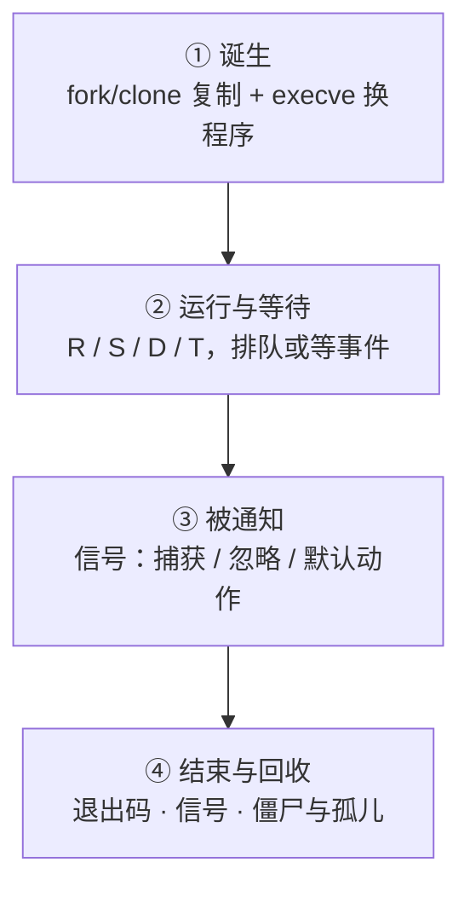

---
tags:
  - Linux
  - 进程
  - 信号
  - 资源限制
  - 学习地图
created: 2026-09-21
---

# 进程、信号与资源限制

## 知识地图

### 一个进程的一生

时间主线跟着**一个进程**走：从被创建，到在 CPU 上跑或等某个事件，到被信号通知，到结束并被收尾。

| #   | 阶段    | 内核在做什么                          | 到这里要能说清                              |
| --- | ----- | ------------------------------- | ------------------------------------ |
| 1   | 诞生    | 内核复制出一个新 task（共享物理页），再把地址空间换成目标程序 | 你要能说清 `fork` 继承了什么、`execve` 保留了什么，以及失败时的两类错误码 |
| 2   | 运行与等待 | 调度器决定谁上 CPU，进程于是在状态之间迁移           | 你要能说清状态字母是归类而不是原因，以及「在等事件」与「在排队」怎么区分 |
| 3   | 被通知   | 信号先挂起，等进程从内核态返回用户态时才处理           | 你要能说清为什么 `kill` 成功不等于信号生效，以及为什么不响应要查信号位图 |
| 4   | 结束与回收 | 退出状态交给父进程，若没人领取就留下僵尸              | 你要能说清三种死法各有哪套证据，以及 137 为什么不能断言 OOM |

### 三条跨阶段的核对对象

这三个量贯穿下面四个阶段，每一个判断都要用到，所以单独列出来。

| 核对对象 | 贯穿哪些阶段、每处读什么字段 | 最后核对到哪里 |
| --- | --- | --- |
| 占用口径 | 这条线依次贯穿地址空间、常驻、均摊与私有、组级计数字段，以及时间维度上的趋势 | 它的最后一步是确认「占了多少」用的是哪一种口径，读的是哪一个字段 |
| 限制层级 | 这条线从进程自身的 `RLIMIT_*` 依次贯穿登录会话、服务单元、cgroup，直到整机参数 | 它的最后一步是确认上限写在哪一层才会生效，以及撞上时看到的是哪条错误 |
| 归属关系 | 这条线从父子关系依次贯穿进程组与会话、控制终端、namespace 与 cgroup | 它的最后一步是确认一条 `kill` 能打到哪些进程，以及容器里为什么特殊 |

## 术语速查

| 名词 | 一句话解释 | 在哪一篇展开 |
| --- | --- | --- |
| task | 它是内核的调度单位，而用户态所说的「进程」与「线程」在内核里都是 task | 原理：进程与线程 |
| TGID / TID / 线程组 | TGID 是线程组 ID，也就是 `ps` 里的 PID；TID 是单个 task 的 ID；线程组是共享同一地址空间的那组 task | 原理：进程与线程 |
| 内核线程 / `kthreadd` | 内核线程是内核自己的 task，它们在 `ps` 里的名字带方括号；`kthreadd` 是这些内核线程的父进程 | 原理：进程与线程 |
| 孤儿 / 收养 / subreaper | 孤儿指父进程先退出的子进程；收养指它被重新挂靠到别的 task 名下；subreaper 就是被挂靠的那个目标 | 原理：进程与线程 · 体系 |
| `fork` / `clone` / `execve` | `fork` 复制出一个同等的 task；`clone` 按标志位决定这次共享哪些资源；`execve` 用新程序替换掉当前地址空间里的内容 | 原理：fork 与 exec |
| 写时复制（COW） | `fork` 之后父子共享同一批物理页，因此谁写谁复制 | 原理：fork 与 exec |
| `EAGAIN` / `ENOMEM` | `EAGAIN` 表示资源暂时不可用，通常是撞上了计数型上限；`ENOMEM` 表示内存或地址空间不足 | 原理：fork 与 exec · 资源的边界 |
| `FD_CLOEXEC` / `O_CLOEXEC` | 它让 fd 在装载新程序时自动关闭 | 原理：fork 与 exec |
| pidfd | 它是代表一个进程的文件描述符，用来替代用 PID 跨时间引用进程的做法 | 原理：fork 与 exec |
| 守护进程化 / `setsid` | 守护进程化是老式的「四步脱离终端」做法；`setsid` 新建一个会话，从而脱离控制终端 | 原理：fork 与 exec |
| 信号 / 待处理（pending） | 信号是内核投递的异步通知；待处理指信号已经到达但尚未被处理的状态 | 原理：信号与优雅退出 |
| 标准信号 / 实时信号 | 标准信号不排队，同一编号的信号会被合并丢弃；实时信号有排队语义，并且按编号顺序投递 | 原理：信号与优雅退出 |
| 信号处置 / 信号掩码 | 信号处置指捕获、忽略或执行默认动作，它是进程级的；信号掩码指此刻是否愿意被打断，它是线程级的 | 原理：信号与优雅退出 |
| `SIGTERM` / `SIGKILL` / `SIGSTOP` | `SIGTERM` 请求停止且可以被捕获；`SIGKILL` 是强制终止且不可捕获；`SIGSTOP` 是停止且不可捕获 | 原理：信号与优雅退出 |
| `SIGHUP` | 它的默认动作是终止进程，而守护进程通常把它约定为重载配置 | 原理：信号与优雅退出 |
| PID 1 的特殊保护 | 在同一个 PID namespace 内，未安装处理函数的信号（含 `SIGKILL`/`SIGSTOP`）一律被丢弃；但来自祖先 namespace 的 `SIGKILL`/`SIGSTOP` 会被强制投递并生效，容器停止的「最后一刀」靠的就是这一条 | 原理：信号与优雅退出 · 体系 |
| `TASK_KILLABLE` | 它表示可被致命信号打断的不可中断等待，外观上仍然显示为 `D` | 原理：信号与优雅退出 · 体系 |
| 优雅退出 | 进程收到终止信号后先收尾再退出：它依次停止接入新请求、处理在途请求、释放占用的资源 | 原理：信号与优雅退出 |
| 资源限制 / 软硬限制 | 资源限制是每个进程各持一份的边界；软限是当前生效值，硬限是它不可越过的上限 | 原理：资源的边界 |
| `RLIMIT_NPROC` | 它是按 real UID 计数的进程与线程数上限 | 原理：资源的边界 |
| PAM / `pam_limits` | PAM 是登录认证框架；`pam_limits` 在建立登录会话时应用限制配置 | 原理：资源的边界 · 治理 |
| cgroup v2 / 控制器委派 | cgroup v2 是单一层级树的资源边界机制；控制器委派指父节点把某个控制器下放给子树 | 原理：资源的边界 · 治理 |
| `pids.max` / `cpu.max` / `cpu.weight` | `pids.max` 是组内任务数上限；`cpu.max` 是组内 CPU 配额（硬顶）；`cpu.weight` 是组间的 CPU 权重 | 原理：资源的边界 · 治理 |
| `memory.max` / `memory.high` | `memory.max` 是组内存硬上限，撞上就会有进程被杀；`memory.high` 是软上限，撞上只会被节流 | 原理：资源的边界 · 治理 |
| `memory.events` / `pids.events` | 它们记录组内的事件次数，累计起点是该 cgroup 创建以来（组销毁、服务重建后归零），因此仍要看两次取值的差值；`memory.events` 默认按层级累计（含后代），只看本级要用 `memory.events.local`；`oom_kill` 非 0 只说明本组进程被任何 OOM killer 杀过，不等于本组撞了 `memory.max`；`pids.events` 只有 `max` | 体系 · 治理 |
| `R`/`S`/`D`/`T`/`t`/`Z`/`I` | 它们是 `ps` 的状态字母，其中 `D` 表示内核态不可中断等待 | 体系 · 实操 |
| `wchan` / `stack` | `wchan` 表示进程正睡在哪个内核函数上；`stack` 是内核态调用栈，它不是 `ps` 的列，只能读 `/proc/<pid>/stack`，且需要 `CONFIG_STACKTRACE` | 体系 · 实操 |
| `PPID` / `PGID` / `SID` / `tty` | 它们依次是父进程、进程组、会话与控制终端；只有 `tty` 用 `?` 表示没有，而 PID 1 的 `PPID` 显示 0，`PGID`/`SID` 恒有值 | 体系 |
| 常驻 / 均摊 / 私有 | 常驻指当前在该进程常驻集里的页，它会把共享页重复计数；均摊指共享页按使用者数量均摊后计入；私有指只算该进程独占的页 | 体系 |
| `voluntary` / `nonvoluntary_ctxt_switches` | 前者是主动让出 CPU 的累计次数（等事件），后者是被抢占的累计次数（等 CPU） | 体系 · 实操 |
| `nice` / `chrt` / `taskset` / `ionice` | 它们依次是组内 CPU 权重、调度策略与实时优先级、CPU 亲和、IO 优先级 | 体系 |
| `128+N` | 它是 shell 里表示「被信号 N 杀死」的退出码写法，例如 143 表示 `SIGTERM`、137 表示 `SIGKILL` | 体系 · 判例 |
| 僵尸 / 孤儿 / `subreaper` | 僵尸指已退出但仍在等父进程回收的进程；孤儿指父进程先退出、由收养者接管的进程；`subreaper` 指那个收养者 | 体系 · 判例 |
| namespace | 它隔离「看得见什么」（`pid`/`net`/`mnt`/`user` 等） | 原理：命名空间与隔离 · 体系 |
| 容器 | 它由命名空间（可见范围）、cgroup（可用量）、根文件系统与联合挂载（文件来源）与权限约束组合而成，而内核里没有「容器」这个对象 | 原理：命名空间与隔离 · 体系 |
| user 命名空间 / `uid_map` / `overflowuid` | user 命名空间是唯一不需要特权即可创建的切分；`uid_map` 是 ID 映射文件，每个命名空间只能写一次；`overflowuid` 是未映射 ID 的显示值，默认为 65534 | 原理：命名空间与隔离 |
| 挂载传播（`shared`/`slave`/`private`） | 它决定挂载事件是否会在命名空间之间传递，标记可以在 `/proc/<pid>/mountinfo` 里读到 | 原理：命名空间与隔离 |
| `KillMode=` / `TimeoutStopSec=` | `KillMode=` 决定停止服务时发送信号的范围（默认为整组）；`TimeoutStopSec=` 决定等待的上限 | 原理：信号与优雅退出 · 治理 |
| `LimitNOFILE=` / `TasksMax=` | 它们是服务单元里的限制项，也就是服务层的正确位置 | 治理 |
| core / `core_pattern` / 集中收集工具 | core 是崩溃瞬间的内存镜像；`core_pattern` 是决定它落点的内核参数；集中收集工具是读取它的入口 | 实操 |

## 故障现场定位表

排障的第一问不是「怎么修」，而是「**它现在在等谁 / 它是怎么没的**」。用这张表把现象定位到类别，再进对应篇目。

| 你看到的现象 | 它属于哪一类 | 现场在哪 | 第一反应不要做 |
| --- | --- | --- | --- |
| `kill -9` 也杀不掉，状态是 `D` | 它卡在内核态的等待里 | 现场要读等待点是哪个内核函数（`wchan`）、内核调用栈（`/proc/<pid>/stack`），以及当时内核日志里的 IO 或网络存储报错 | 不要反复补刀，也不要直接重启 |
| `ps` 里一堆 `<defunct>` | 父进程没有回收退出状态 | 现场要查僵尸的父进程是哪个 task，以及父进程自身处于什么状态 | 不要对僵尸发信号 |
| 服务「悄悄消失」，日志里没有明显报错 | 它属于三种死法之一 | 现场要读服务管理器记录的退出状态与信号、内核日志，以及机器上有没有产生 core | 不要先重启再看 |
| 退出码 137 | 它是死于 `SIGKILL` | 现场要把内核日志里的 OOM 记录与人工操作、编排层和健康检查的记录对照起来读 | 不要断言「一定是 OOM」 |
| `fork` 报资源暂时不可用 | 它撞上了某条计数型上限 | 现场要读整机两条上限、按用户计数的用量、组内的 `pids.current` 与 `pids.max`，以及内核日志 | 不要只调 `ulimit -u` |
| `too many open files` | 句柄达到了上限，或者存在泄漏 | 现场要读整机句柄用量、进程的 fd 构成与趋势，以及进程实际生效的限制 | 不要直接调到一百万 |
| 改了登录会话限制，服务却没变化 | 限制被改在了不起作用的那一层 | 现场要把进程实际生效的限制与单元里的限制属性对照起来读 | 不要以为是「没重启所以没生效」 |
| 服务 CPU 打满，但整机 CPU 不高 | 这是单线程热点，或者绑核设置有误 | 现场要读每核的占用、线程级视图，以及进程被允许使用的 CPU 集合 | 不要因为整机 CPU 低就排除 CPU 问题 |
| 崩溃了，但机器上找不到 core | 崩溃转储这条链路上断了一环 | 现场要读 core 的大小限制、`core_pattern` 的落点规则、特权程序的转储策略，以及落点目录是否可写 | 不要靠反复重启等它「再崩一次」 |
| 容器 `stop` 等满超时、退出码 137 | 容器里的 PID 1 没有处理终止信号 | 现场要读容器内 1 号进程是谁、它的信号位图（`SigIgn`/`SigBlk`/`SigCgt`），以及容器内的僵尸 | 不要只把停止超时改长 |
| 容器里 `free` 显示内存充足，容器仍被终止 | 看到的用量与生效的上限不在同一个机制上 | 现场要读 cgroup 的计数字段（`memory.current`、`memory.max`、`memory.events`），因为命名空间只改看得见什么 | 不要用容器内的 `free` 判断这个容器还剩多少 |

两个容易被忽略的边界：

- **「卡住」和「没了」是两类问题，取证顺序相反。** 进程还在（`D`、`Z`、`T`）时现场是**活的**：等待点、内核栈、fd、内存都能现取；进程已经没了时，只剩日志与 core。所以第一件事永远是先确认「它还在不在」。
- **状态字母只能告诉你「大致在哪」，不能告诉你「为什么」。** `D` 既可能是本地磁盘，也可能是网络存储、内核锁或驱动；137 既可能是 OOM，也可能是人工强杀或运行时超时。判断依据永远是**证据**，不是字母。

## 篇目

| # | 篇目 | 一句话 |
| --- | --- | --- |
| 01 | [[Linux/03_进程与信号/01_原理_进程与线程\|原理：进程与线程]] | 内核只有 task，而共享哪些资源决定了故障波及多大 |
| 02 | [[Linux/03_进程与信号/02_原理_进程的诞生_fork与exec\|原理：进程的诞生——fork 与 exec]] | 它讲清创建为什么必须分成两步，以及继承与保留分别决定了什么 |
| 03 | [[Linux/03_进程与信号/03_原理_信号与优雅退出\|原理：信号与优雅退出]] | 它讲清信号投递为什么可以延迟，以及优雅退出为什么是一组可验收的性质 |
| 04 | [[Linux/03_进程与信号/04_原理_资源的边界\|原理：资源的边界]] | 它讲清计数、速率、容量三类限制性质，以及限制为什么要分成五层 |
| 05 | [[Linux/03_进程与信号/05_原理_命名空间与隔离\|原理：命名空间与隔离]] | 它讲清八种切分各自隔离了什么，以及为什么隔离不等于资源上限 |
| 06 | [[Linux/03_进程与信号/06_体系_一个进程的一生\|体系：一个进程的一生]] | 它把四个阶段串成一条链，再收拢占用口径、限制层级、归属关系三条跨阶段的核对对象 |
| 07 | [[Linux/03_进程与信号/07_实操_观测与基线\|实操：观测与基线]] | 它讲清用哪把工具、怎么读字段、留什么基线，以及按什么顺序排查 |
| 08 | [[Linux/03_进程与信号/08_判例_高频误判\|判例：高频误判]] | 每条都按现象、常见误判、判据与出处展开 |
| 09 | [[Linux/03_进程与信号/09_治理_资源限制与容器治理\|治理：资源限制与容器治理]] | 它讲清上限该写在哪一层，并给出治理场景与产物模板 |
| 10 | [[Linux/03_进程与信号/10_验收_盲区排查\|验收：盲区排查]] | 它逐层剖析八类现象，给出缺口类型与补法，以及交付物与核对方式 |

## 参考文档

- `man 7 signal`、`man 2 kill`、`man 2 sigaction`、`man 2 sigprocmask`、`man 2 clone`、`man 2 fork`、`man 2 execve`、`man 2 wait`、`man 7 pid_namespaces`。
- `man 5 proc`（proc 文件系统总览；字段口径自 man-pages 6.7 起拆到子页：`man 5 proc_pid_status`、`man 5 proc_pid_stat`、`man 5 proc_pid_limits`、`man 5 proc_pid_wchan`、`man 5 proc_pid_stack`、`man 5 proc_pid_smaps`、`man 5 proc_pid_oom_score`、`man 5 proc_pid_io`、`man 5 proc_pid_task`、`man 5 proc_sys_fs`、`man 5 proc_sys_kernel`、`man 5 proc_loadavg`）、`man 1 ps`、`man 1 top`、`man 1 pidstat`、`man 1 pstree`、`man 1 prlimit`。
- `man 2 getrlimit`、`man 2 setrlimit`、`man 5 limits.conf`、`man 8 pam_limits`、`man 5 systemd.exec`、`man 5 systemd.resource-control`、`man 5 systemd.service`（`TimeoutStopSec=` 的定义页）、`man 5 systemd.kill`。
- 内核文档 `Documentation/admin-guide/cgroup-v2.rst`（单一层级树、控制器委派、pids 与 memory 控制器）、`Documentation/admin-guide/sysctl/kernel.rst`。
- `man 7 namespaces`、`man 8 lsns`、`man 1 nsenter`、`man 1 systemd-cgls`、`man 1 systemd-cgtop`。
- `man 5 core`、`man 1 coredumpctl`、`man 5 coredump.conf`：崩溃现场的四道开关与读取入口。
