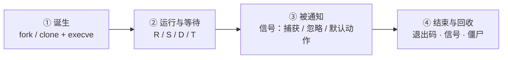

---
tags:
  - Linux
  - 进程
  - 信号
  - 资源隔离
  - 学习地图
created: 2026-09-18
---

# 进程、信号与资源隔离

> [!cite] 参考资料
> `man 5 proc`、`man 7 signal`、`man 2 fork`、`man 2 execve`、`man 1 ps`、`man 1 kill`、`man 5 limits.conf`、`man 5 systemd.exec`、`man 5 systemd.resource-control`、`man 5 systemd.kill`、`man 7 cgroups`、`man 7 namespaces`、`man 1 systemd-cgls`、`man 1 systemd-cgtop`、`man 1 coredumpctl`，以及内核文档 `Documentation/admin-guide/cgroup-v2.rst`；发行版侧参考 systemd 与 procps-ng 的官方文档。
>
> 本笔记与全部子笔记的结论来自上述资料，**命令输出尚未在实验机上逐条实测**；本机结果与文中不一致时以本机为准，并回填到对应小节。

> 本笔记对应《Linux 运维学习大纲》的「阶段 3：进程、信号与资源隔离」。
>
> **本页是子目录 `03_进程与信号/` 的 00 号导读，不是全部正文。** 知识脉络、生产技能地图、术语速查、故障现场定位表都在这一页；逐项深入的正文按知识点拆成子笔记，索引见第 7 节。
>
> **读者定位：刚入职的运维/SRE。** 假设你会基本 shell、用过 `ps`/`top`/`systemctl`，但没系统学过「内核怎么表示一个进程」「信号到底做了什么」。这一章要补的前置知识在第 1.3 节，并单独成篇（子笔记 01–03）。
>
> 说明：命令、默认值与行为以 man 页和发行版官方文档为准；凡涉及默认值、内核差异与发行版差异的地方都标注适用环境（本文以 **RHEL 8/9 系** 与 **Debian/Ubuntu LTS 系** 两个目标环境为主线；cgroup 以 **v2** 为准，v1 差异单独标注）。文中「预期输出」目前仍是文档值而非实测值，资料出处与实测状态见本页开头的「参考资料」。

> [!info] 读之前：先自检三条前提
> 1. **一台可快照的实验机**（虚拟机即可）**并且你有 root**。这一章的破坏性演练（挂起块设备、撞 cgroup 上限、制造崩溃）只在它上面做；没有的话，子笔记 05、10、11 里的动手部分只看不动。
> 2. **会直接读 `/proc`**：知道 `/proc/<pid>/status`、`/proc/<pid>/limits` 这类文件是内核暴露出来的实时状态，不是磁盘上的普通文件。不熟就先读子笔记 02。
> 3. **有基本的进程观测与 systemd 操作经验**：`ps`、`top`、`systemctl status/restart` 会用。完全不熟，先读阶段 1《实验环境与操作纪律》。第 2 条不满足 → 先读子笔记 01–03。
>
> 另外两个环境前提：演练「造一个 `D` 状态」需要 `device-mapper`（`dmsetup`，实验步骤见子笔记 05 第 5 节）；演练 cgroup 相关实验需要 **cgroup v2**（先跑 `stat -fc %T /sys/fs/cgroup`，输出 `cgroup2fs` 才算满足）。环境不满足时正文照样能读，只是实验做不全。

## 0. 30 秒速览

> [!abstract] 这一章只要记住六句话
> - **内核眼里只有 task，没有「进程」这个实体**：调度的基本单位是 task；用户态说的「进程」是**一组共享地址空间的 task** 加一个线程组 ID（TGID，就是 `ps` 里的 PID）。所以 `ps` 数出来的「进程数」与 `ps -eLf` 数出来的「task 数」不是一回事。
> - **有两类东西 `kill -9` 杀不掉，原因完全不同**：卡在内核态不可中断等待的 `D` 状态进程（信号被挂起，等它回到用户态才处理），和僵尸进程（它已经终止了，等的是**父进程**回收）。判据是 `wchan`/`stack` 与父进程状态，不是状态字母本身。
> - **`SIGTERM` 是请求，`SIGKILL` 是命令**：前者可捕获、可优雅退出，是 `systemctl stop` 的第一发；后者不可捕获、不可阻塞、不可忽略，代价是文件锁没释放、临时文件残留、数据可能不一致——数据库与消息队列上尤其致命。**`kill -9` 是最后手段，不是常规手段。**
> - **「进程悄悄消失」有三种死法，证据位置完全不同**：正常退出看退出码，被信号杀死看 `systemctl show -p ExecMainCode,ExecMainStatus`（shell 里是 `128+N`，如 143=TERM、137=KILL），被 OOM Killer 选中**只能**在内核日志里对上号——**退出码 137 本身不能证明是 OOM**。崩溃（`SIGSEGV`/`SIGABRT`）还多一份证据：core，前提是子笔记 10 里的「四道闸门」都开着。
> - **资源上限有五层，改错地方等于没改**：`ulimit`（当前会话）→ `limits.conf`（PAM 登录会话）→ unit 的 `LimitXXX=`/`TasksMax=`（服务）→ cgroup（整组）→ 内核全局（`fs.file-max`、`kernel.pid_max`）。**改 `/etc/security/limits.conf` 对 systemd 服务无效**，这是最高频的踩坑点。
> - **namespace 管「看得见什么」，cgroup 管「能用多少」**：容器 = namespace + cgroup + 根文件系统 + 权限约束（capabilities/seccomp/SELinux），少任何一层都不成其为「容器」；容器与虚拟机最本质的差别是**共享同一个内核**。

> [!tip] 这一页怎么用：三条入口
> - **系统学（推荐，按阶段 3 的 3~5 天）**：从第 3 节的「四级训练台阶」开始，T0 → T4 逐级往上；每一级都用第 2 节的技能表核对交付物。
> - **出事急救**：直接看第 6 节「故障现场定位表」，定位到类别后进对应子笔记，或直接翻子笔记 12《进程故障处置手册》。
> - **面试速览**：第 0 节 + 第 1 节 + 第 5 节术语表 + 各子笔记末尾的自测卡。

## 1. 知识地图（第一条主线）

### 1.1 一个进程的一生：四站

阶段 2 的启动流程是一条「接力」时间线；进程这一章也有自己的时间线：**从被创建到被回收，一个进程只经过四站**，每一站的产出决定了下一站的形态。

| # | 站点 | 谁在动 | 这一站的产出 |
| --- | --- | --- | --- |
| 1 | 诞生 | 父进程调用 `fork`/`clone`，再（通常）`execve` 换成新程序 | 内核里多了一个 task，进入调度队列 |
| 2 | 运行与等待 | 调度器决定谁上 CPU；进程在 `R`/`S`/`D`/`T` 之间迁移 | 要么在推进，要么卡在等某个事件（磁盘、网络、锁、终端输入） |
| 3 | 被通知 | 内核把信号投递给进程；进程选择捕获、忽略或用默认动作 | 进程据此重载配置、优雅退出，或被直接终止 |
| 4 | 结束与回收 | 进程退出（三种死法之一）；父进程 `wait()` 回收它 | 退出码或信号交给父进程；没人回收就变成僵尸 |

**这一章真正要练出来的，是同一个三问：**

1. **它现在在等谁？** —— 决定了它是「慢」还是「卡死」。所有 D 状态排查都从这里开始（子笔记 05）。
2. **谁有权改变它的状态？** —— 信号（谁发给它、它处不处理）、调度（谁能占 CPU）、cgroup（它能用多少）。这三件事分别对应三条横切线。
3. **出问题时现场在哪？** —— 退出码、`journalctl`、内核日志、core、`wchan`；还要能说出**哪些证据重启即失**（子笔记 07、10）。

把这三问记住，后面每一篇你都能自己往里填内容，而不是背四张表。

### 1.2 三条横切线

四站是时间线，但有几件事会横穿多个站点。新人最容易「每一站都看过、却串不起来」，就是因为没抓住这三条线：

| 横切线 | 贯穿内容 | 收口于 | 主要子笔记 |
| --- | --- | --- | --- |
| **信号线** | 终端的 `SIGHUP` → 服务的 `SIGTERM` → 重载用 `SIGHUP`/`reload` → 容器的 `stop` → 最后 `SIGKILL` 的代价 | 为什么 `kill -9` 只能是最后手段 | 03、06、07、12 |
| **限制线** | `ulimit` → `limits.conf` → unit 的 `LimitXXX=`/`TasksMax=` → cgroup → 内核全局 | 为什么「改了不生效」；撞上上限时是什么样 | 08、09、12 |
| **隔离线** | namespace（看得见什么）+ cgroup（能用多少）→ 容器的四层 | 容器里的 PID 1 为什么特殊、`docker stop` 为什么要等满 10 秒 | 11、07、12 |

还有一条不是机制、而是动作：**取证**。它不贯穿某一层，而是每一站都要练的习惯——三种死法各有各的证据位置，崩溃还有 core。统一纪律只有一句：**先取证据，再动手；能取到证据时，重启永远是最后选项**（S3）。

### 1.3 前置地基

以下三块是读懂四站的最低门槛。**它们不是「扩展阅读」，是必修**——缺哪块补哪块，再回来看主线。

| 前置篇 | 你要先建立的概念 | 对应子笔记 |
| --- | --- | --- |
| 进程与线程 | 内核眼里只有 task；PID/TGID/TID 的关系；进程树与父子关系 | [[Linux/03_进程与信号/01_前置_进程与线程\|01 前置：进程与线程]] |
| 进程观测与 `/proc` | `ps`/`top`/`pidstat` 的分工；`/proc/<pid>` 里哪个文件回答哪个问题 | [[Linux/03_进程与信号/02_前置_进程观测与proc\|02 前置：进程观测与 /proc]] |
| 终端、会话与进程组 | 进程的「归属」：tty / PGID / SID；为什么 SSH 一断进程就跟着死 | [[Linux/03_进程与信号/03_前置_终端会话与进程组\|03 前置：终端、会话与进程组]] |

## 2. 生产技能地图（第二条主线）

知识和技能是两条线。**读完不等于会做**，所以这一章明确交付 8 项技能，每项都有可观察的行为和一个交付物。学每一篇的时候，对照这张表看自己在练哪一项。

| # | 技能 | 可观察的行为 | 在哪几篇练 | 交付物 |
| --- | --- | --- | --- | --- |
| S1 | 进程观测与建基线 | 拿到一台陌生机器，10 分钟内说清「关键服务在哪、谁最吃 CPU、限制是多少」 | 01、02、03、13 | 一份进程基线卡（关键服务的 PID / 线程数 / 句柄数 / 限制 / cgroup 位置） |
| S2 | 信号选择与优雅停机 | 给一个服务，说得出该发哪个信号、为什么，并完成一次可验证的停机或重载 | 03、06、13 | 一份停机/重载记录（含超时、验证、回滚） |
| S3 | 事后取证 | 进程消失或崩溃后，先取证据，并说得出哪些证据重启即失 | 07、10、12 | 一份进程死亡复盘记录 |
| S4 | 分层定位 | 给一个现象（卡死杀不掉 / 悄悄消失 / 起不来 / 变慢），10 分钟内判定属于哪一类 | 02、04、05、09、12 | 一份限时定位记录 |
| S5 | 限制治理 | 把上限写进正确的那一层，并用 `/proc/<pid>/limits` 或 cgroup 文件验收 | 08、10、13 | 一份带回滚命令的变更记录 |
| S6 | 耗尽处置 | 进程数或句柄被打满时先止血再定位，说得出四类上限各自的判据 | 04、09、12、13 | 一份演练记录（含恢复耗时） |
| S7 | 风险与止损判断 | 分得清「先取证还是先止损」；说得出 `kill -9`、改实时优先级、绕过 systemd 动 cgroup 的代价 | 06、07、08、11、12（贯穿全章） | 演练中的决策记录 |
| S8 | 沉淀 | 把一次处置写成 Runbook 片段：现象、证据、根因、回滚、巡检项 | 全部（每篇一次的收尾动作） | 至少一段 Runbook 片段 |

这 8 项里，S1、S3、S7 是**判断力**，S2、S5、S6 是**操作力**，S4 是把两者收敛到结论的能力，S8 是把它变成组织资产的能力。新人通常卡在 S3、S4、S7——这三项没有命令清单可背，只能靠带反馈的练习。

## 3. 四级训练台阶

技能靠难度递增、风险可控的重复练习获得。**每一级都写明了在哪台机器上做**，这条边界本身就是 S7 的训练内容。

| 台阶 | 做什么 | 在哪台机器 | 交付物 |
| --- | --- | --- | --- |
| **T0 读通** | 画出「一个进程的一生」四站；说清「卡死（杀不掉） / 悄悄消失 / 起不来 / 变慢」四类现象的现场在哪 | 纸面/白板 | 自己画的一张生命周期图 |
| **T1 观测** | 采集版本与限制基线；跑只读观测命令；找出这台机器上 CPU、线程、句柄的 Top 各是谁 | **生产机可以做（只读）** | 进程基线卡 |
| **T2 可回滚变更** | 改一个服务的 `LimitNOFILE=`/`LimitCORE=`、用 `systemd-run` 起一个带限制的临时单元、对服务做一次 `reload` 或优雅停机 | 实验机 | 变更记录（含回滚与耗时） |
| **T3 故障注入与恢复** | 造一个 `D` 状态、造一堆僵尸、撞 `TasksMax`、触发 cgroup OOM、制造一次 core | **可快照实验机** | 演练记录 |
| **T4 限时模拟** | 给一个现象，10 分钟定位到类别，并写出处置记录 | 实验机 + 计时 | 一份排障报告 |

> [!warning] 一条不能破的边界
> **只有 T1 允许在生产机上做，而且全程只读**（`ps`、`top`、`cat /proc/...`、`systemctl show`、`journalctl` 这类）。T2 到 T4 一律在实验机，动手前先打快照。
>
> 两个补充边界：**`kill -9` 不属于任何一级练习**——它只在真实处置中作为最后手段出现，而且要有记录（S8）；生产上唯一「看起来像 T2」的例外是应急止损（例如句柄耗尽时先扩上限保住业务），那属于事故处置，不属于练习，事后按 S8 补记录。

## 4. 学习路线

**系统学的三遍读法（对应 00_学习大纲 给的 3~5 天）：**

- **第一遍（约半天，建立直觉，只读）**：第 1 节 → 前置 01–03 的只读观测动作 → 04、05 的概念与观测部分 → 06 的「信号语义」部分 → T1 基线卡。
- **第二遍（约一天，把退出、限制与隔离接上）**：06 的生产动作（优雅停机/重载）→ 07（三种死法与僵尸）→ 08（限制五层）→ 09（耗尽处置）→ 11（namespace 与 cgroup）→ T2 变更。
- **第三遍（在快照实验机上）**：10（崩溃取证，可跳过）→ 12（处置手册）→ 13 的实验 → T3、T4。

**只想解决手头问题的快捷入口：**

| 你的问题 | 去哪 |
| --- | --- |
| 进程 `kill -9` 也杀不掉 | 第 6 节 → 子笔记 05、12 |
| 一堆僵尸进程 | 子笔记 07、12 |
| 服务悄悄消失，不知道死因 | 子笔记 07、10、12 |
| 服务起不来，报 `fork` 或资源相关的错 | 子笔记 09、12 |
| `too many open files` | 子笔记 08、09、12 |
| 改了 `limits.conf` 却不生效 | 子笔记 08 |
| 崩了但没有 core / core 快把磁盘写满 | 子笔记 10 |
| 服务 CPU 打满，但整机看着不高 | 子笔记 05，深水区在阶段 10（性能分析与排障） |
| 容器 `stop` 要等 10 秒、退出码 137 | 子笔记 07、11 |
| 想搞清容器的「隔离」是怎么做的 | 子笔记 11，编排层在 Kubernetes 笔记 |

## 5. 术语速查

> [!info]- 名词速查（读到哪里卡住，就回这里查）
> | 名词 | 一句话解释 | 在哪一节展开 |
> | --- | --- | --- |
> | task | 内核的调度单位；用户态的「进程/线程」在内核里都是 task | 01、04 |
> | TGID / TID / `LWP` | 线程组 ID（即 `ps` 里的 PID）/ 线程 ID / `ps -eLf` 显示 TID 的那一列 | 01 |
> | `fork` / `execve` / `clone` | 复制出独立地址空间 / 用新程序替换当前地址空间 / 按 flag 决定共享什么 | 04 |
> | COW | 写时复制：`fork` 之后父子共享物理页，谁写谁复制 | 04 |
> | `R`/`S`/`D`/`T`/`t`/`Z`/`I` | `ps` 的进程状态字母，`D` 是内核态不可中断等待 | 05 |
> | `wchan` / `stack` | 进程正睡在哪个内核函数上 / 内核态调用栈 | 05、12 |
> | `TASK_KILLABLE` | 不可中断等待的变种，能被致命信号打断，但仍显示为 `D` | 05 |
> | 信号 | 内核投递给进程的异步通知；进程只能选择捕获、忽略或用默认动作 | 06 |
> | `SIGHUP` / `SIGTERM` / `SIGKILL` | 终端断开与重载约定 / 优雅退出的标准信号 / 不可捕获的强杀 | 06 |
> | `128+N` | shell 里「被信号 N 杀死」的退出码表示法（143=TERM、137=KILL） | 07 |
> | 僵尸 / 孤儿 | 已退出等父进程回收 / 父进程先退出被 PID 1 收养 | 07 |
> | OOM Killer | 内存不足时由内核挑选进程并 `SIGKILL` 的机制（深水区在阶段 4） | 07、09 |
> | `core_pattern` | 决定 core 写到哪里、或通过管道交给谁的内核参数 | 10 |
> | `coredumpctl` | systemd 系统上查看与调试 core 的工具 | 10 |
> | `core`（核心转储） | 进程崩溃瞬间的内存镜像，包含寄存器、栈与内存映射 | 10 |
> | 优雅退出 | 收到 `SIGTERM` 后收尾再退出：停止接入、处理在途、释放锁与连接 | 06 |
> | `KillMode=` / `TimeoutStopSec=` | systemd 停止服务时的范围（默认整组）与等待上限 | 06、12 |
> | nice / `ionice` / `chrt` / `taskset` | CPU 权重 / IO 优先级 / 调度策略与实时优先级 / CPU 亲和性 | 05 |
> | `RLIMIT_*`、软限制、硬限制 | `setrlimit` 定义的限制项 / 当前生效值 / 软限制的上限 | 08 |
> | `prlimit` | 查看并在线调整运行中进程限制的工具 | 08 |
> | PAM | 登录认证框架；`limits.conf` 只影响经它建立的登录会话 | 08 |
> | `LimitNOFILE=` / `TasksMax=` | systemd unit 里的资源限制项（服务层的正确位置） | 08 |
> | `EAGAIN` / `ENOMEM` | 「资源暂时不可用」/「内存不足」，两类 `fork` 失败的报错 | 09 |
> | cgroup / cgroup v2 | 给**一组进程**设资源上限（CPU / 内存 / IO / 任务数）的机制，systemd 是它的管理者 | 08、11 |
> | `pids.max` / `memory.max` / `cpu.weight` | cgroup v2 的任务数上限 / 内存上限 / CPU 组间权重 | 11 |
> | PGID / SID / tty | 进程组 ID / 会话 ID / 控制终端（`?` 表示没有） | 03 |
> | subreaper | 孤儿进程被重新挂靠的目标，通常是 PID 1 | 07 |
> | namespace | 隔离「看得见什么」（`mnt`/`pid`/`net`/`user`…） | 11 |
> | capabilities / seccomp | 权限约束的两层机制，与 namespace、cgroup 一起构成容器 | 11 |

## 6. 故障现场定位表

排障的第一问不是「怎么修」，而是「**它现在在等谁 / 它是怎么没的**」。用这张表把现象定位到类别，再进对应子笔记。

| 你看到的现象 | 属于哪一类 | 现场在哪 | 第一反应不要做 | 去哪一篇 |
| --- | --- | --- | --- | --- |
| 进程 `kill -9` 也杀不掉，状态是 `D` | 卡在内核态等待 | `wchan`、`/proc/<pid>/stack`、`dmesg` 里的 `hung task` 与 IO 报错 | 不要反复 `kill`，也不要直接重启 | 05、12 |
| `ps` 里一堆 `<defunct>` | 父进程没回收 | 僵尸行与它的父进程状态 | 不要 `kill -9` 僵尸 | 07、12 |
| 服务「悄悄消失」，日志里没有明显报错 | 三种死法之一 | `systemctl show -p ExecMainCode,ExecMainStatus`、`journalctl -k` 的 OOM 记录、`coredumpctl list` | 不要先重启再看 | 07、10、12 |
| 退出码 137 | 被 `SIGKILL` 杀死 | 内核日志的 OOM 记录 **对照** 人工/脚本操作记录 | 不要断言「一定是 OOM」 | 07、12 |
| `fork: Resource temporarily unavailable` | 撞上某条上限 | `/proc/loadavg` 最后一列、`pids.current/pids.max`、`ulimit -u`、内核日志 | 不要只把 `ulimit -u` 调大了事 | 09、12 |
| `too many open files` | 句柄撞上限或泄漏 | `/proc/sys/fs/file-nr`、`ls /proc/<pid>/fd`、`/proc/<pid>/limits` | 不要把上限直接调到一百万 | 08、09、12 |
| 改了 `limits.conf`，服务却没变化 | 改错层 | `/proc/<pid>/limits` 对照 unit 的 `LimitNOFILE=` | 不要以为是「没重启所以没生效」 | 08、12 |
| 服务 CPU 打满，但整机 CPU 不高 | 单线程热点或绑核 | `top -H -p <pid>`、`mpstat -P ALL 1`、`pidstat -t` | 不要因为整机 CPU 低就排除 CPU 问题 | 05（深水区在阶段 10） |
| 崩溃了，但机器上找不到 core | 取证链路断了一环 | `ulimit -c`、`core_pattern`、`coredumpctl list`、`/var/lib/systemd/coredump/` | 不要靠反复重启等它「再崩一次」 | 10、12 |
| 容器 `stop` 等满 10 秒才停，退出码 137 | PID 1 没处理信号 | 容器内 `ps -p 1`、应用日志里的停机记录 | 不要只把停止超时改长 | 07、12 |

两个容易被忽略的边界：

- **「卡住」和「没了」是两类问题，取证顺序相反。** 进程还在（`D`、`Z`）时，现场是**活的**：`wchan`、`stack`、`fd`、内存都能现取；进程已经没了时，只剩日志与 core。所以第一件事永远是先确认「它还在不在」。
- **状态字母只能告诉你「大致在哪」，不能告诉你「为什么」。** `D` 既可能是磁盘，也可能是 NFS、内核锁或驱动；137 既可能是 OOM，也可能是你自己（或某个脚本）发的 `kill -9`。判断依据永远是**证据**（`wchan`、内核日志、操作记录），不是字母。

## 7. 子笔记索引

| # | 子笔记 | 一句话 | 主要技能 | 难度 |
| --- | --- | --- | --- | --- |
| 01 | [[Linux/03_进程与信号/01_前置_进程与线程\|前置：进程与线程]] | 内核眼里只有 task；PID/TGID/TID 与进程树 | S1 | 前置 |
| 02 | [[Linux/03_进程与信号/02_前置_进程观测与proc\|前置：进程观测与 /proc]] | `ps`/`top`/`pidstat` 的分工与 `/proc/<pid>` 读法 | S1、S4 | 前置 |
| 03 | [[Linux/03_进程与信号/03_前置_终端会话与进程组\|前置：终端、会话与进程组]] | 进程的归属：tty / PGID / SID 与作业控制 | S1、S2 | 前置 |
| 04 | [[Linux/03_进程与信号/04_第1站_进程的诞生\|第 1 站：进程的诞生]] | `fork`/`execve`/`clone` 的语义、成本与创建失败 | S4、S6 | 核心 |
| 05 | [[Linux/03_进程与信号/05_第2站_状态与调度\|第 2 站：状态与调度]] | `R/S/D/T/Z` 与「卡死」的现场；nice 与调度策略 | S4、S7 | 核心 + 进阶 |
| 06 | [[Linux/03_进程与信号/06_第3站_信号与优雅退出\|第 3 站：信号与优雅退出]] | 信号语义、`kill` 家族、优雅停机与重载 | S2、S7 | 核心 |
| 07 | [[Linux/03_进程与信号/07_第4站_退出与回收\|第 4 站：退出与回收]] | 三种死法、退出码、僵尸与孤儿、容器 PID 1 | S3、S4 | 核心 |
| 08 | [[Linux/03_进程与信号/08_资源限制的五层结构\|资源限制的五层结构]] | 上限写在哪一层才生效；`limits.conf` 为什么管不到服务 | S5、S7 | 核心 |
| 09 | [[Linux/03_进程与信号/09_资源耗尽_进程数与句柄\|资源耗尽：进程数与句柄]] | 撞上上限时的现象、判据与止血顺序 | S6、S4 | 核心 |
| 10 | [[Linux/03_进程与信号/10_崩溃取证_core与coredumpctl\|崩溃取证：core 与 coredumpctl]] | 用户态崩溃的现场怎么留下来、怎么读 | S3、S7 | 进阶 |
| 11 | [[Linux/03_进程与信号/11_隔离_namespace与cgroup\|隔离：namespace 与 cgroup]] | 看得见什么 vs 能用多少；容器的四层 | S4、S7 | 核心 |
| 12 | [[Linux/03_进程与信号/12_进程故障处置手册\|进程故障处置手册]] | 跨类别处置：现象 → 分层 → 证据 → 处置 | S3、S4、S6、S8 | 核心 |
| 13 | [[Linux/03_进程与信号/13_动手实验与要点自测\|动手实验与要点自测]] | 六个实验的索引与总自测 | 全部 | 汇总 |

## 自检清单

- [x] frontmatter 有 `tags` 和 `created`，全篇只有一个一级标题
- [x] 速览卡 6 条，每条都是结论 + 可复现的证据
- [x] 涉及默认值、内核行为或版本差异的地方都标注了适用版本与发行版（含 cgroup v1/v2 差异）
- [x] 章节内引用只用章节内 wikilink；提及其他阶段一律用纯文本（不跨章节引用）
- [x] 阶段 3 已按「主笔记（地图）+ 子笔记（正文）」拆分，索引完整
- [x] 知识主线（四站 + 三条横切线）与技能主线（S1–S8 + T0–T4）都在本页可见
- [x] 全部 13 篇子笔记写完，且本页每一条子笔记链接都能解析
- [ ] 第 6 节的每一种现象都在对应子笔记里演练过一次
- [ ] 每张 Mermaid 图都在 Obsidian 里预览过，能正常渲染
