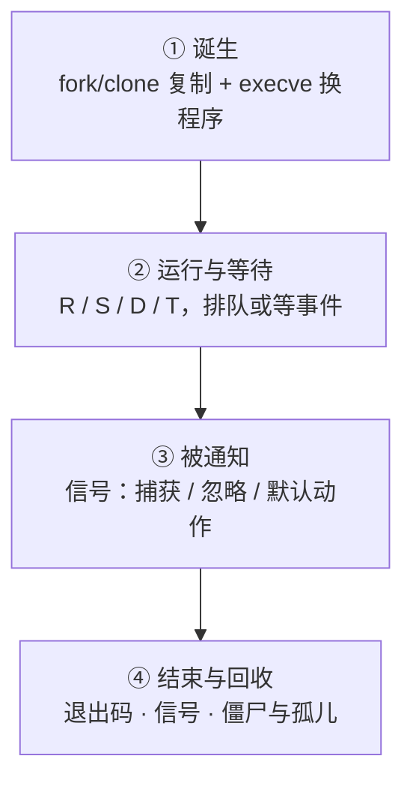

---
tags:
  - Linux
  - 进程
  - 信号
  - 资源限制
  - 学习地图
created: 2026-09-21
---

# 进程、信号与资源限制

## 知识地图

### 一个进程的一生

时间主线跟着**一个进程**走：从被创建，到在 CPU 上跑或等某个事件，到被信号通知，到结束并被收尾。

| #   | 站点    | 内核在做什么                          | 到这里要能说清                              |
| --- | ----- | ------------------------------- | ------------------------------------ |
| 1   | 诞生    | 复制出一个新 task（共享物理页），再把地址空间换成目标程序 | `fork` 继承了什么、`execve` 保留了什么；失败的两类错误码 |
| 2   | 运行与等待 | 调度器决定谁上 CPU；进程在状态之间迁移           | 状态字母是归类而非原因；「在等事件」与「在排队」怎么区分         |
| 3   | 被通知   | 信号先挂起，等进程从内核态返回用户态才处理           | 为什么 `kill` 成功不等于生效；为什么不响应要查信号位图      |
| 4   | 结束与回收 | 退出状态交给父进程；没人领就留下僵尸              | 三种死法三套证据；137 为什么不能断言 OOM             |

### 三条横切线

| 横切线 | 贯穿内容 | 收口于 |
| --- | --- | --- |
| 账目线 | 地址空间 → 常驻 → 均摊与私有 → 组级额度 → 时间维度的趋势 | 「它占了多少」必须先定口径 |
| 限制线 | 进程自身 → 登录会话 → 服务单元 → cgroup → 整机参数 | 上限写在哪一层才生效；撞上时是什么样 |
| 归属线 | 父子 → 进程组与会话 → 控制终端 → namespace 与 cgroup | 一条 `kill` 能打到谁；容器里为什么特殊 |

## 术语速查

| 名词 | 一句话解释 | 在哪一篇展开 |
| --- | --- | --- |
| task | 内核的调度单位；用户态的「进程/线程」在内核里都是 task | 原理：进程与线程 |
| TGID / TID / 线程组 | 线程组 ID（即 `ps` 里的 PID）/ 单个 task 的 ID / 共享地址空间的 task 集合 | 原理：进程与线程 |
| 内核线程 / `kthreadd` | 内核自己的 task（名字带方括号）/ 它们的父进程 | 原理：进程与线程 |
| 孤儿 / 收养 / subreaper | 父进程先退出的子进程 / 被重新挂靠 / 挂靠的目标 | 原理：进程与线程 · 体系 |
| `fork` / `clone` / `execve` | 复制出同等的 task / 按标志位决定共享什么 / 用新程序替换地址空间 | 原理：fork 与 exec |
| 写时复制（COW） | `fork` 后父子共享物理页，谁写谁复制 | 原理：fork 与 exec |
| `EAGAIN` / `ENOMEM` | 资源暂时不可用（撞计数型上限）/ 内存或地址空间不足 | 原理：fork 与 exec · 资源的边界 |
| `FD_CLOEXEC` / `O_CLOEXEC` | 让 fd 在装载新程序时自动关闭的标记 | 原理：fork 与 exec |
| pidfd | 代表一个进程的文件描述符，替代用 PID 跨时间引用进程 | 原理：fork 与 exec |
| 守护进程化 / `setsid` | 老式的「四步脱离终端」/ 新建会话脱离控制终端 | 原理：fork 与 exec |
| 信号 / 待处理（pending） | 内核投递的异步通知 / 已到达但尚未处理的状态 | 原理：信号与优雅退出 |
| 标准信号 / 实时信号 | 不排队、同号会丢 / 有排队语义、按编号投递 | 原理：信号与优雅退出 |
| 信号处置 / 信号掩码 | 捕获、忽略或默认动作（进程级）/ 当前是否愿意被打断（线程级） | 原理：信号与优雅退出 |
| `SIGTERM` / `SIGKILL` / `SIGSTOP` | 请求停止（可捕获）/ 强杀（不可捕获）/ 停止（不可捕获） | 原理：信号与优雅退出 |
| `SIGHUP` | 默认动作是终止；被守护进程约定为「重载」 | 原理：信号与优雅退出 |
| PID 1 的特殊保护 | 同 namespace 内、未装 handler 的信号（含 `SIGKILL`/`SIGSTOP`）一律被丢弃；来自祖先 namespace 的 `SIGKILL`/`SIGSTOP` 则强制投递并生效，容器停止的「最后一刀」靠的就是这一条 | 原理：信号与优雅退出 · 体系 |
| `TASK_KILLABLE` | 可被致命信号打断的不可中断等待，外观仍是 `D` | 原理：信号与优雅退出 · 体系 |
| 优雅退出 | 收到终止信号后收尾再退出：停止接入、处理在途、释放资源 | 原理：信号与优雅退出 |
| 资源限制 / 软硬限制 | 每个进程各持一份的边界 / 当前生效值与它不可越过的硬顶 | 原理：资源的边界 |
| `RLIMIT_NPROC` | 按 real UID 计数的进程/线程数上限 | 原理：资源的边界 |
| PAM / `pam_limits` | 登录认证框架 / 在建立登录会话时应用限制配置 | 原理：资源的边界 · 治理 |
| cgroup v2 / 控制器委派 | 单一层级树的资源边界机制 / 父节点把控制器下放给子树 | 原理：资源的边界 · 治理 |
| `pids.max` / `cpu.max` / `cpu.weight` | 组内任务数上限 / CPU 配额（硬顶）/ 组间权重 | 原理：资源的边界 · 治理 |
| `memory.max` / `memory.high` | 组内存硬上限（撞上被杀）/ 软上限（只节流） | 原理：资源的边界 · 治理 |
| `memory.events` / `pids.events` | 组事件计数；累计起点是该 cgroup 创建以来（组销毁、服务重建后归零），仍看两次差值；`memory.events` 默认层级累计（含后代），只看本级用 `memory.events.local`；`oom_kill` 非 0 只说明本组进程被任何 OOM killer 杀过，不等于本组撞了 `memory.max`；`pids.events` 只有 `max` | 体系 · 治理 |
| `R`/`S`/`D`/`T`/`t`/`Z`/`I` | `ps` 的状态字母；`D` 是内核态不可中断等待 | 体系 · 实操 |
| `wchan` / `stack` | 正睡在哪个内核函数上 / 内核态调用栈（`stack` 不是 `ps` 列，只能读 `/proc/<pid>/stack`，需 `CONFIG_STACKTRACE`） | 体系 · 实操 |
| `PPID` / `PGID` / `SID` / `tty` | 父进程 / 进程组 / 会话 / 控制终端（只有 `tty` 用 `?` 表示没有；PID 1 的 `PPID` 显示 0，`PGID`/`SID` 恒有值） | 体系 |
| 常驻 / 均摊 / 私有 | 碰到过的页（会重复计数）/ 共享页均摊后 / 只算自己独占的 | 体系 |
| `voluntary` / `nonvoluntary_ctxt_switches` | 主动让出（等事件）/ 被抢占（等 CPU）的累计次数 | 体系 · 实操 |
| `nice` / `chrt` / `taskset` / `ionice` | 组内 CPU 权重 / 调度策略与实时优先级 / CPU 亲和 / IO 优先级 | 体系 |
| `128+N` | shell 里「被信号 N 杀死」的退出码表示法（143=TERM、137=KILL） | 体系 · 判例 |
| 僵尸 / 孤儿 / `subreaper` | 已退出等父进程回收 / 父进程先退出被收养 / 收养者 | 体系 · 判例 |
| namespace | 隔离「看得见什么」（`pid`/`net`/`mnt`/`user`…） | 原理：命名空间与隔离 · 体系 |
| 容器 | 命名空间（可见范围）＋ cgroup（可用量）＋ 根文件系统与联合挂载（文件来源）＋ 权限约束的组合；内核里没有「容器」这个对象 | 原理：命名空间与隔离 · 体系 |
| user 命名空间 / `uid_map` / `overflowuid` | 唯一不需要特权即可创建的切分 / ID 映射文件（每个命名空间只能写一次） / 未映射 ID 的显示值（默认 65534） | 原理：命名空间与隔离 |
| 挂载传播（`shared`/`slave`/`private`） | 挂载事件是否会在命名空间之间传递，标记见 `/proc/<pid>/mountinfo` | 原理：命名空间与隔离 |
| `KillMode=` / `TimeoutStopSec=` | 停止服务时的范围（默认整组）与等待上限 | 原理：信号与优雅退出 · 治理 |
| `LimitNOFILE=` / `TasksMax=` | 服务单元里的限制项（服务层的正确位置） | 治理 |
| core / `core_pattern` / 集中收集工具 | 崩溃瞬间的内存镜像 / 决定落点的内核参数 / 读取它的入口 | 实操 |

## 故障现场定位表

排障的第一问不是「怎么修」，而是「**它现在在等谁 / 它是怎么没的**」。用这张表把现象定位到类别，再进对应篇目。

| 你看到的现象 | 属于哪一类 | 现场在哪 | 第一反应不要做 |
| --- | --- | --- | --- |
| `kill -9` 也杀不掉，状态是 `D` | 卡在内核态等待 | 等待点、内核栈、当时的 IO 或网络存储报错 | 不要反复补刀，也不要直接重启 |
| `ps` 里一堆 `<defunct>` | 父进程没回收 | 僵尸的父进程是谁、父进程自身状态 | 不要对僵尸发信号 |
| 服务「悄悄消失」，日志里没有明显报错 | 三种死法之一 | 服务管理器记录的退出状态与信号、内核日志、core | 不要先重启再看 |
| 退出码 137 | 死于 `SIGKILL` | 内核日志的 OOM 记录 **对照** 人工与编排层操作记录 | 不要断言「一定是 OOM」 |
| `fork` 报资源暂时不可用 | 撞上某条计数型上限 | 整机两条上限、按用户计数、组内用量与上限、内核日志 | 不要只调 `ulimit -u` |
| `too many open files` | 句柄撞上限或泄漏 | 整机句柄水位、进程 fd 构成与趋势、进程实际限制 | 不要直接调到一百万 |
| 改了登录会话限制，服务却没变化 | 改错层 | 进程实际限制 **对照** 单元里的限制属性 | 不要以为是「没重启所以没生效」 |
| 服务 CPU 打满，但整机 CPU 不高 | 单线程热点或绑核 | 每核占用、线程级视图、进程被允许的 CPU | 不要因为整机 CPU 低就排除 CPU 问题 |
| 崩溃了，但机器上找不到 core | 取证链路断了一环 | core 上限、落点规则、特权程序策略、落点是否可写 | 不要靠反复重启等它「再崩一次」 |
| 容器 `stop` 等满超时、退出码 137 | 容器 PID 1 没处理终止信号 | 容器内 1 号进程是谁、它的信号位图、容器内僵尸 | 不要只把停止超时改长 |
| 容器里 `free` 显示内存充足，容器仍被终止 | 视图与上限不在同一个机制上 | cgroup 的账本；命名空间只改看得见什么 | 不要用容器内的 `free` 判断这个容器还剩多少 |

两个容易被忽略的边界：

- **「卡住」和「没了」是两类问题，取证顺序相反。** 进程还在（`D`、`Z`、`T`）时现场是**活的**：等待点、内核栈、fd、内存都能现取；进程已经没了时，只剩日志与 core。所以第一件事永远是先确认「它还在不在」。
- **状态字母只能告诉你「大致在哪」，不能告诉你「为什么」。** `D` 既可能是本地磁盘，也可能是网络存储、内核锁或驱动；137 既可能是 OOM，也可能是人工强杀或运行时超时。判断依据永远是**证据**，不是字母。

## 篇目

| # | 篇目 | 一句话 |
| --- | --- | --- |
| 01 | [[Linux/03_进程与信号/01_原理_进程与线程\|原理：进程与线程]] | 内核只有 task；共享什么决定了故障波及多大 |
| 02 | [[Linux/03_进程与信号/02_原理_进程的诞生_fork与exec\|原理：进程的诞生——fork 与 exec]] | 创建为什么要两步；继承与保留决定了什么 |
| 03 | [[Linux/03_进程与信号/03_原理_信号与优雅退出\|原理：信号与优雅退出]] | 投递为什么可以延迟；优雅是一组可验收的性质 |
| 04 | [[Linux/03_进程与信号/04_原理_资源的边界\|原理：资源的边界]] | 计数、速率、容量三类性质，与限制为什么分五层 |
| 05 | [[Linux/03_进程与信号/05_原理_命名空间与隔离\|原理：命名空间与隔离]] | 八种切分各隔离什么；隔离为什么不等于资源上限 |
| 06 | [[Linux/03_进程与信号/06_体系_一个进程的一生\|体系：一个进程的一生]] | 四站串成一条链，再收拢账目、限制、归属三条横切线 |
| 07 | [[Linux/03_进程与信号/07_实操_观测与基线\|实操：观测与基线]] | 用哪把工具、怎么读、留什么基线、按什么顺序排查 |
| 08 | [[Linux/03_进程与信号/08_判例_高频误判\|判例：高频误判]] | 现象 → 误判 → 判据 → 出处 |
| 09 | [[Linux/03_进程与信号/09_治理_资源限制与容器治理\|治理：资源限制与容器治理]] | 上限写在哪一层、治理场景与产物模板 |
| 10 | [[Linux/03_进程与信号/10_验收_盲区排查\|验收：盲区排查]] | 八类现象逐层剖析、缺口类型与补法、交付物与核对方式 |

## 参考文档

- `man 7 signal`、`man 2 kill`、`man 2 sigaction`、`man 2 sigprocmask`、`man 2 clone`、`man 2 fork`、`man 2 execve`、`man 2 wait`、`man 7 pid_namespaces`。
- `man 5 proc`（proc 文件系统总览；字段口径自 man-pages 6.7 起拆到子页：`man 5 proc_pid_status`、`man 5 proc_pid_stat`、`man 5 proc_pid_limits`、`man 5 proc_pid_wchan`、`man 5 proc_pid_stack`、`man 5 proc_pid_smaps`、`man 5 proc_pid_oom_score`、`man 5 proc_pid_io`、`man 5 proc_pid_task`、`man 5 proc_sys_fs`、`man 5 proc_sys_kernel`、`man 5 proc_loadavg`）、`man 1 ps`、`man 1 top`、`man 1 pidstat`、`man 1 pstree`、`man 1 prlimit`。
- `man 2 getrlimit`、`man 2 setrlimit`、`man 5 limits.conf`、`man 8 pam_limits`、`man 5 systemd.exec`、`man 5 systemd.resource-control`、`man 5 systemd.service`（`TimeoutStopSec=` 的定义页）、`man 5 systemd.kill`。
- 内核文档 `Documentation/admin-guide/cgroup-v2.rst`（单一层级树、控制器委派、pids 与 memory 控制器）、`Documentation/admin-guide/sysctl/kernel.rst`。
- `man 7 namespaces`、`man 8 lsns`、`man 1 nsenter`、`man 1 systemd-cgls`、`man 1 systemd-cgtop`。
- `man 5 core`、`man 1 coredumpctl`、`man 5 coredump.conf`：崩溃现场的四道开关与读取入口。

入口：[[Linux/00_学习大纲|00 学习大纲]]
