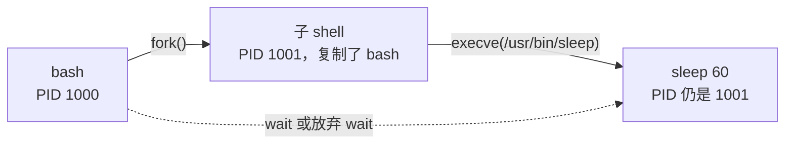

---
tags:
  - Linux
  - 进程
  - 前置知识
  - 资源隔离
created: 2026-09-18
---

# 前置：进程与线程

> [!cite] 参考资料
> `man 5 proc`、`man 2 fork`、`man 2 execve`、`man 2 clone`、`man 1 ps`、`man 1 top`、`man 1 pstree`；线程级性能分析的深水区在阶段 10（性能分析与排障）。
>
> 本篇结论来自上述资料，**命令输出尚未在实验机上逐条实测**；本机结果与文中不一致时以本机输出为准，并回填到对应小节。

> **这篇讲什么**：内核到底把什么当成「一个可以调度的东西」，以及用户态说的「进程」「线程」和它是什么关系。
>
> **必须先读什么**：会在实验机上执行命令、会用 `ps`/`top` 看基本输出即可（阶段 1《实验环境与操作纪律》）。本篇不假设你写过 C 代码。
>
> **读完能回答**：① 内核眼里的调度单位是什么？② 为什么 Linux 里「线程」不是一个独立实体？③ 进程的父子关系怎么形成，父进程先死了会怎样？
>
> 所属：[[Linux/03_进程与信号/00_导读与知识地图|03 进程与信号]] 的 1.3 前置地基 · 主要练 **S1 进程观测与建基线**

## 0. 30 秒速览

> [!abstract] 这一篇只要记住五句话
> - **内核的调度单位叫 task**。「进程」和「线程」都是用户态的叫法：**进程 = 一组共享地址空间的 task + 一个线程组 ID（TGID）**，线程 = 同一个 TGID 下的一个 task。
> - **`ps` 里的 PID 是 TGID，不是 TID**。主线程的 TID 恰好等于 PID，其余线程在 `ps` 的默认输出里**看不见**——这就是「`top` 里有个进程占满 CPU，`ps` 里却找不到它」的原因。
> - **三个系统调用撑起一切**：`fork` 复制出一个新任务、`execve` 把当前任务换成新程序、`clone` 按参数决定共享什么（`pthread_create` 走的就是它）。
> - **`fork` 本身不慢，慢的是它被高频调用**。写时复制（COW）让「复制内存」几乎免费，真正的成本在页表与内核对象；每秒几万次 `fork` 才是事故。
> - **进程树有且只有两个动作**：创建（子进程多了一个父）与收养（父进程先退出时，子进程被 PID 1 接管）。僵尸、孤儿、容器里的 PID 1，全是这两件事的推论。

## 1. 内核眼里只有 task

### 1.1 四个 ID 的对照

同一个「东西」，在不同地方有四个名字，这是新人最先被绕晕的地方。先把它们对齐：

| 名字 | 全称 | 含义 | 在哪看到 |
| --- | --- | --- | --- |
| **PID** | Process ID | 用户态说的「进程号」，实际是**线程组 ID（TGID）** | `ps` 默认输出的 `PID` 列、`/proc/<pid>/` 目录名 |
| **TGID** | Thread Group ID | 一组共享地址空间的 task 共用的号；`getpid()` 返回的就是它 | 内核态叫法，用户态看不到单独字段 |
| **TID** | Thread ID | 单个 task 的号，**调度器真正调度的对象**；主线程 TID = PID | `/proc/<pid>/task/<tid>/`、`top -H` 的第一列 |
| **LWP** | Light Weight Process | `ps` 显示 TID 时用的列名（历史叫法） | `ps -eLf`、`ps -L -p <pid>` 的 `LWP` 列 |

一句话记法：**PID 是「哪个进程」，TID 是「哪个执行流」；同进程的线程 = 同 PID、不同 TID。**

### 1.2 一个进程里的 task 共享什么、不共享什么

| 资源 | 同一 TGID 内的 task | 说明 |
| --- | --- | --- |
| 地址空间（`mm`） | **共享** | 所以一个线程写坏了内存，整个进程一起遭殃 |
| 文件描述符表 | **共享** | 一个线程打开的文件，其它线程直接可用（排查句柄泄漏时要记得这点） |
| 信号处理方式 | **共享** | 信号发给「谁」，由进程和线程两级的信号掩码决定（见子笔记 06） |
| 工作目录、`umask` | **共享** | `chdir` 影响整个进程 |
| 寄存器、栈、调度状态 | **独立** | 每个 task 各有一份，所以每个 task 都要单独被调度 |
| 独立的 PID 目录 | **独立** | `/proc/<pid>/task/<tid>/` 下能看到这个 task 自己的 `status`、`stack`、`wchan` |

两个直接推论：

1. **`/proc/<pid>/status` 里的 `VmRSS` 是整组共享的**，不是「某个线程的内存」；把各线程的数字相加会算重。
2. **一个线程崩溃会带走整个进程**。默认情况下 `SIGSEGV` 是进程级事件，所以「某个线程空指针」的结果是整个服务退出——这也是为什么多线程服务的崩溃日志里，崩溃点常常不在主线程上。

### 1.3 内核线程不是你的进程

```bash
ps -e -o pid,ppid,comm | head -20      # 验证：方括号包起来的名字（如 [kworker/0:0]）是内核线程，不是你启动的程序
ps -e --ppid 2 --no-headers | wc -l    # 验证：内核线程的数量（父进程都是 kthreadd/PID 2；本机实测 246）
```

内核自己也会创建 task（`kworker`、`kswapd0`、`kthreadd` …）。它们共用 PID 编号空间，但不是用户态程序，**不要试图去「优化」或杀掉它们**。判断方法很简单：名字带方括号。

## 2. 三个系统调用撑起一切

### 2.1 分工

| 系统调用 | 做了什么 | 用户态对应的动作 |
| --- | --- | --- |
| `fork()` | 复制出一个新 task，**新的地址空间**（写时复制），子进程从 `fork` 的返回处继续 | shell 的 `&`、命令替换 `$(...)`、管道两侧 |
| `execve()` | 用新程序**替换**当前进程的地址空间，**PID 不变** | 所有「启动一个新命令」的动作最后都落到它 |
| `clone()` | 按 flag 决定共享什么（`CLONE_VM` 地址空间、`CLONE_FILES` fd 表、`CLONE_THREAD` 同 TGID…） | `pthread_create()`、`clone3()`、容器运行时创建进程 |

记住一句话就够用：**`fork` 只是「多了一个我」，`execve` 才是「我变成了别的程序」**。日常说的「启动一个进程」，实际是 `fork` + `execve` 两步。

### 2.2 `fork` 的成本：为什么它不慢，又为什么它很危险

`fork` 不复制物理内存，而是让父子两方**先共享同一批物理页**，任何一方写入时才复制那一页——这就是写时复制（COW，Copy-On-Write）。所以：

- **单次 `fork` 的开销**主要在复制页表、创建内核对象（`task_struct`、信号结构等），与「这个进程占多少内存」的关系没有想象中那么大；
- **危险的是频率**：每秒几万次 `fork` 会把 CPU 全花在内核里（`sy` 高、`%sys` 高），同时快速消耗 PID，最终表现为「机器很卡、进程又起不来」。这就是 fork 风暴（见子笔记 09）。

### 2.3 一个最小的心智模型

在 shell 里执行 `sleep 60 &`，实际发生的是：



三个可以自己验证的点：

1. 子进程的 PID 与父进程不同（`fork` 产生了新 task）；
2. `execve` 之后 PID **没有变**（换的是程序，不是任务）；
3. 如果父进程不 `wait()` 就退出，`sleep` 会被 PID 1 收养——这就是第 3 节要讲的孤儿。

```bash
ps -o pid,ppid,pgid,cmd                                  # 验证：在同一个终端里再开一条，能看出父子关系与进程组
echo $$                                                  # 验证：当前 shell 的 PID
bash -c 'echo 子进程 PID=$$, 父进程 PID=$PPID; ps -o pid,ppid,cmd -p $$'   # 验证：fork 出来的子进程 PID 与 PPID
```

## 3. 进程树：父子与收养

### 3.1 每个 task 都有父（除了 PID 1）

内核里的 task 不是平铺的，而是有明确的父子指针：`ps` 的 `PPID` 列、`pstree` 的树形图都是它的显示形式。

```bash
ps -eo pid,ppid,stat,comm --forest | head -30    # 验证：用树形缩进显示父子关系
pstree -p | head -30                             # 验证：另一种树形视图（-p 显示 PID，-u 显示用户）
ps -o pid,ppid,comm -p <pid>                     # 验证：某个进程的父亲是谁
```

**PID 1 是唯一没有父的 task**（它的 PPID 显示为 0）。现代发行版上它就是 `systemd`，整棵进程树的根。

### 3.2 父进程先走：孤儿与收养

父进程退出、子进程还活着，这个子进程就叫**孤儿（orphan）**。内核不会让它「失去父亲」，而是把它**重新挂到 PID 1**（严格说是最近的 subreaper，通常是 PID 1）名下，由后者负责在它退出时回收。

这条规则的三个后果，都要记住：

- **它本身不是故障**：守护进程 fork 出子进程再退出，是正常设计；
- **但它会让父子关系变得难追**：`ps --forest` 里一堆进程挂在 PID 1 下，说明「启动它们的中间层已经退了」（`nohup`、`systemd` 的 `Type=forking` 服务都属这一类）；
- **回收责任跟着转移**：孤儿退出后由收养者 `wait()`，收养者如果不 `wait()`（比如容器里 PID 1 是 `bash`），就会出现僵尸堆积（子笔记 07 展开）。

### 3.3 「归属」从这里开始

除了父子关系，task 还属于**进程组**和**会话**，决定「一条 `kill` 命令能打到谁」以及「终端断开时谁会收到 `SIGHUP`」。这两个概念是子笔记 03 的内容，本篇先记住有这两层即可。

## 4. 接手一台机器时的只读检查

这一篇的动作是**巡检**，全部只读、零风险，不必包成「生产动作」，给检查表和判据就够（生产机上也可以做）：

```bash
uptime; ps -e --no-headers | wc -l               # 验证：进程（非线程）总数，用来对比「正常时是多少」
ps -eLf --no-headers | wc -l                     # 验证：task（含线程）总数——真正被调度的数量
ps -eo pid,ppid,stat,pcpu,pmem,etime,comm --sort=-pcpu | head -15
                                                 # 验证：CPU Top 15 与它们的运行时长（长跑的和刚起的要分开看）
ps -eLf --no-headers | sort -k6 -rn | head -10   # 验证：线程数与 TID 视角（结合下一条判断哪一个是热点）
ps -eo pid,nlwp,comm --sort=-nlwp | head -10     # 验证：线程数最多的进程（Java/Go/Python 服务往往排在最前）
ps -e --ppid 2 --no-headers | wc -l              # 验证：内核线程数量（基线值，不是异常）
cat /proc/loadavg                                # 验证：负载与「最近分配的 PID」，连看两次能判断 PID 的消耗速率
```

判据只有两条：

1. **`ps -e | wc -l` 与 `ps -eLf | wc -l` 的差距，就是线程带来的差距**。写进基线卡，之后「进程数翻倍」这种变化才有参照物。
2. **`/proc/loadavg` 最后一列的 PID 增长速率**是长期观察项：正常业务下它应该缓慢增长，突然跳得很快意味着有东西在批量创建进程（子笔记 09）。

把这两条连同版本信息记进资产台账，就是 S1 要求的「进程基线卡」的第一行。

## 5. 配套实验：进程与线程其实是一类东西（S1）

> [!example]- 实验 1：用一个进程看清「线程」是什么
> **环境**：任意发行版；多线程程序（Java、带线程池的 Python、nginx worker）效果更明显。
>
> **怎么做**：
> ```bash
> sleep 600 &                          # 起一个后台进程，先拿它练手
> ps -eLf | grep -w sleep              # 验证：一个进程至少对应一行线程记录（LWP 列即 TID，NLWP 是线程数）
> ls /proc/<pid>/task                  # 验证：task 目录列表与 TID 一一对应
> ps -L -p <pid> -o pid,tid,pcpu,stat,comm --sort=-pcpu   # 验证：线程级视角
> top -H -p <pid>                      # 验证：把线程当进程看——第一列显示的是 TID
> cat /proc/<pid>/status | grep -E 'Threads|VmRSS'        # 验证：线程数与整组共享的内存
> kill %1                              # 收尾
> ```
>
> **预期**：`sleep` 只有 1 个线程，`Threads:` 显示 `1`；换成真正的多线程进程后，`ps -eLf` 的行数会明显多于进程数。
>
> **风险**：无，只起一个 `sleep` 再杀掉，**生产机上也可以做**。
>
> **耗时**：约 10 分钟。
>
> **怎么退回去**：执行最后一行的 `kill %1`；确认没有残留的 `sleep` 进程。

## 6. 常见坑

| 常见做法或说法 | 后果或事实 |
| --- | --- |
| 「`ps` 里看到几个进程，系统里就有几个进程」 | `ps` 默认按进程统计，**线程不在内**；要数调度实体得用 `ps -eLf` 或看 cgroup 的 `pids.current` |
| 「`top` 里那个占 100% 的进程在 `ps` 里找不到」 | 多半是 `top -H` 或线程视图，第一列显示的是 **TID** 而不是 PID；用 `ps -L -p <pid>` 对照 |
| 「线程是内核里独立于进程的东西」 | Linux 没有独立的线程实体，只有 task；线程与进程的差别只在**共享了什么** |
| 「进程有 10 个线程，所以它占了 10 份内存」 | `VmRSS` 是整组共享的，相加会严重重复计算；看 `/proc/<pid>/status` 的 `VmRSS` 即可 |
| 「名字怪怪的进程是恶意程序，先杀掉」 | `[kworker/0:0]` 这类带方括号的是**内核线程**，杀不掉也不该杀 |
| 「子进程一定是启动它的那个程序的孩子」 | 中间层退出后子进程会被 PID 1 收养，`ps --forest` 里它挂在 PID 1 下，父子关系已经变了 |
| 「`fork` 会复制整个内存，所以很慢」 | 有写时复制（COW），单次不慢；危险的是高频 `fork` 与随之而来的 PID 消耗 |

## 7. 决策练习

> [!question]- 场景：一个 Java 服务报警「CPU 100%」，但你在 `top` 里看它的进程级 CPU 只有 8%，在 `ps -eo pcpu` 里也找不到热点
> 你下一步做什么？
> A. 认定不是 CPU 问题，转去查内存和磁盘
> B. 用 `top -H -p <pid>` 或 `ps -L -p <pid> -o pid,tid,pcpu,stat,comm --sort=-pcpu` 看线程级占用，找出跑满的那个 TID，再去应用侧对号
> C. 直接重启服务，观察是否复现
>
> **答案：B。**
> A 太快：进程级数字是**平均值**，8 核机器上一个线程跑满一颗核，进程级大约就是 12% 上下——热点被平均掉了，不是不存在。
> C 会毁掉现场：重启之后线程栈、线程名、运行时长全没了，而且大概率复发。要重启也应先取一组线程级快照。
> B 是标准动作：先把「哪个线程在吃 CPU」定位出来，再带着 TID 去看应用日志或 `jstack`，这条链路在阶段 10（性能分析与排障）会展开。

## 8. 要点自测

> [!question]- 内核眼里的「调度单位」是什么？它和「进程」「线程」是什么关系？
> - 调度单位是 **task**。用户态说的进程 = 一组共享地址空间的 task + 一个线程组 ID（TGID）；线程 = 同一 TGID 下的 task。
> - 所以「进程和线程的区别」在 Linux 里不是「两种实体」，而是**共享了哪些资源**（地址空间、fd 表、信号处理…）。
> - **第一反应不要是什么**：不要把「进程/线程」当成内核里的两种东西去背，也不要默认「线程崩了只影响线程」——默认情况下它带走整个进程。

> [!question]- `ps -e | wc -l` 和 `ps -eLf | wc -l` 为什么不一样？该信哪个？
> - 前者按进程（线程组）计数，后者按 task 计数；两者的差就是线程。
> - 判断「系统还能不能创建新任务」时，要关心的是 **task 总数**（以及 cgroup 的 `pids.current`），不是进程数。
> - **第一反应不要是什么**：不要拿 `ps aux | wc -l` 去推算进程数上限还剩多少——统计口径不对，结论一定是错的。

> [!question]- 父进程先退出后，它的子进程会怎样？
> - 被重新挂到 PID 1（或最近的 subreaper）名下，由收养者负责在它退出时回收。
> - 这解释了 `ps --forest` 里「一堆进程挂在 PID 1 下」的现象，也解释了容器里为什么不回收子进程就会堆僵尸。
> - **第一反应不要是什么**：不要看到「父进程是 PID 1」就以为它一定由 systemd 管理——`nohup`、`daemonize` 之后的进程都长得这样。

> 下一篇：[[Linux/03_进程与信号/02_前置_进程观测与proc|02 前置：进程观测与 /proc]]
