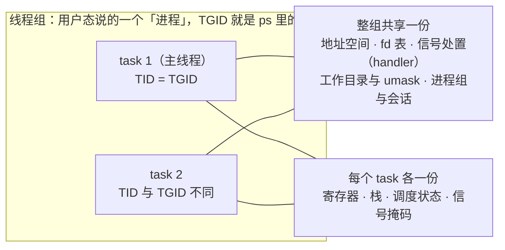

---
tags:
  - Linux
  - 进程
  - 线程
  - 原理
created: 2026-09-21
---

# 进程与线程

## 1. 为什么内核不区分「进程」和「线程」

如果内核像教科书那样维护两种实体——重型的「进程」和轻型的「线程」，那么每一次创建、调度和资源计数都要写两套代码、两套语义、两套边界条件。更麻烦的是，用户态真正想要的从来不是这两种东西本身，而是**在若干维度上各自选择「共享」或「独立」**：

- 如果我需要一个能独立崩溃、独立计数的执行体，那么这个执行体的地址空间必须独立；
- 如果我需要十几个执行流共用一份堆和连接池，那么这些执行流的地址空间必须共享；
- 如果我需要一种和主进程共享 fd 表、但换掉地址空间的东西（`posix_spawn` 的某些用法、容器运行时的某些阶段），那么它的地址空间独立、fd 表共享。

这三种需求在「进程/线程」二分法里都落不到格子上。Linux 的做法是**只保留一种调度实体**，把它叫任务（task），然后让创建动作带上一组标志位，逐项决定这次要共享什么。因此「进程」和「线程」不是内核里的两种东西，而是**同一套机制的两个参数组合**：

| 用户态的叫法 | 内核里到底是什么 |
| --- | --- |
| 进程 | 它是共享同一个地址空间的一组 task，这组 task 共用一个线程组 ID（TGID，Thread Group ID） |
| 线程 | 它是同一个 TGID 下的一个 task |
| 主线程 | 它是 TGID 恰好等于自己 TID 的那个 task |

同一套机制的两个参数组合就是这样：

**线程组 ID 就是用户态说的 PID。** `getpid()` 返回的是 TGID，`ps` 的 `PID` 列显示的也是 TGID，`/proc/<pid>/` 这个目录名同样是 TGID。而调度器真正挑选的对象是 task，它的编号是 TID（Thread ID）：`/proc/<pid>/task/<tid>/` 是按 TID 取单个线程的路径，`/proc/<tid>/` 同样能访问线程，只是 `ls /proc` 与 `getdents` 不会把它列出来，线程要 `ps -eLf` 或走 `task/` 目录才看得见。

这条设计带来一个直接的观测后果：**`ps` 数出来的「进程数」和 `ps -eLf` 数出来的「task 数」是两个量**。前者是线程组的个数，后者才是调度实体的个数。判断「这台机器还能不能创建新任务」时，要看的是后者，或 cgroup v2 的 `pids.current`——若拿 `ps aux | wc -l` 去推算剩余额度，那么统计口径从第一步就是错的。

## 2. 代价落在哪里

统一调度实体的好处是内核简单、用户态灵活，代价集中在三处。

**第一，内存的占用计数会重复。** 同一个 TGID 下的 task 共享地址空间，因此 `/proc/<pid>/status` 里的 `VmRSS` 是**整组共享的一份**，不是「某个线程的内存」。若把各线程的 `VmRSS` 相加，就会算重——它们读到的本来就是同一个数。跨进程层面的共享也一样：同一个 `libc` 的物理页被 100 个进程映射，它在 100 个进程的常驻集里各算一遍，所以**把所有进程的常驻集相加必然大于这些进程真正占用的映射页之和**（`Pss` 就是按这个口径均摊的）。但是这个合计值不能拿去和 `free` 的 `used` 比大小：`used` 里还含着 slab、页表、内核栈这些根本不属于任何进程映射的内存，因此两个口径的差值换不来一句「谁占得多」。

三种口径分别回答不同的问题：

| 口径 | 字段 | 回答什么 | 会不会重复 |
| --- | --- | --- | --- |
| 常驻 | `VmRSS` / `RssAnon`+`RssFile`+`RssShmem` | 它回答这个进程当前有多少物理页在常驻集里；由于共享页会被每个使用者各算一份，所以跨进程相加会重复计数，而在同一线程组内各线程读到的本来就是同一个数 | 会重复：共享页每个使用者各算一份，因此整机常驻集之和必然偏大 |
| 均摊 | `Pss`（`smaps_rollup`） | 它回答共享页按使用者数量均摊之后这个进程占了多少；因此共享页不会被重复计数，但它只覆盖**被映射的页**，内核内存与页表都不在其中，所以全机 `Pss` 相加只约等于被映射页之和 | 不会重复；但正因为口径更窄，它不能和 `free` 的 `used` 比大小 |
| 私有 | `Uss` | 它回答只有这个进程自己在用的页有多少；因此不会重复计数，同时也会漏掉共享带来的收益 | 不会重复，代价是看不到共享页被复用的情况 |

**凡说「这个进程占了多少内存」，必须指明是哪一种口径。** 这三个数可以相差数倍，因此混用会得出相反结论。这里只有 `Uss` 是**工具口径**：`ps -o uss` 报的是 `Private_Clean` 与 `Private_Dirty` 之和，内核的 `smaps` 与 `smaps_rollup` 里**没有** `Uss` 这个字段，要私有页就得自己把这两个字段加起来。

**第二，一个线程崩溃会带走整个进程。** 默认情况下 `SIGSEGV` 是**进程级事件**：内核在出错的那个 task 上记录信号，但它的处置动作是终止整个线程组（除非程序自己装了处理函数并选择恢复）。所以多线程服务的崩溃日志里，崩溃点常常不在主线程上——「不是主线程干的」和「主线程也一起死了」同时成立。

**第三，线程数量本身就是一笔开销。** 每个 task 都有自己的 `task_struct`（内核里表示一个 task 的数据结构，进程与线程共用同一种）与内核栈（大小由 `THREAD_SIZE` 定义，x86_64 上通常是 16 KiB 的虚拟区间；开了 `CONFIG_KASAN` 时内核栈翻倍到 32 KiB），还有一份调度实体。线程数达到几万时，仅内核栈与调度结构就会占用可观的内存，上下文切换的次数也会随之变多。因此线程数不是越多越好的免费并行度。

## 3. 共享与独立的完整清单

创建时到底共享什么，是 `clone` 系统调用的一组标志位说了算。下面这张表是排障时最需要记住的部分，因为它决定了一处出问题会波及多大范围：

| 资源                        | 同一 TGID 内 | 说明                                   |
| ------------------------- | --------- | ------------------------------------ |
| 地址空间（`mm`）                | 共享        | 若一个线程写坏内存，则整个线程组的地址空间一起被破坏，所以故障范围是整组 |
| 文件描述符表                    | 共享        | 一个线程打开的 fd，其它线程可以直接使用；因此在排查句柄泄漏时，必须把整组的 fd 一起看 |
| 信号处置（handler）             | 共享        | 处理函数是进程级的策略，而信号最终发给谁由两级掩码决定，详见《信号与优雅退出》 |
| 工作目录、`umask`              | 共享        | 若一个线程调用 `chdir`，则整组的工作目录都会改变，所以相对路径的基准属于整组 |
| 进程组与会话                    | 共享        | 它决定 `kill -<pgid>` 会打到哪些进程，详见《一个进程的一生》 |
| 寄存器、栈、调度状态                | 独立        | 每个 task 各持一份，所以每个 task 会被调度器单独挑选 |
| 信号掩码（阻塞位图）                | 独立        | 每个 task 可以阻塞不同的信号集，因此「由哪个线程处理信号」的答案就在这里 |
| `/proc/<pid>/task/<tid>/` | 独立        | 线程自己的 `status`、`stack`、`wchan` 都从这里读 |

**为什么信号掩码要独立而信号处置要共享**：处置是「收到这个信号要做什么」的策略，属于程序整体；掩码是「此刻哪个执行流愿意被打断」的状态，必须按线程来。由于两者分离，才能实现「主线程专门处理 `SIGTERM`，工作线程全部屏蔽它」这种常见模式。

## 4. 内核自己的 task

内核也需要并发执行体：回写脏页、回收内存、处理软中断、跑每个驱动的工作队列。它们也是 task，**共用同一套 PID 编号空间**，但不对应任何用户态程序：

- 父进程几乎都是 `kthreadd`（PID 2），它是内核线程的祖先；例外是 `kthreadd` 自己，它的 `PPid` 为 0；
- 名字在 `ps` 输出里带方括号，如 `[kworker/0:0]`、`[kswapd0]`、`[migration/1]`；
- 它们**属于 root cgroup**（`0::/`）：由于内核栈同样算在整机内存里，所以 cgroup v2 的 `memory.stat` 就把它记在 `kernel`/`kernel_stack` 两行上，只是它们不构成任何用户负载。

判断一条：**看名字带方括号**——但方括号只表示「命令行不可读」，僵尸进程同样带方括号，所以可靠判据是 `/proc/<pid>/cmdline` 为空且 `/proc/<pid>/exe` 不存在。运维上不需要也不应该去「优化」或杀掉它们；当 `kworker` 占用 CPU 时，要顺着它在做什么去找触发者，而不是对它本身动手。

`kthreadd` 与 PID 1 的区别值得记清：PID 1 是用户态的第一个进程（现代发行版上是 init 系统），`kthreadd` 与它平级，是内核线程的根。`ps` 里 PID 1 的父是 0（不存在），PID 2 的父同样是 0。

## 5. 进程树：只有创建与收养两件事

每个 task 都有父指针，除了 PID 1。父子关系只有两个动作：

**创建**：父进程调用 `fork`/`clone` 造出子进程，子进程的 `PPID` 指向父进程。

**收养**：若父进程先退出而子进程还活着，则这些子进程（叫孤儿，orphan）会被**重新挂到最近的 subreaper**（「再收养者」：内核里被指定为孤儿新父亲的那个 task，默认为 PID 1）名下。默认的 subreaper 是 PID 1；程序可以用 `prctl(PR_SET_CHILD_SUBREAPER)` 把自己声明成 subreaper，容器运行时与某些服务管理器正是这么做的。

收养带来三个推论，后面每一条都会用到：

1. **它不是故障**。守护进程 fork 出子进程再退出，本来就是正常设计；
2. **它让父子关系失去追踪价值**。`ps --forest` 里一大片进程挂在 PID 1 下，说明「启动它们的中间层已经退了」——`nohup` 后的进程、`Type=forking` 的服务、容器里的进程都属于这一类。因此看到父进程是 PID 1，不能反推「它由 init 直接管理」；
3. **回收责任跟着转移**。谁收养，谁负责在它退出时 `wait()`。若收养者不 `wait()`（比如容器里的 PID 1 是个不回收子进程的 `bash`），则僵尸会持续堆积。

## 6. 机制在本名与字段上的边界

**「进程」这个词在两个语境里指不同的东西。** 内核眼里它是一组 task 加一个 TGID；运维说「把这个进程重启一下」时，指的是「这个线程组里的所有 task 全部消失、然后重新创建」。前者解释了为什么一个进程有多个 TID，后者解释了为什么 `systemctl restart` 之后线程数、fd 数、内存全部从头来过。

**线程组是调度的边界，不是隔离的边界。** 同一 TGID 的 task 共享地址空间与 fd 表，所以「限制这个进程能开多少文件」实际上是限制整组；而 namespace 与 cgroup 划的是**另一套边界**——它们按进程（以及它的后代）而不是按线程组来划分。默认（`domain`）口径下，一个进程的多个线程不会落在不同的 cgroup 里，界面上看到的 `cgroup.type` 就是 `domain`；但这不是绝对约束：自内核 4.14 起，cgroup v2 的 **thread mode** 允许把同一进程的线程散布在一个 threaded subtree 内，这类子树只认得 threaded 控制器——`cpu`、`cpuset`、`perf_event`、`pids`。因此设计隔离方案时，要先看清目标层级的 `cgroup.type` 是 `domain` 还是 `threaded`。

**容器把 PID 空间变成了树。** PID namespace 的嵌套从它引入起就存在，自内核 3.7 起嵌套深度上限为 32 层：容器里的 `PID 1` 在宿主上只是某个普通 PID，而它的子进程在容器内看到的编号与宿主上完全不同。所以「容器里的 1 号进程」这个词必须带上视角——它同时具有两个身份：宿主眼里的普通进程、容器内受 PID 1 特殊保护并负责回收孤儿的 init。这两副担子合在一起，就是容器里「`stop` 停不掉 + 僵尸堆积」的根源。

## 常见误解

| 常见说法 | 事实 |
| --- | --- |
| 「Linux 里线程是独立于进程的另一种实体」 | 内核只有 task，因此进程与线程的差别只是「共享了哪些资源」这一组参数 |
| 「`ps` 里有多少行就有多少个进程」 | 默认输出按线程组统计，所以线程要 `ps -eLf` 或 `task/`、`/proc/<tid>/` 才看得到 |
| 「主线程的 TID 和 PID 不一样」 | 主线程的 TID 恰好等于 TGID，也就是 `ps` 里那个 PID，而其余线程的 TID 都不同 |
| 「这个进程有 10 个线程，所以它占 10 份内存」 | `VmRSS` 是整组共享的一个数，因此组内各线程读到的就是同一个数；重复计数发生在**跨进程**把常驻集相加的时候 |
| 「把所有进程的内存加起来应该等于整机用量」 | 共享页被跨进程重复计数，因此相加必然偏大；不过这个合计值只该跟均摊口径的 `Pss` 比较，而 `free` 的 `used` 还含 slab、页表、内核栈，两者不能直接比大小 |
| 「某个线程崩了只影响那个线程」 | 由于默认的致命信号处置是终止整个线程组，所以线程崩就等于进程崩 |
| 「信号在哪个线程上处理是确定的」 | 内核挑一个没有屏蔽该信号的线程执行，而装 handler 是进程级的，因此执行它的线程不确定 |
| 「`[kworker/0:0]` 这种可疑进程应该杀掉」 | 那是内核线程，杀不掉也不该杀；要找的是触发它忙碌的来源 |
| 「父进程是 PID 1，说明它由 init 管」 | 中间层退出后子进程会被收养，因此 `nohup`、`Type=forking` 都会造成这个外观 |
| 「容器里的 1 号进程就是宿主上的 1 号进程」 | PID namespace 是树状嵌套的，因此两者是两个不同的 task |

## 要点自测

**问：内核为什么不区分「进程」和「线程」，这个选择换来了什么、代价是什么？**
答：内核只保留 task 一种调度实体，创建时用一组标志位逐项决定共享哪些资源。换来的是内核实现简单、用户态可以自由组合共享维度；代价是内存的占用计数会重复、线程组的崩溃是整组事件、线程数本身要付内核结构的开销。

**问：`ps -e | wc -l` 与 `ps -eLf | wc -l` 的差是什么？判断「还能不能创建新任务」该看哪个？**
答：两者的差就是线程数：前者数线程组，后者数 task。判断额度要看 task 数或 cgroup 的 `pids.current`/`pids.max`，因为被限制和被杀的都是 task。

**问：同一个进程的多个线程，为什么信号掩码各有一份而信号处置只有一份？**
答：处置函数是「收到信号做什么」的程序级策略，属于整个线程组；掩码是「此刻愿不愿意被打断」的执行流状态，必须逐线程。由于这个分离，「主线程处理 `SIGTERM`、工作线程全部屏蔽」才成为可能。

**问：孤儿进程被收养这件事，为什么会造成僵尸堆积？**
答：回收责任随收养转移。收养者必须在子进程退出时 `wait()`；若它不 `wait()`——典型是容器里作为 PID 1 的 `bash`——则退出状态无人领取，僵尸就会堆积。

**问：一个线程访问了野指针，为什么整个服务都退出了？**
答：默认情况下致命信号（`SIGSEGV`）的处置动作是终止整个线程组。除非程序自己安装了处理函数并选择恢复，否则崩溃的执行流不是唯一受影响的对象。

**第一反应不要做什么**：不要把「进程/线程」当成内核里的两种东西去背；不要用线程组个数的口径去推算 task 额度；不要用各线程的 `VmRSS` 相加；不要把「父进程是 1」当成「由 init 管理」的判据。

## 参考文档

- `man 2 clone`：标志位清单与「共享什么」的权威定义；`man 2 fork`、`man 2 execve`。
- `man 5 proc`：proc 文件系统的总览；具体字段出处看拆出来的子页——`man 5 proc_pid_status`（`Tgid`/`Pid`/`Threads`/`VmRSS`/`RssAnon`/`RssFile`/`RssShmem`）、`man 5 proc_pid_task`（`/proc/<pid>/task/`）、`man 5 proc_pid_smaps`（`Pss` 的均摊定义，以及 `Private_Clean`/`Private_Dirty`；`Uss` 不在其中）。
- `man 5 proc_pid_cmdline`：命令行不可读（方括号）与僵尸进程的 `cmdline` 为空、`exe` 不存在的判据。
- `man 1 ps`：`-L`/`-eLf`/`-o` 的列定义，以及「`ps` 默认不显示线程」这一行为。
- `man 2 prctl`：`PR_SET_CHILD_SUBREAPER` 与 subreaper 的语义。
- `man 7 pid_namespaces`、`man 7 namespaces`：PID namespace 的嵌套与 PID 1 在容器内的特殊地位。
- 内核文档 `Documentation/admin-guide/cgroup-v2.rst`：pids 控制器的计数口径（按 task 计）。
- `man 7 signal`：进程级与线程级信号处置、掩码与投递目标的定义。
- 本节引用的 man 页与内核文档按**与目标机器同一主版本（当前基线 6.x）**取；路径与语义在版本间会变，所以凡涉及默认值与版本门控，以现场 `man`、`sysctl`、`systemctl show` 的实际输出为准。
