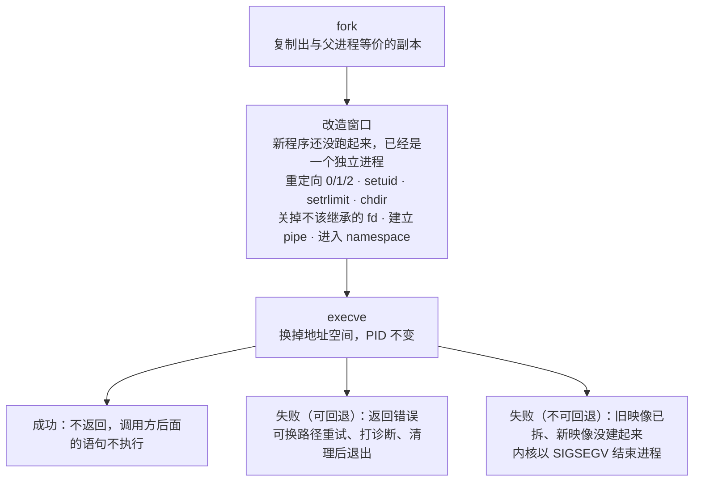
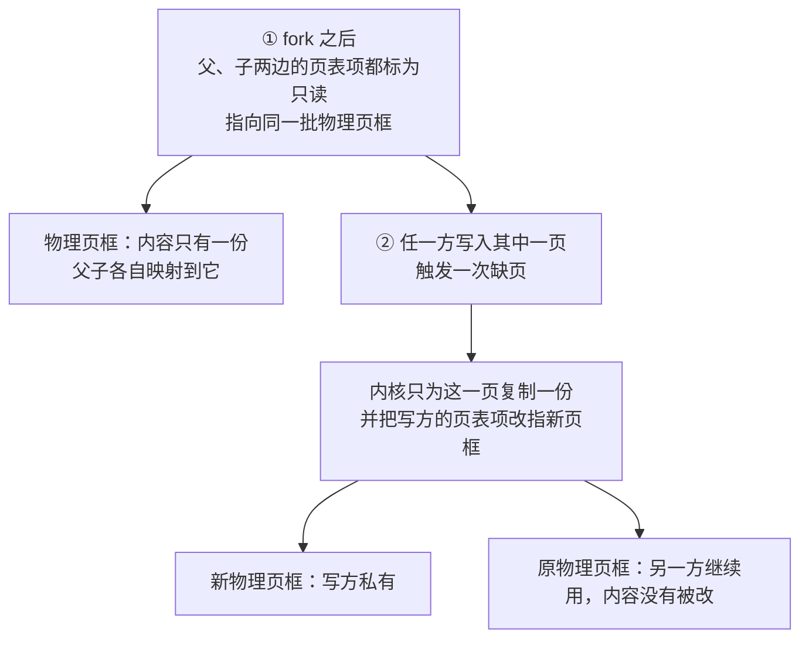

---
tags:
  - Linux
  - 进程
  - fork
  - exec
  - 原理
created: 2026-09-21
---

# 进程的诞生：fork 与 exec

## 1. 为什么创建进程要拆成两步

既然目标只是「跑一个程序」，为什么不让一个系统调用直接完成「创建进程并把指定程序装进去」？Windows 的 `CreateProcess` 就是这么做的。Linux 拆成两步（`fork` + `execve`）有明显的代价：一次「启动命令」要进两次内核、走两次权限与审计检查，`fork` 出来的中间态（一个几乎什么都没做的父进程副本）在多数场景下是纯粹的浪费。

换来的是**能力，而不是效率**：

- **在 exec 之前可以按需改造子进程**。重定向标准输入输出、切换用户（`setuid`）、设置资源限制（`setrlimit`）、改工作目录、关掉不该继承的 fd、建立 pipe、进入新的 namespace——这些动作都要求在「新程序还没开始跑」和「已经是一个独立进程」之间的那个窗口里完成。这正是 shell 实现 `cmd < in > out 2>&1`、`sudo`、`systemd` 的服务启动、容器运行时的第一步所依赖的机制；
- **父进程的地址空间是子进程的模板**。`fork` 之后子进程是父进程的完整副本，shell 用它实现 `$(...)`、管道两侧、`&` 后台作业——子进程继承父进程已经打开的文件、环境、函数定义；
- **失败可以回退**。`execve` 失败时返回错误而不是终止进程，所以调用方可以换一个路径重试、打印诊断、或者清理后再退出；唯一的例外是**越过不可回退点**之后的失败（典型诱因是资源耗尽）——旧映像已经拆掉、新映像没能建起来，内核直接以 `SIGSEGV` 结束进程（3.17 之前是 `SIGKILL`），调用方拿不到任何返回值。若合成一个调用，失败点就落在「进程已经建出来但程序没跑起来」这个尴尬的中间状态上。

两步之间被利用的正是那个中间窗口：

拆两步的代价有一个现代解法：`posix_spawn` 是**库函数**（`man 3`），它实际走的是 `clone3` 加一小撮标志（`CLONE_VM`、`CLONE_VFORK`、`CLONE_CLEAR_SIGHAND`）——内核不支持 `clone3` 时才退回 `clone`——把「fork 完再立刻 exec」这条路径的页表复制成本降到最低。所以「fork 很贵」这句话在今天的很多路径上已经不成立——真正贵的是**在高内存进程上 fork 之后不立刻 exec**。

## 2. fork：复制了什么，没复制什么

`fork` 的语义是「造一个和当前 task 等价的副本」。它必须复制的东西分三类：

| 类别 | 具体内容 | 备注 |
| --- | --- | --- |
| 内核控制结构 | `task_struct`、调度实体、信号结构、`task_struct` 里的统计字段 | 这是不可省的开销，也是「创建风暴会烧内核态 CPU」的原因 |
| 页表 | 虚拟地址到物理页框的映射 | 与**映射的页数**成正比——看的是地址空间里到底映射了多少页（`VmSize` 大不等于页表多），与常驻集（`VmRSS`）无关 |
| 资源与限制 | 资源限制（`RLIMIT_*`）、信号处置与掩码、fd 表（引用同一批文件对象）、cwd、`umask`、进程组与会话 | 「继承」在运维上比「复制」更重要 |

**没有复制的是物理内存内容。** `fork` 把父子两边的页表项都标成只读并指向同一批物理页框，任何一方写入时触发一次缺页，内核才为它复制那一页——这就是写时复制（Copy-On-Write，COW）：

由此得到三条判断：

**一，单次 `fork` 的开销与「进程占多少内存」不是线性关系。** 决定成本的是页表规模与内核对象，不是常驻集大小。一个地址空间 20 GiB（`VmSize`）但映射稀疏、常驻只有几 MiB（`VmRSS`）的进程，`fork` 可能比一个地址空间 2 GiB 但映射密集的进程更快——两个数都在 `/proc/<pid>/status` 里。

**二，真正的成本出现在「fork 之后写多少」。** 备份程序、快照、数据库的 `BGSAVE` 都是「`fork` + 随后大量写」的形态：写入的每一页都要复制一次，峰值内存需求由**复制了多少页**决定。规划这类任务的内存时，看的是写入量而不是进程原大小。

**三，承诺账本在 `fork` 的瞬间就增加。** 提交记账（commit accounting）不因为「物理页是共享的」就免单。所以在严格超额承诺策略下（`vm.overcommit_memory=2`：额度上限是 `CommitLimit`，已承诺量是 `Committed_AS`），一个大的 `fork` 可能因为承诺额度不足而失败，即使物理内存看起来很充裕。

**`fork` 失败的两种错误码必须在第一时间分清**：

| 错误码 | 含义 | 典型来源 |
| --- | --- | --- |
| `EAGAIN` | 资源暂时不可用 | 撞到某个任务数上限：`RLIMIT_NPROC`（按 real UID 计）、cgroup 的 `pids.max`、`kernel.pid_max`、`kernel.threads-max` |
| `ENOMEM` | 内存不足 | 内核结构或页表分配失败、承诺额度不足（`vm.overcommit_memory=2`）、子进程所在 PID namespace 的 init 已终止 |

**`RLIMIT_AS`/`RLIMIT_DATA` 不约束 `fork`**——它们只在 `mmap`/`brk` 这类扩张地址空间的动作上生效，所以「地址空间被限住了就 fork 不出来」不是判据。

两者对应完全不同的修法，所以「起不了进程就把 `ulimit -u` 调大」是无效动作——它只可能命中四种上限中的一种，而且按 UID 计数的那一种**在持相关特权或 real UID 为 0 时根本不执行**，不能当作判据。

## 3. execve：什么被换了，什么留下来了

`execve` 用新程序替换当前进程的地址空间，**PID 不变**。它的继承行为是排障时最容易判断错的地方，因为它决定了「重启之后为什么还占着旧端口」「子进程为什么继承了父进程的句柄」这类现象。

| 项目 | `execve` 之后 |
| --- | --- |
| PID / TGID | 不变（换的是程序，不是任务） |
| 地址空间、代码、堆、栈、映射 | 全部替换 |
| 环境变量 | 由调用方传入（`execve(path, argv, envp)`） |
| 文件描述符 | **默认保留**，除非标了 `FD_CLOEXEC`；0、1、2 是例外——若这三个 fd 在 exec 前是关闭的，而新程序带 set-user-ID/set-group-ID 位会让进程获得特权，系统可能替每个描述符打开一个未指定的文件，所以不能假设它们跨 `exec` 一定还是关着的 |
| 文件描述符的偏移量 | 保留（父子共用的还是同一个「打开文件描述」） |
| 信号处理函数 | **重置为默认动作**；被显式忽略的信号仍保持忽略 |
| 信号掩码 | 保留 |
| 工作目录、`umask`、资源限制 | 保留 |
| 进程组、会话、控制终端 | 保留 |
| 父进程 | 不变 |
| 已挂起的信号 | 保留——被屏蔽而挂起的信号不会因为 `exec` 消失，新程序仍能用 `sigpending`/`sigwait` 取到（多线程进程 exec 时，其余线程连同它们的线程级挂起信号一起被销毁） |
| 内存映射 | 全部消失，分三种情形：匿名 `mmap` 区被清除、附着的 System V 共享内存段被 detach（段本身还在，只是这个进程不再映射它）、POSIX 共享内存区被 unmap——这是「exec 之后共享内存段不见了」的原因 |

四条实务推论：

**`execve` 成功不返回。** 只有失败才回到调用方。所以「`exec` 之后还执行了下一条语句」本身就是失败的证据。

**fd 默认泄漏到新程序。** 这是历史上「父进程打开的日志文件句柄被子进程一直占着，`df` 与 `du` 对不上」的根源；对不上还有另一条常见来路——**文件已经 `rm` 掉但仍有进程持有它的 fd**：`du` 顺着目录项走，已经看不见这个文件，`df` 算的是文件系统里真实占用的块，只要还有一个打开的文件描述指过去，空间就没还回来。现代做法是在打开 fd 时就用 `O_CLOEXEC`（或 `pipe2`）标上，而不是事后逐个 `fcntl`。

**信号处置被重置，掩码不重置。** 一个屏蔽了 `SIGTERM` 的进程 `exec` 之后，新程序**仍然屏蔽** `SIGTERM`，但没有人再处理它。排查「这个服务对 `SIGTERM` 没反应」时，这一条和「应用自己屏蔽了信号」都要查。

**「重启服务」与「换一个进程」是两件事。** 服务管理器重启服务时通常新 `fork` 一个再 `exec`，PID 会变；而部分程序的热重启是**自己 `exec` 自己**——PID 不变、地址空间全换。看到「PID 没变但版本变了」，那不是幻觉。

## 4. 一个系统调用，多种创建方式

`clone` 是 `fork` 的通用形式：创建动作带一组标志位，逐项决定共享什么。用户态看到的 `fork`、`pthread_create`、容器运行时的进程创建，走的都是它，区别只在标志组合。

| 标志组 | 作用 | 得到什么 |
| --- | --- | --- |
| `CLONE_VM`、`CLONE_FS`、`CLONE_FILES`、`CLONE_SIGHAND`、`CLONE_THREAD`、`CLONE_SYSVSEM`、`CLONE_SETTLS`、`CLONE_PARENT_SETTID`、`CLONE_CHILD_CLEARTID` | 共享地址空间、文件系统信息、fd 表、信号处置、线程组；后排四项负责 System V 信号量的 undo 语义、线程局部存储（TLS）以及 futex 要用的 TID 写回 | 线程 |
| `CLONE_NEWPID`、`CLONE_NEWNET`、`CLONE_NEWNS`、`CLONE_NEWUSER`、`CLONE_NEWUTS`、`CLONE_NEWIPC`、`CLONE_NEWCGROUP` | 新建各类 namespace | 容器里的进程视角 |
| `CLONE_PARENT`、`CLONE_PIDFD`、`CLONE_VFORK` | 与父进程同父、返回 pidfd、父进程阻塞直到子进程 exec/退出 | 特定用途 |

这组标志不会由应用自己拼：`pthread_create` 交给 glibc 之后，最终是一次把上面这些标志连同 TLS、TID 写回一起打包好的 `clone3`（内核不支持 `clone3` 时退回 `clone`）。

`vfork` 是历史上的一个特例：子进程**直接使用父进程的地址空间**，父进程被挂起，直到子进程 `exec` 或退出。它的存在是为了在「`fork` 立刻 `exec`」的路径上省掉页表复制，代价是子进程在 `exec` 前的边界比「不能碰内存」更严：除了保存 `vfork` 返回值的那一个 `pid_t` 变量，它不能改动任何数据、不能从当前函数返回、也不能调用 `_exit` 与 `exec` 族之外的任何函数，越界就是未定义行为。还要分清一点：「父进程被挂起」是 Linux 的实现语义，不是 POSIX 给 `vfork` 的保证——标准对 `vfork` 的要求弱于 `fork`，把两者做成同义词也算合规（POSIX.1-2008 已把 `vfork` 移出标准）。现代 `posix_spawn` 与 `clone3` 已经把这条路做得更安全，新代码不需要理解 `vfork` 的细节，但看到老程序的栈里出现 `vfork` 时要知道它意味着「父进程此刻被挡住了」。

`CLONE_PIDFD` 是对一个长期痛点的回应：PID 会复用，所以「记住一个数字然后在稍后对它发信号」是不安全的——那个 PID 可能已经属于别的进程。pidfd（进程文件描述符）把进程变成一个可持有、可 `poll`、会随进程退出而失效的句柄，解决了「先检查再动手」之间的竞态。用之前先确认内核版本：`CLONE_PIDFD` 与 pidfd 要 **5.2+**，配套的 `pidfd_open`、`clone3` 要 **5.3+**。

## 5. 创建这件事的代价：fork 风暴

单次创建的成本分三段：

1. **复制内核控制结构**：`task_struct`、调度实体、信号结构；页表是另一笔开销，与映射的页数成正比；
2. **`execve` 的加载**：把可执行文件与依赖库映射进地址空间——这通常是「启动慢」的主要部分，也是「冷启动」与「热启动」差别的来源；
3. **调度与记账**：新 task 进运行队列，短命 task 带来大量上下文切换。

单次都不贵，**贵的是频率**。一个「每个请求 `fork` 一次」的老式服务，QPS 上到几千时会出现一组特有现象：内核态 CPU 占比高、上下文切换速率高、`/proc/loadavg` 最后一列（最近分配的 PID）快速跳动、同时业务开始报「起不了新进程」。

这条链条的关键在于**它是自我强化的**：CPU 时间被内核拿去创建进程，能用于干活的就少；进程被创建出来又立刻退出，PID 消耗加速；到了上限附近，重试逻辑往往开始疯狂重试，把消耗推到更高。所以 fork 风暴的处置方向是**在源头减量**（限流、改模型），扩上限只是把撞墙时间往后推，而且会把整机上限的改动影响扩散到所有服务。

## 6. 守护进程化：一段必须看懂的历史

老式服务把自己变成守护进程（daemonize）的完整流程，`man 7 daemon` 列的是一份 15 步清单——关掉多余的 fd、重置信号处置与掩码、清理环境、`fork` 两次、`setsid`、把标准流接到 `/dev/null`、`umask(0)`、`chdir("/")`、写 PID 文件、降权、通知父进程等；其中真正「脱离终端」的那一段，常被压缩成下面这四步来看：

1. `fork` 一次，父进程退出——子进程变成孤儿，被 PID 1 收养，从此不再受原会话的牵挂；同时它的 PID 不等于继承来的进程组 ID，因此**不是进程组组长**——而进程组组长调用 `setsid()` 会被内核以 `EPERM` 拒绝，这一步正是为了让第二步能成功；
2. `setsid()`——新建会话，脱离控制终端；
3. 再 `fork` 一次——确保自己不是会话首进程，因此永远无法再获得控制终端（这是第二步唯一没有覆盖的情形：会话首进程在打开一个尚未被占用的终端时可以获得它）；
4. `chdir("/")`、`umask(0)`、把标准输入输出错误重定向到 `/dev/null` 或日志文件。

读懂这四步的用处是**看懂老服务的行为**：为什么它的 `PPID` 是 1、为什么 `tty` 列是 `?`、为什么它的日志出现在某个自己写的文件里而不是 journal 里、为什么它 fork 出来的 worker 全都挂在自己的进程树下。

**现代替代方案是交给 init 系统**：服务保持前台运行，日志交给 journald，重启策略、资源上限、依赖顺序全部由 unit 描述。**不要在新脚本里手写这套流程**——手写出来的守护进程没有重启策略、没有日志轮转、没有资源边界，出问题时也没有任何状态可查。

## 常见误解

| 常见说法 | 事实 |
| --- | --- |
| 「`fork` 会复制整个内存，所以内存大的服务不能 fork」 | 物理页靠写时复制共享；成本在页表与内核对象，以及 `fork` 之后写入导致的复制 |
| 「重启服务之后 PID 一定会变」 | 内部自己 `exec` 自己的热重启，PID 不变、地址空间全换；只有「新 fork 再 exec」才换 PID |
| 「`exec` 之后一切都是新的」 | PID、fd、cwd、`umask`、资源限制、信号掩码全保留；fd 与信号掩码是「重启后还占着旧资源」的原因 |
| 「`exec` 之后文件偏移量从头开始」 | 保留。父子共用的还是同一个「打开文件描述」，所以偏移量是共享的 |
| 「子进程不会继承父进程打开的句柄」 | 默认继承，除非标了 `FD_CLOEXEC`；这是句柄泄漏常见的形态之一——被这样占住的文件即使已经 `rm`，磁盘空间也不会还给文件系统 |
| 「`fork` 失败只有内存不足」 | `EAGAIN`（撞任务数上限）与 `ENOMEM`（内核结构/页表分配、承诺额度）是两类，判据与修法都不同 |
| 「高并发下每个请求 fork 一次也没问题，操作系统会处理」 | 每秒几万次创建会把 CPU 烧在内核态并耗尽 PID；这是自我强化的故障 |
| 「`vfork` 和 `fork` 差不多」 | 差别是根本性的：`vfork` 的子进程在 `exec`/退出前直接共享父进程地址空间，可改动范围被压到只能写保存返回值的那一个 `pid_t`；Linux 还会把父进程挂起等它，但这一条是实现语义，POSIX 并未要求 |
| 「记住 PID 稍后再操作它是安全的」 | PID 会复用；跨时间引用一个进程应该用 pidfd，而不是数字 |
| 「`nohup`/`setsid` 就是守护进程化」 | 它们只解决「别被终端带走」；自启、重试、日志、资源上限都不在其中 |

## 要点自测

**问：创建进程为什么拆成 `fork` + `execve` 两步？这个拆分换来了什么？**
答：换来的是「在新程序运行前改造子进程」的窗口——重定向、切换用户、设置限制、改变 namespace 都在这个窗口完成；同时 `execve` 失败可以回退，父进程的地址空间还能作为子进程的模板。代价是两次陷入内核与一个中间态。

**问：`fork` 的开销与进程的内存占用是什么关系？什么情况下它才真的贵？**
答：与映射的页数（页表规模）和内核对象数量相关，与常驻集大小不是线性关系。真正贵的情形是「fork 之后大量写」：每一页写入都要复制一次，峰值由写入量决定。

**问：`execve` 之后哪些东西保留？举两个因此产生的真实故障。**
答：保留 PID、fd、cwd、`umask`、资源限制、信号掩码、进程组与会话。两个后果：默认继承的 fd 让旧连接/旧日志文件一直占着（`df` 与 `du` 对不上、端口仍被占用）；保留下来的信号掩码让新程序在无人处理的情况下继续屏蔽某个信号（表现为「对 `SIGTERM` 没反应」）。

**问：`fork` 失败时的 `EAGAIN` 与 `ENOMEM` 分别指向什么？为什么不能只调 `ulimit -u`？**
答：`EAGAIN` 指向任务数上限（`RLIMIT_NPROC` 按 real UID 计、cgroup `pids.max`、`kernel.pid_max`、`kernel.threads-max`）；`ENOMEM` 指向内核结构与页表分配、承诺额度不足，或子进程所在 PID namespace 的 init 已终止。`ulimit -u` 只覆盖其中一种，而且是按 UID 计数的，在持相关特权或 real UID 为 0 时根本不执行。

**问：为什么「扩上限」不能解决 fork 风暴？**
答：风暴的根源是创建速率，扩上限只改变撞墙的时间点，不改变速率；同时它会消耗更多 PID 与内核态 CPU，并让整机上限的改动波及所有服务。正确方向是在源头减量。

**第一反应不要做什么**：不要用「内存大所以不能 fork」当作容量结论；不要在 `fork` 失败时先动 `ulimit`；不要假设 `exec` 之后一切都重置；不要在新代码里手写 daemonize 那套流程。

## 参考文档

- `man 2 fork`、`man 2 clone`、`man 2 execve`、`man 2 vfork`：语义、返回值、错误码与版本注记。
- `man 3 posix_spawn`：现代「创建并执行」的库函数路径；注意它属 `man 3`（库函数）而不是系统调用。
- `man 2 pidfd_open`、`man 2 clone`（`CLONE_PIDFD`）：pidfd 的用途与语义。
- `man 2 prctl`：subreaper 与进程相关的其他属性。
- `man 2 fcntl`（`FD_CLOEXEC`）、`man 2 open`（`O_CLOEXEC`）、`man 3 pipe`（`pipe2`）：fd 继承的控制手段。
- `man 7 daemon`：SysV 守护进程化的 15 步清单、新式守护进程需要做什么，以及为什么现代做法是让 init 系统托管。
- `man 2 setrlimit`、`man 5 proc_pid_limits`：`RLIMIT_NPROC`/`RLIMIT_AS`/`RLIMIT_DATA` 的口径。
- 本节引用的 man 页与内核文档按**与目标机器同一主版本（当前基线 6.x）**取；路径与语义在版本间会变，所以凡涉及默认值与版本门控，以现场 `man`、`sysctl`、`systemctl show` 的实际输出为准。

